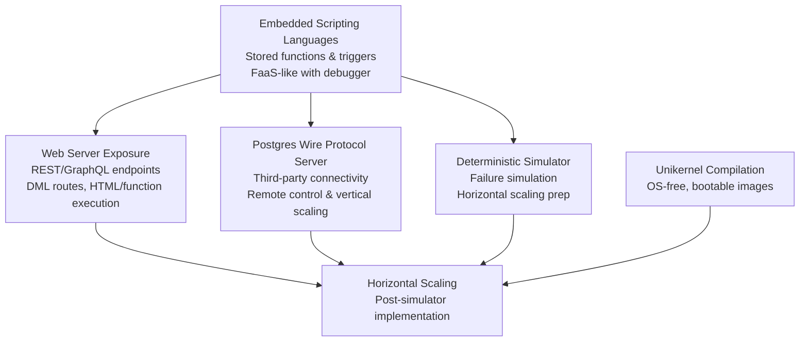

<div align="center">
   

   <p>Moving computation to data.</p>

  <p>
     <a href="https://oxibase.xyz">Docs</a> •
     <a href="https://github.com/oxibase/oxibase/releases">Releases</a>
  </p>

  <p>
     <a href="https://github.com/oxibase/oxibase/actions/workflows/ci.yml"></a>
     <a href="https://codecov.io/gh/oxibase/oxibase"></a>
<a href="https://app.fossa.com/projects/git%2Bgithub.com%2Foxibase%2Foxibase?ref=badge_shield" alt="FOSSA Status"></a>
     <a href="https://crates.io/crates/oxibase"></a>
     <a href="https://github.com/oxibase/oxibase/releases"></a>
    <a href="LICENSE"></a>
  </p>
</div>


[](https://app.fossa.com/projects/git%2Bgithub.com%2Foxibase%2Foxibase?ref=badge_large)

## Overview

OxiBase is a research platform focused on bringing computation as close as
possible to the data itself. Our goal is to investigate how embedding
computation within the database management system, by co-locating logic and
data, can eliminate inefficiencies and complexities and enable self-managing
systems. We want to provide user-defined functions and libraries to empower
developers to run business logic directly where the data lives, exploring new
patterns for local computing and evolving the concept of a 'Modern Mainframe'.

---

> **⚠️ ARCHITECTURAL PIVOT IN PROGRESS**
>
> Oxibase is evolving from an embedded SQL library into a distributed Unikernel
> "Mainframe" through iterative research. The documentation below details the
> **Vision** (our hypotheses) and the **Core Engine** (current implementation).

---

## Vision

In our ongoing research into distributed systems architecture, we hypothesize
that the "Modern Mainframe" paradigm represents a fundamental rejection of the
emergent complexity observed during the microservices epoch. The historical
bifurcation of "App Server" and "Database Server" was necessitated by hardware
constraints that have since been mitigated through advances in computing
density. By experimentally collapsing this separation, Oxibase positions the
DBMS not merely as a storage substrate but as the active computational core of
operations, enabling co-location of logic and data to eliminate observed
network latency and serialization inefficiencies in contemporary distributed
architectures.


### Project Philosophy

- **Self-sufficiency:** Oxibase aspires to be a fully self-contained system, minimizing external dependencies for both development and deployment.
- **Strong Opinions:** The architecture and feature set are intentionally opinionated, favoring bold, clear principles over generic extensibility.
- **Learning & Research:** Oxibase is a playground for exploring new ideas in database systems, distributed architectures, transactionality, and co-location of data and logic. Continuous learning and disseminating insights are core to the project.
- **Heavily Tested:** Reliability and correctness matter deeply. Features and infrastructure are expected to be exhaustively tested.
- **Accessible for Humans:** Readability and clarity of code, configuration, and operation are prioritized—even at the expense of some automation or performance.

#### Explicit Non-Goals

- **Maximum Performance:** Raw benchmark performance is not the primary pursuit. Reasonable performance is preferred, but clarity and correctness take precedence.
- **Strict Standards Conformance:** While best effort will be made for compatibility (e.g., SQL, network protocols), strict adherence to industry standards is not a goal. Deviations may be made for clarity, simplicity, or research motivations.
- **Prioritizing Automation Over Clarity:** Design choices that favor ease of maintenance, modification, or explanation—even if that leads to less automation or a "bottleneck" for throughput—will be preferred.
- **Generic Extensibility:** Oxibase is explicitly not "one size fits all." It targets specific philosophies and refuses to chase universal flexibility.

Currently, active efforts focus on embedded scripting, web exposure, wire protocol support, simulation for scaling, unikernel compilation, and autonomous networking:



See [our roadmap](./docs/_docs/roadmap.md) for details.

## Architecture

```
src/
├── api/        # Public API (Database, Connection, Rows)
├── core/       # Types (Value, Row, Schema, Error)
├── parser/     # SQL lexer and parser
├── planner/    # Query planning
├── optimizer/  # Cost-based query optimizer
├── executor/   # Query execution engine
├── functions/  # 100+ built-in functions
│   ├── scalar/     # String, math, date, JSON
│   ├── aggregate/  # COUNT, SUM, AVG, etc.
│   └── window/     # ROW_NUMBER, RANK, LAG, etc.
└── storage/    # Storage engine
    ├── mvcc/       # Multi-version concurrency control
    └── index/      # B-tree, Hash, Bitmap indexes
```

## Installation

```bash
# Add to Cargo.toml
[dependencies]
oxibase = "0.1"
```

Or build from source:

```bash
git clone https://github.com/oxibase/oxibase.git
cd oxibase
cargo build --release
```

Or build from source:

```bash
git clone https://github.com/oxibase/oxibase.git
cd oxibase
cargo build --release
```

## Quick Start

### As a Library

```rust
use oxibase::api::Database;

fn main() -> Result<(), Box<dyn std::error::Error>> {
    let db = Database::open_in_memory()?;

    db.execute("CREATE TABLE users (id INTEGER PRIMARY KEY, name TEXT)", ())?;
    db.execute("INSERT INTO users VALUES (1, 'Alice')", ())?;

    for row in db.query("SELECT * FROM users", ())? {
        let row = row?;
        println!("{}: {}", row.get::<i64>(0)?, row.get::<String>(1)?);
    }

    Ok(())
}
```

### Command Line

```bash
./oxibase                                    # In-memory REPL
./oxibase --db "file:///path/to/data"        # Persistent database
./oxibase -q "SELECT 1 + 1"                  # Execute query directly
```

## Features

### MVCC Transactions

Full multi-version concurrency control with two isolation levels:

```sql
-- Read Committed (default)
BEGIN;
UPDATE accounts SET balance = balance - 100 WHERE id = 1;
UPDATE accounts SET balance = balance + 100 WHERE id = 2;
COMMIT;

-- Snapshot Isolation
BEGIN TRANSACTION ISOLATION LEVEL SNAPSHOT;
SELECT * FROM accounts;  -- Consistent view throughout transaction
COMMIT;
```

### Time-Travel Queries

Query historical data at any point in time:

```sql
-- Query data as it existed at a specific timestamp
SELECT * FROM orders AS OF TIMESTAMP '2024-01-15 10:30:00';

-- Query data as of a specific transaction
SELECT * FROM inventory AS OF TRANSACTION 1234;

-- Compare current vs historical data
SELECT
    current.price,
    historical.price AS old_price
FROM products current
JOIN products AS OF TIMESTAMP '2024-01-01' historical
    ON current.id = historical.id
WHERE current.price != historical.price;
```

### Index Types

OxiBase automatically selects optimal index types, or you can specify explicitly:

```sql
-- B-tree: Range queries, sorting, prefix matching
CREATE INDEX idx_date ON orders(created_at) USING BTREE;
SELECT * FROM orders WHERE created_at BETWEEN '2024-01-01' AND '2024-12-31';

-- Hash: O(1) equality lookups
CREATE INDEX idx_email ON users(email) USING HASH;
SELECT * FROM users WHERE email = 'alice@example.com';

-- Bitmap: Low-cardinality columns, efficient AND/OR
CREATE INDEX idx_status ON orders(status) USING BITMAP;
SELECT * FROM orders WHERE status = 'pending' AND priority = 'high';

-- Multi-column composite indexes
CREATE INDEX idx_lookup ON events(user_id, event_type, created_at);
SELECT * FROM events WHERE user_id = 100 AND event_type = 'click';
```

### Window Functions

Full support for analytical queries:

```sql
SELECT
    employee_name,
    department,
    salary,
    ROW_NUMBER() OVER (PARTITION BY department ORDER BY salary DESC) as rank,
    salary - LAG(salary) OVER (ORDER BY hire_date) as salary_change,
    AVG(salary) OVER (PARTITION BY department) as dept_avg,
    SUM(salary) OVER (ORDER BY hire_date ROWS BETWEEN UNBOUNDED PRECEDING AND CURRENT ROW) as running_total
FROM employees;
```

### Common Table Expressions

Including recursive queries:

```sql
-- Non-recursive CTE
WITH high_value_orders AS (
    SELECT * FROM orders WHERE amount > 1000
)
SELECT customer_id, COUNT(*) FROM high_value_orders GROUP BY customer_id;

-- Recursive CTE (e.g., organizational hierarchy)
WITH RECURSIVE org_chart AS (
    SELECT id, name, manager_id, 1 as level
    FROM employees WHERE manager_id IS NULL

    UNION ALL

    SELECT e.id, e.name, e.manager_id, oc.level + 1
    FROM employees e
    JOIN org_chart oc ON e.manager_id = oc.id
)
SELECT * FROM org_chart ORDER BY level, name;
```

### Advanced Aggregations

```sql
-- ROLLUP: Hierarchical subtotals
SELECT region, product, SUM(sales)
FROM sales_data
GROUP BY ROLLUP(region, product);

-- CUBE: All possible subtotal combinations
SELECT region, product, SUM(sales)
FROM sales_data
GROUP BY CUBE(region, product);

-- GROUPING SETS: Explicit grouping combinations
SELECT region, product, SUM(sales), GROUPING(region), GROUPING(product)
FROM sales_data
GROUP BY GROUPING SETS ((region, product), (region), ());
```

### Subqueries

Scalar, correlated, EXISTS, and IN subqueries:

```sql
-- Correlated subquery
SELECT * FROM employees e
WHERE salary > (SELECT AVG(salary) FROM employees WHERE department = e.department);

-- EXISTS
SELECT * FROM customers c
WHERE EXISTS (SELECT 1 FROM orders o WHERE o.customer_id = c.id AND o.amount > 1000);

-- IN with subquery
SELECT * FROM products
WHERE category_id IN (SELECT id FROM categories WHERE active = true);
```

### Query Optimizer

Cost-based optimizer with statistics:

```sql
-- Collect table statistics
ANALYZE orders;

-- View query execution plan
EXPLAIN SELECT * FROM orders WHERE customer_id = 100;

-- View plan with actual execution statistics
EXPLAIN ANALYZE SELECT * FROM orders o
JOIN customers c ON o.customer_id = c.id
WHERE c.country = 'US';
```

## Data Types

| Type        | Description           | Example                 |
| ----------- | --------------------- | ----------------------- |
| `INTEGER`   | 64-bit signed integer | `42`, `-100`            |
| `FLOAT`     | 64-bit floating point | `3.14`, `-0.001`        |
| `TEXT`      | UTF-8 string          | `'hello'`, `'日本語'`   |
| `BOOLEAN`   | true/false            | `TRUE`, `FALSE`         |
| `TIMESTAMP` | Date and time         | `'2024-01-15 10:30:00'` |
| `JSON`      | JSON data             | `'{"key": "value"}'`    |

## Object Support

| Object Type | Status | Notes |
|-------------|--------|-------|
| Schemas | Missing | No CREATE SCHEMA/DROP SCHEMA support |
| User-defined Functions | Missing | No CREATE FUNCTION/DROP FUNCTION |
| Stored Procedures | Missing | No CREATE PROCEDURE/DROP PROCEDURE |
| Materialized Views | Missing | No CREATE MATERIALIZED VIEW |
| Custom Types/Domains | Missing | No CREATE TYPE/CREATE DOMAIN |
| Rules | Missing | No CREATE RULE/DROP RULE |
| Extensions | Missing | No CREATE EXTENSION |
| Foreign Data Wrappers | Missing | No foreign table support |
| Aggregates | Missing | No custom aggregate functions |
| Operators | Missing | No custom operator definitions |
| Event Triggers | Missing | No DDL event triggers |
| Tablespaces | Missing | No CREATE TABLESPACE |
| Roles/Users | Missing | No user/role management |
| Publications/Subscriptions | Missing | No logical replication support |

## Built-in Functions

### String Functions

`UPPER`, `LOWER`, `LENGTH`, `TRIM`, `LTRIM`, `RTRIM`, `CONCAT`, `SUBSTRING`, `REPLACE`, `REVERSE`, `LEFT`, `RIGHT`, `LPAD`, `RPAD`, `REPEAT`, `POSITION`, `LOCATE`, `INSTR`, `SPLIT_PART`, `INITCAP`, `ASCII`, `CHR`, `TRANSLATE`

### Math Functions

`ABS`, `CEIL`, `FLOOR`, `ROUND`, `TRUNC`, `SQRT`, `POWER`, `MOD`, `SIGN`, `GREATEST`, `LEAST`, `EXP`, `LN`, `LOG`, `LOG10`, `LOG2`, `SIN`, `COS`, `TAN`, `ASIN`, `ACOS`, `ATAN`, `ATAN2`, `DEGREES`, `RADIANS`, `PI`, `RAND`, `RANDOM`

### Date/Time Functions

`NOW`, `CURRENT_DATE`, `CURRENT_TIME`, `CURRENT_TIMESTAMP`, `EXTRACT`, `DATE_TRUNC`, `DATE_ADD`, `DATE_SUB`, `DATEDIFF`, `YEAR`, `MONTH`, `DAY`, `HOUR`, `MINUTE`, `SECOND`, `DAYOFWEEK`, `DAYOFYEAR`, `WEEK`, `QUARTER`, `TO_CHAR`, `TO_DATE`, `TO_TIMESTAMP`

### JSON Functions

`JSON_EXTRACT`, `JSON_EXTRACT_PATH`, `JSON_TYPE`, `JSON_TYPEOF`, `JSON_VALID`, `JSON_KEYS`, `JSON_ARRAY_LENGTH`

### Aggregate Functions

`COUNT`, `SUM`, `AVG`, `MIN`, `MAX`, `STDDEV`, `STDDEV_POP`, `STDDEV_SAMP`, `VARIANCE`, `VAR_POP`, `VAR_SAMP`, `STRING_AGG`, `ARRAY_AGG`, `FIRST`, `LAST`, `BIT_AND`, `BIT_OR`, `BIT_XOR`, `BOOL_AND`, `BOOL_OR`

### Window Functions

`ROW_NUMBER`, `RANK`, `DENSE_RANK`, `NTILE`, `LAG`, `LEAD`, `FIRST_VALUE`, `LAST_VALUE`, `NTH_VALUE`, `PERCENT_RANK`, `CUME_DIST`

### Other Functions

`COALESCE`, `NULLIF`, `CAST`, `CASE`, `IF`, `IIF`, `NVL`, `NVL2`, `DECODE`, `GREATEST`, `LEAST`, `GENERATE_SERIES`

## Persistence

OxiBase uses write-ahead logging (WAL) with periodic snapshots:

```bash
# In-memory (default) - data lost on exit
./oxibase --db "memory://"

# File-based - durable storage
./oxibase --db "file:///var/lib/oxibase/data"
```

Features:

- **WAL**: All changes logged before applied, survives crashes
- **Snapshots**: Periodic full database snapshots for faster recovery
- **Index persistence**: All indexes saved and restored

## Building

```bash
cargo build              # Debug build
cargo build --release    # Release build (optimized)
cargo test               # Run tests
cargo clippy             # Lint
cargo doc --open         # Generate documentation
```

## Contributing

See [CONTRIBUTING.md](CONTRIBUTING.md) for guidelines.

## License

Apache License 2.0. See [LICENSE](LICENSE).