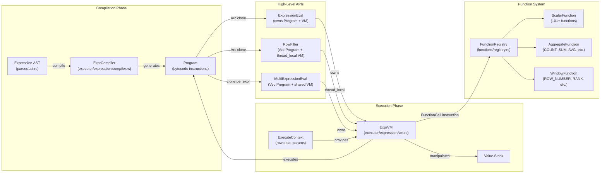
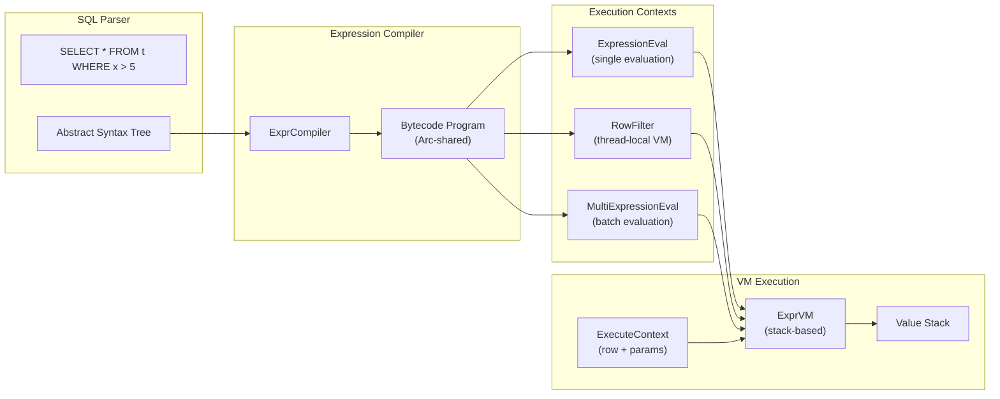

# Expression Pushdown

This document explains OxiBase's expression pushdown optimization, which moves filtering operations closer to the data to improve query performance.

## What is Expression Pushdown?

Expression pushdown is a query optimization technique that "pushes" filter expressions (typically from WHERE clauses) down to the lowest possible level in the query execution stack. This minimizes the amount of data that needs to be processed at higher levels of the execution engine.

## Benefits of Expression Pushdown

### Performance Improvements

- **Reduced Data Processing** - Filter data early to avoid unnecessary processing
- **Reduced Memory Usage** - Process only relevant data
- **Improved Cache Efficiency** - Better CPU cache utilization with smaller data sets
- **Optimized I/O** - Less data loaded from storage
- **Improved Parallelism** - Filter operations can be parallelized at lower levels

### Measurable Impacts

Depending on the query, expression pushdown can provide:

- 10-100x reduction in processed data volume
- 2-10x improvement in query execution time
- Significant memory usage reduction

## How Expression Pushdown Works in OxiBase

### Pushdown Levels

OxiBase implements expression pushdown at multiple levels:

1. **Storage Level Pushdown** - Expressions pushed directly to storage
2. **Index Level Pushdown** - Expressions leveraging indexes (B-tree, Hash, Bitmap)
3. **Scan Level Pushdown** - Expressions applied during table scanning
4. **Join Level Pushdown** - Expressions pushed before or into joins

**Note**: Subquery pushdown is not yet implemented.

### The Pushdown Process

When processing a query with filtering conditions:

1. The SQL parser creates an abstract syntax tree (AST)
2. The query analyzer examines filter expressions
3. Pushdown eligibility is determined for each expression
4. Expressions are transformed into a format suitable for lower levels
5. Execution plans are modified to incorporate pushed-down expressions
6. The storage engine applies filters directly when possible

## Expression Types

Not all expressions can be pushed down. OxiBase categorizes expressions by pushdown eligibility:

### Fully Pushable Expressions

These expressions can be pushed all the way to the storage layer:

- **Simple Comparisons** - Equality (=), inequality (!=, <>), greater/less than (>, <, >=, <=)
- **Range Conditions** - BETWEEN, IN
- **Null Checks** - IS NULL, IS NOT NULL
- **String Patterns** - LIKE (with limitations)
- **Logical Operations** - AND, OR, NOT

```sql
-- All filters can be pushed down to storage
SELECT * FROM orders WHERE
    status = 'shipped' AND
    order_date BETWEEN '2022-01-01' AND '2022-12-31' AND
    customer_id IN (1, 2, 3);
```

### Partially Pushable Expressions

These expressions can be partially pushed down:

- **Simple Functions** - ABS(), LOWER(), UPPER()
- **Date/Time Functions** - DATE_TRUNC(), TIME_TRUNC()
- **Type Casts** - CAST()
- **Simple Arithmetic** - +, -, *, /

```sql
-- The date_trunc can be pushed down, making this more efficient
SELECT * FROM orders WHERE
    DATE_TRUNC('month', order_date) = DATE_TRUNC('month', NOW());
```

### Non-Pushable Expressions

These typically cannot be pushed down:

- **Complex Functions** - User-defined functions, complex built-in functions
- **Aggregates** - SUM(), COUNT(), AVG() (though parts of the expression may be pushed)
- **Window Functions** - ROW_NUMBER(), RANK()
- **Subquery References** - Correlated subqueries

```sql
-- The aggregate function prevents full pushdown
SELECT * FROM orders WHERE
    total > (SELECT AVG(total) FROM orders);
```

## Implementation Details

### Expression Translation

Expressions are translated from SQL syntax to storage-level predicates:

1. **Parser** - Parses SQL into an abstract syntax tree
2. **Analyzer** - Identifies pushable expressions
3. **Translator** - Converts SQL expressions to storage predicates
4. **Optimizer** - Determines optimal pushdown strategy
5. **Executor** - Applies the pushdown during execution

### Expression Evaluation System

OxiBase uses a compile-once, execute-many bytecode VM for expression evaluation:



**Key Design Decisions:**
1. **Zero Recursion**: Linear instruction sequences eliminate stack overflow risks
2. **Immutable Programs**: Bytecode is `Arc`-shared across threads for parallel execution
3. **Thread-Safe Filtering**: `RowFilter` uses thread-local VMs for parallel table scans
4. **Context Separation**: Compilation context (schema) vs execution context (row data) enables pre-compilation

**Instruction Set:**
- `Load(index)` - Load column value onto stack
- `LoadConst(Value)` - Load constant value
- `BinOp(Operator)` - Execute binary operation (Add, Sub, Mul, Div, etc.)
- `UnaryOp(Operator)` - Execute unary operation (Neg, Not)
- `FunctionCall(id, argc)` - Call function from registry
- `JumpIf(offset)` - Conditional jump for CASE expressions
- `Return` - End execution, return top of stack

### Specialized Expression Types

OxiBase implements specialized expression types for efficient pushdown:

- **SimpleExpression** - Basic comparison operations
- **BetweenExpression** - Range checks
- **InListExpression** - Set membership tests
- **LogicalExpression** - Combining expressions with AND/OR
- **NullCheckExpression** - NULL checks
- **RangeExpression** - Optimized range queries
- **NotExpression** - Logical negation

These expression types are implemented in `src/storage/expression/`.

### Storage-Level Implementation

At the storage level, OxiBase implements optimized filtering:

- **Index-Based Filtering** - Filter operations using B-tree, Hash, and Bitmap indexes
- **Parallel Evaluation** - Multi-threaded predicate evaluation using Rayon
- **Bitmap Results** - Bitmap representation of matching positions
- **Efficient Traversal** - Row-based filtering with MVCC visibility checks

## Pushdown Strategies

### Filter Pushdown Levels

OxiBase implements pushdown at multiple architectural levels:

1. **Storage Level Pushdown** - Expressions pushed directly to storage with MVCC visibility checks
2. **Index Level Pushdown** - B-tree, Hash, and Bitmap indexes filter data during index scans
3. **Arena Level Pushdown** - Zero-copy filtering during arena-based scans
4. **Join Level Pushdown** - Filters applied before expensive join operations

### Filter Pushdown

Basic filter pushdown moves WHERE conditions down:

```sql
-- Before pushdown (conceptual)
Table Scan (orders) → Filter (status = 'shipped') → Project

-- After pushdown (conceptual)
Table Scan with Filter (orders, status = 'shipped') → Project
```

### Join Pushdown

Filters are pushed before or into joins:

```sql
-- Before pushdown (conceptual)
Table Scan (orders) → Join with customers → Filter (status = 'shipped')

-- After pushdown (conceptual)
Table Scan with Filter (orders, status = 'shipped') → Join with customers
```

### Index Utilization

Pushed-down expressions leverage indexes:

```sql
-- When an index exists on status, this becomes:
Index Scan (orders_status_idx, 'shipped') → Project
```

### Predicate Simplification

Expressions are simplified when possible:

```sql
-- Before simplification
WHERE age >= 18 AND age <= 65 AND age != 30

-- After simplification
WHERE age BETWEEN 18 AND 65 AND age != 30
```

### LIMIT Pushdown

For queries with LIMIT clauses, pushdown can significantly reduce processing:

```sql
-- Without LIMIT pushdown: scan all rows, then limit
SELECT * FROM products WHERE category = 'electronics' LIMIT 10;

-- With LIMIT pushdown: scan only until 10 matching rows found
-- Uses index to find first 10 matches efficiently
```

### TOP-N Pushdown

For ORDER BY + LIMIT queries, pushdown optimizes sorting:

```sql
-- Without TOP-N pushdown: scan all rows, sort, then limit
SELECT * FROM orders ORDER BY total DESC LIMIT 5;

-- With TOP-N pushdown: use heap to track top 5, scan efficiently
-- 50x+ performance improvement for large datasets
```

## Performance Optimizations

### Zero-Copy Scanning

The `RowArena` provides contiguous memory storage for efficient pushdown:

**Performance characteristics:**
- **50x+ speedup** for full table scans vs. per-row cloning
- Pre-acquire locks once per scan (O(1) instead of O(N))
- Direct slice access via bounds-checked reads
- Cache locality from contiguous layout

### Parallel Predicate Evaluation

Pushdown expressions are evaluated in parallel using Rayon:

**Batch Operations:**

| Operation | Traditional (Per-Row) | Batch API | Improvement |
|-----------|----------------------|-----------|-------------|
| **Filter 1000 rows** | 1000 evaluations | 1 batch evaluation | ~10x reduction |
| **Index scans** | Sequential evaluation | Parallel chunks | CPU-bound speedup |
| **Complex predicates** | N evaluations | Parallel workers | Multi-core scaling |

### Thread-Safe Row Filtering

`RowFilter` uses thread-local VMs for parallel table scans:

```rust
// Thread-local VM ensures no contention
let filter = RowFilter::new(predicate_program);
let matching_rows: Vec<Row> = rows.par_iter()
    .filter(|row| filter.eval(row))
    .collect();
```

### Predicate Pushdown in Practice

**Example: Complex WHERE clause pushdown:**

```sql
SELECT * FROM orders
WHERE status IN ('shipped', 'delivered')
  AND total > 100
  AND customer_id BETWEEN 1000 AND 2000
  AND created_at >= '2023-01-01';
```

**Pushdown execution:**
1. **Index intersection**: Status IN uses Hash/Bitmap index, customer_id BETWEEN uses B-tree
2. **Predicate combination**: AND conditions combined at storage level
3. **Parallel evaluation**: Multiple threads evaluate the complex predicate
4. **Early termination**: Results streamed as soon as available

## Performance Considerations

### When Pushdown Helps Most

Expression pushdown provides the greatest benefits when:

1. **High Selectivity** - Filters eliminate a large percentage of rows
2. **Early Filtering** - Filters can be applied before expensive operations
3. **Index Availability** - Filters can use available indexes
4. **Complex Queries** - Queries with joins, subqueries, or aggregations

### Potential Limitations

Some scenarios may limit pushdown benefits:

1. **Low Selectivity Filters** - If most rows match, pushdown may not help much
2. **Complex Expressions** - Not all expressions can be pushed down
3. **Function-Based Filters** - Functions on columns may prevent index usage

## Query Examples

### Simple Pushdown

```sql
-- Highly efficient: Pushes filter to storage and uses index if available
SELECT * FROM customers WHERE country = 'US';
```

### Multiple Filter Pushdown

```sql
-- All conditions are pushed down and combined at the storage level
SELECT * FROM orders
WHERE status = 'shipped'
  AND order_date > '2022-01-01'
  AND total > 100;
```

### Join Pushdown

```sql
-- Filters are pushed before the join
SELECT c.name, o.order_date
FROM customers c
JOIN orders o ON c.id = o.customer_id
WHERE c.country = 'US' AND o.status = 'shipped';
```

### Function Pushdown

```sql
-- LOWER function can be pushed down
SELECT * FROM products
WHERE LOWER(name) LIKE '%organic%';
```

## Implementation Details

OxiBase's expression pushdown is implemented in several components:

- **src/executor/query.rs** - High-level pushdown decisions
- **src/executor/planner.rs** - Query planning with pushdown
- **src/storage/expression/** - Specialized expression types
- **src/storage/mvcc/table.rs** - Storage-level filtering

### Expression Compilation Architecture

Expressions are compiled once and executed many times:



### Pushdown Decision Logic

The optimizer determines pushdown eligibility:

```rust
fn can_pushdown(expr: &Expression) -> PushdownLevel {
    match expr {
        // Storage level - direct to MVCC
        Expression::BinaryOp { op: Eq, .. } => PushdownLevel::Storage,
        Expression::Between { .. } => PushdownLevel::Storage,

        // Index level - leverages indexes
        Expression::InList { .. } if has_index => PushdownLevel::Index,

        // Scan level - during table iteration
        Expression::FunctionCall { name: "lower", .. } => PushdownLevel::Scan,

        // Cannot push down
        Expression::Subquery { .. } => PushdownLevel::None,
        _ => PushdownLevel::None,
    }
}
```

### Filter Pushdown Examples

**Primary Key Lookup Pushdown:**
```sql
-- Direct index lookup, O(1)
SELECT * FROM users WHERE id = 12345;
```
**Execution:** `VersionStore::get_visible_version(12345, txn_id)`

**Index Scan Pushdown:**
```sql
-- B-tree range scan with pushdown
SELECT * FROM orders WHERE total > 1000;
```
**Execution:** `BTreeIndex::scan_range(1000.., txn_id)`

**Bitmap Index Pushdown:**
```sql
-- Bitmap operations for low-cardinality filters
SELECT * FROM products WHERE category IN ('electronics', 'books');
```
**Execution:** `BitmapIndex::bitmap_or(['electronics', 'books'])`

### Monitoring Pushdown Effectiveness

To verify pushdown is working:

```sql
-- View query execution plan
EXPLAIN SELECT * FROM orders WHERE status = 'shipped' AND total > 100;

-- Expected output shows pushdown usage
-- "Filter Pushdown: status = 'shipped' AND total > 100"
-- "Index Utilization: orders_status_idx (Hash), orders_total_idx (B-tree)"
```

### Pushdown Limitations

**Current Limitations:**
- **Subquery pushdown** - Not yet implemented
- **Complex aggregations** - Limited pushdown support
- **Window functions** - No pushdown currently
- **User-defined functions** - Cannot be pushed down

**Workarounds:**
- **Materialized views** - Pre-compute complex expressions
- **Query restructuring** - Rewrite queries to enable pushdown
- **Index design** - Create indexes on computed columns

## Best Practices

To maximize the benefits of expression pushdown:

1. **Use direct column references** - Avoid functions on indexed columns in WHERE clauses
2. **Create appropriate indexes** - Indexes enable better pushdown optimizations
3. **Use simple predicates** - Simple expressions are more likely to be pushed down
4. **Monitor query performance** - Use execution timing to verify optimization effectiveness
5. **Combine multiple conditions** - AND conditions can be pushed down effectively

## Advanced Techniques

### Custom Expressions

OxiBase allows for specialized expression types:

```sql
-- Range expressions are highly optimized
SELECT * FROM time_series
WHERE timestamp BETWEEN '2022-01-01' AND '2022-01-31';
```

### Combined Index and Expression Pushdown

When expressions match available indexes:

```sql
-- With a composite index on (status, order_date), this is very efficient
SELECT * FROM orders
WHERE status = 'shipped' AND order_date > '2022-01-01';
```

### Function Index Pushdown

When functions are used in filtering:

```sql
-- If an index exists on LOWER(email), this pushdown is efficient
SELECT * FROM users WHERE LOWER(email) = 'user@example.com';
```
