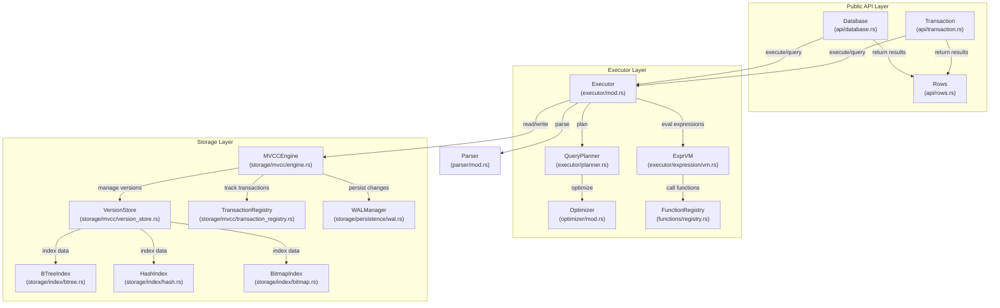
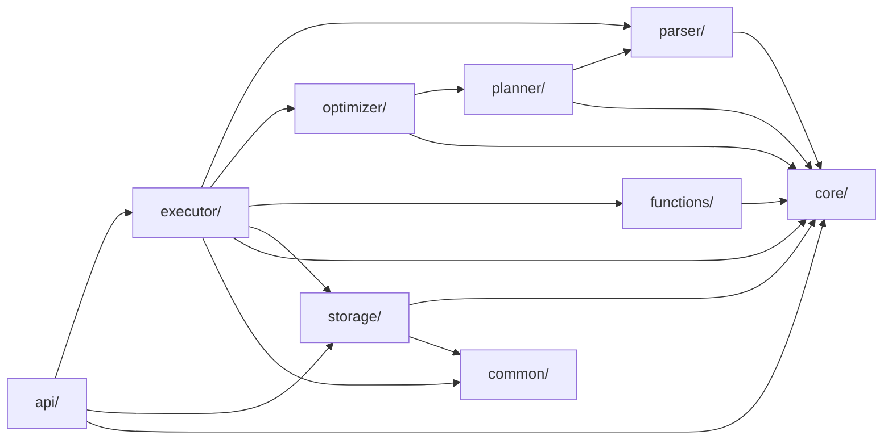
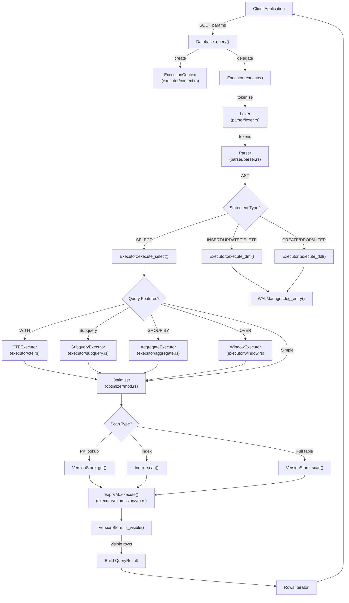
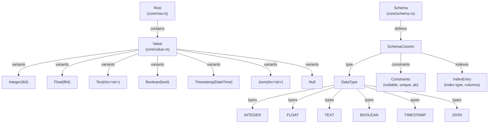

# Architecture

Learn about the internal architecture of Oxibase, including storage engines, indexing, MVCC, and transaction isolation.

## Purpose and Scope

This section describes the high-level architecture of Oxibase: its layered structure, major components, module organization, and how data flows through the system during query execution. It provides a conceptual map of the codebase to help developers understand where different functionality lives and how the pieces fit together.

For details on using Oxibase as a library or CLI tool, see [Getting Started](). For implementation details of specific subsystems, see the [Storage Engine](), [MVCC Implementation](), and related pages.

## Three-Tier Layered Architecture

Oxibase follows a classic three-tier database architecture with clear separation of concerns:

### API Layer

The API layer provides the user-facing interface for interacting with Oxibase. It handles connection management, transaction lifecycle, and result streaming.

**Key Components:**
- `Database` - Entry point for opening databases and executing queries (api/database.rs)
- `Transaction` - Manages ACID transaction boundaries with commit/rollback (api/transaction.rs)
- `Rows` - Iterator for streaming query results with type conversion (api/rows.rs)
- `Statement` - Prepared statement interface with parameter binding (api/statement.rs)

The API layer delegates SQL parsing and execution to the Executor layer but handles connection pooling, DSN parsing, and result formatting.

### Executor Layer

The Executor layer is responsible for transforming SQL into results. It contains the query execution pipeline: parsing, planning, optimization, and execution.

**Key Components:**
- `Executor` - Orchestrates query execution across all statement types (executor/mod.rs)
- `QueryPlanner` - Generates logical query plans from AST (executor/planner.rs)
- `Optimizer` - Cost-based query optimizer with statistics (optimizer/mod.rs)
- `ExprVM` - Stack-based bytecode VM for expression evaluation (executor/expression/vm.rs)
- `FunctionRegistry` - Registry of 101+ built-in SQL functions (functions/registry.rs)

Specialized execution engines handle complex SQL features:
- Query executor for SELECT statements (executor/query.rs)
- Aggregation engine for GROUP BY/ROLLUP/CUBE (executor/aggregate.rs)
- Window function engine for OVER clauses (executor/window.rs)
- Subquery engine for correlated/uncorrelated subqueries (executor/subquery.rs)
- CTE engine for WITH clauses including recursive CTEs (executor/cte.rs)
- DDL executor for schema changes (executor/ddl.rs)

### Storage Layer

The Storage layer implements multi-version concurrency control (MVCC), indexing, and persistence. It provides transactional isolation while allowing concurrent reads and writes.

**Key Components:**
- `MVCCEngine` - Main storage engine coordinating transactions and persistence (storage/mvcc/engine.rs)
- `VersionStore` - Manages version chains for each table row (storage/mvcc/version_store.rs)
- `TransactionRegistry` - Tracks active transactions for visibility checking (storage/mvcc/transaction_registry.rs)
- `BTreeIndex` - Range-queryable B-tree index (storage/index/btree.rs)
- `HashIndex` - O(1) equality lookup hash index (storage/index/hash.rs)
- `BitmapIndex` - Compressed bitmap index for low-cardinality columns (storage/index/bitmap.rs)
- `WALManager` - Write-ahead log for durability and crash recovery (storage/persistence/wal.rs)
- `PersistenceManager` - Snapshot creation and restoration (storage/persistence/manager.rs)

## Module Organization

The codebase is organized into distinct modules with minimal cross-dependencies:

**Module Descriptions:**

| Module | Purpose | Key Files |
|--------|---------|-----------|
| `api/` | Public database interface | `database.rs`, `transaction.rs`, `rows.rs` |
| `core/` | Core types and abstractions | `value.rs`, `row.rs`, `schema.rs`, `error.rs` |
| `parser/` | SQL lexer and parser | `lexer.rs`, `parser.rs`, `ast.rs` |
| `planner/` | Query planning | `planner.rs` |
| `optimizer/` | Cost-based optimization | `mod.rs`, `stats.rs`, `aqe.rs` |
| `executor/` | Query execution | `query.rs`, `aggregate.rs`, `window.rs`, `subquery.rs`, `cte.rs` |
| `functions/` | Built-in SQL functions | `scalar/`, `aggregate/`, `window/` |
| `storage/` | MVCC storage engine | `mvcc/`, `index/`, `persistence/` |
| `common/` | Shared utilities | `buffer_pool.rs`, `int64_map.rs`, `version.rs` |

## Query Execution Data Flow

The following diagram shows how a SQL query flows through the system, from API entry to result streaming:

**Key Execution Steps:**

1. **Parsing:** parser/lexer.rs tokenizes the SQL string, parser/parser.rs builds an AST
2. **Context Creation:** executor/context.rs creates an ExecutionContext with parameters, timeout, and cancellation token
3. **Feature Detection:** executor/query.rs checks for CTEs, subqueries, aggregation, or window functions
4. **Optimization:** optimizer/mod.rs applies predicate pushdown, index selection, and join reordering
5. **Scan Execution:** storage/mvcc/version_store.rs scans data, checking MVCC visibility
6. **Expression Evaluation:** executor/expression/vm.rs evaluates WHERE clauses, SELECT expressions, and function calls
7. **Result Building:** Specialized result wrappers handle filtering, projection, ordering, and limiting
8. **Streaming:** api/rows.rs provides iterator interface for result consumption

## Core Type System

Oxibase uses a strongly-typed value system with runtime type checking:

**Type Definitions:**
- `Value` - Tagged union representing SQL values (core/value.rs)
- `Row` - Vector of `Value` objects representing a table row (core/row.rs)
- `Schema` - Table metadata including columns and indexes (core/schema.rs)
- `DataType` - Enum of supported SQL types (core/types.rs)
