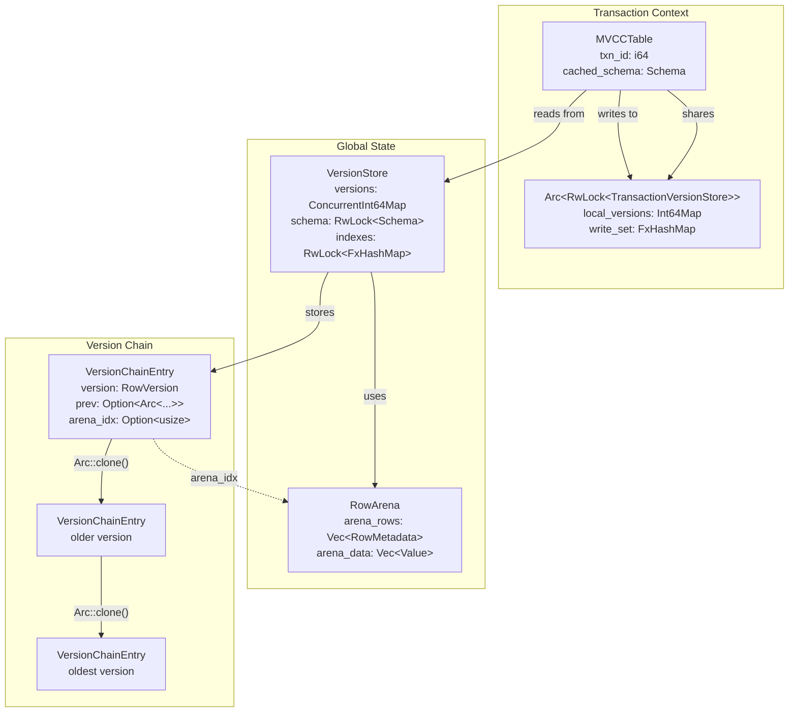
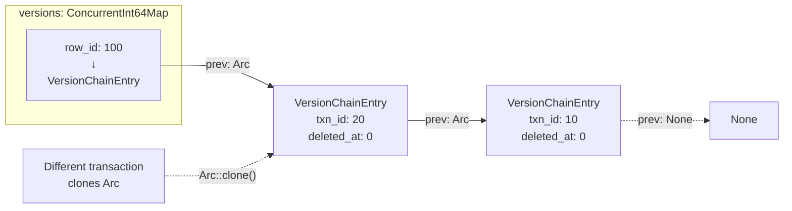
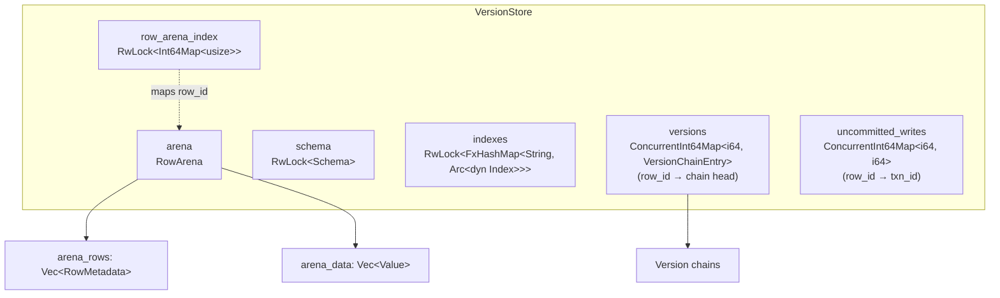
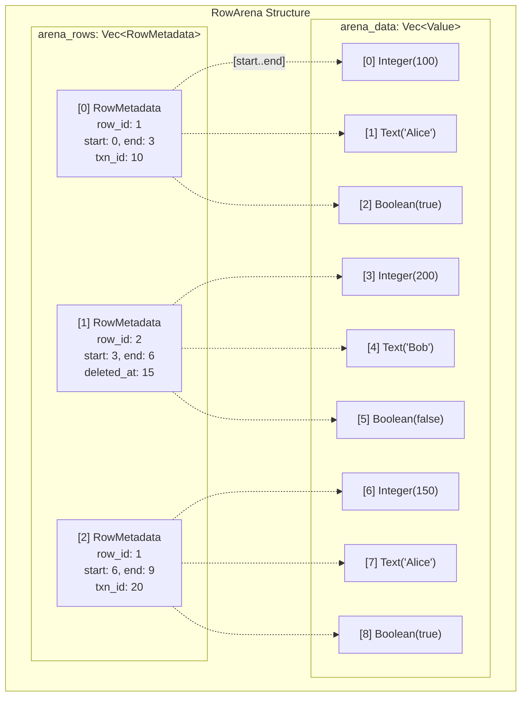
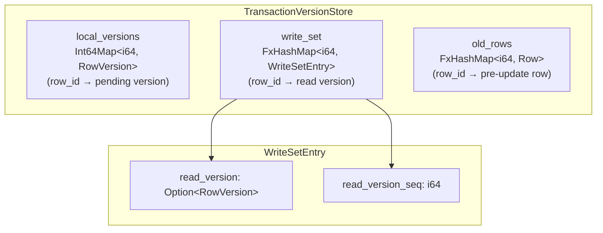
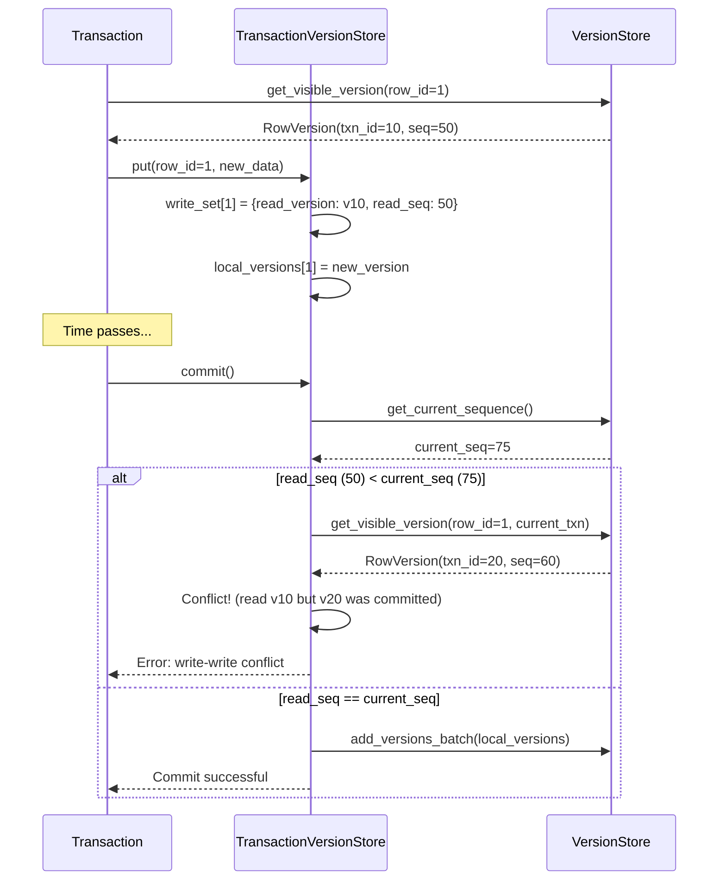
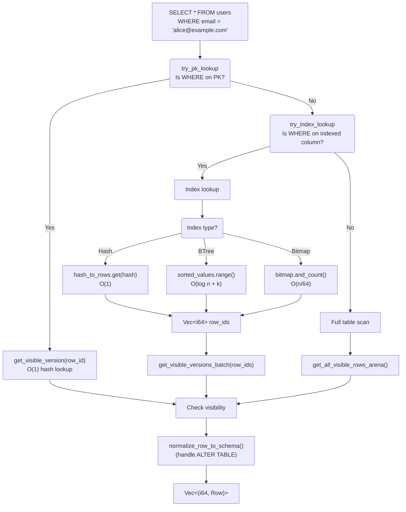
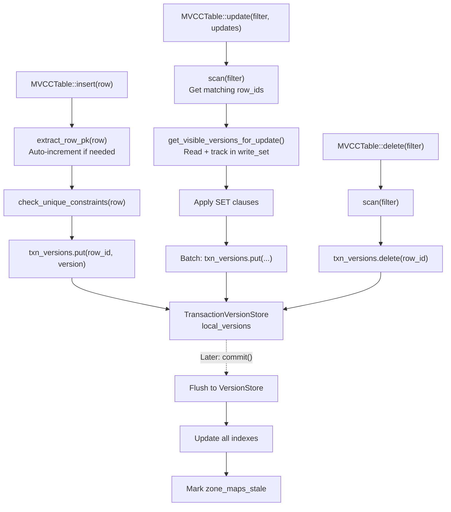
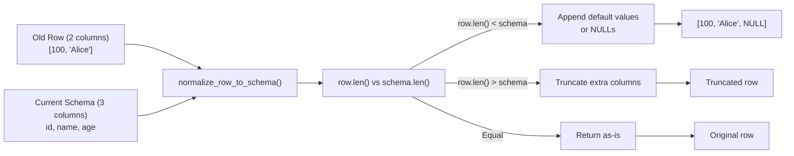

# MVCC Implementation

This document provides a detailed explanation of Oxibase's Multi-Version Concurrency Control (MVCC) implementation, which enables transaction isolation without locking.

## MVCC Overview

Multi-Version Concurrency Control (MVCC) is a concurrency control method used by Oxibase to provide transaction isolation. The key principles are:

1. Maintain full version chains for each row with unlimited history
2. Track deletion status with transaction IDs for proper visibility
3. Each transaction has a consistent view based on visibility rules
4. Reads never block writes, and writes never block reads
5. Implement optimistic concurrency control for conflict detection

### Core Components Overview



## Design Philosophy

Oxibase implements a **true multi-version MVCC** design:

- **Full Version Chains**: Unlimited version history per row linked via `prev` pointers
- **In-Memory Chains**: Version chains built from WAL replay during recovery
- **Immutable Versions**: New versions always created, never modified in place
- **Efficient Persistence**: Only latest version persisted to disk snapshots
- **Automatic Cleanup**: Old versions garbage collected when no longer needed

## Core Components

### Transaction Registry

- Manages transaction lifecycle and state tracking
- Assigns unique transaction IDs using atomic counters
- Tracks active and committed transactions with monotonic sequences
- Supports per-transaction isolation levels without race conditions
- Implements visibility rules for both READ COMMITTED and SNAPSHOT isolation

### Version Store

- Maintains full version chains for each row
- Tracks both creation (`txn_id`) and deletion (`deleted_at_txn_id`) transaction IDs
- Implements efficient concurrent access using concurrent data structures
- Manages B-tree, Hash, and Bitmap indexes
- Provides visibility-aware traversal of version chains

### Row Version Structure

```rust
struct RowVersion {
    txn_id: i64,           // Transaction that created this version
    deleted_at_txn_id: i64, // Transaction that deleted this version (0 if not deleted)
    data: Row,             // Complete row data
    row_id: i64,           // Row identifier
    create_time: i64,      // Timestamp when created
    prev: Option<Box<RowVersion>>, // Previous version in the chain
}
```

The `prev` pointer creates a backward-linked chain from newest to oldest version.

### Version Chains with Arc Pointers



### VersionStore: Global Committed State



### Arena-Based Storage for Zero-Copy Scans



### TransactionVersionStore: Uncommitted Changes



### Conflict Detection Flow



## Transaction IDs and Timestamps

Oxibase uses monotonic sequences instead of wall-clock timestamps to avoid platform-specific timing issues:

- **Transaction ID**: Unique identifier assigned atomically
- **Begin Sequence**: Monotonic sequence when transaction starts
- **Commit Sequence**: Monotonic sequence when transaction commits
- **Write Sequences**: Track when rows were last modified for conflict detection

This approach solves Windows' 15.6ms timer resolution issue and ensures consistent ordering.

## Isolation Levels

### READ COMMITTED (Default)

- Transactions see committed changes immediately
- No global locks for commits - high concurrency
- Each statement sees the latest committed data
- Suitable for most OLTP workloads

Implementation:
```rust
// In READ COMMITTED, only check if transaction is committed
fn is_directly_visible(&self, version_txn_id: i64) -> bool {
    self.committed_transactions.contains(version_txn_id)
}
```

### SNAPSHOT Isolation

- Transactions see a consistent snapshot from when they started
- Write-write conflict detection prevents lost updates
- Lock-free commits with optimistic concurrency control
- High throughput with strong consistency guarantees

Implementation:
```rust
// In SNAPSHOT, check if version was committed before viewer began
fn is_visible(&self, version_txn_id: i64, viewer_txn_id: i64) -> bool {
    if let Some(commit_ts) = self.committed_transactions.get(version_txn_id) {
        let viewer_begin_ts = self.get_transaction_begin_seq(viewer_txn_id);
        commit_ts <= viewer_begin_ts
    } else {
        false
    }
}
```

## Visibility Rules

### Version Chain Traversal

Visibility is determined by traversing the version chain:
```rust
// Traverse the version chain from newest to oldest
let mut current = version_ptr;
while let Some(version) = current {
    if registry.is_visible(version.txn_id, txn_id) {
        // Check deletion visibility
        if version.deleted_at_txn_id != 0
            && registry.is_visible(version.deleted_at_txn_id, txn_id) {
            return None; // Deleted
        }
        return Some(version); // Found visible version
    }
    current = version.prev.as_ref();
}
```

### Row Visibility

A row is visible to a transaction if:
1. A version exists in the chain that was created by a visible transaction, AND
2. That version was NOT deleted, OR the deletion is not visible

### Transaction-Specific Isolation

Each transaction maintains its own isolation level:
```rust
// Set isolation level for specific transaction
registry.set_transaction_isolation_level(txn_id, level);

// Get isolation level for visibility checks
let isolation_level = registry.get_isolation_level(txn_id);
```

## Concurrency Control

### SNAPSHOT Isolation Conflicts

Write-write conflict detection during commit:

```rust
// Check for conflicts before commit
if version_store.check_write_conflict(&written_rows, begin_seq) {
    return Err(OxibaseError::Transaction(
        "transaction aborted due to write-write conflict".to_string()
    ));
}

// Set write sequences after successful commit
version_store.set_write_sequences(&written_rows, commit_seq);
```

### Lock-Free Commit Process

SNAPSHOT commits use optimistic concurrency control:
1. Check for write-write conflicts
2. Generate commit sequence
3. Apply changes to version stores (creating new versions)
4. Set write sequences atomically
5. Mark transaction as committed

No global mutex needed - conflicts detected through version checks.

### Read Path: Query Execution



### Write Path: Insert, Update, Delete



## Version Chain Management

### Updates

When a row is updated:
- A new version is created with the updating transaction's ID
- The new version's `prev` pointer links to the current version
- The version chain grows backward in time
- All historical versions remain accessible

### Deletions

When a row is deleted:
- A new version is created with `DeletedAtTxnID` set
- The deletion version links to the previous version
- Data is preserved in the deletion version
- The row appears deleted to transactions that see this version

### Version Chain Example

```
[Newest] -> Version 3 (TxnID=300, DeletedAt=400)
              |
              v
            Version 2 (TxnID=200)
              |
              v
            Version 1 (TxnID=100) -> [Oldest]
```

### Row Normalization for Schema Evolution



## Performance Optimizations

### Lock-Free Data Structures

- `SegmentInt64Map`: High-performance concurrent maps
- Atomic operations for counters and flags
- Minimal mutex usage in hot paths

### Object Pooling

- Transaction objects
- Table objects  
- Version maps
- Reduces GC pressure in high-throughput scenarios

### Optimized Visibility Checks

- Fast path for own-transaction visibility
- Direct visibility check for READ COMMITTED
- Batch processing for bulk operations

### Memory Management

- Version chains built on-demand from WAL
- Automatic cleanup of old versions no longer needed
- Periodic cleanup of deleted rows
- Cold data eviction to disk

## Garbage Collection

### Version Chain Cleanup

Old versions in chains are cleaned up when:
1. No active transaction can see them
2. A newer version is visible to all active transactions

```rust
// Find oldest version still needed
let mut current = version;
let mut last_needed = None;
while let Some(v) = current {
    for txn_id in &active_transactions {
        if registry.is_visible(v.txn_id, *txn_id) {
            last_needed = Some(v);
            break;
        }
    }
    current = v.prev.as_ref();
}
// Disconnect older versions (Rust's ownership handles cleanup)
if let Some(last) = last_needed {
    last.prev = None; // Drop older versions
}
```

### Deleted Row Cleanup

Deleted rows are removed based on:
1. Retention period (age-based)
2. Transaction visibility (no active transaction can see them)
3. Safety checks to prevent removing visible data

## Key Implementation Files

- `src/storage/mvcc/engine.rs` - MVCC engine coordinating all components
- `src/storage/mvcc/table.rs` - Table operations with MVCC support
- `src/storage/mvcc/transaction.rs` - Transaction implementation and conflict detection
- `src/storage/mvcc/version_store.rs` - Row version storage and management

## Best Practices

1. **Choose Appropriate Isolation**: Use READ COMMITTED unless you need snapshot consistency
2. **Keep Transactions Short**: Long transactions delay garbage collection
3. **Handle Conflicts**: Implement retry logic for SNAPSHOT conflicts
4. **Monitor Deleted Rows**: Ensure garbage collection keeps up with deletions
5. **Batch Operations**: Group related changes in single transactions

## Future Improvements

Potential enhancements to the current design:
1. **Time Travel Queries**: Query data as of specific timestamps
2. **Additional Isolation Levels**: REPEATABLE READ, SERIALIZABLE
3. **Read-Set Tracking**: Detect read-write conflicts for SERIALIZABLE
4. **Savepoint Support**: Transaction savepoints for partial rollbacks
5. **Version Compression**: Delta encoding for version chains
