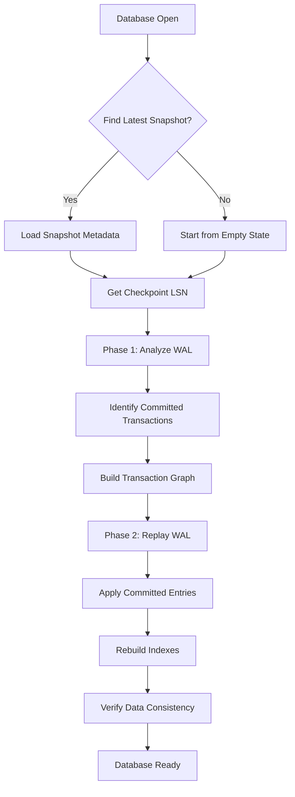

# Persistence

OxiBase provides durable storage through a combination of Write-Ahead Logging (WAL) and periodic snapshots. This architecture ensures data durability while maintaining high performance.

## Overview

OxiBase's persistence layer consists of two main components:

1. **Write-Ahead Log (WAL)**: Records all changes before they're applied to memory
2. **Snapshots**: Periodic full copies of the database state

This dual approach provides:
- **Durability**: Changes are persisted before acknowledgment
- **Fast Recovery**: Snapshots reduce recovery time
- **Crash Safety**: WAL ensures no committed transactions are lost

## Enabling Persistence

To enable persistence, use a `file://` connection string:

```rust
use oxibase::Database;

// In-memory only (no persistence)
let db = Database::open("memory://")?;

// With disk persistence
let db = Database::open("file:///path/to/database")?;
```

Command line:
```bash
# In-memory
oxibase

# With persistence
oxibase --db "file:///path/to/database"
```

## Write-Ahead Log (WAL)

### How WAL Works

1. When a transaction commits, changes are first written to the WAL file
2. The WAL is synced to disk (based on sync_mode)
3. Changes are then applied to the in-memory structures
4. Transaction is acknowledged to the client

This sequence ensures that committed transactions survive crashes.

### WAL Manager Responsibilities

The WAL manager handles sequential writes with durability guarantees:

- **Sequential writes** with CRC32 checksums for corruption detection
- **Two-phase recovery**: Phase 1 identifies committed transactions, Phase 2 applies their changes
- **Optional compression** for reduced I/O when enabled
- **Atomic writes** ensuring either complete entries or none

**WAL Entry Structure:**
```
[WAL Header]
Magic: 0x57414C00
Version: 1
Checksum: CRC32

[Entry 1]
Timestamp: i64
TxnId: i64
OpType: Insert/Update/Delete
TableId: i64
RowData: [serialized row]
Checksum: CRC32

[Entry 2]
...
```

### WAL Operations

The WAL records these operations:
- **INSERT**: New row insertions with full row data
- **UPDATE**: Row modifications with old→new value pairs
- **DELETE**: Row deletions with deletion markers
- **CREATE TABLE**: Table creation with schema metadata (DDL)
- **DROP TABLE**: Table deletion with cleanup operations (DDL)
- **CREATE INDEX**: Index creation with index specifications (DDL)
- **DROP INDEX**: Index deletion operations (DDL)
- **ALTER TABLE**: Schema changes with transformation rules

### WAL Segment Management

WAL files are managed in segments for efficient rotation:

- **Active segment**: Currently being written to
- **Archived segments**: Completed segments waiting for snapshot
- **Cleanup**: Old segments deleted after successful snapshots
- **Recovery**: Segments replayed in order during startup

### WAL Configuration

Configure WAL behavior using PRAGMA:

```sql
-- Sync mode: 0=None, 1=Normal (default), 2=Full
PRAGMA sync_mode = 1;

-- Number of operations before automatic WAL flush
PRAGMA wal_flush_trigger = 32768;
```

| Sync Mode | Value | Behavior |
|-----------|-------|----------|
| None | 0 | No sync (fastest, but data may be lost on crash) |
| Normal | 1 | Sync on commit (balanced performance and durability) |
| Full | 2 | Sync every operation (slowest, maximum durability) |

### WAL Files

WAL files are stored in the database directory:
```
/path/to/database/
  wal/
    wal_000001.log
    wal_000002.log
    ...
```

Old WAL files are automatically cleaned up after successful snapshots.

## Snapshots

### How Snapshots Work

Snapshots capture the complete database state at a point in time:
1. All table data and schema
2. All index definitions
3. Current transaction state

After a snapshot is created, older WAL entries can be safely deleted.

### Snapshot System Architecture

The snapshot system uses binary format with atomic writes:

- **Binary format** with magic bytes (`0x50414E53` = "SNAP")
- **Atomic 3-phase writes**: temp file → sync → rename for crash safety
- **Tracks source LSN** for incremental recovery
- **Compressed storage** to reduce disk usage

**Snapshot File Structure:**
```
[Snapshot Header]
Magic: 0x50414E53
Version: 1
Timestamp: i64
LSN: i64 (WAL position)
TableCount: u32
Checksum: CRC32

[Table 1 Schema]
TableId: i64
Name: String
Columns: [Column definitions]
Indexes: [Index definitions]

[Table 1 Data]
RowCount: u64
Rows: [serialized rows...]

[Table 2 Schema]
...

[Footer]
TotalSize: u64
Checksum: CRC32
```

### 3-Phase Atomic Write Process

Snapshots use atomic writes to prevent corruption:

1. **Phase 1 - Write**: Create temporary file with complete snapshot data
2. **Phase 2 - Sync**: Force all writes to disk with fsync()
3. **Phase 3 - Rename**: Atomically move temp file to final location

This ensures either a complete, valid snapshot exists, or none at all.

### Snapshot Configuration

```sql
-- Interval between automatic snapshots (in seconds, default: 300)
PRAGMA snapshot_interval = 300;

-- Number of snapshots to retain (default: 5)
PRAGMA keep_snapshots = 5;

-- Manually create a snapshot
PRAGMA create_snapshot;
```

### Snapshot Files

Snapshots are stored as binary files:
```
/path/to/database/
  snapshots/
    snapshot_1704067200.bin
    snapshot_1704067500.bin
    ...
```

The filename includes the Unix timestamp of creation for easy sorting.

### Snapshot Retention Policy

- **Automatic cleanup**: Old snapshots deleted when `keep_snapshots` exceeded
- **Time-based retention**: Can be configured for compliance requirements
- **Manual retention**: Important snapshots can be preserved indefinitely

## Recovery Process

When opening a database, OxiBase performs recovery automatically:

### 2-Phase Recovery Algorithm

**Phase 1 - Analysis:**
1. Read snapshot metadata to get checkpoint LSN (Log Sequence Number)
2. Scan WAL entries to identify committed vs. uncommitted transactions
3. Build transaction dependency graph for proper ordering

**Phase 2 - Redo:**
1. Load table snapshots for fastest recovery path
2. Replay WAL entries from checkpoint LSN forward
3. Apply only entries from committed transactions
4. Rebuild indexes in single pass after replay completes

### Detailed Recovery Flow



### WAL Replay Process

During WAL replay, OxiBase:

1. **Validates checksums** on each WAL entry for corruption detection
2. **Applies operations** in strict commit order using LSN sequencing
3. **Handles DDL operations** by reconstructing schema changes
4. **Rebuilds indexes** from scratch after all data is loaded (faster than incremental updates)
5. **Validates constraints** to ensure data integrity

### Index Rebuilding

After WAL replay, indexes are rebuilt efficiently:

- **Single-pass rebuild**: All indexes populated in one table scan
- **Batch operations**: Reduces lock contention during rebuild
- **Parallel building**: Multiple indexes built concurrently where possible
- **Memory optimization**: Uses arena-based storage to minimize allocations

### Recovery Performance

Recovery time depends on:
- **Snapshot recency**: More recent snapshots = less WAL to replay
- **WAL size**: Amount of uncheckpointed changes
- **Index complexity**: Time to rebuild indexes after replay
- **Hardware**: SSDs provide much faster recovery than HDDs

### Error Recovery

If corruption is detected during recovery:

1. **Partial recovery**: Recover up to last valid WAL entry
2. **Snapshot fallback**: Use older snapshot if current is corrupted
3. **Logging**: Detailed logs of recovery progress and any issues
4. **Graceful degradation**: Database opens in consistent state even with some data loss

Recovery is transparent to the application.

### Recovery Example

```rust
// Opening automatically triggers recovery if needed
let db = Database::open("file:///path/to/database")?;

// Database is ready with all committed data restored
let results = db.query("SELECT * FROM users")?;
```

### Recovery Monitoring

Monitor recovery progress programmatically:

```sql
-- Check if database is in recovery mode
PRAGMA recovery_status;

-- Get recovery statistics after startup
PRAGMA recovery_stats;
```

## Configuration Options

### Connection String Parameters

```
file:///path/to/database?sync_mode=2&snapshot_interval=60&keep_snapshots=3
```

| Parameter | Description | Default |
|-----------|-------------|---------|
| sync_mode | WAL sync mode (0, 1, 2) | 1 |
| snapshot_interval | Seconds between snapshots | 300 |
| keep_snapshots | Number of snapshots to keep | 5 |

### PRAGMA Commands

```sql
-- Read current settings
PRAGMA sync_mode;
PRAGMA snapshot_interval;
PRAGMA keep_snapshots;
PRAGMA wal_flush_trigger;

-- Modify settings
PRAGMA sync_mode = 2;
PRAGMA snapshot_interval = 60;
PRAGMA keep_snapshots = 3;
PRAGMA wal_flush_trigger = 10000;

-- Manually trigger snapshot
PRAGMA create_snapshot;
```

## Performance Characteristics

### WAL Performance

| Sync Mode | Durability | Performance Impact | Use Case |
|-----------|------------|-------------------|----------|
| **0 (None)** | None | ~5-10x faster | Development only |
| **1 (Normal)** | Commit durability | ~2x slower | General production |
| **2 (Full)** | Every operation | ~10x slower | Critical data |

### Snapshot Performance

- **Creation time**: Proportional to database size
- **Memory usage**: Minimal (shared data structures)
- **I/O pattern**: Sequential writes, atomic rename
- **Compression**: Optional, reduces size by 20-50%

### Recovery Performance

| Scenario | Recovery Time | Notes |
|----------|---------------|-------|
| **Clean shutdown** | < 1 second | No WAL replay needed |
| **Recent snapshot** | 1-30 seconds | Minimal WAL replay |
| **No recent snapshot** | 1-5 minutes | Full WAL replay |
| **Large database** | 5-30 minutes | Index rebuilding |

### WAL Compression

When enabled, WAL compression provides:

- **Space savings**: 30-70% reduction in WAL size
- **CPU overhead**: 5-15% increase in write latency
- **Recovery speed**: Faster due to smaller files
- **Memory usage**: Minimal additional overhead

## Best Practices

### Durability vs Performance

Choose sync_mode based on your requirements:

| Use Case | Recommended sync_mode | Trade-offs |
|----------|----------------------|------------|
| Development/Testing | 0 (None) | Fastest, no durability |
| General Use | 1 (Normal) | Balanced performance/durability |
| Financial/Critical Data | 2 (Full) | Maximum durability, slower |

### Advanced Configuration

#### WAL Tuning

```sql
-- For high-write workloads
PRAGMA wal_flush_trigger = 10000;  -- Flush every 10k operations
PRAGMA sync_mode = 1;               -- Normal sync

-- For low-write, high-durability
PRAGMA wal_flush_trigger = 1000;   -- Flush more frequently
PRAGMA sync_mode = 2;               -- Full sync
```

#### Snapshot Strategy

```sql
-- For high-availability systems
PRAGMA snapshot_interval = 60;     -- Every minute
PRAGMA keep_snapshots = 10;        -- Keep more snapshots

-- For cost-optimized systems
PRAGMA snapshot_interval = 3600;   -- Every hour
PRAGMA keep_snapshots = 3;         -- Fewer snapshots
```

### Snapshot Frequency

- **Frequent snapshots** (low interval): Faster recovery, more disk I/O
- **Infrequent snapshots** (high interval): Slower recovery, less disk I/O

For databases with high write rates, consider shorter intervals.

### Disk Space Management

Monitor disk usage:
- WAL files grow until the next snapshot
- Old snapshots are retained based on `keep_snapshots`
- Plan for peak WAL size between snapshots

**Disk Space Formula:**
```
Peak WAL Size = Write Rate × Snapshot Interval
Total Snapshots = keep_snapshots × Average Snapshot Size
```

### Backup Strategy

For backups:
1. Create a manual snapshot: `PRAGMA create_snapshot;`
2. Copy the entire database directory while the database is idle
3. For hot backups, use filesystem snapshots (ZFS, LVM)

### Monitoring and Maintenance

#### Health Checks

```sql
-- WAL statistics
PRAGMA wal_stats;

-- Snapshot information
PRAGMA snapshot_info;

-- Recovery status
PRAGMA recovery_status;
```

#### Maintenance Tasks

```sql
-- Force WAL checkpoint (creates snapshot)
PRAGMA create_snapshot;

-- Clean up old snapshots manually
PRAGMA cleanup_snapshots;

-- Validate database integrity
PRAGMA integrity_check;
```

## Directory Structure

A persistent database creates this directory structure:

```
/path/to/database/
  db.lock              # Lock file for single-writer
  wal/
    wal_NNNNNN.log     # WAL segment files
  snapshots/
    snapshot_TIMESTAMP.bin  # Snapshot files
```

## Error Handling

### Corrupt WAL

If WAL corruption is detected during recovery:
- OxiBase attempts to recover up to the last valid entry
- Corrupted entries at the end are discarded
- A warning is logged

### Disk Full

If disk becomes full:
- WAL writes will fail
- Transactions will be rolled back
- Free disk space before continuing

### Lock Contention

Only one process can open a database directory:
- A lock file (`db.lock`) prevents concurrent access
- If a previous process crashed, the lock is automatically released on open

## Example: Complete Configuration

```rust
use oxibase::Database;

fn main() -> Result<(), Box<dyn std::error::Error>> {
    // Open with custom persistence settings
    let db = Database::open(
        "file:///var/lib/myapp/data?sync_mode=2&snapshot_interval=120"
    )?;

    // Fine-tune at runtime
    db.execute("PRAGMA wal_flush_trigger = 5000")?;
    db.execute("PRAGMA keep_snapshots = 7")?;

    // Your application logic...
    db.execute("CREATE TABLE events (id INTEGER PRIMARY KEY AUTO_INCREMENT, data JSON)")?;

    // Force a snapshot before maintenance
    db.execute("PRAGMA create_snapshot")?;

    Ok(())
}
```
