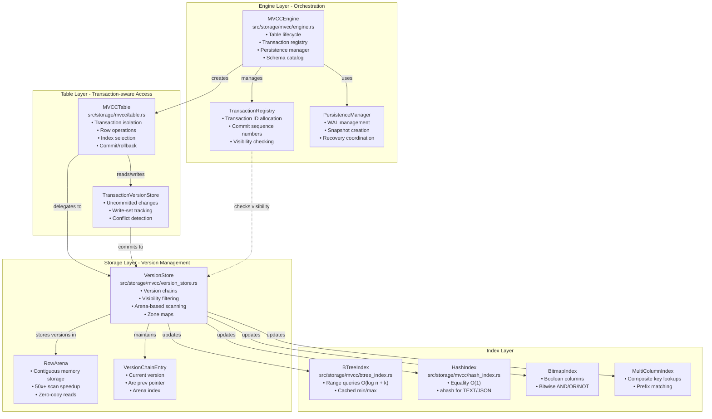
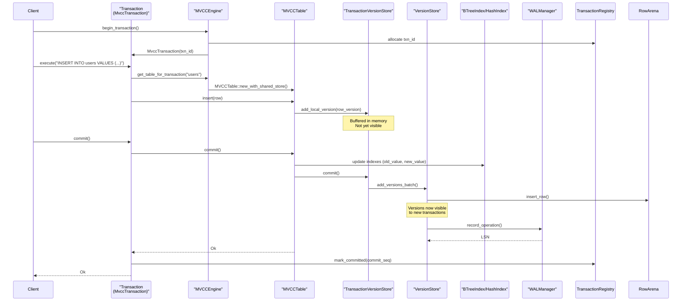
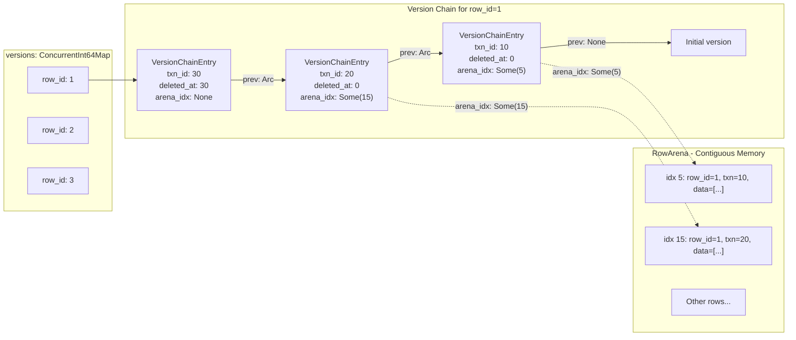
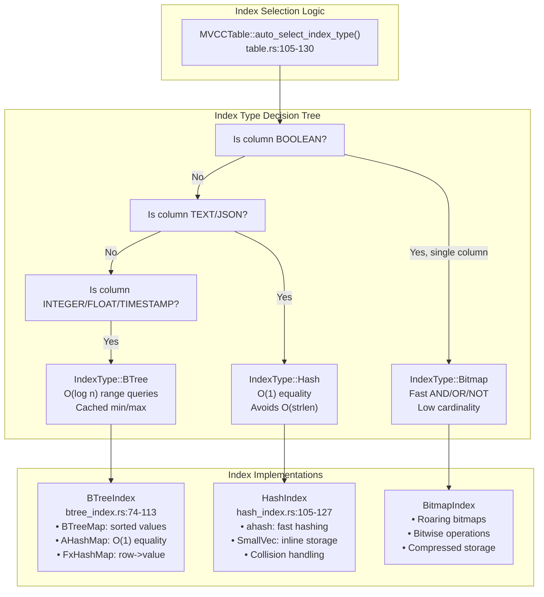

# Storage Engine

This document provides a detailed overview of Oxibase's storage engine, including its design principles, components, and how data is stored and retrieved.

## Storage Engine Design

Oxibase's storage engine is designed with the following principles:

- **Memory-optimized** - Prioritizes in-memory performance with optional persistence
- **MVCC-based** - Uses multi-version concurrency control for transaction isolation
- **Version-organized** - Tracks different versions of rows for transaction isolation
- **Type-specialized** - Uses different strategies for different data types
- **Index-accelerated** - Multiple index types to optimize different query patterns

## Architecture Overview



## Core Components and Responsibilities

The storage engine consists of four main classes that handle different aspects of data storage and retrieval:

| Component | File | Primary Responsibilities |
|-----------|------|--------------------------|
| `MVCCEngine` | [engine.rs:254-279]() | Database lifecycle, table creation/deletion, transaction coordination, schema management, persistence orchestration |
| `MVCCTable` | [table.rs:36-45]() | Per-transaction table view, row insert/update/delete, index lookup optimization, commit/rollback execution |
| `VersionStore` | [version_store.rs:157-193]() | Version chain management, visibility checking, arena-based scanning, row counting, index population |
| `TransactionVersionStore` | [version_store.rs:1354-1414]() | Uncommitted changes buffer, write-set conflict tracking, local version cache |

## Storage Engine Data Flow

This diagram shows how a typical transaction operation flows through the storage layers, from the public API down to the physical storage structures.



## Storage Components

### Table Structure

Tables in Oxibase are composed of:

- **Metadata** - Schema information, column definitions, and indexes
- **Row Data** - The primary data storage, organized by row
- **Version Store** - Tracks row versions for MVCC
- **Indexes** - B-tree, Hash, Bitmap, and multi-column indexes
- **Transaction Manager** - Manages transaction state and visibility

### Data Types

Oxibase supports a variety of data types, each with optimized storage:

- **INTEGER** - 64-bit signed integers
- **FLOAT** - 64-bit floating-point numbers
- **TEXT** - Variable-length UTF-8 strings
- **BOOLEAN** - Boolean values (true/false)
- **TIMESTAMP** - Date and time values
- **JSON** - JSON documents
- **NULL** - Null values supported for all types

### Version Management

Oxibase tracks different versions of data for transaction isolation:

- Each change creates a new version rather than overwriting
- Versions are associated with transaction IDs
- Visibility rules determine which versions each transaction can see
- Old versions are garbage collected when no longer needed

## Data Storage Format

### In-Memory Format

In memory, data is stored with these characteristics:

- **Row-based primary storage** - Records are stored as coherent rows
- **Version chains** - Linked versions for MVCC
- **Type-specific indexes** - B-tree, Hash, Bitmap based on column type
- **Efficient structures** - Optimized for different data types

### On-Disk Format

When persistence is enabled, data is stored on disk with:

- **Binary serialization** - Compact binary format for storage
- **WAL files** - Write-ahead log for durability
- **Snapshot files** - Point-in-time table snapshots
- **Metadata files** - Schema and index information

## MVCC Implementation

The storage engine uses MVCC to provide transaction isolation:

- **Full Version Chains** - Version history per row linked via pointers
- **Transaction IDs** - Each version is associated with a transaction ID
- **Visibility Rules** - Traverse version chains to find visible versions
- **Lock-Free Reads** - Readers never block writers
- **Automatic Cleanup** - Old versions garbage collected when no longer needed

For more details, see the [MVCC Implementation](mvcc-implementation) and [Transaction Isolation](transaction-isolation) documentation.

### Version Chain Management

Oxibase implements MVCC by maintaining linked version chains for each row. Each `VersionChainEntry` contains a `RowVersion` and an `Arc` pointer to the previous version, enabling O(1) chain cloning for snapshot isolation.



Key data structures:

- **`versions: ConcurrentInt64Map<VersionChainEntry>`** - Maps `row_id` to the head of its version chain
- **`VersionChainEntry`** - Linked list node with `version: RowVersion`, `prev: Option<Arc<...>>`, and `arena_idx: Option<usize>`
- **`RowArena`** - Contiguous memory storage providing 50x+ faster full table scans via zero-copy reads

The use of `Arc` for the `prev` pointer enables cheap snapshot cloning—creating a snapshot of a table is O(1) because the chain is reference-counted rather than deep-copied.

### Transaction Version Store

The `TransactionVersionStore` buffers uncommitted changes within a transaction, maintaining write-set information for conflict detection during commit.

| Field | Type | Purpose |
|-------|------|---------|
| `local_versions` | `Int64Map<RowVersion>` | Uncommitted inserts/updates/deletes |
| `write_set` | `Int64Map<WriteSetEntry>` | Conflict detection: tracks read version and sequence number |
| `version_store` | `Arc<VersionStore>` | Reference to global committed storage |
| `txn_id` | `i64` | Transaction identifier |

**Commit process:**
1. Check uniqueness constraints on all indexes
2. Update indexes with (old_value, new_value) pairs
3. Flush `local_versions` to `VersionStore` in batch
4. Mark zone maps as stale (for optimizer statistics)

**Rollback process:**
1. Discard all entries in `local_versions`
2. Clear `write_set` tracking data

### Index Architecture

Oxibase provides three index types, each optimized for different query patterns. The `MVCCTable` automatically selects the optimal index type based on column data types.



**Index selection rules:**
- **BOOLEAN** → `BitmapIndex` for fast bitwise AND/OR/NOT operations
- **TEXT/JSON** → `HashIndex` to avoid O(strlen) comparisons in B-tree nodes
- **INTEGER/FLOAT/TIMESTAMP** → `BTreeIndex` for range query support
- **Mixed types** → `BTreeIndex` as safe default

### BTreeIndex Internal Structure

The `BTreeIndex` maintains dual data structures for optimal performance across different query types:

| Data Structure | Type | Purpose | Complexity |
|----------------|------|---------|------------|
| `sorted_values` | `RwLock<BTreeMap<Value, RowIdSet>>` | Range queries, MIN/MAX | O(log n + k) |
| `value_to_rows` | `RwLock<AHashMap<Value, RowIdSet>>` | Equality lookups | O(1) |
| `row_to_value` | `RwLock<FxHashMap<i64, Value>>` | Removal by row_id | O(1) |
| `cached_min` | `RwLock<Option<Value>>` | MIN aggregate | O(1) |
| `cached_max` | `RwLock<Option<Value>>` | MAX aggregate | O(1) |

The dual-index strategy (BTreeMap + HashMap) trades memory (~2x for unique values) for optimal query performance: O(1) equality via hash lookup and O(log n + k) range queries via sorted iteration.

### HashIndex Characteristics

The `HashIndex` is designed for high-cardinality TEXT columns where equality queries dominate:

**Advantages:**
- O(1) exact match via `ahash` (faster than SipHash)
- Avoids O(strlen) string comparisons in B-tree traversal
- `SmallVec<[i64; 4]>` reduces allocations for unique indexes

**Limitations:**
- Does **NOT** support range queries
- Does **NOT** support ORDER BY optimization
- Requires exact match on all indexed columns (no partial key lookups)

**Triple-lock write pattern:**
```
add() acquires:
  1. hash_to_rows: Write
  2. row_to_hash: Write
  3. hash_to_values: Write
```

This ensures atomicity but serializes concurrent writes. Read operations (`find`) only acquire a single read lock for minimal contention.

### Row Arena: Zero-Copy Scanning

The `RowArena` stores row data in contiguous memory to eliminate per-row allocation overhead during full table scans:

**Performance characteristics:**
- **50x+ speedup** for full table scans vs. per-row cloning
- Pre-acquire locks once per scan (O(1) instead of O(N))
- Direct slice access via `unsafe` bounds-checked reads
- Cache locality from contiguous layout

**Arena structure:**
```
arena_rows: Vec<RowMetadata>  // [start, end, row_id, txn_id, create_time, deleted_at]
arena_data: Vec<Value>         // Flattened row data
row_arena_index: Int64Map<usize>  // row_id -> arena_idx
```

**Usage pattern:**
1. Acquire `arena_rows` and `arena_data` read guards once
2. Iterate version chains checking visibility
3. For visible versions, read directly from arena via `arena_idx`
4. Release locks after iteration completes
5. Sort results by `row_id` (if needed)

## Data Access Paths

### Point Lookups

For point queries (e.g., `WHERE id = 5`):

1. Use primary key or index to locate the row
2. Apply visibility rules based on transaction
3. Return the visible version

### Range Scans

For range queries (e.g., `WHERE price > 100`):

1. Use B-tree index if available for the column
2. Scan matching index entries
3. Apply visibility rules to each row
4. Return visible results

### Full Table Scans

For queries without applicable indexes:

1. Scan all rows in the table
2. Apply WHERE clause filters
3. Apply visibility rules
4. For large tables, parallelize the scan

## Data Modification

### Insert Operations

When data is inserted:

1. Values are validated against column types
2. A new row version is created with the current transaction ID
3. The row is added to the primary row storage
4. Indexes are updated
5. The operation is recorded in the WAL (if enabled)

### Update Operations

When data is updated:

1. The existing row is located via indexes or scan
2. A new version is created with updated values
3. The new version links to the previous version
4. Indexes are updated to reflect the changes
5. The operation is recorded in the WAL (if enabled)

### Delete Operations

When data is deleted:

1. The existing row is located
2. A deletion marker version is created
3. Indexes are updated to reflect the deletion
4. The operation is recorded in the WAL (if enabled)

## Persistence and Recovery

When persistence is enabled:

### Write-Ahead Logging (WAL)

The storage engine provides crash consistency through Write-Ahead Logging (WAL) and periodic snapshots:

**WAL Manager responsibilities:**
- Sequential writes with CRC32 checksums
- Two-phase recovery: Phase 1 identifies committed transactions, Phase 2 applies their changes
- Compression (optional) for reduced I/O

**Snapshot system:**
- Binary format with magic bytes (`0x50414E53` = "SNAP")
- Atomic 3-phase writes: temp file → sync → rename
- Tracks source LSN for incremental recovery

**Recovery flow:**
1. Read snapshot metadata to get checkpoint LSN
2. Load table snapshots (fastest recovery path)
3. Replay WAL entries from checkpoint LSN forward
4. Apply only entries from committed transactions (two-phase)
5. Populate indexes in single pass after replay completes

### Write-Ahead Logging (WAL)

1. All modifications are recorded in the WAL before being applied
2. WAL entries include transaction ID, operation type, and data
3. WAL is flushed to disk for durability
4. This ensures recovery in case of crashes

### Snapshots

1. Periodically, consistent snapshots of tables are created
2. Snapshots contain the latest version of each row
3. Snapshots accelerate recovery compared to replaying the entire WAL

### Recovery Process

After a crash, recovery proceeds as follows:

1. The latest valid snapshot is loaded for each table
2. WAL entries after the snapshot are replayed
3. Index definitions are restored and indexes rebuilt
4. Incomplete transactions are rolled back

## Schema Management

The `MVCCEngine` maintains the schema catalog and handles DDL operations:

**Schema storage:**
- `schemas: Arc<RwLock<FxHashMap<String, Schema>>>`
- Lowercase table names for case-insensitive lookups
- Schema changes recorded to WAL

**ALTER TABLE operations:**
- `AddColumn`: Normalizes existing rows, adds default values
- `DropColumn`: Truncates row data
- `RenameColumn`: Updates schema, preserves data
- `ModifyColumn`: Type coercion with validation
- `RenameTable`: Updates all references atomically

**Schema normalization:**
When reading rows, `MVCCTable` normalizes row data to match the current schema, handling columns added/dropped via ALTER TABLE by filling defaults or truncating.

## Implementation Details

Core storage engine components in the Rust codebase:

```
src/storage/
├── mod.rs              # Storage module entry point
├── traits/             # Storage interfaces
│   ├── engine.rs       # Engine trait
│   ├── table.rs        # Table trait
│   └── transaction.rs  # Transaction trait
└── mvcc/               # MVCC implementation
    ├── engine.rs       # MVCC storage engine
    ├── table.rs        # Table with row storage
    ├── transaction.rs  # Transaction management
    ├── version_store.rs # Version tracking
    ├── btree_index.rs  # B-tree index
    ├── hash_index.rs   # Hash index
    ├── bitmap_index.rs # Bitmap index
    ├── multi_column_index.rs # Multi-column index
    └── persistence.rs  # WAL and snapshots
```

## Performance Characteristics

### Read Performance

- **Point Lookups** - O(1) with hash index, O(log n) with B-tree
- **Range Scans** - O(log n + k) with B-tree index
- **Full Scans** - Parallelized for large tables

### Write Performance

- **Inserts** - O(log n) per index
- **Updates** - O(log n) per index plus version creation
- **Deletes** - O(log n) per index for marker creation

### Concurrency

- **High Read Concurrency** - MVCC enables many concurrent readers
- **Write Concurrency** - Multiple writers with conflict detection
- **No Read Locks** - Readers never block on writes
