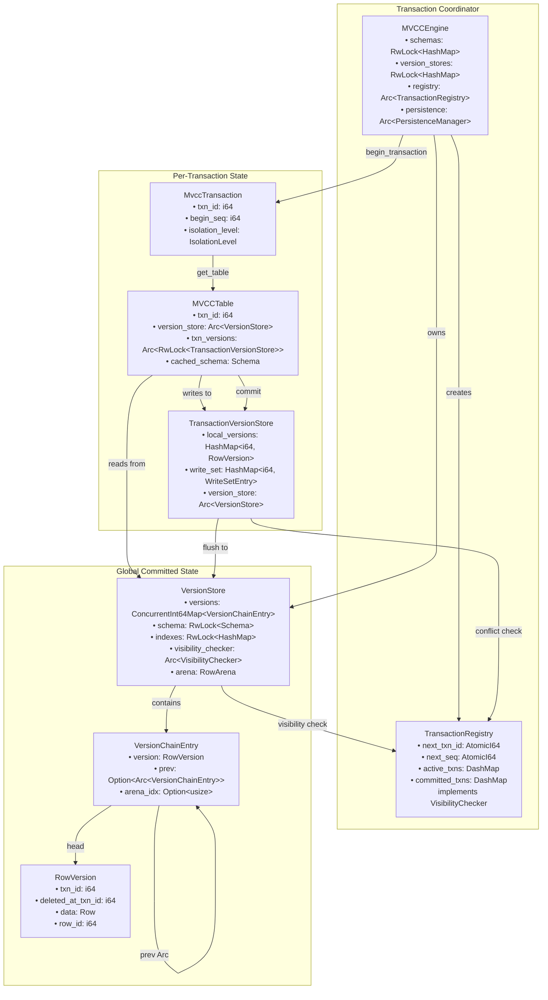
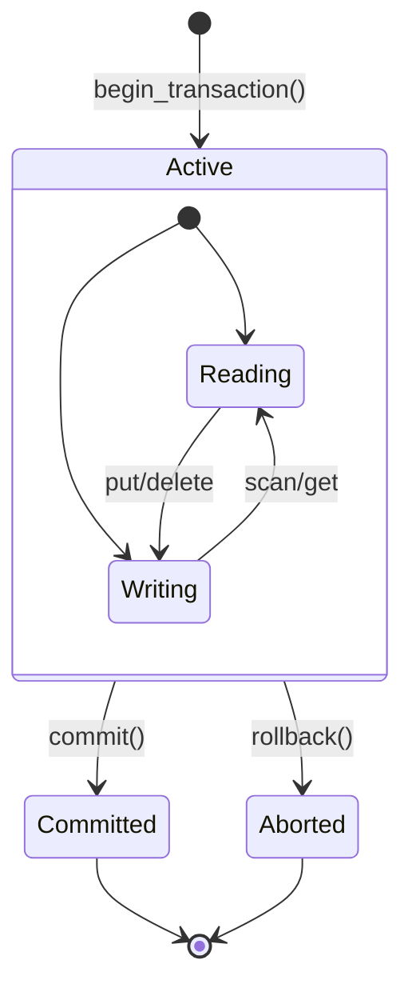
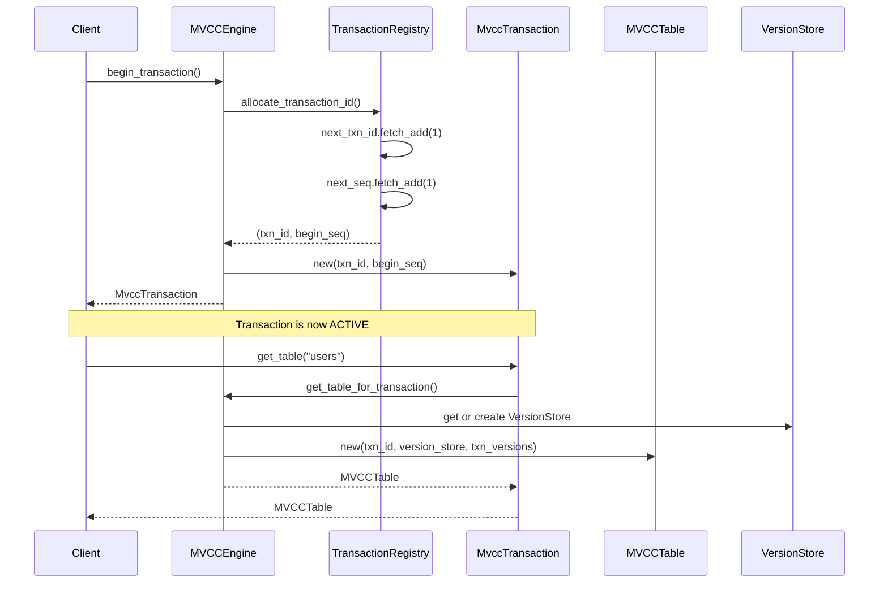
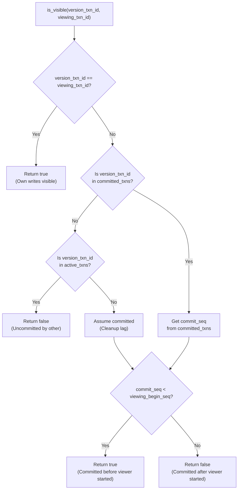
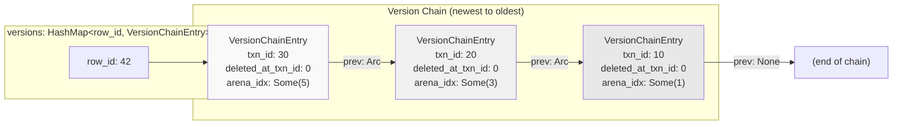
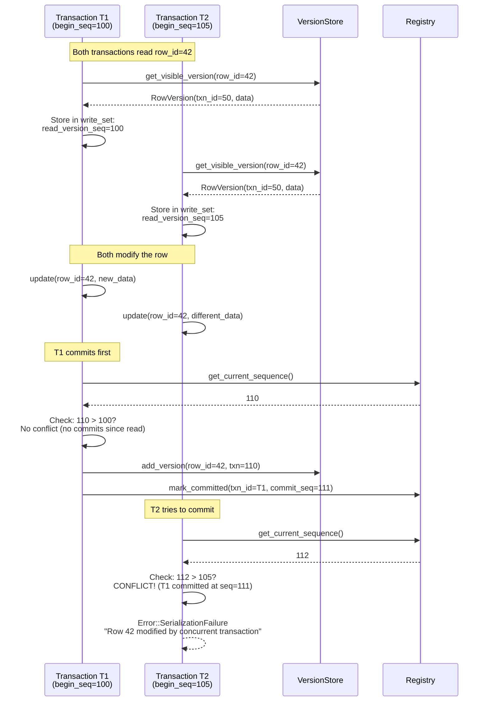
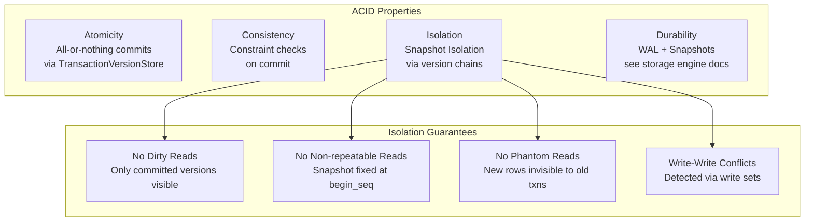

# Transaction Isolation in OxiBase

OxiBase implements Multi-Version Concurrency Control (MVCC) to provide transaction isolation with minimal locking overhead. This document explains how transactions work in OxiBase and the available isolation levels.

## Implemented Isolation Levels

OxiBase currently supports two isolation levels:

1. **READ COMMITTED** - The default isolation level where a transaction only sees data that has been committed by other transactions. Each query within the transaction may see different versions of data as other transactions commit.

2. **SNAPSHOT** (also known as REPEATABLE READ) - Provides a consistent view of the database as it was when the transaction started. All queries within the transaction see the same snapshot of data, regardless of concurrent commits by other transactions.

## Setting Isolation Levels

OxiBase provides multiple ways to control transaction isolation levels:

### Connection-level Default Isolation Level

Set the default isolation level for the current connection using `SET ISOLATIONLEVEL`:

```sql
-- Set connection default to READ COMMITTED (default)
SET ISOLATIONLEVEL = 'READ COMMITTED';

-- Set connection default to SNAPSHOT
SET ISOLATIONLEVEL = 'SNAPSHOT';
```

This setting affects:
- **Auto-commit transactions** - Queries executed without an explicit transaction
- **Transactions started with BEGIN** - When no isolation level is specified

### Transaction-specific Isolation Level

Override the connection's default isolation level for a specific transaction:

```sql
-- Start a transaction with READ COMMITTED isolation level
BEGIN TRANSACTION ISOLATION LEVEL READ COMMITTED;

-- Start a transaction with SNAPSHOT isolation level  
BEGIN TRANSACTION ISOLATION LEVEL SNAPSHOT;
```

### Programmatic Transaction Control

When using the OxiBase driver programmatically:

```go
// Use connection default (affected by SET ISOLATIONLEVEL)
tx, err := db.Begin()

// Explicitly specify isolation level (ignores SET ISOLATIONLEVEL)
tx, err := db.BeginTx(context.Background(), &sql.TxOptions{
    Isolation: sql.LevelSnapshot,
})
```

**Important**: Transaction-specific isolation levels always take precedence over the connection default set by `SET ISOLATIONLEVEL`.

## MVCC Implementation

OxiBase's MVCC implementation uses a combination of techniques to provide efficient transaction isolation:

### Component Architecture



### Component Responsibilities

**MVCCEngine** - Top-level coordinator, manages schemas and version stores:
- Owns all `VersionStore` instances (one per table)
- Manages table schemas and DDL operations
- Coordinates persistence (WAL and snapshots)
- Creates and tracks transactions
- Provides `TransactionRegistry` for visibility decisions

**TransactionRegistry** - Issues txn IDs, tracks commit state:
- Allocates unique transaction IDs (monotonically increasing)
- Assigns sequence numbers for commit ordering
- Tracks active and committed transactions
- Implements `VisibilityChecker` trait for version visibility logic
- Enforces transaction isolation through visibility rules

**MvccTransaction** - Represents a single database transaction:
- Holds transaction ID and begin sequence number
- Provides `get_table()` to access `MVCCTable` with MVCC isolation
- Manages commit/rollback lifecycle

**MVCCTable** - Transaction-aware table interface:
- Routes reads to `VersionStore` (committed data)
- Routes writes to `TransactionVersionStore` (uncommitted local changes)
- Implements `Table` trait with MVCC semantics
- Handles index updates, constraint checking, visibility filtering

**VersionStore** - Stores committed versions for one table:
- Maintains version chains (linked list via Arc)
- Manages indexes (BTree, Hash, Bitmap)
- Provides arena-based zero-copy scanning
- Tracks uncommitted writes for conflict detection

**TransactionVersionStore** - Holds transaction-local uncommitted changes:
- Tracks write set for conflict detection
- Merged into `VersionStore` on commit
- Discarded on rollback

### Transaction IDs and Timestamps

- Each transaction is assigned a unique transaction ID (`txnID`)
- Begin timestamps are assigned when the transaction starts
- Commit timestamps are assigned when the transaction commits
- Timestamps are used to determine data visibility between transactions

### Row Versioning

- Each row maintains a full version chain linked via `prev` pointers
- Each version includes:
  - Creation transaction ID
  - Deletion transaction ID (if applicable)
  - Column values at that version
  - Pointer to previous version
- Version chains enable concurrent transactions to see different historical versions
- New versions are always created (immutability) - existing versions never modified

### Transaction Lifecycle

#### Transaction State Machine



#### Transaction Creation Flow



### Visibility Rules

The `VisibilityChecker` trait abstracts transaction visibility logic. `TransactionRegistry` implements this trait to determine which versions each transaction can see.

#### Visibility Algorithm



**Snapshot Isolation Guarantee:** A transaction with `begin_seq=100` sees all versions committed with `commit_seq < 100`. This ensures:
- Consistent reads throughout transaction lifetime
- No phantom reads (new rows don't appear mid-transaction)
- No dirty reads (uncommitted changes invisible)

#### READ COMMITTED Mode

In READ COMMITTED mode (the default):
- A transaction sees its own uncommitted changes
- A transaction sees all changes committed by other transactions at the time of each query
- A transaction never sees uncommitted changes from other transactions

#### SNAPSHOT Mode

In SNAPSHOT mode:
- A transaction sees its own uncommitted changes
- A transaction sees only changes that were committed before the transaction started
- Changes committed by other transactions after this transaction started are not visible

## Transaction Operations

### Beginning a Transaction

A transaction can be started with various forms of the `BEGIN` statement:

```sql
-- Start a transaction with default isolation level (READ COMMITTED)
BEGIN;

-- Alternative syntax
BEGIN TRANSACTION;

-- Start with specific isolation level
BEGIN TRANSACTION ISOLATION LEVEL READ COMMITTED;
BEGIN TRANSACTION ISOLATION LEVEL SNAPSHOT;
```

Transactions can also start implicitly with the first statement execution if no explicit transaction is active.

### Performing Operations

Within a transaction, you can perform the following operations:

- **SELECT** - Reads data visible to the transaction
- **INSERT** - Creates new row versions
- **UPDATE** - Creates new row versions and marks old versions as deleted
- **DELETE** - Marks row versions as deleted

### Committing a Transaction

Transactions are committed with the `COMMIT` statement:

```sql
COMMIT;
```

During commit:
1. A commit timestamp is assigned to the transaction
2. All changes become visible to other transactions (based on their isolation level)
3. The transaction is removed from the active transactions list
4. If a transaction-specific isolation level was set, it reverts to the session default

### Rolling Back a Transaction

Transactions can be rolled back with the `ROLLBACK` statement:

```sql
ROLLBACK;
```

During rollback:
1. All changes made by the transaction are discarded
2. The transaction is removed from the active transactions list
3. If a transaction-specific isolation level was set, it reverts to the session default

## Concurrency Control

OxiBase uses optimistic concurrency control with lock-free design:

1. Transactions proceed without acquiring any locks
2. Multiple writers can work concurrently on different rows
3. At commit time, the system checks for write-write conflicts
4. If a conflict is detected, the transaction is aborted

### Version Chains

Each row in the `VersionStore` is represented as a linked list of versions, with the newest version at the head. The chain uses `Arc<VersionChainEntry>` for cheap snapshot cloning.



**Key Design Decisions:**

| Aspect | Choice | Rationale |
|--------|--------|-----------|
| **Chain direction** | Newest → Oldest | Most queries read recent data (temporal locality) |
| **Pointer type** | `Arc<VersionChainEntry>` | O(1) chain cloning, cheap snapshots |
| **Version metadata** | `txn_id`, `deleted_at_txn_id` | Enables visibility without storing transaction state in version |
| **Arena storage** | `arena_idx: Option<usize>` | Zero-copy scanning for committed versions |

### Write Set Tracking

Write set tracking enables conflict detection for concurrent updates:

**WriteSetEntry Structure:**
```rust
pub struct WriteSetEntry {
    pub read_version: Option<RowVersion>,  // Version when first read
    pub read_version_seq: i64,              // Sequence when read
}
```

**Conflict Detection Algorithm:**
1. Transaction T1 reads row R at sequence S1, stores in write_set
2. Transaction T2 commits an update to row R at sequence S2
3. Transaction T1 tries to commit
4. Conflict check: If current_seq for row R > T1's stored read_version_seq, conflict detected
5. T1's commit fails with `Error::SerializationFailure`

### Write-Write Conflict Detection

For SNAPSHOT isolation, OxiBase implements write-write conflict detection to prevent lost updates:

- When a transaction begins, it records a begin timestamp
- When rows are modified, write timestamps are tracked
- At commit time, if any row being written has a write timestamp greater than the transaction's begin timestamp, a conflict is detected
- The transaction is aborted with: `transaction aborted due to write-write conflict`

This ensures that concurrent transactions cannot overwrite each other's changes without detection.

### Conflict Detection Flow



### Types of Conflicts

Conflicts are detected in the following scenarios:

- **Write-Write Conflicts** (SNAPSHOT only) - When two transactions modify the same row
- **Primary Key Conflicts** - When two transactions try to insert rows with the same primary key
- **Unique Constraint Conflicts** - When an insert or update violates a unique constraint

## Implementation Details

The transaction isolation in OxiBase is implemented in the following key components:

- `src/storage/mvcc/engine.rs` - Contains the transaction creation and management logic
- `src/storage/mvcc/transaction.rs` - Implements the transaction interface with isolation level management
- `src/storage/mvcc/version_store.rs` - Manages versioned data
- `src/executor/query.rs` - Handles SQL statement execution and isolation level parsing

## Best Practices

- Transactions should be kept short to minimize conflicts
- Use explicit transactions for operations that need to be atomic
- Consider your specific application's needs when deciding between READ COMMITTED and SNAPSHOT:
  - **READ COMMITTED** is good for most OLTP workloads, offering better concurrency
  - **SNAPSHOT** is useful for analytical queries that need a consistent point-in-time view
- Use session-wide isolation levels for applications with consistent isolation requirements
- Use transaction-specific isolation levels when you need different isolation guarantees for specific operations

## Examples

### Basic Transaction with Default Isolation

```sql
BEGIN;
UPDATE accounts SET balance = balance - 100 WHERE id = 1;
UPDATE accounts SET balance = balance + 100 WHERE id = 2;
COMMIT;
```

### Transaction with Specific Isolation Level

```sql
-- Use SNAPSHOT isolation for a consistent analytical query
BEGIN TRANSACTION ISOLATION LEVEL SNAPSHOT;
SELECT category, SUM(amount) FROM sales GROUP BY category;
SELECT COUNT(*) FROM products WHERE active = true;
COMMIT;
```

### Session-wide Isolation Level Setting

```sql
-- Set session to use SNAPSHOT isolation by default
SET ISOLATIONLEVEL = 'SNAPSHOT';

-- All subsequent transactions will use SNAPSHOT isolation
BEGIN;
SELECT * FROM inventory WHERE quantity > 0;
UPDATE inventory SET quantity = quantity - 1 WHERE product_id = 123;
COMMIT;

-- Reset to default
SET ISOLATIONLEVEL = 'READ COMMITTED';
```

### Transaction with Rollback

```sql
BEGIN;
UPDATE accounts SET balance = balance - 100 WHERE id = 1;
-- Something went wrong
ROLLBACK;
```

### Write-Write Conflict Example

```sql
-- Connection 1
SET ISOLATIONLEVEL = 'SNAPSHOT';
BEGIN;
SELECT balance FROM accounts WHERE id = 1; -- Returns 1000

-- Connection 2
SET ISOLATIONLEVEL = 'SNAPSHOT';
BEGIN;
SELECT balance FROM accounts WHERE id = 1; -- Returns 1000

-- Connection 1
UPDATE accounts SET balance = 900 WHERE id = 1;
COMMIT; -- Success

-- Connection 2
UPDATE accounts SET balance = 800 WHERE id = 1;
COMMIT; -- Fails with: transaction aborted due to write-write conflict
```

In this example, both transactions read the same initial value (1000) but Connection 2's commit fails because Connection 1 already modified the row after Connection 2's transaction began.

## Isolation Level Implementation

### Snapshot Isolation Implementation

OxiBase implements **Snapshot Isolation** through:

1. **Begin Timestamp:** Each transaction gets a `begin_seq` from `TransactionRegistry.next_seq`
2. **Commit Timestamp:** Each committing transaction gets a `commit_seq` from `TransactionRegistry.next_seq`
3. **Visibility Rule:** Transaction T sees version V if `V.commit_seq < T.begin_seq`

**Guarantees Provided:**

| Property | Implementation |
|----------|----------------|
| **Consistent reads** | Transaction sees snapshot as of `begin_seq` |
| **No dirty reads** | Only committed versions visible (checked via `committed_txns`) |
| **No non-repeatable reads** | Same row returns same version throughout transaction |
| **No phantom reads** | New rows committed after `begin_seq` are invisible |
| **First-committer-wins** | Write set conflict detection at commit time |

### Isolation Properties Summary



## Performance Characteristics

### Lock-Free Design

- **No table-level locks** - SNAPSHOT isolation commits without global synchronization
- **Concurrent writers** - Multiple transactions can commit simultaneously
- **Version chain traversal** - Efficient backward traversal to find visible versions
- **Automatic cleanup** - Old versions garbage collected when no longer needed

### Performance Metrics

| Operation | Time Complexity | Notes |
|-----------|----------------|-------|
| **Begin transaction** | O(1) | Atomic counter increment |
| **Read visible version** | O(V) | V = chain length, typically 1-3 |
| **Write (uncommitted)** | O(1) | Insert into `TransactionVersionStore.local_versions` |
| **Commit** | O(W) | W = write set size, batch insert to `VersionStore` |
| **Conflict check** | O(W) | W = write set size, check each modified row |
| **Rollback** | O(1) | Discard `TransactionVersionStore` |
| **Full table scan** | O(N) | N = row count, arena-based zero-copy |

### Memory Management

- Version chains built from WAL replay during recovery
- Only latest version persisted to disk snapshots
- Old versions automatically cleaned up based on active transaction needs

## Limitations

- Long-running transactions prevent garbage collection of old versions
- Extremely high concurrency on the same rows may lead to frequent conflicts in SNAPSHOT isolation
- Savepoints are not currently supported
- Each connection maintains its own default isolation level set by `SET ISOLATIONLEVEL`