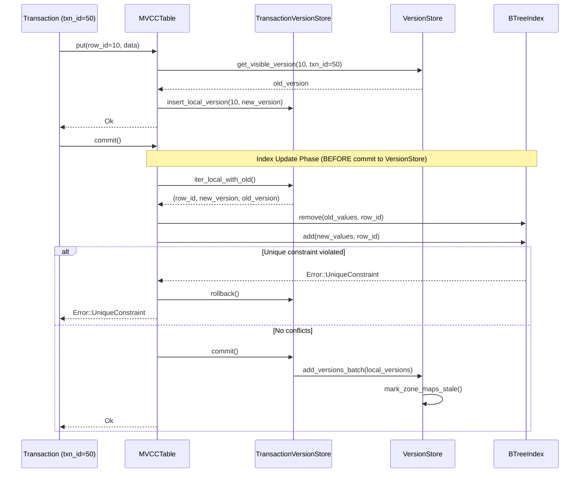

# Indexing in Oxibase

This document explains Oxibase's indexing system, including the types of indexes available, when to use each type, and best practices for index management.

## Index Types

Oxibase supports three primary index types, each optimized for different query patterns:

### 1. B-tree Indexes

B-tree indexes are the default for numeric and timestamp columns:

- **Design**: Balanced tree structure with sorted values
- **Strengths**: Range queries, equality lookups, sorting, prefix matching
- **Default For**: `INTEGER`, `FLOAT`, `TIMESTAMP` columns
- **Use Cases**: Price ranges, date ranges, numeric comparisons

```sql
-- Auto-selected for INTEGER column
CREATE INDEX idx_price ON products(price);

-- Explicitly specify B-tree
CREATE INDEX idx_date ON orders(order_date) USING BTREE;
```

**Supported Operations:**
- Equality: `WHERE price = 100`
- Range: `WHERE price > 100`, `WHERE price BETWEEN 50 AND 200`
- IN clause: `WHERE id IN (1, 2, 3)`
- Sorting: `ORDER BY price` (can use index for sorted access)

### 2. Hash Indexes

Hash indexes provide O(1) equality lookups:

- **Design**: Hash table mapping values to row IDs
- **Strengths**: Fast equality lookups, O(1) average case
- **Default For**: `TEXT`, `JSON` columns
- **Use Cases**: Email lookups, username searches, exact string matches

```sql
-- Auto-selected for TEXT column
CREATE INDEX idx_email ON users(email);

-- Explicitly specify Hash
CREATE INDEX idx_status ON orders(status) USING HASH;
```

**Supported Operations:**
- Equality: `WHERE email = 'alice@example.com'`
- IN clause: `WHERE status IN ('pending', 'shipped')`

**Not Supported:**
- Range queries: `WHERE name > 'A'` (will not use hash index)
- Sorting: Cannot provide sorted access

### 3. Bitmap Indexes

Bitmap indexes are optimized for low-cardinality columns:

- **Design**: Bitmap per unique value using RoaringTreemap
- **Strengths**: Fast boolean operations, low memory for low cardinality
- **Default For**: `BOOLEAN` columns
- **Use Cases**: Status flags, boolean fields, enum-like columns

```sql
-- Auto-selected for BOOLEAN column
CREATE INDEX idx_active ON users(active);

-- Explicitly specify Bitmap
CREATE INDEX idx_verified ON users(verified) USING BITMAP;
```

**Supported Operations:**
- Equality: `WHERE active = true`
- Fast AND/OR combinations with other bitmap indexes

**Not Supported:**
- Range queries
- IN clause with many values

## Automatic Index Type Selection

When you create an index without specifying a type, Oxibase automatically selects the optimal type based on the column's data type:

| Data Type | Default Index | Reason |
|-----------|---------------|--------|
| `INTEGER` | B-tree | Range queries common on numbers |
| `FLOAT` | B-tree | Range queries common on decimals |
| `TIMESTAMP` | B-tree | Date range queries common |
| `TEXT` | Hash | O(1) equality lookups for strings |
| `JSON` | Hash | O(1) equality lookups for JSON |
| `BOOLEAN` | Bitmap | Only two values, perfect for bitmap |

## The USING Clause

Override the default index type with the `USING` clause:

```sql
-- Force B-tree on a text column (for prefix queries)
CREATE INDEX idx_name_btree ON users(name) USING BTREE;

-- Force Hash on an integer column (pure equality lookups)
CREATE INDEX idx_id_hash ON orders(user_id) USING HASH;

-- Force Bitmap on a low-cardinality text column
CREATE INDEX idx_status_bitmap ON orders(status) USING BITMAP;
```

## Multi-Column Indexes

Oxibase supports composite indexes on multiple columns:

```sql
-- Create a multi-column index
CREATE INDEX idx_cust_date ON orders(customer_id, order_date);

-- Create a unique multi-column index
CREATE UNIQUE INDEX idx_unique_cust_date ON orders(customer_id, order_date);
```

### Features

- **Hash-Based**: Efficient equality lookups on all indexed columns
- **Lazy Build**: Index is built on first query access for fast table loads
- **Unique Constraints**: Enforces uniqueness across the combination of columns
- **NULL Handling**: Multiple NULL values allowed (SQL standard behavior)
- **Full Persistence**: WAL and snapshot support for durability

### Usage

Multi-column indexes are used when queries filter on all indexed columns:

```sql
-- Uses idx_cust_date efficiently
SELECT * FROM orders WHERE customer_id = 100 AND order_date = '2024-01-15';

-- Partial match - may or may not use multi-column index
SELECT * FROM orders WHERE customer_id = 100;
```

## Index Intersection

When multiple indexes exist on different columns, Oxibase can combine them:

```sql
-- If idx_category (Hash) and idx_price (B-tree) exist:
SELECT * FROM products WHERE category = 'Electronics' AND price > 500;
-- Both indexes used, results intersected
```

The query executor:
1. Looks up row IDs from each applicable index
2. Intersects the results for AND conditions
3. Unions the results for OR conditions

## Creating Indexes

### Basic Syntax

```sql
-- Standard index (type auto-selected)
CREATE INDEX index_name ON table_name(column_name);

-- Explicit index type
CREATE INDEX index_name ON table_name(column_name) USING BTREE;
CREATE INDEX index_name ON table_name(column_name) USING HASH;
CREATE INDEX index_name ON table_name(column_name) USING BITMAP;

-- Multi-column index
CREATE INDEX index_name ON table_name(col1, col2, col3);

-- Unique index
CREATE UNIQUE INDEX index_name ON table_name(column_name);
```

### Dropping Indexes

```sql
DROP INDEX index_name ON table_name;
```

## Index and MVCC

Oxibase's indexes are integrated with the MVCC system:

- Indexes are updated during transaction commit
- For UPDATE: old values removed, new values added
- For DELETE: values removed from index
- For INSERT: values added to index
- All index updates are transactional

## Persistence

All indexes are fully persisted:

- Index metadata stored in WAL (type, columns, unique flag)
- Index data rebuilt from table data on recovery
- Snapshots capture index definitions
- Recovery restores all indexes automatically

## Query Optimizer Integration

The cost-based optimizer considers indexes when planning queries:

- Estimates selectivity based on index statistics
- Chooses between index scan and sequential scan
- Considers index type capabilities (range vs equality)
- Uses ANALYZE statistics for better estimates

```sql
-- View query plan including index usage
EXPLAIN SELECT * FROM orders WHERE amount > 100;

-- Collect statistics for optimizer
ANALYZE orders;
```

## Best Practices

### When to Create Indexes

1. **Primary key columns** - Always indexed automatically
2. **Foreign key columns** - Improves join performance
3. **Columns in WHERE clauses** - Speeds up filtering
4. **Columns in JOIN conditions** - Accelerates joins
5. **Columns in ORDER BY** - B-tree can avoid sorting

### Index Selection Guidelines

| Query Pattern | Recommended Index |
|--------------|-------------------|
| `WHERE id = value` | B-tree or Hash |
| `WHERE price > 100` | B-tree |
| `WHERE email = value` | Hash (default for TEXT) |
| `WHERE active = true` | Bitmap (default for BOOLEAN) |
| `WHERE cat = x AND brand = y` | Multi-column |
| `ORDER BY date` | B-tree |

### Common Mistakes

1. **Over-indexing** - Too many indexes slow down writes
2. **Wrong index type** - Using B-tree for pure equality on text
3. **Missing multi-column** - Creating separate indexes instead of composite
4. **Indexing low-selectivity columns** - Limited benefit, wastes space

## Performance Characteristics

| Index Type | Equality | Range | Space | Write Cost |
|------------|:--------:|:-----:|:-----:|:----------:|
| B-tree | O(log n) | O(log n + k) | Medium | Medium |
| Hash | O(1) avg | N/A | Medium | Low |
| Bitmap | O(1) | N/A | Low* | Low |

*For low cardinality columns

## Index Consistency Under MVCC

Indexes are updated **before** commit to detect unique constraint violations early:



**Index-Version Consistency Guarantees:**

1. **Atomic index updates**: All indexes are updated within the same transaction commit phase
2. **Rollback safety**: If any index update fails (e.g., unique constraint), all changes are discarded via `rollback()`
3. **Visibility consistency**: Indexes contain entries only for committed versions. Uncommitted rows in `local_versions` are not indexed until commit succeeds

## BTreeIndex Internal Structure

The `BTreeIndex` maintains dual data structures for optimal performance across different query types:

| Data Structure | Type | Purpose | Complexity |
|----------------|------|---------|------------|
| `sorted_values` | `RwLock<BTreeMap<Value, RowIdSet>>` | Range queries, MIN/MAX | O(log n + k) |
| `value_to_rows` | `RwLock<AHashMap<Value, RowIdSet>>` | Equality lookups | O(1) |
| `row_to_value` | `RwLock<FxHashMap<i64, Value>>` | Removal by row_id | O(1) |
| `cached_min` | `RwLock<Option<Value>>` | MIN aggregate | O(1) |
| `cached_max` | `RwLock<Option<Value>>` | MAX aggregate | O(1) |

The dual-index strategy (BTreeMap + HashMap) trades memory (~2x for unique values) for optimal query performance: O(1) equality via hash lookup and O(log n + k) range queries via sorted iteration.

## HashIndex Characteristics

The `HashIndex` is designed for high-cardinality TEXT columns where equality queries dominate:

**Advantages:**
- O(1) exact match via `ahash` (faster than SipHash)
- Avoids O(strlen) string comparisons in B-tree traversal
- `SmallVec<[i64; 4]>` reduces allocations for unique indexes

**Limitations:**
- Does **NOT** support range queries
- Does **NOT** support ORDER BY optimization
- Requires exact match on all indexed columns (no partial key lookups)

**Triple-lock write pattern:**
```
add() acquires:
  1. hash_to_rows: Write
  2. row_to_hash: Write
  3. hash_to_values: Write
```

This ensures atomicity but serializes concurrent writes. Read operations (`find`) only acquire a single read lock for minimal contention.

## BitmapIndex Implementation

Bitmap indexes use Roaring bitmaps for compressed, efficient boolean operations:

**Key Features:**
- **Roaring Bitmap**: Industry-standard bitmap implementation (used by Lucene, Druid, Spark)
- **Compression**: Automatic run-length encoding for consecutive bits
- **Fast Operations**: AND, OR, NOT operations are highly optimized
- **Memory Efficient**: Low memory footprint for low-cardinality columns

**Use Cases:**
- Boolean flags and status columns
- Enum-like TEXT columns with few distinct values
- Multi-column filtering with AND/OR conditions

## Performance Optimizations

### Batch Operations for Reduced Lock Contention

Batch APIs reduce lock acquisition overhead by processing multiple rows in a single critical section:

| Operation | Traditional (Per-Row) | Batch API | Improvement |
|-----------|----------------------|-----------|-------------|
| **Insert 1000 rows** | 1000 lock acquisitions | 1 lock acquisition | ~100x reduction |
| **Index updates on commit** | N × M locks (rows × indexes) | 1 traversal | Single-pass |
| **Visibility check for SELECT** | N locks (one per row) | 1 lock (batch fetch) | O(1) contention |

### Lock-Free Read Path

Read operations (`SELECT` queries) never acquire write locks, achieving true MVCC non-blocking reads:

1. **Version traversal**: Uses read-only references to Arc-wrapped version chains
2. **Visibility checking**: Compares transaction IDs without modifying state
3. **Index lookups**: BTree and Hash indexes use `RwLock::read()` for concurrent readers

## Index Update Optimization

The commit process uses `iter_local_with_old()` which provides both the new version and the old version without requiring an extra lookup:

```rust
// For each modified row:
if is_deleted {
    index.remove(old_values, row_id, row_id)
} else if old_values != new_values {
    index.remove(old_values, row_id, row_id)  // Remove old
    index.add(new_values, row_id, row_id)      // Add new
}
// Same values: no index update needed
```

This optimization ensures index updates are performed in a single pass during commit, avoiding redundant lookups and ensuring consistency.

## Implementation Notes

Oxibase's indexes are implemented in:

- `src/storage/mvcc/btree_index.rs` - B-tree index implementation
- `src/storage/mvcc/hash_index.rs` - Hash index implementation
- `src/storage/mvcc/bitmap_index.rs` - Bitmap index implementation
- `src/storage/mvcc/multi_column_index.rs` - Multi-column index
- `src/storage/traits/index_trait.rs` - Common index trait
