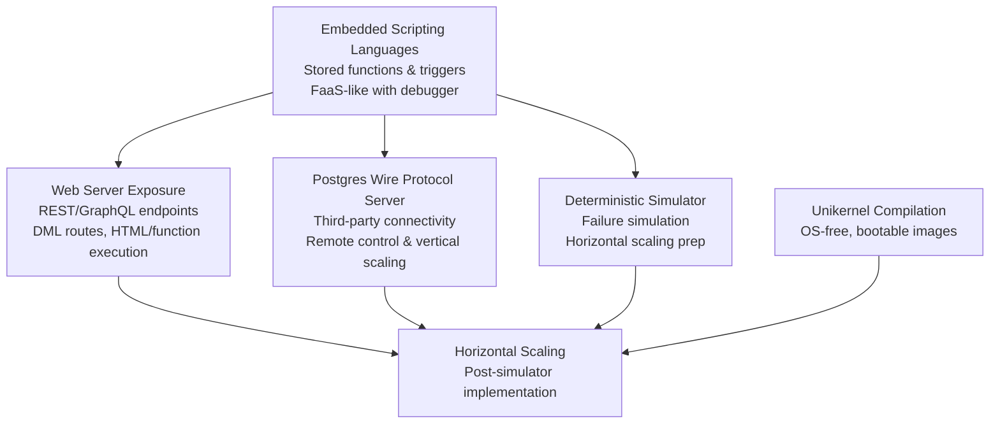

# Oxibase Roadmap

Oxibase is evolving into a distributed, autonomous database system that bridges embedded logic with global resilience. This roadmap outlines the journey from a single-node, scriptable database to a self-managing, AI-enhanced platform.


## Phase 1: Foundation

These parallel efforts establish Oxibase's core capabilities and prepare for scaling. They focus on single-node enhancements that enable seamless development, connectivity, and deployment without relying on external systems.

_Figure 1: Current Priorities Dependency Flow_



## Current Object Support

| Object Type | Status | Notes |
|-------------|--------|-------|
| Schemas | Available | No CREATE SCHEMA/DROP SCHEMA support |
| User-defined Functions | Available | CREATE FUNCTION/DROP FUNCTION supported |
| Stored Procedures | Missing | No CREATE PROCEDURE/DROP PROCEDURE |
| Materialized Views | Missing | No CREATE MATERIALIZED VIEW |
| Custom Types/Domains | Missing | No CREATE TYPE/CREATE DOMAIN |
| Rules | Missing | No CREATE RULE/DROP RULE |
| Extensions | Missing | No CREATE EXTENSION |
| Foreign Data Wrappers | Missing | No foreign table support |
| Aggregates | Missing | No custom aggregate functions |
| Operators | Missing | No custom operator definitions |
| Event Triggers | Missing | No DDL event triggers |
| Tablespaces | Missing | No CREATE TABLESPACE |
| Roles/Users | Missing | No user/role management |
| Publications/Subscriptions | Missing | No logical replication support |

### Embedded Scripting Languages

Embed scripting languages (e.g., Rhai, Python, TypeScript) into Oxibase for database-stored functions and triggers. This enables a FaaS-like experience where developers focus on data and business logic. Functions run within transactions, with debugger support for seamless DDL schema creation and function development.

**Benefits:** Faster prototyping, reduced app layers, in-transaction logic execution.
**Dependencies:** None (foundational).
**Blocks:** Web Server Exposure, Postgres Wire Protocol, Deterministic Simulator.
**Example:**

```sql
CREATE FUNCTION calculate_total(price INT, tax FLOAT) RETURNS FLOAT AS 'return price * (1 + tax);';
```

### Declarative Schema Migration

Modify the schema by applying DDL from files describing it (oxigration) or from DML manipulation of special schemas.

- **Benefits:** Safe, automated migrations without manual scripts; version-controlled schema evolution.
- **Dependencies:** Embedded Scripting Languages (for custom migration logic if needed).
- **The Philosophy:** Rejection of imperative "up/down" scripts.
- **The Mechanism:** Users define the _desired_ end-state of a table in a generic format (YAML/SQL). Oxibase calculates the diff between the live schema and the desired schema, generates the DAG of changes, and executes them safely.
- **The Tech:** A built-in "Schema Diff Engine" that locks the catalog, detects conflicts, and performs online DDL changes (e.g. blue-green deployments with no downtime column additions).

### TUI Manager

Connect to the database, list all the objects, perform operations, write functions and debug them.

- **Benefits:** Intuitive, keyboard-driven interface for developers; no need for external tools.
- **Dependencies:** Postgres Wire Protocol Server (for connection).
- **Blocks:** None (enhances usability across phases).
- **Example:** Launch TUI, navigate tables, edit functions with live debugging output.

### Web Server Exposure

Expose the database to the open internet via a web-server. Routes are configured as DML, allowing HTML rendering or execution of stored functions. Supports REST and GraphQL endpoints following RBAC, similar to PostgREST and Hasura.

- **Benefits:** Direct API exposure without middleware, secure access control.
- **Dependencies:** Embedded Scripting Languages (for function execution).
- **Blocks:** Horizontal Scaling.
- **Example:** Route config as DML: `GET /users/:id` maps to `SELECT * FROM users WHERE id = $1;` with RBAC checks.

### Postgres Wire Protocol Server

Implement a server following the Postgres wire protocol to enable third-party applications to connect remotely. This allows for remote control of instances and supports vertical scaling initially, with preparation for horizontal scaling.

- **Benefits:** Compatibility with existing tools, remote management.
- **Dependencies:** Embedded Scripting Languages (for stored procedures).
- **Blocks:** Horizontal Scaling.
- **Example:** Connect via `psql` or any Postgres client for queries and control.

### Deterministic Simulator

Build a deterministic simulator to simulate failure points in the system. This prepares for horizontal scaling by testing most scenarios without real-world risks.

- **Benefits:** Safe testing of scaling edge cases, faster iteration.
- **Dependencies:** Embedded Scripting Languages (to simulate logic).
- **Blocks:** Horizontal Scaling.
- **Example:** Simulate node failures and verify recovery without hardware setup.

### Unikernel Compilation

Compile the entire system into a unikernel to avoid conflicts with OS paging systems and eliminate the need for a general-purpose OS. Results in easily bootable machine images with deep kernel integration.

- **Benefits:** Minimal footprint, faster boot, enhanced security, and privileged hardware access including direct NVMe queue manipulation, lock-free page-table walks, zero-copy data paths, and active virtual memory management for optimal performance in high-performance workloads.
- **Dependencies:** All prior efforts (to compile a complete system).
- **Blocks:** Horizontal Scaling.
- **Example:** Boot Oxibase directly on hardware without an OS layer, leveraging kernel primitives for 40x faster page checks and query-plan-aware scheduling.
- **Research Foundation:** Builds on CumulusDB's unikernel approach for cloud-native DBMS. See the [Architecture docs](../architecture/index.md) for detailed kernel integration benefits and references.

## Phase 2: Single Node Efficiency

_Goal: Unify operational needs into Oxibase itself. This should result in a streamlined architecture where all logic, data management, and deployment workflows are centralized and deeply integrated, reducing operational complexity, sources of drift, and points of manual intervention._

### Self-monitoring

Leverage Oxibase’s own storage engine to persist all operational logs, traces, audit trails, and performance metrics within the database itself. This ensures full visibility into database activity—every query, error, slow operation, execution trace, and internal metric is available for inspection, analysis, and automated alerting through SQL queries. In addition to traditional logging, distributed tracing will capture detailed, end-to-end flows across internal components and user-defined functions, enabling developers to correlate events, diagnose latency sources, and map cause-and-effect throughout the system. Such integrated monitoring and tracing removes the dependency on external logging and APM stacks, facilitates forensic analysis, and enables fine-grained usage analytics necessary for self-tuning and auditing. All monitoring and trace data can be queried, aggregated, and retained according to customizable retention policies, supporting both real-time dashboards and historical analysis.

### Multiple Storage Backends

Provide support for pluggable storage backends so that different classes of data can be stored using the most appropriate technology (e.g., SSDs for fast access, cloud object stores for durability, in-memory for temporary data, etc.). Oxibase will allow administrators and application logic to select the storage backend on a per-table or per-dataset basis. This enables cost-effective scaling and performance optimization, matching hot transactional data with low-latency storage and archiving infrequently accessed data on lower-cost mediums, all managed transparently by the database.

### Data lifecycle

Implement fine-grained data lifecycle management policies directly within the database. Users will be able to define rules to automatically migrate or transform data between storage tiers based on its age, usage patterns, or business requirements (e.g., move data older than 30 days from “hot” SSD-backed tables to “cold” object storage, or automatically delete expired records). Lifecycle actions will be orchestrated as background jobs, minimizing disruption and freeing users from manual maintenance. The system’s awareness of data age, access frequency, and storage tier provides seamless compliance with retention policies and optimizes both performance and storage costs.

### Separation of Compute & Storage

- **The Concept:** A new node type that _has no storage engine_.
- **The Flow:** Client sends a heavy calculation request to the Cluster. The Leader routes the request to a "Worker Node." The Worker Node pulls data from the "Data Node" (via network), runs the Wasm logic, and returns the result.
- **Result:** Elastic scaling of logic independent of storage size.

## Phase 3: Distributed system (Scale)

_Goal: Achieve infinite horizontal scale and global resilience._

### Multi-Master (Consensus)

- **The Build:** Integrate `openraft`.
- **The Mechanism:** Transition from simple WAL shipping to a Consensus Log. Every write is proposed to a Raft group.
- **The Guarantee:** Linearizable consistency. No more "split-brain" scenarios.

### Data Rebalancing (Sharding)

- **The Logic:** Implement Consistent Hashing (e.g., Ring Topology).
- **The Automation:** When a new Data Node joins, the cluster automatically calculates which shard ranges it owns. Existing nodes background-stream the relevant SSTables to the new node.
- **Zero Downtime:** The switch-over happens atomically once data is synchronized.

### Geo-Sharding (Locality)

- **The Feature:** `PARTITION BY REGION`.
- **The Logic:** Rows tagged with `region='eu-west'` are physically stored only on nodes tagged `eu-west`.
- **The Benefit:** Regulatory compliance (GDPR) and speed of light latency optimizations for local users.

### Gossip Protocol

- **The Build:** Implement SWIM (Scalable Weakly-consistent Infection-style Process Group Membership).
- **The Usage:** Nodes "gossip" heartbeats. If a node stops gossiping, the cluster marks it dead and triggers rebalancing automatically. No central "Zookeeper" required.

## Phase 4: The Autonomous Cloud (The Singularity)

_Goal: The database manages its own physical existence and evolves into an AI platform._

### Autonomous Networking

- **The Build:** Private WireGuard network where nodes startup autonomously.
- **The Mechanism:** The system evaluates available resources and distributes computing/storage across nodes dynamically.
- **The Benefit:** Self-managing clusters, optimal resource use.
- **Example:** Nodes join via WireGuard, auto-balance load based on CPU/storage metrics.

### Auto-Infra Management (The DB is the Terraform)

- **The Concept:** Oxibase includes API clients for cloud providers.
- **The Trigger:** Monitor internal metrics (e.g., "CPU > 80%").
- **The Action:** The Leader executes `POST /run-instances` to AWS EC2 directly to spawn a new Oxibase Unikernel node. It bootstraps itself and joins the cluster via Gossip.
- **Result:** Self-replicating infrastructure.

### In-Database ML (Inference)

- **The Interface:** SQL extensions. `SELECT PREDICT(model_id, input_data) FROM stream`.
- **The Runtime:** Integrate `wasi-nn` (WebAssembly Neural Network interface). This allows loading ONNX or TensorFlow Lite models directly into the kernel memory.
- **Use Case:** Real-time fraud detection within the transaction scope.

### GPU Inference

- **The Hard Part:** Unikernels usually lack proprietary GPU drivers (Nvidia).
- **The Solution:** PCI passthrough. We map the GPU memory space directly to the Oxibase address space.
- **The Benefit:** Zero-latency memory transfer between the Database Buffer Pool and the GPU VRAM. No copying data over PCIe to user-space and back.

### GPU Training

- **The Endgame:** Federated learning.
- **The Mechanism:** The cluster orchestrates a training job where each Data Node trains a local model on its shard of data (using its local GPU) and sends only the weight updates (gradients) to the Leader to aggregate.
- **Result:** Training massive models on petabytes of data without ever moving the data across the network.
