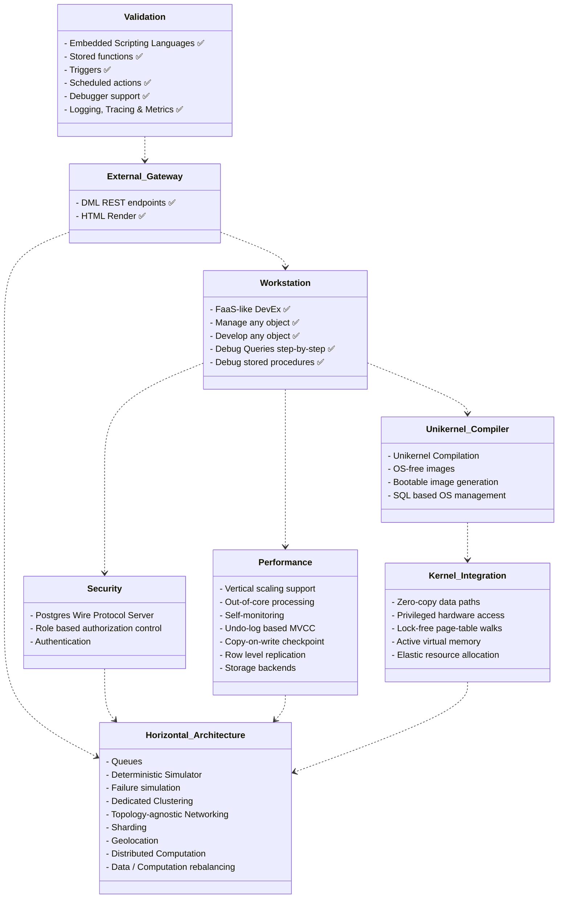

# Oxibase Roadmap
{: .no_toc}

The roadmap outlines the journey from a single-node into a scalable distributed
autonomous system. The goal is not to become the fastest, the most scalable
solution but to learn and explore how the computation and data processing
paradigms can be rethought.

_Figure 1: Current Priorities Dependency Flow_

```mermaid
classDiagram
    %% --- RELATIONSHIPS ---
    %% Use the short class names here, not "Layer.Class"
    Validation ..> External_Gateway
    External_Gateway ..> Workstation

    Workstation ..> Performance
    Workstation ..> Security
    Workstation ..> Unikernel_Compiler

    External_Gateway ..> Horizontal_Architecture
    Security ..> Horizontal_Architecture
    Performance ..> Horizontal_Architecture

    %% --- LAYERS & CLASS DEFINITIONS ---

    class Validation {
        - Embedded Scripting Languages ✅
        - Stored functions  ✅
        - Triggers  ✅
        - Scheduled actions  ✅
        - Debugger support ✅
        - Logging, Tracing & Metrics ✅
    }
    class External_Gateway {
        - DML REST endpoints  ✅
        - HTML Render  ✅
    }
    class Security {
        - Postgres Wire Protocol Server
        - Role based authorization control
        - Authentication
    }
    class Workstation {
        - FaaS-like DevEx ✅
          - Manage any object ✅
          - Develop any object ✅
        - Debug Queries step-by-step ✅
        - Debug stored procedures ✅
    }

    class Performance {
        - Vertical scaling support
        - Out-of-core processing
        - Self-monitoring
        - Undo-log based MVCC
        - Copy-on-write checkpoint
        - Row level replication
        - Storage backends
    }

    class Horizontal_Architecture {
        - Queues
        - Deterministic Simulator
        - Failure simulation
        - Dedicated Clustering
        - Topology-agnostic Networking
        - Sharding
        - Geolocation
        - Distributed Computation
        - Data / Computation rebalancing
    }

    class Unikernel_Compiler {
        - Unikernel Compilation
        - OS-free images
        - Bootable image generation
        - SQL based OS management
    }

    class Kernel_Integration {
        - Zero-copy data paths
        - Privileged hardware access
        - Lock-free page-table walks
        - Active virtual memory
        - Elastic resource allocation
    }

    Unikernel_Compiler ..> Kernel_Integration
    Kernel_Integration ..> Horizontal_Architecture

```

#### Table of contents
{: .no_toc}

1. TOC
{:toc}

## Phases

### Phase 0: Validation

No idea survives alone. No open-source project can thrive without community
support. We need to validate our vision and gather feedback from the community.
This phase will focus on building a strong developer experience and validating
through community engagement, documentation, and user testing.

Starting with the initial release of the core experience as an small embedded
system providing a self-contained computational experience. The system needs to
provide support to store relational data in an MVCC (Multi-Version Concurrency
Control) system, store and execute procedures, debug them, monitor and trace
them, invoke them and finally provide a dev-friendly interface for interacting
with the system. This should serve as a demo of the system's capabilities.

- **Observability**: Implement comprehensive logging, tracing, and metrics to monitor system health, query performance, and procedure execution.

#### Goal
Validate the development experience and build a community around the project.

### Phase 1: Workstation (Developer Experience)

Create an Integrated Development Environment (IDE) for local and remote
management of the system. It should serve as an object manager and debugger at
the same time, providing a seamless experience for developers. Draw inspiration
from IDEs like Zed for code editing; Chrome DevTools for the debugging
experience; and DataGrip for the Database Management. Prioritizing this phase
captures early adopters by providing a seamless, FaaS-like local and remote
IDE experience while deeper engine work continues.

#### Goal
Create a workstation that serves developers of all levels to create, test, and
deploy applications.

### Phase 2: Foundation

Parallel efforts to establish Oxibase's core capabilities and prepare for
scaling. They focus on single-node enhancements that enable seamless
development, connectivity, and deployment without relying on external systems.

- **Query engine optimization**: Integrate [DataFusion] for query parsing, planning, and vectorized execution. Adopting [Apache Arrow's][Arrow] memory management bridges the gap between fast in-memory transactions and OLAP execution.
- **Differential MVCC (Intermediate Storage)**: Overhaul the MVCC layer to use a `(data, time, diff)` streaming paradigm (inspired by Differential Dataflow). Active transactions and intermediate states will be stored as an append-only stream of diffs (`+1`/`-1`), providing elegant, mathematical transaction isolation and rollback capabilities.
- **Vortex Consolidation (Base Storage)**: Add [Vortex] for compressed columnar storage. Background compactors will automatically consolidate the intermediate diff streams into immutable, highly compressed Vortex arrays, optimizing the system for heavy analytical scans.
- **HTAP Dual-Index Architecture**: To maintain microsecond latency for OLTP point queries without sacrificing OLAP throughput, implement a dual-index system: an in-memory B-Tree/Hash index tracking the active diff stream, combined with sparse Zone Maps for the consolidated Vortex files.
- **Incremental Materialized Views**: Leverage the differential `+1`/`-1` paradigm to enable practically free, real-time maintenance of materialized views, updating aggregated states incrementally as changes stream in.
- **Optimize the Wire Protocols**: Implement [FlightSQL] for high-performance client connections and [PostgresSQL wire protocol] for seamless integration.
- **Catalog optimization**: Use [Iceberg] for efficient metadata management tracking the lifecycle of Vortex files and active diff streams.
- **Implement Hermit Unikernel**: Add unikernel compilation support for bare-metal performance.

#### Goal
Leverage the open-source data community to build a reliable system that can
handle large-scale data processing and storage.

### Phase 3: Scale

Explore distributing the system across multiple nodes, with a focus on
multi-node parallelism, and distributed storage. Explore having dedicated
nodes for metadata management, compute, and data storage.

- **Distributed Time & Consistency**: Leverage the `(data, time, diff)` paradigm to smoothly transition from single-node sequences to distributed logical clocks (e.g., Hybrid Logical Clocks), enabling strictly serializable distributed transactions.
- **Cluster Networking & Topology**: Integrate [Iroh] to enable seamless cluster setup with any topology. By leveraging its hole-punching and QUIC-based stack, nodes can securely discover and connect to each other across different networks using public keys instead of fragile IP addresses.
- **Support for distributed execution**: Implement [Ballista] for distributed execution and scaling across nodes, natively shuffling Arrow batches generated from our Vortex/Differential storage.
- **Metadata layer**: Implement a consensus protocol (e.g., Raft) to manage the Iceberg catalog and metadata between nodes.
- **Use a deterministic simulator**: Simulate network partitions, disk failures, and clock drift in the system to prepare for horizontal scaling by testing most scenarios without real-world risks.
- **Distributed Storage**: Distribute storage for fault tolerance.
    - **Geo-replication**: Implement geo-replication for data redundancy and availability.
    - **Data Partitioning**: Implement data partitioning for efficient data distribution.
    - **Data locality**: Implement data locality for efficient and/or compliant data access and computation.
    - **Sharding**: Implement sharding for horizontal scaling.

#### Goal
Scale horizontally.

### Phase 4: Auto Scaling

Explore how the system can autonomously scale resources based on demand. Explore
distributing data and computation based on the workload as well as the
availability of adding resources on demand for elastic scaling.

- **Load Balancing**: Use the internal resource monitoring to implement load
  balancing for efficient resource utilization.
- **Third-party resource allocation**: Integrate with cloud providers and
  third-party resource allocation services for dynamic resource management.
- **Data lifecycle management**: Implement a comprehensive data lifecycle
  management system to ensure data is properly managed throughout its entire
  lifecycle. Use different policies for data retention, backup, and deletion.

#### Goal
Global autonomous computing environment.

---

## Current Goals 

We are currently at [Phase 0](#phase-0-validation).

### Working areas

- [x] **Relational Database**: Add support for relational databases in the executor layer.
- [x] **User defined Functions**: Use SQL scripting and scripting language to define functions.
- [ ] **Server mode**: Implement a server binary to run the system standalone.
- [x] **Stored Procedures**: Add support for stored procedures in the executor layer.
    - [x] **Transaction management**: Add support for transaction management in the executor layer.
    - [x] **Service invocation**: Add support for service invocation with a webserver.
    - [x] **Scheduling**: Add support for scheduling procedures.
    - [x] **Triggers**: Add support for triggers in the executor layer, on insert, update or delete.

#### Workstation / DevEx

- [x] **IDE Integration**: Build initial FaaS-like development experience and object management.
- [x] **Step-by-step Debugger**: Enable debugging for queries and stored procedures.

#### v0.6.0 (Observability & Debugging)

- [x] **Logging**: Comprehensive internal logging system (`system.logs`).
- [x] **Tracing**: Distributed query and procedure tracing (`system.traces`).
- [x] **Debug Adapter Protocol**: DAP server for Rhai and PL/SQL procedures.

#### v0.7.0 (Security & Authorization)

- [ ] **Authorization**: Add Casbin-rs for role-based (objects) and attribute-based (row-level) authorization.
- [ ] **Security**: Add support for security contexts in the executor layer.

### Supported objects

| Object Type | Status | Notes |
|-------------|--------|-------|
| Schemas | Available | No CREATE SCHEMA/DROP SCHEMA support |
| User-defined Functions | Available | CREATE FUNCTION/DROP FUNCTION supported |
| Stored Procedures | Available | CREATE PROCEDURE/DROP PROCEDURE supported |
| Materialized Views | Missing | No CREATE MATERIALIZED VIEW |
| Custom Types/Domains | Missing | No CREATE TYPE/CREATE DOMAIN |
| Rules | Missing | No CREATE RULE/DROP RULE |
| Extensions | Missing | No CREATE EXTENSION |
| Foreign Data Wrappers | Missing | No foreign table support |
| Aggregates | Missing | No custom aggregate functions |
| Operators | Missing | No custom operator definitions |
| Event Triggers | Available | CREATE TRIGGER/DROP TRIGGER supported |
| Sequences | Available | CREATE SEQUENCE/DROP SEQUENCE supported |
| Job Schedules | Available | CREATE SCHEDULE/DROP SCHEDULE supported |
| Tablespaces | Missing | No CREATE TABLESPACE |
| Roles/Users | Missing | No user/role management |
| Publications/Subscriptions | Missing | No logical replication support |

## Other ideas

### Declarative Schema Migration

Modify the schema by applying DDL in static create files stored in the database version management system. (oxigration)

### Automatic blue-green migrations 

Any schema changes triggers an automatic blue-green migration. 

### DML based schema migrations

Setup a special internal schema that lets the user use DML to manipulate the
schema of the database with DML instead of DDL, bringing the DevEx of [aquameta].

[DataFusion]: https://datafusion.apache.org/
[Arrow]: https://arrow.apache.org/
[Vortex]: https://docs.vortex.dev/
[FlightSQL]: https://arrow.apache.org/docs/format/FlightSql.html
[PostgresSQL wire protocol]: https://github.com/datafusion-contrib/datafusion-postgres
[Ballista]: https://datafusion.apache.org/ballista/
[Raft]: https://github.com/tikv/raft-rs
[Iceberg]: https://github.com/apache/iceberg-rust/
[FDW]: https://github.com/supabase/wrappers
[aquameta]: https://github.com/aquameta/meta_triggers
[Iroh]: https://iroh.computer/
