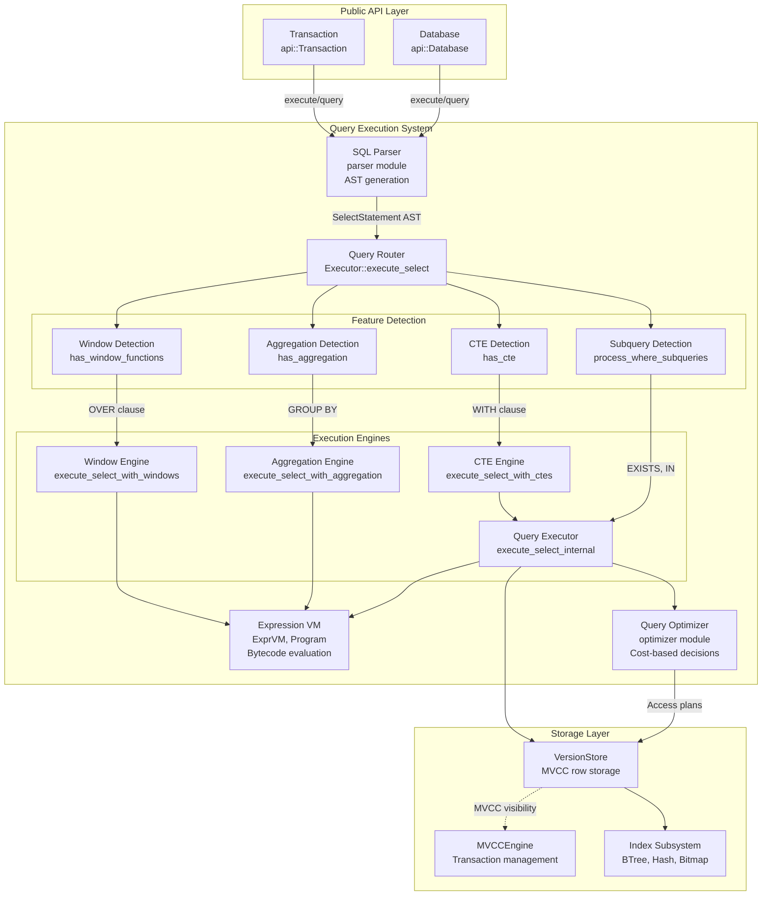

# Query Execution and Optimization in OxiBase

This document describes how OxiBase executes SQL queries, its optimization techniques, and how to write efficient queries for the best performance.

## Query Execution Pipeline

OxiBase processes SQL queries through a multi-stage pipeline:

1. **Parsing** - SQL text is parsed into an abstract syntax tree (AST)
2. **Validation** - The AST is validated for correctness
3. **Planning** - An execution plan is generated
4. **Optimization** - The plan is optimized based on statistics and rules
5. **Execution** - The optimized plan is executed
6. **Result Handling** - Results are formatted and returned

## Parallel Execution Engine

OxiBase includes a parallel execution engine optimized for analytical queries. This engine uses Rayon's work-stealing scheduler for optimal performance:

- **Batch Processing** - Processes multiple rows at once to reduce interpretation overhead
- **Parallel Operations** - Parallelizes filter, join, sort, and distinct operations
- **Work-Stealing** - Optimal load balancing across CPU cores

### Layered Architecture



## Optimization Techniques

OxiBase employs several optimization techniques to improve query performance:

### Filter Pushdown

Filters are pushed down to the storage layer to minimize data scanning:

```sql
-- Filter is pushed down to the storage engine
SELECT * FROM users WHERE age > 30;
```

### Index Utilization

OxiBase automatically selects appropriate indexes for queries:

```sql
-- Will use index on email if available
SELECT * FROM users WHERE email = 'user@example.com';
```

### Join Optimization

OxiBase optimizes join operations based on table statistics and available indexes:

```sql
-- OxiBase will choose an appropriate join algorithm
SELECT u.name, o.order_date 
FROM users u
JOIN orders o ON u.id = o.user_id
WHERE u.country = 'US';
```

### Predicate Optimization

Predicates are rewritten and simplified for better performance:

```sql
-- Automatically simplified to a single range scan
SELECT * FROM products WHERE price >= 10 AND price <= 20;
```

### Expression Evaluation

Common expressions are evaluated once rather than multiple times:

```sql
-- The SUBSTRING expression is evaluated once per row
SELECT id, name, SUBSTRING(description, 1, 100) FROM products
WHERE SUBSTRING(description, 1, 100) LIKE '%special%';
```

## Query Cache

OxiBase implements a query cache to improve performance for repeated queries:

- **Parameterized Queries** - Results of prepared statements with different parameters can be cached
- **Automatic Invalidation** - Cache entries are invalidated when underlying data changes
- **Memory Management** - The cache size is managed to prevent excessive memory usage

## Query Explain

You can use the `EXPLAIN` command to understand how OxiBase executes a query:

```sql
EXPLAIN SELECT users.name, orders.total 
FROM users 
JOIN orders ON users.id = orders.user_id
WHERE users.status = 'active';
```

The output shows:
- Tables accessed and access methods
- Join algorithms used
- Filter application strategy
- Index usage
- Estimated row counts

## Profiling Queries

For deeper performance analysis, OxiBase provides query profiling:

```sql
SET profiling = ON;
SELECT * FROM large_table WHERE complex_condition;
SHOW PROFILE;
```

This provides detailed timing information for each step of query execution.

## Best Practices for Query Performance

To get the best performance from OxiBase:

1. **Use Appropriate Indexes**
   - Create indexes on columns used in WHERE, JOIN, and ORDER BY clauses
   - Consider multi-column indexes for frequent query patterns
   - Avoid over-indexing, which can slow down writes

2. **Write Efficient Queries**
   - Select only needed columns instead of using SELECT *
   - Use WHERE clauses to filter data early
   - Use JOINs instead of subqueries when possible
   - Avoid functions on indexed columns in WHERE clauses

3. **Leverage Prepared Statements**
   - Use prepared statements for repeated queries
   - This allows OxiBase to cache execution plans

4. **Optimize JOIN Operations**
   - Join tables from smallest to largest when possible
   - Ensure join columns are properly indexed
   - Use appropriate join types (INNER, LEFT, etc.)

5. **Use LIMIT for Large Result Sets**
   - Add LIMIT clauses to prevent excessive memory usage
   - Implement pagination for user interfaces

## Advanced Features

### Window Functions

OxiBase supports window functions for analytical queries:

```sql
SELECT name, department, salary,
       RANK() OVER (PARTITION BY department ORDER BY salary DESC) as rank
FROM employees;
```

### Aggregation Optimization

OxiBase optimizes aggregation operations for efficient execution:

```sql
-- Uses optimized aggregation algorithms
SELECT department, AVG(salary), COUNT(*)
FROM employees
GROUP BY department;
```

### Parallel Execution

OxiBase can execute certain operations in parallel:

```sql
-- May use parallel execution for large tables
SELECT * FROM large_table WHERE complex_condition;
```

## Implementation Details

OxiBase's query execution is implemented with the following components:

- **Parser (src/parser/)** - SQL parsing implementation (lexer, AST, parser)
- **Executor (src/executor/)** - Query execution engine
- **Planner (src/executor/planner.rs)** - Query planning with cost estimation
- **Parallel Engine (src/executor/parallel.rs)** - Multi-threaded execution
- **Semantic Cache (src/executor/semantic_cache.rs)** - Query result caching

## Limitations

- Complex optimization for very large joins may be limited
- Certain types of subqueries may not be fully optimized
- Statistics-based optimization is still evolving
- Parallel query execution is limited to specific operations