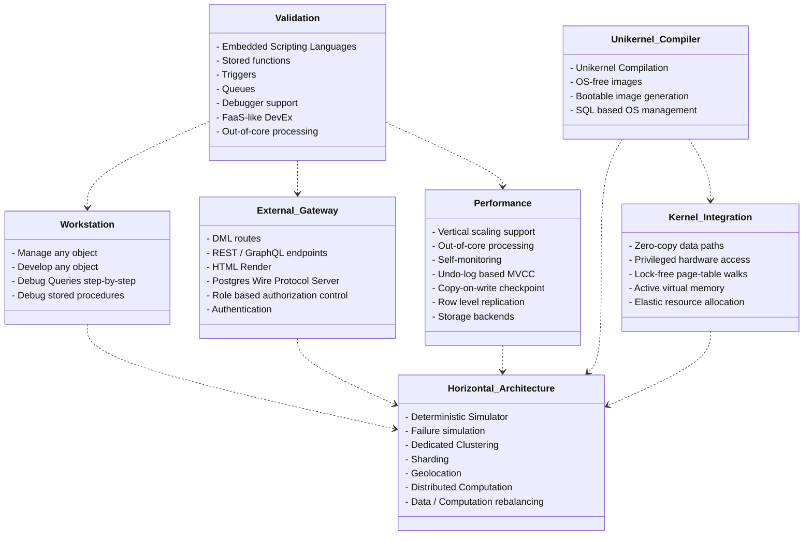

# Oxibase Roadmap

The roadmap outlines the journey from a single-node into scalable distributed
autonomous system. The goal is not to become the fastest, the most scalable
solution but to learn and explore how the computation and data processing
paradigms can be rethought.

_Figure 1: Current Priorities Dependency Flow_

### Phase 0: Validation

No idea survives alone. No open-source project can thrive without community
support. We need to validate our vision and gather feedback from the community.
This phase will focus on building a strong developer experience and validating
through community engagement, documentation, and user testing.

Starting with the initial release of the core experience as an small embedded
system providing a self-contained computational experience. The system needs to
provide support to store relational data in an MVCC (Multi-Version Concurrency
Control) system, store and execute procedures, debug them, monitor and trace
them, invoke them and finally provide a dev-friendly interface for interacting
with the system. This should serve as a demo of the system's capabilities.

#### Goal
Validate the development experience and build a community around the project.

### Phase 1: Foundation

Parallel efforts to establish Oxibase's core capabilities and prepare for
scaling. They focus on single-node enhancements that enable seamless
development, connectivity, and deployment without relying on external systems.

- **Optimize the Wire Protocols**: Implement [FlightSQL] for high-performance
  client connections and [PostgresSQL wire protocol] for seamless integration.
- **Query engine optimization**: Add [DataFusion] for query parsing, planning,
  and optimization of `executor/`. Adopting [Apache Arrow's][Arrow] memory management and
  data structures to optimize data loading and spill-to-disk operations.
- **MVCC storage optimization**: Add [Vortex] for compressed columnar
  storage that supports random access for efficient data retrieval for the
  `mvcc` layer.
- **Catalog optimization**: Use [Iceberg] for efficient metadata management and
  leverage the DataFusion interface.
- **Implement Hermit Unikernel**: Add unikernel compilation support for
  bare-metal performance.

#### Goal
Leverage the open-source data community to build a reliable system that can
handle large-scale data processing and storage.

### Phase 2a: Scale

Explore distributing the system across multiple nodes, with a focus on
multi-node parallelism, and distributed storage. Explore having dedicated
nodes for metadata management, compute, and data storage.

- **Support for distributed execution**: Implement [Ballista] for distributed
  execution and scaling across nodes.
- **Metadata layer**: Implement a consensus protocol to manage metadata between
  nodes.
- **Use a deterministic simulator**: Simulate failure points in the system to
  prepare for horizontal scaling by testing most scenarios without real-world
  risks.
- **Distributed Storage**: Distribute storage for fault tolerance.
    - **Geo-replication**: Implement geo-replication for data redundancy and
      availability.
    - **Data Partitioning**: Implement data partitioning for efficient data
      distribution.
    - **Data locality**: Implement data locality for efficient and/or compliant
      data access and computation.
    - **Sharding**: Implement sharding for horizontal scaling.

#### Goal
Scale horizontally.

### Phase 2b: Workstation

Create an Integrated Development Environment (IDE) for local and remote
management of the system. It should serve as an object manager and debugger at
the same time, providing a seamless experience for developers. Draw inspiration
from IDEs like Zed for code editing; Chrome DevTools for the debugging
experience; and DataGrip for the Database Management.

#### Goal
Create a workstation that serves developers of all levels to create, test, and
deploy applications.

### Phase 3: Auto Scaling

Explore how the system can autonomously scale resources based on demand. Explore
distributing data and computation based on the workload as well as the
availability of adding resources on demand for elastic scaling.

- **Load Balancing**: Use the internal resource monitoring to implement load
  balancing for efficient resource utilization.
- **Third-party resource allocation**: Integrate with cloud providers and
  third-party resource allocation services for dynamic resource management.
- **Data lifecycle management**: Implement a comprehensive data lifecycle
  management system to ensure data is properly managed throughout its entire
  lifecycle. Use different policies for data retention, backup, and deletion.

#### Goal
Global autonomous computing environment.

## Current Goals 

### Working areas

- [x] **Relational Database**: Add support for relational databases in the executor layer.
- [x] **User defined Functions**: Use SQL scripting and scripting language to define functions.
- [ ] **Server mode**: Implement a server binary to run the system standalone.
- [ ] **Stored Procedures**: Add support for stored procedures in the executor layer.
    - [ ] **Transaction management**: Add support for transaction management in the executor layer.
    - [ ] **Service invocation**: Add support for service invocation with a webserver.
    - [ ] **Scheduling**: Add support for scheduling procedures.
    - [ ] **Triggers**: Add support for triggers in the executor layer, on insert, update or delete.
- [ ] **Debugging**: Add support for debugging in the executor layer.
    - [ ] **Debug Adapter Protocol**: Add support for the Debug Adapter Protocol for queries and procedures.
    - [ ] **Tracing**: Add activation of tracing and storage in the storage layer.
    - [ ] **Logging**: Add support for logging.
- [ ] **Authorization**: Add Casbin-rs for role-based (objects) and attribute-based (row-level) authorization.
    - [ ] **Security**: Add support for security in the executor layer.

### Supported objects

| Object Type | Status | Notes |
|-------------|--------|-------|
| Schemas | Available | No CREATE SCHEMA/DROP SCHEMA support |
| User-defined Functions | Available | CREATE FUNCTION/DROP FUNCTION supported |
| Stored Procedures | Missing | No CREATE PROCEDURE/DROP PROCEDURE |
| Materialized Views | Missing | No CREATE MATERIALIZED VIEW |
| Custom Types/Domains | Missing | No CREATE TYPE/CREATE DOMAIN |
| Rules | Missing | No CREATE RULE/DROP RULE |
| Extensions | Missing | No CREATE EXTENSION |
| Foreign Data Wrappers | Missing | No foreign table support |
| Aggregates | Missing | No custom aggregate functions |
| Operators | Missing | No custom operator definitions |
| Event Triggers | Missing | No DDL event triggers |
| Tablespaces | Missing | No CREATE TABLESPACE |
| Roles/Users | Missing | No user/role management |
| Publications/Subscriptions | Missing | No logical replication support |

## Other ideas

### Declarative Schema Migration

Modify the schema by applying DDL in static create files stored in the database version management system.
(oxigration) or from DML manipulation of special schemas.

[DataFusion]: https://datafusion.apache.org/
[Arrow]: https://arrow.apache.org/
[Vortex]: https://docs.vortex.dev/
[FlightSQL]: https://arrow.apache.org/docs/format/FlightSql.html
[PostgresSQL wire protocol]: https://github.com/datafusion-contrib/datafusion-postgres
[Ballista]: https://datafusion.apache.org/ballista/
[Raft]: https://github.com/tikv/raft-rs
[Iceberg]: https://github.com/apache/iceberg-rust/
[FDW]: https://github.com/supabase/wrappers
