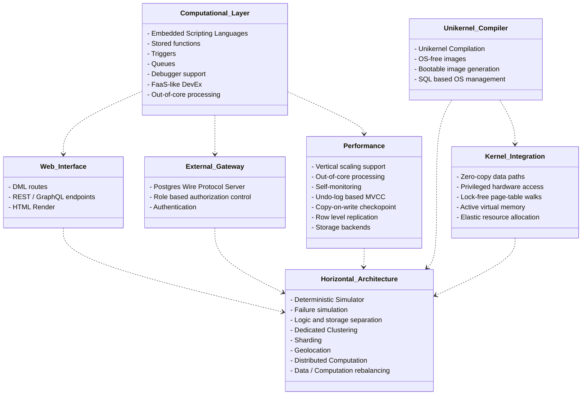

# Roadmap

_Figure 1:  Dependency Flow_

```mermaid
classDiagram
    %% --- RELATIONSHIPS ---
    %% Use the short class names here, not "Layer.Class"
    Computational_Layer ..> Web_Interface
    Computational_Layer ..> External_Gateway
    Computational_Layer ..> Performance

    Web_Interface ..> Horizontal_Architecture
    External_Gateway ..> Horizontal_Architecture
    Performance ..> Horizontal_Architecture
    Unikernel_Compiler ..> Horizontal_Architecture

    %% --- LAYERS & CLASS DEFINITIONS ---

    class Computational_Layer {
        - Embedded Scripting Languages
        - Stored functions
        - Triggers
        - Queues
        - Debugger support
        - FaaS-like DevEx
        - Out-of-core processing
    }
    class Web_Interface {
        - DML routes
        - REST / GraphQL endpoints
        - HTML Render
    }
    class External_Gateway {
        - Postgres Wire Protocol Server
        - Role based authorization control
        - Authentication
    }

    class Performance {
        - Vertical scaling support
        - Out-of-core processing
        - Self-monitoring
        - Undo-log based MVCC
        - Copy-on-write checkopoint
        - Row level replication
        - Storage backends
    }

    class Horizontal_Architecture {
        - Deterministic Simulator
        - Failure simulation
        - Logic and storage separation
        - Dedicated Clustering
        - Sharding
        - Geolocation
        - Distributed Computation
        - Data / Computation rebalancing
    }

    class Unikernel_Compiler {
        - Unikernel Compilation
        - OS-free images
        - Bootable image generation
        - SQL based OS management
    }

    class Kernel_Integration {
        - Zero-copy data paths
        - Privileged hardware access
        - Lock-free page-table walks
        - Active virtual memory
        - Elastic resource allocation
    }

    Unikernel_Compiler ..> Kernel_Integration
    Kernel_Integration ..> Horizontal_Architecture

```
