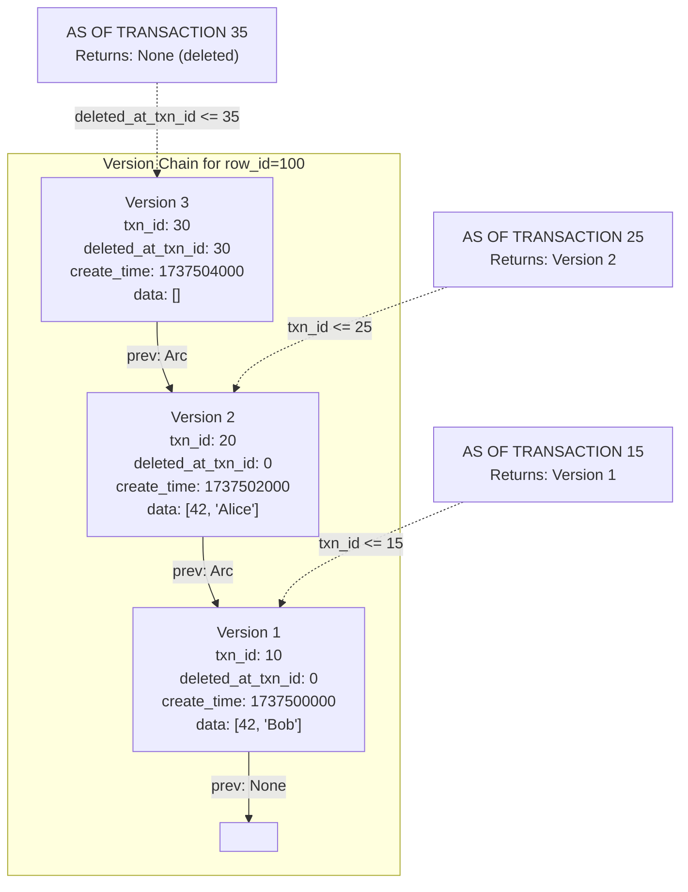
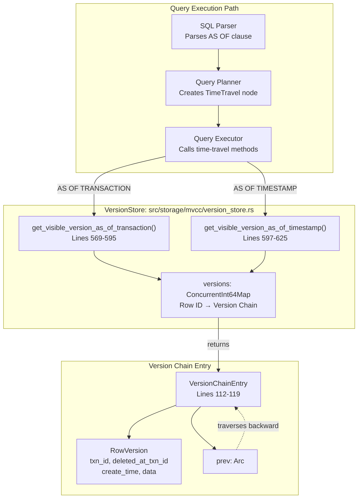
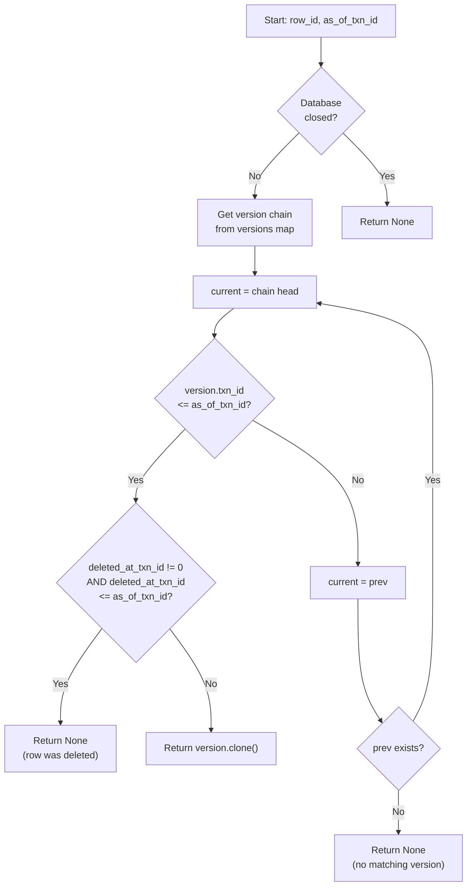
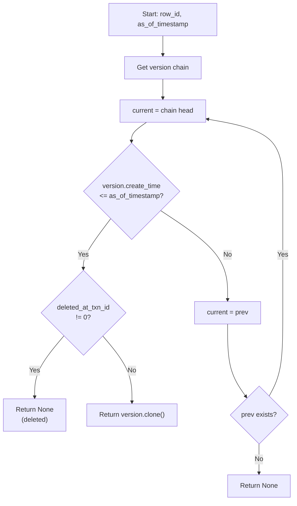

# Temporal Queries (AS OF)

Oxibase supports temporal queries using the SQL:2011 standard `AS OF` clause, allowing you to query historical data at a specific point in time. This feature leverages Oxibase's MVCC (Multi-Version Concurrency Control) architecture to provide time travel capabilities.

## Overview

The `AS OF` clause enables you to view data as it existed at a specific transaction or timestamp. This is particularly useful for:

- Auditing and compliance
- Debugging data issues
- Analyzing historical trends
- Implementing point-in-time recovery
- Building Git-like branching for data (future feature)

## Syntax

Oxibase supports two types of temporal queries:

### AS OF TRANSACTION

Query data as it existed at a specific transaction ID:

```sql
SELECT * FROM table_name AS OF TRANSACTION transaction_id
```

### AS OF TIMESTAMP

Query data as it existed at a specific timestamp:

```sql
SELECT * FROM table_name AS OF TIMESTAMP 'timestamp_string'
```

## Usage Examples

### Basic AS OF TRANSACTION Query

```sql
-- View orders table as of transaction 42
SELECT * FROM orders AS OF TRANSACTION 42;

-- With WHERE clause
SELECT * FROM users AS OF TRANSACTION 100 
WHERE status = 'active';

-- With specific columns
SELECT id, name, email FROM users AS OF TRANSACTION 50;
```

### Basic AS OF TIMESTAMP Query

```sql
-- View data as of a specific timestamp
SELECT * FROM events AS OF TIMESTAMP '2025-06-10 10:30:00';

-- Query data from yesterday
SELECT * FROM products AS OF TIMESTAMP '2025-06-09 23:59:59';

-- With filtering
SELECT * FROM transactions AS OF TIMESTAMP '2025-06-10 09:00:00'
WHERE amount > 1000;
```

### Using Table Aliases

```sql
-- With explicit alias
SELECT u.id, u.name 
FROM users AS u AS OF TRANSACTION 75
WHERE u.created_at < '2025-01-01';

-- Without explicit alias (implicit alias)
SELECT users.id, users.name 
FROM users AS OF TIMESTAMP '2025-06-10 12:00:00'
WHERE users.status = 'active';
```

## How It Works

1. **Transaction-based Queries**: When using `AS OF TRANSACTION`, Oxibase finds all row versions that were visible to that specific transaction ID.

2. **Timestamp-based Queries**: When using `AS OF TIMESTAMP`, Oxibase finds the newest version of each row that was created before or at the specified timestamp.

3. **Version Chain Traversal**: Oxibase traverses the version chain for each row from newest to oldest, finding the appropriate version based on the temporal criteria.

4. **Deletion Handling**: Deleted rows are properly handled - if a row was deleted before the AS OF point, it won't appear in the results.

### Version Chain Illustration



### Time-Travel Query Components



## Important Notes

### Timestamp Format

- Timestamps should be provided in UTC to match Oxibase's internal timestamp handling
- The timestamp string format is flexible and supports ISO 8601 and common date/time formats
- Common formats include:
  - `'2025-06-10 14:30:00'`
  - `'2025-06-10T14:30:00Z'`
  - `'2025-06-10 14:30:00.123456'`

### Performance Considerations

- AS OF queries may need to load historical data from disk if it's not in memory
- Transaction-based queries are generally faster than timestamp-based queries
- Using indexes with AS OF queries provides the same benefits as regular queries

### Limitations

- AS OF queries currently don't support JOIN operations (planned for future release)
- Subqueries with AS OF are not yet supported
- The timestamp resolution depends on the system clock precision

## Use Cases

### Auditing

```sql
-- See what a user's profile looked like before an update
SELECT * FROM user_profiles AS OF TRANSACTION 1000
WHERE user_id = 123;
```

### Debugging

```sql
-- Check inventory levels at a specific time
SELECT product_id, quantity FROM inventory 
AS OF TIMESTAMP '2025-06-10 09:00:00'
WHERE product_id IN (101, 102, 103);
```

### Historical Analysis

```sql
-- Compare current prices with last week's prices
SELECT 
    current.product_id,
    current.price as current_price,
    historical.price as last_week_price
FROM products current
CROSS JOIN (
    SELECT product_id, price 
    FROM products AS OF TIMESTAMP '2025-06-03 00:00:00'
) historical
WHERE current.product_id = historical.product_id;
```

### Transaction-Based Version Lookup Algorithm



### Timestamp-Based Version Lookup Algorithm



## Future Enhancements

The AS OF feature is the foundation for Oxibase's planned "Git for Data" functionality, which will include:

- Named branches for data versioning
- Data merging capabilities
- Conflict resolution
- Tagged versions

## See Also

- [MVCC Implementation](../architecture/mvcc-implementation)
- [Transaction Isolation](../architecture/transaction-isolation)