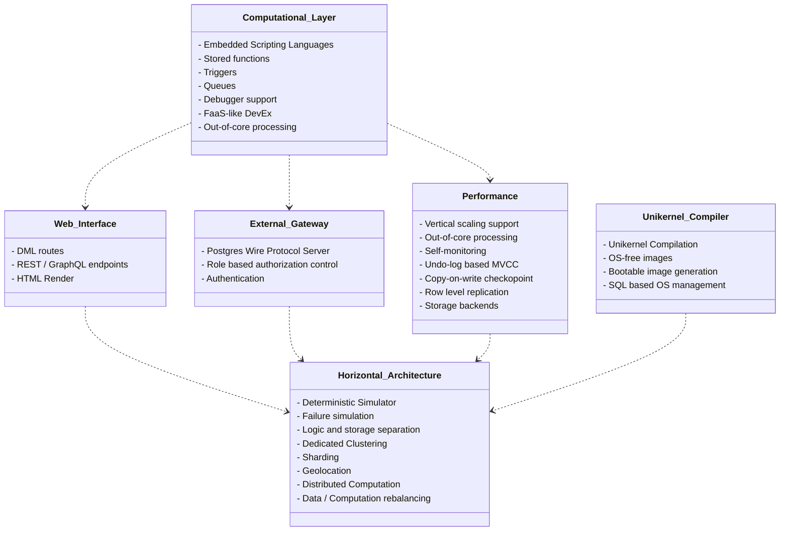

Oxibase is a relation database operating system (DBOS) that provides full ACID transactions with MVCC, a sophisticated cost-based query optimizer.

- **Multiple Index Types**: B-tree, Hash, and Bitmap indexes with automatic type selection
- **Multi-Column Indexes**: Composite indexes for complex query patterns
- **Parallel Query Execution**: Automatic parallelization using Rayon for large datasets
- **Cost-Based Optimizer**: PostgreSQL-style optimizer with adaptive execution and cardinality feedback
- **Semantic Query Caching**: Intelligent result caching with predicate subsumption
- **Disk Persistence**: WAL and snapshots with crash recovery
- **Rich SQL Support**: Window functions, CTEs (including recursive), subqueries, ROLLUP/CUBE, and 101+ built-in functions
- **User-Defined Functions**: Extend SQL with custom functions written in Rhai, Python, or JavaScript

## Roadmap Overview

Oxibase is evolving into a distributed, autonomous database system that bridges embedded logic with global resilience. The roadmap outlines the journey from a single-node, scriptable database to a self-managing, AI-enhanced platform.

**Phase 1: Foundation** - Establishing core capabilities through parallel efforts: embedded scripting languages for stored functions and triggers, declarative schema migrations, TUI manager, web server exposure for REST/GraphQL, Postgres wire protocol server, deterministic simulator, and unikernel compilation. These prepare for horizontal scaling.

**Phase 2: Single Node Efficiency** - Unifying operational needs into Oxibase itself with self-monitoring, multiple storage backends, data lifecycle management, and separation of compute & storage.

**Phase 3: Distributed System** - Achieving infinite horizontal scale and global resilience through multi-master consensus, data rebalancing/sharding, geo-sharding, and gossip protocols.

**Phase 4: The Autonomous Cloud** - The database manages its own physical existence and evolves into an AI platform with autonomous networking, auto-infrastructure management, in-database ML inference, and GPU training.

_Figure 1: Phase 1 Dependency Flow_

For detailed information about each phase, see the [full roadmap](getting-started/roadmap).

## Need Help?

If you can't find what you're looking for in the documentation, you can:

- [Open an issue](https://github.com/oxibase/oxibase/issues) on GitHub
- [Join the discussions](https://github.com/oxibase/oxibase/discussions) to ask questions

---

This documentation is under active development. Contributions are welcome!
