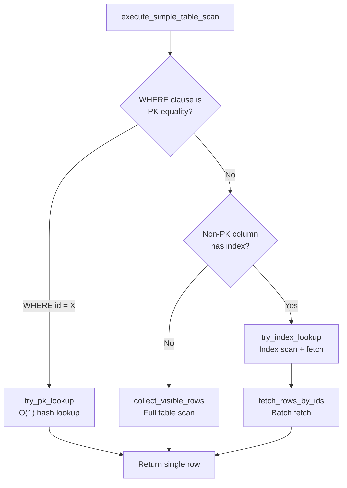
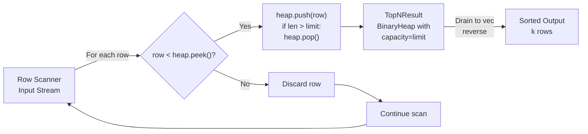
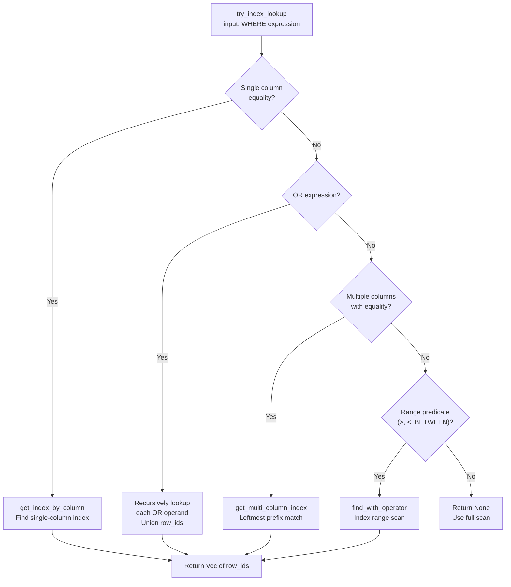
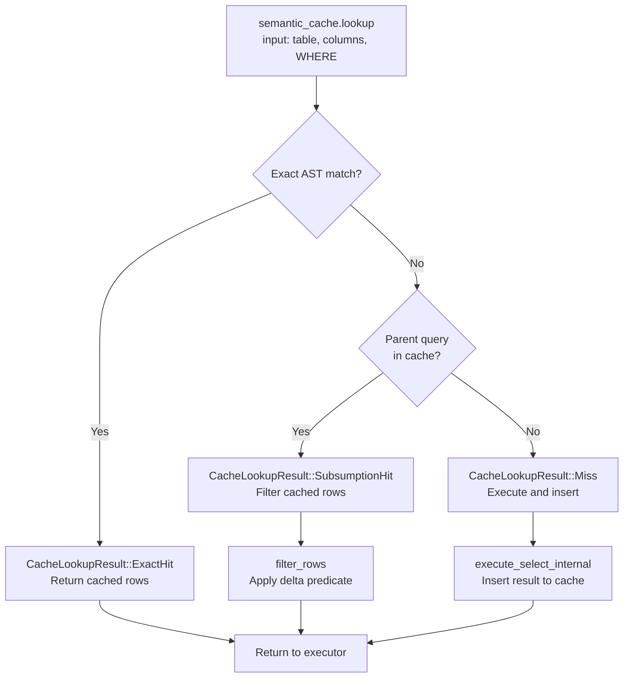
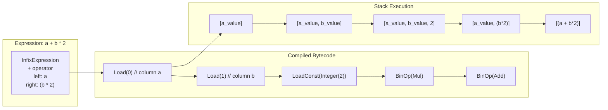
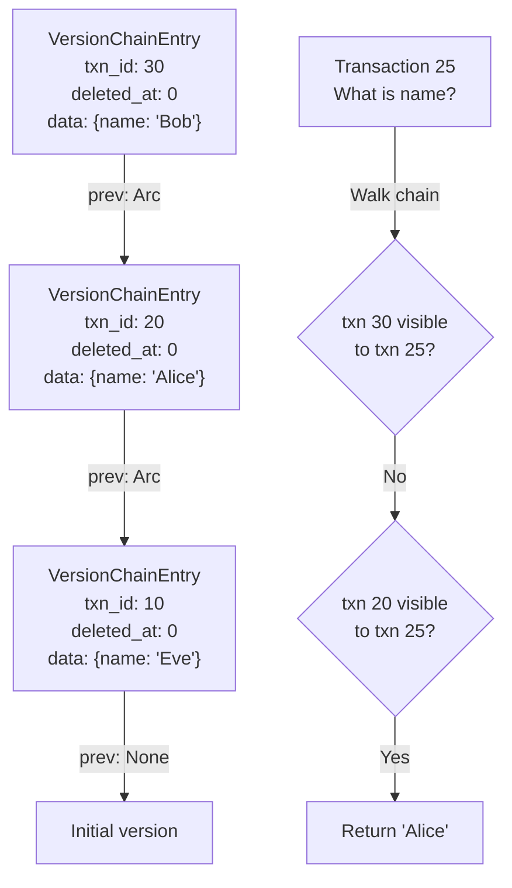

# Page: Advanced Topics

# Advanced Topics

<details>
<summary>Relevant source files</summary>

The following files were used as context for generating this wiki page:

- [src/executor/query.rs](src/executor/query.rs)
- [src/storage/mvcc/table.rs](src/storage/mvcc/table.rs)
- [src/storage/mvcc/version_store.rs](src/storage/mvcc/version_store.rs)

</details>


This section covers advanced technical concepts for developers and contributors working on OxiBase internals. Topics include query execution optimizations, MVCC implementation details, and internal performance techniques. For specific optimization algorithms, see [Query Optimization](#6.1). For MVCC isolation mechanisms, see [Concurrency Control](#6.2). For the planned distributed architecture, see [Future Vision: Modern Mainframe](#6.3).

## Fast Path Optimizations

OxiBase implements numerous "fast paths" that bypass general-purpose query execution when specific patterns are detected. These optimizations occur during the `execute_select_internal` phase and can reduce query latency by 10-100x for matching patterns.

### Primary Key Direct Lookup

When a WHERE clause is a simple equality on the primary key column (e.g., `WHERE id = 5`), the executor performs O(1) lookup instead of a table scan.

**Detection:** [src/storage/mvcc/table.rs:166-191]()

The `try_pk_lookup` method uses the storage expression's `get_comparison_info()` to extract `(column_name, operator, value)` tuples. If the column matches the primary key and operator is `Eq`, it returns the row ID directly.

**Execution:** [src/executor/query.rs:1436-1463]()

For PK lookups, the code path checks `txn_versions` (local uncommitted changes) first, then falls back to `version_store.get_visible_version()` for committed data. This avoids full index scans.

**Fast Path Decision Tree:**



Sources: [src/executor/query.rs:1436-1496](), [src/storage/mvcc/table.rs:166-191]()

### COUNT(*) Pushdown

Queries like `SELECT COUNT(*) FROM table` without WHERE or GROUP BY skip row scanning entirely and use the version store's row count.

**Detection:** [src/executor/query.rs:1220-1226]()

Checks that `storage_expr` is None (no WHERE filter), `needs_memory_filter` is false, and `group_by.columns` is empty.

**Implementation:** The `try_count_star_optimization` method in the executor checks if the SELECT list contains exactly `COUNT(*)` or `COUNT(1)`. If so, it calls `table.row_count()` which uses the MVCC version store's `count_visible_rows()` method.

The version store counts in O(1) lock acquisitions instead of O(N) by iterating the `versions` map once without cloning row data. [src/storage/mvcc/version_store.rs:659-693]()

Sources: [src/executor/query.rs:1220-1226](), [src/storage/mvcc/version_store.rs:659-693]()

### MIN/MAX Index Optimization

For `SELECT MIN(col) FROM table` or `SELECT MAX(col)`, if `col` has a BTree index, the query uses the index's cached min/max instead of scanning.

**Index Caching:** BTree indexes maintain `cached_min` and `cached_max` values updated during insertions. [src/storage/mvcc/btree_index.rs]() stores these as `Option<Value>` fields.

**Execution:** [src/executor/query.rs:1210-1217]()

The `try_min_max_index_optimization` method detects aggregate function calls on indexed columns and retrieves the cached values directly, returning a single-row result without iteration.

Sources: [src/executor/query.rs:1210-1217]()

### ORDER BY + LIMIT Optimization (TOP-N)

When `ORDER BY` is present with `LIMIT`, OxiBase uses different strategies based on whether indexed columns are referenced.

**Indexed ORDER BY:** [src/executor/query.rs:1228-1246]()

If the ORDER BY column has a BTree index and no WHERE clause exists, the executor calls `table.collect_rows_with_limit()` with index hints. The storage layer performs an index scan in sorted order, returning only the first N rows. This is O(log n + k) where k = limit, compared to O(n log n) for full sort.

**In-Memory TOP-N:** [src/executor/query.rs:658-674]()

When ORDER BY cannot use indexes, the executor uses `TopNResult` which implements a bounded binary heap. This is O(n log k) instead of O(n log n) for full sort, where k = limit. The heap maintains only the top k elements, discarding others immediately.

**TOP-N Heap Structure:**



Sources: [src/executor/query.rs:658-674](), [src/executor/query.rs:1228-1246]()

### IN List Index Optimization

For `WHERE col IN (1, 2, 3)`, if `col` has an index, the executor performs direct index probes instead of filtering during scan.

**Detection:** [src/executor/query.rs:1266-1283]()

Checks if the WHERE expression contains an `InListExpr` and if the column has an index. Extracts the list of values and calls `index.get_row_ids_in()` to fetch matching row IDs in batch.

**Index Handling:** [src/storage/mvcc/table.rs:275-291]()

The `try_index_lookup` method detects IN list expressions via downcast to `InListExpr`, extracts values with `get_values()`, and calls `index.get_row_ids_in()` which returns a `Vec<i64>` of matching row IDs. For hash indexes, this is O(k) lookups where k = list size.

Sources: [src/executor/query.rs:1266-1283](), [src/storage/mvcc/table.rs:275-291]()

### LIMIT Pushdown Without ORDER BY

For `SELECT * FROM table LIMIT 10` without ORDER BY, the storage layer enables true early termination by stopping iteration after collecting N rows.

**Unordered Limit:** [src/executor/query.rs:1287-1367]()

When `can_pushdown_limit` is true (no ORDER BY, no aggregation, no DISTINCT), the executor calls `table.collect_rows_with_limit_unordered()`. This method uses the version store's unordered scan which terminates early. [src/storage/mvcc/version_store.rs:914-983]()

**Early Termination:** The version store iterates its internal `versions` DashMap and counts visible rows. Once `result.len() >= limit`, it immediately returns without further iteration. This provides ~50x speedup for LIMIT 100 on 10K row tables.

Sources: [src/executor/query.rs:1287-1367](), [src/storage/mvcc/version_store.rs:914-983]()

## Index Selection Strategies

OxiBase automatically selects optimal index types based on column data types and query patterns. The selection logic balances lookup performance with memory overhead.

### Index Type Auto-Selection

**Selection Algorithm:** [src/storage/mvcc/table.rs:105-130]()

The `auto_select_index_type` method implements these rules:

| Data Type | Index Type | Rationale |
|-----------|-----------|-----------|
| `TEXT`, `JSON` | `Hash` | Avoids O(strlen) string comparisons in BTree nodes |
| `BOOLEAN` | `Bitmap` | Only 2 distinct values; fast AND/OR/NOT bitwise ops |
| `INTEGER`, `FLOAT`, `TIMESTAMP` | `BTree` | Supports range queries (>, <, BETWEEN) with O(log n) |
| Mixed types (multi-column) | `MultiColumn` | Hybrid hash+btree for prefix matching |

**Boolean Optimization:** For boolean columns, the executor may skip index usage for equality predicates (`WHERE is_active = true`) because the selectivity is ~50%, making full scans faster than index lookup + row fetch. [src/storage/mvcc/table.rs:205-209]()

Sources: [src/storage/mvcc/table.rs:105-130](), [src/storage/mvcc/table.rs:205-209]()

### Multi-Column Index Selection

Multi-column indexes follow the "leftmost prefix rule": an index on `(a, b, c)` can optimize queries with predicates on `(a)`, `(a, b)`, or `(a, b, c)`, but not `(b)` or `(c)` alone.

**Prefix Matching:** [src/storage/mvcc/version_store.rs:1449-1492]()

The `get_multi_column_index` method:
1. Creates a hash set of predicate columns for O(1) lookup
2. Iterates each multi-column index's column list
3. Counts contiguous prefix matches starting from the first column
4. Returns the index with the longest matching prefix (minimum 2 columns)

**Example:** For query `WHERE b = 2 AND a = 1 AND d = 4` against index on `(a, b, c)`:
- Predicate set: `{a, b, d}`
- Index columns: `[a, b, c]`
- Match: `a` (in set), `b` (in set), `c` (not in set) → 2 matches
- Use index for `(a, b)` prefix, filter `d` in memory

**Index Selection Flow:**



Sources: [src/storage/mvcc/version_store.rs:1449-1492](), [src/storage/mvcc/table.rs:195-551]()

## Predicate Pushdown

Predicate pushdown moves filter evaluation from the executor to the storage layer, enabling index usage and early row rejection.

### Full vs Partial Pushdown

**Full Pushdown:** [src/executor/query.rs:1162-1179]()

When the WHERE clause contains only expressions the storage layer understands (comparisons, AND/OR of comparisons), the entire predicate is pushed down as a `storage_expr`. The storage layer can use indexes or apply filters during scan.

**Partial Pushdown:** [src/executor/pushdown.rs]()

When the WHERE clause contains functions or subqueries the storage layer cannot handle, the `try_pushdown` function splits the predicate:
- Pushable conjuncts (simple comparisons) → `storage_expr`
- Non-pushable conjuncts (functions, subqueries) → `needs_memory_filter = true`

Both filters are applied: storage layer filters indexed predicates, executor filters remaining predicates.

**Example:** `WHERE indexed_col = 5 AND complex_func(x) > 0`
- Storage layer: uses index for `indexed_col = 5`, returns candidate rows
- Executor: applies `complex_func(x) > 0` on candidates

Sources: [src/executor/query.rs:1162-1179]()

### Zone Map Pruning

Zone maps store min/max statistics per data segment, enabling entire segment skipping when predicates fall outside the range.

**Statistics Storage:** [src/storage/mvcc/zonemap.rs]()

The `TableZoneMap` struct maintains a `FxHashMap<String, ColumnZoneMap>` where each `ColumnZoneMap` contains:
- `segments: Vec<SegmentInfo>` with `min`, `max`, `null_count` per segment
- `stale: AtomicBool` marking statistics as outdated after data changes

**Pruning Logic:** [src/executor/query.rs:1181-1206]()

Before scanning, the executor calls `can_prune_entire_scan()` which checks if ALL segments fail the predicate test. For example, `WHERE age > 100` when `max(age) = 95` across all segments allows skipping the entire scan.

**Stale Detection:** After commits, the version store calls `mark_zone_maps_stale()` [src/storage/mvcc/version_store.rs:1551-1556](). Stale zone maps are ignored for pruning (safety), and `ANALYZE` rebuilds them.

Sources: [src/executor/query.rs:1181-1206](), [src/storage/mvcc/version_store.rs:1551-1556]()

## Semantic Query Caching

OxiBase caches entire query results with subsumption-based invalidation, enabling ~100x speedup for repeated read-heavy workloads.

### Cache Eligibility

**Restrictions:** [src/executor/query.rs:1071-1107]()

Caching is enabled only for:
- `SELECT *` queries (full row caching matches stored layout)
- With WHERE clause (no point caching full table scans)
- No aggregation, window functions, GROUP BY
- No outer context (not correlated subqueries)
- No ORDER BY, DISTINCT, LIMIT
- No parameters (`$1`, `$2`) in WHERE clause
- Not in explicit transaction (`BEGIN`/`COMMIT`)

**Parameter Restriction:** [src/executor/query.rs:1086-1089]()

Parameterized queries (`WHERE id = $1`) cannot be cached because the AST only stores parameter indices, not values. A cache hit would return wrong results for different parameter values.

**Transaction Restriction:** [src/executor/query.rs:1095-1107]()

Explicit transactions maintain MVCC isolation. Caching would violate isolation by returning results from other transactions' committed data.

### Subsumption Detection

**Subsumption:** [src/executor/semantic_cache.rs]()

Query Q2 "subsumes" Q1 if Q2's result set is a superset of Q1. Example:
- Q1: `SELECT * FROM users WHERE city = 'NYC'` → cached 100 rows
- Q2: `SELECT * FROM users WHERE city = 'NYC' AND age > 25`
- Q2 subsumes Q1: Q2's filter is stricter, so apply `age > 25` to cached 100 rows

**Detection:** The cache maintains a tree structure where child nodes represent stricter filters. On cache miss, it walks up the tree to find a cached parent query, then applies the delta filter to the parent's cached rows.

**Cache Lookup Result Types:**



Sources: [src/executor/query.rs:1110-1158]()

## Arena-Based Storage

The version store uses arena allocation to provide zero-copy table scans, eliminating per-row cloning overhead.

### RowArena Structure

**Layout:** [src/storage/mvcc/arena.rs]()

The `RowArena` contains:
- `arena_rows: RwLock<Vec<RowMetadata>>` - metadata per row (row_id, txn_id, start, end, deleted_at_txn_id)
- `arena_data: RwLock<Vec<Value>>` - contiguous value storage for all rows
- Row data is stored sequentially: `[row1_col1, row1_col2, ..., row2_col1, row2_col2, ...]`

**Insertion:** [src/storage/mvcc/version_store.rs:313-329]()

When adding a version, `arena.insert_row()` appends values to `arena_data` and stores the slice range in `arena_rows`. The `VersionChainEntry` stores `arena_idx: Option<usize>` pointing to the metadata.

**Zero-Copy Scan:** [src/storage/mvcc/version_store.rs:755-817]()

The `get_all_visible_rows_arena()` method:
1. Acquires `arena_rows` and `arena_data` read locks ONCE
2. Gets raw slices with `.as_slice()` for pointer-based access
3. For each visible row, uses `unsafe` bounds-checked indexing to slice `arena_data[start..end]`
4. Returns `Vec<(i64, Row)>` where Row wraps the cloned slice

This avoids O(n) lock acquisitions (one per row) and reduces allocations from ~1000 per 10K rows to ~10.

### Streaming Zero-Copy

**StreamingResult:** [src/storage/mvcc/streaming_result.rs]()

The `stream_visible_rows()` method returns an iterator that holds arena locks for the entire iteration lifetime. The iterator yields `&[Value]` slices directly without cloning.

**Usage Pattern:**
```rust
let mut stream = version_store.stream_visible_rows(txn_id);
while stream.next() {
    let values: &[Value] = stream.row_slice(); // No clone!
    let row_id = stream.row_id();
    // Process values...
}
```

**Fast Path:** [src/storage/mvcc/version_store.rs:1288-1312]()

If `uncommitted_writes` is empty, the method scans the arena directly without iterating the `versions` DashMap. This reduces overhead from ~500μs to ~50μs for 10K row scans.

Sources: [src/storage/mvcc/version_store.rs:313-329](), [src/storage/mvcc/version_store.rs:755-817](), [src/storage/mvcc/version_store.rs:1266-1351]()

## Compiled Filters

To eliminate virtual dispatch overhead during filter evaluation, OxiBase compiles storage expressions into specialized enums.

### CompiledFilter Design

**Enum Variants:** [src/storage/expression.rs]()

The `CompiledFilter` enum represents common predicates:
```rust
pub enum CompiledFilter {
    Comparison { col_idx: usize, op: Operator, value: Value },
    And(Vec<CompiledFilter>),
    Or(Vec<CompiledFilter>),
    // ... other variants
}
```

**Compilation:** [src/storage/mvcc/version_store.rs:1008-1011]()

The `CompiledFilter::compile()` method walks the expression AST and converts it to the enum representation. This happens once per query before iteration.

**Evaluation:** [src/storage/mvcc/version_store.rs:1020-1064]()

The `matches(&self, row: &Row)` method uses pattern matching on the enum:
```rust
match self {
    CompiledFilter::Comparison { col_idx, op, value } => {
        row.get(*col_idx).map_or(false, |v| op.apply(v, value))
    }
    // Direct enum dispatch, no virtual call
}
```

This provides ~3-5x speedup compared to trait object dispatch (`&dyn Expression`).

Sources: [src/storage/mvcc/version_store.rs:1008-1065]()

## Batch Operations

Batch operations reduce lock contention and allocation overhead by processing multiple rows in single operations.

### Batch Update

**Traditional Path:** [src/storage/mvcc/table.rs:1247-1430]()

For `UPDATE ... WHERE ...` without indexes:
1. Calls `version_store.get_all_visible_rows_arena()` - single batch read
2. Filters rows in memory to identify update candidates
3. Applies setter function to each row
4. Calls `txn_versions.put_batch_for_update()` - single batch write

This reduces lock acquisitions from O(n) to O(2) compared to per-row update loops.

**Index-Accelerated Batch:** [src/storage/mvcc/table.rs:1286-1356]()

When an index can filter rows:
1. Calls `try_index_lookup()` to get candidate row IDs
2. Calls `version_store.get_visible_versions_for_update()` - batch fetch with original versions
3. Applies setter to all rows in memory
4. Calls `txn_versions.put_batch_with_originals()` - batch write with pre-fetched originals

**Original Version Optimization:** [src/storage/mvcc/version_store.rs:515-558]()

The `get_visible_versions_for_update()` method returns `(row_id, row_data, original_version)` tuples. This avoids redundant `get_visible_version()` calls during the subsequent `put()` operation for write-set tracking.

**Batch Update Data Flow:**

```mermaid
flowchart LR
    WHERE["WHERE clause"]
    Index["try_index_lookup<br/>Returns row_ids"]
    BatchFetch["get_visible_versions_for_update<br/>Single RwLock acquisition"]
    Setter["Apply setter function<br/>In-memory transform"]
    BatchWrite["put_batch_with_originals<br/>Single write lock"]
    
    WHERE --> Index
    Index --> BatchFetch
    BatchFetch --> Versions["Vec of<br/>(row_id, Row, RowVersion)"]
    Versions --> Setter
    Setter --> Modified["Vec of<br/>(row_id, new_Row, orig_Version)"]
    Modified --> BatchWrite
    BatchWrite --> Committed["txn_versions<br/>updated"]
```



Sources: [src/storage/mvcc/table.rs:1247-1430](), [src/storage/mvcc/table.rs:1286-1356](), [src/storage/mvcc/version_store.rs:515-558]()

### Batch Index Population

During recovery, indexes are populated in a single pass over the version store instead of per-index passes.

**Deferred Population:** [src/storage/mvcc/version_store.rs:1676-1818]()

The `create_index_from_metadata()` method accepts a `skip_population` flag. When true, it creates the index structure but doesn't populate it, enabling deferred batch population.

**Single-Pass Population:** [src/storage/mvcc/version_store.rs:1826-1886]()

The `populate_all_indexes()` method:
1. Collects index metadata: `Vec<(column_indices, index_arc)>`
2. Iterates `versions` map ONCE
3. For each row, updates ALL indexes in inner loop
4. Complexity: O(n + m) where n = rows, m = indexes (vs O(n * m) for separate passes)

Sources: [src/storage/mvcc/version_store.rs:1676-1886]()

## Expression VM Optimizations

The expression VM compiles SQL expressions into bytecode for zero-recursion evaluation. Several optimizations minimize overhead.

### Zero-Recursion Design

**Bytecode Instructions:** [src/executor/expression/vm.rs]()

The `Instruction` enum includes:
- `Load(column_idx)` - push column value onto stack
- `LoadParam(param_idx)` - push query parameter
- `BinOp(operator)` - pop 2, apply op, push result
- `Call(func_idx, arg_count)` - pop args, call function, push result
- `JumpIf(offset)` - conditional jump for AND/OR short-circuit

**Linear Execution:** [src/executor/expression/vm.rs]()

The `ExprVM::execute()` method uses a `while let Some(instr) = program.instructions.get(ip)` loop with manual instruction pointer management. All operations manipulate a `Vec<Value>` stack without recursion.

**Stack Diagram:**



Sources: [src/executor/expression/vm.rs]()

### RowFilter for Parallel Execution

**Thread-Local VMs:** [src/executor/expression/eval.rs]()

The `RowFilter` struct holds:
- `program: Arc<Program>` - shared immutable bytecode
- `vm: ThreadLocal<RefCell<ExprVM>>` - per-thread VM instance

**Parallelism:** Multiple threads can execute the same `RowFilter` concurrently. Each thread gets its own VM instance from `ThreadLocal`, avoiding lock contention. The shared `Program` is cheap to clone (Arc).

**Parallel Scan:** [src/executor/parallel.rs]()

The parallel executor splits table rows across CPU cores, giving each worker a `RowFilter.clone()`. Each worker evaluates predicates on its partition using its thread-local VM.

Sources: [src/executor/expression/eval.rs](), [src/executor/parallel.rs]()

## MVCC Implementation Details

Multi-Version Concurrency Control enables snapshot isolation by maintaining multiple versions of each row. OxiBase uses Arc-based version chains for efficient snapshot cloning.

### Version Chain Structure

**VersionChainEntry:** [src/storage/mvcc/version_store.rs:110-119]()

```rust
struct VersionChainEntry {
    version: RowVersion,
    prev: Option<Arc<VersionChainEntry>>,
    arena_idx: Option<usize>,
}
```

Each version points to its predecessor via `Arc`. Cloning a snapshot is O(1) - just increment the Arc refcount.

**Version Visibility:** [src/storage/mvcc/version_store.rs:433-465]()

The `get_visible_version()` method walks the chain from newest to oldest:
1. Check if `version.txn_id` is visible to viewing transaction (using `VisibilityChecker`)
2. Check if version is deleted and deletion is visible
3. Return first visible, non-deleted version
4. Clone ONLY that version (not the entire chain)

**Version Chain Traversal:**



Sources: [src/storage/mvcc/version_store.rs:110-119](), [src/storage/mvcc/version_store.rs:433-465]()

### Write-Set Tracking

To detect write-write conflicts, OxiBase tracks which rows a transaction has read.

**WriteSetEntry:** [src/storage/mvcc/version_store.rs:122-130]()

```rust
pub struct WriteSetEntry {
    pub read_version: Option<RowVersion>,
    pub read_version_seq: i64,
}
```

When a transaction first accesses a row for update, it records:
- The version read (`read_version`)
- The global sequence number at read time (`read_version_seq`)

**Conflict Detection:** [src/storage/mvcc/transaction.rs]()

At commit time, the transaction checks if `read_version_seq` matches the current version's sequence. If not, another transaction modified the row, triggering a serialization failure.

Sources: [src/storage/mvcc/version_store.rs:122-130]()

### Uncommitted Write Tracking

**Dirty Write Prevention:** [src/storage/mvcc/version_store.rs:1357-1386]()

The `uncommitted_writes: ConcurrentInt64Map<i64>` map tracks `row_id -> txn_id` for rows with uncommitted changes. The `try_claim_row()` method uses DashMap's entry API for atomic check-and-insert:

```rust
match self.uncommitted_writes.entry(row_id) {
    Entry::Occupied(e) => {
        if *e.get() != txn_id {
            return Err(Error::internal("row has uncommitted changes"));
        }
    }
    Entry::Vacant(e) => {
        e.insert(txn_id);
    }
}
```

This prevents lost updates when two transactions try to modify the same row concurrently.

Sources: [src/storage/mvcc/version_store.rs:1357-1386]()

## Advanced Concurrency Patterns

### Row-Level Locking

OxiBase implements optimistic locking with conflict detection at commit time.

**Lock-Free Reads:** Transactions read rows without locks. The MVCC visibility rules ensure each transaction sees a consistent snapshot.

**Write Claiming:** [src/storage/mvcc/version_store.rs:1357-1386]()

Before updating a row, transactions call `try_claim_row()` to register intent. This prevents dirty writes but allows concurrent reads.

**Commit-Time Validation:** The transaction compares `read_version_seq` against current versions to detect conflicts. If validation fails, the transaction aborts with a serialization error.

Sources: [src/storage/mvcc/version_store.rs:1357-1386]()

### TransactionVersionStore

**Local Staging:** [src/storage/mvcc/version_store.rs:2217-2450]()

The `TransactionVersionStore` holds uncommitted changes in `local_versions: Int64Map<Vec<RowVersion>>`. Each row maintains a version history for savepoint support.

**Two-Phase Access:** [src/storage/mvcc/table.rs:846-914]()

The `collect_visible_rows()` method:
1. Checks `txn_versions` for local changes first
2. Falls back to `version_store` for committed data
3. Local versions take precedence (transaction sees its own uncommitted changes)

**Commit Process:** [src/storage/mvcc/table.rs:722-804]()

On commit:
1. Update indexes using `iter_local_with_old()` to get old values for removal
2. Add new values to indexes
3. Call `txn_versions.commit()` to flush to global `VersionStore`
4. Mark zone maps as stale if changes occurred

Sources: [src/storage/mvcc/version_store.rs:2217-2450](), [src/storage/mvcc/table.rs:722-804](), [src/storage/mvcc/table.rs:846-914]()

## Performance Measurement

### Key Metrics

**Lock Acquisition Counts:** The arena-based approach reduces lock acquisitions from O(n) per-row lookups to O(1) batch operations.

**Allocation Overhead:** Zero-copy streaming eliminates ~1000 allocations per 10K row scan by returning slices instead of owned Rows.

**Query Latencies:**
- PK lookup: ~1-10μs (direct hash map access)
- Index scan: ~10-100μs (BTree traversal + fetch)
- Full scan: ~100-1000μs (depends on row count and filter selectivity)
- Cached query: ~10-50μs (hash map lookup + Arc clone)

**Optimization Speedups:**
- COUNT(*) pushdown: 100x (skip scan, use counter)
- TOP-N heap: 5-50x (O(n log k) vs O(n log n))
- LIMIT pushdown: 30x (early termination for LIMIT 10 on 10K rows)
- Arena scans: 50x (zero-copy vs per-row cloning)
- Compiled filters: 3-5x (enum dispatch vs virtual calls)

Sources: [src/executor/query.rs:1-2700](), [src/storage/mvcc/version_store.rs:1-2450]()