# Page: Aggregation and GROUP BY

# Aggregation and GROUP BY

<details>
<summary>Relevant source files</summary>

The following files were used as context for generating this wiki page:

- [src/executor/aggregation.rs](src/executor/aggregation.rs)
- [src/executor/query.rs](src/executor/query.rs)

</details>


## Purpose and Scope

This page documents the aggregation execution subsystem, which implements SQL aggregate functions (COUNT, SUM, AVG, MIN, MAX, etc.) and GROUP BY clauses. This includes global aggregation (no GROUP BY), grouped aggregation, ROLLUP/CUBE/GROUPING SETS, and HAVING clause filtering.

For general query execution, see [Query Execution Pipeline](#3.1). For expression evaluation within aggregates, see [Expression Evaluation](#3.2). For aggregate function implementations, see [Built-in Functions](#5.2).

## Aggregation Execution Flow

The aggregation pipeline processes queries in several stages: parsing aggregates from the SELECT list, grouping rows by key values, accumulating aggregate state per group, filtering with HAVING, and projecting final results.

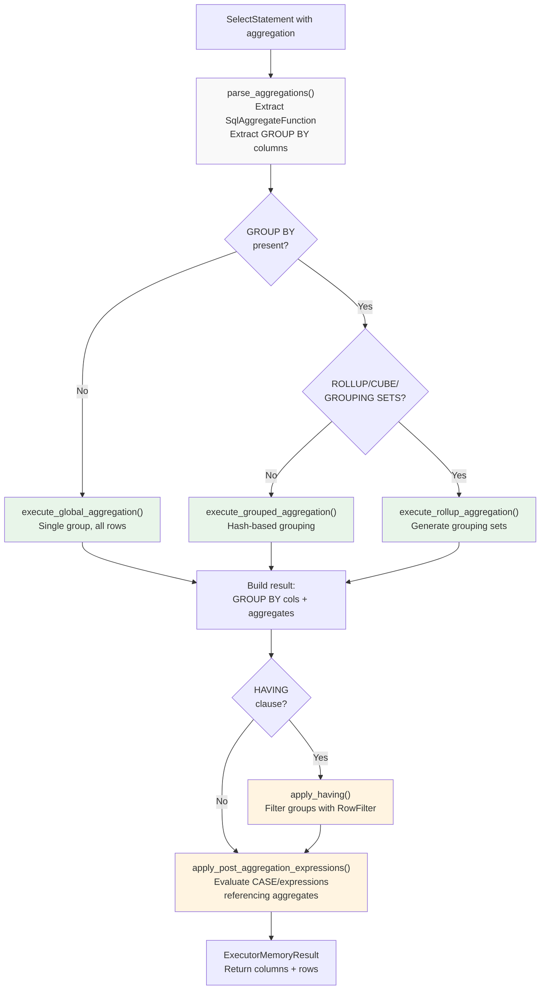

**Diagram: Aggregation Execution Pipeline**

The main entry point is `execute_select_with_aggregation`, which dispatches to different execution strategies based on whether GROUP BY is present and what modifiers (ROLLUP/CUBE) are specified.

Sources: [src/executor/aggregation.rs:226-427]()

## Core Data Structures

### SqlAggregateFunction

Represents an aggregate function call parsed from the query. Each instance tracks the function name, column, arguments, and metadata.

| Field | Type | Purpose |
|-------|------|---------|
| `name` | `String` | Function name (COUNT, SUM, AVG, MIN, MAX, etc.) |
| `column` | `String` | Column name or `"*"` for COUNT(*) |
| `column_lower` | `String` | Pre-computed lowercase for index lookups |
| `alias` | `Option<String>` | AS alias for the result column |
| `distinct` | `bool` | Whether DISTINCT is specified |
| `extra_args` | `Vec<Value>` | Additional arguments (e.g., separator for STRING_AGG) |
| `expression` | `Option<Expression>` | Expression to evaluate (e.g., SUM(val * 2)) |
| `order_by` | `Vec<OrderByExpression>` | ORDER BY for ordered-set aggregates |
| `filter` | `Option<Expression>` | FILTER clause (SQL:2003) |
| `hidden` | `bool` | Used only for ORDER BY, not in SELECT |

Sources: [src/executor/aggregation.rs:167-222]()

### GroupByItem

Represents a GROUP BY column or expression. Supports three forms: simple column names, positional references (GROUP BY 1), and complex expressions.

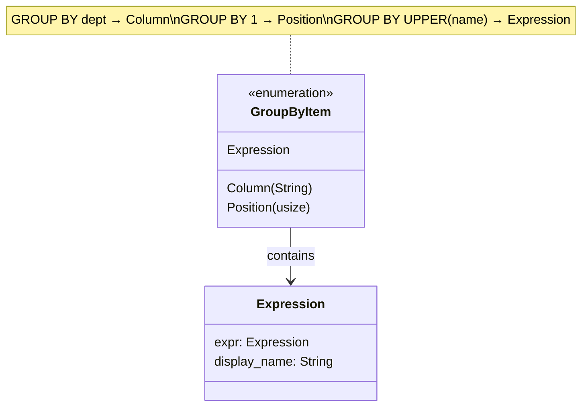

**Diagram: GroupByItem Variants**

Sources: [src/executor/aggregation.rs:114-129]()

## Global Aggregation (No GROUP BY)

For queries like `SELECT COUNT(*), SUM(amount) FROM sales`, all rows form a single group. The system has several optimization fast paths.

### Fast Paths

| Fast Path | Condition | Implementation |
|-----------|-----------|----------------|
| COUNT(*) only | Single COUNT(*), no expressions/filters | Return row count directly [src/executor/aggregation.rs:1518-1531]() |
| SUM(col) only | Single SUM on integer column, no DISTINCT | `fast_sum_column()` single-pass [src/executor/aggregation.rs:1548-1560]() |
| AVG(col) only | Single AVG on column, no DISTINCT | `fast_avg_column()` single-pass [src/executor/aggregation.rs:1562-1574]() |
| CompiledAggregate | No expressions/filters/ORDER BY | Zero virtual dispatch path [src/executor/aggregation.rs:1700-1749]() |

### Parallel Processing

For datasets with 100K+ rows, global aggregation uses Rayon for parallel processing:

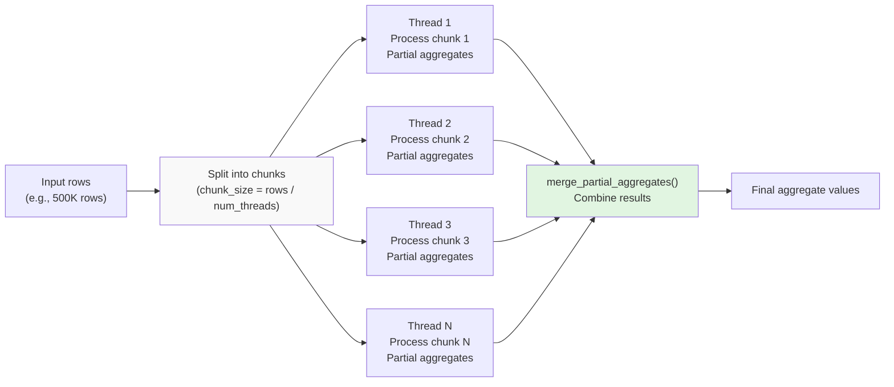

**Diagram: Parallel Global Aggregation**

Conditions for parallelization: `rows.len() >= 100_000 && !has_distinct && !has_expression`

Sources: [src/executor/aggregation.rs:1630-1684]()

## Grouped Aggregation (With GROUP BY)

Grouped aggregation uses hash-based grouping to partition rows into groups based on GROUP BY key values.

### Hash-Based Grouping

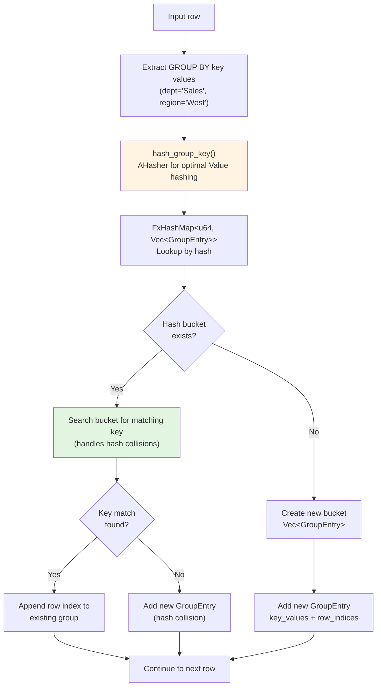

**Diagram: Hash-Based Grouping with Collision Handling**

The grouping algorithm uses `FxHashMap<u64, Vec<GroupEntry>>` where each hash bucket can contain multiple groups to handle collisions correctly. The hash function `hash_group_key()` uses `AHasher`, which is empirically optimal for GROUP BY workloads.

Sources: [src/executor/aggregation.rs:146-156](), [src/executor/aggregation.rs:2307-2568]()

### Grouping Optimizations

**Single-Column GROUP BY**: When grouping by a single column, uses direct value hashing without allocating `Vec<Value>` keys [src/executor/aggregation.rs:2390-2424]().

**Pre-computed Column Indices**: GROUP BY column lookups are resolved once before the row loop, avoiding repeated string lowercasing [src/executor/aggregation.rs:2323-2340]().

**Expression VM**: Complex GROUP BY expressions (e.g., `GROUP BY UPPER(name)`) are pre-compiled to bytecode and evaluated with `ExprVM` [src/executor/aggregation.rs:2345-2362]().

### Fast Single-Pass Aggregation

For simple aggregates (SUM/COUNT without DISTINCT/FILTER/ORDER BY), `try_fast_aggregation()` uses streaming accumulation:

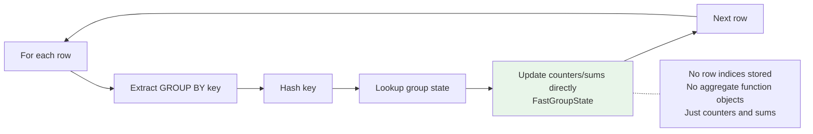

**Diagram: Fast Single-Pass Aggregation**

This avoids allocating `AggregateFunction` objects and storing row indices, accumulating values directly into `FastGroupState { agg_values: Vec<f64>, counts: Vec<i64> }`.

Sources: [src/executor/aggregation.rs:2039-2251]()

### LIMIT Pushdown for GROUP BY

When LIMIT is present without ORDER BY, aggregation can terminate early once the limit of groups is reached:

```rust
// Early termination: stop creating new groups after limit
if has_limit && !key_exists && current_group_count >= group_limit {
    continue; // Skip this row
}
```

This optimization changes the algorithm from O(all rows) to O(rows until limit groups found).

Sources: [src/executor/aggregation.rs:2374-2378](), [src/executor/aggregation.rs:2437-2450]()

## Aggregate Function Accumulation

After grouping, aggregate functions accumulate values for each group.

### Accumulation Process

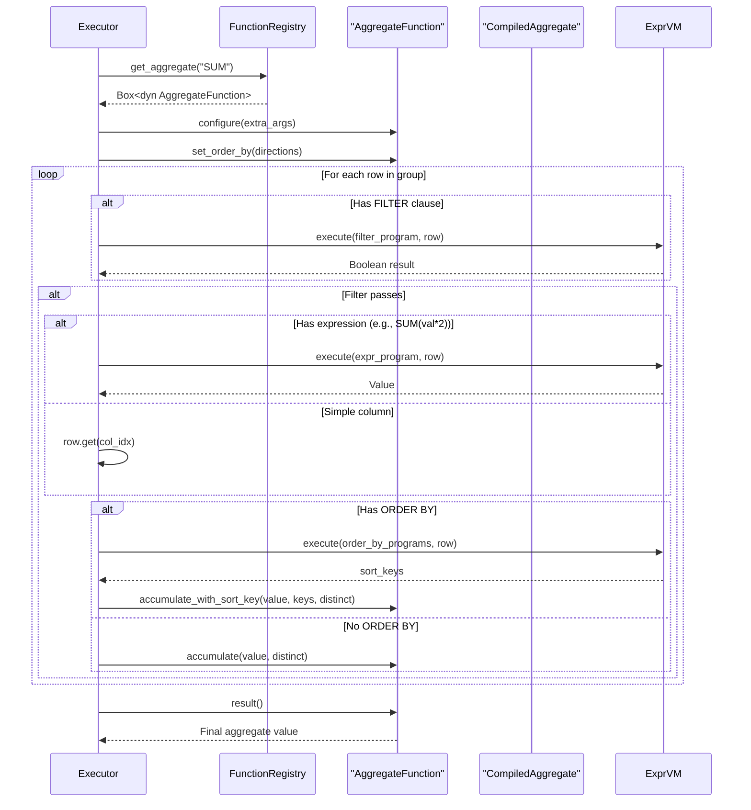

**Diagram: Aggregate Function Accumulation Sequence**

Sources: [src/executor/aggregation.rs:2741-2785]()

### CompiledAggregate Fast Path

For simple aggregates without expressions/filters/ORDER BY, `CompiledAggregate` provides zero virtual dispatch:

| Variant | Implementation |
|---------|----------------|
| `CountStar` | Direct counter increment |
| `CountDistinct` | HashSet insertion + count |
| `Sum` | Direct numeric accumulation |
| `SumDistinct` | HashSet insertion + sum |
| `Dynamic` | Falls back to `Box<dyn AggregateFunction>` |

The compiled path avoids heap allocations and virtual dispatch in the hot loop.

Sources: [src/executor/aggregation.rs:1704-1749]()

## HAVING Clause Filtering

HAVING filters groups after aggregation, similar to WHERE but operating on aggregate results.

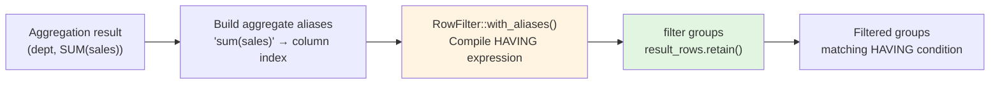

**Diagram: HAVING Clause Processing**

The `RowFilter` is pre-compiled with aggregate expression aliases (e.g., `"SUM(sales)"` → column index 1), allowing HAVING clauses to reference aggregates by their expression name even if aliased in SELECT.

Sources: [src/executor/aggregation.rs:300-350](), [src/executor/aggregation.rs:984-1012]()

### Aggregate Expression Matching

HAVING clauses can reference aggregates in multiple ways:

```sql
SELECT dept, SUM(sales) AS total
FROM orders
GROUP BY dept
HAVING SUM(sales) > 1000;  -- By expression name
```

```sql
HAVING total > 1000;  -- By alias
```

The system builds a mapping of both expression names and aliases to column indices:

```rust
let agg_aliases: Vec<(String, usize)> = aggregations
    .iter()
    .enumerate()
    .map(|(i, agg)| (agg.get_expression_name(), group_by_count + i))
    .collect();
```

Sources: [src/executor/aggregation.rs:308-313]()

## ROLLUP, CUBE, and GROUPING SETS

These SQL:1999 features generate multiple grouping levels in a single query.

### Grouping Set Generation

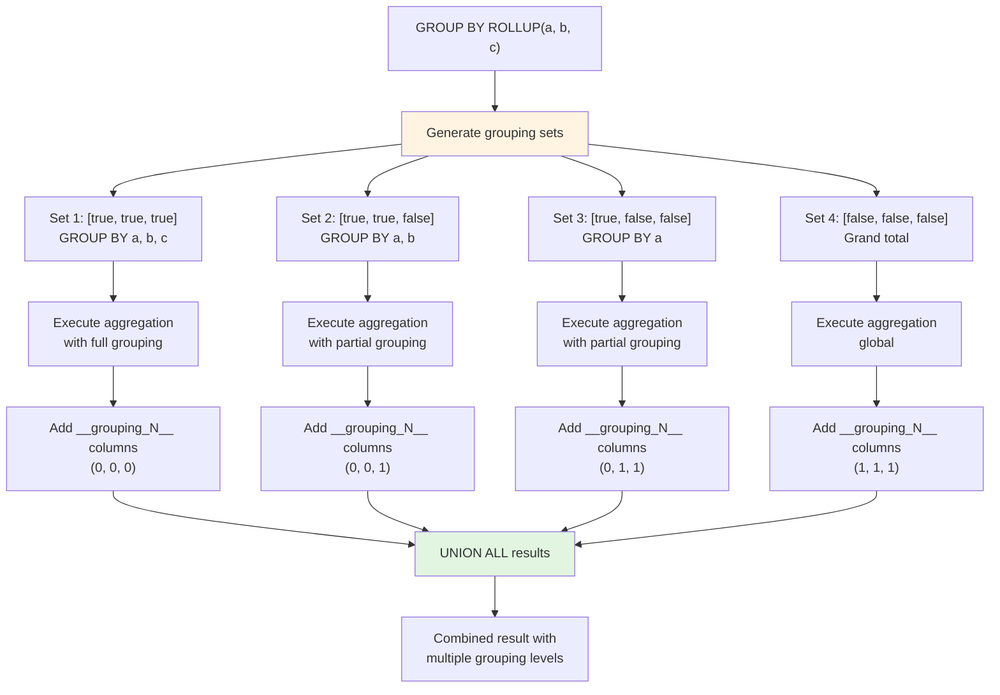

**Diagram: ROLLUP Grouping Set Generation**

**ROLLUP(a, b, c)**: Generates right-to-left hierarchy: `(a,b,c)`, `(a,b)`, `(a)`, `()`

**CUBE(a, b, c)**: Generates all 2^n combinations: `(a,b,c)`, `(a,b)`, `(a,c)`, `(b,c)`, `(a)`, `(b)`, `(c)`, `()`

**GROUPING SETS**: Explicitly specifies which grouping levels to generate

Sources: [src/executor/aggregation.rs:47-55](), [src/executor/rollup.rs:1-500]() (referenced but not shown in files)

### GROUPING() Function

The `GROUPING(column)` function returns 1 if the column is aggregated (NULL represents a rolled-up level) or 0 if it's grouped normally:

```sql
SELECT dept, region, SUM(sales), GROUPING(region)
FROM orders
GROUP BY ROLLUP(dept, region);
```

```
| dept  | region | SUM(sales) | GROUPING(region) |
|-------|--------|------------|------------------|
| Sales | West   | 1000       | 0                |
| Sales | NULL   | 2000       | 1                | ← Rolled up
```

The system stores hidden `__grouping_N__` columns with flags (0/1) for each GROUP BY column, which are looked up when evaluating `GROUPING()` expressions.

Sources: [src/executor/aggregation.rs:612-629](), [src/executor/aggregation.rs:865-875]()

## Post-Aggregation Expression Evaluation

After aggregation, the system evaluates expressions that reference aggregate results:

```sql
SELECT dept, 
       CASE WHEN SUM(sales) > 1000 THEN 'high' ELSE 'low' END
FROM orders
GROUP BY dept;
```

### Column Source Resolution

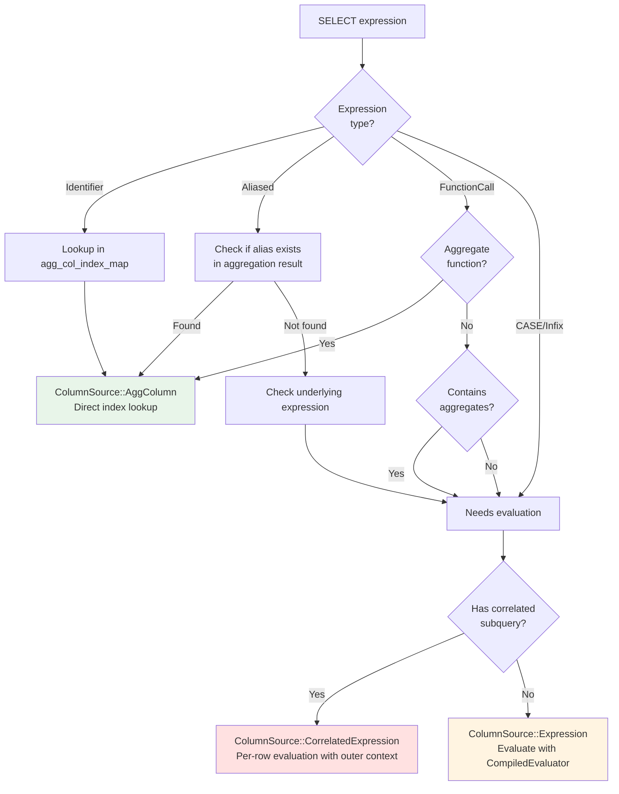

**Diagram: Post-Aggregation Column Source Resolution**

The system categorizes each SELECT expression into one of:
- **AggColumn**: Direct column from aggregation result
- **Expression**: Needs evaluation using `CompiledEvaluator`
- **CorrelatedExpression**: Needs per-row evaluation with outer row context
- **GroupingFlag**: `GROUPING(col)` function lookup

Sources: [src/executor/aggregation.rs:430-884]()

## Integration with Other Systems

### Function Registry

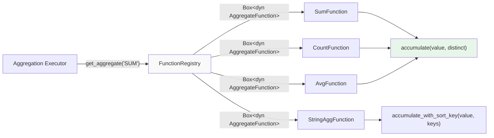

**Diagram: Function Registry Integration**

The aggregation executor retrieves aggregate function implementations from `FunctionRegistry` using `get_aggregate(name)`. Each function implements the `AggregateFunction` trait with `accumulate()`, `result()`, and `reset()` methods.

Sources: [src/executor/aggregation.rs:1641-1647](), [src/executor/aggregation.rs:2698-2701]()

### Expression VM

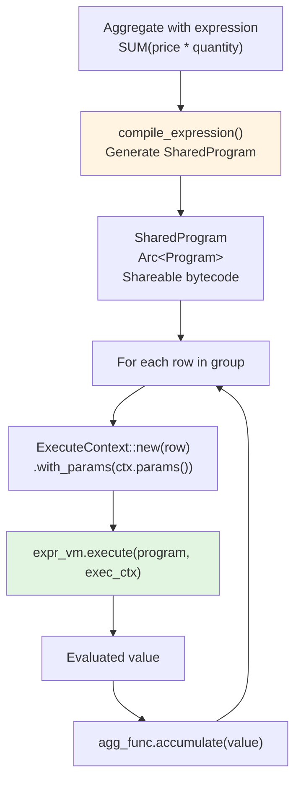

**Diagram: Expression VM Integration for Aggregate Expressions**

Complex aggregate expressions (e.g., `SUM(price * quantity)`) and FILTER clauses are pre-compiled to bytecode using `compile_expression()`. The `ExprVM` evaluates these programs for each row using zero-recursion bytecode execution.

Sources: [src/executor/aggregation.rs:1580-1627](), [src/executor/aggregation.rs:2768-2785]()

## Performance Characteristics

### Time Complexity

| Operation | Complexity | Notes |
|-----------|------------|-------|
| Global aggregation | O(n) | Single pass over all rows |
| Grouped aggregation | O(n) average | Hash-based grouping; O(n²) worst case with collisions |
| Fast single-pass | O(n) | For SUM/COUNT without DISTINCT |
| Parallel aggregation | O(n/p) | Where p = number of threads |
| ROLLUP(a,b,c) | O(n × levels) | Executes aggregation for each grouping level |
| CUBE(a,b,c) | O(n × 2^k) | Where k = number of GROUP BY columns |

### Space Complexity

| Structure | Space | Notes |
|-----------|-------|-------|
| Groups map | O(g × k) | g = number of groups, k = key size |
| Row indices | O(n) | One usize per row (8 bytes) |
| Fast path | O(g) | Direct accumulation, no row indices |
| Aggregate state | O(g × a) | a = number of aggregates per group |

### Optimization Thresholds

```rust
// Parallel global aggregation
rows.len() >= 100_000 && !has_distinct && !has_expression

// Parallel grouped aggregation  
groups_vec.len() >= 4 && total_rows >= 10_000 && avg_rows_per_group >= 50

// Fast single-pass aggregation
all GROUP BY items are simple columns
&& all aggregates are SUM/COUNT without DISTINCT/FILTER/ORDER BY
```

Sources: [src/executor/aggregation.rs:1630](), [src/executor/aggregation.rs:2623-2632]()

## Key Implementation Details

### Hash Function Choice

The system uses `AHasher` for GROUP BY key hashing instead of `FxHasher`:

```rust
#[inline]
fn hash_group_key(values: &[Value]) -> u64 {
    let mut hasher = AHasher::default();
    for v in values {
        hash_value_into(v, &mut hasher);
    }
    hasher.finish()
}
```

Empirically tested to perform better than `FxHasher` for GROUP BY workloads with `Value` types (strings, floats, JSON, etc.).

Sources: [src/executor/aggregation.rs:146-156]()

### Collision Handling

The groups map uses `FxHashMap<u64, Vec<GroupEntry>>` where each hash bucket is a `Vec` to handle collisions:

```rust
// Search bucket for matching group
if let Some(entry) = bucket.iter_mut().find(|entry| entry.key_values == key_buffer) {
    entry.row_indices.push(row_idx); // Existing group
} else {
    bucket.push(GroupEntry { ... }); // Hash collision
}
```

This ensures correctness when different GROUP BY keys produce the same hash.

Sources: [src/executor/aggregation.rs:2456-2469]()

### DISTINCT Handling

For `COUNT(DISTINCT col)` or `SUM(DISTINCT col)`, the aggregate function implementation maintains an internal HashSet to track seen values. The executor passes the `distinct` flag to `accumulate()`:

```rust
func.accumulate(value, agg.distinct);
```

Sources: [src/executor/aggregation.rs:1743](), [src/executor/aggregation.rs:2671]()

### ORDER BY for Aggregates

Ordered-set aggregates like `STRING_AGG` and `ARRAY_AGG` support ORDER BY clauses:

```sql
SELECT STRING_AGG(name, ', ' ORDER BY name DESC) FROM employees;
```

The system pre-compiles ORDER BY expressions and passes sort keys to the aggregate function:

```rust
let mut sort_keys = Vec::with_capacity(compiled_order_by[i].len());
for order_program in &compiled_order_by[i] {
    sort_keys.push(vm.execute(order_program, &exec_ctx)?);
}
func.accumulate_with_sort_key(value, sort_keys, agg.distinct);
```

Sources: [src/executor/aggregation.rs:1845-1866]()

---

**Page Sources:**
- [src/executor/aggregation.rs:1-3000]() - Main aggregation implementation
- [src/executor/query.rs:820-830]() - Aggregation detection and integration
- [src/functions/aggregate.rs]() - Aggregate function trait and implementations (referenced)
- [src/executor/expression.rs]() - Expression VM integration (referenced)