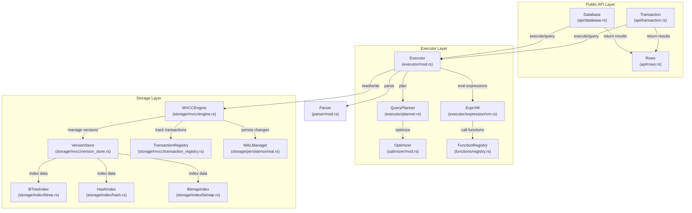
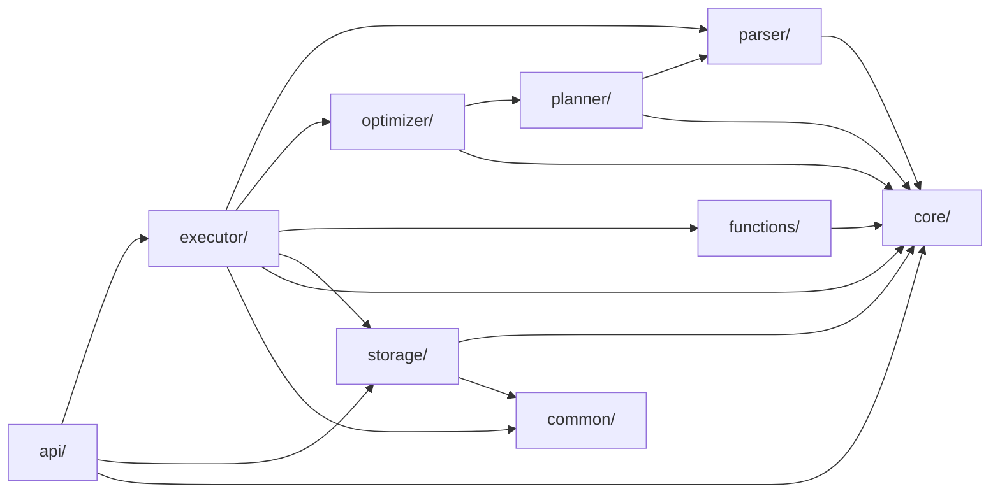
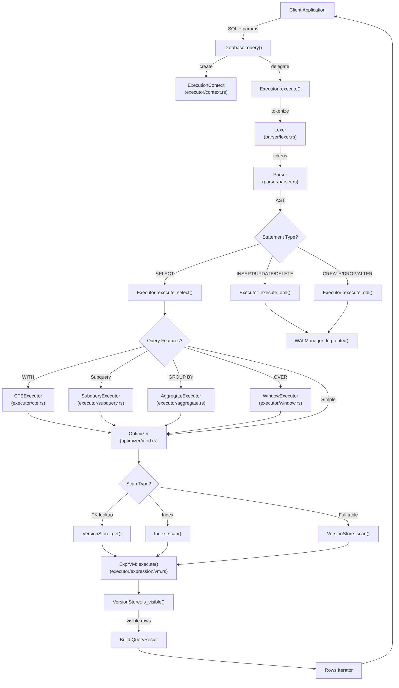
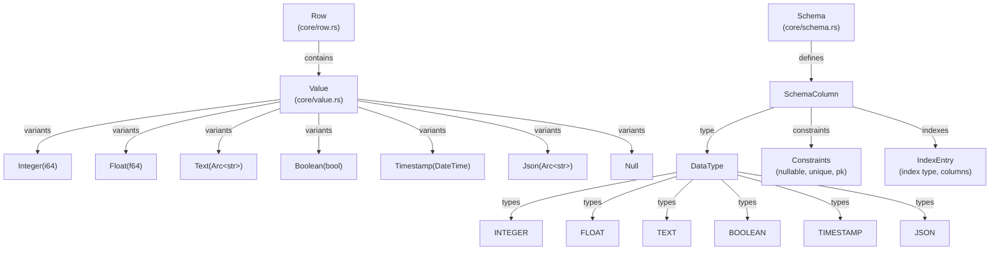
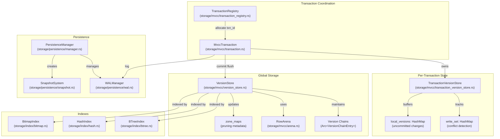
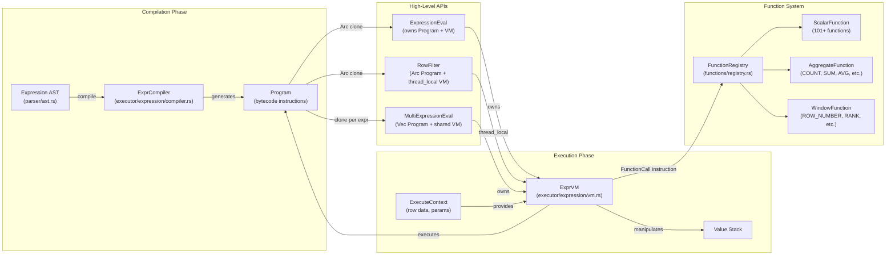
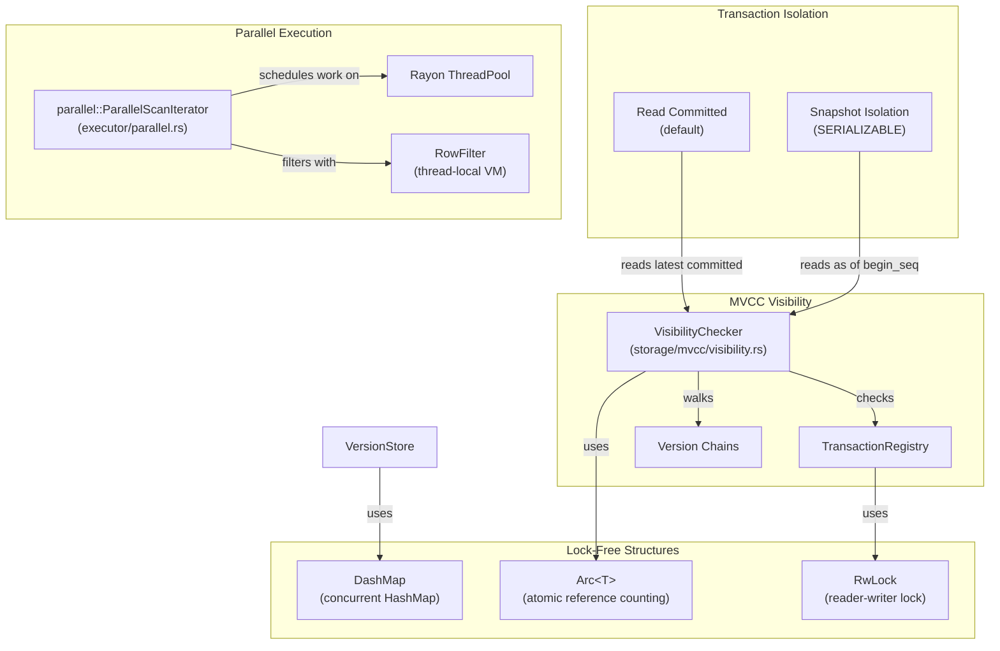

# Page: Architecture Overview

# Architecture Overview

Relevant source files

The following files were used as context for generating this wiki page:

- [.github/workflows/ci.yml](.github/workflows/ci.yml)
- [.gitignore](.gitignore)
- [Cargo.toml](Cargo.toml)
- [README.md](README.md)
- [../../../../roadmap.md](../../../../roadmap.md)
- [docs/_config.yml](docs/_config.yml)
- [src/executor/query.rs](src/executor/query.rs)
- [src/lib.rs](src/lib.rs)

## Purpose and Scope

This document describes the high-level architecture of OxiBase: its layered structure, major components, module organization, and how data flows through the system during query execution. It provides a conceptual map of the codebase to help developers understand where different functionality lives and how the pieces fit together.

For details on using OxiBase as a library or CLI tool, see [Getting Started](#1.1). For implementation details of specific subsystems, see the Query Execution System ([Section 3](#3)), Storage Engine ([Section 4](#4)), and SQL Feature Reference ([Section 5](#5)).

## Three-Tier Layered Architecture

OxiBase follows a classic three-tier database architecture with clear separation of concerns:

**Sources:** [README.md:83-100](), [src/lib.rs:1-152]()

### API Layer

The API layer provides the user-facing interface for interacting with OxiBase. It handles connection management, transaction lifecycle, and result streaming.

**Key Components:**
- `Database` - Entry point for opening databases and executing queries ([api/database.rs]())
- `Transaction` - Manages ACID transaction boundaries with commit/rollback ([api/transaction.rs]())
- `Rows` - Iterator for streaming query results with type conversion ([api/rows.rs]())
- `Statement` - Prepared statement interface with parameter binding ([api/statement.rs]())

The API layer delegates SQL parsing and execution to the Executor layer but handles connection pooling, DSN parsing, and result formatting.

**Sources:** [src/lib.rs:148-151](), [README.md:86-87]()

### Executor Layer

The Executor layer is responsible for transforming SQL into results. It contains the query execution pipeline: parsing, planning, optimization, and execution.

**Key Components:**
- `Executor` - Orchestrates query execution across all statement types ([executor/mod.rs]())
- `QueryPlanner` - Generates logical query plans from AST ([executor/planner.rs]())
- `Optimizer` - Cost-based query optimizer with statistics ([optimizer/mod.rs]())
- `ExprVM` - Stack-based bytecode VM for expression evaluation ([executor/expression/vm.rs]())
- `FunctionRegistry` - Registry of 101+ built-in SQL functions ([functions/registry.rs]())

Specialized execution engines handle complex SQL features:
- Query executor for SELECT statements ([executor/query.rs]())
- Aggregation engine for GROUP BY/ROLLUP/CUBE ([executor/aggregate.rs]())
- Window function engine for OVER clauses ([executor/window.rs]())
- Subquery engine for correlated/uncorrelated subqueries ([executor/subquery.rs]())
- CTE engine for WITH clauses including recursive CTEs ([executor/cte.rs]())
- DDL executor for schema changes ([executor/ddl.rs]())

**Sources:** [src/executor/query.rs:1-26](), [README.md:88-96]()

### Storage Layer

The Storage layer implements multi-version concurrency control (MVCC), indexing, and persistence. It provides transactional isolation while allowing concurrent reads and writes.

**Key Components:**
- `MVCCEngine` - Main storage engine coordinating transactions and persistence ([storage/mvcc/engine.rs]())
- `VersionStore` - Manages version chains for each table row ([storage/mvcc/version_store.rs]())
- `TransactionRegistry` - Tracks active transactions for visibility checking ([storage/mvcc/transaction_registry.rs]())
- `BTreeIndex` - Range-queryable B-tree index ([storage/index/btree.rs]())
- `HashIndex` - O(1) equality lookup hash index ([storage/index/hash.rs]())
- `BitmapIndex` - Compressed bitmap index for low-cardinality columns ([storage/index/bitmap.rs]())
- `WALManager` - Write-ahead log for durability and crash recovery ([storage/persistence/wal.rs]())
- `PersistenceManager` - Snapshot creation and restoration ([storage/persistence/manager.rs]())

**Sources:** [README.md:97-99](), [src/lib.rs:105-124]()

## Module Organization

The codebase is organized into distinct modules with minimal cross-dependencies:

**Module Descriptions:**

| Module | Purpose | Key Files |
|--------|---------|-----------|
| `api/` | Public database interface | `database.rs`, `transaction.rs`, `rows.rs` |
| `core/` | Core types and abstractions | `value.rs`, `row.rs`, `schema.rs`, `error.rs` |
| `parser/` | SQL lexer and parser | `lexer.rs`, `parser.rs`, `ast.rs` |
| `planner/` | Query planning | `planner.rs` |
| `optimizer/` | Cost-based optimization | `mod.rs`, `stats.rs`, `aqe.rs` |
| `executor/` | Query execution | `query.rs`, `aggregate.rs`, `window.rs`, `subquery.rs`, `cte.rs` |
| `functions/` | Built-in SQL functions | `scalar/`, `aggregate/`, `window/` |
| `storage/` | MVCC storage engine | `mvcc/`, `index/`, `persistence/` |
| `common/` | Shared utilities | `buffer_pool.rs`, `int64_map.rs`, `version.rs` |

**Sources:** [README.md:83-100](), [src/lib.rs:66-73]()

## Query Execution Data Flow

The following diagram shows how a SQL query flows through the system, from API entry to result streaming:

**Key Execution Steps:**

1. **Parsing:** [parser/lexer.rs]() tokenizes the SQL string, [parser/parser.rs]() builds an AST
2. **Context Creation:** [executor/context.rs:1-100]() creates an `ExecutionContext` with parameters, timeout, and cancellation token
3. **Feature Detection:** [executor/query.rs:191-193]() checks for CTEs, subqueries, aggregation, or window functions
4. **Optimization:** [optimizer/mod.rs]() applies predicate pushdown, index selection, and join reordering
5. **Scan Execution:** [storage/mvcc/version_store.rs]() scans data, checking MVCC visibility
6. **Expression Evaluation:** [executor/expression/vm.rs]() evaluates WHERE clauses, SELECT expressions, and function calls
7. **Result Building:** Specialized result wrappers ([executor/result.rs]()) handle filtering, projection, ordering, and limiting
8. **Streaming:** [api/rows.rs]() provides iterator interface for result consumption

**Sources:** [src/executor/query.rs:154-719](), [README.md:83-100]()

## Core Type System

OxiBase uses a strongly-typed value system with runtime type checking:

**Type Definitions:**
- `Value` - Tagged union representing SQL values ([core/value.rs:1-500]())
- `Row` - Vector of `Value` objects representing a table row ([core/row.rs:1-100]())
- `Schema` - Table metadata including columns and indexes ([core/schema.rs:1-300]())
- `DataType` - Enum of supported SQL types ([core/types.rs:1-100]())

**Sources:** [src/lib.rs:76-79](), [README.md:313-322]()

## Storage Engine Architecture

The storage layer implements MVCC with version chains and multiple index types:

**MVCC Components:**

| Component | Responsibility | File |
|-----------|---------------|------|
| `TransactionRegistry` | Assign transaction IDs, track active transactions | `storage/mvcc/transaction_registry.rs` |
| `MvccTransaction` | Per-transaction handle with read/write operations | `storage/mvcc/transaction.rs` |
| `TransactionVersionStore` | Buffer uncommitted changes, detect conflicts | `storage/mvcc/transaction_version_store.rs` |
| `VersionStore` | Global storage of committed version chains | `storage/mvcc/version_store.rs` |
| `VersionChainEntry` | Single version in the chain with Arc for cheap cloning | `storage/mvcc/version_store.rs` |
| `RowArena` | Zero-copy row storage with arena allocation | `storage/mvcc/arena.rs` |

**Index Types:**

Each table can have multiple indexes of different types optimized for different access patterns:

- **BTreeIndex** ([storage/index/btree.rs]()): Range queries, ORDER BY, prefix matching. Uses `BTreeMap` for sorted access plus `HashMap` for O(1) equality lookups.
- **HashIndex** ([storage/index/hash.rs]()): O(1) equality lookups using `AHasher` (30+ GB/s throughput, DOS-resistant).
- **BitmapIndex** ([storage/index/bitmap.rs]()): Low-cardinality columns with fast AND/OR/NOT using Roaring bitmaps (used by Lucene, Druid, Spark).

**Persistence:**

- **WAL** ([storage/persistence/wal.rs]()): Sequential append-only log with CRC32 checksums, optional compression
- **Snapshots** ([storage/persistence/snapshot.rs]()): Periodic full database checkpoints with 3-phase atomic writes
- **Recovery** ([storage/persistence/manager.rs:1-500]()): 2-phase WAL replay on startup

**Sources:** [README.md:97-99](), [src/lib.rs:105-124]()

## Expression Evaluation System

OxiBase uses a compile-once, execute-many bytecode VM for expression evaluation:

**Key Design Decisions:**

1. **Zero Recursion**: Linear instruction sequences eliminate stack overflow risks ([executor/expression/compiler.rs:1-500]())
2. **Immutable Programs**: Bytecode is `Arc`-shared across threads for parallel execution ([executor/expression/program.rs:1-200]())
3. **Thread-Safe Filtering**: `RowFilter` uses thread-local VMs for parallel table scans ([executor/expression/row_filter.rs:1-300]())
4. **Context Separation**: Compilation context (schema) vs execution context (row data) enables pre-compilation ([executor/expression/compiler.rs:50-100]())

**Instruction Set:**

The VM executes a stack-based instruction set defined in [executor/expression/instruction.rs:1-200]():

- `Load(index)` - Load column value onto stack
- `LoadConst(Value)` - Load constant value
- `BinOp(Operator)` - Execute binary operation (Add, Sub, Mul, Div, etc.)
- `UnaryOp(Operator)` - Execute unary operation (Neg, Not)
- `FunctionCall(id, argc)` - Call function from registry
- `JumpIf(offset)` - Conditional jump for CASE expressions
- `Return` - End execution, return top of stack

**Sources:** [src/lib.rs:127-139](), [README.md:88-96]()

## Concurrency Model

OxiBase uses multiple strategies for concurrent execution:

**Isolation Levels:**

OxiBase supports two isolation levels defined in [core/types.rs:1-100]():

1. **Read Committed**: Each statement sees data committed before it started. Implemented via snapshot-at-statement-start in [storage/mvcc/visibility.rs:1-200]().
2. **Snapshot Isolation**: Entire transaction sees consistent snapshot. Prevents phantom reads but allows write skew. Implemented via snapshot-at-transaction-start in [storage/mvcc/transaction.rs:1-500]().

**Parallel Query Execution:**

The executor automatically parallelizes table scans when beneficial ([executor/parallel.rs:1-500]()):

- Splits table into chunks based on row count and CPU cores
- Each thread gets a `RowFilter` with thread-local `ExprVM` for WHERE clause evaluation
- Results are collected and merged in the parent thread
- Configurable via `ParallelConfig` with thresholds for when to parallelize

**Lock-Free Synchronization:**

- `Arc<T>` for cheap snapshot cloning of immutable data structures
- `DashMap` for concurrent HashMap operations without global locks
- `RwLock` for schema changes (rare writes, frequent reads)
- Atomic operations for transaction ID allocation

**Sources:** [src/lib.rs:105-111](), [README.md:158-173]()

## Build and Dependency Configuration

The project uses Cargo with specific optimizations for production builds:

**Release Profile Optimizations** ([Cargo.toml:100-110]()):
- `lto = true` - Link-time optimization across all crates
- `codegen-units = 1` - Single compilation unit for maximum optimization
- `opt-level = 3` - Highest optimization level
- `panic = "abort"` - No unwinding for smaller binary size

**Key Dependencies** ([Cargo.toml:30-78]()):

| Category | Crates | Purpose |
|----------|--------|---------|
| Concurrency | `parking_lot`, `dashmap`, `crossbeam`, `rayon` | Lock-free structures, parallel execution |
| Serialization | `serde`, `serde_json` | JSON support, persistence |
| Performance | `radsort`, `ahash`, `roaring`, `smallvec` | Radix sort, fast hashing, bitmaps, small vector optimization |
| Utilities | `rustc-hash`, `memchr`, `regex`, `bytes` | Fast hashing, string searching, pattern matching |
| Persistence | `crc32fast`, `lz4_flex` | Checksums, compression |

**Platform-Specific** ([Cargo.toml:81-86]()):
- Unix: `libc` for file locking via `flock()`
- Windows: `windows-sys` for file locking via `LockFileEx()`

**Sources:** [Cargo.toml:1-117](), [.github/workflows/ci.yml:1-183]()