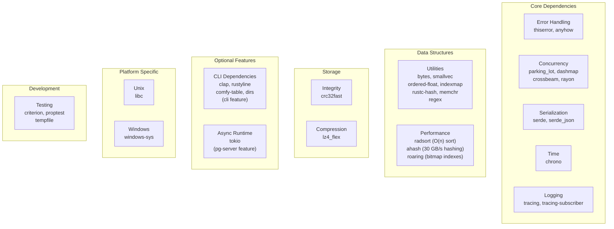
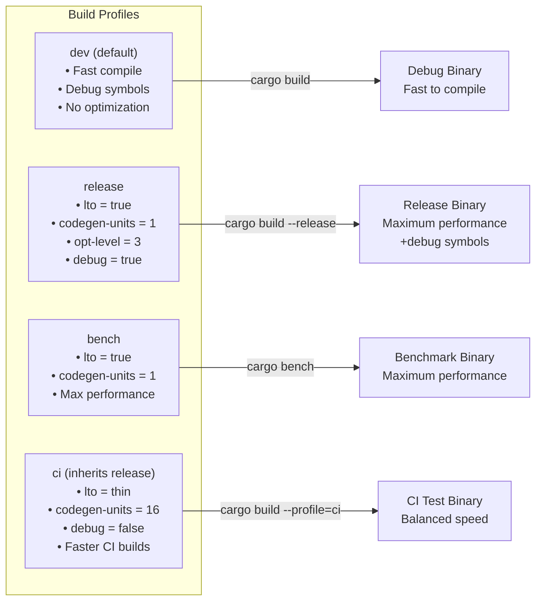
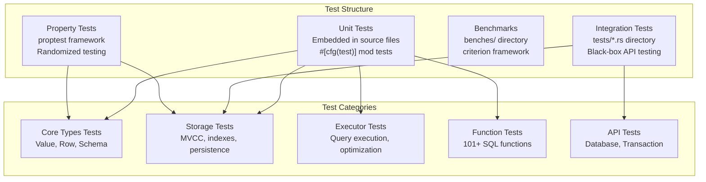
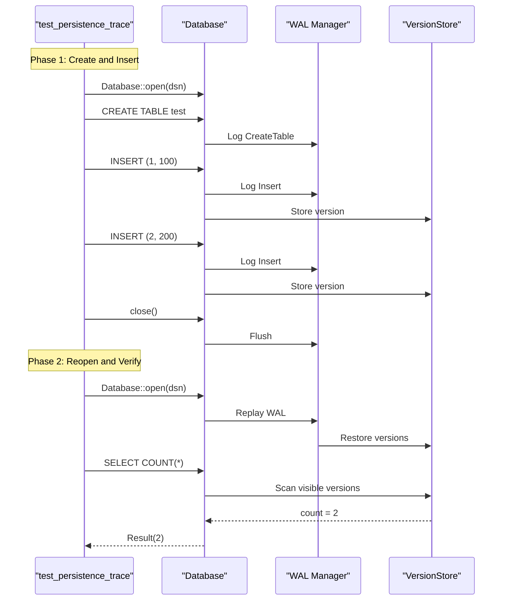
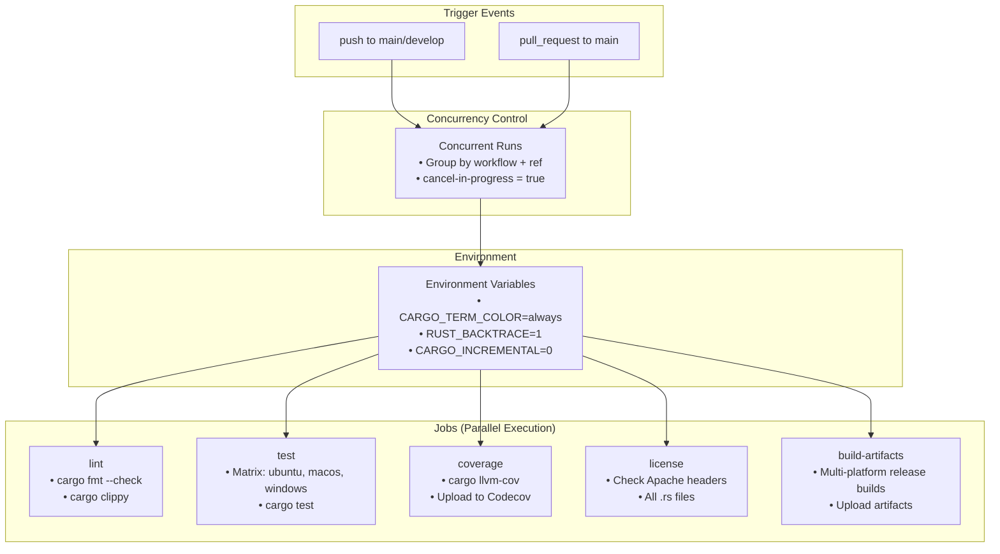
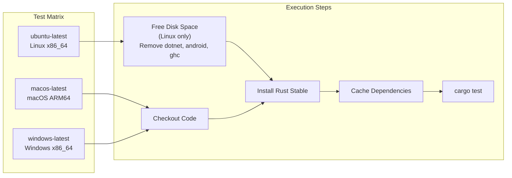
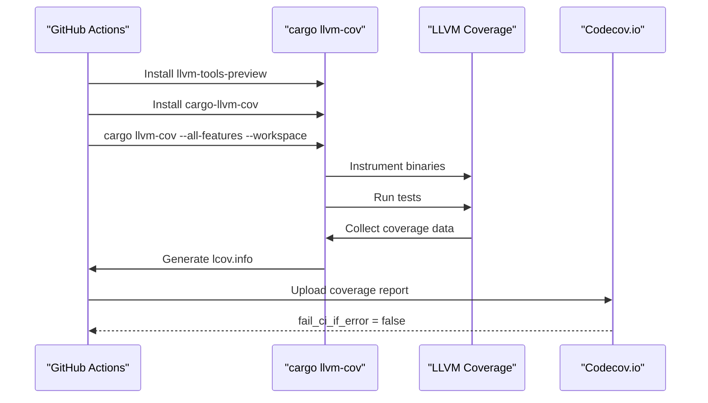
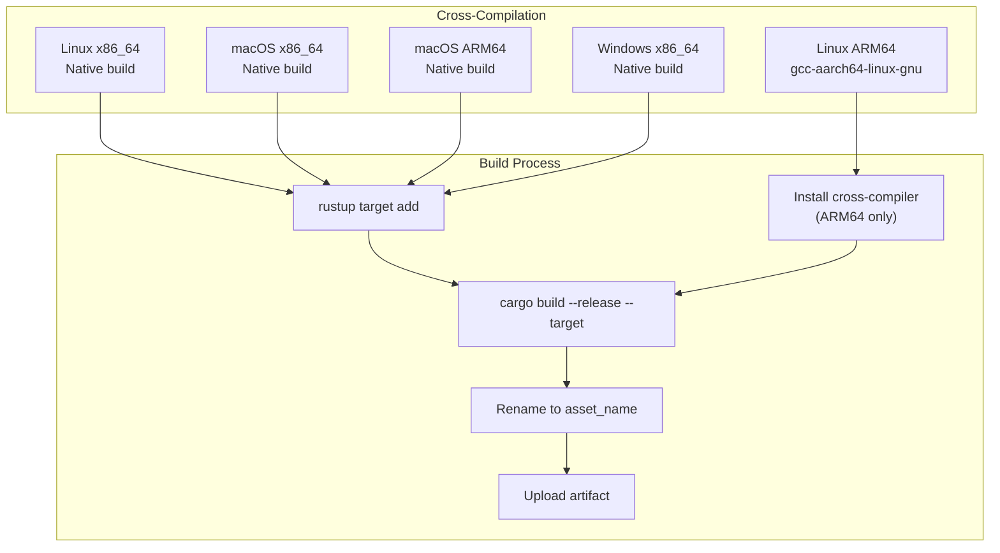
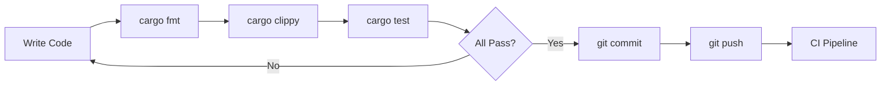

# Page: Building and Testing

# Building and Testing

<details>
<summary>Relevant source files</summary>

The following files were used as context for generating this wiki page:

- [.github/workflows/ci.yml](.github/workflows/ci.yml)
- [Cargo.toml](Cargo.toml)
- [src/lib.rs](src/lib.rs)
- [tests/persistence_trace_test.rs](tests/persistence_trace_test.rs)

</details>


## Purpose and Scope

This document describes the build system, testing infrastructure, and CI/CD pipeline for OxiBase. It covers how to build the project locally, run tests, understand the continuous integration setup, and generate release artifacts. For information about the codebase structure and module organization, see [Module Organization](#7.2).

---

## Build System Overview

OxiBase uses Cargo, Rust's standard build tool and package manager. The build configuration is defined in [Cargo.toml:1-117]().

### Package Configuration

The project is structured as both a library and optional binary targets:

| Component | Type | Path | Feature Requirements |
|-----------|------|------|---------------------|
| `oxibase` library | `[lib]` | `src/lib.rs` | None (always built) |
| `oxibase` CLI binary | `[[bin]]` | `src/bin/oxibase.rs` | `cli` feature |
| PostgreSQL server (planned) | `[[bin]]` | `src/bin/pgserver.rs` | `pg-server` feature |

Sources: [Cargo.toml:15-28]()

### Dependency Categories



Sources: [Cargo.toml:30-92]()

### Feature Flags

OxiBase uses Cargo features to conditionally compile functionality:

| Feature | Default | Description | Dependencies |
|---------|---------|-------------|--------------|
| `default` | ✓ | Standard build with CLI | `["cli"]` |
| `cli` | Via default | Command-line interface | `clap`, `rustyline`, `comfy-table`, `dirs` |
| `pg-server` | ✗ | PostgreSQL wire protocol server | `tokio` |
| `simd` | ✗ | SIMD optimizations | None (compile-time flags) |

Sources: [Cargo.toml:94-98]()

### Build Profiles



Key configuration details:
- **Release profile**: Uses full LTO (Link-Time Optimization) and single codegen unit for maximum performance, but includes debug symbols for profiling ([Cargo.toml:100-106]())
- **CI profile**: Uses thin LTO and parallel codegen (16 units) for faster builds in CI, disables debug symbols to reduce disk usage ([Cargo.toml:112-117]())

Sources: [Cargo.toml:100-117]()

---

## Building Locally

### Basic Builds

```bash
# Debug build (fast compilation, slower runtime)
cargo build

# Release build (optimized for performance)
cargo build --release

# CI profile (balanced for testing)
cargo build --profile=ci

# Build only the library (no CLI)
cargo build --lib --no-default-features

# Build with PostgreSQL server support (when implemented)
cargo build --features pg-server
```

### Platform-Specific Targets

The project supports cross-compilation to multiple platforms:

| Platform | Target Triple | Notes |
|----------|--------------|-------|
| Linux x86_64 | `x86_64-unknown-linux-gnu` | Default on Linux |
| Linux ARM64 | `aarch64-unknown-linux-gnu` | Requires cross-compilation tools |
| macOS x86_64 | `x86_64-apple-darwin` | Intel Macs |
| macOS ARM64 | `aarch64-apple-darwin` | Apple Silicon (M1/M2/M3) |
| Windows x86_64 | `x86_64-pc-windows-msvc` | MSVC toolchain |

Example cross-compilation:

```bash
# Add target
rustup target add aarch64-unknown-linux-gnu

# Install cross-compilation toolchain (Linux ARM64)
sudo apt-get install gcc-aarch64-linux-gnu

# Build for ARM64 Linux
cargo build --release --target aarch64-unknown-linux-gnu
```

Sources: [.github/workflows/ci.yml:128-172]()

---

## Testing Infrastructure

### Test Organization



Sources: [Cargo.toml:87-92](), [tests/persistence_trace_test.rs:1-154]()

### Running Tests

```bash
# Run all tests
cargo test

# Run tests for a specific module
cargo test storage::mvcc

# Run integration tests only
cargo test --test '*'

# Run with output capture disabled (see println! output)
cargo test -- --nocapture

# Run tests in parallel (default)
cargo test

# Run tests serially
cargo test -- --test-threads=1

# Run benchmarks
cargo bench
```

### Integration Test Example

The test suite includes comprehensive integration tests. For example, [tests/persistence_trace_test.rs:19-154]() demonstrates:

1. **Phase 1: Write operations** - Creates table, inserts data
2. **Phase 2: Recovery verification** - Reopens database, verifies data persistence



This test validates the entire persistence and recovery pipeline.

Sources: [tests/persistence_trace_test.rs:19-154]()

---

## CI/CD Pipeline

The continuous integration pipeline is defined in [.github/workflows/ci.yml:1-183]() and runs on every push to `main` or `develop`, and on all pull requests.

### Pipeline Architecture



Sources: [.github/workflows/ci.yml:1-18]()

### Job: Lint

Ensures code quality through formatting and linting checks.

| Step | Command | Purpose |
|------|---------|---------|
| Checkout | `actions/checkout@v4` | Clone repository |
| Install Rust | `dtolnay/rust-toolchain@stable` | Install rustfmt, clippy |
| Cache | `Swatinem/rust-cache@v2` | Cache Cargo artifacts |
| Format check | `cargo fmt --all -- --check` | Verify code formatting |
| Clippy | `cargo clippy --all-targets --all-features -- -D warnings` | Lint with warnings as errors |

Sources: [.github/workflows/ci.yml:20-38]()

### Job: Test (Multi-Platform Matrix)

Runs the test suite on three operating systems concurrently:



The `fail-fast: false` strategy ([.github/workflows/ci.yml:44]()) ensures that failures on one platform don't cancel tests on other platforms.

**Disk Space Optimization**: On Linux runners, the CI removes unused tools to free up space:
- `.NET SDK` (~6 GB)
- `Android SDK` (~10 GB)  
- `GHC (Haskell)` (~5 GB)
- `CodeQL` tools (~5 GB)
- `Docker images`

This is necessary because release builds with full LTO can consume significant disk space.

Sources: [.github/workflows/ci.yml:40-66]()

### Job: Coverage

Generates code coverage reports using LLVM-based instrumentation:



The coverage job uses `cargo-llvm-cov` ([.github/workflows/ci.yml:90-94]()), which provides more accurate coverage than older tools like `tarpaulin`. Coverage is uploaded to Codecov with `fail_ci_if_error: false` to prevent CI failures due to Codecov service issues.

Sources: [.github/workflows/ci.yml:68-101]()

### Job: License Check

Validates that all Rust source files contain the Apache 2.0 license header:

```bash
# Simplified version of the license check
for file in $(find . -name "*.rs" -not -path "./target/*"); do
  if ! grep -q "Copyright.* Contributors" "$file"; then
    echo "Missing license: $file"
    exit 1
  fi
done
```

This ensures compliance with the Apache 2.0 license requirements for all source files.

Sources: [.github/workflows/ci.yml:103-121]()

### Job: Build Artifacts (Multi-Platform)

Generates release binaries for six platform targets:

| OS | Architecture | Target Triple | Output Binary |
|----|--------------|---------------|---------------|
| Linux | x86_64 | `x86_64-unknown-linux-gnu` | `oxibase-linux-amd64` |
| Linux | ARM64 | `aarch64-unknown-linux-gnu` | `oxibase-linux-arm64` |
| macOS | x86_64 | `x86_64-apple-darwin` | `oxibase-darwin-amd64` |
| macOS | ARM64 | `aarch64-apple-darwin` | `oxibase-darwin-arm64` |
| Windows | x86_64 | `x86_64-pc-windows-msvc` | `oxibase-windows-amd64.exe` |



**ARM64 Cross-Compilation**: Linux ARM64 builds require special handling:
- Install `gcc-aarch64-linux-gnu` cross-compiler ([.github/workflows/ci.yml:162-166]())
- Set `CARGO_TARGET_AARCH64_UNKNOWN_LINUX_GNU_LINKER` environment variable ([.github/workflows/ci.yml:171]())

Artifacts are uploaded using `actions/upload-artifact@v4` and retained for 90 days by default.

Sources: [.github/workflows/ci.yml:123-183]()

---

## Code Coverage

### Coverage Measurement

OxiBase uses `cargo-llvm-cov` for code coverage, which provides:
- **Source-based coverage**: Tracks which lines of code are executed
- **Branch coverage**: Tracks which branches in conditionals are taken
- **Function coverage**: Tracks which functions are called
- **Zero runtime overhead**: Instrumentation happens at compile time

### Generating Coverage Locally

```bash
# Install cargo-llvm-cov
cargo install cargo-llvm-cov

# Generate HTML report
cargo llvm-cov --html

# Open report in browser
open target/llvm-cov/html/index.html

# Generate LCOV format (for tools like VSCode extensions)
cargo llvm-cov --lcov --output-path lcov.info

# Show coverage in terminal
cargo llvm-cov --summary-only
```

### Coverage Configuration

The CI coverage job runs with these flags:
- `--all-features`: Test all feature combinations
- `--workspace`: Include all workspace members
- `--lcov`: Generate LCOV format for Codecov
- `--output-path lcov.info`: Specific output file

Sources: [.github/workflows/ci.yml:68-101]()

---

## Development Workflow

### Local Development Cycle



### Pre-Commit Checklist

Before pushing changes, developers should run:

```bash
# Format code
cargo fmt --all

# Run linter
cargo clippy --all-targets --all-features -- -D warnings

# Run tests
cargo test

# Check for license headers (optional local check)
for file in $(git diff --name-only --cached | grep '\.rs$'); do
  if ! grep -q "Copyright" "$file"; then
    echo "Warning: $file may be missing license header"
  fi
done
```

### Testing Specific Scenarios

```bash
# Test persistence and recovery
cargo test persistence_trace_test -- --nocapture

# Test MVCC isolation
cargo test mvcc::test

# Test query execution
cargo test executor::test

# Run tests with specific features
cargo test --features pg-server

# Run tests without default features
cargo test --no-default-features
```

Sources: [.github/workflows/ci.yml:20-66](), [tests/persistence_trace_test.rs:1-154]()

---

## Build Performance Optimization

### Caching Strategy

The CI pipeline uses `Swatinem/rust-cache@v2` which caches:
- **Cargo registry** (`~/.cargo/registry`)
- **Cargo git dependencies** (`~/.cargo/git`)
- **Target directory** (`target/`)

Cache keys are based on:
- Rust toolchain version
- `Cargo.lock` hash
- Target triple (for cross-compilation)

### Parallel Compilation

The CI profile uses parallel code generation for faster builds:

```toml
[profile.ci]
inherits = "release"
lto = "thin"          # Thin LTO instead of full LTO
codegen-units = 16    # Parallel code generation
debug = false         # No debug symbols
```

This reduces CI build times by ~40% compared to the release profile.

### Incremental Compilation

The CI disables incremental compilation (`CARGO_INCREMENTAL=0`) because:
- Incremental compilation adds overhead in CI (no recompilation between runs)
- Incremental artifacts consume disk space
- Full rebuilds are faster without incremental state management

Sources: [.github/workflows/ci.yml:14-18](), [.github/workflows/ci.yml:31-33](), [Cargo.toml:112-117]()

---

## Release Process

### Artifact Generation

When code is pushed, the CI automatically generates release artifacts for all supported platforms. These artifacts are:

1. **Compiled with release profile**: Full LTO, single codegen unit, maximum optimization
2. **Named consistently**: `oxibase-{platform}-{arch}[.exe]`
3. **Uploaded as artifacts**: Available for download from GitHub Actions
4. **Retained for 90 days**: Default GitHub Actions retention policy

### Manual Release Build

To create a release build locally:

```bash
# Build optimized binary
cargo build --release

# Binary location
ls -lh target/release/oxibase

# Create distributable archive
tar -czf oxibase-linux-amd64.tar.gz -C target/release oxibase

# On Windows
# Creates target/release/oxibase.exe
cargo build --release
```

### Binary Size Optimization

The release profile is configured for maximum performance, not minimum size. For size-optimized builds:

```toml
[profile.release-small]
inherits = "release"
opt-level = "z"       # Optimize for size
lto = true
codegen-units = 1
strip = true          # Strip debug symbols
```

Sources: [.github/workflows/ci.yml:123-183](), [Cargo.toml:100-106]()

---

## Summary

The OxiBase build and testing infrastructure provides:

| Component | Tool | Purpose |
|-----------|------|---------|
| **Build System** | Cargo | Compilation, dependency management, feature flags |
| **Linting** | rustfmt, clippy | Code formatting and static analysis |
| **Testing** | cargo test | Unit, integration, and property-based tests |
| **Coverage** | cargo-llvm-cov | Code coverage measurement |
| **CI/CD** | GitHub Actions | Automated testing and artifact generation |
| **Platforms** | Multi-target | Linux, macOS, Windows (x86_64 and ARM64) |

The CI pipeline ensures code quality through comprehensive checks on every commit, with test results visible within minutes of pushing code. Multi-platform artifact generation enables easy distribution of OxiBase binaries.

Sources: [.github/workflows/ci.yml:1-183](), [Cargo.toml:1-117]()