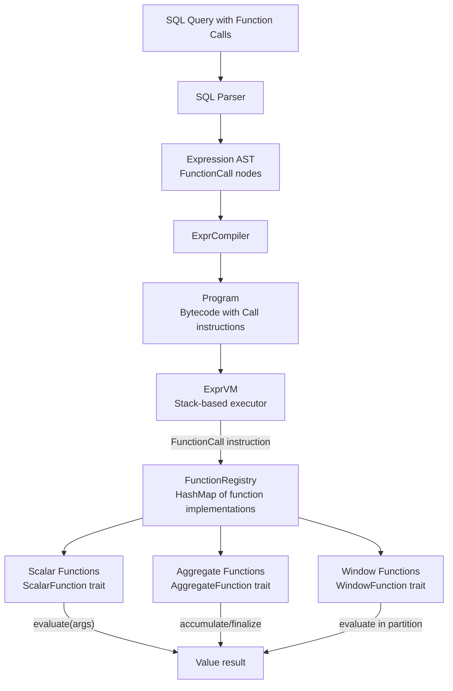
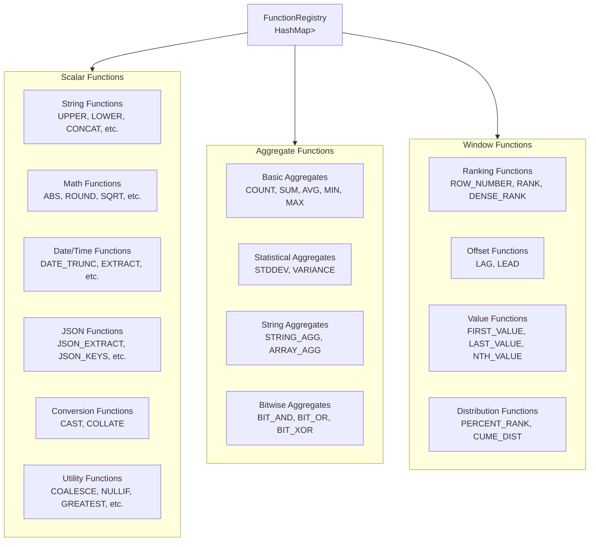
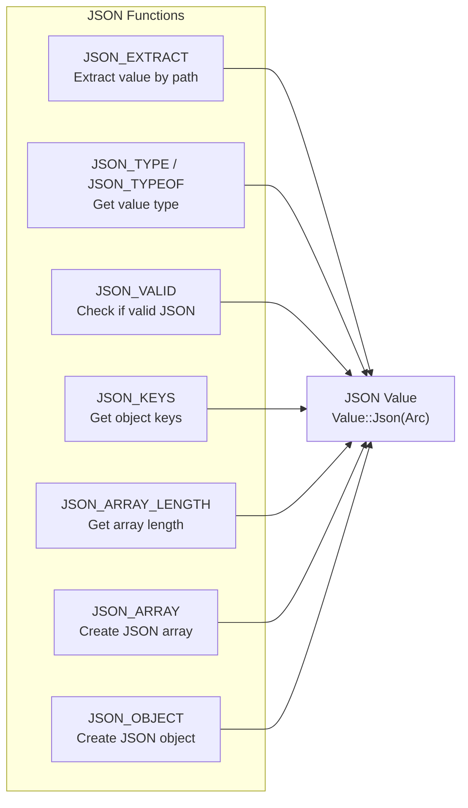
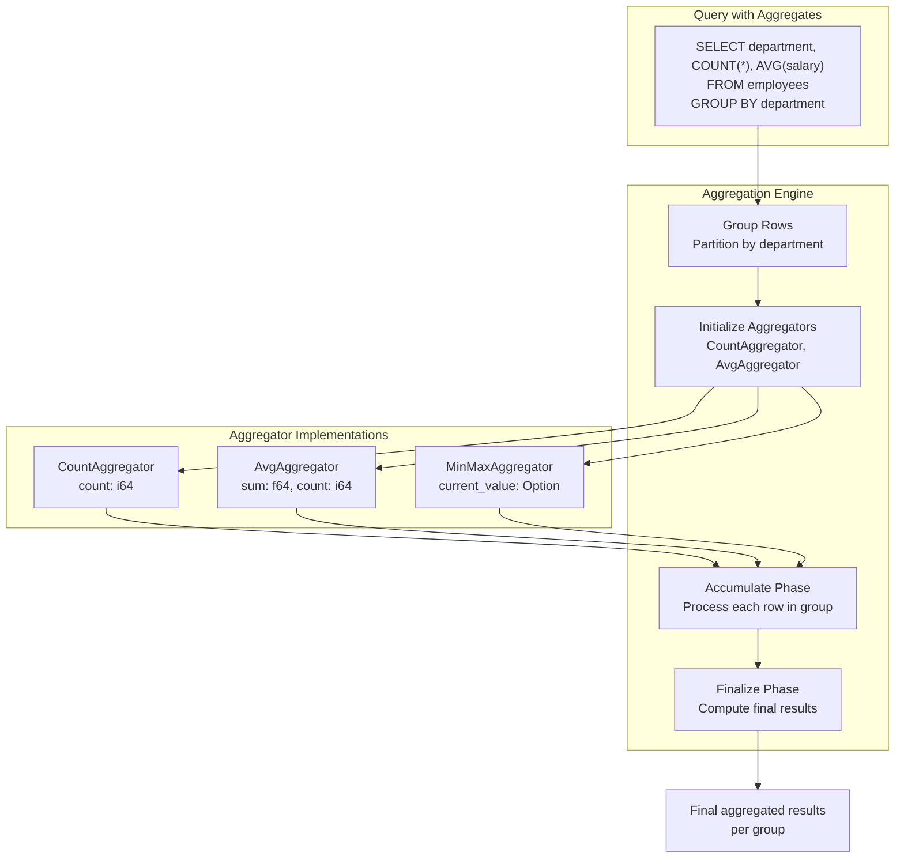
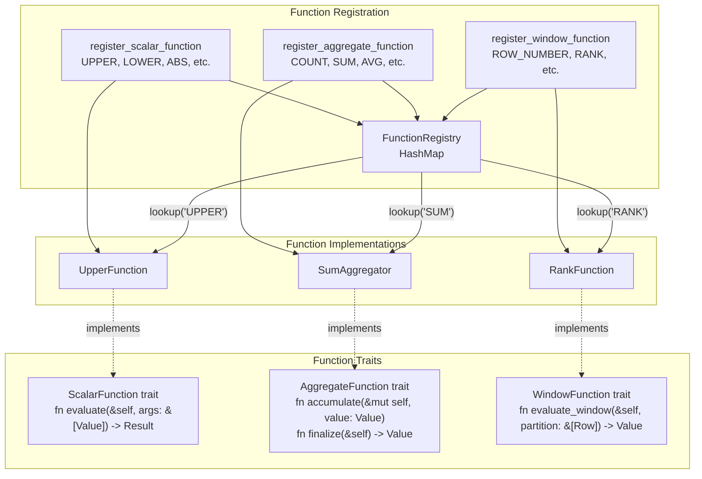

# Page: Built-in Functions

# Built-in Functions

<details>
<summary>Relevant source files</summary>

The following files were used as context for generating this wiki page:

- [.gitignore](.gitignore)
- [README.md](README.md)
- [../../../../roadmap.md](../../../../roadmap.md)
- [docs/_config.yml](docs/_config.yml)
- [src/functions/scalar/conversion.rs](src/functions/scalar/conversion.rs)
- [src/functions/scalar/datetime.rs](src/functions/scalar/datetime.rs)
- [src/functions/scalar/utility.rs](src/functions/scalar/utility.rs)

</details>


Oxibase provides 101+ built-in functions for data transformation, calculation, and analysis. Functions are organized into three main categories: **scalar functions** (operate on single values), **aggregate functions** (operate on groups of rows), and **window functions** (operate on partitioned sets with frames). All functions are invoked through the `FunctionRegistry` and evaluated by the Expression VM during query execution.

For information about how functions are compiled and executed, see [Expression Evaluation](#3.2). For details on aggregate function execution with GROUP BY, see [Aggregation and GROUP BY](#3.4). For window function execution with OVER clauses, see [Window Functions](#3.5).

## Function Architecture

### Function Invocation Flow



**Function Call Process:**
1. Parser generates `FunctionCall` AST nodes with function name and argument expressions
2. `ExprCompiler` compiles arguments to bytecode, then emits `Call` instruction
3. Expression VM executes `Call` instruction by looking up function in `FunctionRegistry`
4. Function implementation evaluates arguments and returns `Value`

**Sources:** [src/functions/scalar/utility.rs:1-1472](), [README.md:86-100]()

### Function Type Hierarchy



**Sources:** [README.md:324-346]()

## Scalar Functions

Scalar functions operate on individual values and return a single result per input row. They are evaluated by the Expression VM during expression evaluation.

### String Functions

String manipulation and transformation functions.

| Function | Description | Example | Result |
|----------|-------------|---------|--------|
| `UPPER(str)` | Convert to uppercase | `UPPER('hello')` | `'HELLO'` |
| `LOWER(str)` | Convert to lowercase | `LOWER('HELLO')` | `'hello'` |
| `LENGTH(str)` | String length | `LENGTH('hello')` | `5` |
| `TRIM(str)` | Remove leading/trailing whitespace | `TRIM('  hi  ')` | `'hi'` |
| `LTRIM(str)` | Remove leading whitespace | `LTRIM('  hi')` | `'hi'` |
| `RTRIM(str)` | Remove trailing whitespace | `RTRIM('hi  ')` | `'hi'` |
| `CONCAT(s1, s2, ...)` | Concatenate strings | `CONCAT('a', 'b')` | `'ab'` |
| `SUBSTRING(str, pos, len)` | Extract substring | `SUBSTRING('hello', 2, 3)` | `'ell'` |
| `REPLACE(str, from, to)` | Replace occurrences | `REPLACE('hello', 'l', 'x')` | `'hexxo'` |
| `REVERSE(str)` | Reverse string | `REVERSE('hello')` | `'olleh'` |
| `LEFT(str, n)` | First n characters | `LEFT('hello', 3)` | `'hel'` |
| `RIGHT(str, n)` | Last n characters | `RIGHT('hello', 3)` | `'llo'` |
| `LPAD(str, len, pad)` | Pad on left | `LPAD('hi', 5, '*')` | `'***hi'` |
| `RPAD(str, len, pad)` | Pad on right | `RPAD('hi', 5, '*')` | `'hi***'` |
| `REPEAT(str, n)` | Repeat string | `REPEAT('x', 3)` | `'xxx'` |
| `POSITION(sub, str)` | Find substring position | `POSITION('lo', 'hello')` | `4` |
| `LOCATE(sub, str)` | Alias for POSITION | `LOCATE('lo', 'hello')` | `4` |
| `INSTR(str, sub)` | Find substring (MySQL style) | `INSTR('hello', 'lo')` | `4` |
| `SPLIT_PART(str, delim, n)` | Split and get nth part | `SPLIT_PART('a-b-c', '-', 2)` | `'b'` |
| `INITCAP(str)` | Capitalize first letter | `INITCAP('hello world')` | `'Hello World'` |
| `ASCII(char)` | ASCII code of character | `ASCII('A')` | `65` |
| `CHR(code)` | Character from ASCII code | `CHR(65)` | `'A'` |
| `TRANSLATE(str, from, to)` | Character-by-character replacement | `TRANSLATE('abc', 'ab', 'xy')` | `'xyc'` |

**Sources:** [README.md:327]()

### Math Functions

Numerical computation functions.

| Function | Description | Example | Result |
|----------|-------------|---------|--------|
| `ABS(num)` | Absolute value | `ABS(-5)` | `5` |
| `CEIL(num)` | Round up to integer | `CEIL(3.2)` | `4` |
| `FLOOR(num)` | Round down to integer | `FLOOR(3.8)` | `3` |
| `ROUND(num, places)` | Round to n decimal places | `ROUND(3.567, 2)` | `3.57` |
| `TRUNC(num, places)` | Truncate to n decimal places | `TRUNC(3.567, 2)` | `3.56` |
| `SQRT(num)` | Square root | `SQRT(16)` | `4` |
| `POWER(base, exp)` | Exponentiation | `POWER(2, 3)` | `8` |
| `MOD(num, div)` | Modulo (remainder) | `MOD(10, 3)` | `1` |
| `SIGN(num)` | Sign of number (-1, 0, 1) | `SIGN(-5)` | `-1` |
| `EXP(num)` | e raised to power | `EXP(1)` | `2.718...` |
| `LN(num)` | Natural logarithm | `LN(2.718)` | `~1` |
| `LOG(num)` | Base-10 logarithm | `LOG(100)` | `2` |
| `LOG10(num)` | Base-10 logarithm | `LOG10(1000)` | `3` |
| `LOG2(num)` | Base-2 logarithm | `LOG2(8)` | `3` |
| `SIN(rad)` | Sine (radians) | `SIN(0)` | `0` |
| `COS(rad)` | Cosine (radians) | `COS(0)` | `1` |
| `TAN(rad)` | Tangent (radians) | `TAN(0)` | `0` |
| `ASIN(num)` | Arcsine | `ASIN(0)` | `0` |
| `ACOS(num)` | Arccosine | `ACOS(1)` | `0` |
| `ATAN(num)` | Arctangent | `ATAN(0)` | `0` |
| `ATAN2(y, x)` | Two-argument arctangent | `ATAN2(1, 1)` | `0.785...` |
| `DEGREES(rad)` | Convert radians to degrees | `DEGREES(3.14159)` | `180` |
| `RADIANS(deg)` | Convert degrees to radians | `RADIANS(180)` | `3.14159` |
| `PI()` | Pi constant | `PI()` | `3.14159...` |
| `RAND()` | Random float [0, 1) | `RAND()` | `0.457...` |
| `RANDOM()` | Alias for RAND | `RANDOM()` | `0.823...` |

**Sources:** [README.md:330]()

### Date/Time Functions

Temporal data manipulation functions.

#### Date Extraction Functions

```sql
-- Extract date/time components
SELECT 
    EXTRACT('year', '2024-03-15 10:30:45'),     -- 2024
    EXTRACT('month', '2024-03-15 10:30:45'),    -- 3
    EXTRACT('day', '2024-03-15 10:30:45'),      -- 15
    EXTRACT('hour', '2024-03-15 10:30:45'),     -- 10
    EXTRACT('minute', '2024-03-15 10:30:45'),   -- 30
    EXTRACT('second', '2024-03-15 10:30:45'),   -- 45
    EXTRACT('dow', '2024-03-15 10:30:45'),      -- Day of week (0=Sunday)
    EXTRACT('doy', '2024-03-15 10:30:45'),      -- Day of year
    EXTRACT('week', '2024-03-15 10:30:45'),     -- ISO week number
    EXTRACT('quarter', '2024-03-15 10:30:45');  -- Quarter (1-4)

-- Shorthand extraction functions
SELECT
    YEAR('2024-03-15'),      -- 2024
    MONTH('2024-03-15'),     -- 3
    DAY('2024-03-15'),       -- 15
    HOUR('2024-03-15 10:30:45'),    -- 10
    MINUTE('2024-03-15 10:30:45'),  -- 30
    SECOND('2024-03-15 10:30:45');  -- 45
```

**Implementation Details:**
- `EXTRACT` function supports multiple field types: year, month, day, hour, minute, second, millisecond, microsecond, dow (day of week), isodow, doy (day of year), week, quarter, epoch
- Shorthand functions (`YEAR`, `MONTH`, etc.) are convenience wrappers around `EXTRACT`
- All functions accept `TIMESTAMP` values or parseable string representations

**Sources:** [src/functions/scalar/datetime.rs:399-482](), [src/functions/scalar/datetime.rs:488-756]()

#### Date Truncation Functions

```sql
-- DATE_TRUNC: Truncate to specific unit
SELECT
    DATE_TRUNC('year', '2024-03-15 10:30:45'),    -- 2024-01-01 00:00:00
    DATE_TRUNC('month', '2024-03-15 10:30:45'),   -- 2024-03-01 00:00:00
    DATE_TRUNC('day', '2024-03-15 10:30:45'),     -- 2024-03-15 00:00:00
    DATE_TRUNC('hour', '2024-03-15 10:30:45'),    -- 2024-03-15 10:00:00
    DATE_TRUNC('minute', '2024-03-15 10:30:45'),  -- 2024-03-15 10:30:00
    DATE_TRUNC('quarter', '2024-03-15 10:30:45'); -- 2024-01-01 00:00:00 (Q1)

-- TIME_TRUNC: Truncate to duration interval
SELECT
    TIME_TRUNC('15m', '2024-03-15 10:37:45'),  -- 2024-03-15 10:30:00
    TIME_TRUNC('1h', '2024-03-15 10:37:45'),   -- 2024-03-15 10:00:00
    TIME_TRUNC('30s', '2024-03-15 10:37:45');  -- 2024-03-15 10:37:30
```

**Implementation Details:**
- `DATE_TRUNC` supports units: year, quarter, month, week, day, hour, minute, second
- `TIME_TRUNC` accepts duration strings with units: ns, us/µs, ms, s, m, h
- `TIME_TRUNC` performs nanosecond-precision arithmetic for exact truncation

**Sources:** [src/functions/scalar/datetime.rs:42-174](), [src/functions/scalar/datetime.rs:192-338]()

#### Date Arithmetic Functions

```sql
-- DATE_ADD: Add interval to timestamp
SELECT
    DATE_ADD('2024-01-15', 7),                     -- Add 7 days (default)
    DATE_ADD('2024-01-15', 1, 'month'),           -- Add 1 month
    DATE_ADD('2024-01-15', 2, 'year'),            -- Add 2 years
    DATE_ADD('2024-01-15 10:00:00', 30, 'minute'); -- Add 30 minutes

-- DATE_SUB: Subtract interval from timestamp
SELECT
    DATE_SUB('2024-01-15', 7),                     -- Subtract 7 days
    DATE_SUB('2024-01-15', 1, 'month');           -- Subtract 1 month

-- DATEDIFF: Difference between two dates in days
SELECT
    DATEDIFF('2024-12-31', '2024-01-01');  -- 365
```

**Implementation Details:**
- `DATE_ADD` and `DATE_SUB` support units: year(s), month(s), week(s), day(s), hour(s), minute(s), second(s)
- Month/year arithmetic handles variable-length months correctly (e.g., Jan 31 + 1 month = Feb 28/29)
- Overflow protection prevents invalid year values outside 1-9999 range
- `DATEDIFF` returns signed integer (positive if first date > second date)

**Sources:** [src/functions/scalar/datetime.rs:763-906](), [src/functions/scalar/datetime.rs:909-952](), [src/functions/scalar/datetime.rs:959-1019]()

#### Current Time Functions

```sql
-- Get current timestamp
SELECT NOW();                    -- 2024-03-15 10:30:45.123 UTC
SELECT CURRENT_TIMESTAMP;        -- Alias for NOW()

-- Get current date (midnight UTC)
SELECT CURRENT_DATE;             -- 2024-03-15 00:00:00 UTC
```

**Sources:** [src/functions/scalar/utility.rs:75-106](), [src/functions/scalar/datetime.rs:1063-1133]()

#### Date Formatting Function

```sql
-- TO_CHAR: Format timestamp or number as string
SELECT
    TO_CHAR('2024-03-15 14:30:45', 'YYYY-MM-DD'),           -- '2024-03-15'
    TO_CHAR('2024-03-15 14:30:45', 'DD MON YYYY'),          -- '15 MAR 2024'
    TO_CHAR('2024-03-15 14:30:45', 'HH24:MI:SS'),           -- '14:30:45'
    TO_CHAR('2024-03-15 14:30:45', 'Day, Month DD, YYYY'),  -- 'Friday, March 15, 2024'
    TO_CHAR('2024-03-15 14:30:45', 'YYYY-MM-DD HH12:MI:SS AM'); -- '2024-03-15 02:30:45 PM'
```

**Format Patterns:**
- **Year:** `YYYY` (4-digit), `YY` (2-digit)
- **Month:** `MM` (01-12), `MON` (JAN-DEC), `MONTH` (JANUARY-DECEMBER), `Mon`/`Month`/`mon`/`month` (case variants)
- **Day:** `DD` (01-31), `DAY` (MONDAY-SUNDAY), `DY` (MON-SUN), `Day`/`Dy`/`day`/`dy` (case variants)
- **Hour:** `HH24` (00-23), `HH12`/`HH` (01-12)
- **Minute:** `MI` (00-59)
- **Second:** `SS` (00-59)
- **Millisecond:** `MS` (000-999)
- **Meridiem:** `AM`/`PM`, `am`/`pm`, `A.M.`/`P.M.`
- **Timezone:** `TZ` (UTC), `tz` (utc)

**Number Formatting:**
- `9` = digit position
- `0` = digit position with leading zeros
- `.` = decimal point
- `,` = thousands separator

**Sources:** [src/functions/scalar/datetime.rs:1193-1260](), [src/functions/scalar/datetime.rs:1262-1432]()

### JSON Functions

JSON data extraction and manipulation functions.



#### JSON Extraction

```sql
-- JSON_EXTRACT: Extract value using path
SELECT JSON_EXTRACT('{"name": "Alice", "age": 30}', '$.name');  -- 'Alice'
SELECT JSON_EXTRACT('{"user": {"email": "a@b.com"}}', '$.user.email');  -- 'a@b.com'
SELECT JSON_EXTRACT('{"items": [1, 2, 3]}', '$.items[0]');  -- 1
SELECT JSON_EXTRACT('{"items": [1, 2, 3]}', '$.items[2]');  -- 3
```

**Path Syntax:**
- `$` = root element
- `.key` = object property access
- `[index]` = array element access (0-indexed)
- Paths can be chained: `$.user.addresses[0].city`

**Implementation Details:**
- Path parsing handles both `$.path` and `path` syntax (dollar prefix optional)
- Returns `NULL` if path not found or JSON invalid
- Automatically converts JSON types to Oxibase `Value` types (numbers, strings, booleans)
- Complex objects/arrays returned as JSON strings

**Sources:** [src/functions/scalar/utility.rs:361-430](), [src/functions/scalar/utility.rs:432-495]()

#### JSON Type and Validation

```sql
-- JSON_TYPE / JSON_TYPEOF: Get type of JSON value
SELECT JSON_TYPE('{"key": "value"}');  -- 'object'
SELECT JSON_TYPE('[1, 2, 3]');         -- 'array'
SELECT JSON_TYPE('"hello"');           -- 'string'
SELECT JSON_TYPE('123');               -- 'number'
SELECT JSON_TYPE('true');              -- 'boolean'
SELECT JSON_TYPE('null');              -- 'null'

-- JSON_VALID: Check if string is valid JSON
SELECT JSON_VALID('{"valid": true}');  -- 1 (true)
SELECT JSON_VALID('{invalid}');        -- 0 (false)
```

**Sources:** [src/functions/scalar/utility.rs:713-769](), [src/functions/scalar/utility.rs:776-801](), [src/functions/scalar/utility.rs:808-847]()

#### JSON Array and Object Functions

```sql
-- JSON_ARRAY_LENGTH: Get length of array
SELECT JSON_ARRAY_LENGTH('[1, 2, 3, 4]');  -- 4
SELECT JSON_ARRAY_LENGTH('{"items": [1, 2]}', '$.items');  -- 2

-- JSON_KEYS: Get keys of object
SELECT JSON_KEYS('{"a": 1, "b": 2, "c": 3}');  -- '["a", "b", "c"]'

-- JSON_ARRAY: Create JSON array from values
SELECT JSON_ARRAY(1, 2, 3);               -- '[1, 2, 3]'
SELECT JSON_ARRAY('a', 'b', 'c');         -- '["a", "b", "c"]'

-- JSON_OBJECT: Create JSON object from key-value pairs
SELECT JSON_OBJECT('name', 'Alice', 'age', 30);  -- '{"name": "Alice", "age": 30}'
```

**Implementation Details:**
- `JSON_ARRAY_LENGTH` accepts optional path parameter for nested arrays
- `JSON_ARRAY` is variadic, accepting 0-255 arguments
- `JSON_OBJECT` requires even number of arguments (key-value pairs)
- Keys in `JSON_OBJECT` must be non-NULL, converted to strings if not already strings

**Sources:** [src/functions/scalar/utility.rs:502-580](), [src/functions/scalar/utility.rs:854-914](), [src/functions/scalar/utility.rs:589-624](), [src/functions/scalar/utility.rs:632-688]()

### Conversion Functions

Type conversion and string collation functions.

#### CAST Function

```sql
-- CAST: Convert between data types
SELECT CAST(123 AS TEXT);                    -- '123'
SELECT CAST('456' AS INTEGER);               -- 456
SELECT CAST(3.7 AS INTEGER);                 -- 3
SELECT CAST(1 AS BOOLEAN);                   -- true
SELECT CAST('2024-01-15' AS TIMESTAMP);      -- 2024-01-15 00:00:00 UTC
SELECT CAST('{"key": "value"}' AS JSON);     -- {"key": "value"}

-- NULL handling
SELECT CAST(NULL AS INTEGER);                -- 0
SELECT CAST(NULL AS TEXT);                   -- ''
SELECT CAST(NULL AS BOOLEAN);                -- false
```

**Supported Target Types:**
- **INT / INTEGER**: Converts to 64-bit signed integer
- **FLOAT / REAL / DOUBLE**: Converts to 64-bit floating point
- **STRING / TEXT / VARCHAR / CHAR**: Converts to string
- **BOOLEAN / BOOL**: Converts to boolean
- **TIMESTAMP / DATETIME / DATE / TIME**: Converts to timestamp
- **JSON**: Converts to JSON string

**Conversion Rules:**
- Integer → Float: Direct conversion
- Float → Integer: Truncation (not rounding)
- String → Number: Parsing (returns 0 if invalid)
- Number → String: Formatted string representation
- Boolean → Number: true=1, false=0
- Number → Boolean: non-zero=true, zero=false
- String → Boolean: 'true', 'yes', '1' = true; others = false
- Timestamp → Integer: Unix timestamp (seconds since epoch)
- Integer → Timestamp: Interpreted as Unix timestamp

**Sources:** [src/functions/scalar/conversion.rs:38-102](), [src/functions/scalar/conversion.rs:104-238]()

#### COLLATE Function

```sql
-- COLLATE: Apply collation for sorting/comparison
SELECT COLLATE('Hello World', 'NOCASE');              -- 'hello world'
SELECT COLLATE('Café', 'NOACCENT');                   -- 'Cafe'
SELECT COLLATE('UPPERCASE', 'CASE_INSENSITIVE');      -- 'uppercase'
SELECT COLLATE('Élève', 'ACCENT_INSENSITIVE');        -- 'Eleve'
```

**Supported Collations:**
- **BINARY**: No transformation (default binary comparison)
- **NOCASE / CASE_INSENSITIVE**: Convert to lowercase for case-insensitive comparison
- **NOACCENT / ACCENT_INSENSITIVE**: Remove accents (é→e, ñ→n, etc.)
- **NUMERIC**: Numeric-aware string comparison (no transformation)

**Implementation Details:**
- Accent removal supports common Latin characters: À-Å, È-Ë, Ì-Ï, Ò-Ö, Ù-Ü, Ç, Ñ, Ÿ
- Also removes Unicode combining diacritical marks (U+0300 to U+036F)
- Returns NULL if input is NULL

**Sources:** [src/functions/scalar/conversion.rs:249-308](), [src/functions/scalar/conversion.rs:310-359]()

### Utility Functions

Miscellaneous utility functions for NULL handling, conditionals, and system information.

#### NULL Handling Functions

```sql
-- COALESCE: Return first non-NULL value
SELECT COALESCE(NULL, NULL, 42, 100);        -- 42
SELECT COALESCE(NULL, 'default');            -- 'default'
SELECT COALESCE(column, 0) FROM table;       -- Replace NULL with 0

-- NULLIF: Return NULL if two values are equal
SELECT NULLIF(10, 10);                       -- NULL
SELECT NULLIF(10, 20);                       -- 10
SELECT NULLIF(column, 0) FROM table;         -- NULL out zero values

-- IFNULL / NVL: Return second value if first is NULL
SELECT IFNULL(NULL, 'default');              -- 'default'
SELECT IFNULL('value', 'default');           -- 'value'
SELECT NVL(column, 'N/A') FROM table;        -- NVL is alias for IFNULL
```

**Implementation Details:**
- `COALESCE` is variadic, accepting 1-255 arguments
- Returns first non-NULL value in left-to-right order
- Returns NULL only if all arguments are NULL
- `IFNULL`/`NVL` are optimized two-argument forms

**Sources:** [src/functions/scalar/utility.rs:29-68](), [src/functions/scalar/utility.rs:113-150](), [src/functions/scalar/utility.rs:157-194]()

#### Comparison Functions

```sql
-- GREATEST: Return largest value
SELECT GREATEST(1, 5, 3, 2);                 -- 5
SELECT GREATEST('apple', 'banana', 'cherry'); -- 'cherry'
SELECT GREATEST(column1, column2, column3);   -- Max across columns

-- LEAST: Return smallest value
SELECT LEAST(5, 3, 8, 1);                    -- 1
SELECT LEAST('zebra', 'apple', 'mango');     -- 'apple'
SELECT LEAST(column1, column2, column3);      -- Min across columns
```

**Implementation Details:**
- Both functions are variadic (1-255 arguments)
- Use standard `Value` comparison (same as `<` and `>` operators)
- Return NULL if any argument is NULL (SQL standard behavior)

**Sources:** [src/functions/scalar/utility.rs:201-244](), [src/functions/scalar/utility.rs:251-294]()

#### Conditional Functions

```sql
-- IIF: Inline IF (condition ? true_value : false_value)
SELECT IIF(age >= 18, 'Adult', 'Minor');
SELECT IIF(score > 50, 'Pass', 'Fail');
SELECT IIF(1 = 1, 'yes', 'no');              -- 'yes'

-- CASE expression (built-in syntax, not a function)
SELECT CASE
    WHEN age < 18 THEN 'Minor'
    WHEN age < 65 THEN 'Adult'
    ELSE 'Senior'
END;
```

**IIF Truthiness:**
- `Boolean(true)` = true
- `Integer(non-zero)` = true
- `Float(non-zero)` = true
- `Text(non-empty and not 'false' or '0')` = true
- `NULL` = false
- All other values = false

**Sources:** [src/functions/scalar/utility.rs:301-354]()

#### System Information Functions

```sql
-- VERSION: Get database version
SELECT VERSION();                            -- 'oxibase 0.1.0'

-- TYPEOF: Get data type of value
SELECT TYPEOF(123);                          -- 'INTEGER'
SELECT TYPEOF(3.14);                         -- 'FLOAT'
SELECT TYPEOF('hello');                      -- 'TEXT'
SELECT TYPEOF(true);                         -- 'BOOLEAN'
SELECT TYPEOF(NOW());                        -- 'TIMESTAMP'
SELECT TYPEOF('{"key": "value"}');           -- 'JSON'
SELECT TYPEOF(NULL);                         -- 'NULL'

-- SLEEP: Pause execution (testing/debugging)
SELECT SLEEP(2);                             -- Sleep 2 seconds, returns 0
SELECT SLEEP(0.5);                           -- Sleep 0.5 seconds
```

**Implementation Details:**
- `VERSION` returns version string from `crate::common::version::version_info()`
- `TYPEOF` returns SQL type name as uppercase string
- `SLEEP` accepts fractional seconds, limited to max 300 seconds (5 minutes)

**Sources:** [src/functions/scalar/datetime.rs:347-381](), [src/functions/scalar/utility.rs:976-1012](), [src/functions/scalar/utility.rs:922-969]()

## Aggregate Functions

Aggregate functions operate on groups of rows and return a single result per group. They are used with `GROUP BY` clauses or on entire result sets.

### Basic Aggregate Functions

| Function | Description | Example |
|----------|-------------|---------|
| `COUNT(*)` | Count all rows | `SELECT COUNT(*) FROM orders` |
| `COUNT(column)` | Count non-NULL values | `SELECT COUNT(email) FROM users` |
| `COUNT(DISTINCT column)` | Count distinct values | `SELECT COUNT(DISTINCT country) FROM users` |
| `SUM(column)` | Sum of values | `SELECT SUM(amount) FROM orders` |
| `AVG(column)` | Average of values | `SELECT AVG(price) FROM products` |
| `MIN(column)` | Minimum value | `SELECT MIN(created_at) FROM events` |
| `MAX(column)` | Maximum value | `SELECT MAX(salary) FROM employees` |

**Usage with GROUP BY:**

```sql
SELECT 
    department,
    COUNT(*) as employee_count,
    AVG(salary) as avg_salary,
    MIN(hire_date) as first_hire,
    MAX(hire_date) as last_hire
FROM employees
GROUP BY department;
```

**Sources:** [README.md:339]()

### Statistical Aggregate Functions

| Function | Description |
|----------|-------------|
| `STDDEV(column)` | Population standard deviation (alias for STDDEV_POP) |
| `STDDEV_POP(column)` | Population standard deviation |
| `STDDEV_SAMP(column)` | Sample standard deviation |
| `VARIANCE(column)` | Population variance (alias for VAR_POP) |
| `VAR_POP(column)` | Population variance |
| `VAR_SAMP(column)` | Sample variance |

```sql
SELECT
    department,
    AVG(salary) as mean_salary,
    STDDEV_SAMP(salary) as salary_std_dev,
    VARIANCE(salary) as salary_variance
FROM employees
GROUP BY department;
```

**Sources:** [README.md:339]()

### String and Array Aggregate Functions

| Function | Description | Example |
|----------|-------------|---------|
| `STRING_AGG(column, delimiter)` | Concatenate strings with delimiter | `STRING_AGG(name, ', ')` |
| `ARRAY_AGG(column)` | Collect values into array | `ARRAY_AGG(product_id)` |

```sql
-- Concatenate employee names by department
SELECT 
    department,
    STRING_AGG(name, ', ' ORDER BY hire_date) as employees
FROM employees
GROUP BY department;

-- Collect all order IDs for each customer
SELECT
    customer_id,
    ARRAY_AGG(order_id ORDER BY order_date DESC) as order_history
FROM orders
GROUP BY customer_id;
```

**Sources:** [README.md:339]()

### Bitwise Aggregate Functions

| Function | Description |
|----------|-------------|
| `BIT_AND(column)` | Bitwise AND of all values |
| `BIT_OR(column)` | Bitwise OR of all values |
| `BIT_XOR(column)` | Bitwise XOR of all values |

```sql
-- Calculate combined permissions (bitwise OR)
SELECT user_group, BIT_OR(permissions) as combined_permissions
FROM user_permissions
GROUP BY user_group;
```

**Sources:** [README.md:339]()

### Boolean Aggregate Functions

| Function | Description |
|----------|-------------|
| `BOOL_AND(column)` | Returns true if all values are true |
| `BOOL_OR(column)` | Returns true if any value is true |

```sql
-- Check if all orders in a batch are complete
SELECT 
    batch_id,
    BOOL_AND(is_complete) as all_complete,
    BOOL_OR(has_errors) as any_errors
FROM orders
GROUP BY batch_id;
```

**Sources:** [README.md:339]()

### Ordered-Set Aggregate Functions

| Function | Description |
|----------|-------------|
| `FIRST(column)` | First value in group (respects ORDER BY) |
| `LAST(column)` | Last value in group (respects ORDER BY) |

```sql
-- Get first and last price for each product
SELECT
    product_id,
    FIRST(price ORDER BY date) as initial_price,
    LAST(price ORDER BY date) as current_price
FROM price_history
GROUP BY product_id;
```

**Sources:** [README.md:339]()

### Aggregate Function Execution



**Aggregation Process:**
1. **Grouping**: Rows partitioned by `GROUP BY` columns into groups
2. **Initialization**: Aggregator objects created for each aggregate function
3. **Accumulation**: For each row in group, call aggregator's `accumulate(value)` method
4. **Finalization**: Call aggregator's `finalize()` to compute final result

**Fast Paths:**
- `COUNT(*)` uses optimized counter without value inspection
- `SUM` and `AVG` use specialized numeric accumulators
- Parallel aggregation for multiple groups processed concurrently

**Sources:** [README.md:260-276]()

## Window Functions

Window functions perform calculations across a set of rows related to the current row, without collapsing rows like aggregate functions. They are used with the `OVER` clause to define windows (partitions and frames).

For detailed information on window function execution, partitioning, and frame specifications, see [Window Functions](#3.5).

### Ranking Functions

Assign ranks to rows within partitions.

| Function | Description | Behavior on Ties |
|----------|-------------|------------------|
| `ROW_NUMBER()` | Sequential row number | No gaps (1, 2, 3, 4) |
| `RANK()` | Rank with gaps on ties | Gaps (1, 2, 2, 4) |
| `DENSE_RANK()` | Rank without gaps | No gaps (1, 2, 2, 3) |
| `NTILE(n)` | Divide rows into n buckets | Distributes evenly |

```sql
-- Rank employees by salary within each department
SELECT
    employee_name,
    department,
    salary,
    ROW_NUMBER() OVER (PARTITION BY department ORDER BY salary DESC) as row_num,
    RANK() OVER (PARTITION BY department ORDER BY salary DESC) as rank,
    DENSE_RANK() OVER (PARTITION BY department ORDER BY salary DESC) as dense_rank,
    NTILE(4) OVER (PARTITION BY department ORDER BY salary DESC) as quartile
FROM employees;
```

**Sources:** [README.md:342]()

### Offset Functions

Access values from other rows relative to the current row.

| Function | Description | Default |
|----------|-------------|---------|
| `LAG(column, offset, default)` | Value from previous row | offset=1, default=NULL |
| `LEAD(column, offset, default)` | Value from next row | offset=1, default=NULL |

```sql
-- Calculate salary changes and compare with next hire
SELECT
    employee_name,
    hire_date,
    salary,
    LAG(salary) OVER (ORDER BY hire_date) as previous_salary,
    salary - LAG(salary) OVER (ORDER BY hire_date) as salary_change,
    LEAD(employee_name) OVER (ORDER BY hire_date) as next_hire
FROM employees
ORDER BY hire_date;
```

**Sources:** [README.md:342]()

### Value Functions

Access specific values within window frames.

| Function | Description |
|----------|-------------|
| `FIRST_VALUE(column)` | First value in frame |
| `LAST_VALUE(column)` | Last value in frame |
| `NTH_VALUE(column, n)` | Nth value in frame (1-indexed) |

```sql
-- Compare each price to first and last price in date range
SELECT
    date,
    product_id,
    price,
    FIRST_VALUE(price) OVER (PARTITION BY product_id ORDER BY date) as initial_price,
    LAST_VALUE(price) OVER (
        PARTITION BY product_id 
        ORDER BY date 
        ROWS BETWEEN UNBOUNDED PRECEDING AND UNBOUNDED FOLLOWING
    ) as final_price,
    NTH_VALUE(price, 2) OVER (PARTITION BY product_id ORDER BY date) as second_price
FROM price_history;
```

**Frame Specification Required:**
- `FIRST_VALUE` works with default frame
- `LAST_VALUE` typically needs explicit frame to include all following rows
- Default frame: `RANGE BETWEEN UNBOUNDED PRECEDING AND CURRENT ROW`

**Sources:** [README.md:342]()

### Distribution Functions

Calculate statistical distributions within partitions.

| Function | Description | Return Type |
|----------|-------------|-------------|
| `PERCENT_RANK()` | Relative rank (0.0 to 1.0) | Float |
| `CUME_DIST()` | Cumulative distribution (0.0 to 1.0) | Float |

```sql
-- Calculate percentile ranks for test scores
SELECT
    student_name,
    test_score,
    PERCENT_RANK() OVER (ORDER BY test_score) as percentile_rank,
    CUME_DIST() OVER (ORDER BY test_score) as cumulative_dist,
    ROUND(PERCENT_RANK() OVER (ORDER BY test_score) * 100, 2) as percentile
FROM test_results
ORDER BY test_score DESC;
```

**Calculation:**
- `PERCENT_RANK()` = (rank - 1) / (total_rows - 1)
- `CUME_DIST()` = (rows_up_to_and_including_current) / total_rows

**Sources:** [README.md:342]()

### Window Function Syntax

```sql
function_name([args]) OVER (
    [PARTITION BY column1, column2, ...]
    [ORDER BY column1 [ASC|DESC], column2 [ASC|DESC], ...]
    [frame_clause]
)
```

**Window Clauses:**
- **PARTITION BY**: Divides rows into partitions (like GROUP BY but doesn't collapse rows)
- **ORDER BY**: Defines ordering within partitions
- **Frame Clause**: Defines subset of partition for function to operate on

**Frame Types:**
- `ROWS`: Physical row-based frame
- `RANGE`: Logical value-based frame

**Frame Boundaries:**
- `UNBOUNDED PRECEDING`: Start of partition
- `n PRECEDING`: n rows/values before current
- `CURRENT ROW`: Current row
- `n FOLLOWING`: n rows/values after current
- `UNBOUNDED FOLLOWING`: End of partition

**Example with Frame:**

```sql
-- Running sum with 2-row moving average
SELECT
    date,
    sales,
    SUM(sales) OVER (
        ORDER BY date 
        ROWS BETWEEN UNBOUNDED PRECEDING AND CURRENT ROW
    ) as running_total,
    AVG(sales) OVER (
        ORDER BY date 
        ROWS BETWEEN 1 PRECEDING AND 1 FOLLOWING
    ) as moving_avg_3day
FROM daily_sales;
```

**Sources:** [README.md:219-232]()

## Function Registration and Lookup

### Function Registry Architecture



**Function Lookup Process:**
1. Function name parsed from SQL (case-insensitive)
2. Name normalized to uppercase for lookup
3. `FunctionRegistry` queried with normalized name
4. Appropriate function implementation returned
5. Function evaluated with provided arguments

**Case Insensitivity:**
- Function names are case-insensitive in SQL
- `UPPER('x')`, `upper('x')`, and `Upper('x')` all resolve to same function
- Registry stores all function names in uppercase

**Sources:** [README.md:93-96]()

## Common Patterns and Examples

### Multi-Function Queries

```sql
-- Combining multiple function types
SELECT
    UPPER(name) as name_upper,
    YEAR(hire_date) as hire_year,
    COALESCE(email, 'no-email') as email_or_default,
    CAST(salary AS TEXT) as salary_str,
    JSON_EXTRACT(metadata, '$.department') as dept
FROM employees
WHERE LENGTH(name) > 5
    AND hire_date >= DATE_SUB(CURRENT_DATE, 365, 'day')
ORDER BY LOWER(name);
```

### Nested Function Calls

```sql
-- Functions can be nested
SELECT
    UPPER(TRIM(name)) as clean_name,
    ROUND(AVG(CAST(score AS FLOAT)), 2) as avg_score,
    COALESCE(NULLIF(email, ''), 'unknown@example.com') as valid_email
FROM students
GROUP BY UPPER(TRIM(name));
```

### Window Functions with Aggregates

```sql
-- Combine window functions with aggregates
SELECT
    department,
    employee_name,
    salary,
    AVG(salary) OVER (PARTITION BY department) as dept_avg_salary,
    salary - AVG(salary) OVER (PARTITION BY department) as diff_from_avg,
    RANK() OVER (PARTITION BY department ORDER BY salary DESC) as dept_rank,
    ROUND(PERCENT_RANK() OVER (ORDER BY salary DESC) * 100, 2) as overall_percentile
FROM employees;
```

### Time-Series Analysis with Date Functions

```sql
-- Date-based analytics with multiple functions
SELECT
    DATE_TRUNC('month', order_date) as month,
    COUNT(*) as order_count,
    SUM(amount) as monthly_revenue,
    AVG(amount) as avg_order_value,
    LAG(SUM(amount)) OVER (ORDER BY DATE_TRUNC('month', order_date)) as prev_month_revenue,
    SUM(amount) - LAG(SUM(amount)) OVER (ORDER BY DATE_TRUNC('month', order_date)) as revenue_change
FROM orders
WHERE order_date >= DATE_SUB(CURRENT_DATE, 365, 'day')
GROUP BY DATE_TRUNC('month', order_date)
ORDER BY month;
```

### JSON Data Processing

```sql
-- Extract and aggregate JSON data
SELECT
    JSON_EXTRACT(event_data, '$.user_id') as user_id,
    JSON_EXTRACT(event_data, '$.event_type') as event_type,
    COUNT(*) as event_count,
    MIN(timestamp) as first_event,
    MAX(timestamp) as last_event,
    JSON_ARRAY_LENGTH(JSON_EXTRACT(event_data, '$.tags')) as tag_count
FROM events
WHERE JSON_TYPE(event_data) = 'object'
    AND JSON_VALID(event_data) = 1
GROUP BY 
    JSON_EXTRACT(event_data, '$.user_id'),
    JSON_EXTRACT(event_data, '$.event_type');
```

**Sources:** [README.md:130-146](), [README.md:219-346]()