# Page: Common Table Expressions (CTEs)

# Common Table Expressions (CTEs)

<details>
<summary>Relevant source files</summary>

The following files were used as context for generating this wiki page:

- [src/executor/cte.rs](src/executor/cte.rs)
- [src/executor/query.rs](src/executor/query.rs)

</details>


## Purpose and Scope

This page describes the Common Table Expression (CTE) execution system in OxiBase, which implements SQL `WITH` clauses. CTEs provide a way to define temporary named result sets that can be referenced within the scope of a query.

This page covers:
- Basic and chained CTE execution
- Recursive CTE processing with iteration limits
- CTE registry architecture for result materialization
- CTE inlining optimization to preserve index access
- Semi-join reduction for CTE-table JOINs

For information about subquery execution more broadly, see [Subquery Execution](#3.3). For JOIN execution details, see [Query Execution Pipeline](#3.1).

**Sources:** [src/executor/cte.rs:1-30]()

## Architecture Overview

The CTE execution system consists of three main components: the registry for storing materialized results, the execution engine that processes WITH clauses, and optimization layers that improve performance.

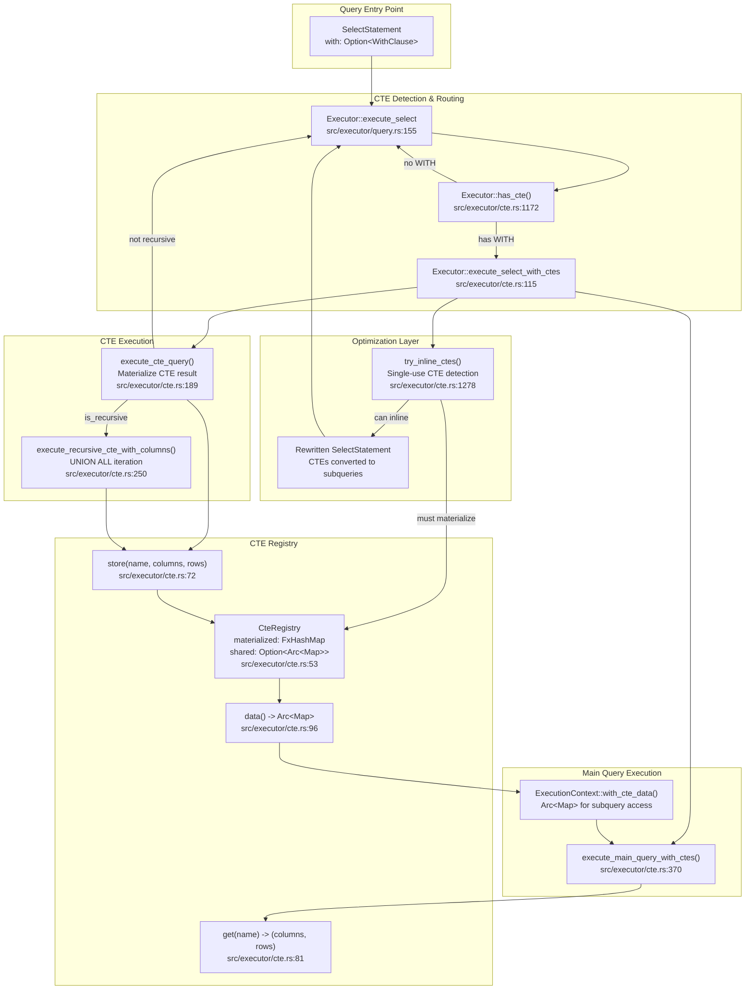

**Diagram: CTE Execution Architecture**

The system follows a check-optimize-materialize-execute pattern. When a `SELECT` statement with a `WITH` clause is detected, it first attempts CTE inlining (converting single-use CTEs to subqueries). If inlining is not possible, CTEs are materialized in order, stored in the registry, and the main query executes with CTE data available in the execution context.

**Sources:** [src/executor/cte.rs:53-111](), [src/executor/cte.rs:115-186](), [src/executor/query.rs:190-193]()

## CTE Registry

The `CteRegistry` stores materialized CTE results during query execution. It uses a lazy `Arc` caching strategy to enable efficient sharing with nested execution contexts.

### Registry Structure

| Component | Type | Purpose |
|-----------|------|---------|
| `materialized` | `FxHashMap<String, (Vec<String>, Vec<Row>)>` | Stores CTE name → (columns, rows) mappings |
| `shared` | `Option<Arc<CteDataMap>>` | Cached Arc for cheap cloning to execution contexts |

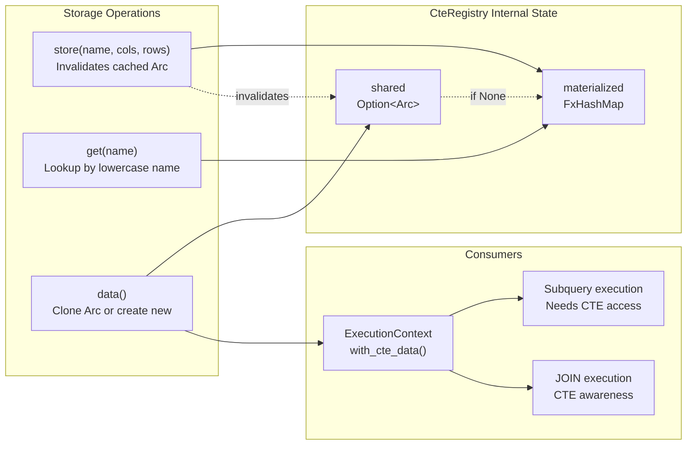

**Diagram: CTE Registry Data Flow**

The registry maintains a cache of the Arc-wrapped data map. When `store()` is called, the cached Arc is invalidated. The first call to `data()` creates a new Arc, which is then reused for subsequent calls until the registry is modified again. This avoids repeated cloning of the entire CTE data map when creating nested execution contexts.

**Sources:** [src/executor/cte.rs:53-111]()

### Registry API

```
CteRegistry::new() -> Self
```
Creates an empty registry.

```
store(&mut self, name: &str, columns: Vec<String>, rows: Vec<Row>)
```
Stores a materialized CTE result. The name is converted to lowercase for case-insensitive lookup. Invalidates the cached Arc.

```
get(&self, name: &str) -> Option<(&Vec<String>, &Vec<Row>)>
```
Retrieves CTE results by name (case-insensitive).

```
data(&mut self) -> Arc<CteDataMap>
```
Returns an Arc-wrapped reference to the internal map. Creates and caches the Arc on first call after modification.

**Sources:** [src/executor/cte.rs:64-105]()

## CTE Execution Flow

CTEs are executed in dependency order, with results materialized before the main query runs. The system supports both simple and chained CTEs (where one CTE references another).

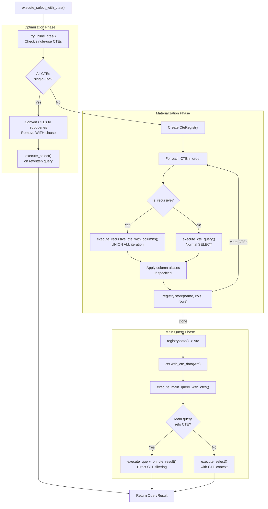

**Diagram: CTE Execution Flow**

The execution flow has three phases:
1. **Optimization**: Attempts to inline single-use CTEs as subqueries
2. **Materialization**: Executes each CTE in order, storing results in the registry
3. **Main Query**: Executes the main query with CTE data available in the context

**Sources:** [src/executor/cte.rs:115-186](), [src/executor/cte.rs:370-437]()

### CTE Query Execution

When executing a CTE query, the system handles several cases:

1. **Simple CTE**: Standard SELECT query materialized once
2. **CTE referencing another CTE**: Uses registry lookup to access previously materialized CTEs
3. **CTE with JOIN**: Special handling when joining CTEs together
4. **Recursive CTE**: Iterative execution with UNION ALL (see next section)

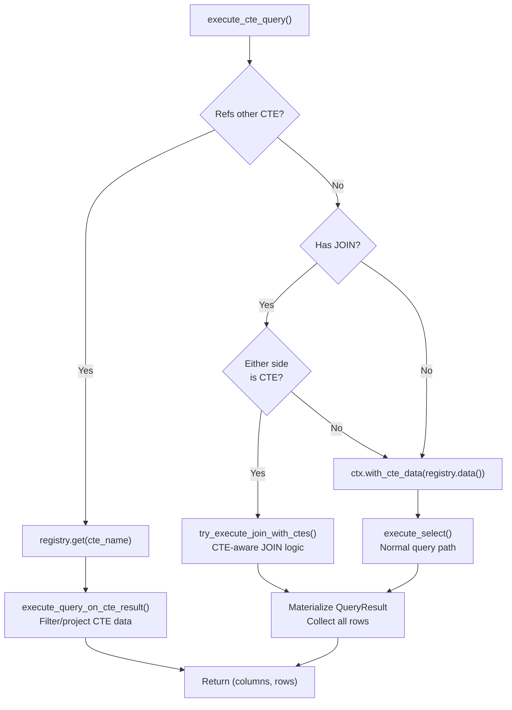

**Diagram: CTE Query Execution Logic**

The system optimizes CTE-to-CTE queries by directly operating on materialized data rather than re-scanning tables. For JOINs involving CTEs, specialized logic handles semi-join reduction (see later section).

**Sources:** [src/executor/cte.rs:189-247]()

## Recursive CTEs

Recursive CTEs use iterative execution with `UNION ALL` to compute results that depend on previous iterations. The system enforces a maximum iteration limit to prevent infinite loops.

### Recursive CTE Structure

A recursive CTE must have the form:
```
WITH RECURSIVE cte_name AS (
  <anchor_member>      -- Initial query
  UNION ALL
  <recursive_member>   -- References cte_name
)
```

The anchor member runs once to produce the initial working set. The recursive member runs iteratively, each time referencing the results from the previous iteration, until no new rows are produced or the maximum iteration limit is reached.

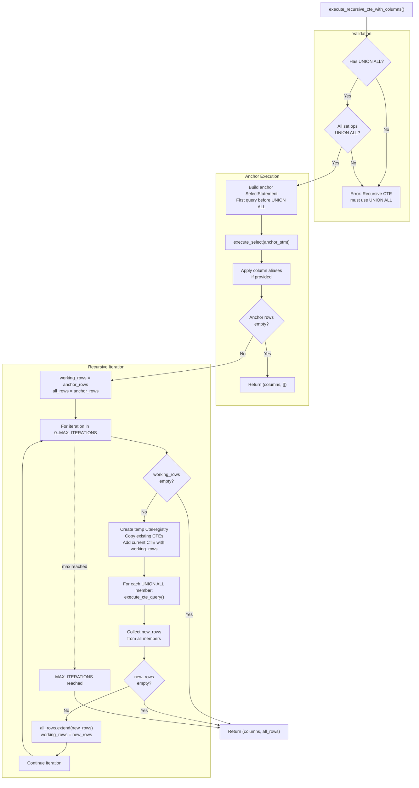

**Diagram: Recursive CTE Execution Flow**

The execution follows these steps:
1. Validate that all set operations are `UNION ALL` (non-recursive `UNION` is not supported)
2. Execute the anchor member to get initial rows
3. Iterate: Add current working set to temporary registry, execute recursive members, collect new rows
4. Stop when no new rows are produced or `MAX_ITERATIONS` (10,000) is reached

**Sources:** [src/executor/cte.rs:250-367]()

### Iteration Control

| Constant | Value | Purpose |
|----------|-------|---------|
| `MAX_ITERATIONS` | 10,000 | Prevents infinite loops in recursive CTEs |

The system tracks three row sets during iteration:
- `all_rows`: Accumulated results from all iterations (returned at the end)
- `working_rows`: Results from the previous iteration (used as input to current iteration)
- `new_rows`: Results from the current iteration (becomes next `working_rows`)

**Sources:** [src/executor/cte.rs:261-366]()

## CTE Inlining Optimization

Single-use, non-recursive CTEs are converted to subqueries to preserve index access and enable optimizations like LIMIT pushdown. This is similar to PostgreSQL 12+ behavior where CTEs are no longer optimization barriers by default.

### Inlining Eligibility

A CTE can be inlined if ALL of the following conditions are met:

| Condition | Reason |
|-----------|--------|
| Not recursive | Recursive CTEs must be materialized for iteration |
| No column aliases | Column renaming requires materialization |
| Doesn't reference other CTEs | CTE chaining creates data dependencies |
| Used exactly once in FROM/JOIN | Multi-use benefits from materialization |
| Not used in WHERE clause | WHERE subqueries have different execution paths |

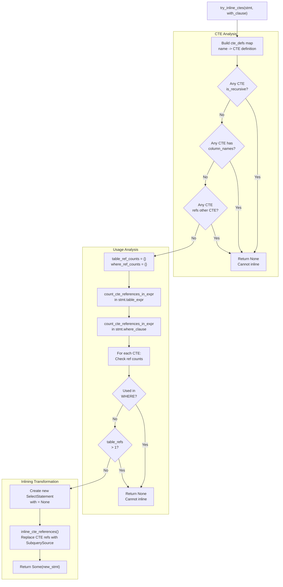

**Diagram: CTE Inlining Decision Logic**

The inlining optimization performs a two-phase analysis:
1. **CTE Properties**: Check for recursive CTEs, column aliases, and cross-CTE dependencies
2. **Usage Patterns**: Count references in FROM/JOIN vs WHERE clauses

If all CTEs pass the eligibility checks, they are converted to `SubquerySource` expressions and the `WITH` clause is removed.

**Sources:** [src/executor/cte.rs:1278-1364]()

### Inlining Transformation

The `inline_cte_references()` function recursively walks the query AST, replacing CTE references with subquery sources:

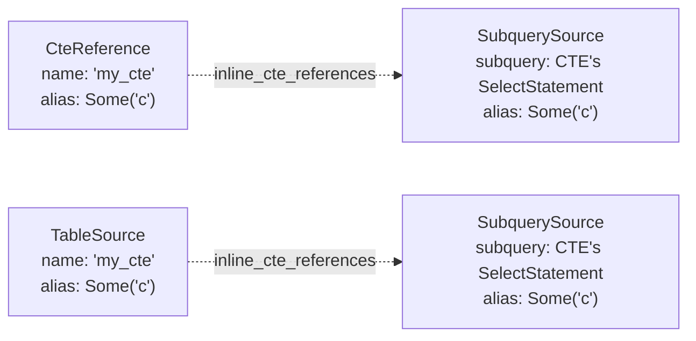

**Diagram: CTE Reference Transformation**

The transformation preserves aliases to maintain correct column resolution in the rest of the query. After inlining, the query executes through the normal subquery path, which can leverage indexes and other optimizations.

**Sources:** [src/executor/cte.rs:1493-1557]()

### Performance Impact

| Scenario | Without Inlining | With Inlining |
|----------|------------------|---------------|
| CTE with index on filtered column | Full table scan (indexes lost in materialization) | Index scan (subquery preserves indexes) |
| CTE with LIMIT in main query | Materialize all CTE rows, then LIMIT | LIMIT pushed through subquery |
| Single-use CTE | Allocate storage for materialized data | Zero additional memory allocation |

**Sources:** [src/executor/cte.rs:126-134]()

## Semi-Join Reduction for CTE JOINs

When joining a CTE with a regular table on an indexed column, the system extracts join keys from the CTE to filter the table scan via an `IN` clause. This avoids materializing the entire table and leverages indexes.

### Semi-Join Applicability

Semi-join reduction is applied when:
1. One side is a CTE, the other is a regular table
2. The join is an `INNER JOIN`
3. The CTE has ≤ 500 rows (configurable threshold)
4. The join condition is an equality on a single column

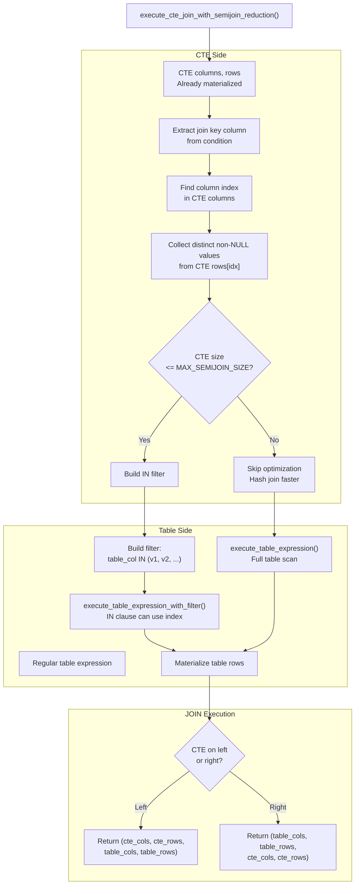

**Diagram: Semi-Join Reduction Flow**

The optimization transforms:
```
SELECT * FROM cte JOIN table ON cte.id = table.cte_id
```
into:
```
SELECT * FROM cte JOIN table WHERE table.cte_id IN (values from cte.id)
```

This allows the table scan to use an index on `cte_id` (if one exists) instead of scanning all rows.

**Sources:** [src/executor/cte.rs:721-817]()

### Join Key Extraction

The system uses qualifier-aware key extraction to correctly identify which column belongs to which side of the join:

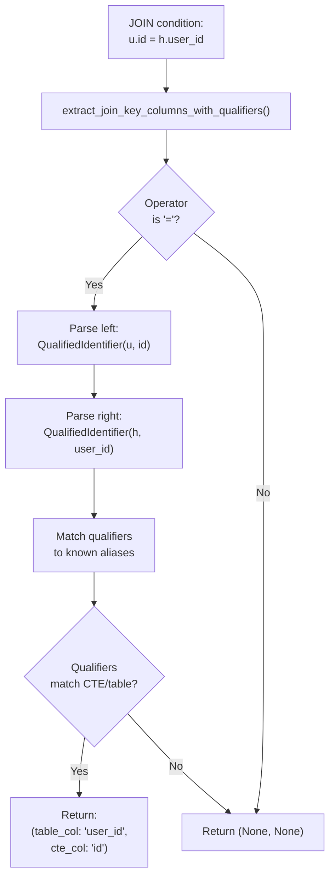

**Diagram: Qualifier-Aware Key Extraction**

The function `extract_join_key_columns_with_qualifiers()` correctly handles both `cte.col = table.col` and `table.col = cte.col` by using the qualifiers (table aliases) to determine which column belongs to which side.

**Sources:** [src/executor/cte.rs:822-871]()

### Performance Characteristics

| CTE Size | Regular Table Size | Index on Join Column | Strategy | Complexity |
|----------|-------------------|---------------------|----------|------------|
| ≤ 500 rows | Any | Yes | Semi-join with index | O(cte_size + log(table_size)) |
| ≤ 500 rows | Any | No | Semi-join with scan | O(cte_size + table_size) |
| > 500 rows | Any | Any | Hash join | O(cte_size + table_size) |

The 500-row threshold (`MAX_SEMIJOIN_SIZE`) balances the cost of:
- Building the IN filter from CTE values
- Potential index lookups vs full table hash join

For small CTEs, the IN filter is cheap to build and can leverage indexes. For large CTEs, hash join on the full table is faster.

**Sources:** [src/executor/cte.rs:746-761]()

## Integration with Query Execution

CTEs integrate with the broader query execution system through the `ExecutionContext`, which carries CTE data to nested queries and subqueries.

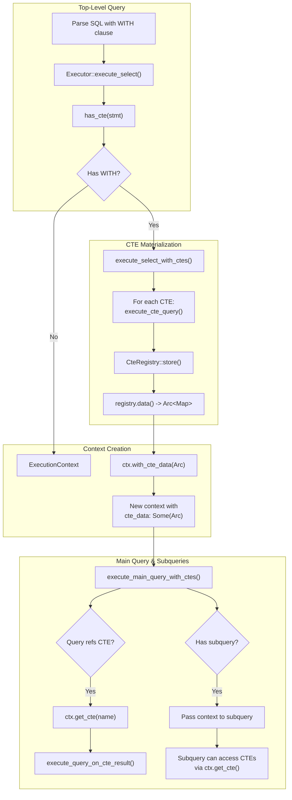

**Diagram: CTE Integration with Execution Context**

The `ExecutionContext` carries CTE data through multiple execution layers:
1. CTEs are materialized and stored in the registry
2. The registry data is wrapped in an `Arc` for cheap sharing
3. The Arc is attached to the execution context via `with_cte_data()`
4. Subqueries and nested queries receive the context and can access CTEs via `get_cte()`

This design allows CTEs to be referenced from:
- The main query's FROM clause
- JOIN expressions
- Subqueries in WHERE/SELECT/HAVING clauses
- Nested CTEs (CTEs referencing other CTEs)

**Sources:** [src/executor/cte.rs:370-437](), [src/executor/query.rs:754-763]()

### Context CTE Access

The `ExecutionContext` provides the `get_cte()` method for looking up CTE data:

```
impl ExecutionContext {
    pub fn get_cte(&self, name: &str) -> Option<(&Vec<String>, &Vec<Row>)>
}
```

This method:
1. Checks if `cte_data` is present in the context
2. Performs a case-insensitive lookup by converting `name` to lowercase
3. Returns references to the CTE's columns and rows (avoiding clones)

**Sources:** [src/executor/context.rs]() (referenced in cte.rs), [src/executor/query.rs:754-763]()

### CTE Query Execution Path

When the main query references a CTE as a table source:

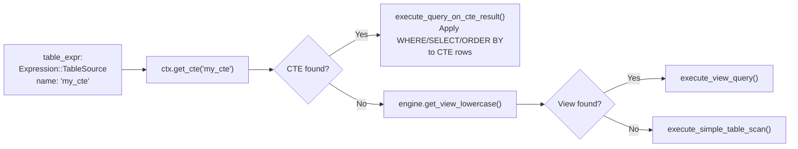

**Diagram: Table Resolution Order**

The executor checks table sources in this priority order:
1. CTE from execution context (if available)
2. View from storage engine
3. Regular table

This allows CTEs to shadow views and tables with the same name, following SQL standard scoping rules.

**Sources:** [src/executor/query.rs:754-770]()