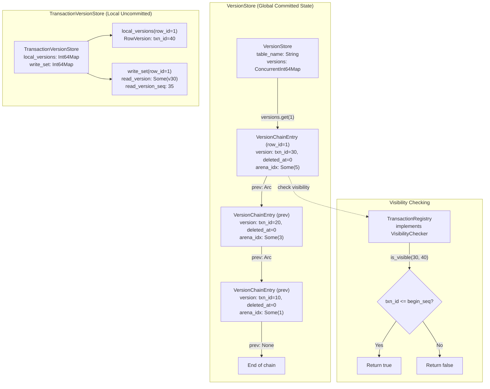
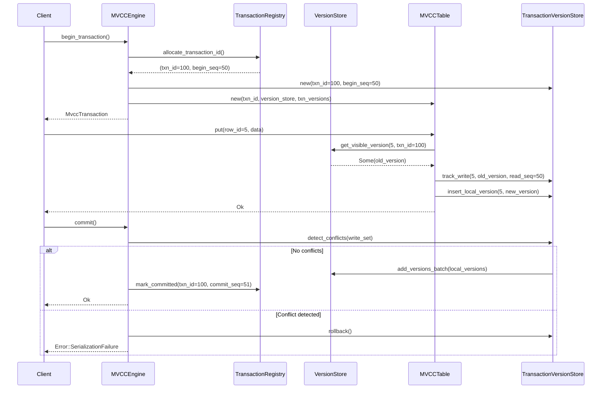
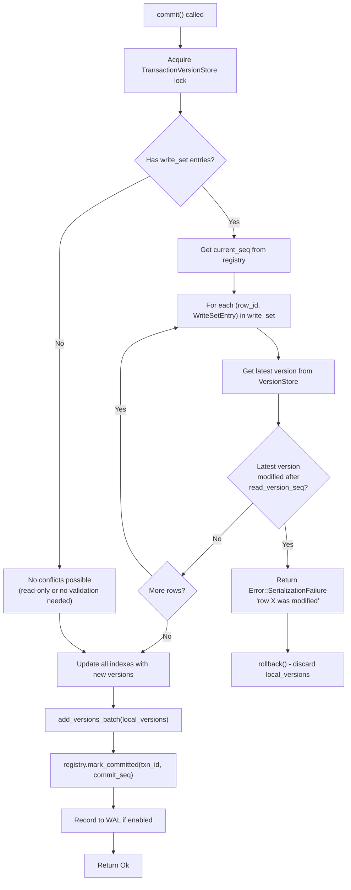
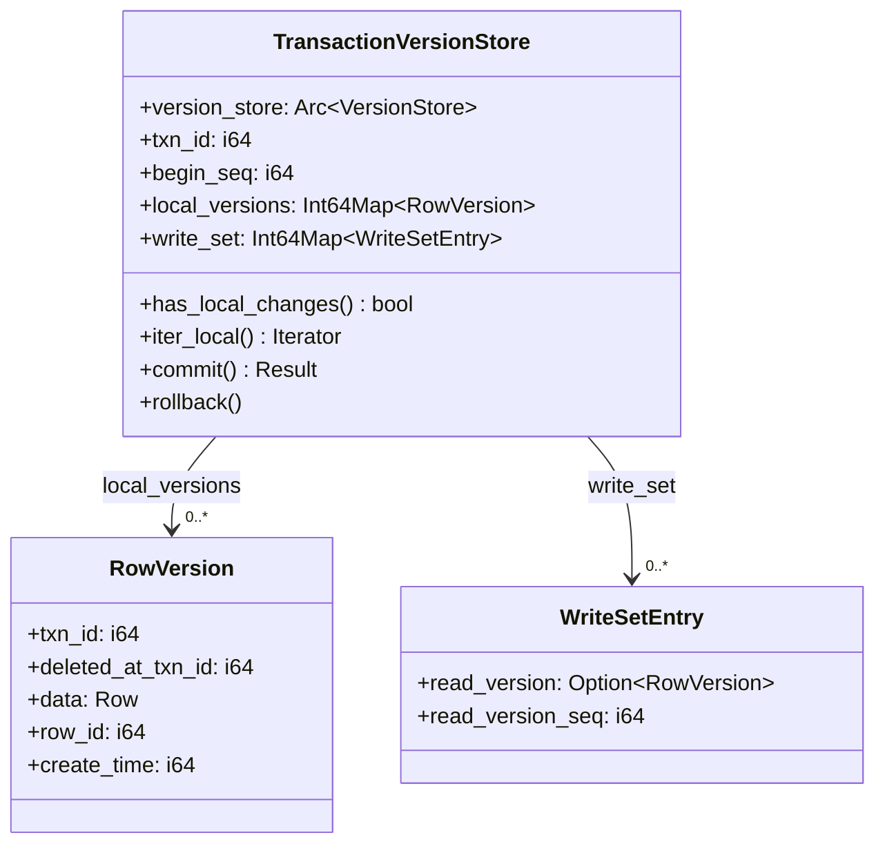
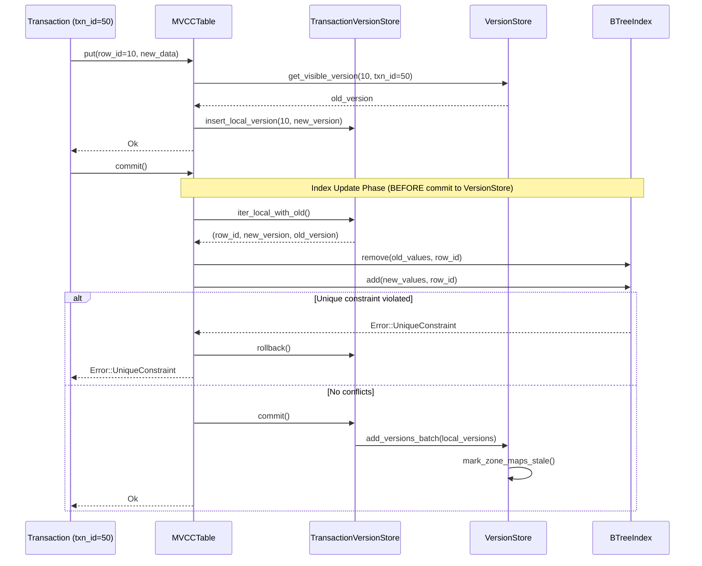
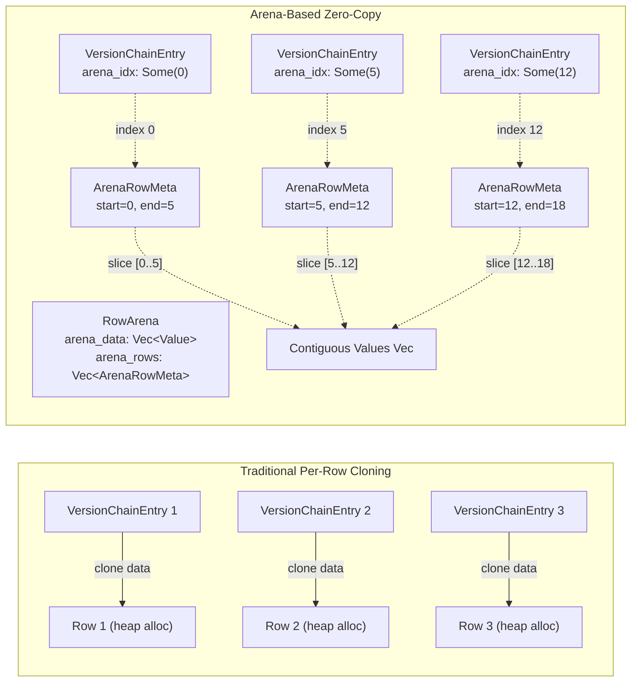

# Page: Concurrency Control

# Concurrency Control

<details>
<summary>Relevant source files</summary>

The following files were used as context for generating this wiki page:

- [src/storage/mvcc/btree_index.rs](src/storage/mvcc/btree_index.rs)
- [src/storage/mvcc/engine.rs](src/storage/mvcc/engine.rs)
- [src/storage/mvcc/hash_index.rs](src/storage/mvcc/hash_index.rs)
- [src/storage/mvcc/table.rs](src/storage/mvcc/table.rs)
- [src/storage/mvcc/version_store.rs](src/storage/mvcc/version_store.rs)

</details>


## Purpose and Scope

This document describes OxiBase's Multi-Version Concurrency Control (MVCC) implementation, which provides transactional isolation without traditional locking. It covers the versioning strategy, visibility checking, conflict detection, and isolation levels.

For information about the overall MVCC architecture and storage layer components, see [MVCC Architecture](#4.1). For details on transaction APIs and user-facing behavior, see [Transactions](#2.2). For query optimization strategies that leverage MVCC, see [Query Optimization](#6.1).

---

## MVCC Core Concepts

OxiBase implements snapshot isolation using version chains. Each row maintains a linked list of versions, with each version tagged by the transaction ID that created it and optionally marked with a deletion transaction ID.

**Key Components:**

| Component | Purpose | Location |
|-----------|---------|----------|
| `VersionStore` | Global committed version storage per table | `src/storage/mvcc/version_store.rs` |
| `TransactionVersionStore` | Transaction-local uncommitted changes | `src/storage/mvcc/version_store.rs` |
| `TransactionRegistry` | Issues transaction IDs and tracks commit state | `src/storage/mvcc/transaction_registry.rs` |
| `MVCCTable` | Transaction-aware table API | `src/storage/mvcc/table.rs` |
| `VisibilityChecker` | Determines version visibility to transactions | `src/storage/mvcc/version_store.rs:135-155` |

**Sources:** [src/storage/mvcc/version_store.rs:1-100](), [src/storage/mvcc/engine.rs:250-280]()

---

## Version Chain Architecture



**Version Chain Design:**

1. **Arc-based sharing**: Each `VersionChainEntry` uses `Arc<VersionChainEntry>` for the `prev` pointer, enabling O(1) cloning of entire chains when creating snapshots [src/storage/mvcc/version_store.rs:110-119]()

2. **Arena indexing**: The `arena_idx` field provides a direct index into contiguous memory for zero-copy scans, avoiding per-row cloning during full table scans [src/storage/mvcc/version_store.rs:117-119]()

3. **Lazy deletion**: Deleted versions remain in the chain with `deleted_at_txn_id != 0`, allowing historical queries [src/storage/mvcc/version_store.rs:83-86]()

**Sources:** [src/storage/mvcc/version_store.rs:110-156](), [src/storage/mvcc/version_store.rs:291-367]()

---

## Transaction Lifecycle and Sequence Numbers



**Sequence Number Semantics:**

- **begin_seq**: Captured at transaction start, determines which versions are visible via `version.txn_id <= begin_seq` [src/storage/mvcc/transaction_registry.rs:100-120]()
- **commit_seq**: Assigned atomically at commit time, orders transactions for conflict detection [src/storage/mvcc/transaction_registry.rs:150-180]()
- **read_version_seq**: Stored in write-set to detect if the read version was modified by another concurrent transaction [src/storage/mvcc/version_store.rs:122-130]()

**Sources:** [src/storage/mvcc/engine.rs:1150-1250](), [src/storage/mvcc/table.rs:719-809]()

---

## Visibility Checking Rules

The `VisibilityChecker` trait defines how transactions determine which versions are visible:

```rust
// From src/storage/mvcc/version_store.rs:135-155
pub trait VisibilityChecker: Send + Sync {
    fn is_visible(&self, version_txn_id: i64, viewing_txn_id: i64) -> bool;
    fn get_current_sequence(&self) -> i64;
    fn is_committed_before(&self, txn_id: i64, cutoff_commit_seq: i64) -> bool;
}
```

**Visibility Algorithm** [src/storage/mvcc/version_store.rs:433-465]():

1. **Read own writes**: If `version_txn_id == viewing_txn_id`, the version is always visible
2. **Snapshot isolation**: A version is visible if it was committed before the viewing transaction started (`version.txn_id <= begin_seq`)
3. **Deletion visibility**: If `deleted_at_txn_id != 0` and the deletion is visible, the row appears deleted

**Time-Travel Query Support:**

For `AS OF TIMESTAMP` queries, visibility is determined by `version.create_time <= as_of_timestamp` instead of transaction IDs [src/storage/mvcc/version_store.rs:597-625]().

**Sources:** [src/storage/mvcc/version_store.rs:133-156](), [src/storage/mvcc/version_store.rs:433-465]()

---

## Isolation Levels

OxiBase supports multiple isolation levels through the `IsolationLevel` enum:

| Isolation Level | Behavior | Write Conflict Detection |
|----------------|----------|-------------------------|
| **ReadUncommitted** | Sees uncommitted changes (not fully implemented) | No conflict detection |
| **ReadCommitted** | Sees only committed changes, non-repeatable reads allowed | No conflict detection |
| **RepeatableRead** | Consistent snapshot within transaction | Write-write conflicts only |
| **Serializable** | Full serializability via write-set tracking | Read-write and write-write conflicts |

**Implementation Details:**

- **Snapshot Isolation (default)**: All transactions get a consistent snapshot at `begin_seq` time. Reads never block writes, writes never block reads [src/storage/mvcc/transaction_registry.rs:50-80]()

- **Conflict Detection**: At commit time, the engine checks if any rows in the write-set were modified by transactions that committed after the read occurred [src/storage/mvcc/version_store.rs:1715-1800]()

```rust
// Write-set entry structure
pub struct WriteSetEntry {
    pub read_version: Option<RowVersion>,  // Version that was read
    pub read_version_seq: i64,              // Sequence when read occurred
}
```

**Sources:** [src/storage/mvcc/version_store.rs:122-130](), [src/storage/mvcc/version_store.rs:1715-1800]()

---

## Conflict Detection at Commit Time



**Conflict Detection Logic** [src/storage/mvcc/version_store.rs:1715-1800]():

The commit process validates that all rows in the write-set have not been modified by concurrent transactions:

1. For each row in `write_set`, retrieve the latest committed version from `VersionStore`
2. Compare the latest version's sequence number against `read_version_seq` stored in the write-set
3. If `latest_version.create_time > read_version_seq`, a concurrent modification occurred → abort with `Error::SerializationFailure`
4. If all checks pass, atomically commit all local versions to the global `VersionStore`

**Write-Set Population** [src/storage/mvcc/table.rs:1000-1100]():

The write-set is populated during:
- `put()`: Records the old version before update
- `delete()`: Records the version being deleted
- `get()` (in Serializable mode): Records the read version to detect phantom reads

**Sources:** [src/storage/mvcc/version_store.rs:1715-1800](), [src/storage/mvcc/table.rs:719-809]()

---

## Transaction-Local Storage

The `TransactionVersionStore` maintains uncommitted changes before commit:



**Two-Level Storage Model:**

1. **Global VersionStore**: Contains all committed versions, shared across transactions via `Arc<VersionStore>` [src/storage/mvcc/version_store.rs:169-193]()

2. **Local TransactionVersionStore**: Per-transaction uncommitted changes in `local_versions` map, discarded on rollback [src/storage/mvcc/version_store.rs:1365-1400]()

**Commit Process** [src/storage/mvcc/table.rs:719-809]():

```
1. Update indexes with new versions (may fail on unique constraint)
2. Call txn_versions.commit() to flush local_versions to VersionStore
3. Mark zone maps as stale (optimizer will recompute statistics)
4. Record to WAL if persistence enabled
```

**Rollback Process** [src/storage/mvcc/table.rs:806-809]():

```
1. Clear local_versions map (discard all uncommitted changes)
2. Clear write_set (discard conflict tracking state)
3. No changes to global VersionStore
```

**Sources:** [src/storage/mvcc/version_store.rs:1365-1450](), [src/storage/mvcc/table.rs:719-809]()

---

## Index Consistency Under MVCC

Indexes are updated **before** commit to detect unique constraint violations early:



**Index-Version Consistency Guarantees:**

1. **Atomic index updates**: All indexes are updated within the same transaction commit phase [src/storage/mvcc/table.rs:722-786]()

2. **Rollback safety**: If any index update fails (e.g., unique constraint), all changes are discarded via `rollback()` [src/storage/mvcc/table.rs:806-809]()

3. **Visibility consistency**: Indexes contain entries only for committed versions. Uncommitted rows in `local_versions` are not indexed until commit succeeds [src/storage/mvcc/table.rs:719-809]()

**Index Update Optimization** [src/storage/mvcc/table.rs:728-786]():

The commit process uses `iter_local_with_old()` which provides both the new version and the old version without requiring an extra lookup:

```rust
// For each modified row:
if is_deleted {
    index.remove(old_values, row_id, row_id)
} else if old_values != new_values {
    index.remove(old_values, row_id, row_id)  // Remove old
    index.add(new_values, row_id, row_id)      // Add new
}
// Same values: no index update needed
```

**Sources:** [src/storage/mvcc/table.rs:719-804](), [src/storage/mvcc/btree_index.rs:415-492]()

---

## Performance Optimizations

### Arena-Based Zero-Copy Scanning

The `RowArena` provides contiguous memory storage for ~50x faster full table scans:



**Implementation** [src/storage/mvcc/version_store.rs:755-817]():

```rust
// Pre-acquire arena locks ONCE for entire scan
let (arena_rows, arena_data) = self.arena.read_guards();
let arena_rows_slice = arena_rows.as_slice();
let arena_data_slice = arena_data.as_slice();

// Single-pass: read directly during visibility check
if let Some(idx) = version.arena_idx {
    let meta = arena_rows_slice[idx];
    let slice = &arena_data_slice[meta.start..meta.end];
    result.push((row_id, Row::from_values(slice.to_vec())));
}
```

**Benefits:**
- Single lock acquisition for entire table scan (vs. N locks for N rows)
- CPU cache-friendly: contiguous memory improves prefetching
- Eliminates per-row `Row::clone()` overhead

**Sources:** [src/storage/mvcc/version_store.rs:755-817](), [src/storage/mvcc/arena.rs:1-200]()

### Batch Operations for Reduced Lock Contention

Batch APIs reduce lock acquisition overhead by processing multiple rows in a single critical section:

| Operation | Traditional (Per-Row) | Batch API | Improvement |
|-----------|----------------------|-----------|-------------|
| **Insert 1000 rows** | 1000 lock acquisitions | 1 lock acquisition | ~100x reduction |
| **Index updates on commit** | N × M locks (rows × indexes) | 1 traversal | Single-pass |
| **Visibility check for SELECT** | N locks (one per row) | 1 lock (batch fetch) | O(1) contention |

**Key Batch Methods:**

- `add_versions_batch()` [src/storage/mvcc/version_store.rs:369-421](): Commits all local versions in a single DashMap traversal
- `get_visible_versions_batch()` [src/storage/mvcc/version_store.rs:467-504](): Fetches multiple rows with one lock per row (DashMap sharding benefit)
- `get_all_visible_rows_arena()` [src/storage/mvcc/version_store.rs:755-817](): Full table scan with single arena lock

**Sources:** [src/storage/mvcc/version_store.rs:369-421](), [src/storage/mvcc/version_store.rs:467-504]()

### Lock-Free Read Path

Read operations (`SELECT` queries) never acquire write locks, achieving true MVCC non-blocking reads:

1. **Version traversal**: Uses read-only references to Arc-wrapped version chains [src/storage/mvcc/version_store.rs:442-462]()
2. **Visibility checking**: Compares transaction IDs without modifying state [src/storage/mvcc/version_store.rs:451-459]()
3. **Index lookups**: BTree and Hash indexes use `RwLock::read()` for concurrent readers [src/storage/mvcc/btree_index.rs:674-686]()

**Sources:** [src/storage/mvcc/version_store.rs:433-465](), [src/storage/mvcc/btree_index.rs:400-605]()

---

## Concurrency Control Code Map

**Primary Structures:**

| Code Entity | Role | Key Methods |
|-------------|------|-------------|
| `TransactionRegistry` | Issues txn IDs, tracks commit state | `allocate_transaction_id()`, `mark_committed()` |
| `VersionStore` | Global committed version storage | `add_version()`, `get_visible_version()` |
| `TransactionVersionStore` | Local uncommitted changes | `commit()`, `rollback()`, `detect_conflicts()` |
| `MVCCTable` | Transaction-aware table API | `put()`, `delete()`, `scan()` |
| `VersionChainEntry` | Single version in linked list | `version: RowVersion`, `prev: Arc<VersionChainEntry>` |
| `VisibilityChecker` | Determines version visibility | `is_visible()`, `is_committed_before()` |

**Transaction Lifecycle:**

```
MVCCEngine::begin_transaction()
  └─> TransactionRegistry::allocate_transaction_id()
  └─> TransactionVersionStore::new()
  └─> MVCCTable::new()

MVCCTable::put() / delete()
  └─> VersionStore::get_visible_version()  (for conflict tracking)
  └─> TransactionVersionStore::insert_local_version()

MVCCEngine::commit()
  └─> MVCCTable::commit()
      ├─> Update indexes (index.add/remove)
      ├─> TransactionVersionStore::commit()
      │   └─> detect_conflicts(write_set)
      │   └─> VersionStore::add_versions_batch()
      └─> TransactionRegistry::mark_committed()
```

**Sources:** [src/storage/mvcc/engine.rs:1150-1250](), [src/storage/mvcc/table.rs:47-93](), [src/storage/mvcc/version_store.rs:169-240]()