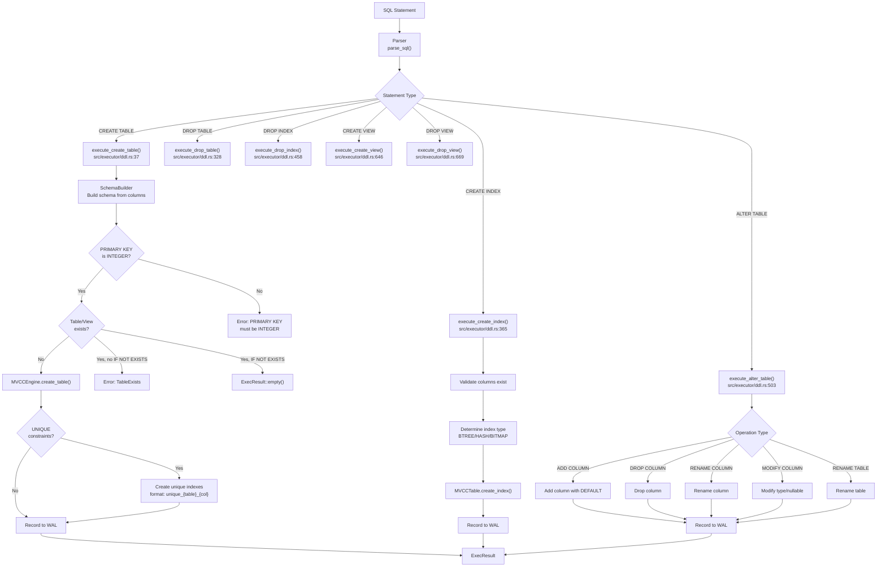
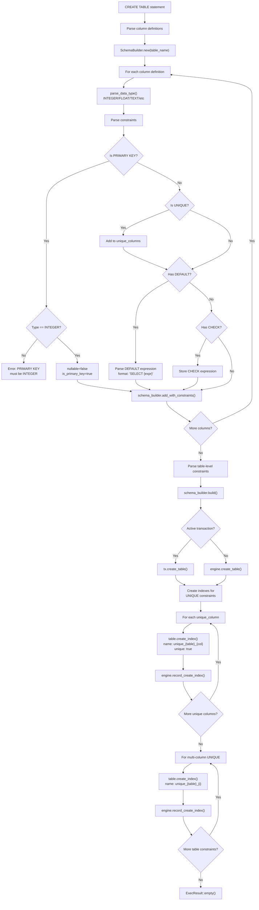
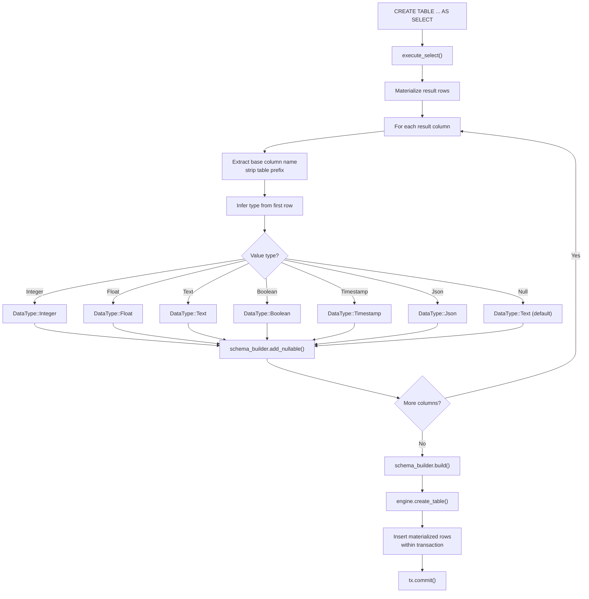
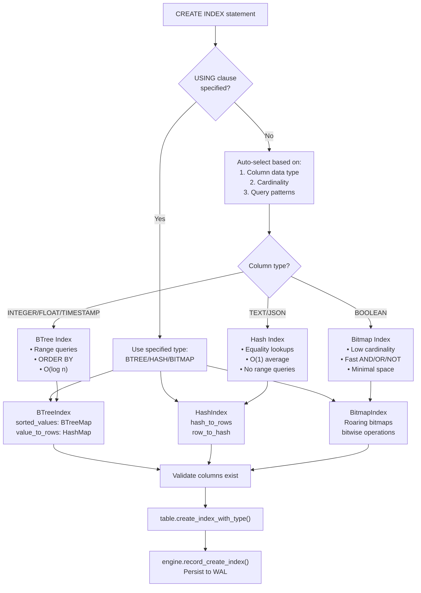
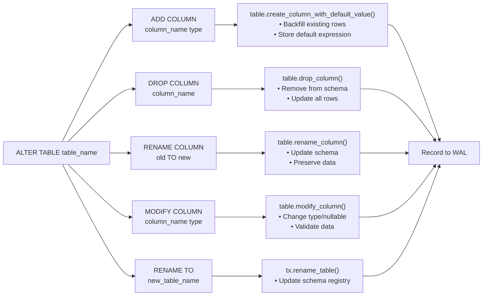
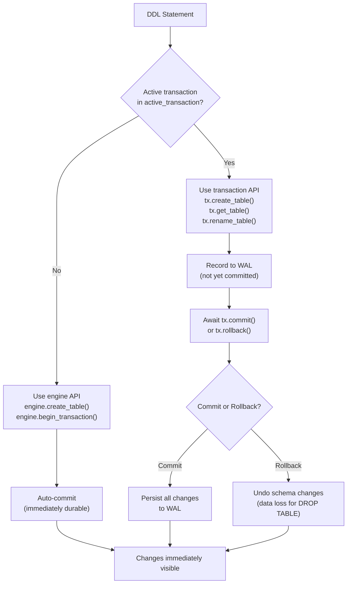

# Page: DDL Operations

# DDL Operations

<details>
<summary>Relevant source files</summary>

The following files were used as context for generating this wiki page:

- [.gitignore](.gitignore)
- [README.md](README.md)
- [../../../../roadmap.md](../../../../roadmap.md)
- [docs/_config.yml](docs/_config.yml)
- [src/api/database.rs](src/api/database.rs)
- [src/api/transaction.rs](src/api/transaction.rs)
- [src/executor/ddl.rs](src/executor/ddl.rs)
- [src/executor/expression/evaluator_bridge.rs](src/executor/expression/evaluator_bridge.rs)
- [src/executor/expression/mod.rs](src/executor/expression/mod.rs)

</details>


This page documents Data Definition Language (DDL) operations in OxiBase: creating and modifying database schemas, tables, indexes, and views. For data manipulation operations (INSERT, UPDATE, DELETE), see the Query Execution System documentation. For information about data types used in DDL statements, see [Data Types](#5.1).

## DDL Execution Pipeline

DDL statements are executed through the `Executor` which delegates to specialized methods in the DDL module. All DDL operations are recorded to the Write-Ahead Log (WAL) for durability and crash recovery.

**DDL Statement Processing Flow**



Sources: [src/executor/ddl.rs:1-765]()

## CREATE TABLE

The `CREATE TABLE` statement defines a new table with columns, data types, and constraints. OxiBase supports both standard table creation and `CREATE TABLE AS SELECT` for creating tables from query results.

### Basic Syntax

```sql
CREATE TABLE [IF NOT EXISTS] table_name (
    column_name data_type [column_constraint ...],
    ...
    [table_constraint ...]
)
```

**Column Constraints:**
- `PRIMARY KEY` - Designates the primary key (must be INTEGER type)
- `UNIQUE` - Values must be unique across rows
- `NOT NULL` - Column cannot contain NULL values
- `DEFAULT expression` - Default value when not specified
- `CHECK (expression)` - Value must satisfy condition
- `AUTO_INCREMENT` - Auto-generate sequential integers

**Table Constraints:**
- `UNIQUE (col1, col2, ...)` - Multi-column unique constraint

### CREATE TABLE Implementation Details



Sources: [src/executor/ddl.rs:36-245](), [src/executor/ddl.rs:716-733]()

### Examples

```sql
-- Simple table with primary key
CREATE TABLE users (
    id INTEGER PRIMARY KEY,
    name TEXT NOT NULL,
    email TEXT UNIQUE,
    age INTEGER
);

-- Table with constraints
CREATE TABLE products (
    id INTEGER PRIMARY KEY AUTO_INCREMENT,
    name TEXT NOT NULL,
    price FLOAT DEFAULT 0.0,
    quantity INTEGER CHECK (quantity >= 0),
    created_at TIMESTAMP DEFAULT CURRENT_TIMESTAMP
);

-- Multi-column unique constraint
CREATE TABLE user_roles (
    user_id INTEGER NOT NULL,
    role_id INTEGER NOT NULL,
    UNIQUE (user_id, role_id)
);

-- Create table from query
CREATE TABLE high_value_orders AS
SELECT * FROM orders WHERE amount > 1000;
```

### CREATE TABLE AS SELECT

OxiBase supports creating tables from SELECT query results. The schema is inferred from the result columns and data types from the first row.



Sources: [src/executor/ddl.rs:247-326]()

### PRIMARY KEY Restrictions

**Important:** OxiBase currently only supports INTEGER PRIMARY KEY. This is validated at table creation time and will return an error for other types.

```sql
-- Valid: INTEGER PRIMARY KEY
CREATE TABLE valid (id INTEGER PRIMARY KEY);

-- Invalid: TEXT PRIMARY KEY (will error)
CREATE TABLE invalid (uuid TEXT PRIMARY KEY);
-- Error: PRIMARY KEY column 'uuid' must be INTEGER type
```

Sources: [src/executor/ddl.rs:88-94]()

## DROP TABLE

Removes a table and all its data from the database.

### Syntax

```sql
DROP TABLE [IF EXISTS] table_name
```

### Transaction Behavior

**Warning:** `DROP TABLE` within a transaction has limited rollback support. On rollback, the table schema will be recreated but **data will be lost** because table data is immediately deleted and cannot be recovered.

For recoverable data deletion, use `DELETE FROM table_name` or `TRUNCATE TABLE` instead.

```sql
-- Outside transaction - safe, auto-committed
DROP TABLE users;

-- Within transaction - data loss on rollback
BEGIN;
DROP TABLE orders;  -- Warning: data cannot be recovered on rollback
ROLLBACK;  -- Schema recreated, but data is gone
```

Sources: [src/executor/ddl.rs:328-363]()

## CREATE INDEX

Creates an index on one or more columns to improve query performance. OxiBase supports three index types: BTree, Hash, and Bitmap.

### Syntax

```sql
CREATE [UNIQUE] INDEX [IF NOT EXISTS] index_name
ON table_name (column1, column2, ...)
[USING {BTREE | HASH | BITMAP}]
```

### Index Types

**Index Type Selection:**



Sources: [src/executor/ddl.rs:365-456](), [README.md:196-216]()

| Index Type | Best For | Characteristics | Use Cases |
|------------|----------|-----------------|-----------|
| **BTree** | Range queries, sorting | O(log n) lookup, ordered | `created_at BETWEEN ...`<br/>`ORDER BY timestamp` |
| **Hash** | Equality lookups | O(1) average, unordered | `email = 'user@example.com'`<br/>`id = 42` |
| **Bitmap** | Low cardinality | Efficient AND/OR/NOT, compact | `status = 'active'`<br/>`is_deleted = false` |

### Examples

```sql
-- BTree index for range queries (auto-selected for TIMESTAMP)
CREATE INDEX idx_created ON orders(created_at);

-- Hash index for equality lookups (explicit)
CREATE INDEX idx_email ON users(email) USING HASH;

-- Bitmap index for boolean column (auto-selected for BOOLEAN)
CREATE INDEX idx_active ON users(is_active);

-- Unique index (enforces constraint)
CREATE UNIQUE INDEX idx_username ON users(username);

-- Multi-column composite index
CREATE INDEX idx_lookup ON events(user_id, event_type, timestamp);

-- Conditional creation
CREATE INDEX IF NOT EXISTS idx_status ON orders(status);
```

### UNIQUE Indexes

When a column has a `UNIQUE` constraint in `CREATE TABLE`, OxiBase automatically creates a unique index with the naming convention `unique_{table}_{column}`:

```sql
-- This CREATE TABLE statement...
CREATE TABLE users (
    id INTEGER PRIMARY KEY,
    email TEXT UNIQUE
);

-- ...automatically creates this index:
-- CREATE UNIQUE INDEX unique_users_email ON users(email)
```

Sources: [src/executor/ddl.rs:162-178]()

## DROP INDEX

Removes an index from a table.

### Syntax

```sql
DROP INDEX [IF EXISTS] index_name ON table_name
```

### Example

```sql
-- Drop an index
DROP INDEX idx_email ON users;

-- Conditional drop
DROP INDEX IF EXISTS idx_status ON orders;
```

**Note:** The table name is required in OxiBase's DROP INDEX syntax.

Sources: [src/executor/ddl.rs:458-501]()

## ALTER TABLE

Modifies an existing table's structure. All ALTER TABLE operations are transactional and recorded to the WAL.

### Operations

**ALTER TABLE Operations:**



Sources: [src/executor/ddl.rs:503-644]()

### ADD COLUMN

Adds a new column to an existing table. If a DEFAULT expression is provided, existing rows are backfilled with the default value.

```sql
-- Add nullable column
ALTER TABLE users ADD COLUMN age INTEGER;

-- Add column with default
ALTER TABLE users ADD COLUMN created_at TIMESTAMP DEFAULT CURRENT_TIMESTAMP;

-- Add NOT NULL column with default
ALTER TABLE users ADD COLUMN status TEXT NOT NULL DEFAULT 'active';
```

**Implementation Notes:**
- Default expressions are evaluated once at ALTER TABLE time for backfilling existing rows
- The default expression is also stored for use with future INSERT statements
- Expressions like `CURRENT_TIMESTAMP` are evaluated at backfill time, so all existing rows get the same timestamp

Sources: [src/executor/ddl.rs:522-572](), [src/executor/ddl.rs:735-763]()

### DROP COLUMN

Removes a column from the table.

```sql
ALTER TABLE users DROP COLUMN age;
```

Sources: [src/executor/ddl.rs:574-586]()

### RENAME COLUMN

Renames a column while preserving its data and constraints.

```sql
ALTER TABLE users RENAME COLUMN email TO email_address;
```

Sources: [src/executor/ddl.rs:587-603]()

### MODIFY COLUMN

Changes a column's data type or nullability. Data is validated against the new type.

```sql
-- Change type
ALTER TABLE users MODIFY COLUMN age BIGINT;

-- Change nullability
ALTER TABLE users MODIFY COLUMN email TEXT NOT NULL;
```

Sources: [src/executor/ddl.rs:604-626]()

### RENAME TABLE

Renames the entire table.

```sql
ALTER TABLE users RENAME TO customers;
```

Sources: [src/executor/ddl.rs:627-639]()

## CREATE VIEW / DROP VIEW

Views are virtual tables defined by SELECT queries. They can be queried like regular tables but don't store data.

### Syntax

```sql
-- Create view
CREATE [OR REPLACE] VIEW [IF NOT EXISTS] view_name AS
SELECT ...

-- Drop view
DROP VIEW [IF EXISTS] view_name
```

### Examples

```sql
-- Simple view
CREATE VIEW active_users AS
SELECT * FROM users WHERE is_active = true;

-- View with joins and aggregates
CREATE VIEW order_summary AS
SELECT 
    u.name,
    COUNT(o.id) as order_count,
    SUM(o.amount) as total_spent
FROM users u
LEFT JOIN orders o ON u.id = o.user_id
GROUP BY u.id, u.name;

-- Query the view
SELECT * FROM active_users WHERE age > 18;

-- Drop view
DROP VIEW IF EXISTS order_summary;
```

**View Implementation:**
- Views are stored in the MVCC engine's view registry
- View names cannot conflict with table names
- Views are expanded inline during query execution
- View definitions are persisted to the WAL

Sources: [src/executor/ddl.rs:646-681]()

## Data Type Mapping

OxiBase's `parse_data_type` function accepts standard SQL type names and aliases, normalizing them to core data types:

| SQL Type Syntax | OxiBase Type | Notes |
|-----------------|--------------|-------|
| `INTEGER`, `INT`, `BIGINT`, `SMALLINT`, `TINYINT` | `DataType::Integer` | 64-bit signed |
| `FLOAT`, `DOUBLE`, `REAL`, `DECIMAL`, `NUMERIC` | `DataType::Float` | 64-bit float |
| `TEXT`, `VARCHAR`, `CHAR`, `STRING`, `CLOB` | `DataType::Text` | UTF-8 string |
| `BOOLEAN`, `BOOL` | `DataType::Boolean` | true/false |
| `TIMESTAMP`, `DATETIME`, `DATE`, `TIME` | `DataType::Timestamp` | Date/time storage |
| `JSON`, `JSONB` | `DataType::Json` | JSON data |
| `BLOB`, `BINARY`, `VARBINARY` | `DataType::Text` | Base64 encoded |

**Type Parsing Logic:**
```sql
-- All these create INTEGER columns:
CREATE TABLE t1 (id INT);
CREATE TABLE t2 (id BIGINT);
CREATE TABLE t3 (id INTEGER);

-- VARCHAR with size is accepted (size ignored):
CREATE TABLE t4 (name VARCHAR(255));  -- Stored as TEXT
```

Sources: [src/executor/ddl.rs:716-733]()

## Constraint Support Matrix

| Constraint | Support Level | Notes |
|------------|---------------|-------|
| `PRIMARY KEY` | ✅ Full | Must be INTEGER type, single column only |
| `UNIQUE` | ✅ Full | Auto-creates unique index, supports multi-column |
| `NOT NULL` | ✅ Full | Enforced at insert/update |
| `DEFAULT` | ✅ Full | Evaluated at schema creation and insert |
| `CHECK` | ⚠️ Partial | Column-level only, stored but not fully enforced |
| `FOREIGN KEY` | ❌ Not supported | Planned for future release |
| `AUTO_INCREMENT` | ✅ Full | Generates sequential integers |

Sources: [src/executor/ddl.rs:76-139]()

## Transaction Support

DDL operations can be executed within transactions, allowing schema changes to be rolled back:

```sql
BEGIN;

-- Create table
CREATE TABLE temp_data (
    id INTEGER PRIMARY KEY,
    value TEXT
);

-- Insert data
INSERT INTO temp_data VALUES (1, 'test');

-- Create index
CREATE INDEX idx_value ON temp_data(value);

-- Rollback everything (table, data, and index)
ROLLBACK;
```

**Transaction Behavior:**
- `CREATE TABLE` - Fully transactional, rollback recreates state
- `DROP TABLE` - **Warning:** Data loss on rollback (schema recreated, data gone)
- `CREATE INDEX` - Fully transactional
- `DROP INDEX` - Fully transactional
- `ALTER TABLE` - Fully transactional
- `CREATE VIEW` - Fully transactional
- `DROP VIEW` - Fully transactional

**Active Transaction Detection:**



Sources: [src/executor/ddl.rs:155-243](), [src/executor/ddl.rs:344-361]()

## Deprecated Features

### COLUMNAR INDEX (Deprecated)

The `CREATE COLUMNAR INDEX` and `DROP COLUMNAR INDEX` syntax is deprecated. Use standard `CREATE INDEX` instead, which automatically selects the optimal index type.

```sql
-- Deprecated (will error):
CREATE COLUMNAR INDEX idx_status ON orders(status);

-- Use this instead:
CREATE INDEX idx_status ON orders(status);
-- Auto-selects Bitmap for BOOLEAN, Hash for TEXT, BTree for numeric types
```

Sources: [src/executor/ddl.rs:683-714]()