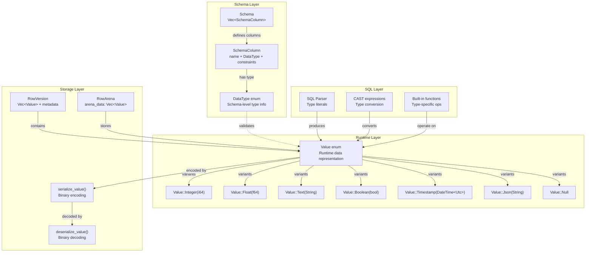
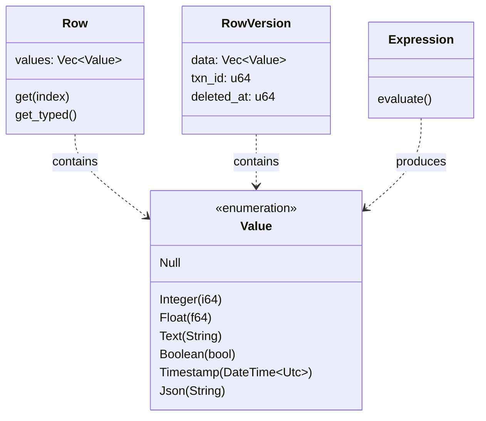
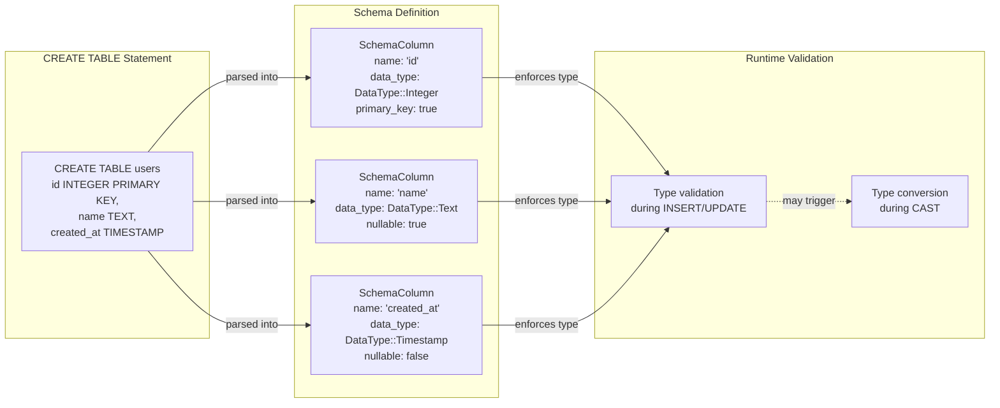
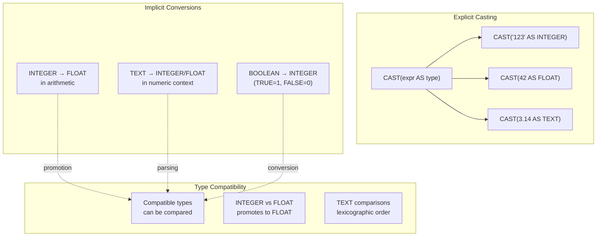
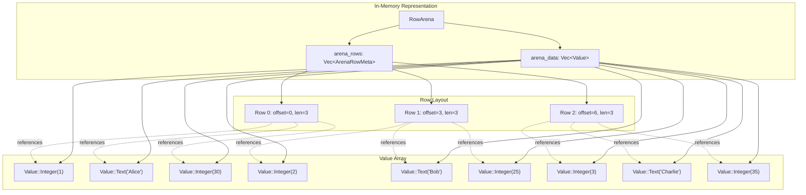
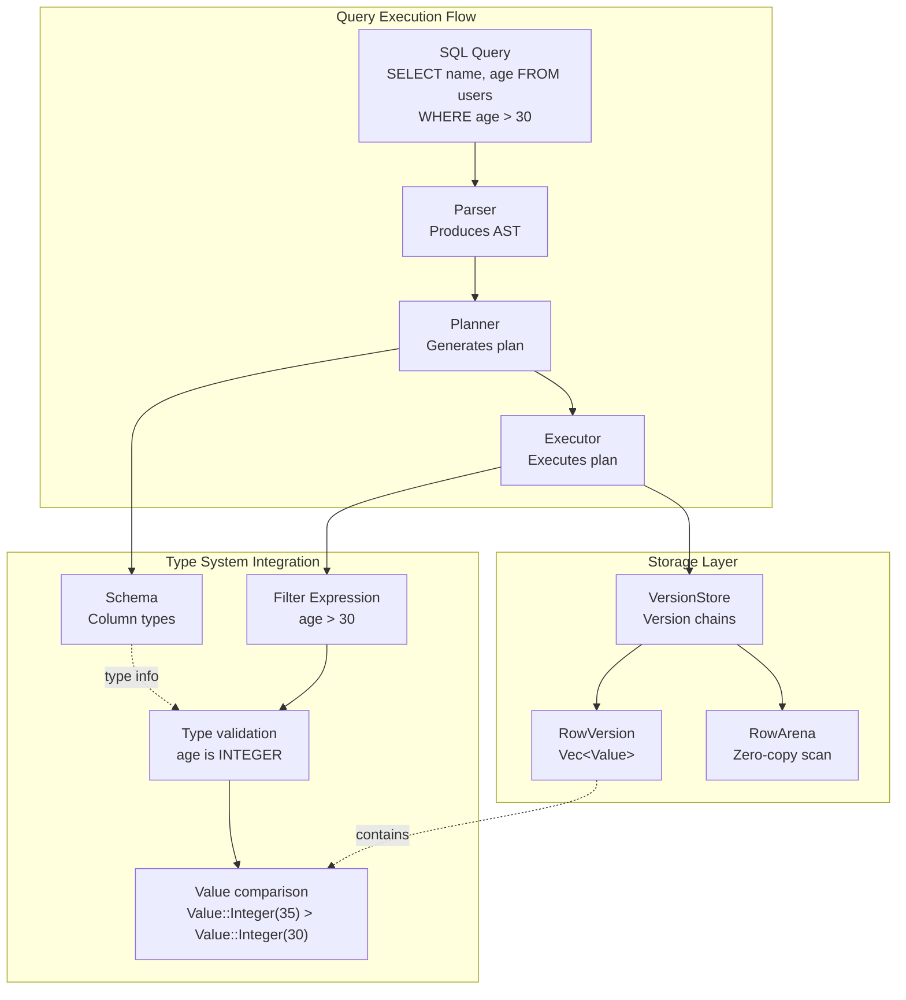

# Page: Data Types

# Data Types

<details>
<summary>Relevant source files</summary>

The following files were used as context for generating this wiki page:

- [.github/workflows/ci.yml](.github/workflows/ci.yml)
- [.gitignore](.gitignore)
- [Cargo.toml](Cargo.toml)
- [README.md](README.md)
- [ROADMAP.md](ROADMAP.md)
- [docs/_config.yml](docs/_config.yml)
- [src/lib.rs](src/lib.rs)

</details>


## Purpose and Scope

This document describes the six data types supported by OxiBase and their implementation: `INTEGER`, `FLOAT`, `TEXT`, `BOOLEAN`, `TIMESTAMP`, and `JSON`. It covers the runtime representation (`Value` enum), schema-level representation (`DataType` enum), storage encoding, NULL handling, and type conversion rules.

For information about built-in functions that operate on these types, see [Built-in Functions](#5.2). For DDL operations that define table schemas with these types, see [DDL Operations](#5.3).

---

## Supported Data Types

OxiBase supports six fundamental data types that cover the majority of use cases in analytical and transactional workloads:

| Type | Storage | Size | Description | Example Literals |
|------|---------|------|-------------|------------------|
| `INTEGER` | 64-bit signed | 8 bytes | Whole numbers from -2^63 to 2^63-1 | `42`, `-100`, `0` |
| `FLOAT` | 64-bit IEEE 754 | 8 bytes | Double-precision floating point | `3.14`, `-0.001`, `1.23e-4` |
| `TEXT` | UTF-8 string | Variable | Unicode text, arbitrary length | `'hello'`, `'日本語'`, `''` |
| `BOOLEAN` | Boolean | 1 byte | Logical true/false | `TRUE`, `FALSE` |
| `TIMESTAMP` | DateTime | 12 bytes | Date and time with nanosecond precision | `'2024-01-15 10:30:00'` |
| `JSON` | JSON string | Variable | Structured JSON data | `'{"key": "value"}'`, `'[1,2,3]'` |

All types support `NULL` values, which are represented distinctly from any actual value in the `Value` enum.

**Sources:** [README.md:315-322]()

---

## Type Architecture Overview



**Sources:** [src/lib.rs:76-79](), [src/lib.rs:88-91]()

---

## The `Value` Enum: Runtime Representation

The `Value` enum is the core runtime type that represents all data values in OxiBase. It is defined in the `core` module and used throughout the execution and storage layers.

### Value Variants



### Key Characteristics

1. **Integer**: Stores 64-bit signed integers (`i64`). Used for:
   - Primary keys and foreign keys
   - Row counts and aggregation results
   - Numeric computations requiring exact precision

2. **Float**: Stores 64-bit floating point (`f64`). Used for:
   - Scientific calculations
   - Financial data where approximate representation is acceptable
   - Aggregations like `AVG()` that produce floating-point results

3. **Text**: Stores UTF-8 encoded strings (`String`). Supports:
   - Arbitrary length strings
   - Full Unicode including emojis and multi-byte characters
   - Zero-copy references when stored in the `RowArena`

4. **Boolean**: Stores logical true/false values. Used for:
   - Conditional logic in WHERE clauses
   - Flag columns (active, deleted, etc.)
   - Results of comparison operations

5. **Timestamp**: Stores date/time values using `chrono::DateTime<Utc>`. Features:
   - Nanosecond precision
   - Time-zone aware (stored as UTC)
   - Used for temporal queries (AS OF TIMESTAMP)

6. **Json**: Stores JSON data as a string. Used for:
   - Semi-structured data
   - Flexible schema columns
   - Operations via JSON functions (`JSON_EXTRACT`, etc.)

7. **Null**: Represents SQL NULL (absence of value). Distinct from empty string or zero.

**Sources:** [src/lib.rs:76-79](), [README.md:315-322]()

---

## The `DataType` Enum: Schema Representation

The `DataType` enum represents type information at the schema level. It is used in table definitions, column constraints, and type checking during query planning.



### DataType Usage

The `DataType` enum is used in:

1. **Schema Definitions**: Column types in `CREATE TABLE` statements
2. **Type Checking**: Validating expressions during query planning
3. **Index Selection**: Choosing appropriate index types (Hash for integers, BTree for ranges)
4. **Function Dispatch**: Determining which function implementation to call
5. **Serialization**: Encoding type metadata in snapshots

**Sources:** [src/lib.rs:76-79]()

---

## NULL Handling

NULL is a first-class value in OxiBase, represented as `Value::Null`. It follows standard SQL semantics:

### NULL Comparison Rules

| Expression | Result |
|------------|--------|
| `NULL = NULL` | `NULL` (not `TRUE`) |
| `NULL <> NULL` | `NULL` (not `FALSE`) |
| `NULL AND TRUE` | `NULL` |
| `NULL OR TRUE` | `TRUE` |
| `NULL + 1` | `NULL` |
| `IS NULL` | `TRUE` or `FALSE` |
| `IS NOT NULL` | `TRUE` or `FALSE` |

### NULL in Aggregations

| Function | NULL Behavior |
|----------|---------------|
| `COUNT(column)` | Excludes NULLs |
| `COUNT(*)` | Includes rows with NULLs |
| `SUM(column)` | Ignores NULLs, returns NULL if all NULL |
| `AVG(column)` | Ignores NULLs in calculation |
| `MIN/MAX(column)` | Ignores NULLs |
| `COALESCE(a, b)` | Returns first non-NULL value |

### NULL in Indexes

- **BTree Index**: NULL values are indexed and can be queried with `IS NULL`
- **Hash Index**: NULL values are stored in a special hash bucket
- **Bitmap Index**: Uses a dedicated NULL bitmap

**Sources:** [README.md:344-345]()

---

## Type Conversions and Casting

OxiBase supports explicit type conversion using the `CAST` function and implicit conversions in certain contexts.



### Conversion Matrix

| From ↓ / To → | INTEGER | FLOAT | TEXT | BOOLEAN | TIMESTAMP | JSON |
|---------------|---------|-------|------|---------|-----------|------|
| **INTEGER** | ✓ | ✓ | ✓ | ✓ | ✗ | ✓ |
| **FLOAT** | ✓¹ | ✓ | ✓ | ✓ | ✗ | ✓ |
| **TEXT** | ✓² | ✓² | ✓ | ✓² | ✓² | ✓ |
| **BOOLEAN** | ✓ | ✓ | ✓ | ✓ | ✗ | ✓ |
| **TIMESTAMP** | ✗ | ✗ | ✓ | ✗ | ✓ | ✓ |
| **JSON** | ✓³ | ✓³ | ✓ | ✓³ | ✗ | ✓ |

¹ Truncates decimal portion  
² Requires valid string format  
³ Extracts value if JSON is scalar

### Casting Examples

```sql
-- Explicit casting
SELECT CAST('123' AS INTEGER);           -- 123
SELECT CAST(42 AS FLOAT);                -- 42.0
SELECT CAST(3.14 AS TEXT);               -- '3.14'
SELECT CAST(TRUE AS INTEGER);            -- 1

-- Implicit conversions in expressions
SELECT 1 + 2.5;                          -- 3.5 (INTEGER promoted to FLOAT)
SELECT CONCAT('User ', 42);              -- 'User 42' (INTEGER converted to TEXT)

-- Type compatibility in comparisons
SELECT * FROM users WHERE id = '123';    -- TEXT '123' parsed to INTEGER
```

**Sources:** [README.md:344-345]()

---

## Type Storage and Serialization

### Value Storage in RowArena

The `RowArena` structure provides zero-copy storage for `Value` instances, significantly improving performance during table scans.



**Benefits:**
- **50x+ speedup** over cloning individual rows during scans
- Contiguous memory layout improves cache locality
- Eliminates per-row allocation overhead

**Sources:** [README.md:100](), architecture diagrams

---

## Binary Serialization Format

Values are serialized to disk using a compact binary format in the WAL and snapshot files.

### Encoding Format

Each value is encoded as:
1. **Type tag** (1 byte): Identifies the variant
2. **Data payload** (variable): Type-specific encoding

| Type | Tag | Payload Format |
|------|-----|----------------|
| `Null` | 0x00 | None |
| `Integer` | 0x01 | 8 bytes (little-endian i64) |
| `Float` | 0x02 | 8 bytes (little-endian f64) |
| `Text` | 0x03 | 4-byte length + UTF-8 bytes |
| `Boolean` | 0x04 | 1 byte (0x00=false, 0x01=true) |
| `Timestamp` | 0x05 | 8-byte timestamp + 4-byte nanoseconds |
| `Json` | 0x06 | 4-byte length + UTF-8 JSON bytes |

### Example Encoding

```
INTEGER 42:
  [0x01] [2A 00 00 00 00 00 00 00]
  
TEXT "hello":
  [0x03] [05 00 00 00] [68 65 6C 6C 6F]
  
BOOLEAN true:
  [0x04] [01]
  
NULL:
  [0x00]
```

**Sources:** [src/lib.rs:120-124]()

---

## Type Inference and Compatibility

### Type Inference in Expressions

The query planner infers result types based on operation semantics:

```sql
-- Arithmetic operations
SELECT 1 + 2;              -- Result: INTEGER
SELECT 1.0 + 2;            -- Result: FLOAT (promotion)
SELECT '1' + 2;            -- Error: Cannot add TEXT and INTEGER

-- Comparison operations
SELECT 1 = 2;              -- Result: BOOLEAN
SELECT 'a' < 'b';          -- Result: BOOLEAN

-- Function calls
SELECT LENGTH('hello');    -- Result: INTEGER
SELECT UPPER('hello');     -- Result: TEXT
SELECT NOW();              -- Result: TIMESTAMP
```

### Type Compatibility in Joins

Join conditions require compatible types:

```sql
-- Compatible: both INTEGER
SELECT * FROM orders o
JOIN customers c ON o.customer_id = c.id;

-- Compatible: implicit conversion TEXT to INTEGER
SELECT * FROM orders o
JOIN customers c ON o.customer_id = CAST(c.external_id AS INTEGER);

-- Incompatible: TIMESTAMP cannot compare to INTEGER
SELECT * FROM orders o
JOIN shipments s ON o.created_at = s.id;  -- Error
```

**Sources:** [README.md:298-311]()

---

## Integration with Storage and Execution



### Type Usage in Key Components

1. **Parser**: Converts string literals to typed `Value` instances
2. **Planner**: Uses `DataType` for type checking and index selection
3. **Optimizer**: Considers types when choosing join algorithms
4. **Executor**: Evaluates expressions producing `Value` results
5. **Expression VM**: Operates on `Value` stack
6. **MVCC**: Stores `Vec<Value>` in version chains
7. **Indexes**: Specialized handling per type (BTree for ranges, Hash for equality)
8. **WAL**: Serializes `Value` for durability
9. **Functions**: Type-specific implementations (101+ functions)

**Sources:** [README.md:84-100](), [src/lib.rs:66-73]()

---

## Performance Considerations

### Type-Specific Optimizations

| Type | Optimization | Benefit |
|------|--------------|---------|
| **INTEGER** | Radix sort for GROUP BY | O(n) instead of O(n log n) |
| **FLOAT** | SIMD operations | 4-8x throughput on aggregations |
| **TEXT** | String interning for low cardinality | Reduced memory and faster comparisons |
| **BOOLEAN** | Bitmap indexes | 32x-64x compression ratio |
| **TIMESTAMP** | Zone map pruning | Skip entire partitions in time-range queries |
| **JSON** | Lazy parsing | Only parse when JSON functions are used |

### Memory Layout

The `Value` enum is optimized for 64-bit architectures:
- Size: 32 bytes (due to `String` containing pointer + length + capacity)
- Alignment: 8 bytes
- Null bitmap: Separate tracking in some contexts to save space

**Sources:** [README.md:75](), [Cargo.toml:75-78]()

---

## Summary

OxiBase's type system provides:

- **Six fundamental types** covering analytical and transactional workloads
- **NULL-aware semantics** following SQL standards
- **Flexible conversions** with explicit CAST and implicit promotions
- **Efficient storage** using arena-based zero-copy scanning
- **Compact serialization** in WAL and snapshots
- **Deep integration** with indexes, MVCC, and the query executor

The `Value` enum serves as the universal runtime representation, while the `DataType` enum provides schema-level type information. Together, they enable type-safe query execution with high performance and full ACID compliance.

**Sources:** [README.md:315-346](), [src/lib.rs:76-79](), [src/lib.rs:88-91]()