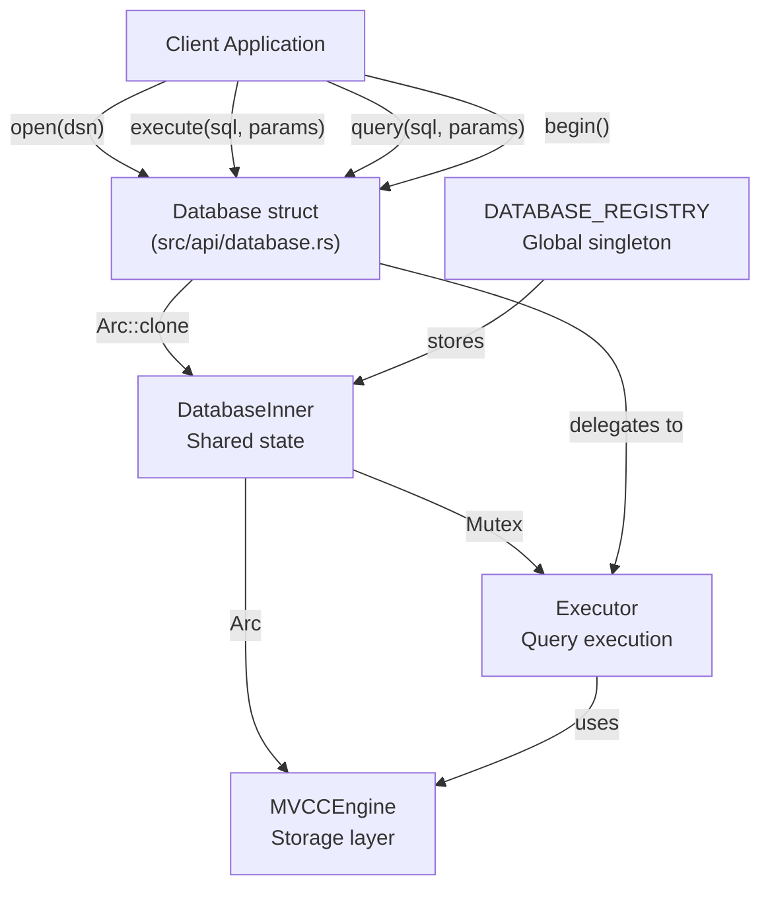
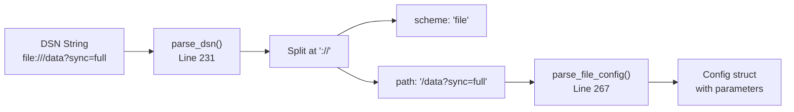
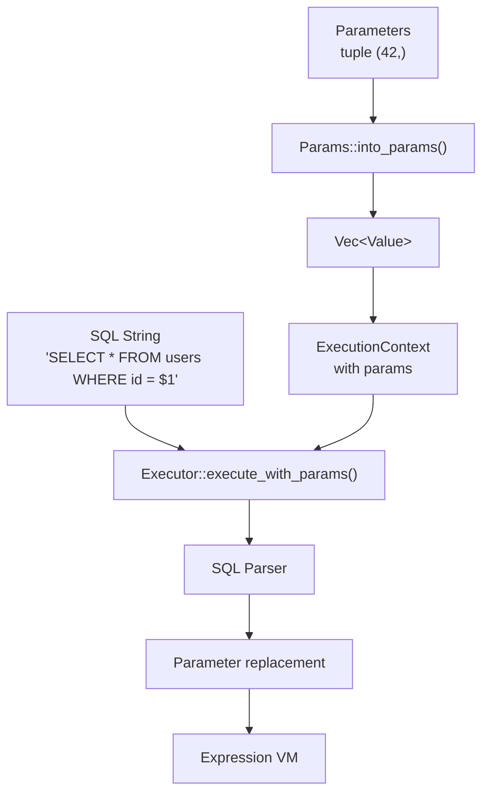
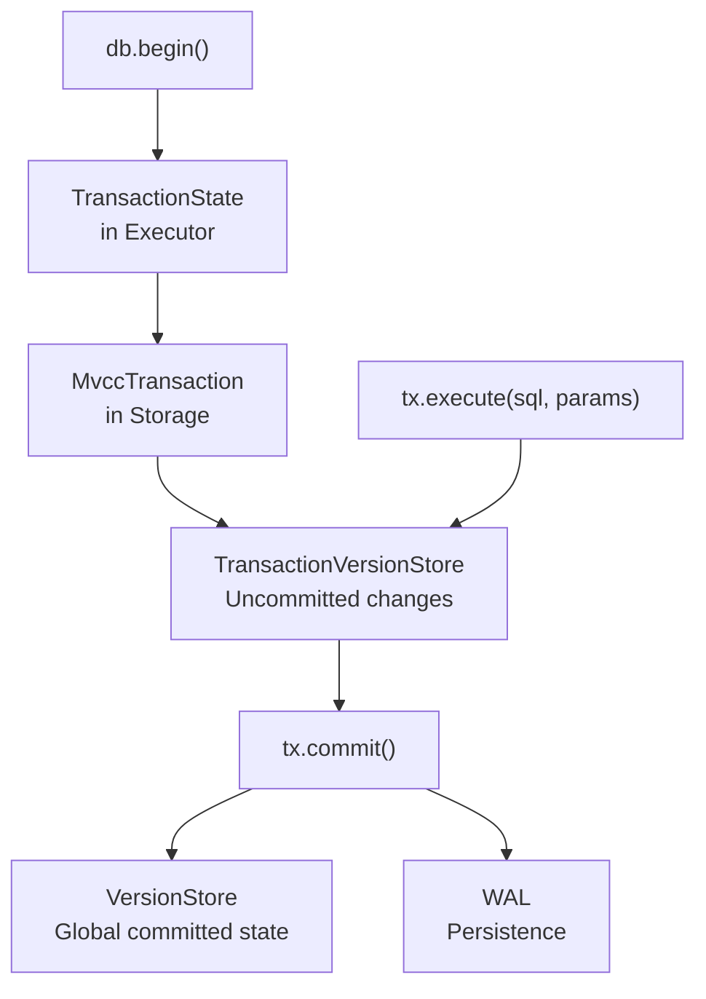
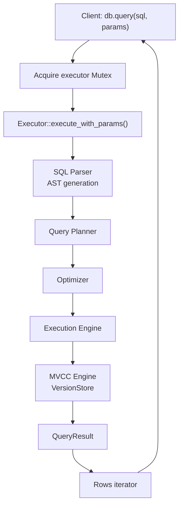
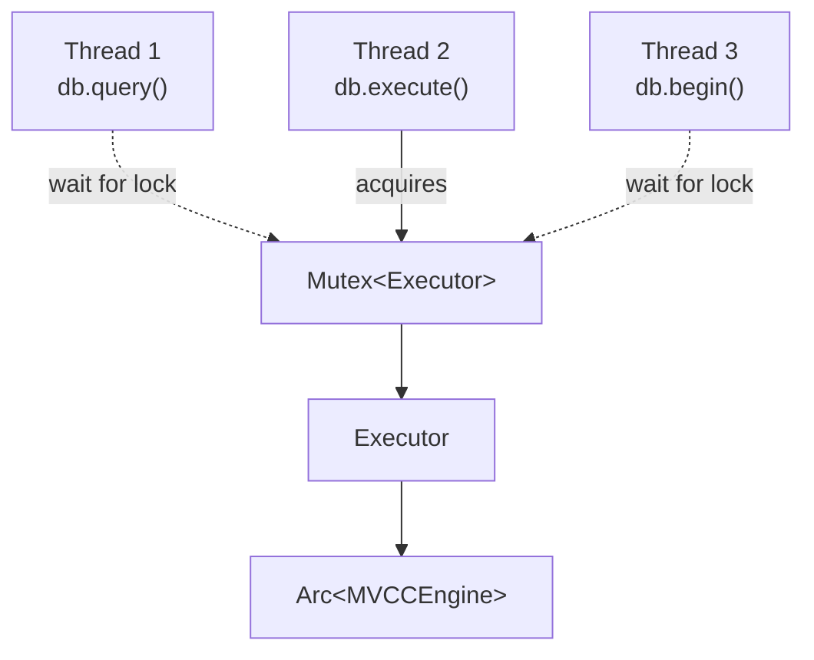

# Page: Database API

# Database API

<details>
<summary>Relevant source files</summary>

The following files were used as context for generating this wiki page:

- [.gitignore](.gitignore)
- [README.md](README.md)
- [ROADMAP.md](ROADMAP.md)
- [docs/_config.yml](docs/_config.yml)
- [src/api/database.rs](src/api/database.rs)
- [src/api/transaction.rs](src/api/transaction.rs)
- [src/executor/ddl.rs](src/executor/ddl.rs)
- [src/executor/expression/evaluator_bridge.rs](src/executor/expression/evaluator_bridge.rs)
- [src/executor/expression/mod.rs](src/executor/expression/mod.rs)

</details>


This page documents the `Database` struct, which is the primary entry point for interacting with OxiBase. The Database API provides methods for opening connections, executing SQL queries, managing parameters, and controlling transactions. For transaction-specific operations like commit and rollback, see [Transactions](#2.2). For working with query result sets, see [Query Results](#2.3).

**Sources:** [src/api/database.rs:1-887]()

---

## Overview

The `Database` struct wraps the storage engine and executor, providing a simple, ergonomic Rust API for SQL operations. Key characteristics:

- **Thread-Safe**: Database instances can be cloned and shared across threads
- **Connection Pooling**: Multiple `Database` instances with the same DSN share the same underlying engine
- **Type-Safe Parameters**: Support for both positional (`$1`, `$2`) and named (`:name`) parameters
- **Zero-Copy Operations**: Direct integration with the MVCC storage layer



**Diagram: Database API Architecture**

**Sources:** [src/api/database.rs:114-117](), [src/api/database.rs:71-75](), [src/api/database.rs:67-68]()

---

## Opening a Database

### Basic Usage

OxiBase supports two storage modes via Data Source Name (DSN) strings:

| DSN Scheme | Description | Persistence | Example |
|------------|-------------|-------------|---------|
| `memory://` | In-memory database | Data lost on close | `memory://` |
| `file://` | File-based database | Durable via WAL + snapshots | `file:///var/lib/oxibase/data` |

```rust
// In-memory database
let db = Database::open("memory://")?;

// Persistent file-based database
let db = Database::open("file:///path/to/database")?;

// Convenience method for unique in-memory instance
let db = Database::open_in_memory()?;
```

**Sources:** [src/api/database.rs:140-205](), [src/api/database.rs:212-228]()

### DSN Parsing

The `open()` method parses the DSN to determine the storage scheme and path:



**Diagram: DSN Parsing Flow**

**Sources:** [src/api/database.rs:231-264](), [src/api/database.rs:267-364]()

### Connection Reuse

The `DATABASE_REGISTRY` ensures that opening the same DSN multiple times returns the same engine instance:

```rust
// Both db1 and db2 share the same underlying engine
let db1 = Database::open("file:///mydb")?;
let db2 = Database::open("file:///mydb")?;
```

This prevents data corruption and ensures consistency. The registry uses a `RwLock<HashMap<String, Arc<DatabaseInner>>>` for thread-safe access.

**Sources:** [src/api/database.rs:67-68](), [src/api/database.rs:142-163]()

---

## DSN Configuration Parameters

File-based databases support query parameters in the DSN for fine-tuning persistence behavior:

### Sync Modes

| Parameter | Values | Default | Description |
|-----------|--------|---------|-------------|
| `sync_mode` / `sync` | `none`, `normal`, `full` | `normal` | WAL flush behavior |

- **`none`**: No fsync (fastest, least durable)
- **`normal`**: Flush at transaction commit
- **`full`**: Flush + directory sync (slowest, most durable)

```rust
let db = Database::open("file:///data?sync_mode=full")?;
```

### Snapshot Configuration

| Parameter | Type | Default | Description |
|-----------|------|---------|-------------|
| `snapshot_interval` | seconds | 300 | Time between automatic snapshots |
| `keep_snapshots` | count | 5 | Number of snapshots to retain |

```rust
let db = Database::open("file:///data?snapshot_interval=600&keep_snapshots=10")?;
```

### WAL (Write-Ahead Log) Settings

| Parameter | Type | Default | Description |
|-----------|------|---------|-------------|
| `wal_flush_trigger` | bytes | 32768 | Buffer size before flush |
| `wal_buffer_size` | bytes | 65536 | WAL buffer capacity |
| `wal_max_size` | bytes | 67108864 | Max WAL size before rotation |
| `commit_batch_size` | count | 100 | Transactions per batch |
| `sync_interval_ms` | milliseconds | 10 | Time between flushes |

```rust
let db = Database::open("file:///data?wal_buffer_size=131072&commit_batch_size=200")?;
```

### Compression

| Parameter | Values | Default | Description |
|-----------|--------|---------|-------------|
| `wal_compression` | `on`, `off` | `off` | Compress WAL entries |
| `snapshot_compression` | `on`, `off` | `off` | Compress snapshots |
| `compression` | `on`, `off` | `off` | Enable both |
| `compression_threshold` | bytes | 64 | Min size for compression |

```rust
let db = Database::open("file:///data?compression=on&compression_threshold=128")?;
```

**Sources:** [src/api/database.rs:267-364]()

---

## Query Execution

### Execute: DDL and DML

The `execute()` method is used for statements that modify data or schema:

```rust
// DDL - Data Definition Language
db.execute("CREATE TABLE users (id INTEGER PRIMARY KEY, name TEXT)", ())?;

// DML - Data Manipulation Language
let rows_affected = db.execute(
    "INSERT INTO users VALUES ($1, $2)",
    (1, "Alice")
)?;

// Returns count of affected rows
let updated = db.execute(
    "UPDATE users SET name = $1 WHERE id = $2",
    ("Alicia", 1)
)?;
```

**Method Signature:**
```rust
pub fn execute<P: Params>(&self, sql: &str, params: P) -> Result<i64>
```

**Sources:** [src/api/database.rs:399-413]()

### Query: Reading Data

The `query()` method returns an iterator over result rows:

```rust
// Query without parameters
for row in db.query("SELECT * FROM users", ())? {
    let row = row?;
    let id: i64 = row.get(0)?;
    let name: String = row.get("name")?;
    println!("{}: {}", id, name);
}

// Query with parameters
for row in db.query("SELECT * FROM users WHERE id > $1", (10,))? {
    // Process row...
}
```

**Method Signature:**
```rust
pub fn query<P: Params>(&self, sql: &str, params: P) -> Result<Rows>
```

**Sources:** [src/api/database.rs:444-458]()

---

## Parameter Binding

OxiBase supports three parameter styles to prevent SQL injection:

### Positional Parameters

Use `$1`, `$2`, etc. in SQL and pass values as tuples:

```rust
// Single parameter (note trailing comma)
db.execute("INSERT INTO users VALUES ($1)", (42,))?;

// Multiple parameters
db.execute(
    "INSERT INTO users VALUES ($1, $2, $3)",
    (1, "Alice", 30)
)?;

// Using the params! macro
db.execute(
    "INSERT INTO users VALUES ($1, $2, $3)",
    params![1, "Alice", 30]
)?;
```

**Sources:** [src/api/database.rs:399-413]()

### Named Parameters

Use `:name` syntax in SQL and pass `named_params!` macro:

```rust
use oxibase::named_params;

db.execute_named(
    "INSERT INTO users VALUES (:id, :name, :age)",
    named_params! {
        id: 1,
        name: "Alice",
        age: 30
    }
)?;

// Query with named parameters
for row in db.query_named(
    "SELECT * FROM users WHERE age > :min_age",
    named_params! { min_age: 18 }
)? {
    // Process row...
}
```

**Sources:** [src/api/database.rs:609-618](), [src/api/database.rs:642-651]()

### Parameter Flow



**Diagram: Parameter Binding Pipeline**

**Sources:** [src/api/database.rs:399-413](), [src/api/params.rs]()

---

## Convenience Query Methods

### query_one: Single Value

Returns a single value from a single-row result, or error if no rows:

```rust
let count: i64 = db.query_one("SELECT COUNT(*) FROM users", ())?;

let name: String = db.query_one(
    "SELECT name FROM users WHERE id = $1",
    (1,)
)?;
```

**Sources:** [src/api/database.rs:471-477]()

### query_opt: Optional Value

Like `query_one`, but returns `None` instead of error when no rows:

```rust
let name: Option<String> = db.query_opt(
    "SELECT name FROM users WHERE id = $1",
    (999,)
)?;

if let Some(n) = name {
    println!("Found: {}", n);
}
```

**Sources:** [src/api/database.rs:489-494]()

### query_as: Struct Mapping

Map result rows directly to structs implementing `FromRow`:

```rust
struct User {
    id: i64,
    name: String,
}

impl FromRow for User {
    fn from_row(row: &ResultRow) -> Result<Self> {
        Ok(User {
            id: row.get(0)?,
            name: row.get(1)?,
        })
    }
}

// Query and map to Vec<User>
let users: Vec<User> = db.query_as(
    "SELECT id, name FROM users",
    ()
)?;
```

**Sources:** [src/api/database.rs:707-710]()

---

## Transaction Management

### Starting Transactions

```rust
// Default isolation level (Read Committed)
let tx = db.begin()?;

// Explicit isolation level
use oxibase::IsolationLevel;
let tx = db.begin_with_isolation(IsolationLevel::Snapshot)?;
```

**Supported Isolation Levels:**
- `ReadCommitted` (default): Sees committed changes from other transactions
- `Snapshot`: Consistent view throughout transaction (snapshot isolation)

**Sources:** [src/api/database.rs:754-779]()

### Transaction Flow



**Diagram: Transaction Lifecycle**

**Sources:** [src/api/database.rs:754-779](), [src/api/transaction.rs:58-65]()

For detailed transaction operations, see [Transactions](#2.2).

---

## Prepared Statements

Compile SQL once and execute multiple times with different parameters:

```rust
let stmt = db.prepare("SELECT * FROM users WHERE id = $1")?;

// Execute with different parameters
for id in 1..=10 {
    for row in stmt.query((id,))? {
        // Process row...
    }
}
```

**Sources:** [src/api/database.rs:581-583]()

---

## Query Timeouts

Execute queries with automatic cancellation after a timeout:

```rust
// Execute with 5 second timeout
db.execute_with_timeout(
    "DELETE FROM large_table WHERE old = true",
    (),
    5000  // milliseconds
)?;

// Query with 10 second timeout
for row in db.query_with_timeout(
    "SELECT * FROM large_table",
    (),
    10000
)? {
    // Process row...
}
```

**Sources:** [src/api/database.rs:507-527](), [src/api/database.rs:542-562]()

---

## Database Operations

### Create Snapshot

Manually trigger a database snapshot for faster recovery:

```rust
db.create_snapshot()?;
```

Creates snapshot files for each table. On recovery, the system loads the snapshot and replays only WAL entries after the snapshot timestamp.

**Note:** No-op for in-memory databases.

**Sources:** [src/api/database.rs:840-843]()

### Close Database

Explicitly close the database and release the file lock:

```rust
db.close()?;
```

This removes the database from the global registry and closes the underlying engine. The engine is also closed automatically when all `Database` instances are dropped.

**Sources:** [src/api/database.rs:795-808]()

### Check Table Existence

```rust
if db.table_exists("users")? {
    println!("Table exists");
}
```

**Sources:** [src/api/database.rs:811-815]()

---

## Internal Architecture

### Database Struct Layout

```rust
pub struct Database {
    inner: Arc<DatabaseInner>,
}

struct DatabaseInner {
    engine: Arc<MVCCEngine>,
    executor: Mutex<Executor>,
    dsn: String,
}
```

The `Database` struct is a thin wrapper around `Arc<DatabaseInner>`, making clones cheap (just incrementing a reference count).

**Sources:** [src/api/database.rs:114-117](), [src/api/database.rs:71-75]()

### Query Execution Flow



**Diagram: Query Execution Pipeline**

**Sources:** [src/api/database.rs:444-458](), [src/executor/mod.rs]()

### Thread Safety

The `Database` API achieves thread safety through:

1. **Arc-based sharing**: Multiple `Database` instances share the same `DatabaseInner`
2. **Mutex-protected executor**: Only one thread executes queries at a time
3. **Arc-protected engine**: Storage engine is immutable and thread-safe via MVCC



**Diagram: Thread-Safe Access Pattern**

**Sources:** [src/api/database.rs:114-117](), [src/api/database.rs:401-404]()

---

## Type Conversion

The `FromValue` trait enables type-safe extraction from query results:

### Built-in Conversions

| Rust Type | SQL Type | Notes |
|-----------|----------|-------|
| `i64` | INTEGER | Primary numeric type |
| `i32` | INTEGER | Truncated from i64 |
| `f64` | FLOAT | 64-bit floating point |
| `String` | TEXT, JSON | UTF-8 strings |
| `bool` | BOOLEAN | true/false |
| `Value` | Any | Raw value enum |
| `Option<T>` | Any | NULL handling |

```rust
let count: i64 = db.query_one("SELECT COUNT(*) FROM users", ())?;
let avg: f64 = db.query_one("SELECT AVG(age) FROM users", ())?;
let name: String = db.query_one("SELECT name FROM users WHERE id = $1", (1,))?;
let active: bool = db.query_one("SELECT active FROM users WHERE id = $1", (1,))?;
```

**Sources:** [src/api/database.rs:888-979]()

---

## Error Handling

All Database methods return `Result<T, Error>` where `Error` is OxiBase's unified error type:

```rust
use oxibase::{Database, Error};

match db.execute("INSERT INTO users VALUES ($1, $2)", (1, "Alice")) {
    Ok(rows) => println!("Inserted {} rows", rows),
    Err(Error::TableNotFoundByName(name)) => {
        println!("Table not found: {}", name);
    }
    Err(Error::TransactionEnded) => {
        println!("Transaction already committed/rolled back");
    }
    Err(e) => println!("Other error: {}", e),
}
```

**Common Error Types:**
- `ParseError`: SQL syntax errors
- `TableNotFoundByName`: Table doesn't exist
- `ColumnNotFoundNamed`: Column doesn't exist
- `TypeConversion`: Type mismatch
- `UniqueViolation`: Constraint violation
- `TransactionEnded`: Transaction already finished
- `LockAcquisitionFailed`: Lock timeout

**Sources:** [src/core/error.rs](), [src/api/database.rs:399-413]()

---

## Complete Example

```rust
use oxibase::{Database, named_params, IsolationLevel};

fn main() -> Result<(), Box<dyn std::error::Error>> {
    // Open persistent database with custom config
    let db = Database::open(
        "file:///mydb?sync_mode=full&snapshot_interval=600"
    )?;

    // Create schema
    db.execute(
        "CREATE TABLE users (
            id INTEGER PRIMARY KEY,
            name TEXT NOT NULL,
            age INTEGER
        )",
        ()
    )?;

    // Insert with positional parameters
    db.execute(
        "INSERT INTO users VALUES ($1, $2, $3)",
        (1, "Alice", 30)
    )?;

    // Insert with named parameters
    db.execute_named(
        "INSERT INTO users VALUES (:id, :name, :age)",
        named_params! {
            id: 2,
            name: "Bob",
            age: 25
        }
    )?;

    // Query with iteration
    for row in db.query("SELECT * FROM users ORDER BY id", ())? {
        let row = row?;
        let id: i64 = row.get(0)?;
        let name: String = row.get("name")?;
        let age: i64 = row.get("age")?;
        println!("{}: {} ({})", id, name, age);
    }

    // Aggregate query
    let avg_age: f64 = db.query_one("SELECT AVG(age) FROM users", ())?;
    println!("Average age: {:.1}", avg_age);

    // Transaction with snapshot isolation
    let mut tx = db.begin_with_isolation(IsolationLevel::Snapshot)?;
    tx.execute("UPDATE users SET age = age + 1", ())?;
    tx.commit()?;

    // Create manual snapshot
    db.create_snapshot()?;

    // Close and release lock
    db.close()?;

    Ok(())
}
```

**Sources:** [src/api/database.rs:1-887](), [README.md:130-146]()