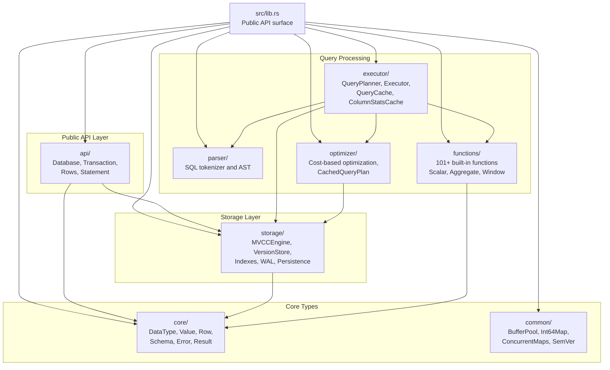
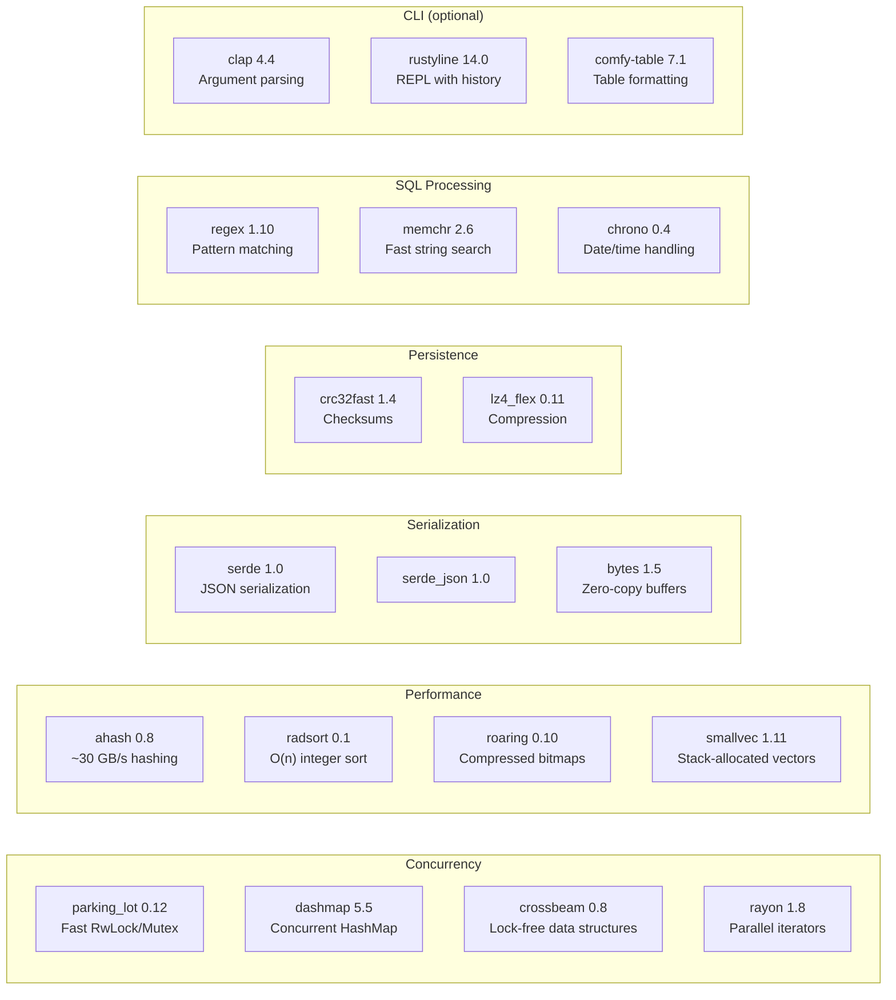

# Page: Development Guide

# Development Guide

<details>
<summary>Relevant source files</summary>

The following files were used as context for generating this wiki page:

- [.github/workflows/ci.yml](.github/workflows/ci.yml)
- [Cargo.toml](Cargo.toml)
- [src/lib.rs](src/lib.rs)

</details>


This guide provides essential information for developers contributing to OxiBase. It covers the development environment setup, code standards, CI/CD pipeline, and project structure. For detailed information about the module organization and internal architecture, see [Module Organization](#7.2). For build instructions and test execution, see [Building and Testing](#7.1).

## Development Environment Setup

### Prerequisites

OxiBase requires:
- **Rust toolchain**: Stable channel with `rustfmt` and `clippy` components
- **Platform-specific dependencies**:
  - Linux: Standard GNU toolchain
  - Linux ARM64 cross-compilation: `gcc-aarch64-linux-gnu` [.github/workflows/ci.yml:162-166]()
  - macOS: Xcode command line tools
  - Windows: MSVC toolchain

### Quick Start

```bash
# Clone the repository
git clone https://github.com/oxibase/oxibase
cd oxibase

# Run tests
cargo test

# Run with CLI
cargo run --features cli

# Build optimized release
cargo build --release
```

Sources: [Cargo.toml:1-117](), [.github/workflows/ci.yml:59-66]()

### Feature Flags

The codebase uses Cargo feature flags to enable optional functionality:

| Feature | Description | Default |
|---------|-------------|---------|
| `cli` | Command-line interface with `clap`, `rustyline`, and `comfy-table` | ✓ |
| `pg-server` | PostgreSQL wire protocol server (requires `tokio`) | ✗ |
| `simd` | SIMD optimizations for expression evaluation | ✗ |

Sources: [Cargo.toml:94-98]()

## Code Standards

### Formatting and Linting

All code must pass formatting and linting checks enforced by CI:

```bash
# Check formatting (enforced in CI)
cargo fmt --all -- --check

# Run Clippy with warnings as errors
cargo clippy --all-targets --all-features -- -D warnings
```

The CI pipeline fails builds that don't meet these standards [.github/workflows/ci.yml:34-38]().

Sources: [.github/workflows/ci.yml:20-38]()

### License Headers

Every `.rs` file must include the Apache 2.0 license header:

```rust
// Copyright 2025 Stoolap Contributors
//
// Licensed under the Apache License, Version 2.0 (the "License");
// ...
```

The CI pipeline automatically checks for missing license headers and fails the build if any are found [.github/workflows/ci.yml:103-121]().

Sources: [.github/workflows/ci.yml:103-121](), [src/lib.rs:1-13]()

## CI/CD Pipeline

### Pipeline Architecture

```mermaid
graph TD
    Trigger["Push/PR Trigger<br/>(main, develop branches)"]
    
    subgraph "Parallel Jobs"
        Lint["Lint Job<br/>ubuntu-latest"]
        TestUbuntu["Test Job<br/>ubuntu-latest"]
        TestMac["Test Job<br/>macos-latest"]
        TestWin["Test Job<br/>windows-latest"]
        Coverage["Coverage Job<br/>ubuntu-latest"]
        License["License Check<br/>ubuntu-latest"]
        Artifacts["Build Artifacts<br/>6 targets"]
    end
    
    Lint --> Format["cargo fmt --check"]
    Lint --> Clippy["cargo clippy -D warnings"]
    
    TestUbuntu --> DiskCleanup["Free Disk Space<br/>(remove dotnet, android, ghc)"]
    TestUbuntu --> RunTests["cargo test"]
    
    TestMac --> RunTestsMac["cargo test"]
    TestWin --> RunTestsWin["cargo test"]
    
    Coverage --> InstallCov["Install cargo-llvm-cov"]
    Coverage --> GenCov["cargo llvm-cov"]
    Coverage --> Codecov["Upload to Codecov"]
    
    License --> CheckHeaders["Check Apache 2.0 headers<br/>in all *.rs files"]
    
    Artifacts --> BuildLinuxAmd64["x86_64-unknown-linux-gnu"]
    Artifacts --> BuildLinuxArm64["aarch64-unknown-linux-gnu"]
    Artifacts --> BuildDarwinAmd64["x86_64-apple-darwin"]
    Artifacts --> BuildDarwinArm64["aarch64-apple-darwin"]
    Artifacts --> BuildWinAmd64["x86_64-pc-windows-msvc"]
    
    Trigger --> Lint
    Trigger --> TestUbuntu
    Trigger --> TestMac
    Trigger --> TestWin
    Trigger --> Coverage
    Trigger --> License
    Trigger --> Artifacts
```



Sources: [.github/workflows/ci.yml:1-183]()

### Job Descriptions

#### Lint Job
- **Purpose**: Enforce code style and quality standards
- **Steps**:
  1. Install Rust with `rustfmt` and `clippy` components [.github/workflows/ci.yml:27-29]()
  2. Check formatting with `cargo fmt --all -- --check` [.github/workflows/ci.yml:34-35]()
  3. Run Clippy with `--all-targets --all-features -- -D warnings` [.github/workflows/ci.yml:37-38]()

#### Test Job
- **Matrix**: Ubuntu, macOS, Windows [.github/workflows/ci.yml:42-46]()
- **Optimization**: Linux builds free disk space before testing (removes ~20GB of unused tools) [.github/workflows/ci.yml:48-55]()
- **Execution**: Standard `cargo test` [.github/workflows/ci.yml:65-66]()

#### Coverage Job
- **Tool**: `cargo-llvm-cov` for LLVM-based coverage [.github/workflows/ci.yml:90-91]()
- **Output**: LCOV format uploaded to Codecov [.github/workflows/ci.yml:93-101]()
- **Configuration**: `fail_ci_if_error: false` (non-blocking) [.github/workflows/ci.yml:101]()

#### License Check
- **Validation**: All `.rs` files must contain "Copyright.* Contributors" [.github/workflows/ci.yml:114-116]()
- **Exclusions**: `./target/*` and `./.git/*` directories [.github/workflows/ci.yml:113]()

#### Build Artifacts Job
- **Targets**: 6 platform combinations (Linux amd64/arm64, macOS amd64/arm64, Windows amd64) [.github/workflows/ci.yml:128-148]()
- **Cross-compilation**: ARM64 Linux uses `gcc-aarch64-linux-gnu` [.github/workflows/ci.yml:162-171]()
- **Artifacts**: Uploaded with platform-specific names (e.g., `oxibase-linux-amd64`) [.github/workflows/ci.yml:173-182]()

Sources: [.github/workflows/ci.yml:20-183]()

### Environment Configuration

The CI pipeline sets global environment variables:

```yaml
CARGO_TERM_COLOR: always
RUST_BACKTRACE: 1
CARGO_INCREMENTAL: 0
```

- `CARGO_INCREMENTAL: 0` disables incremental compilation for reproducible CI builds [.github/workflows/ci.yml:17]()
- Caching via `Swatinem/rust-cache@v2` speeds up subsequent builds [.github/workflows/ci.yml:32]()
- Concurrency control cancels previous runs when new commits are pushed [.github/workflows/ci.yml:10-12]()

Sources: [.github/workflows/ci.yml:14-18](), [.github/workflows/ci.yml:10-12]()

## Project Structure

### Module Organization



Sources: [src/lib.rs:56-151]()

### Re-exported Types

The `src/lib.rs` module serves as the public API surface, re-exporting key types from internal modules:

| Module | Key Types | Purpose |
|--------|-----------|---------|
| `core` | `DataType`, `Value`, `Row`, `Schema`, `Error`, `Result` | Fundamental data types [src/lib.rs:76-79]() |
| `common` | `BufferPool`, `Int64Map`, `SemVer` | Utility data structures [src/lib.rs:82-85]() |
| `storage` | `MVCCEngine`, `VersionStore`, `BTreeIndex`, `WALManager` | MVCC storage and persistence [src/lib.rs:88-124]() |
| `functions` | `FunctionRegistry`, `ScalarFunction`, `AggregateFunction` | Function implementations [src/lib.rs:127-139]() |
| `executor` | `Executor`, `QueryPlanner`, `QueryCache` | Query execution [src/lib.rs:142-145]() |
| `api` | `Database`, `Transaction`, `Rows`, `Statement` | User-facing API [src/lib.rs:148-151]() |

Sources: [src/lib.rs:66-151]()

## Dependency Management

### Core Dependencies



Sources: [Cargo.toml:30-79]()

### Performance-Critical Dependencies

- **ahash**: Fast, DOS-resistant hashing (~30 GB/s throughput) used in `HashIndex` [Cargo.toml:77]()
- **radsort**: Radix sort with O(n) complexity for integer keys [Cargo.toml:75]()
- **roaring**: Compressed bitmap indexes, used by Lucene, Druid, and Spark [Cargo.toml:78]()
- **rayon**: Data parallelism for query execution [Cargo.toml:39]()
- **parking_lot**: 2-3x faster than `std::sync` primitives [Cargo.toml:36]()

Sources: [Cargo.toml:36-78]()

## Build Profiles

### Release Profile

Optimized for maximum performance:

```toml
[profile.release]
lto = true                # Link-time optimization
codegen-units = 1         # Single codegen unit for better optimization
panic = "abort"           # Smaller binary, faster panics
opt-level = 3             # Maximum optimization
debug = true              # Keep debug symbols for profiling
```

- **LTO**: Enables cross-crate inlining and dead code elimination [Cargo.toml:101]()
- **Debug symbols**: Retained for profiling with tools like `perf` or `cargo flamegraph` [Cargo.toml:105]()

Sources: [Cargo.toml:100-105]()

### CI Profile

Optimized for faster compilation in CI environments:

```toml
[profile.ci]
inherits = "release"
lto = "thin"              # Much faster than full LTO
codegen-units = 16        # Parallel codegen
debug = false             # No debug symbols for tests
```

- **Thin LTO**: 3-5x faster compilation than full LTO [Cargo.toml:114]()
- **Parallel codegen**: Leverages multiple CPU cores [Cargo.toml:115]()
- **No debug symbols**: Reduces disk usage on CI runners [Cargo.toml:116]()

Sources: [Cargo.toml:111-116]()

## Contributing Workflow

### Pull Request Process

1. **Fork and branch**: Create a feature branch from `develop`
2. **Implement changes**: Follow code standards and include tests
3. **Local validation**:
   ```bash
   cargo fmt --all
   cargo clippy --all-targets --all-features -- -D warnings
   cargo test
   ```
4. **Submit PR**: Target the `main` or `develop` branch [.github/workflows/ci.yml:4-7]()
5. **CI validation**: All jobs must pass (lint, test, coverage, license)
6. **Review**: Address feedback and push updates
7. **Merge**: Squash and merge after approval

Sources: [.github/workflows/ci.yml:3-12]()

### Platform Testing

The CI pipeline tests on three platforms:
- **Ubuntu**: Primary development platform, includes coverage and artifact builds
- **macOS**: Ensures compatibility with Darwin systems
- **Windows**: Validates MSVC toolchain compatibility

To test locally on a specific platform:
```bash
# Linux ARM64 cross-compilation
cargo build --target aarch64-unknown-linux-gnu

# Windows from Linux (requires cross)
cargo install cross
cross build --target x86_64-pc-windows-msvc
```

Sources: [.github/workflows/ci.yml:42-46](), [.github/workflows/ci.yml:128-148]()

## Development Tips

### Running Specific Test Suites

```bash
# Run all tests
cargo test

# Run tests for a specific module
cargo test storage::mvcc

# Run with output visible
cargo test -- --nocapture

# Run ignored tests (e.g., slow integration tests)
cargo test -- --ignored
```

### Benchmarking

```bash
# Run criterion benchmarks
cargo bench

# Run specific benchmark
cargo bench --bench expression_eval
```

The project uses criterion for benchmarking with HTML report generation [Cargo.toml:88]().

Sources: [Cargo.toml:88]()

### Profiling

The release profile includes debug symbols for profiling:

```bash
# Build optimized binary with debug symbols
cargo build --release

# Profile with perf (Linux)
perf record --call-graph dwarf ./target/release/oxibase
perf report

# Generate flamegraph
cargo install flamegraph
cargo flamegraph --bin oxibase
```

Sources: [Cargo.toml:105]()

### Memory Checking

```bash
# Install valgrind (Linux)
sudo apt-get install valgrind

# Check for memory leaks
valgrind --leak-check=full ./target/release/oxibase

# Use MIRI for UB detection (slower but thorough)
cargo +nightly miri test
```