# Page: Expression Evaluation

# Expression Evaluation

<details>
<summary>Relevant source files</summary>

The following files were used as context for generating this wiki page:

- [src/api/database.rs](src/api/database.rs)
- [src/api/transaction.rs](src/api/transaction.rs)
- [src/executor/ddl.rs](src/executor/ddl.rs)
- [src/executor/expression/evaluator_bridge.rs](src/executor/expression/evaluator_bridge.rs)
- [src/executor/expression/mod.rs](src/executor/expression/mod.rs)
- [src/functions/scalar/conversion.rs](src/functions/scalar/conversion.rs)
- [src/functions/scalar/datetime.rs](src/functions/scalar/datetime.rs)
- [src/functions/scalar/utility.rs](src/functions/scalar/utility.rs)

</details>


The expression evaluation system provides high-performance compilation and execution of SQL expressions using a stack-based bytecode virtual machine. This system replaces recursive AST traversal with compiled programs that enable zero-recursion evaluation, thread-safe parallel execution, and minimal memory allocation.

For information about aggregate function execution, see [Aggregation and GROUP BY](#3.4). For window function evaluation, see [Window Functions](#3.5). For built-in function reference, see [Built-in Functions](#5.2).

---

## Architecture Overview

The expression evaluation system follows a compile-once, execute-many architecture with clear separation between compilation and execution phases:

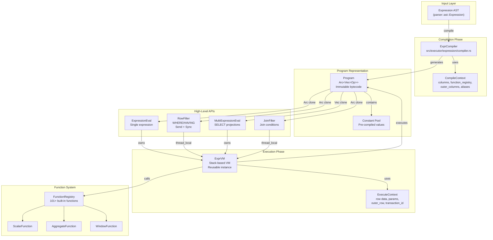

**Sources:** [src/executor/expression/mod.rs:1-56](), [src/executor/expression/evaluator_bridge.rs:1-50]()

### Key Design Principles

The expression VM is designed around four core principles:

| Principle | Implementation | Benefit |
|-----------|---------------|---------|
| **Zero Recursion** | Linear instruction sequences | Eliminates stack overflow risk |
| **Minimal Allocation** | Reusable stack, pre-allocated constants | Reduces GC pressure |
| **Fast Dispatch** | Direct enum match on `Op` | Avoids string comparisons |
| **Thread Safety** | `Arc<Program>` sharing | Safe parallel execution |

**Sources:** [src/executor/expression/mod.rs:20-24]()

---

## Compilation Phase

### ExprCompiler

The `ExprCompiler` transforms AST expressions into linear bytecode sequences. It performs a depth-first traversal of the expression tree, emitting instructions in execution order.

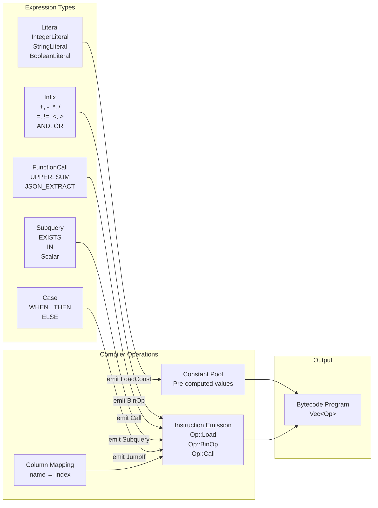

**Sources:** [src/executor/expression/compiler.rs]()

### CompileContext

The `CompileContext` provides compilation-time information:

```rust
// From src/executor/expression/compiler.rs
CompileContext {
    columns: Vec<String>,              // Current row columns
    function_registry: &FunctionRegistry,
    outer_columns: Option<Vec<String>>, // For correlated subqueries
    columns2: Option<Vec<String>>,      // Second row (joins)
    expression_aliases: FxHashMap<String, u16>, // HAVING clause aliases
    column_aliases: FxHashMap<String, String>,
}
```

**Sources:** [src/executor/expression/compiler.rs]()

### Compilation Example

The compilation of `WHERE age > 18 AND name LIKE 'A%'` produces:

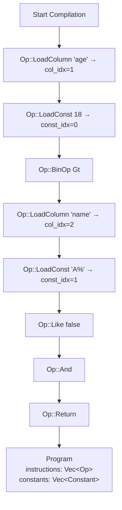

**Sources:** [src/executor/expression/compiler.rs](), [src/executor/expression/program.rs]()

---

## Execution Phase

### ExprVM

The `ExprVM` is a stack-based virtual machine that executes compiled programs. It maintains an execution stack and processes instructions sequentially.

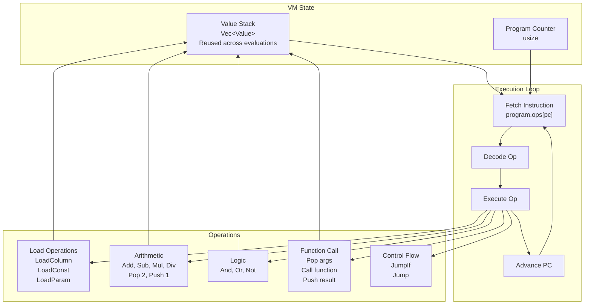

**Sources:** [src/executor/expression/vm.rs]()

### ExecuteContext

The `ExecuteContext` provides runtime data during execution:

```rust
// From src/executor/expression/vm.rs
ExecuteContext {
    row: &[Value],                     // Current row data
    row2: Option<&[Value]>,            // Second row (joins)
    params: &[Value],                  // Positional parameters
    named_params: &FxHashMap<String, Value>,
    outer_row: Option<&FxHashMap<Arc<str>, Value>>, // Correlated subquery
    transaction_id: Option<u64>,
}
```

**Sources:** [src/executor/expression/vm.rs]()

### Execution Flow

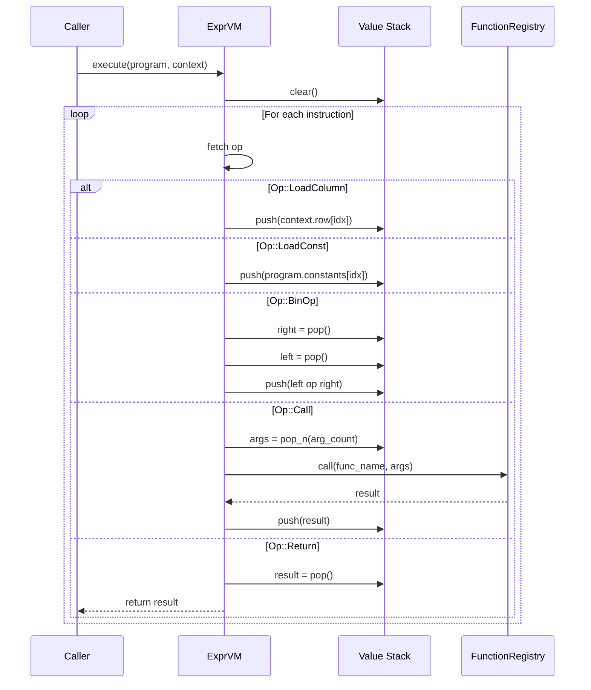

**Sources:** [src/executor/expression/vm.rs]()

---

## High-Level APIs

The expression system provides multiple APIs for different use cases:

### API Comparison

| API | Use Case | Thread Safety | Ownership |
|-----|----------|---------------|-----------|
| `ExpressionEval` | Single expression, serial evaluation | No | Owns VM |
| `RowFilter` | WHERE/HAVING, parallel filtering | Yes (Send + Sync) | Thread-local VM |
| `MultiExpressionEval` | SELECT projections | No | Owns VM |
| `JoinFilter` | Join conditions | Yes (Send + Sync) | Thread-local VM |
| `CompiledEvaluator` | Legacy, dynamic compilation | No | Owns VM, has cache |

**Sources:** [src/executor/expression/evaluator_bridge.rs:15-28]()

### ExpressionEval

The simplest API for evaluating a single expression repeatedly:

```rust
// From src/executor/expression/evaluator_bridge.rs:375-654
// Usage:
let mut eval = ExpressionEval::compile(&expr, &columns)?;
for row in rows {
    let value = eval.eval(&row)?;
}
```

**Methods:**
- `compile(expr, columns)` - Compile expression
- `eval(&mut self, row)` - Evaluate for row
- `eval_bool(&mut self, row)` - Boolean evaluation (WHERE/HAVING)
- `eval_slice(&mut self, row_data)` - Avoid Row wrapper overhead
- `with_params(params)` - Set query parameters
- `with_context(ctx)` - Set execution context

**Sources:** [src/executor/expression/evaluator_bridge.rs:375-654]()

### RowFilter

Thread-safe filter for parallel execution:

```rust
// From src/executor/expression/evaluator_bridge.rs:92-286
// Usage:
let filter = RowFilter::new(&where_expr, &columns)?;

// Use in closure (filter is cloned)
let predicate = move |row: &Row| filter.matches(row);

// Or parallel iteration
rows.par_iter().filter(|row| filter.matches(row)).collect()
```

**Architecture:**
- Pre-compiled `Arc<Program>` (shared across threads)
- Thread-local `ExprVM` instances (via `thread_local!`)
- Zero allocation in hot path

**Sources:** [src/executor/expression/evaluator_bridge.rs:92-286]()

### Thread Safety Implementation

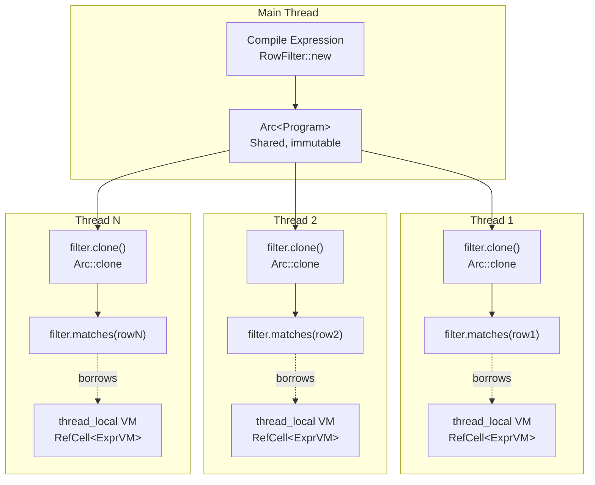

**Sources:** [src/executor/expression/evaluator_bridge.rs:222-250]()

### MultiExpressionEval

Efficient evaluation of multiple expressions (SELECT projections):

```rust
// From src/executor/expression/evaluator_bridge.rs:656-811
// Usage:
let mut eval = MultiExpressionEval::compile(&select_exprs, &columns)?;
for row in rows {
    let values = eval.eval_all(&row)?; // Returns Vec<Value>
}
```

**Optimization:**
- Single VM instance for all expressions
- Pre-compiled all expressions at once
- Reuses stack between expressions

**Sources:** [src/executor/expression/evaluator_bridge.rs:656-811]()

---

## Instruction Set

The VM instruction set (`Op` enum) provides primitive operations:

### Instruction Categories

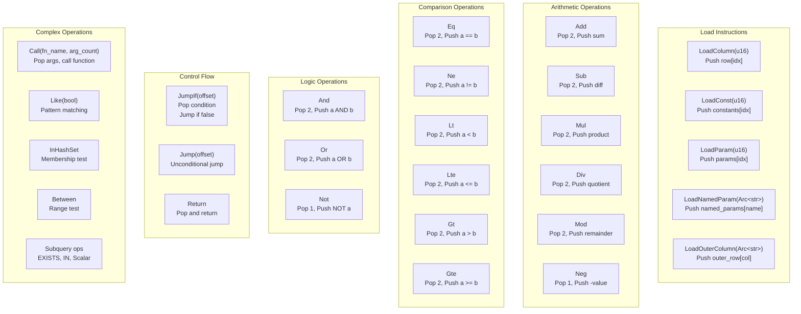

**Sources:** [src/executor/expression/ops.rs]()

### Instruction Format

The `Op` enum is defined in [src/executor/expression/ops.rs]():

```rust
pub enum Op {
    // Load operations
    LoadColumn(u16),           // Load from current row by index
    LoadConst(u16),            // Load from constant pool
    LoadParam(u16),            // Load positional parameter
    LoadNamedParam(Arc<str>),  // Load named parameter
    LoadOuterColumn(Arc<str>), // Load from outer row (correlated subquery)
    LoadColumn2(u16),          // Load from second row (joins)
    
    // Arithmetic
    Add, Sub, Mul, Div, Mod, Neg, Pow,
    
    // Comparison
    Eq, Ne, Lt, Lte, Gt, Gte,
    
    // Logic
    And, Or, Not,
    
    // String operations
    Concat, Like(bool), // bool = negated
    
    // Set operations
    In, InHashSet, NotIn,
    
    // Range operations
    Between(bool), // bool = negated
    
    // Null operations
    IsNull, IsNotNull, Coalesce(u8), // u8 = arg count
    
    // Function calls
    Call(Arc<str>, u8), // (function_name, arg_count)
    
    // Control flow
    JumpIf(i16),  // Jump offset if top of stack is false
    Jump(i16),    // Unconditional jump
    Return,       // Return top of stack
    
    // Subquery operations
    SubqueryScalar(Box<SelectStatement>),
    SubqueryExists(Box<SelectStatement>),
    SubqueryIn(Box<SelectStatement>),
    SubqueryNotIn(Box<SelectStatement>),
    SubqueryAny(Box<SelectStatement>, Operator),
    SubqueryAll(Box<SelectStatement>, Operator),
    
    // Type conversion
    Cast(Arc<str>), // type_name
}
```

**Sources:** [src/executor/expression/ops.rs]()

---

## Function Integration

The expression VM integrates with the function registry for built-in function calls:

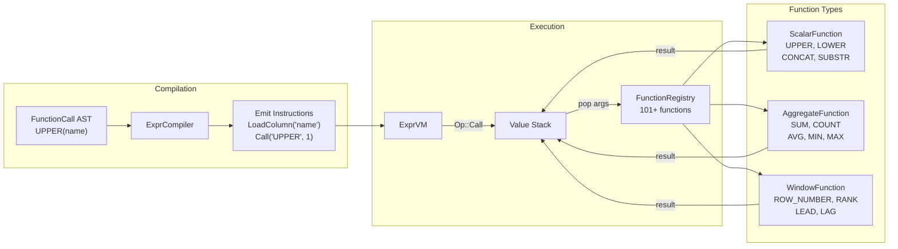

**Sources:** [src/executor/expression/vm.rs](), [src/functions/]()

### Function Call Execution

When the VM encounters `Op::Call(fn_name, arg_count)`:

1. **Pop arguments** from stack (in reverse order)
2. **Lookup function** in registry by name
3. **Invoke function** with arguments
4. **Push result** onto stack

**Sources:** [src/executor/expression/vm.rs]()

### Example: UPPER(name) Execution

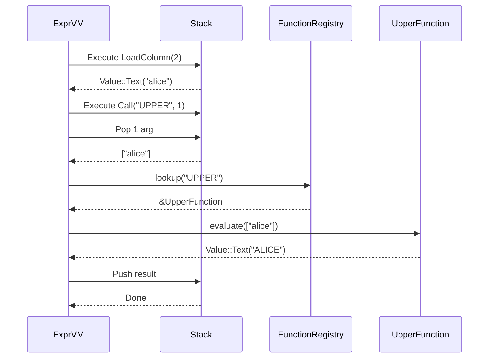

**Sources:** [src/executor/expression/vm.rs](), [src/functions/scalar/string.rs]()

---

## Expression Compilation Patterns

### Simple Expressions

**Input:** `age > 18`

**Bytecode:**
```
0: LoadColumn(1)      # Load 'age' column
1: LoadConst(0)       # Load constant 18
2: Gt                 # Compare >
3: Return
```

**Sources:** [src/executor/expression/compiler.rs]()

### Complex Expressions with AND/OR

**Input:** `age > 18 AND status = 'active'`

**Bytecode:**
```
0: LoadColumn(1)      # 'age'
1: LoadConst(0)       # 18
2: Gt
3: LoadColumn(2)      # 'status'
4: LoadConst(1)       # 'active'
5: Eq
6: And                # Combine conditions
7: Return
```

**Sources:** [src/executor/expression/compiler.rs]()

### CASE Expression

**Input:** `CASE WHEN age < 18 THEN 'minor' ELSE 'adult' END`

**Bytecode with control flow:**
```
0: LoadColumn(1)      # 'age'
1: LoadConst(0)       # 18
2: Lt
3: JumpIf(6)          # Jump to ELSE if false
4: LoadConst(1)       # 'minor'
5: Jump(7)            # Skip ELSE
6: LoadConst(2)       # 'adult' (ELSE)
7: Return
```

**Sources:** [src/executor/expression/compiler.rs]()

### Function Calls

**Input:** `CONCAT(first_name, ' ', last_name)`

**Bytecode:**
```
0: LoadColumn(0)      # 'first_name'
1: LoadConst(0)       # ' '
2: LoadColumn(1)      # 'last_name'
3: Call("CONCAT", 3)  # Call with 3 args
4: Return
```

**Sources:** [src/executor/expression/compiler.rs]()

---

## Performance Optimizations

### Constant Folding

The compiler pre-evaluates constant expressions:

**Input:** `price * 1.08`

**Optimization:** If `1.08` is identified as constant, it's stored in the constant pool once rather than computed per row.

**Sources:** [src/executor/expression/compiler.rs]()

### Stack Reuse

The VM maintains a persistent stack across evaluations:

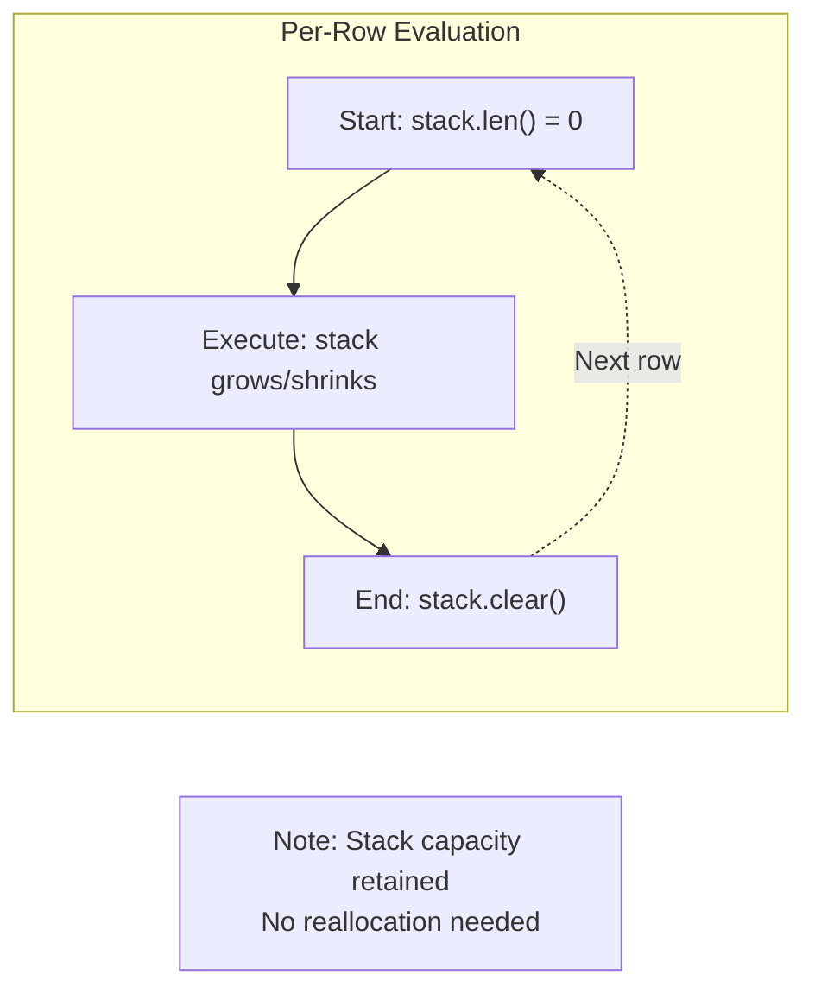

**Benefit:** Avoids repeated allocation of `Vec<Value>` for every row evaluation.

**Sources:** [src/executor/expression/vm.rs]()

### Program Sharing

Programs are immutable and wrapped in `Arc<Program>` for zero-cost sharing:

**Single Query:**
- Compile once: `Arc::new(program)`
- Clone Arc: Cheap pointer copy (8 bytes)
- Multiple threads: Each gets Arc clone, shares same bytecode

**Sources:** [src/executor/expression/evaluator_bridge.rs:814]()

### Thread-Local VMs

`RowFilter` uses thread-local VMs to avoid synchronization:

```rust
// From src/executor/expression/evaluator_bridge.rs:224-227
thread_local! {
    static VM: std::cell::RefCell<ExprVM> = std::cell::RefCell::new(ExprVM::new());
}
```

**Benefit:** Each thread has its own VM (with its own stack), avoiding lock contention while sharing the program.

**Sources:** [src/executor/expression/evaluator_bridge.rs:224-250]()

---

## Usage Examples

### WHERE Clause Filtering

```rust
// From usage in query executor
let filter = RowFilter::new(&where_expr, &columns)?
    .with_params(ctx.params().to_vec());

let filtered_rows: Vec<Row> = rows
    .into_iter()
    .filter(|row| filter.matches(row))
    .collect();
```

**Sources:** [src/executor/expression/evaluator_bridge.rs:111-135](), [src/executor/ddl.rs:735-763]()

### SELECT Projection

```rust
// From usage in query executor
let mut eval = MultiExpressionEval::compile(&select_exprs, &columns)?
    .with_context(&ctx);

let projected_rows: Vec<Row> = rows
    .into_iter()
    .map(|row| {
        let values = eval.eval_all(&row)?;
        Ok(Row::from_values(values))
    })
    .collect::<Result<Vec<_>>>()?;
```

**Sources:** [src/executor/expression/evaluator_bridge.rs:660-811]()

### HAVING Clause with Aggregate Aliases

```rust
// From aggregation executor
let aliases = vec![
    ("sum(amount)".to_string(), 2),  // aggregate result at index 2
    ("count(*)".to_string(), 3),
];

let filter = RowFilter::with_aliases(&having_expr, &result_columns, &aliases)?;

let filtered_groups: Vec<Row> = grouped_rows
    .into_iter()
    .filter(|row| filter.matches(row))
    .collect();
```

**Sources:** [src/executor/expression/evaluator_bridge.rs:140-182]()

### Correlated Subquery

```rust
// From subquery executor
let mut eval = ExpressionEval::compile(&subquery_expr, &inner_columns)?;

// For each outer row
for outer_row in outer_rows {
    // Set outer context
    let outer_map: FxHashMap<String, Value> = outer_columns
        .iter()
        .zip(outer_row.as_slice())
        .map(|(col, val)| (col.clone(), val.clone()))
        .collect();
    
    eval.set_outer_row(&outer_map);
    
    // Evaluate subquery with outer context
    let result = eval.eval(&inner_row)?;
}
```

**Sources:** [src/executor/expression/evaluator_bridge.rs:544-556](), [src/api/transaction.rs:214-216]()

---

## Integration with Query Execution

The expression VM is used throughout the query execution pipeline:

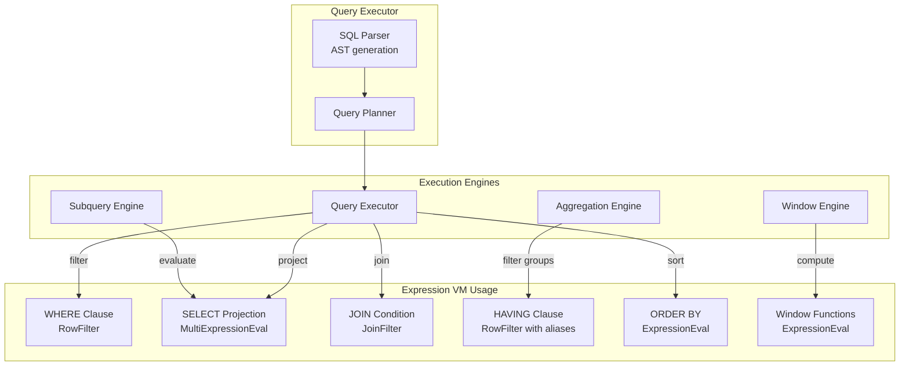

**Sources:** [src/executor/query.rs](), [src/executor/aggregation/](), [src/executor/window/]()

---

## Comparison with Legacy Evaluator

The `CompiledEvaluator` (deprecated) vs new APIs:

| Aspect | CompiledEvaluator (Deprecated) | New APIs (ExpressionEval, RowFilter) |
|--------|-------------------------------|-------------------------------------|
| **Compilation** | Lazy (per expression) | Eager (upfront) |
| **Caching** | Internal FxHashMap cache | Pre-compiled Arc<Program> |
| **Thread Safety** | No (mutable cache) | Yes (RowFilter is Send + Sync) |
| **API Complexity** | Complex (many methods) | Simple (focused APIs) |
| **Use Case** | General purpose | Specialized per use case |
| **Performance** | Good | Better (no cache lookup) |

**Migration Example:**

```rust
// Old: CompiledEvaluator
let mut eval = CompiledEvaluator::new(&registry);
eval.init_columns(&columns);
for row in rows {
    eval.set_row_array(&row);
    let value = eval.evaluate(&expr)?;
}

// New: ExpressionEval
let mut eval = ExpressionEval::compile(&expr, &columns)?;
for row in rows {
    let value = eval.eval(&row)?;
}
```

**Sources:** [src/executor/expression/evaluator_bridge.rs:818-867]()

---

## Error Handling

The expression VM propagates errors through `Result<Value>`:

**Common Error Types:**
- **Compile errors** - Invalid column references, unknown functions
- **Runtime errors** - Division by zero, type mismatches, function errors
- **Subquery errors** - Multiple rows for scalar subquery

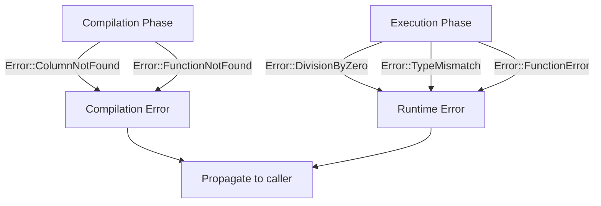

**Sources:** [src/executor/expression/compiler.rs](), [src/executor/expression/vm.rs](), [src/core/error.rs]()