# Page: Future Vision: Modern Mainframe

# Future Vision: Modern Mainframe

<details>
<summary>Relevant source files</summary>

The following files were used as context for generating this wiki page:

- [.gitignore](.gitignore)
- [README.md](README.md)
- [ROADMAP.md](ROADMAP.md)
- [docs/_config.yml](docs/_config.yml)

</details>


## Purpose and Scope

This document describes OxiBase's planned evolution from an embedded SQL database into a distributed "Modern Mainframe" architecture. It outlines the transformation from a single-process MVCC storage engine into a self-managing, unikernel-based distributed system capable of millions of transactions per second.

For information about the current embedded architecture, see [Architecture Overview](#1.2). For current MVCC implementation details, see [MVCC Architecture](#4.1). For current storage engine features, see [Storage Engine](#4).

**Sources**: [README.md:31-80](), [ROADMAP.md:1-115]()

---

## Architectural Philosophy

The Modern Mainframe paradigm rejects the separation of "application server" and "database server" inherited from hardware constraints that no longer exist. Instead, OxiBase positions the database as the active computational core, co-locating logic and data to eliminate network latency and serialization overhead.

### Infrastructure as Data

The fundamental principle: cluster configuration, sharding protocols, access controls, and deployment procedures manifest as transactional rows in system catalog tables. Mutations to the `sys_nodes` table trigger autonomous cluster reconfiguration. This eliminates external orchestration frameworks like Kubernetes.

### Unikernel-First Design

By compiling OxiBase into specialized machine images containing only database and application logic, the system eliminates general-purpose OS overhead. The application becomes synonymous with the kernel, with no intermediary user space layer.

**Sources**: [README.md:39-69]()

---

## Evolution Path: Four Phases

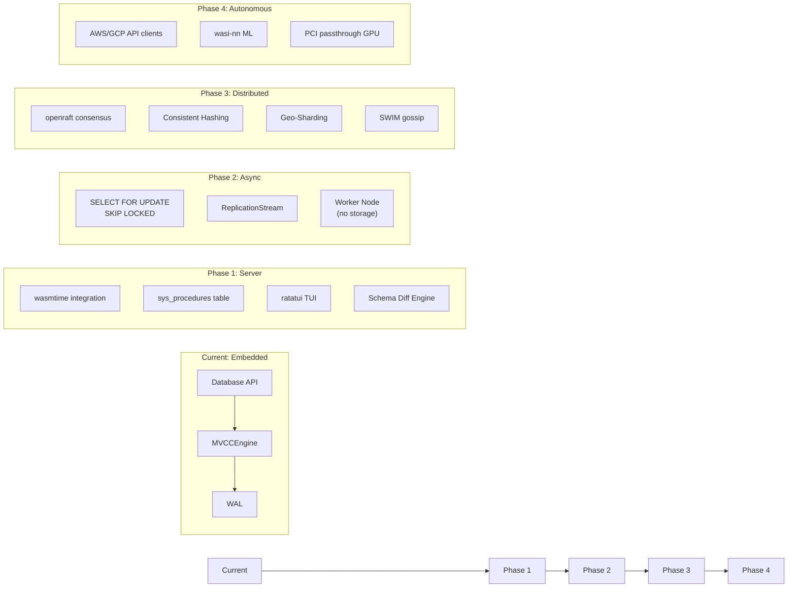

**Sources**: [ROADMAP.md:3-115]()

---

## Phase 1: Database as Server

**Goal**: Eliminate separate backend API layers (Deno/Python/Node.js) and external migration tools.

### WebAssembly Stored Procedures

The core innovation embeds `wasmtime` (WebAssembly runtime) directly into the database kernel. User functions compile to Wasm bytecode and execute inside transaction boundaries.

#### Architecture

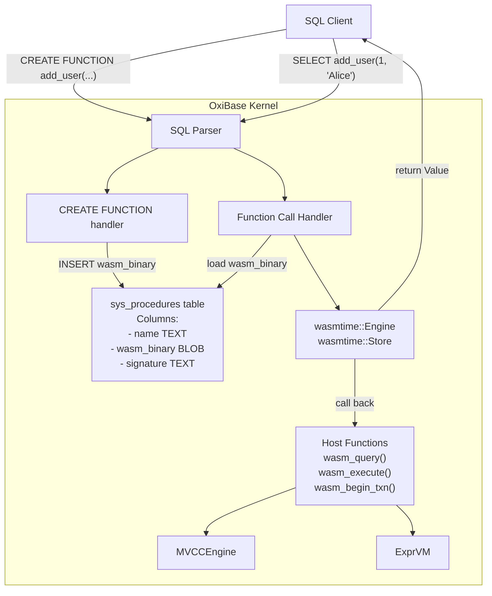

**Key Implementation Details**:

| Component | Technology | Purpose |
|-----------|-----------|---------|
| Runtime | `wasmtime` crate | Execute Wasm bytecode with sandboxing |
| Storage | `sys_procedures` system table | Store compiled Wasm binaries |
| Interface | Host functions (linker exports) | Zero-copy memory sharing between Wasm and SQL engine |
| Isolation | WASI permissions | Restrict filesystem/network access per function |

**Host Function API** (planned):
```rust
// Callable from Wasm guest code
fn wasm_query(sql: *const u8, sql_len: usize) -> i32;
fn wasm_execute(sql: *const u8, sql_len: usize) -> i32;
fn wasm_begin_txn() -> i32;
fn wasm_commit_txn(txn_id: i32) -> i32;
```

This allows business logic (written in Rust, TypeScript, Python) to run inside the transaction boundary, accessing the `MVCCEngine` without network round-trips.

**Sources**: [ROADMAP.md:7-12](), [README.md:72-75]()

---

### Terminal User Interface (TUI)

A `ratatui`-based terminal interface provides vim-like table navigation, procedure debugging, and real-time performance monitoring.

#### Features

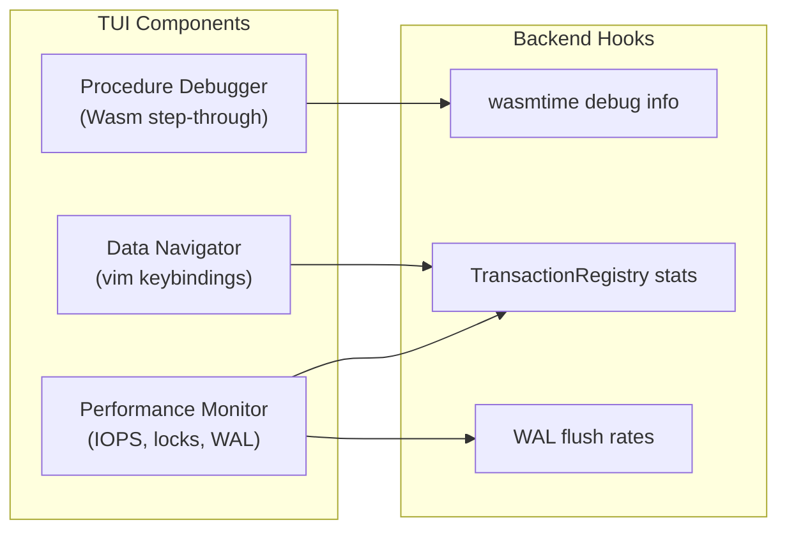

The debugger leverages `wasmtime`'s debug capabilities to pause execution, inspect stack frames, and view variable states directly in the terminal.

**Sources**: [ROADMAP.md:14-21]()

---

### Declarative Schema Migration

Rejects imperative "up/down" migration scripts. Users define desired end-state schemas; the built-in Schema Diff Engine calculates and executes changes atomically.

#### Schema Diff Engine Architecture

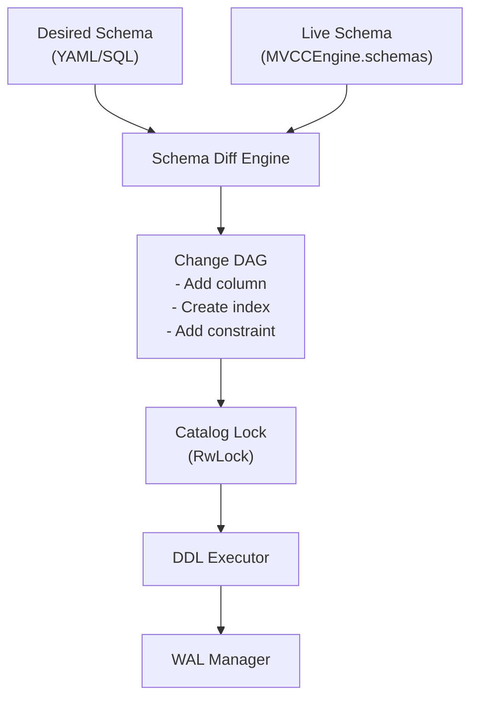

**Online DDL Capabilities**:
- Non-blocking column additions (append-only schema evolution)
- Index creation with concurrent reads
- Conflict detection for destructive changes

This integrates with the existing `DDLExecutor` at [src/executor/ddl.rs](), extending it to support declarative diffing.

**Sources**: [ROADMAP.md:23-28]()

---

## Phase 2: Async Engine

**Goal**: Eliminate external message brokers (Kafka/RabbitMQ) and enable elastic compute scaling.

### Persistent Queues via SKIP LOCKED

Tables become queues. A "job" is a row with a status column. Multiple consumers grab distinct jobs without blocking.

#### SQL Syntax

```sql
-- Consumer 1 (thread/node)
BEGIN;
SELECT * FROM jobs 
WHERE status = 'pending' 
ORDER BY created_at 
LIMIT 10
FOR UPDATE SKIP LOCKED;

UPDATE jobs SET status = 'processing', worker_id = 'node-1' 
WHERE id IN (...);
COMMIT;
```

#### Implementation Approach

Modifies the MVCC scanner in `VersionStore` to:
1. Check `is_visible()` for transaction isolation
2. Skip rows already locked by other transactions (`uncommitted_writes` tracking)
3. Acquire row locks only for successfully fetched rows

**Code Integration Points**:
- Extend `VersionStore::scan()` at [src/storage/mvcc/version_store.rs]()
- Add lock checking to version visibility logic
- Track lock ownership in `TransactionRegistry`

**Sources**: [ROADMAP.md:34-39]()

---

### WAL Replication for High Availability

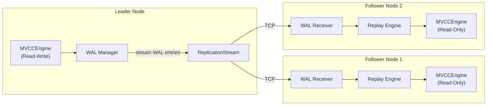

**Implementation Plan**:
1. Add `ReplicationStream` trait to `WALManager` at [src/storage/mvcc/wal.rs]()
2. Stream `WALEntry` records over TCP
3. Followers replay entries into their local `VersionStore`
4. Use existing two-phase replay mechanism from crash recovery

This provides read scalability while maintaining single-writer consistency.

**Sources**: [ROADMAP.md:41-45]()

---

### Worker Nodes: Compute-Storage Separation

A new node type with no storage engine. Worker nodes pull data from Data nodes, execute Wasm logic, and return results.

#### Topology

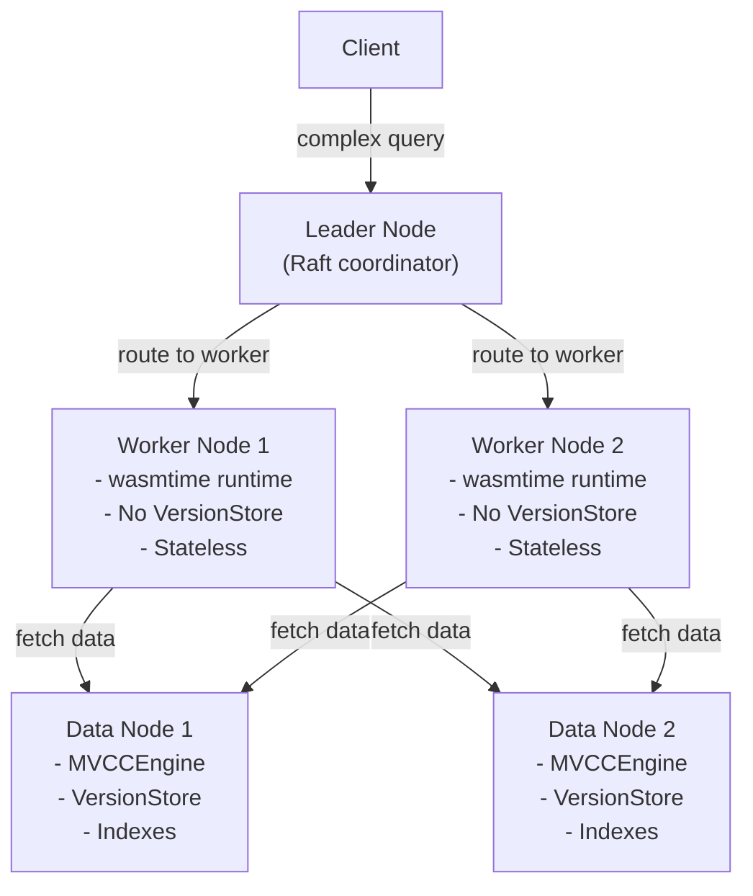

**Design Principles**:
- Workers spawn/terminate elastically based on load
- Stateless: can be killed without data loss
- Pull-based: workers fetch data over network RPC
- Compute-intensive: run aggregations, Wasm procedures, joins

**Sources**: [ROADMAP.md:47-56]()

---

## Phase 3: Distributed System

**Goal**: Horizontal scalability with linearizable consistency and geo-replication.

### Multi-Master Consensus via Raft

Transition from simple WAL replication to consensus-based replication using `openraft`.

#### Raft Integration Architecture

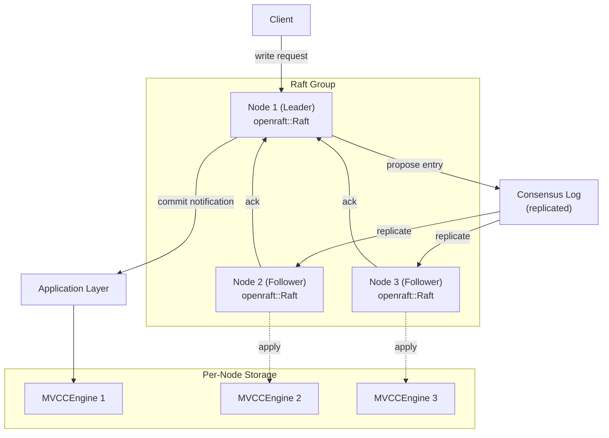

**Key Properties**:
- **Linearizable consistency**: All nodes agree on write order
- **Leader election**: Automatic failover if leader crashes
- **Log compaction**: Snapshot mechanism to prevent unbounded growth

**Implementation Strategy**:
1. Wrap `MVCCEngine` as a Raft state machine
2. Translate SQL writes to Raft log entries
3. Apply committed entries to `VersionStore`

**Sources**: [ROADMAP.md:63-67]()

---

### Sharding via Consistent Hashing

Automatic data distribution across nodes using ring topology.

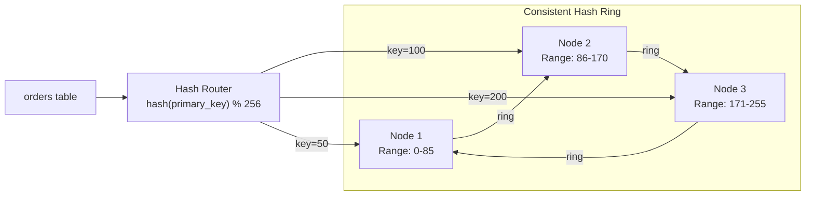

**Rebalancing Process**:
1. New node joins cluster
2. Cluster calculates shard ownership (consistent hash)
3. Existing nodes stream SSTables (from `VersionStore`) to new node
4. Atomic cutover when data synchronized

This integrates with the existing `VersionStore` structure at [src/storage/mvcc/version_store.rs]().

**Sources**: [ROADMAP.md:69-74]()

---

### Geo-Sharding for Locality

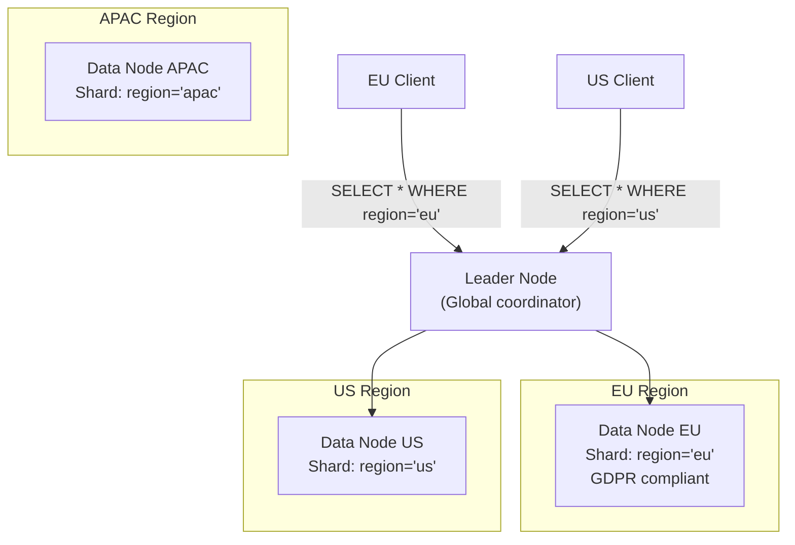

**SQL Syntax**:
```sql
CREATE TABLE users (
    id INTEGER PRIMARY KEY,
    region TEXT,
    name TEXT
) PARTITION BY LIST (region);

CREATE TABLE users_eu PARTITION OF users
    FOR VALUES IN ('eu-west', 'eu-central');
    
CREATE TABLE users_us PARTITION OF users
    FOR VALUES IN ('us-east', 'us-west');
```

**Benefits**:
- Regulatory compliance (GDPR: EU data stays in EU)
- Latency optimization (speed of light)
- Failure isolation (regional outage doesn't affect global cluster)

**Sources**: [ROADMAP.md:76-79]()

---

### SWIM Gossip Protocol

Scalable Weakly-consistent Infection-style Process Group Membership for failure detection.

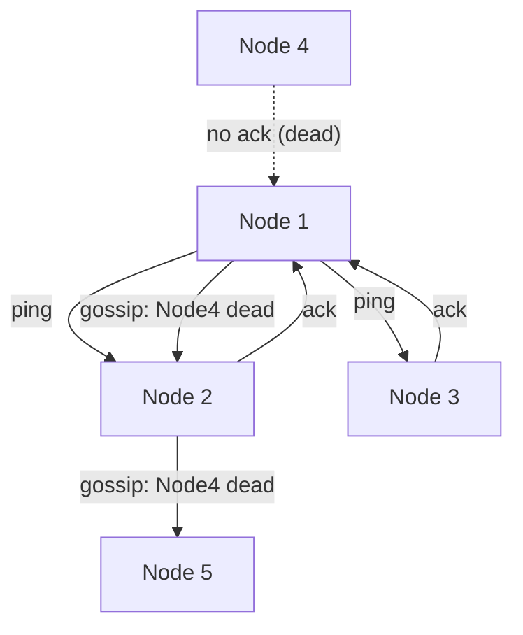

**Failure Detection**:
1. Nodes send periodic heartbeats
2. If node stops responding, mark as "suspicious"
3. Gossip suspicion to cluster
4. If multiple nodes agree, mark node as dead
5. Trigger automatic rebalancing

No central coordination required (no Zookeeper dependency).

**Sources**: [ROADMAP.md:81-84]()

---

## Phase 4: Autonomous Cloud

**Goal**: Self-managing infrastructure and AI platform capabilities.

### Infrastructure as Data: Auto-Scaling

The database directly manages its own cloud resources.

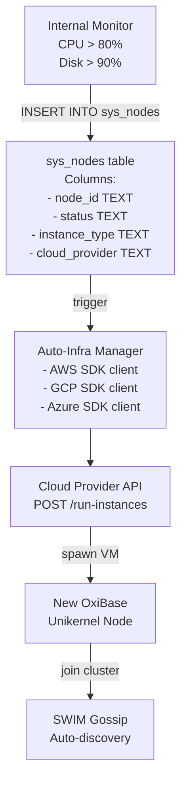

**Workflow**:
1. `Monitor` detects high load (CPU > 80%)
2. Inserts row into `sys_nodes`: `status='pending_creation'`
3. `AutoInfra` background thread polls `sys_nodes`
4. Executes cloud API: `aws ec2 run-instances --image-id oxibase-unikernel`
5. New node boots, reads cluster config from consensus
6. Joins via SWIM gossip
7. Updates `sys_nodes`: `status='active'`

**Self-Termination**:
```sql
-- User deletes row
DELETE FROM sys_nodes WHERE node_id = 'node-xyz';

-- AutoInfra intercepts, calls:
-- aws ec2 terminate-instances --instance-ids i-xyz
```

This eliminates Terraform, Ansible, and Kubernetes operators.

**Sources**: [ROADMAP.md:91-96](), [README.md:55-60]()

---

### In-Database Machine Learning

#### wasi-nn Integration

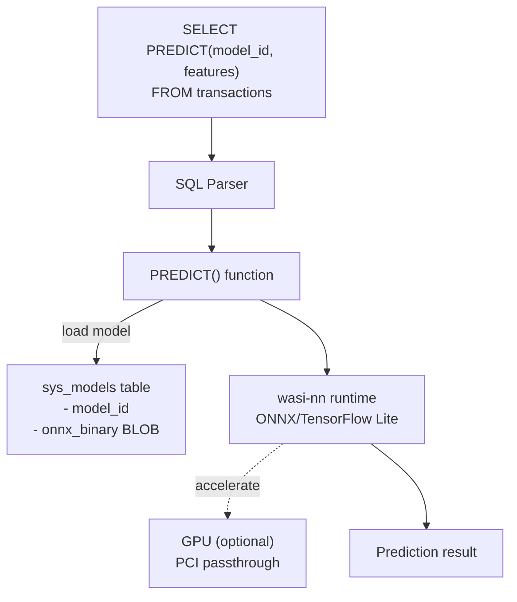

**Use Cases**:
- Real-time fraud detection within transaction scope
- Recommendation systems (query-time inference)
- Anomaly detection in streaming data

**Zero-Copy GPU Access**:
For unikernels, GPU memory can be mapped directly into the OxiBase address space via PCI passthrough. No copying data over PCIe to user-space and back.

**Sources**: [ROADMAP.md:98-102](), [ROADMAP.md:104-109]()

---

### Federated Learning (Phase 4 Endgame)

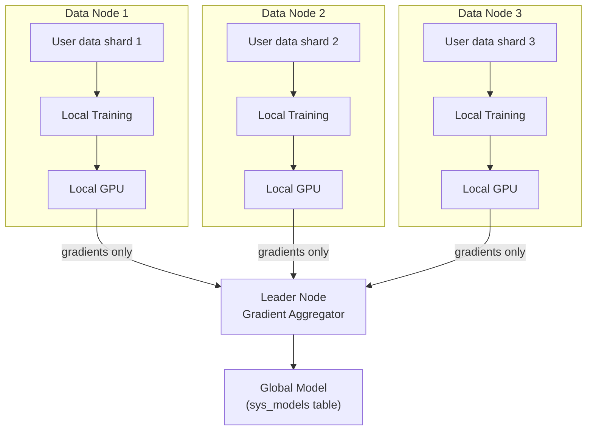

**Key Properties**:
- **Data never moves**: Each node trains on its local shard
- **Gradient aggregation**: Leader combines weight updates using federated averaging
- **Privacy preserving**: Satisfies GDPR (raw data never leaves region)
- **Petabyte scale**: Train on full dataset without network bottlenecks

**Sources**: [ROADMAP.md:111-115]()

---

## Current vs Future State Comparison

| Aspect | Current (Embedded) | Future (Mainframe) |
|--------|-------------------|-------------------|
| **Deployment** | Single process, library linking | Distributed unikernel cluster |
| **Logic Location** | Application code (Rust/Python/JS) | Wasm stored procedures inside DB |
| **Scaling** | Vertical (bigger machine) | Horizontal (add nodes dynamically) |
| **Orchestration** | Manual (systemd/Docker) | Self-managing (`sys_nodes` table) |
| **Consistency** | ACID (single node) | Linearizable (Raft consensus) |
| **Replication** | WAL snapshots (manual restore) | Continuous Raft replication |
| **Sharding** | None (single database file) | Automatic consistent hashing |
| **Queues** | External (Redis/RabbitMQ) | Built-in (`SELECT FOR UPDATE SKIP LOCKED`) |
| **Schema Migration** | External tools (Flyway/Liquibase) | Declarative diff engine |
| **ML Inference** | External service | In-database (`wasi-nn`) |
| **Infrastructure** | External (Terraform/K8s) | Self-provisioning (cloud API clients) |

**Sources**: [README.md:22-27](), [README.md:39-80]()

---

## Code Entity Mapping: Current → Future

The following table maps existing code modules to their future distributed equivalents:

| Current Module | Future Component | Status |
|----------------|------------------|--------|
| `src/api/database.rs` | Leader Node API | Extends to route queries |
| `src/storage/mvcc/engine.rs` (`MVCCEngine`) | Data Node Storage | Becomes sharded instance |
| `src/storage/mvcc/wal.rs` (`WALManager`) | `ReplicationStream` | Add streaming interface |
| `src/storage/mvcc/transaction_registry.rs` | Distributed Transaction Coordinator | Add 2PC for cross-shard txns |
| `src/executor/query.rs` (`QueryExecutor`) | Worker Node Executor | Becomes stateless |
| `src/parser/` | Unchanged | Same SQL parser |
| (new) | `wasmtime::Engine` | Stored procedure runtime |
| (new) | `openraft::Raft` | Consensus layer |
| (new) | `sys_procedures` table | Wasm binary storage |
| (new) | `sys_nodes` table | Cluster topology |
| (new) | `sys_models` table | ML model storage |
| (new) | `ratatui` TUI | Developer interface |
| (new) | SWIM gossip | Failure detection |
| (new) | Auto-Infra Manager | Cloud API integration |

**Sources**: [src/api/database.rs](), [src/storage/mvcc/engine.rs](), [src/storage/mvcc/wal.rs](), [src/executor/query.rs]()

---

## Implementation Timeline

Based on the phased roadmap:

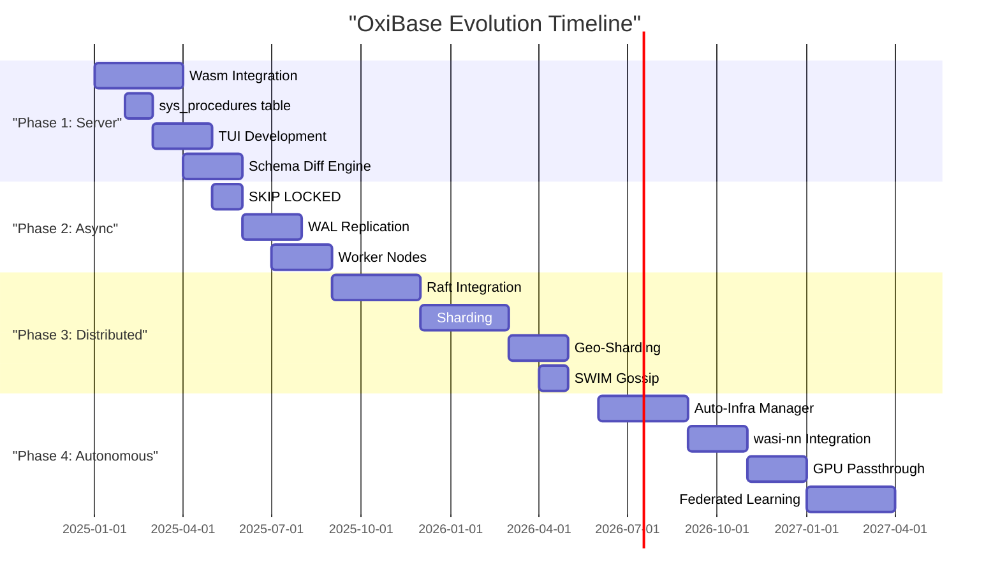

**Sources**: [ROADMAP.md:3-115]()

---

## Migration Path for Users

Current users of the embedded library can migrate incrementally:

### Step 1: Library → Stored Procedures
```rust
// Before: Application logic in Rust
let result = db.query("SELECT * FROM users WHERE active = true")?;
for row in result {
    send_email(row.get("email")?);
}

// After: Logic in Wasm stored procedure
db.execute(r#"
    CREATE FUNCTION notify_active_users() RETURNS INTEGER
    LANGUAGE wasm
    AS $$ /* Wasm binary */ $$
"#)?;

db.execute("SELECT notify_active_users()")?;
```

### Step 2: Single Node → Replicated Cluster
```sql
-- Create follower nodes
INSERT INTO sys_nodes (node_id, role, endpoint)
VALUES 
    ('follower-1', 'read-replica', 'https://10.0.1.10:5432'),
    ('follower-2', 'read-replica', 'https://10.0.1.11:5432');

-- Writes still go to leader, reads distributed automatically
```

### Step 3: Enable Consensus
```sql
-- Promote cluster to multi-master
ALTER CLUSTER SET consensus_mode = 'raft';

-- Now linearizable writes across all nodes
```

**Sources**: [ROADMAP.md:3-12]()

---

## Open Research Questions

Several technical challenges remain:

1. **Wasm-to-SQL zero-copy memory sharing**: How to avoid serialization overhead when Wasm calls back into SQL engine?
2. **Cross-shard transactions**: Implement two-phase commit while maintaining MVCC snapshot isolation guarantees.
3. **Unikernel GPU drivers**: PCI passthrough for Nvidia GPUs without proprietary kernel modules.
4. **Adaptive sharding**: Automatically detect hotspots and split/merge shards based on load.
5. **Consensus performance**: Can Raft keep up with millions of transactions per second? May need custom consensus protocol.

**Sources**: [README.md:41-49]()