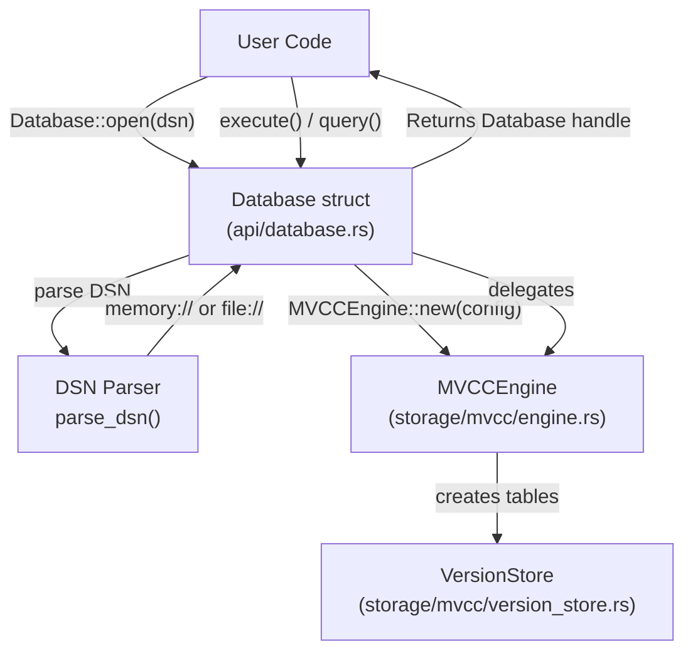
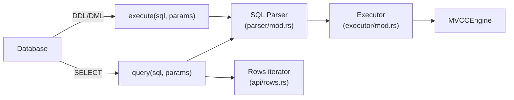
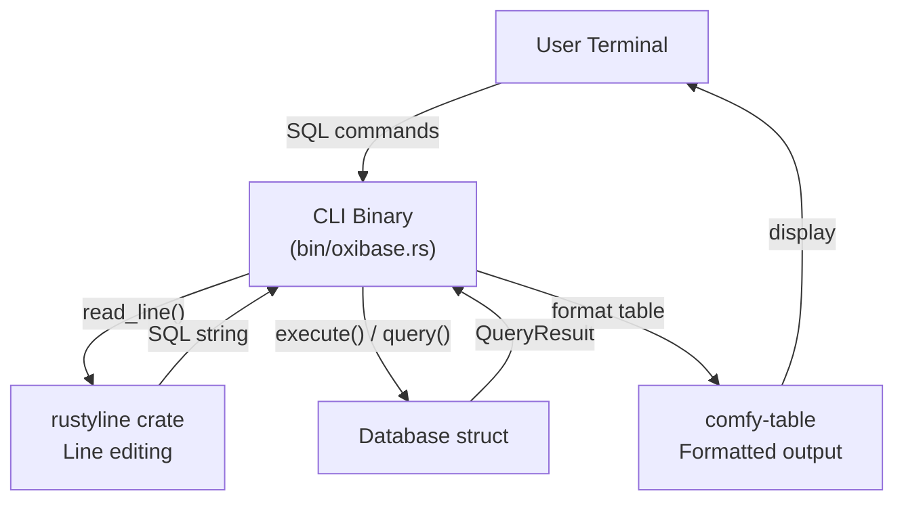
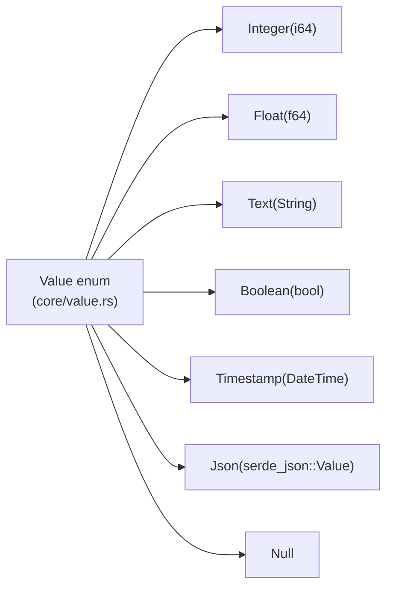

# Page: Getting Started

# Getting Started

<details>
<summary>Relevant source files</summary>

The following files were used as context for generating this wiki page:

- [.github/workflows/ci.yml](.github/workflows/ci.yml)
- [.gitignore](.gitignore)
- [Cargo.toml](Cargo.toml)
- [README.md](README.md)
- [ROADMAP.md](ROADMAP.md)
- [docs/_config.yml](docs/_config.yml)
- [src/lib.rs](src/lib.rs)

</details>


This guide provides quick start instructions for installing and using OxiBase. It covers installation methods, basic usage patterns as both a library and command-line tool, and your first queries. For detailed API documentation, see [Database API](#2.1). For architectural concepts, see [Architecture Overview](#1.2).

## Installation

OxiBase can be used as a Rust library or as a standalone command-line tool. Multiple installation methods are available depending on your use case.

### Installation Methods

| Method | Use Case | Command |
|--------|----------|---------|
| **Cargo Dependency** | Embed in Rust application | Add to `Cargo.toml` |
| **Build from Source** | Development or customization | `cargo build --release` |
| **Pre-built Binaries** | CLI usage without Rust toolchain | Download from GitHub releases |

#### As a Rust Library

Add OxiBase to your `Cargo.toml`:

```toml
[dependencies]
oxibase = "0.1"
```

The library exposes the `oxibase` crate with the main `Database` struct in the `api` module.

**Sources:** [Cargo.toml:1-13](), [README.md:102-108]()

#### Build from Source

```bash
git clone https://github.com/oxibase/oxibase.git
cd oxibase
cargo build --release
```

The compiled binary will be available at `target/release/oxibase` (or `oxibase.exe` on Windows). The CLI binary requires the `cli` feature, which is enabled by default.

**Sources:** [README.md:110-124](), [Cargo.toml:19-22]()

#### Platform Support

OxiBase builds and runs on:

- **Linux**: `x86_64-unknown-linux-gnu`, `aarch64-unknown-linux-gnu`
- **macOS**: `x86_64-apple-darwin`, `aarch64-apple-darwin` (Apple Silicon)
- **Windows**: `x86_64-pc-windows-msvc`

CI pipelines validate all platforms on every commit.

**Sources:** [.github/workflows/ci.yml:40-66](), [.github/workflows/ci.yml:123-183]()

## Basic Library Usage

### Connection Flow



**Sources:** [src/api/database.rs]() (implied from lib.rs exports), [src/storage/mvcc/engine.rs]() (implied from lib.rs exports)

### In-Memory Database

The simplest way to start is with an in-memory database using `Database::open_in_memory()`:

```rust
use oxibase::api::Database;

fn main() -> Result<(), Box<dyn std::error::Error>> {
    // Open in-memory database
    let db = Database::open_in_memory()?;
    
    // Create table
    db.execute("CREATE TABLE users (id INTEGER PRIMARY KEY, name TEXT)", ())?;
    
    // Insert data
    db.execute("INSERT INTO users VALUES (1, 'Alice')", ())?;
    
    // Query data
    for row in db.query("SELECT * FROM users", ())? {
        let row = row?;
        println!("{}: {}", row.get::<i64>(0)?, row.get::<String>(1)?);
    }
    
    Ok(())
}
```

The `Database::open_in_memory()` method creates a new `MVCCEngine` with `PersistenceConfig::InMemory`, meaning all data is stored in RAM and lost when the process exits.

**Sources:** [README.md:128-146](), [src/lib.rs:36-53]()

### File-Based Persistence

For durable storage, use a `file://` DSN:

```rust
use oxibase::api::Database;

fn main() -> Result<(), Box<dyn std::error::Error>> {
    // Open persistent database
    let db = Database::open("file:///var/lib/oxibase/data")?;
    
    db.execute("CREATE TABLE products (
        id INTEGER PRIMARY KEY,
        name TEXT,
        price FLOAT
    )", ())?;
    
    db.execute("INSERT INTO products VALUES (1, 'Widget', 9.99)", ())?;
    
    // Data persists across restarts
    Ok(())
}
```

File-based databases use:
- **Write-Ahead Log (WAL)**: All changes logged to `wal.log` before applied ([storage/persistence/wal_manager.rs]())
- **Snapshots**: Periodic checkpoints written to `snapshot_*.db` files ([storage/persistence/manager.rs]())
- **Index persistence**: BTree, Hash, and Bitmap indexes saved and restored

**Sources:** [README.md:348-363](), [src/storage/config.rs]() (implied from lib.rs exports), [src/lib.rs:114-124]()

### Query Execution Flow



**Sources:** [src/api/database.rs]() (implied), [src/parser/mod.rs]() (implied), [src/executor/mod.rs]() (implied)

## Working with Query Results

### Reading Row Data

The `query()` method returns a `Rows` iterator that yields `ResultRow` objects:

```rust
use oxibase::api::Database;

let db = Database::open_in_memory()?;
db.execute("CREATE TABLE metrics (
    timestamp TIMESTAMP,
    value FLOAT,
    label TEXT
)", ())?;

// Query returns Rows iterator
let rows = db.query("SELECT timestamp, value, label FROM metrics WHERE value > 100", ())?;

for row in rows {
    let row = row?;
    
    // Get values by index (0-based)
    let timestamp = row.get::<String>(0)?;  // Column 0
    let value = row.get::<f64>(1)?;         // Column 1
    let label = row.get::<String>(2)?;      // Column 2
    
    println!("{}: {} ({})", timestamp, value, label);
}
```

The `row.get::<T>(index)` method performs type conversion from the internal `Value` enum to Rust types. Supported conversions include:
- `i64` for INTEGER
- `f64` for FLOAT
- `String` for TEXT
- `bool` for BOOLEAN

**Sources:** [README.md:138-145](), [src/lib.rs:148-151]() (API exports)

### Transactions

Use the `transaction()` method for multi-statement ACID operations:

```rust
use oxibase::api::Database;

let db = Database::open_in_memory()?;
db.execute("CREATE TABLE accounts (id INTEGER PRIMARY KEY, balance FLOAT)", ())?;
db.execute("INSERT INTO accounts VALUES (1, 1000.0), (2, 500.0)", ())?;

// Begin transaction
let mut txn = db.transaction()?;

// Transfer money (debit one account, credit another)
txn.execute("UPDATE accounts SET balance = balance - 100 WHERE id = 1", ())?;
txn.execute("UPDATE accounts SET balance = balance + 100 WHERE id = 2", ())?;

// Commit atomically
txn.commit()?;

// Or rollback on error
// txn.rollback()?;
```

Transactions provide:
- **Atomicity**: All changes commit or none do
- **Isolation**: Read Committed or Snapshot isolation levels
- **Consistency**: Constraints enforced
- **Durability**: Changes persisted to WAL before commit returns

For isolation level details, see [Transactions](#2.2) and [Concurrency Control](#6.2).

**Sources:** [README.md:158-173](), [src/storage/mvcc/transaction.rs]() (implied from lib.rs exports)

## Command-Line Interface

### REPL Mode

Start the interactive REPL by running the binary without arguments:

```bash
./oxibase
```

Or for persistent storage:

```bash
./oxibase --db "file:///path/to/data"
```



The CLI binary is defined at [src/bin/oxibase.rs]() and requires the `cli` feature, which includes:
- `rustyline`: Line editing and history (similar to readline)
- `comfy-table`: Pretty-printed table output
- `clap`: Command-line argument parsing
- `dirs`: Platform-specific config directories

**Sources:** [Cargo.toml:19-22](), [Cargo.toml:56-59](), [Cargo.toml:94-96]()

### Direct Query Execution

Execute a query directly without entering REPL mode:

```bash
./oxibase -q "SELECT 1 + 1"
```

This is useful for:
- Shell scripts
- CI/CD pipelines
- One-off queries

**Sources:** [README.md:148-154]()

## Configuration Options

### DSN Format

The Data Source Name (DSN) string controls connection behavior:

| DSN Pattern | Storage Mode | Persistence | Use Case |
|-------------|--------------|-------------|----------|
| `memory://` | In-memory | None | Testing, temporary data |
| `file:///absolute/path` | File-based | WAL + Snapshots | Production, durable storage |
| (empty string) | In-memory | None | Same as `memory://` |

The DSN is parsed by the `parse_dsn()` function in the `Database` implementation.

**Sources:** [README.md:348-357]()

### Persistence Configuration

File-based databases use `PersistenceConfig` with these defaults:

- **WAL buffer size**: `DEFAULT_WAL_BUFFER_SIZE` bytes
- **WAL flush trigger**: `DEFAULT_WAL_FLUSH_TRIGGER` entries
- **WAL max size**: `DEFAULT_WAL_MAX_SIZE` bytes
- **Snapshot interval**: `DEFAULT_SNAPSHOT_INTERVAL` seconds
- **Keep snapshots**: `DEFAULT_KEEP_SNAPSHOTS` files

These constants are defined in [src/storage/persistence/manager.rs]().

**Sources:** [src/lib.rs:119-124]()

## Data Types and Basic Queries

### Supported Data Types



| SQL Type | Rust Type | Example Values |
|----------|-----------|----------------|
| `INTEGER` | `i64` | `42`, `-100`, `0` |
| `FLOAT` | `f64` | `3.14`, `-0.001`, `1e10` |
| `TEXT` | `String` | `'hello'`, `'世界'` |
| `BOOLEAN` | `bool` | `TRUE`, `FALSE` |
| `TIMESTAMP` | `chrono::DateTime` | `'2024-01-15 10:30:00'` |
| `JSON` | `serde_json::Value` | `'{"key": "value"}'` |

**Sources:** [README.md:313-323](), [src/lib.rs:76-79]()

### Basic Query Examples

```rust
use oxibase::api::Database;

let db = Database::open_in_memory()?;

// CREATE TABLE with constraints
db.execute("
    CREATE TABLE employees (
        id INTEGER PRIMARY KEY,
        name TEXT NOT NULL,
        department TEXT,
        salary FLOAT,
        hire_date TIMESTAMP
    )
", ())?;

// INSERT with multiple rows
db.execute("
    INSERT INTO employees VALUES
        (1, 'Alice', 'Engineering', 120000.0, '2023-01-15 09:00:00'),
        (2, 'Bob', 'Sales', 85000.0, '2023-03-20 10:00:00'),
        (3, 'Carol', 'Engineering', 110000.0, '2023-02-10 09:00:00')
", ())?;

// SELECT with WHERE clause
let rows = db.query("
    SELECT name, salary 
    FROM employees 
    WHERE department = 'Engineering' AND salary > 100000
", ())?;

// UPDATE
db.execute("
    UPDATE employees 
    SET salary = salary * 1.05 
    WHERE department = 'Engineering'
", ())?;

// DELETE
db.execute("DELETE FROM employees WHERE id = 2", ())?;
```

**Sources:** [README.md:128-146](), [README.md:162-167]()

## Indexes

OxiBase automatically selects optimal index types based on query patterns, but you can specify them explicitly:

```rust
// B-tree index (default) - for range queries and sorting
db.execute("CREATE INDEX idx_salary ON employees(salary) USING BTREE", ())?;

// Hash index - for equality lookups (O(1))
db.execute("CREATE INDEX idx_email ON users(email) USING HASH", ())?;

// Bitmap index - for low-cardinality columns
db.execute("CREATE INDEX idx_dept ON employees(department) USING BITMAP", ())?;

// Multi-column composite index
db.execute("CREATE INDEX idx_lookup ON logs(user_id, timestamp)", ())?;
```

Index types are defined in the `IndexType` enum:
- `IndexType::BTree`: Implemented in [src/storage/index/btree.rs]()
- `IndexType::Hash`: Implemented in [src/storage/index/hash.rs]()
- `IndexType::Bitmap`: Implemented in [src/storage/index/bitmap.rs]()

**Sources:** [README.md:196-216](), [src/lib.rs:77-78]() (IndexType export)

## Next Steps

Now that you have OxiBase running, explore these topics:

- **[Database API](#2.1)**: Detailed API documentation for `Database`, connection management, and DSN options
- **[Transactions](#2.2)**: ACID guarantees, isolation levels (Read Committed, Snapshot), and commit/rollback behavior
- **[Query Results](#2.3)**: Working with `Rows` iterator, type conversion, and result streaming
- **[SQL Feature Reference](#5)**: Comprehensive guide to supported SQL features
- **[Time-Travel Queries](#5.4)**: Query historical data with `AS OF TIMESTAMP` and `AS OF TRANSACTION`
- **[Architecture Overview](#1.2)**: Understanding OxiBase's internal architecture and component interactions

For advanced query features:
- **[Window Functions](#3.5)**: `ROW_NUMBER`, `RANK`, `LAG`, `LEAD`, and analytical queries
- **[Common Table Expressions](#3.6)**: `WITH` clauses and recursive CTEs
- **[Aggregation and GROUP BY](#3.4)**: `ROLLUP`, `CUBE`, and `GROUPING SETS`

**Sources:** [README.md:156-346]()