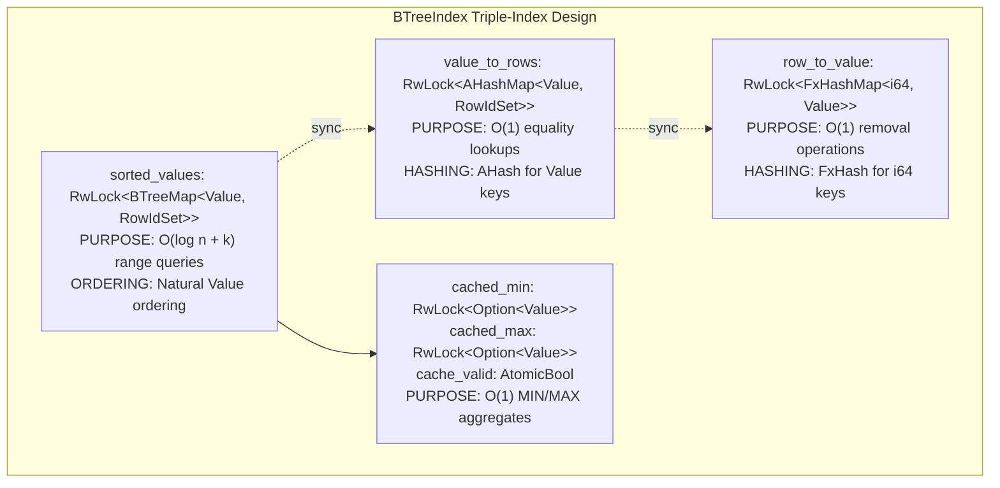
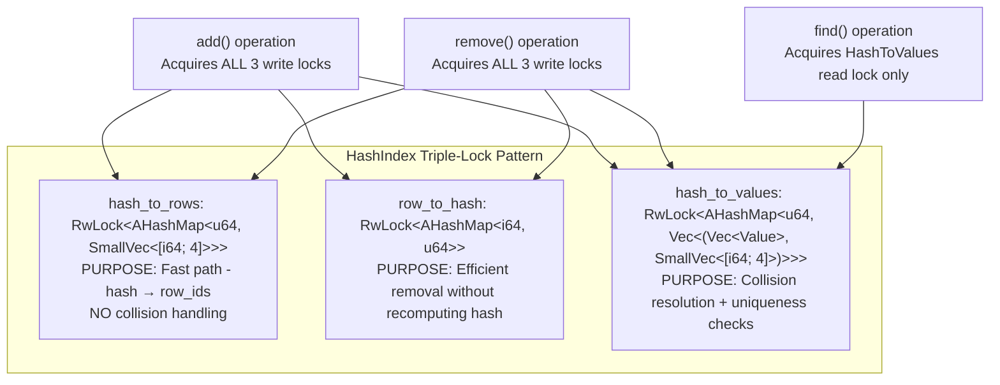
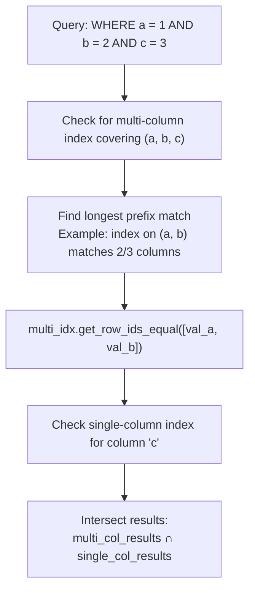
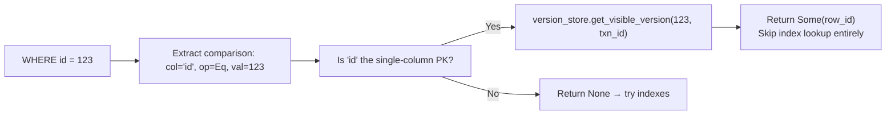
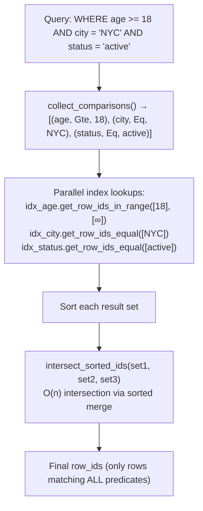
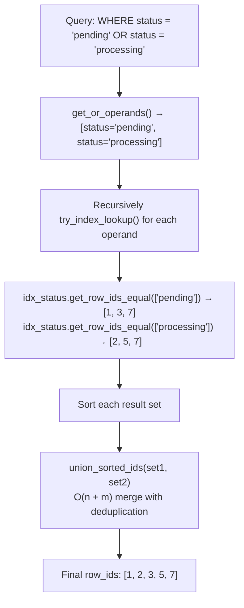
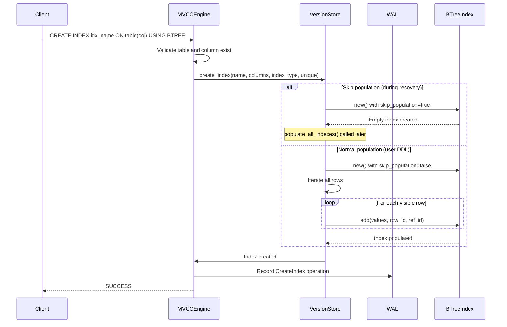
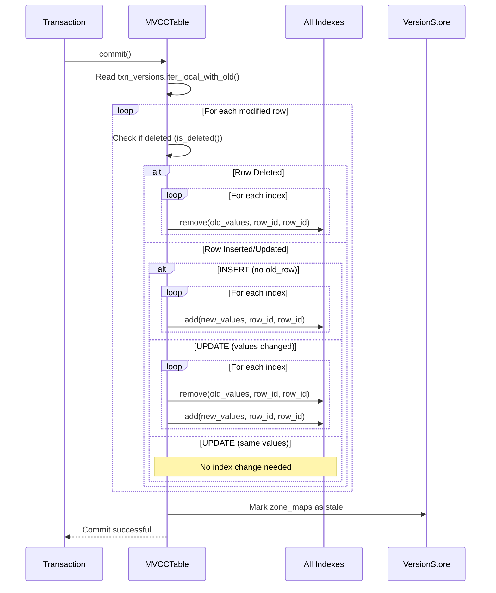

# Page: Index System

# Index System

<details>
<summary>Relevant source files</summary>

The following files were used as context for generating this wiki page:

- [src/storage/mvcc/btree_index.rs](src/storage/mvcc/btree_index.rs)
- [src/storage/mvcc/engine.rs](src/storage/mvcc/engine.rs)
- [src/storage/mvcc/hash_index.rs](src/storage/mvcc/hash_index.rs)
- [src/storage/mvcc/table.rs](src/storage/mvcc/table.rs)
- [src/storage/mvcc/version_store.rs](src/storage/mvcc/version_store.rs)

</details>


The Index System provides three specialized index implementations (BTree, Hash, and Bitmap) for accelerating query execution in the MVCC storage engine. This document covers index types, their selection strategies, optimization techniques, and integration with the version store.

For information about how indexes are used during query execution, see [Query Execution Pipeline](#3.1). For information about index persistence and recovery, see [Persistence and Recovery](#4.4). For information about how indexes integrate with MVCC versioning, see [Version Store and Tables](#4.2).

---

## Index Types Overview

Oxibase provides three index types, each optimized for different query patterns and column characteristics:

| Index Type | Implementation | Best For | Time Complexity | Supports Range | Supports ORDER BY |
|------------|---------------|----------|-----------------|----------------|-------------------|
| **BTree** | `BTreeIndex` | Numeric columns, range queries, ordered access | O(log n) lookup, O(log n + k) range | ✓ | ✓ |
| **Hash** | `HashIndex` | TEXT/JSON columns, equality-only queries | O(1) lookup | ✗ | ✗ |
| **Bitmap** | `BitmapIndex` | Boolean columns, low-cardinality data | O(1) bitmap ops | Limited | ✗ |

**Auto-Selection Rules** (from [src/storage/mvcc/table.rs:95-130]()):

```
TEXT/JSON columns → Hash index (avoids O(strlen) B-tree comparisons)
BOOLEAN columns → Bitmap index (only 2 values, fast AND/OR/NOT)
INTEGER/FLOAT/TIMESTAMP → BTree index (supports range queries)
```

**Sources:** [src/storage/mvcc/table.rs:95-130](), [src/storage/mvcc/btree_index.rs:15-31](), [src/storage/mvcc/hash_index.rs:15-58]()

---

## Index Architecture

### Index Integration with Storage Layer

```mermaid
graph TB
    subgraph "MVCCTable"
        MVCCTable[MVCCTable]
        TryPKLookup["try_pk_lookup()"]
        TryIndexLookup["try_index_lookup()"]
        CommitIndexes["commit() → update indexes"]
    end
    
    subgraph "VersionStore"
        VersionStore[VersionStore]
        IndexesMap["indexes: RwLock&lt;FxHashMap&lt;String, Arc&lt;dyn Index&gt;&gt;&gt;"]
        GetIndex["get_index(name)"]
        GetIndexByColumn["get_index_by_column(col_name)"]
        ListIndexes["list_indexes()"]
        CreateIndex["create_index()"]
        DropIndex["drop_index()"]
        PopulateAllIndexes["populate_all_indexes()"]
    end
    
    subgraph "Index Trait Implementations"
        IndexTrait["Index trait"]
        BTreeIdx["BTreeIndex"]
        HashIdx["HashIndex"]
        BitmapIdx["BitmapIndex"]
        MultiColIdx["MultiColumnIndex"]
    end
    
    MVCCTable --> TryPKLookup
    MVCCTable --> TryIndexLookup
    MVCCTable --> CommitIndexes
    
    TryPKLookup --> GetIndexByColumn
    TryIndexLookup --> GetIndexByColumn
    CommitIndexes --> ListIndexes
    
    VersionStore --> IndexesMap
    IndexesMap --> GetIndex
    IndexesMap --> GetIndexByColumn
    IndexesMap --> CreateIndex
    IndexesMap --> DropIndex
    
    GetIndex --> IndexTrait
    GetIndexByColumn --> IndexTrait
    
    IndexTrait --> BTreeIdx
    IndexTrait --> HashIdx
    IndexTrait --> BitmapIdx
    IndexTrait --> MultiColIdx
```

The `VersionStore` maintains a map of index names to `Arc<dyn Index>` trait objects ([src/storage/mvcc/version_store.rs:176-177]()). The `MVCCTable` uses indexes during query execution via `try_pk_lookup()` and `try_index_lookup()` methods, and maintains indexes during transaction commit.

**Sources:** [src/storage/mvcc/version_store.rs:169-193](), [src/storage/mvcc/table.rs:36-94](), [src/storage/mvcc/table.rs:165-192](), [src/storage/mvcc/table.rs:197-551]()

### Index Trait Interface

```mermaid
graph LR
    subgraph "Index Trait Methods"
        Add["add(values, row_id, ref_id)"]
        Remove["remove(values, row_id, ref_id)"]
        Find["find(values) → Vec&lt;IndexEntry&gt;"]
        FindRange["find_range(min, max) → Vec&lt;IndexEntry&gt;"]
        FindWithOp["find_with_operator(op, values)"]
        GetRowIdsEqual["get_row_ids_equal(values) → Vec&lt;i64&gt;"]
        GetRowIdsInRange["get_row_ids_in_range(min, max)"]
        GetRowIdsIn["get_row_ids_in(values) → Vec&lt;i64&gt;"]
        GetMinValue["get_min_value() → Option&lt;Value&gt;"]
        GetMaxValue["get_max_value() → Option&lt;Value&gt;"]
        GetRowIdsOrdered["get_row_ids_ordered(asc, limit, offset)"]
    end
```



All index implementations provide these common operations. The trait is defined in `src/storage/traits.rs` and allows polymorphic index usage via `Arc<dyn Index>`.

**Sources:** [src/storage/mvcc/btree_index.rs:400-951](), [src/storage/mvcc/hash_index.rs:206-488]()

---

## BTree Index

### Data Structures

`BTreeIndex` maintains three synchronized data structures for optimal query performance ([src/storage/mvcc/btree_index.rs:74-113]()):



**Key Design Tradeoffs:**

- **Dual BTreeMap + HashMap:** Provides both O(1) equality (via hash) and O(log n + k) range queries (via BTree) at the cost of ~2x memory for unique values ([src/storage/mvcc/btree_index.rs:61-71]())
- **SmallVec<[i64; 4]>:** Avoids heap allocation for values with ≤4 duplicate rows (common case) ([src/storage/mvcc/btree_index.rs:50-52]())
- **Cached min/max:** Thread-safe lazy updates provide O(1) MIN/MAX queries ([src/storage/mvcc/btree_index.rs:253-295]())

**Sources:** [src/storage/mvcc/btree_index.rs:74-113](), [src/storage/mvcc/btree_index.rs:50-71]()

### Range Query Optimization

BTree indexes provide efficient range queries using `BTreeMap::range()` ([src/storage/mvcc/btree_index.rs:298-397]()):


**Operator Support:**
- `Operator::Lt`: `range(..value)` ([src/storage/mvcc/btree_index.rs:311-320]())
- `Operator::Lte`: `range(..=value)` ([src/storage/mvcc/btree_index.rs:322-331]())
- `Operator::Gt`: `range((Excluded(value), Unbounded))` ([src/storage/mvcc/btree_index.rs:333-344]())
- `Operator::Gte`: `range(value..)` ([src/storage/mvcc/btree_index.rs:346-355]())

**Sources:** [src/storage/mvcc/btree_index.rs:298-397](), [src/storage/mvcc/btree_index.rs:607-653]()

### Cached Aggregates

BTree indexes cache minimum and maximum values for O(1) aggregate queries ([src/storage/mvcc/btree_index.rs:253-295]()):

**Update Strategy:**
1. Cache invalidated on mutations via `invalidate_cache()` ([src/storage/mvcc/btree_index.rs:216-219]())
2. Lazy recomputation on next access via `update_cache_if_needed()` ([src/storage/mvcc/btree_index.rs:253-295]())
3. Thread-safe: values written BEFORE `cache_valid` flag set ([src/storage/mvcc/btree_index.rs:280-294]())

**Sources:** [src/storage/mvcc/btree_index.rs:216-295](), [src/storage/mvcc/btree_index.rs:823-855]()

---

## Hash Index

### Architecture and Hash Collision Handling

`HashIndex` uses three synchronized maps for O(1) equality lookups with collision handling ([src/storage/mvcc/hash_index.rs:105-127]()):



**Collision Resolution:** The `hash_to_values` map stores `Vec<(Vec<Value>, SmallVec<[i64; 4]>)>` to handle multiple distinct values with the same hash. During `find()`, actual values are compared to resolve collisions ([src/storage/mvcc/hash_index.rs:371-401]()).

**Hash Function:** Uses `ahash::RandomState` with fixed seeds for deterministic hashing across operations ([src/storage/mvcc/hash_index.rs:72-88]()).

**Sources:** [src/storage/mvcc/hash_index.rs:105-127](), [src/storage/mvcc/hash_index.rs:41-57](), [src/storage/mvcc/hash_index.rs:219-296]()

### Limitations

Hash indexes explicitly do NOT support:
- **Range queries:** Returns error "hash index does not support range queries" ([src/storage/mvcc/hash_index.rs:403-414]())
- **Non-equality operators:** Only `Operator::Eq` supported ([src/storage/mvcc/hash_index.rs:416-425]())
- **ORDER BY optimization:** No ordered iteration capability
- **Partial key matching:** Requires exact match on all indexed columns ([src/storage/mvcc/hash_index.rs:371-382]())

**Sources:** [src/storage/mvcc/hash_index.rs:403-425](), [src/storage/mvcc/hash_index.rs:371-401]()

---

## Bitmap Index

Bitmap indexes use Roaring Bitmaps for efficient bitwise operations on low-cardinality columns. While the implementation file is not provided, the system uses them for:

- **Boolean columns:** Only 2 distinct values (true/false/null) ([src/storage/mvcc/table.rs:111-114]())
- **Fast set operations:** AND, OR, NOT via bitwise operations
- **Memory efficiency:** Compressed bitmap representation

**Auto-selection:** Applied automatically for `DataType::Boolean` columns ([src/storage/mvcc/table.rs:111-114]()).

**Sources:** [src/storage/mvcc/table.rs:26](), [src/storage/mvcc/table.rs:111-114]()

---

## Multi-Column Indexes

Multi-column indexes support composite key lookups with prefix matching ([src/storage/mvcc/table.rs:337-441]()):



**Prefix Matching Rules:**
- Index on `(a, b, c)` can satisfy:
  - `WHERE a = 1` (uses prefix `a`)
  - `WHERE a = 1 AND b = 2` (uses prefix `a, b`)
  - `WHERE a = 1 AND b = 2 AND c = 3` (uses all columns)
- Index on `(a, b, c)` CANNOT satisfy:
  - `WHERE b = 2 AND c = 3` (missing leading column `a`)

**Sources:** [src/storage/mvcc/table.rs:337-441](), [src/storage/mvcc/table.rs:29]()

---

## Index Selection Strategy

### Automatic Type-Based Selection

The `auto_select_index_type()` method chooses the optimal index based on column data types ([src/storage/mvcc/table.rs:95-130]()):

| Column Type | Selected Index | Rationale |
|-------------|---------------|-----------|
| `TEXT`, `JSON` | `Hash` | Avoids O(strlen) comparisons per B-tree node |
| `BOOLEAN` | `Bitmap` | Only 2 values; fast AND/OR/NOT operations |
| `INTEGER`, `FLOAT`, `TIMESTAMP` | `BTree` | Supports range queries and ordering |
| Multi-column with `BOOLEAN` | `Bitmap` | Boolean dominates for AND/OR optimization |
| Multi-column (no boolean) | Based on first column type | Primary column determines index type |

**Sources:** [src/storage/mvcc/table.rs:95-130]()

### Manual Override

Users can explicitly specify index type via `CREATE INDEX` DDL ([src/storage/mvcc/engine.rs:1147-1292]()):

```sql
CREATE INDEX idx_email ON users(email) USING HASH;
CREATE INDEX idx_age ON users(age) USING BTREE;
CREATE INDEX idx_active ON users(active) USING BITMAP;
```

**Sources:** [src/storage/mvcc/engine.rs:1147-1292]()

---

## Index Query Optimization Techniques

### Primary Key Direct Lookup

The `try_pk_lookup()` method provides O(1) primary key access, bypassing index scans ([src/storage/mvcc/table.rs:165-192]()):



**Performance:** O(1) via `VersionStore.get_visible_version()` without any index overhead.

**Sources:** [src/storage/mvcc/table.rs:165-192]()

### Index Intersection for AND Expressions

For multi-predicate queries, indexes are intersected to minimize rows scanned ([src/storage/mvcc/table.rs:444-548]()):



**Algorithm:** `intersect_sorted_ids()` uses binary search for O(n × log m) complexity ([src/storage/mvcc/btree_index.rs:953-980]()).

**Short-circuit optimization:** Returns empty set immediately if any index returns no results ([src/storage/mvcc/table.rs:474-477]()).

**Sources:** [src/storage/mvcc/table.rs:444-548](), [src/storage/mvcc/btree_index.rs:953-1057]()

### Index Union for OR Expressions

For OR queries, index results are merged using sorted union ([src/storage/mvcc/table.rs:222-272]()):



**Hybrid Optimization:** If some operands lack indexes, returns `None` to fall back to full scan rather than partial results ([src/storage/mvcc/table.rs:256-260]()).

**Sources:** [src/storage/mvcc/table.rs:222-272](), [src/storage/mvcc/btree_index.rs:1001-1057]()

### IN List Batch Lookup

The `get_row_ids_in()` method provides efficient multi-value lookup for `IN (...)` expressions ([src/storage/mvcc/table.rs:276-291]()):

```sql
-- Optimized via single index lookup
SELECT * FROM users WHERE status IN ('active', 'pending', 'trial');
```

Instead of 3 separate `get_row_ids_equal()` calls, `get_row_ids_in()` performs a single batch lookup.

**Sources:** [src/storage/mvcc/table.rs:276-291]()

### LIKE Prefix Optimization

Prefix-pattern `LIKE` queries use index range scans ([src/storage/mvcc/table.rs:293-320]()):


**Limitation:** Only optimizes prefix patterns (`'abc%'`). Patterns like `'%abc'` or `'%abc%'` cannot use indexes.

**Sources:** [src/storage/mvcc/table.rs:293-320]()

### Boolean Equality Optimization Skip

Hash and BTree indexes intentionally skip boolean equality predicates ([src/storage/mvcc/table.rs:204-210]()):

```sql
-- This will NOT use index, even if idx_active exists
SELECT * FROM users WHERE active = true;
```

**Rationale:** Boolean columns have ~50% selectivity (2 values), making full scan faster than index lookup + row fetch overhead.

**Sources:** [src/storage/mvcc/table.rs:204-210](), [src/storage/mvcc/table.rs:467-472]()

---

## Index Lifecycle Management

### Index Creation



**Deferred Population During Recovery:** When replaying WAL, indexes are created with `skip_population=true`, then all indexes are populated in a single pass via `populate_all_indexes()` ([src/storage/mvcc/engine.rs:514-529]()):

```
O(N × M) per-index population → O(N + M) single-pass population
where N = row count, M = index count
```

**Sources:** [src/storage/mvcc/engine.rs:574-592](), [src/storage/mvcc/engine.rs:514-529](), [src/storage/mvcc/version_store.rs:1371-1479]()

### Index Maintenance During Transactions

Indexes are updated during transaction commit in `MVCCTable.commit()` ([src/storage/mvcc/table.rs:719-804]()):



**Key optimization:** Old row values are cached during the transaction (`iter_local_with_old()`), avoiding redundant lookups during index updates ([src/storage/mvcc/table.rs:728]()).

**Sources:** [src/storage/mvcc/table.rs:719-804]()

### Index Recovery from WAL

During database recovery, indexes are reconstructed from WAL entries ([src/storage/mvcc/engine.rs:487-645]()):

**Two-Phase Recovery Process:**

1. **Phase 1 - Snapshot Load:** Load table snapshots with indexes ([src/storage/mvcc/engine.rs:363-485]())
2. **Phase 2 - WAL Replay:**
   - `CreateIndex` entries create empty indexes with `skip_population=true` ([src/storage/mvcc/engine.rs:574-582]())
   - `Insert`/`Update`/`Delete` entries update version store but NOT indexes ([src/storage/mvcc/engine.rs:593-609]())
3. **Phase 3 - Deferred Population:** After WAL replay completes, `populate_all_indexes()` rebuilds all indexes in a single pass ([src/storage/mvcc/engine.rs:514-529]())

**Sources:** [src/storage/mvcc/engine.rs:487-645](), [src/storage/mvcc/engine.rs:514-529]()

---

## Performance Characteristics Summary

| Operation | BTree | Hash | Bitmap |
|-----------|-------|------|--------|
| Point Lookup (equality) | O(log n) via BTreeMap<br/>O(1) via HashMap fallback | O(1) via hash | O(1) bitmap lookup |
| Range Query | O(log n + k) via BTreeMap | ❌ Not supported | Limited support |
| IN List (k values) | O(k × log n) | O(k) via batch lookup | O(k) bitmap ops |
| AND intersection | O(n) sorted merge | N/A | O(n / 64) bitwise AND |
| OR union | O(n + m) sorted merge | N/A | O(n / 64) bitwise OR |
| MIN/MAX aggregate | O(1) cached | ❌ Not supported | N/A |
| ORDER BY | O(k) ordered iteration | ❌ Not supported | ❌ Not supported |
| Insertion | O(log n) | O(1) amortized | O(1) |
| Deletion | O(log n) | O(1) amortized | O(1) |
| Memory per entry | ~2x (dual index) | ~3x (triple map) | Compressed bitmap |

**Sources:** [src/storage/mvcc/btree_index.rs:15-31](), [src/storage/mvcc/hash_index.rs:15-58]()