# Page: MVCC Architecture

# MVCC Architecture

<details>
<summary>Relevant source files</summary>

The following files were used as context for generating this wiki page:

- [src/storage/mvcc/btree_index.rs](src/storage/mvcc/btree_index.rs)
- [src/storage/mvcc/engine.rs](src/storage/mvcc/engine.rs)
- [src/storage/mvcc/hash_index.rs](src/storage/mvcc/hash_index.rs)
- [src/storage/mvcc/table.rs](src/storage/mvcc/table.rs)
- [src/storage/mvcc/version_store.rs](src/storage/mvcc/version_store.rs)

</details>


## Purpose and Scope

This document describes OxiBase's Multi-Version Concurrency Control (MVCC) architecture, which provides transaction management, isolation, and visibility checking. It covers the core components that enable concurrent transactions to read and write data without blocking each other through version-based isolation.

For details on version storage implementation and row-level operations, see [Version Store and Tables](#4.2). For index implementation details, see [Index System](#4.3). For durability and crash recovery mechanisms, see [Persistence and Recovery](#4.4).

## Overview

MVCC allows multiple transactions to access the same data concurrently by maintaining multiple versions of each row. Each transaction sees a consistent snapshot of the database as it existed when the transaction began, regardless of changes made by other concurrent transactions.

**Key Properties:**
- **Readers never block writers**: Read transactions access old versions while writes create new ones
- **Writers never block readers**: Write transactions create new versions without invalidating ongoing reads
- **Snapshot isolation**: Each transaction sees a consistent snapshot based on its start time
- **Optimistic concurrency control**: Conflicts are detected at commit time via write sets

**Architecture Layers:**

| Layer | Components | Purpose |
|-------|-----------|---------|
| **Engine** | `MVCCEngine` | Top-level coordinator, manages schemas and version stores |
| **Transaction Management** | `TransactionRegistry`, `MvccTransaction` | Transaction lifecycle, ID allocation, visibility decisions |
| **Version Storage** | `VersionStore`, `TransactionVersionStore` | Global committed state, transaction-local uncommitted state |
| **Table Interface** | `MVCCTable` | ACID-compliant table operations with MVCC isolation |

Sources: [src/storage/mvcc/engine.rs:251-279]()

## Component Architecture

### System Component Diagram

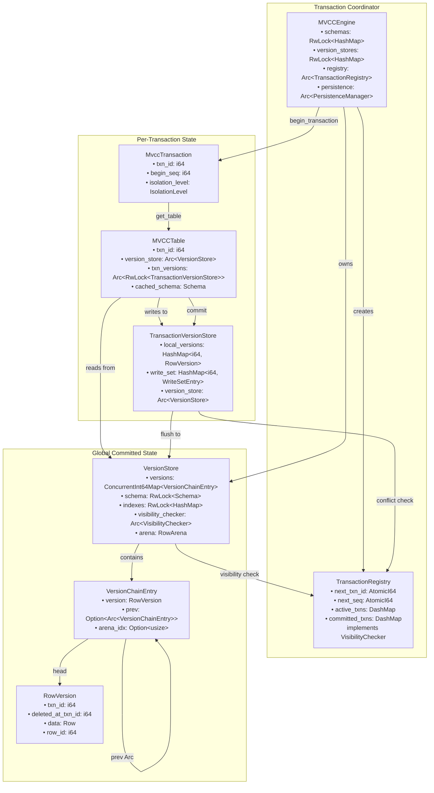

Sources: [src/storage/mvcc/engine.rs:251-279](), [src/storage/mvcc/table.rs:36-46](), [src/storage/mvcc/version_store.rs:169-193]()

### Component Responsibilities

**MVCCEngine** ([src/storage/mvcc/engine.rs:254-279]())
- Owns all `VersionStore` instances (one per table)
- Manages table schemas and DDL operations
- Coordinates persistence (WAL and snapshots)
- Creates and tracks transactions
- Provides `TransactionRegistry` for visibility decisions

**TransactionRegistry** ([src/storage/mvcc/version_store.rs:135-155]())
- Allocates unique transaction IDs (monotonically increasing)
- Assigns sequence numbers for commit ordering
- Tracks active and committed transactions
- Implements `VisibilityChecker` trait for version visibility logic
- Enforces transaction isolation through visibility rules

**MvccTransaction** ([src/storage/mvcc/engine.rs:254-315]())
- Represents a single database transaction
- Holds transaction ID and begin sequence number
- Provides `get_table()` to access `MVCCTable` with MVCC isolation
- Manages commit/rollback lifecycle

**MVCCTable** ([src/storage/mvcc/table.rs:36-46]())
- Transaction-aware table interface
- Routes reads to `VersionStore` (committed data)
- Routes writes to `TransactionVersionStore` (uncommitted local changes)
- Implements `Table` trait with MVCC semantics
- Handles index updates, constraint checking, visibility filtering

**VersionStore** ([src/storage/mvcc/version_store.rs:169-193]())
- Stores committed versions for one table
- Maintains version chains (linked list via Arc)
- Manages indexes (BTree, Hash, Bitmap)
- Provides arena-based zero-copy scanning
- Tracks uncommitted writes for conflict detection

**TransactionVersionStore** ([src/storage/mvcc/table.rs:41-42]())
- Holds transaction-local uncommitted changes
- Tracks write set for conflict detection
- Merged into `VersionStore` on commit
- Discarded on rollback

Sources: [src/storage/mvcc/engine.rs:251-315](), [src/storage/mvcc/table.rs:36-62](), [src/storage/mvcc/version_store.rs:132-193]()

## Transaction Lifecycle

### Transaction State Machine

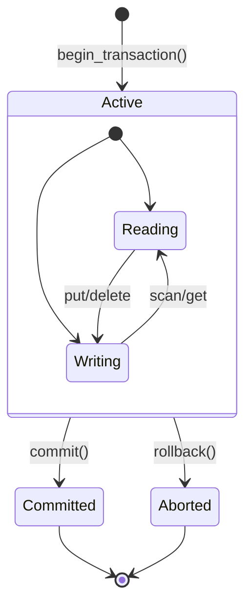

### Transaction Creation Flow

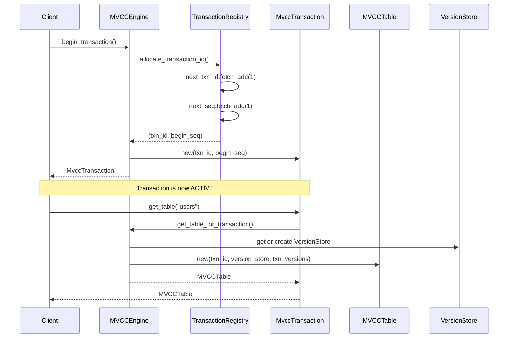

Sources: [src/storage/mvcc/engine.rs:251-340]()

### Commit Flow with Conflict Detection

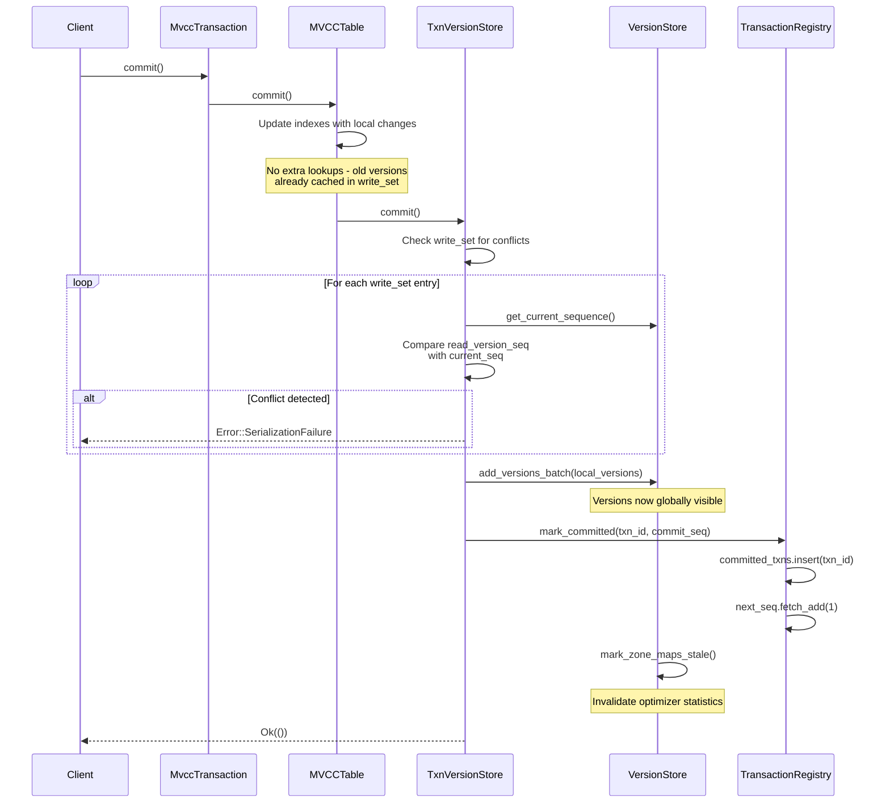

Sources: [src/storage/mvcc/table.rs:722-804](), [src/storage/mvcc/version_store.rs:292-367]()

### Rollback Flow

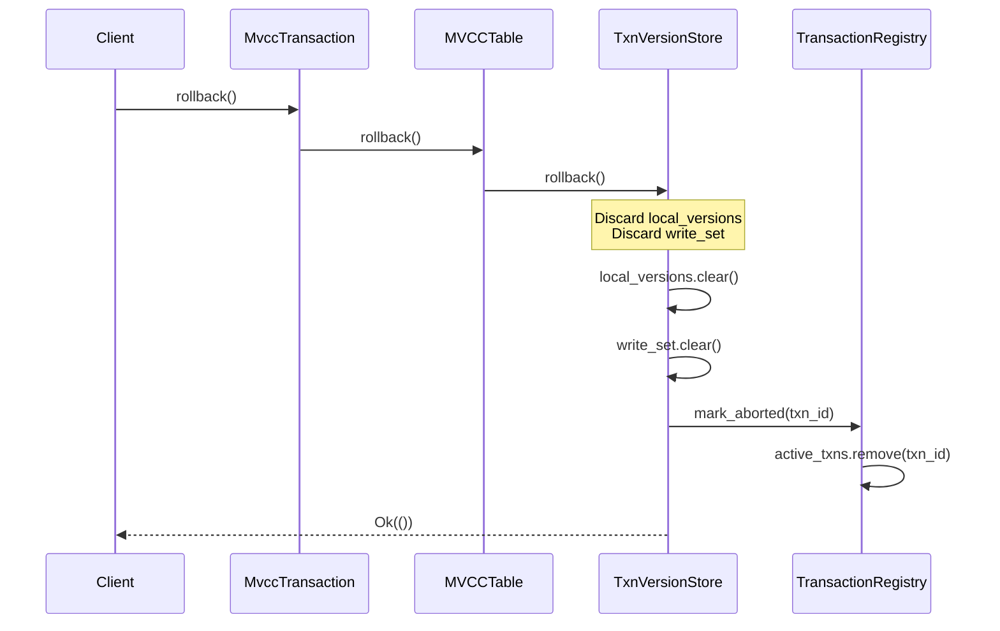

Sources: [src/storage/mvcc/table.rs:807-809]()

## Visibility Checking

### VisibilityChecker Trait

The `VisibilityChecker` trait ([src/storage/mvcc/version_store.rs:135-155]()) abstracts transaction visibility logic. `TransactionRegistry` implements this trait to determine which versions each transaction can see.

**Key Methods:**

| Method | Purpose | Return |
|--------|---------|--------|
| `is_visible(version_txn_id, viewing_txn_id)` | Check if version is visible to viewer | bool |
| `get_current_sequence()` | Get global commit sequence for conflict detection | i64 |
| `get_active_transaction_ids()` | List active transactions for cleanup | Vec<i64> |
| `is_committed_before(txn_id, cutoff_seq)` | Check if transaction committed before cutoff | bool |

### Visibility Decision Algorithm

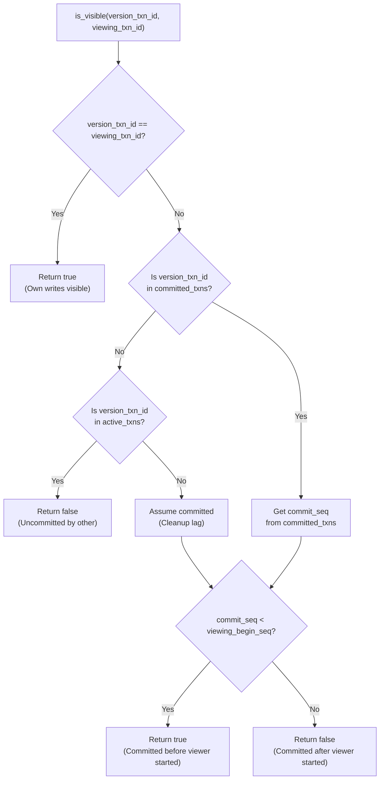

**Snapshot Isolation Guarantee:** A transaction with `begin_seq=100` sees all versions committed with `commit_seq < 100`. This ensures:
- Consistent reads throughout transaction lifetime
- No phantom reads (new rows don't appear mid-transaction)
- No dirty reads (uncommitted changes invisible)

Sources: [src/storage/mvcc/version_store.rs:135-155](), [src/storage/mvcc/version_store.rs:433-465]()

### Reading with Visibility Check

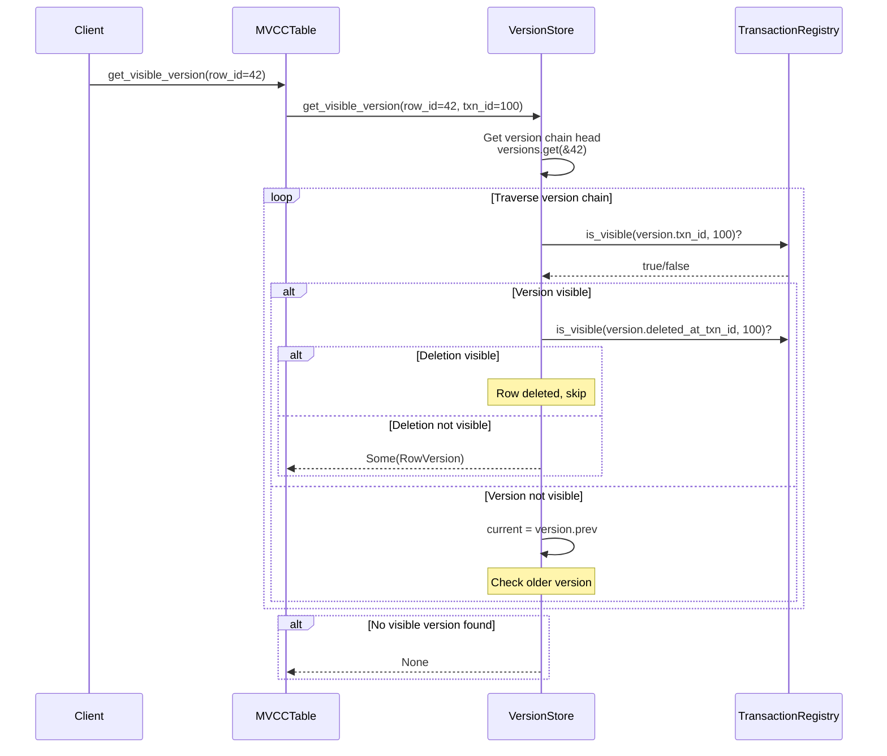

Sources: [src/storage/mvcc/version_store.rs:433-465]()

## Version Chains

### Version Chain Structure

Each row in the `VersionStore` is represented as a linked list of versions, with the newest version at the head. The chain uses `Arc<VersionChainEntry>` for cheap snapshot cloning.

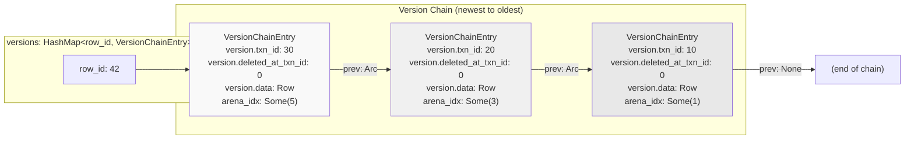

**Key Design Decisions:**

| Aspect | Choice | Rationale |
|--------|--------|-----------|
| **Chain direction** | Newest → Oldest | Most queries read recent data (temporal locality) |
| **Pointer type** | `Arc<VersionChainEntry>` | O(1) chain cloning, cheap snapshots |
| **Version metadata** | `txn_id`, `deleted_at_txn_id` | Enables visibility without storing transaction state in version |
| **Arena storage** | `arena_idx: Option<usize>` | Zero-copy scanning for committed versions |

Sources: [src/storage/mvcc/version_store.rs:110-119](), [src/storage/mvcc/version_store.rs:292-367]()

### Version Chain Traversal Example

**Scenario:** Transaction 25 reads row_id=42

```
Version Chain:
  V3: txn_id=30, deleted_at_txn_id=0  (UPDATE by txn 30)
  V2: txn_id=20, deleted_at_txn_id=0  (UPDATE by txn 20)
  V1: txn_id=10, deleted_at_txn_id=0  (INSERT by txn 10)

Transaction 25 state:
  - begin_seq = 25
  - Committed transactions: {10: seq=10, 20: seq=20, 30: seq=31}
```

**Traversal Steps:**

1. **Check V3 (txn_id=30)**
   - `is_visible(30, 25)?` → Check if txn 30 committed before seq 25
   - Txn 30 has commit_seq=31 > begin_seq=25
   - **Not visible** → Check prev

2. **Check V2 (txn_id=20)**
   - `is_visible(20, 25)?` → Check if txn 20 committed before seq 25
   - Txn 20 has commit_seq=20 < begin_seq=25
   - **Visible** → Check if deleted
   - `is_visible(deleted_at_txn_id=0, 25)?` → No deletion
   - **Return V2**

Result: Transaction 25 sees the version from txn 20, not the newer version from txn 30.

Sources: [src/storage/mvcc/version_store.rs:433-465]()

### Deletion Handling

Deletions are represented by setting `deleted_at_txn_id` in a new version:

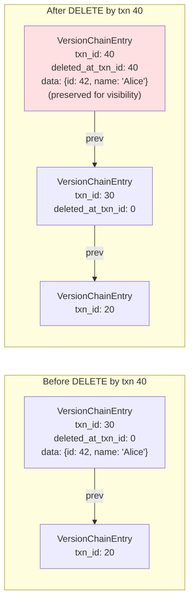

**Visibility Logic for Deletions:**
- If `deleted_at_txn_id != 0` AND `is_visible(deleted_at_txn_id, viewing_txn_id)` → Row is deleted for viewer
- Older transactions see the row (deletion not visible to them)
- Preserves data for time-travel queries

Sources: [src/storage/mvcc/version_store.rs:72-82](), [src/storage/mvcc/version_store.rs:433-465]()

## Transaction Isolation

### Snapshot Isolation Implementation

OxiBase implements **Snapshot Isolation** through:

1. **Begin Timestamp:** Each transaction gets a `begin_seq` from `TransactionRegistry.next_seq`
2. **Commit Timestamp:** Each committing transaction gets a `commit_seq` from `TransactionRegistry.next_seq`
3. **Visibility Rule:** Transaction T sees version V if `V.commit_seq < T.begin_seq`

**Guarantees Provided:**

| Property | Implementation |
|----------|----------------|
| **Consistent reads** | Transaction sees snapshot as of `begin_seq` |
| **No dirty reads** | Only committed versions visible (checked via `committed_txns`) |
| **No non-repeatable reads** | Same row returns same version throughout transaction |
| **No phantom reads** | New rows committed after `begin_seq` are invisible |
| **First-committer-wins** | Write set conflict detection at commit time |

### Write Set Tracking

Write set tracking enables conflict detection for concurrent updates:

**WriteSetEntry Structure** ([src/storage/mvcc/version_store.rs:124-130]()):
```rust
pub struct WriteSetEntry {
    pub read_version: Option<RowVersion>,  // Version when first read
    pub read_version_seq: i64,              // Sequence when read
}
```

**Conflict Detection Algorithm:**
1. Transaction T1 reads row R at sequence S1, stores in write_set
2. Transaction T2 commits an update to row R at sequence S2
3. Transaction T1 tries to commit
4. Conflict check: If current_seq for row R > T1's stored read_version_seq, conflict detected
5. T1's commit fails with `Error::SerializationFailure`

Sources: [src/storage/mvcc/version_store.rs:122-130](), [src/storage/mvcc/table.rs:722-804]()

### Conflict Detection Flow

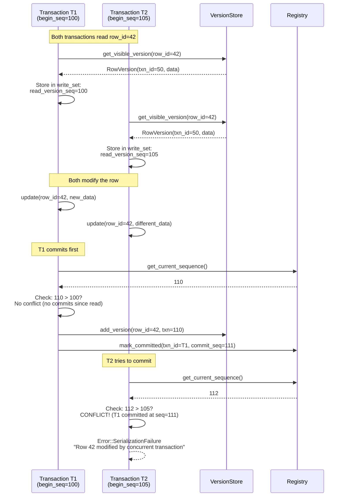

Sources: [src/storage/mvcc/table.rs:722-804]()

## Concurrency Control Summary

### Key Mechanisms

| Mechanism | Purpose | Implementation |
|-----------|---------|----------------|
| **Version Chains** | Multiple versions per row | Linked list via `Arc<VersionChainEntry>` |
| **Transaction Registry** | ID allocation, visibility | `TransactionRegistry` with atomic counters |
| **Visibility Checker** | Snapshot consistency | Compare `commit_seq` with `begin_seq` |
| **Write Sets** | Conflict detection | Track read versions, check at commit |
| **Sequence Numbers** | Global ordering | Monotonic `AtomicI64` for begin/commit |
| **Arena Storage** | Zero-copy reads | Contiguous memory for committed versions |

### Transaction Isolation Properties

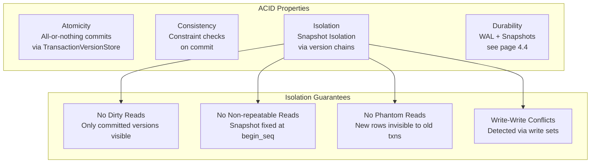

Sources: [src/storage/mvcc/engine.rs:251-279](), [src/storage/mvcc/version_store.rs:169-193](), [src/storage/mvcc/table.rs:36-62]()

### Performance Characteristics

| Operation | Time Complexity | Notes |
|-----------|----------------|-------|
| **Begin transaction** | O(1) | Atomic counter increment |
| **Read visible version** | O(V) | V = chain length, typically 1-3 |
| **Write (uncommitted)** | O(1) | Insert into `TransactionVersionStore.local_versions` |
| **Commit** | O(W) | W = write set size, batch insert to `VersionStore` |
| **Conflict check** | O(W) | W = write set size, check each modified row |
| **Rollback** | O(1) | Discard `TransactionVersionStore` |
| **Full table scan** | O(N) | N = row count, arena-based zero-copy |

Sources: [src/storage/mvcc/version_store.rs:433-465](), [src/storage/mvcc/version_store.rs:756-817](), [src/storage/mvcc/table.rs:722-804]()