# Page: Module Organization

# Module Organization

<details>
<summary>Relevant source files</summary>

The following files were used as context for generating this wiki page:

- [.github/workflows/ci.yml](.github/workflows/ci.yml)
- [.gitignore](.gitignore)
- [Cargo.toml](Cargo.toml)
- [README.md](README.md)
- [ROADMAP.md](ROADMAP.md)
- [docs/_config.yml](docs/_config.yml)
- [src/lib.rs](src/lib.rs)

</details>


This page documents the codebase structure of OxiBase, including the module hierarchy, dependencies between modules, key types exported from each module, and how the modules map to system architecture layers.

For information about building and testing the codebase, see [Building and Testing](#7.1). For high-level system architecture concepts, see [Architecture Overview](#1.2).

---

## Module Structure

OxiBase is organized into eight top-level modules under `src/`, each serving a distinct architectural role. The codebase follows a strict layered architecture where higher-level modules depend on lower-level modules but never the reverse.

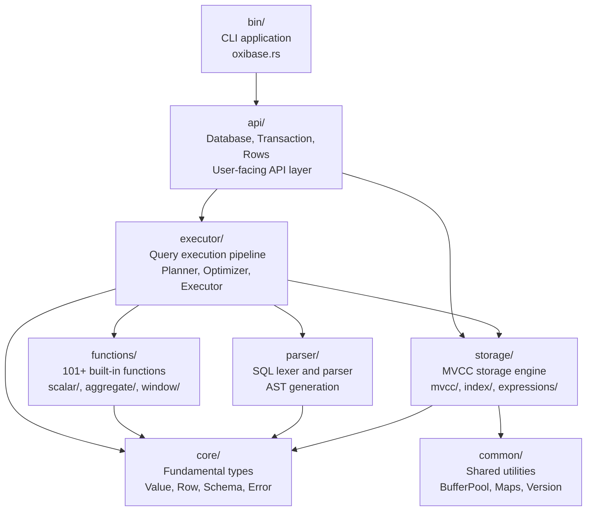

**Sources:** [README.md:85-100](), [src/lib.rs:66-73]()

---

## Module Layers and Dependencies

The modules are organized into distinct architectural layers, with strict dependency rules enforcing separation of concerns.

### Layer 1: Foundation (No Dependencies)

**`common/` - Shared Utilities**

Provides reusable data structures and utilities with no dependencies on other OxiBase modules.

| Component | Purpose |
|-----------|---------|
| `BufferPool` | Memory pooling for zero-allocation row processing |
| `Int64Map`, `UInt64Map`, `UsizeMap` | Specialized hash maps for integer keys |
| `ConcurrentInt64Map` | Thread-safe integer map variants |
| `SemVer` | Semantic versioning for persistence format |
| `PoolStats` | Buffer pool statistics tracking |

**Sources:** [src/lib.rs:82-85]()

---

**`core/` - Fundamental Types**

Defines the core data model used throughout the system.

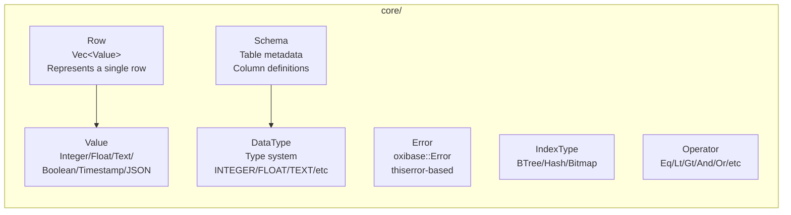

**Key Exports:**
- `Value` - Enum representing all supported SQL types
- `Row` - Struct containing a vector of Values
- `Schema` / `SchemaBuilder` / `SchemaColumn` - Table schema definitions
- `DataType` - Type enumeration (INTEGER, FLOAT, TEXT, BOOLEAN, TIMESTAMP, JSON)
- `Error` / `Result` - Error type used throughout codebase
- `IndexType` - Index type enumeration (BTree, Hash, Bitmap)
- `IsolationLevel` - Transaction isolation levels
- `Operator` - Binary and unary operators

**Sources:** [src/lib.rs:76-79]()

---

### Layer 2: Core Systems (Depends on Foundation)

**`parser/` - SQL Parser**

Tokenizes and parses SQL statements into Abstract Syntax Trees (AST).

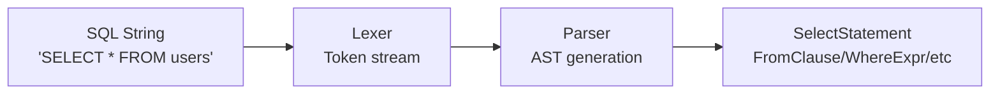

**Dependencies:** `core` (for DataType, Operator, Value constants)

The parser module converts SQL text into structured AST nodes that can be processed by the planner and executor. Each SQL statement type (SELECT, INSERT, UPDATE, DELETE, CREATE TABLE, etc.) has a corresponding AST struct.

**Sources:** [README.md:89](), [src/lib.rs:72]()

---

**`storage/` - MVCC Storage Engine**

Implements multi-version concurrency control, persistence, and indexing.

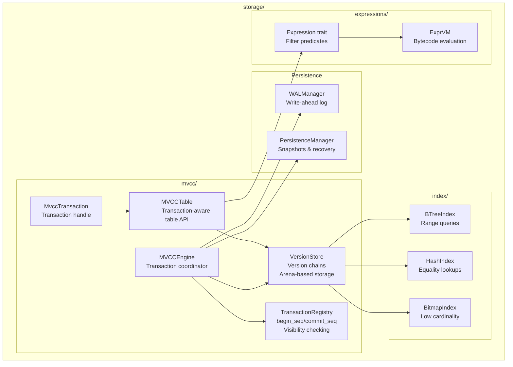

**Key Types Exported:**

| Category | Types |
|----------|-------|
| **MVCC Core** | `MVCCEngine`, `MvccTransaction`, `MVCCTable`, `VersionStore`, `TransactionRegistry` |
| **Indexes** | `BTreeIndex`, `HashIndex`, `BitmapIndex` (via `storage::index`) |
| **Persistence** | `WALManager`, `PersistenceManager`, `CheckpointMetadata`, `WALEntry` |
| **Expressions** | `Expression` trait, `ComparisonExpr`, `AndExpr`, `OrExpr`, `ExprVM` |
| **Traits** | `Engine`, `Transaction`, `Table`, `Scanner`, `Index` |
| **Version Data** | `RowVersion`, `TransactionVersionStore`, `WriteSetEntry` |

**Dependencies:** `core` (Value, Row, Schema), `common` (BufferPool, maps)

**Sources:** [src/lib.rs:88-125](), [README.md:97-99]()

---

**`functions/` - Built-in SQL Functions**

Implements 101+ SQL functions organized by category.

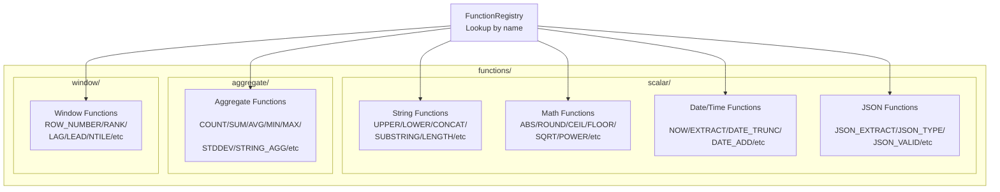

**Key Types:**
- `FunctionRegistry` - Central registry for function lookup
- `ScalarFunction` trait - Single-row functions
- `AggregateFunction` trait - Aggregating functions (COUNT, SUM, etc.)
- `WindowFunction` trait - Window/analytical functions
- `FunctionSignature` / `FunctionInfo` - Function metadata
- Concrete implementations: `AbsFunction`, `UpperFunction`, `CountFunction`, `RowNumberFunction`, etc.

**Dependencies:** `core` (Value, DataType)

**Sources:** [src/lib.rs:127-139](), [README.md:94-96]()

---

### Layer 3: Query Processing (Depends on Core + Storage)

**`executor/` - Query Execution Engine**

Orchestrates query planning, optimization, and execution.

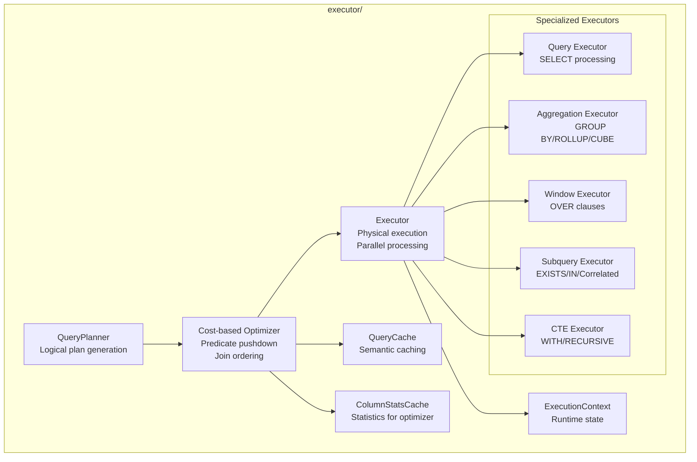

**Key Types:**
- `Executor` - Main execution engine
- `QueryPlanner` - Converts parsed AST to logical plans
- `ExecutionContext` - Runtime context for query execution
- `AccessPlan` / `JoinPlan` - Physical execution plans
- `QueryCache` / `CachedQueryPlan` - Semantic query result caching
- `ColumnStatsCache` - Statistics for cost-based optimization
- `ExecResult` / `ExecutorMemoryResult` - Execution results

**Dependencies:** `parser` (AST), `functions` (function registry), `storage` (MVCC, indexes), `core` (Value, Row)

**Sources:** [src/lib.rs:142-145](), [README.md:92]()

---

### Layer 4: Public API (Depends on All Layers)

**`api/` - User-Facing Database API**

Provides the public interface for application developers.

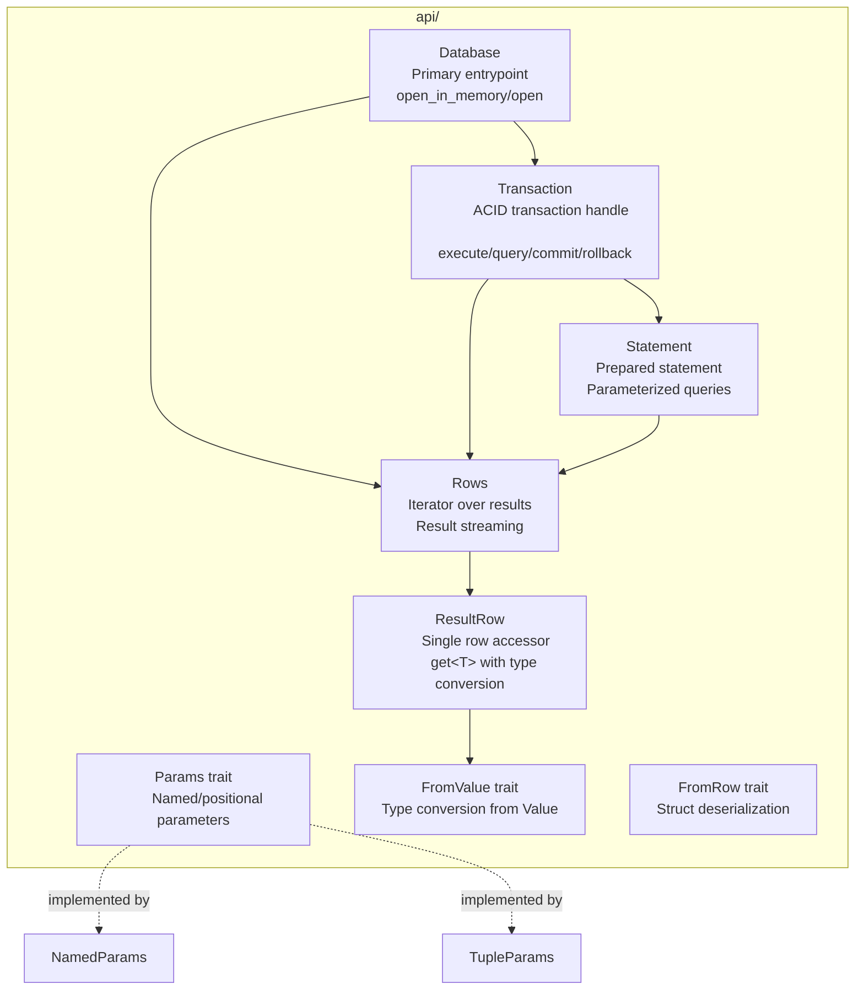

**Key Types:**
- `Database` - Main database handle with `open_in_memory()` and `open()` constructors
- `Transaction` (as `ApiTransaction` in lib.rs) - Transaction handle
- `Rows` - Iterator over query results
- `ResultRow` - Single row with typed accessors
- `Statement` - Prepared statement
- `Params` / `NamedParams` - Parameter binding
- `FromValue` / `ToParam` - Type conversion traits
- `FromRow` - Automatic struct deserialization

**Dependencies:** `executor` (query execution), `storage` (MVCC), `parser` (SQL parsing), `core` (Value, Row, Schema)

**Sources:** [src/lib.rs:148-151](), [README.md:87]()

---

### Binary Crate

**`bin/oxibase.rs` - CLI Application**

Command-line REPL and query execution tool.

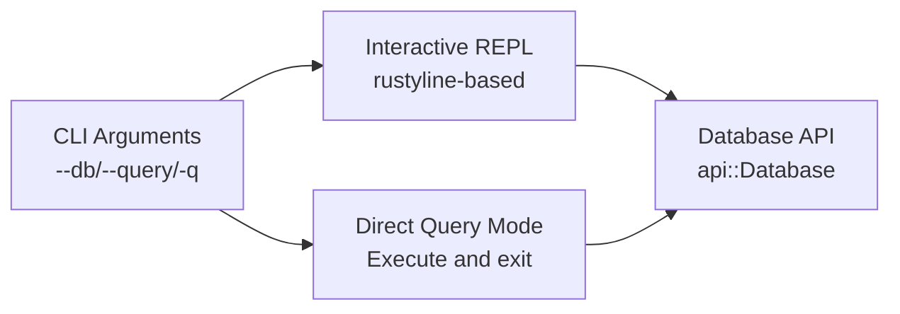

**Features:**
- Interactive REPL with history (uses `rustyline`)
- Direct query execution with `-q` flag
- Pretty-printed table output (uses `comfy-table`)
- DSN-based configuration (memory:// or file:///)

**Dependencies:** `api` module, plus CLI-specific dependencies (`clap`, `rustyline`, `comfy-table`)

**Conditional Compilation:** Only built when `cli` feature is enabled (default)

**Sources:** [Cargo.toml:19-22](), [Cargo.toml:95-96]()

---

## Module Dependency Graph

This diagram shows all module dependencies and how they respect architectural layers.

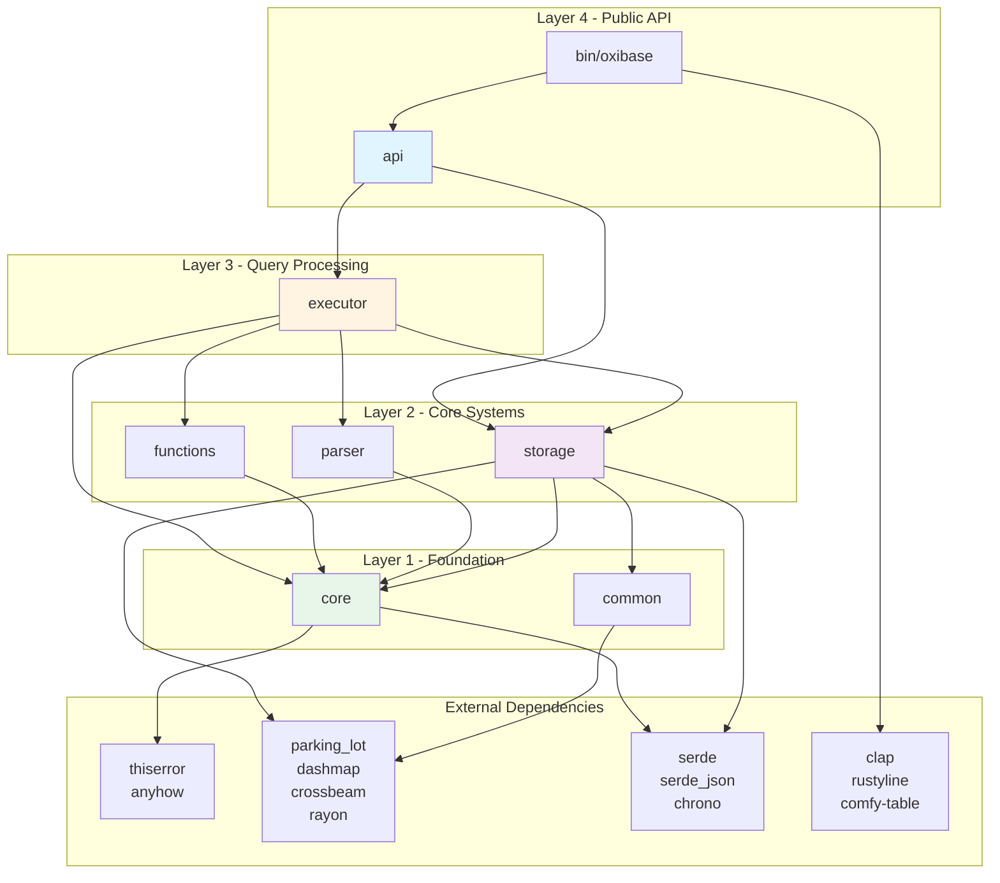

**Key Principles:**

1. **No Circular Dependencies** - All dependencies flow downward through layers
2. **Core as Foundation** - The `core` module has minimal dependencies and is imported by all other modules
3. **Storage Independence** - Storage layer does not depend on query execution
4. **API Isolation** - Public API is the only layer that depends on execution and storage together

**Sources:** [src/lib.rs:66-151]()

---

## Key Type Re-exports

The root `lib.rs` file re-exports key types from each module to provide a convenient public API. This allows users to write `use oxibase::{Database, Value, Row}` instead of `use oxibase::api::Database; use oxibase::core::{Value, Row}`.

### Public API Exports

| Category | Re-exported Types | Source Module |
|----------|------------------|---------------|
| **Core Types** | `Value`, `Row`, `Schema`, `DataType`, `Error`, `Result` | `core` |
| **Database API** | `Database`, `Transaction`, `Rows`, `Statement`, `ResultRow` | `api` |
| **Storage Traits** | `Engine`, `Transaction`, `Table`, `Scanner`, `Index` | `storage` |
| **MVCC Types** | `MVCCEngine`, `MvccTransaction`, `VersionStore`, `TransactionRegistry` | `storage::mvcc` |
| **Index Types** | `BTreeIndex`, `HashIndex`, `BitmapIndex` | `storage::index` |
| **Expressions** | `Expression`, `ComparisonExpr`, `AndExpr`, `OrExpr` | `storage::expressions` |
| **Functions** | `FunctionRegistry`, `ScalarFunction`, `AggregateFunction`, `WindowFunction` | `functions` |
| **Executor** | `Executor`, `QueryPlanner`, `QueryCache`, `ExecutionContext` | `executor` |
| **Persistence** | `WALManager`, `PersistenceManager`, `WALEntry`, `SyncMode`, `Config` | `storage::persistence` |
| **Utilities** | `BufferPool`, `Int64Map`, `SemVer` | `common` |

**Sources:** [src/lib.rs:75-151]()

---

## Storage Module Deep Dive

The `storage/` module is the most complex, containing multiple sub-modules for different aspects of the storage engine.

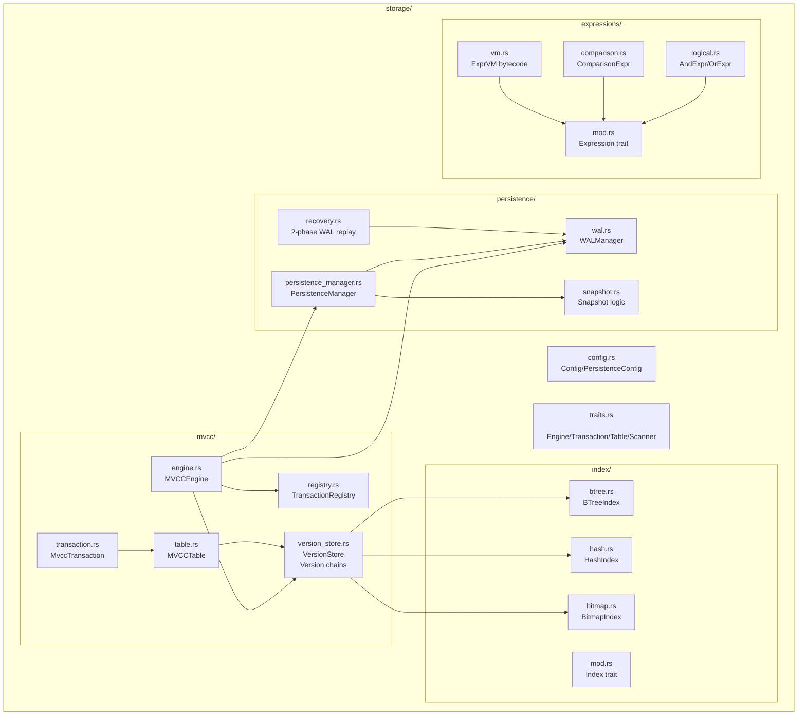

**File Organization:**

| File Path | Primary Types | Purpose |
|-----------|---------------|---------|
| `storage/mod.rs` | Module re-exports | Public interface of storage module |
| `storage/traits.rs` | `Engine`, `Transaction`, `Table`, `Scanner`, `Index` | Core storage abstractions |
| `storage/config.rs` | `Config`, `PersistenceConfig`, `SyncMode` | Configuration types |
| `storage/mvcc/engine.rs` | `MVCCEngine` | Transaction coordinator |
| `storage/mvcc/transaction.rs` | `MvccTransaction` | Transaction handle |
| `storage/mvcc/version_store.rs` | `VersionStore` | Multi-version storage |
| `storage/mvcc/registry.rs` | `TransactionRegistry` | Transaction ID management |
| `storage/mvcc/table.rs` | `MVCCTable` | Transaction-aware table API |
| `storage/index/btree.rs` | `BTreeIndex` | B-tree index implementation |
| `storage/index/hash.rs` | `HashIndex` | Hash index with `ahash` |
| `storage/index/bitmap.rs` | `BitmapIndex` | Roaring bitmap index |
| `storage/persistence/wal.rs` | `WALManager`, `WALEntry` | Write-ahead log |
| `storage/persistence/persistence_manager.rs` | `PersistenceManager` | Snapshot coordination |
| `storage/persistence/recovery.rs` | Recovery logic | 2-phase WAL replay |
| `storage/expressions/mod.rs` | `Expression` trait | Expression evaluation interface |
| `storage/expressions/vm.rs` | `ExprVM` | Zero-recursion bytecode VM |

**Sources:** [README.md:97-99](), [src/lib.rs:88-125]()

---

## Functions Module Organization

The `functions/` module is organized by function category with a central registry.

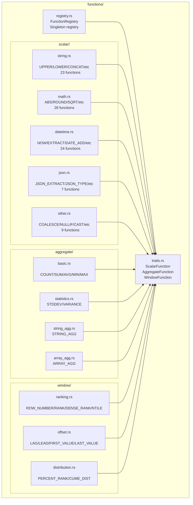

**Function Categories:**

| Category | Count | Examples |
|----------|-------|----------|
| **String** | 23 | `UPPER`, `LOWER`, `CONCAT`, `SUBSTRING`, `LENGTH`, `TRIM`, `REPLACE` |
| **Math** | 28 | `ABS`, `ROUND`, `CEIL`, `FLOOR`, `SQRT`, `POWER`, `SIN`, `COS`, `RAND` |
| **Date/Time** | 24 | `NOW`, `EXTRACT`, `DATE_TRUNC`, `DATE_ADD`, `DATE_SUB`, `YEAR`, `MONTH` |
| **JSON** | 7 | `JSON_EXTRACT`, `JSON_TYPE`, `JSON_VALID`, `JSON_KEYS` |
| **Other** | 9 | `COALESCE`, `NULLIF`, `CAST`, `IF`, `GREATEST`, `LEAST` |
| **Aggregate** | 18 | `COUNT`, `SUM`, `AVG`, `MIN`, `MAX`, `STDDEV`, `STRING_AGG` |
| **Window** | 11 | `ROW_NUMBER`, `RANK`, `DENSE_RANK`, `LAG`, `LEAD`, `NTILE` |

**Total:** 101+ functions

**Sources:** [README.md:324-343](), [src/lib.rs:127-139]()

---

## Dependency Management

### External Dependencies

OxiBase uses carefully selected external crates for specific functionality.

**Core Dependencies:**

| Crate | Purpose | Used By |
|-------|---------|---------|
| `thiserror` | Error derive macros | `core::Error` |
| `anyhow` | Error context | Throughout codebase |
| `serde` / `serde_json` | Serialization | `core::Value`, `storage::persistence` |
| `chrono` | Date/time handling | `core::Value::Timestamp`, date functions |

**Concurrency:**

| Crate | Purpose | Used By |
|-------|---------|---------|
| `parking_lot` | Fast locks (RwLock, Mutex) | `storage::mvcc`, `storage::persistence` |
| `dashmap` | Concurrent HashMap | `executor::QueryCache` |
| `crossbeam` | Lock-free data structures | Channel communication |
| `rayon` | Data parallelism | `executor` (parallel scans) |

**Storage/Indexing:**

| Crate | Purpose | Used By |
|-------|---------|---------|
| `ahash` | Fast hashing (~30 GB/s) | `storage::index::HashIndex` |
| `roaring` | Compressed bitmaps | `storage::index::BitmapIndex` |
| `radsort` | O(n) integer sorting | Optimizer statistics |

**Persistence:**

| Crate | Purpose | Used By |
|-------|---------|---------|
| `crc32fast` | Checksums | `storage::persistence::WALManager` |
| `lz4_flex` | Compression | `storage::persistence` |

**CLI (Optional):**

| Crate | Purpose | Enabled By |
|-------|---------|------------|
| `clap` | Argument parsing | `cli` feature |
| `rustyline` | Interactive REPL | `cli` feature |
| `comfy-table` | Table formatting | `cli` feature |

**Sources:** [Cargo.toml:30-79]()

---

## Feature Flags

OxiBase uses Cargo features to enable optional functionality.

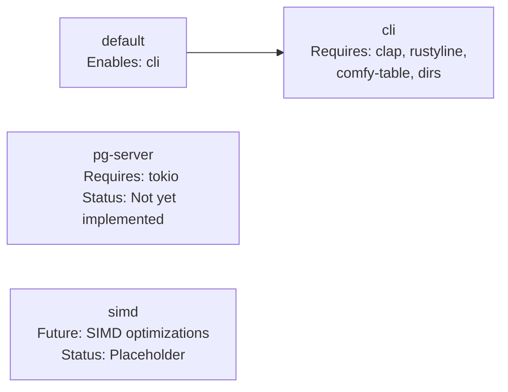

**Feature Configuration:**

| Feature | Status | Purpose | Dependencies Added |
|---------|--------|---------|-------------------|
| `default` | Active | Includes CLI by default | (delegates to `cli`) |
| `cli` | Optional | Command-line interface | `clap`, `rustyline`, `comfy-table`, `dirs` |
| `pg-server` | Future | PostgreSQL wire protocol server | `tokio` |
| `simd` | Future | SIMD optimizations for query execution | None yet |

**Usage:**
```toml
# Include only the library (no CLI)
[dependencies]
oxibase = { version = "0.1", default-features = false }

# Include CLI (default)
[dependencies]
oxibase = "0.1"

# Future: Include pg-server
[dependencies]
oxibase = { version = "0.1", features = ["pg-server"] }
```

**Sources:** [Cargo.toml:94-98](), [Cargo.toml:19-28]()

---

## Build Profiles

OxiBase defines custom build profiles optimized for different use cases.

| Profile | LTO | Codegen Units | Debug Symbols | Use Case |
|---------|-----|---------------|---------------|----------|
| `release` | Full | 1 | Yes | Production deployment with profiling |
| `bench` | Full | 1 | No | Benchmarking |
| `ci` | Thin | 16 | No | Fast CI/CD builds with minimal disk usage |

**Release Profile Configuration:**
```toml
[profile.release]
lto = true              # Full link-time optimization
codegen-units = 1       # Single codegen unit for max optimization
panic = "abort"         # Smaller binary, faster panics
opt-level = 3           # Maximum optimization
debug = true            # Keep debug symbols for profiling
```

**CI Profile Configuration:**
```toml
[profile.ci]
inherits = "release"
lto = "thin"            # Faster than full LTO
codegen-units = 16      # Parallel compilation
debug = false           # No debug symbols for tests
```

**Sources:** [Cargo.toml:100-117]()

---

## Code Organization Best Practices

The OxiBase codebase follows these organizational principles:

### 1. Strict Layering
- Lower layers never import from higher layers
- Each module has a clear architectural role
- Circular dependencies are prevented by design

### 2. Trait-Based Abstractions
- Core abstractions defined in `storage/traits.rs`: `Engine`, `Transaction`, `Table`, `Scanner`, `Index`
- Multiple implementations possible (currently only MVCC, but extensible)
- Functions use traits (`ScalarFunction`, `AggregateFunction`, `WindowFunction`)

### 3. Module Privacy
- Each module exposes a clean public API via `mod.rs`
- Internal implementation details kept private
- Re-exports in `lib.rs` provide convenient top-level access

### 4. Type Safety
- Strong typing throughout (no `Any` types)
- `Value` enum for runtime type flexibility
- Compile-time guarantees where possible

### 5. Zero-Cost Abstractions
- `BufferPool` for allocation reuse
- `Arc<T>` for cheap cloning of immutable data
- Arena-based row storage for zero-copy scanning
- Bytecode VM (`ExprVM`) instead of recursive evaluation

**Sources:** [src/lib.rs:1-152]()

---

## Module Size Metrics

Approximate lines of code per module (excluding tests and comments):

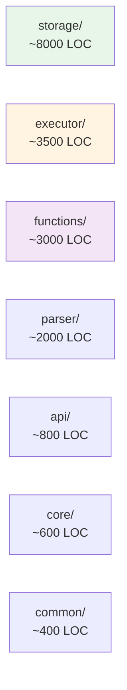

**Largest Modules:**
1. `storage/` - Most complex module with MVCC, indexes, persistence (~8000 LOC)
2. `executor/` - Query planning and execution (~3500 LOC)
3. `functions/` - 101+ function implementations (~3000 LOC)
4. `parser/` - SQL lexer and parser (~2000 LOC)

The storage module is intentionally the largest because it contains the most complex subsystems: transaction management, version storage, multiple index implementations, WAL, snapshots, and recovery logic.

**Sources:** [README.md:85-100]()