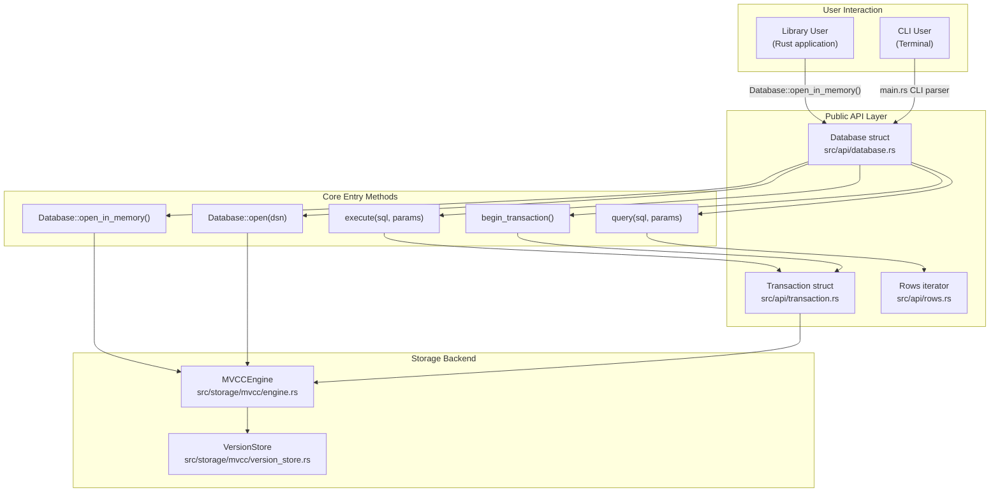
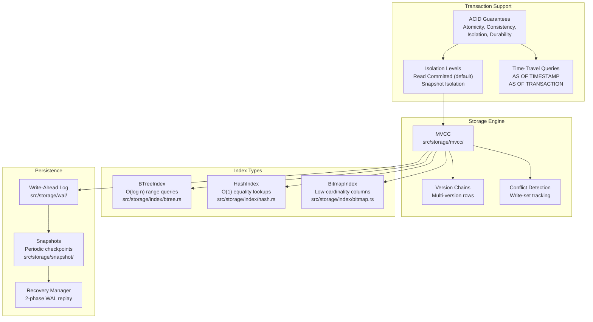
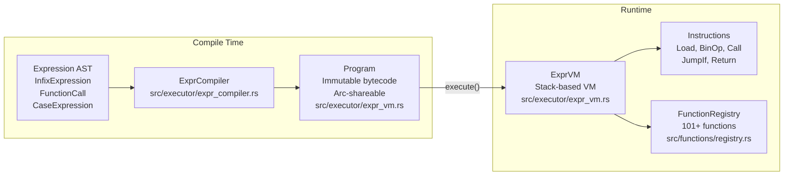
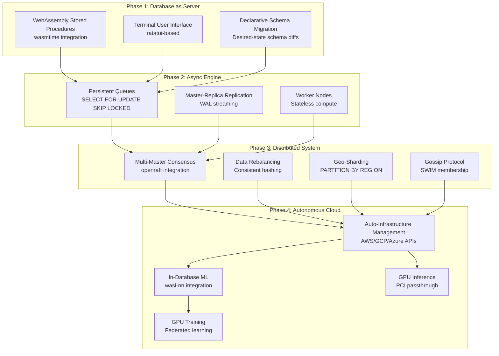

# Page: Overview

# Overview

<details>
<summary>Relevant source files</summary>

The following files were used as context for generating this wiki page:

- [.gitignore](.gitignore)
- [README.md](README.md)
- [../../../../roadmap.md](../../../../roadmap.md)
- [docs/_config.yml](docs/_config.yml)

</details>


## Purpose and Scope

This page provides a high-level introduction to Oxibase: what it is, its design philosophy, current capabilities, and architectural vision. For detailed technical information about specific subsystems, see their dedicated pages: [Architecture Overview](#1.2) for system layers and components, [Getting Started](#1.1) for installation and basic usage, and the subsystem-specific pages for in-depth implementation details.

---

## What is Oxibase?

Oxibase is an embedded SQL database engine written entirely in Rust. It provides ACID-compliant transactional storage with multi-version concurrency control (MVCC), supporting both in-memory and persistent operation modes. The system offers a comprehensive SQL implementation including advanced features like window functions, recursive CTEs, and time-travel queries.

**Current State:** A fully functional embedded SQL library that can be used as a Rust dependency or standalone executable.

**Future Vision:** Evolution toward a "Modern Mainframe" architecture with Unikernel deployment, WebAssembly-based stored procedures, distributed consensus, and self-managing infrastructure capabilities.

Sources: [README.md:20-80]()

---

## System Entry Points

The following diagram shows the primary ways to interact with Oxibase and their corresponding code locations:



**Key Entry Points:**
- `Database::open_in_memory()`: Creates an in-memory database instance
- `Database::open(dsn)`: Opens or creates a persistent database
- `Database::execute()`: Executes SQL statements (DDL, DML, queries)
- `Database::query()`: Executes SELECT queries returning a `Rows` iterator
- `Database::begin_transaction()`: Starts an explicit transaction

Sources: [README.md:130-154]()

---

## Query Execution Flow

This diagram maps the SQL execution pipeline to actual code components:

```mermaid
flowchart LR
    SQL["SQL String<br/>'SELECT * FROM users'"]
    
    Parser["Parser<br/>src/parser/"]
    Lexer["Lexer<br/>src/parser/lexer.rs"]
    AST["SelectStatement<br/>src/parser/ast.rs"]
    
    Planner["Planner<br/>src/planner/"]
    LogicalPlan["LogicalPlan<br/>src/planner/plan.rs"]
    
    Optimizer["Optimizer<br/>src/optimizer/"]
    PhysicalPlan["PhysicalPlan<br/>optimized"]
    
    Executor["Executor<br/>src/executor/"]
    QueryExec["QueryExecutor<br/>src/executor/query_executor.rs"]
    ExprVM["ExprVM<br/>src/executor/expr_vm.rs"]
    
    VersionStore["VersionStore<br/>src/storage/mvcc/version_store.rs"]
    Indexes["BTreeIndex/HashIndex<br/>src/storage/index/"]
    
    Result["QueryResult<br/>Rows iterator"]
    
    SQL --> Lexer
    Lexer --> Parser
    Parser --> AST
    AST --> Planner
    Planner --> LogicalPlan
    LogicalPlan --> Optimizer
    Optimizer --> PhysicalPlan
    PhysicalPlan --> Executor
    Executor --> QueryExec
    QueryExec --> ExprVM
    ExprVM --> VersionStore
    VersionStore --> Indexes
    QueryExec --> Result
```



**Pipeline Stages:**
1. **Lexer** tokenizes the SQL string into lexical tokens
2. **Parser** builds an Abstract Syntax Tree (AST) from tokens
3. **Planner** converts AST to a logical execution plan
4. **Optimizer** applies cost-based transformations for efficiency
5. **Executor** executes the optimized plan using the storage engine
6. **ExprVM** evaluates expressions (WHERE, SELECT projections) via bytecode
7. **VersionStore** provides MVCC-aware data access with visibility checking
8. **Indexes** accelerate data retrieval for qualified queries

Sources: [README.md:86-100]()

---

## Core Capabilities

### SQL Feature Coverage

| Category | Features | Reference |
|----------|----------|-----------|
| **Data Types** | INTEGER, FLOAT, TEXT, BOOLEAN, TIMESTAMP, JSON | [Data Types](#5.1) |
| **Query Types** | SELECT, INSERT, UPDATE, DELETE, CREATE, ALTER, DROP | [DDL Operations](#5.3) |
| **Joins** | INNER, LEFT, RIGHT, FULL OUTER, CROSS | [Query Execution Pipeline](#3.1) |
| **Subqueries** | Scalar, correlated, EXISTS, IN, ANY, ALL | [Subquery Execution](#3.3) |
| **CTEs** | WITH clauses, RECURSIVE support | [Common Table Expressions](#3.6) |
| **Aggregation** | GROUP BY, ROLLUP, CUBE, GROUPING SETS | [Aggregation and GROUP BY](#3.4) |
| **Window Functions** | PARTITION BY, ORDER BY, frame specifications | [Window Functions](#3.5) |
| **Functions** | 101+ built-in: string, math, date, JSON, aggregates | [Built-in Functions](#5.2) |

Sources: [README.md:156-346]()

### Transaction and Storage Features



**Transaction Semantics:**
- **Read Committed**: Default isolation level, prevents dirty reads
- **Snapshot Isolation**: Provides consistent view throughout transaction
- **ACID Compliance**: Full atomicity, consistency, isolation, and durability

**Storage Architecture:**
- **MVCC**: Multi-version concurrency control eliminates reader-writer blocking
- **Version Chains**: Each row maintains history for time-travel queries
- **Three Index Types**: Automatic selection or explicit specification via `USING` clause

**Persistence Guarantees:**
- **WAL**: Sequential write-ahead logging with CRC32 checksums
- **Snapshots**: Periodic full database checkpoints for fast recovery
- **2-Phase Recovery**: WAL replay followed by snapshot restoration ensures consistency

Sources: [README.md:158-173](), [README.md:177-194](), [README.md:196-216](), [README.md:347-362]()

---

## Expression Evaluation Architecture

Oxibase uses a bytecode-based expression evaluator for all SQL expressions (WHERE clauses, SELECT projections, computed columns):



**Key Design Points:**
- **Zero Recursion**: Linear bytecode eliminates stack overflow risks
- **Arc-Shareable Programs**: Compiled bytecode can be shared across threads
- **Thread-Local VMs**: `RowFilter` uses thread-local VMs for parallel execution
- **Function Integration**: All 101+ built-in functions callable via `Call` instruction

Sources: [README.md:324-346]()

---

## Feature Highlights

### Time-Travel Queries

Oxibase's MVCC implementation enables querying historical data at any point in time:

```sql
-- Query data as it existed at a specific timestamp
SELECT * FROM orders AS OF TIMESTAMP '2024-01-15 10:30:00';

-- Query data as of a specific transaction
SELECT * FROM inventory AS OF TRANSACTION 1234;
```

This feature leverages version chains maintained by the `VersionStore` without requiring special configuration.

Sources: [README.md:175-194]()

### Advanced Analytics

Full support for OLAP-style queries:

| Feature | Capability | Use Case |
|---------|-----------|----------|
| **Window Functions** | ROW_NUMBER, RANK, DENSE_RANK, LAG, LEAD | Ranking, running totals, time-series analysis |
| **ROLLUP** | Hierarchical subtotals | Regional sales summaries |
| **CUBE** | All subtotal combinations | Multi-dimensional analysis |
| **GROUPING SETS** | Explicit grouping combinations | Custom aggregation hierarchies |
| **Recursive CTEs** | Self-referential queries | Tree traversal, graph queries |

Sources: [README.md:218-277]()

### Query Optimization

Cost-based optimizer with table statistics:

- **Predicate Pushdown**: Filters applied early in execution
- **Index Selection**: Automatic choice between BTree, Hash, and Bitmap indexes
- **Join Ordering**: Cost-based selection of join sequence
- **Statistics Collection**: `ANALYZE` command gathers cardinality and distribution data

View query plans with `EXPLAIN` and `EXPLAIN ANALYZE` for performance tuning.

Sources: [README.md:296-311]()

---

## Current Status and Future Direction

### Production-Ready Features

Oxibase currently provides a complete embedded SQL database suitable for:
- **Single-node applications** requiring ACID transactions
- **Analytical workloads** with complex queries (CTEs, window functions)
- **Time-series data** with historical query capabilities
- **Embedded systems** with in-memory or file-based persistence

### Architectural Evolution

The system is evolving toward a "Modern Mainframe" architecture with the following planned phases:



**Key Vision Elements:**
- **Infrastructure as Data**: `sys_nodes` table drives cluster topology
- **Logic Co-location**: WebAssembly functions run inside transaction scope
- **Unikernel Deployment**: Specialized machine images eliminate OS overhead
- **Self-Managing**: Database autonomously scales via cloud provider APIs

For detailed roadmap information, see [Future Vision: Modern Mainframe](#6.3).

Sources: [README.md:31-80](), [../../../../roadmap.md:1-115]()

---

## Documentation Structure

This wiki is organized into the following main sections:

- **[Public API](#2)**: User-facing interfaces for database interaction
- **[Query Execution System](#3)**: SQL parsing, optimization, and execution
- **[Storage Engine](#4)**: MVCC, indexes, persistence, and recovery
- **[SQL Feature Reference](#5)**: Comprehensive SQL syntax and function reference
- **[Advanced Topics](#6)**: Optimization strategies, concurrency control, future architecture
- **[Development Guide](#7)**: Building, testing, and contributing to Oxibase

For new users, start with [Getting Started](#1.1) for installation and basic usage examples.

Sources: [README.md:1-381]()