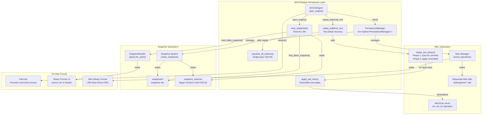
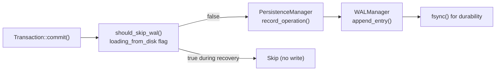
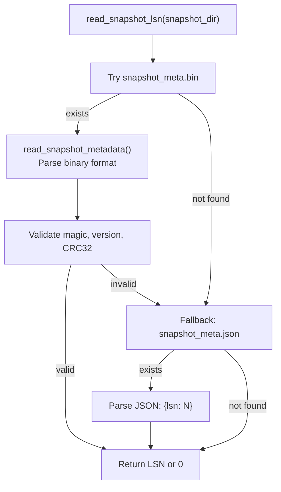
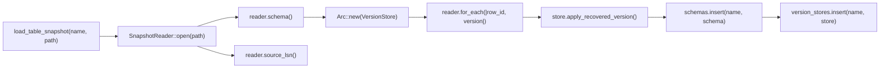
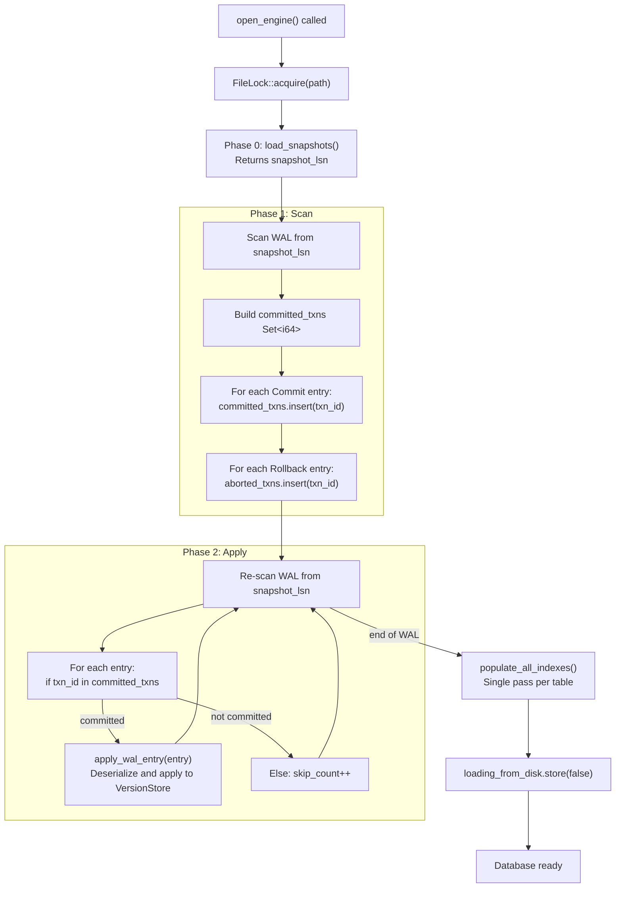
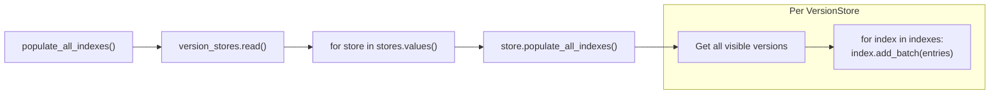
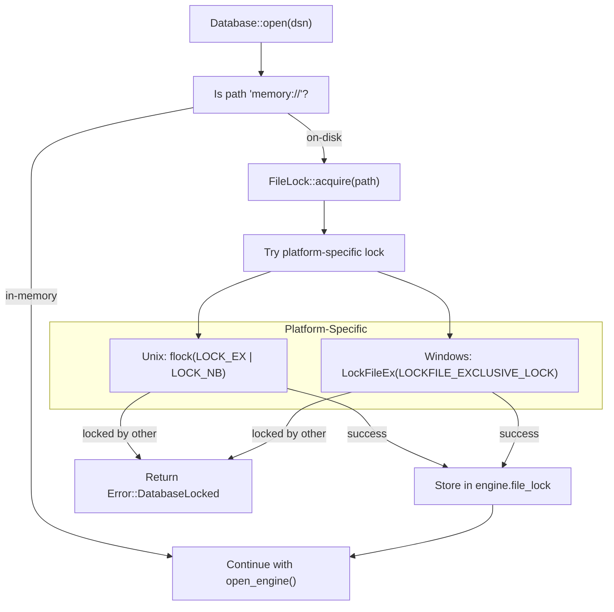

# Page: Persistence and Recovery

# Persistence and Recovery

<details>
<summary>Relevant source files</summary>

The following files were used as context for generating this wiki page:

- [src/storage/mvcc/btree_index.rs](src/storage/mvcc/btree_index.rs)
- [src/storage/mvcc/engine.rs](src/storage/mvcc/engine.rs)
- [src/storage/mvcc/hash_index.rs](src/storage/mvcc/hash_index.rs)
- [tests/persistence_trace_test.rs](tests/persistence_trace_test.rs)

</details>


This document describes Oxibase's durability guarantees and crash recovery mechanisms. The system uses a combination of Write-Ahead Logging (WAL) and periodic snapshots to ensure data is never lost after a transaction commits. Recovery uses a two-phase algorithm to guarantee that only committed transactions are visible after a crash.

For transaction semantics and MVCC implementation details, see [MVCC Architecture](#4.1). For the `MVCCEngine` API and table management, see [Version Store and Tables](#4.2).

## System Overview

Oxibase achieves durability through three mechanisms:

| Component | Purpose | Format |
|-----------|---------|--------|
| **Write-Ahead Log (WAL)** | Records every committed transaction before applying to memory | Binary with CRC32 checksums |
| **Snapshots** | Periodic checkpoints of entire database state | Binary per-table format with metadata |
| **Recovery Manager** | Replays WAL after snapshots on startup | Two-phase: identify committed txns, then apply |

The `PersistenceManager` coordinates these subsystems in a background thread. WAL entries are flushed synchronously on commit to guarantee durability. Snapshots are created asynchronously to reduce recovery time without impacting write latency.



**Sources:** [src/storage/mvcc/engine.rs:280-360](), [src/storage/mvcc/engine.rs:365-485](), [src/storage/mvcc/engine.rs:494-645]()

## Write-Ahead Log (WAL)

### WAL Entry Format

Each WAL entry consists of a header followed by operation-specific data. The format is:

```
[LSN: 8 bytes] [Size: 8 bytes] [Entry Data: Size bytes]

Entry Data:
  [txn_id: 8 bytes]
  [row_id: 8 bytes]
  [timestamp: 8 bytes]
  [table_name_len: 2 bytes]
  [table_name: variable]
  [operation: 1 byte]
  [operation_data: variable]
  [CRC32: 4 bytes]
```

The CRC32 checksum covers the entire entry data, detecting corruption during recovery.

**Sources:** [tests/persistence_trace_test.rs:58-110]()

### WAL Operation Types

The `WALOperationType` enum defines all logged operations:

| Operation | Value | Data Format |
|-----------|-------|-------------|
| `CreateTable` | 1 | Serialized `Schema` (table name, columns, constraints) |
| `DropTable` | 2 | Empty (table name in header) |
| `Insert` | 3 | Serialized `RowVersion` (values, txn_id, deleted_at) |
| `Update` | 4 | Serialized `RowVersion` (new version) |
| `Delete` | 5 | Row ID only (marks deleted_at) |
| `Commit` | 6 | Transaction ID (LSN becomes commit sequence) |
| `Rollback` | 7 | Transaction ID |
| `AlterTable` | 8 | Operation type + serialized ALTER details |
| `CreateIndex` | 9 | Serialized `IndexMetadata` |
| `DropIndex` | 10 | Index name string |
| `CreateView` | 11 | Serialized `ViewDefinition` |
| `DropView` | 12 | View name string |

**Sources:** [src/storage/mvcc/engine.rs:532-645]()

### WAL Recording

The `MVCCEngine` records operations via `record_ddl()` for schema changes and the `PersistenceManager` for DML operations. The `should_skip_wal()` check prevents redundant logging during recovery replay:



The `loading_from_disk` atomic flag (type `Arc<AtomicBool>`) is set during `open_engine()` recovery and cleared after replay completes. This prevents WAL entries from being written for operations that are themselves being replayed from the WAL.

**Sources:** [src/storage/mvcc/engine.rs:1080-1096](), [src/storage/mvcc/engine.rs:274-277](), [src/storage/mvcc/engine.rs:345-357]()

## Snapshot System

### Snapshot Metadata Format

The snapshot system uses a binary metadata file to track snapshot LSN:

```
snapshot_meta.bin:
  [Magic: 4 bytes]    = 0x50414E53 ("SNAP" little-endian)
  [Version: 4 bytes]  = 1
  [LSN: 8 bytes]      = Last committed LSN in snapshot
  [Timestamp: 8 bytes] = Unix epoch milliseconds
  [CRC32: 4 bytes]    = Checksum of above 24 bytes
```

The `write_snapshot_metadata()` function performs a three-phase atomic write:

1. Write to temporary file `snapshot_meta.bin.tmp`
2. `fsync()` the file
3. Atomic rename to `snapshot_meta.bin`
4. `fsync()` parent directory to ensure rename durability

**Sources:** [src/storage/mvcc/engine.rs:44-107]()

### Snapshot Reading with Backward Compatibility

The `read_snapshot_lsn()` function supports both the new binary format and legacy JSON format (`snapshot_meta.json`) for backward compatibility:



The function returns `0` if no valid metadata is found, causing recovery to replay the entire WAL from the beginning.

**Sources:** [src/storage/mvcc/engine.rs:109-174]()

### Per-Table Snapshot Format

Each table's snapshot is stored in `snapshots/<table_name>/snapshot-<timestamp>.bin`. The v3 format includes the source LSN in the header, providing a fallback if the metadata file is missing or corrupted:

```rust
// Snapshot v3 header (conceptual)
struct SnapshotHeader {
    magic: u32,           // Format identifier
    version: u32,         // = 3
    source_lsn: u64,      // LSN when snapshot created
    schema: Schema,       // Serialized schema
    row_count: u64,       // Number of rows
}
```

The `load_table_snapshot()` method reads the header, creates a `VersionStore`, and applies all row versions with `txn_id = RECOVERY_TRANSACTION_ID`:



**Sources:** [src/storage/mvcc/engine.rs:443-485]()

## Recovery Process

### Two-Phase Recovery Algorithm

Oxibase uses a two-phase recovery algorithm to ensure only committed transactions are visible after a crash. This is critical because a crash may occur after some WAL entries are written but before the corresponding `Commit` entry.



The `replay_two_phase()` method in `PersistenceManager` implements this algorithm, returning a `RecoveryInfo` struct with statistics:

```rust
struct RecoveryInfo {
    applied_entries: usize,
    skipped_entries: usize,  // Aborted or uncommitted transactions
}
```

**Sources:** [src/storage/mvcc/engine.rs:494-521]()

### WAL Entry Application

The `apply_wal_entry()` method deserializes each entry and applies it to the appropriate data structure:

| Operation | Action |
|-----------|--------|
| `CreateTable` | Deserialize `Schema`, create `VersionStore`, insert into `schemas` and `version_stores` |
| `DropTable` | Remove from `schemas` and `version_stores`, call `store.close()` |
| `CreateIndex` | Call `store.create_index_from_metadata(meta, skip_population=true)` |
| `DropIndex` | Call `store.drop_index(name)` |
| `Insert`/`Update` | Deserialize `RowVersion`, call `store.apply_recovered_version(version)` |
| `Delete` | Call `store.mark_deleted(row_id, txn_id)` |
| `Commit` | Call `registry.recover_committed_transaction(txn_id, lsn as i64)` |
| `Rollback` | No action (entries skipped in phase 2) |
| `AlterTable` | Call `replay_alter_table(data)` to parse and apply schema change |
| `CreateView` | Deserialize `ViewDefinition`, insert into `views` map |
| `DropView` | Remove from `views` map |

The `skip_population=true` flag for `CreateIndex` defers index building until after all WAL entries are applied, enabling a single-pass `O(N + M)` index population instead of `O(N * M)` incremental updates.

**Sources:** [src/storage/mvcc/engine.rs:532-645]()

### Index Population

After WAL replay completes, `populate_all_indexes()` builds all indexes in a single pass per table:



This optimization changes index recovery from `O(N * M)` (where N = rows, M = indexes) to `O(N + M)` by iterating rows once and updating all indexes simultaneously.

**Sources:** [src/storage/mvcc/engine.rs:523-529]()

## File Locking

The `FileLock` mechanism prevents multiple processes from opening the same database simultaneously, which would cause WAL and snapshot corruption:



The lock is automatically released when the `FileLock` is dropped (on `close_engine()` or database shutdown). This is a database-level exclusive lock, distinct from the row-level MVCC locking used for concurrency control within a single process.

**Sources:** [src/storage/mvcc/engine.rs:26](), [src/storage/mvcc/engine.rs:278](), [src/storage/mvcc/engine.rs:331-335](), [src/storage/mvcc/engine.rs:804-808]()

## Schema Change Recovery

ALTER TABLE operations are logged with a type byte and operation-specific data. The `replay_alter_table()` method parses and applies these changes:

```rust
// ALTER TABLE operation types
1 = AddColumn:    table_name + column_name + data_type + nullable + default_expr
2 = DropColumn:   table_name + column_name
3 = RenameColumn: table_name + old_name + new_name
4 = ModifyColumn: table_name + column_name + data_type + nullable
5 = RenameTable:  old_table_name + new_table_name
```

Each operation is re-executed by calling the corresponding `MVCCEngine` method (`create_column_with_default()`, `drop_column()`, etc.), which updates the `Schema` and propagates changes to the `VersionStore`.

**Sources:** [src/storage/mvcc/engine.rs:845-1077]()

## Configuration

Persistence is controlled by the `PersistenceConfig` struct (referenced but not shown in the provided files). Key parameters include:

- `enabled`: Whether to use WAL and snapshots (default: `true` for disk-based databases)
- WAL segment size and rotation policy
- Snapshot frequency and retention
- Compression settings

The `PersistenceManager` is only initialized if `config.persistence.enabled` is `true` and a non-empty path is provided:

```rust
let persistence = if !path.is_empty() && config.persistence.enabled {
    PersistenceManager::new(Some(Path::new(&path)), &config.persistence).ok()
} else {
    None
};
```

For in-memory databases (`"memory://"`), persistence is skipped entirely.

**Sources:** [src/storage/mvcc/engine.rs:284-298]()

## Recovery Example

The following trace shows a complete recovery cycle:

1. **Phase 1: Write Data**
   - `CREATE TABLE test (id INTEGER PRIMARY KEY, value INTEGER)` → WAL entry (CreateTable)
   - `INSERT INTO test VALUES (1, 100)` → WAL entries (Insert, Commit)
   - `INSERT INTO test VALUES (2, 200)` → WAL entries (Insert, Commit)
   - Database closed gracefully

2. **Phase 2: Recovery**
   - `Database::open()` → `open_engine()` → `load_snapshots()` → returns 0 (no snapshots)
   - `replay_wal(0)` → two-phase replay from beginning
     - Phase 1: Scan finds 3 committed transactions
     - Phase 2: Apply CreateTable, 2 Inserts
   - `populate_all_indexes()` → builds primary key index
   - `SELECT COUNT(*) FROM test` → returns 2 ✅

This test demonstrates that all committed data survives a restart, satisfying the durability guarantee of ACID transactions.

**Sources:** [tests/persistence_trace_test.rs:19-154]()