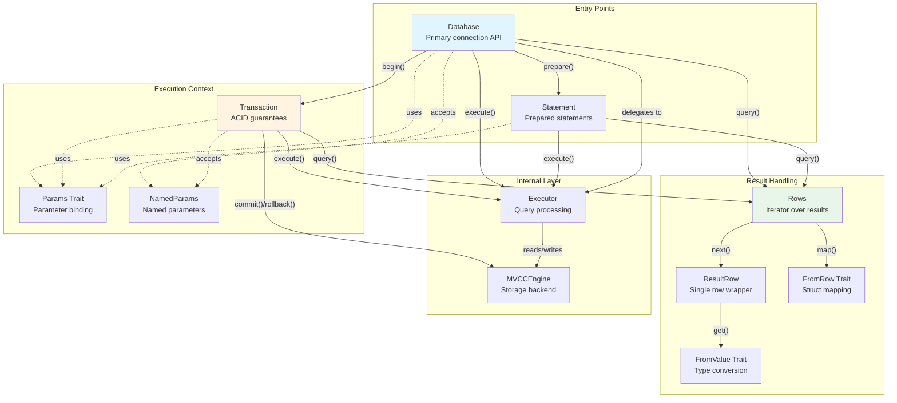
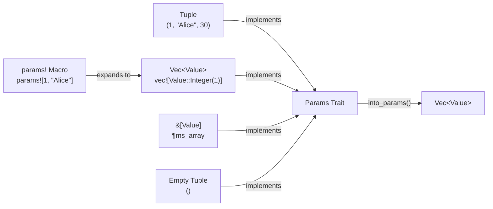
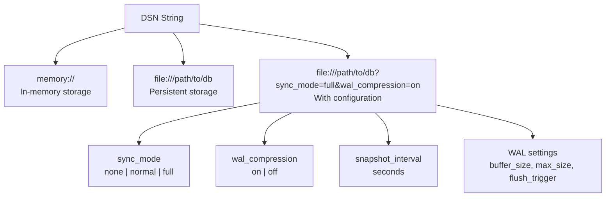
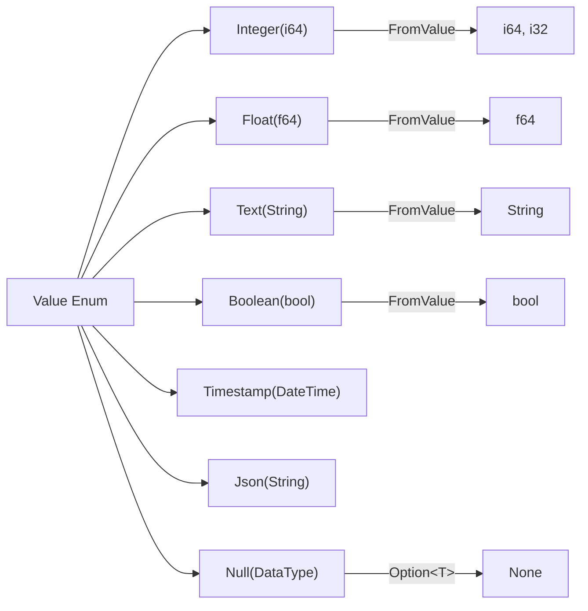
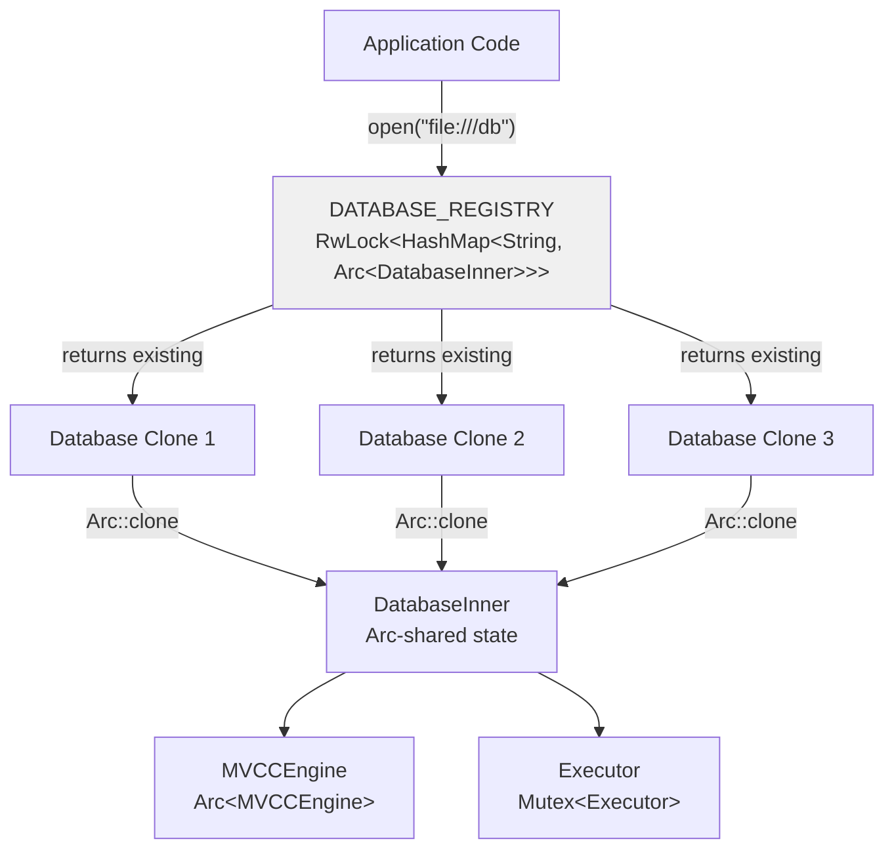
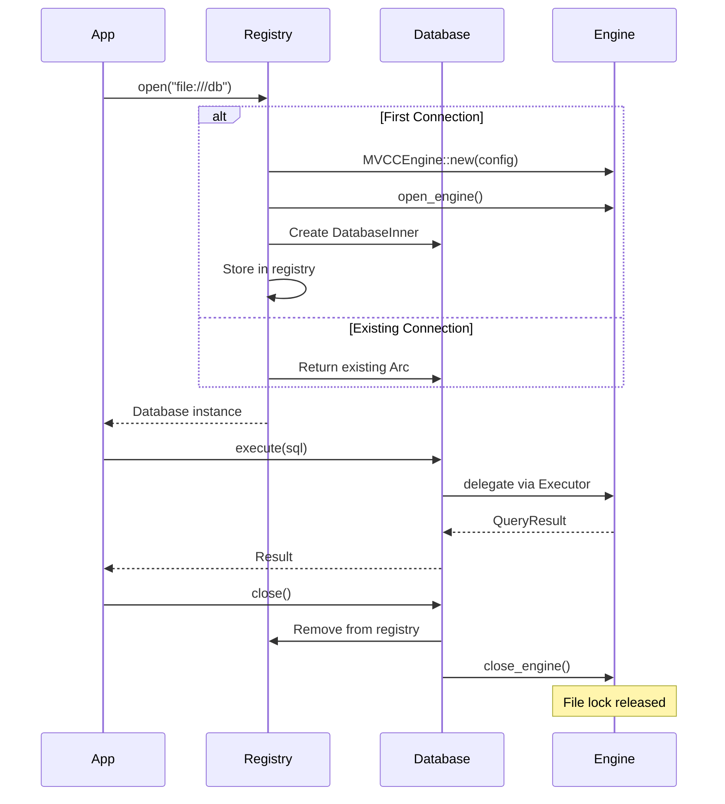
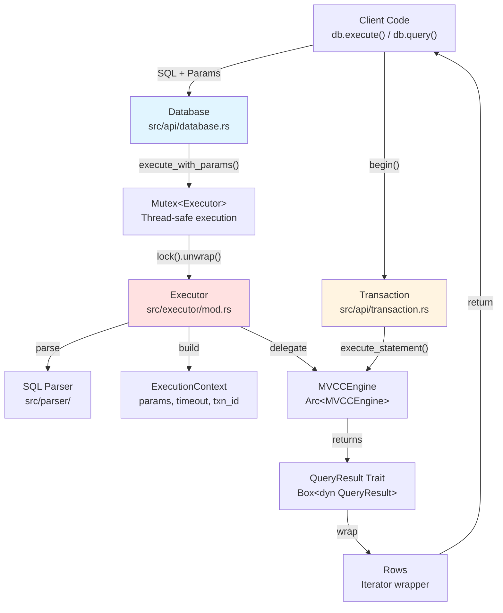

# Page: Public API

# Public API

<details>
<summary>Relevant source files</summary>

The following files were used as context for generating this wiki page:

- [.gitignore](.gitignore)
- [README.md](README.md)
- [ROADMAP.md](ROADMAP.md)
- [docs/_config.yml](docs/_config.yml)
- [src/api/database.rs](src/api/database.rs)
- [src/api/transaction.rs](src/api/transaction.rs)
- [src/executor/ddl.rs](src/executor/ddl.rs)
- [src/executor/expression/evaluator_bridge.rs](src/executor/expression/evaluator_bridge.rs)
- [src/executor/expression/mod.rs](src/executor/expression/mod.rs)

</details>


The Public API layer provides user-facing interfaces for interacting with OxiBase. This layer wraps the internal query executor and storage engine, exposing a simple, ergonomic Rust API for database operations.

For detailed information about specific components:
- Database connection management: see [Database API](#2.1)
- Transaction handling: see [Transactions](#2.2)  
- Query result iteration: see [Query Results](#2.3)

## Overview

The Public API consists of three primary components that form a cohesive interface for database operations:

1. **Database** - The main entry point for opening connections and executing queries
2. **Transaction** - ACID-compliant transaction support with commit/rollback semantics
3. **Rows** - Iterator-based result streaming for query results

These components are designed to provide a familiar Rust API similar to other database libraries while maintaining zero-copy performance where possible.

## API Structure



**Sources:** [src/api/database.rs:1-887](), [src/api/transaction.rs:1-746]()

## Core Components

### Database Connection

The `Database` struct is the primary entry point for all database operations. It manages the connection lifecycle, provides query execution methods, and supports both in-memory and persistent storage.

**Key Operations:**

| Method | Purpose | Returns |
|--------|---------|---------|
| `open(dsn)` | Open connection via DSN | `Result<Database>` |
| `open_in_memory()` | Create in-memory database | `Result<Database>` |
| `execute(sql, params)` | Execute DML/DDL statement | `Result<i64>` (rows affected) |
| `query(sql, params)` | Execute SELECT query | `Result<Rows>` |
| `query_one(sql, params)` | Get single value | `Result<T>` |
| `begin()` | Start transaction | `Result<Transaction>` |
| `prepare(sql)` | Create prepared statement | `Result<Statement>` |

**Sources:** [src/api/database.rs:84-886]()

### Transaction Management

The `Transaction` struct provides ACID guarantees for multi-statement operations. Transactions must be explicitly committed or will auto-rollback on drop.

**Key Operations:**

| Method | Purpose | Returns |
|--------|---------|---------|
| `execute(sql, params)` | Execute within transaction | `Result<i64>` |
| `query(sql, params)` | Query within transaction | `Result<Rows>` |
| `commit()` | Commit changes | `Result<()>` |
| `rollback()` | Discard changes | `Result<()>` |
| `id()` | Get transaction ID | `i64` |

**Sources:** [src/api/transaction.rs:47-605]()

### Parameter Binding

Parameters are bound using the `Params` trait, which supports multiple input types:



**Positional Parameters:**
```rust
// Using tuple syntax
db.execute("INSERT INTO users VALUES ($1, $2, $3)", (1, "Alice", 30))?;

// Using params! macro
db.execute("INSERT INTO users VALUES ($1, $2)", params![1, "Alice"])?;

// Single parameter requires trailing comma
db.query("SELECT * FROM users WHERE id = $1", (1,))?;
```

**Named Parameters:**
```rust
use oxibase::named_params;

db.execute_named(
    "INSERT INTO users (id, name, age) VALUES (:id, :name, :age)",
    named_params!{ id: 1, name: "Alice", age: 30 }
)?;
```

**Sources:** [src/api/database.rs:366-413](), [src/api/database.rs:609-651]()

## DSN Configuration

Database connections are opened using Data Source Names (DSN) with optional query parameters:



**Configuration Parameters:**

| Parameter | Values | Default | Description |
|-----------|--------|---------|-------------|
| `sync_mode` | none, normal, full | normal | fsync durability level |
| `wal_compression` | on, off | off | Compress WAL entries |
| `snapshot_compression` | on, off | off | Compress snapshots |
| `snapshot_interval` | seconds | 300 | Snapshot frequency |
| `wal_flush_trigger` | bytes | 32768 | WAL flush threshold |
| `wal_buffer_size` | bytes | 65536 | WAL buffer capacity |
| `commit_batch_size` | count | 100 | Batch commit size |

**Example:**
```rust
// In-memory database
let db = Database::open("memory://")?;

// Persistent with full durability
let db = Database::open("file:///data/mydb?sync_mode=full&wal_compression=on")?;
```

**Sources:** [src/api/database.rs:230-364]()

## Type System

### Value Conversions

The `FromValue` trait handles type conversions from database values to Rust types:



**Supported Conversions:**

| Rust Type | Database Types | Notes |
|-----------|---------------|-------|
| `i64` | INTEGER, FLOAT | Float truncated |
| `i32` | INTEGER, FLOAT | Cast from i64 |
| `f64` | FLOAT, INTEGER | Integer promoted |
| `String` | TEXT, JSON, all types | Formatted for non-strings |
| `bool` | BOOLEAN, INTEGER | 0=false, non-zero=true |
| `Value` | All types | Identity conversion |
| `Option<T>` | All types | NULL → None |

**Sources:** [src/api/database.rs:888-979]()

### Row Mapping

The `FromRow` trait enables automatic mapping from query results to structs:

```rust
use oxibase::{FromRow, ResultRow, Result};

struct User {
    id: i64,
    name: String,
    age: Option<i32>,
}

impl FromRow for User {
    fn from_row(row: &ResultRow) -> Result<Self> {
        Ok(User {
            id: row.get(0)?,
            name: row.get(1)?,
            age: row.get(2)?,
        })
    }
}

// Query and map to structs
let users: Vec<User> = db.query_as(
    "SELECT id, name, age FROM users WHERE age > $1",
    (18,)
)?;
```

**Sources:** [src/api/database.rs:674-743]()

## Thread Safety and Connection Pooling

### Single Engine Instance per DSN

The `Database` struct uses a global registry to ensure only one storage engine instance exists per DSN:



**Key Properties:**

- `Database` is `Clone` and `Send + Sync`
- Multiple `Database` instances with same DSN share the underlying engine
- Executor is protected by `Mutex` for thread-safe query execution
- Storage engine (`MVCCEngine`) is wrapped in `Arc` for shared ownership

**Sources:** [src/api/database.rs:67-204]()

### Connection Lifecycle



**Explicit Close:**
```rust
// Explicitly close to release file lock immediately
db.close()?;

// Without close(), engine closes when all Database instances drop
```

**Sources:** [src/api/database.rs:140-205](), [src/api/database.rs:789-808]()

## Query Execution Flow



**Sources:** [src/api/database.rs:399-413](), [src/api/transaction.rs:169-191]()

## Error Handling

All API methods return `Result<T, Error>` where `Error` is OxiBase's unified error type:

| Error Variant | When Raised | Example |
|---------------|-------------|---------|
| `ParseError` | Invalid SQL syntax | `"SELECTT * FROM users"` |
| `TableNotFoundByName` | Table doesn't exist | `"SELECT * FROM missing"` |
| `ColumnNotFoundNamed` | Column doesn't exist | `"SELECT invalid FROM users"` |
| `TypeConversion` | Type mismatch | `row.get::<i64>("text_column")` |
| `TransactionEnded` | Use after commit/rollback | `tx.execute()` after `tx.commit()` |
| `NoRowsReturned` | `query_one()` with 0 rows | Empty result set |
| `LockAcquisitionFailed` | Internal mutex poisoned | Panic in another thread |

**Sources:** [src/core/error.rs]() (inferred from usage patterns)

## Performance Considerations

### Prepared Statements

For repeated queries with different parameters, use prepared statements to avoid re-parsing:

```rust
let stmt = db.prepare("SELECT * FROM users WHERE age > $1")?;

// Execute multiple times efficiently
for age in [18, 21, 25, 30] {
    for row in stmt.query((age,))? {
        // process row
    }
}
```

**Sources:** [src/api/database.rs:564-583](), [src/api/statement.rs]() (inferred)

### Batch Operations

Use multi-row INSERT for bulk inserts:

```rust
// Efficient: single statement
db.execute(
    "INSERT INTO users VALUES ($1, $2), ($3, $4), ($5, $6)",
    (1, "Alice", 2, "Bob", 3, "Charlie")
)?;

// Less efficient: multiple statements
for (id, name) in users {
    db.execute("INSERT INTO users VALUES ($1, $2)", (id, name))?;
}
```

### Query Timeouts

Prevent runaway queries with timeout controls:

```rust
// Execute with 5 second timeout
db.execute_with_timeout(
    "DELETE FROM logs WHERE created < $1",
    (cutoff_date,),
    5000  // milliseconds
)?;

// Query with 10 second timeout
let rows = db.query_with_timeout(
    "SELECT * FROM large_table",
    (),
    10000
)?;
```

**Sources:** [src/api/database.rs:497-562]()

## Advanced Features

### Semantic Query Caching

The executor includes a semantic query cache that can subsume queries:

```rust
// Enable caching (on by default)
db.query("SELECT * FROM users WHERE age > 18", ())?;

// This query is subsumed by the cached result
db.query("SELECT * FROM users WHERE age > 20", ())?;

// Check cache statistics
let stats = db.semantic_cache_stats()?;
println!("Cache hits: {}", stats.hits);
println!("Subsumption hits: {}", stats.subsumption_hits);

// Clear cache if needed
db.clear_semantic_cache()?;
```

**Sources:** [src/api/database.rs:850-885]()

### Manual Snapshots

Create point-in-time snapshots for faster recovery:

```rust
// Create snapshot of current database state
db.create_snapshot()?;

// Snapshots are also created automatically based on snapshot_interval
```

**Sources:** [src/api/database.rs:834-843]()

### Transaction Isolation Levels

Control transaction visibility with isolation levels:

```rust
use oxibase::IsolationLevel;

// Default: Read Committed
let tx = db.begin()?;

// Snapshot Isolation: consistent view throughout transaction
let tx = db.begin_with_isolation(IsolationLevel::Snapshot)?;

// Set default for all new transactions
db.set_default_isolation_level(IsolationLevel::Snapshot)?;
```

**Sources:** [src/api/database.rs:745-831]()

## API Design Patterns

### Builder Pattern for Contexts

The `ExecutionContextBuilder` provides a fluent API for configuring query execution:

```rust
// Internal usage in Database methods
let ctx = ExecutionContextBuilder::new()
    .params(param_values)
    .timeout_ms(timeout_ms)
    .build();

let result = executor.execute_with_context(sql, &ctx)?;
```

**Sources:** [src/api/database.rs:520-526](), [src/executor/context.rs]() (inferred)

### Iterator-Based Results

Query results use standard Rust iterator patterns:

```rust
// Collect into Vec
let rows: Vec<_> = db.query("SELECT * FROM users", ())?
    .collect::<Result<Vec<_>, _>>()?;

// Filter and map
let names: Vec<String> = db.query("SELECT id, name FROM users", ())?
    .filter_map(|r| r.ok())
    .map(|r| r.get::<String>(1).unwrap())
    .collect();

// Take first N
let first_10: Vec<_> = db.query("SELECT * FROM users", ())?
    .take(10)
    .collect::<Result<Vec<_>, _>>()?;
```

For detailed information about result iteration, see [Query Results](#2.3).

**Sources:** [src/api/database.rs:440-458]()