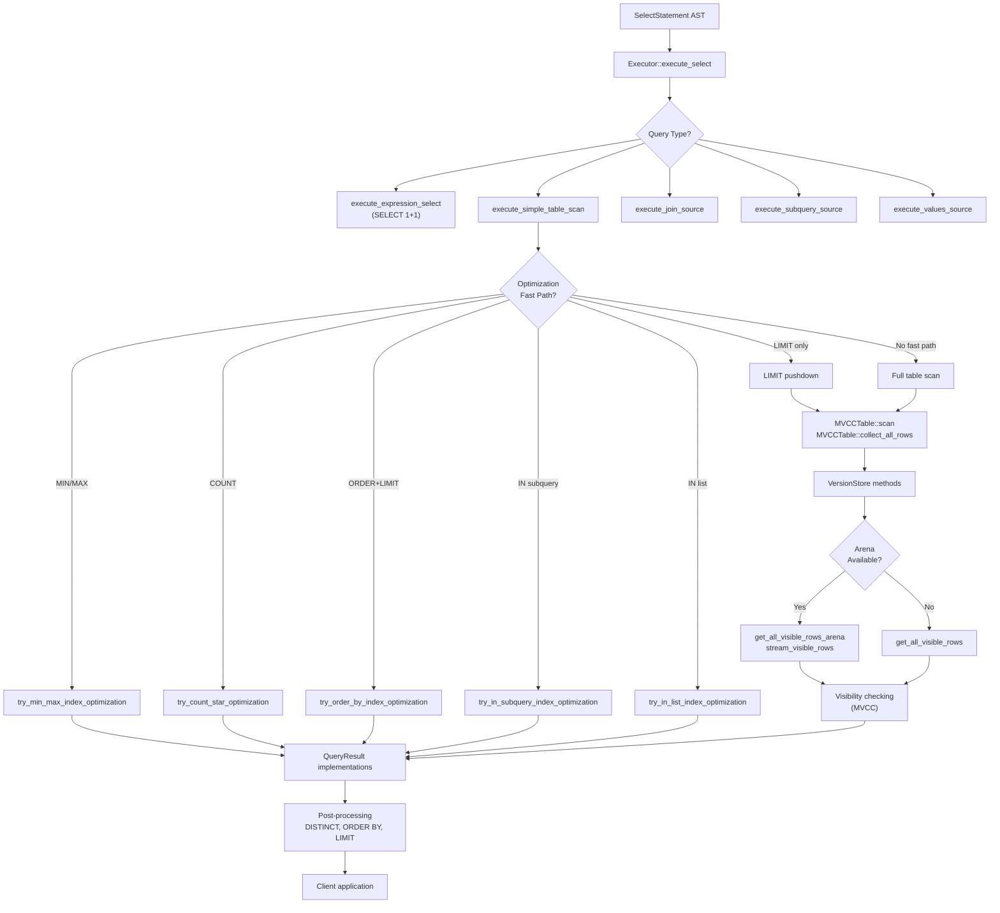
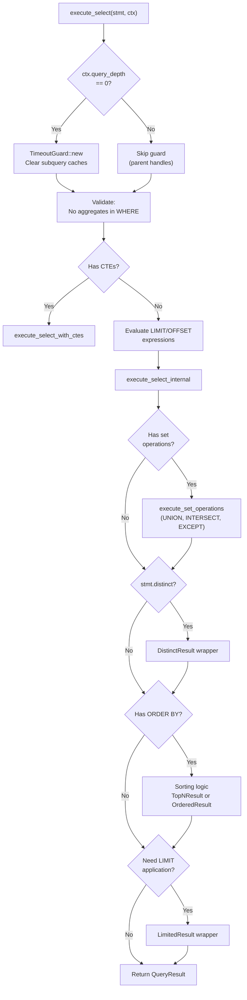
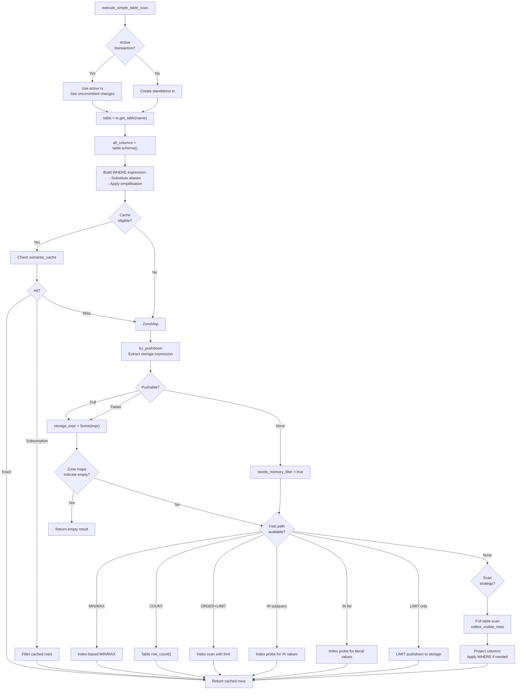
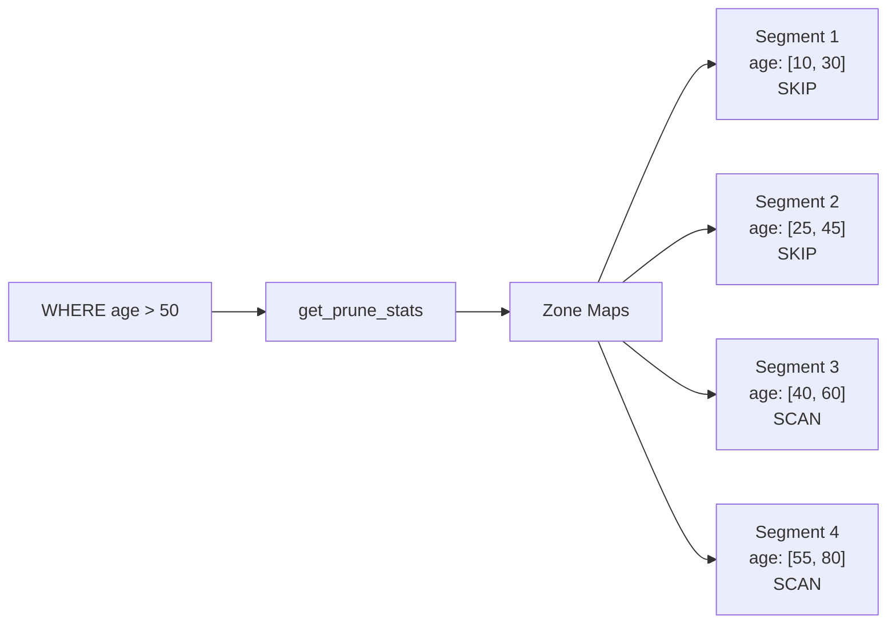
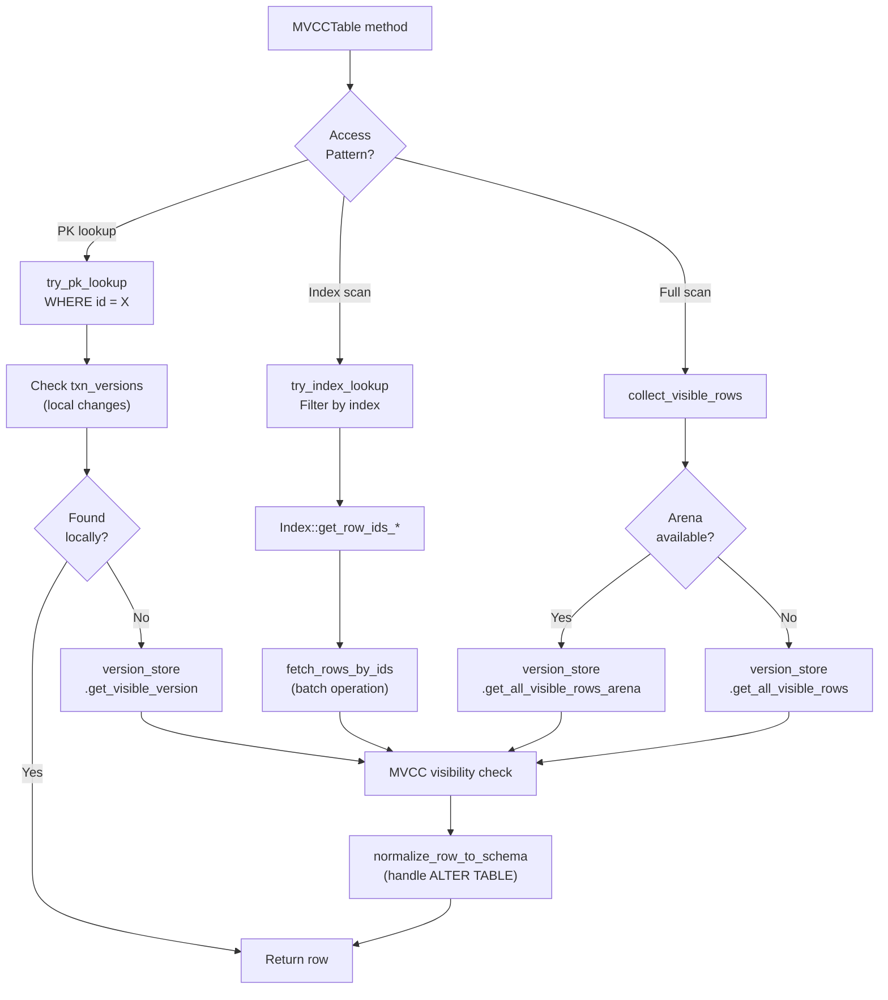
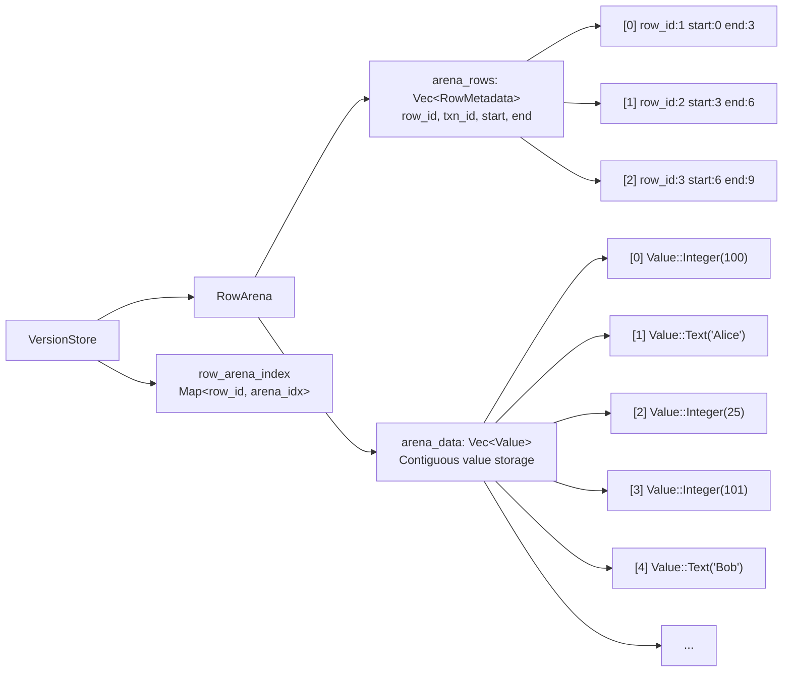
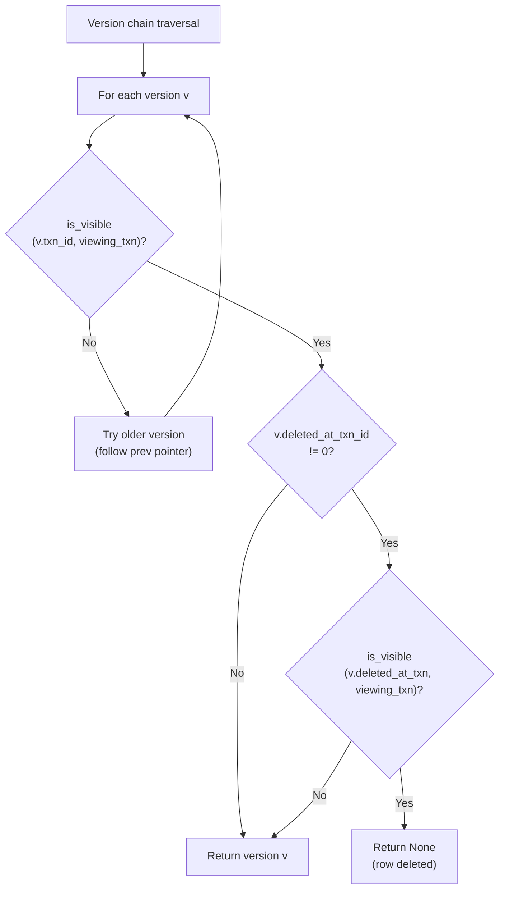
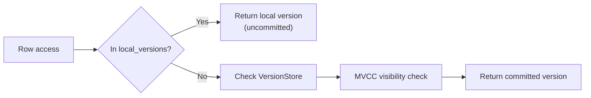

# Page: Query Execution Pipeline

# Query Execution Pipeline

<details>
<summary>Relevant source files</summary>

The following files were used as context for generating this wiki page:

- [src/executor/query.rs](src/executor/query.rs)
- [src/storage/mvcc/table.rs](src/storage/mvcc/table.rs)
- [src/storage/mvcc/version_store.rs](src/storage/mvcc/version_store.rs)

</details>


## Purpose and Scope

This document describes the core SELECT query execution pipeline in Oxibase, covering how SELECT statements are processed from parsed AST to final results. It focuses on the table scanning strategies, optimization paths, and data flow through the execution layers.

For information about:
- Expression evaluation (WHERE clauses, function calls): see [Expression Evaluation](#3.2)
- Subquery processing (IN, EXISTS, scalar subqueries): see [Subquery Execution](#3.3)
- Aggregation operations (GROUP BY, ROLLUP, CUBE): see [Aggregation and GROUP BY](#3.4)
- Window functions (OVER clauses): see [Window Functions](#3.5)
- CTE handling (WITH clauses): see [Common Table Expressions](#3.6)
- Query optimization strategies: see [Query Optimization](#6.1)
- MVCC transaction semantics: see [MVCC Architecture](#4.1)

---

## Architecture Overview

The query execution pipeline consists of three primary layers: the **Executor** layer (query processing logic), the **MVCCTable** layer (transaction-aware table interface), and the **VersionStore** layer (row version management).



**Diagram: Query execution pipeline data flow from AST to results**

Sources: [src/executor/query.rs:155-719](), [src/storage/mvcc/table.rs:1054-1647](), [src/storage/mvcc/version_store.rs:700-747]()

---

## Execution Entry Point

The `Executor::execute_select` method is the main entry point for SELECT statement execution. It coordinates timeout handling, cache clearing, and routing to specialized execution paths.



**Diagram: execute_select control flow and result wrapping**

Key behaviors:
- **Timeout management**: Top-level queries (depth 0) create a `TimeoutGuard` that monitors execution time
- **Cache clearing**: Subquery result caches are cleared at query start to prevent stale data
- **Result wrapping**: The pipeline wraps results in specialized iterators (`DistinctResult`, `OrderedResult`, `LimitedResult`) for lazy evaluation
- **LIMIT/OFFSET evaluation**: These expressions are evaluated early to enable set operation optimizations

Sources: [src/executor/query.rs:155-227](), [src/executor/query.rs:268-292](), [src/executor/query.rs:300-719]()

---

## Table Scanning Strategies

The `execute_simple_table_scan` method implements multiple scanning strategies, automatically selecting the most efficient approach based on query characteristics.

### Strategy Selection Flow



**Diagram: Table scanning strategy selection and fast path routing**

Sources: [src/executor/query.rs:962-1385]()

### Semantic Cache

The semantic cache stores results of previous queries and uses **subsumption detection** to serve queries whose predicates are subsumed by cached queries.

**Example**: If the cache contains `WHERE age > 25 AND city = 'NYC'`, it can serve `WHERE age > 30 AND city = 'NYC'` by filtering cached rows in memory (30 > 25, so the cached set is a superset).

Cache eligibility requirements:
- `SELECT *` queries only (cache stores full rows)
- Has WHERE clause
- No aggregation, window functions, or GROUP BY
- No subqueries in WHERE
- No parameters (`$1`, `$2`, etc.) - values not available in AST
- Not in explicit transaction (MVCC isolation safety)
- No ORDER BY, DISTINCT, or LIMIT (would need full result)

Sources: [src/executor/query.rs:1071-1160]()

### Zone Map Pruning

Before scanning, the executor checks zone maps (min/max statistics per segment) to skip entire segments when predicates fall outside their ranges.



**Diagram: Zone map pruning skips segments where predicate cannot match**

Zone maps are disabled during aggregation queries (`COUNT(*)`, `SUM(x)`, etc.) because aggregation on empty results must still produce output (e.g., `COUNT(*) = 0`).

Sources: [src/executor/query.rs:1182-1206](), [src/storage/mvcc/version_store.rs:1500-1557]()

---

## Optimization Fast Paths

The executor implements several fast paths that bypass general-purpose scanning when query patterns match specific optimizations.

### MIN/MAX Index Optimization

For queries like `SELECT MIN(col) FROM table` or `SELECT MAX(col) FROM table` without WHERE or GROUP BY, the executor uses index min/max values directly (O(1) instead of O(n)).

Eligibility:
- Single aggregate function (MIN or MAX)
- No WHERE clause
- No GROUP BY
- Column has an index

Sources: [src/executor/query.rs:1211-1217](), [src/executor/optimizations.rs:1-150]()

### COUNT(*) Pushdown

For `SELECT COUNT(*) FROM table` without WHERE or GROUP BY, the executor calls `table.row_count()` instead of scanning rows.

Eligibility:
- Single `COUNT(*)` or `COUNT(1)` expression
- No WHERE clause
- No GROUP BY

Sources: [src/executor/query.rs:1222-1226](), [src/executor/optimizations.rs:152-250]()

### ORDER BY + LIMIT Index Optimization

For queries like `SELECT * FROM table ORDER BY indexed_col LIMIT 10`, the executor uses the index to return rows in sorted order, avoiding a full scan and sort.

Eligibility:
- Single ORDER BY column
- Column has an index (BTree only, not Hash)
- Has LIMIT
- No GROUP BY, aggregation, window functions, or DISTINCT
- No WHERE clause (or pushable WHERE)

The executor performs an index range scan and stops after collecting `limit + offset` rows.

Sources: [src/executor/query.rs:1231-1246](), [src/executor/optimizations.rs:252-450]()

### IN Subquery Index Optimization

For queries like `SELECT * FROM table WHERE id IN (SELECT col FROM other WHERE ...)`, the executor:
1. Executes the subquery to get values
2. Probes the index for each value (if `id` is indexed)
3. Returns matching rows without scanning the entire table

Eligibility:
- WHERE clause is an IN expression with subquery
- Left side column has an index or is PRIMARY KEY
- No outer context (not correlated)
- No GROUP BY

Sources: [src/executor/query.rs:1251-1264](), [src/executor/optimizations.rs:452-650]()

### IN List Index Optimization

Similar to IN subquery, but for literal lists: `SELECT * FROM table WHERE id IN (1, 2, 3, 5, 8)`

The executor uses `Index::get_row_ids_in` for efficient multi-value lookup instead of scanning.

Sources: [src/executor/query.rs:1269-1283](), [src/executor/optimizations.rs:652-850]()

### LIMIT Pushdown

For queries like `SELECT * FROM table LIMIT 10` or `SELECT * FROM table WHERE indexed_col = value LIMIT 10` without ORDER BY, the executor stops scanning after collecting `limit + offset` rows.

This is implemented via `collect_rows_with_limit_unordered`, which terminates early without sorting (SQL doesn't guarantee order for LIMIT without ORDER BY).

Eligibility:
- Has LIMIT
- No ORDER BY (would need all rows for sorting)
- No GROUP BY, aggregation, window functions, or DISTINCT
- No memory-only filters (WHERE must be pushable or absent)

Performance: ~50x speedup for `LIMIT 100` on 10K rows compared to scanning all rows.

Sources: [src/executor/query.rs:1288-1385](), [src/storage/mvcc/table.rs:1682-1691](), [src/storage/mvcc/version_store.rs:904-983]()

---

## Data Access Layer

### MVCCTable Interface

`MVCCTable` provides the transaction-aware table interface. Key methods:

| Method | Purpose | Returns |
|--------|---------|---------|
| `scan(columns, where_expr)` | Create iterator with filter | `Box<dyn Scanner>` |
| `collect_all_rows(where_expr)` | Materialize filtered rows | `Vec<Row>` |
| `fetch_rows_by_ids(ids, filter)` | Batch fetch by row IDs | `Vec<(i64, Row)>` |
| `collect_rows_with_limit(...)` | Early termination scan | `Vec<Row>` |
| `collect_rows_with_limit_unordered(...)` | Unordered early termination | `Vec<Row>` |

The scan execution flow:



**Diagram: MVCCTable data access patterns and version resolution**

Sources: [src/storage/mvcc/table.rs:1586-1647](), [src/storage/mvcc/table.rs:1649-1691](), [src/storage/mvcc/table.rs:1063-1107]()

### Index Lookup Optimization

The `try_index_lookup` method implements sophisticated index usage strategies:

**Single-column predicates**: Direct index lookup
```
WHERE age = 25           → BTree/Hash equality
WHERE age > 25           → BTree range scan
WHERE name LIKE 'John%'  → BTree prefix range
WHERE id IN (1, 2, 3)    → Batch equality lookup
```

**Multi-column predicates (AND)**: Index intersection
```
WHERE age = 25 AND city = 'NYC'
→ Use indexes on both columns
→ Intersect row ID sets
→ Early termination if intersection is empty
```

**Multi-column index (composite keys)**: Leftmost prefix matching
```
Index on (a, b, c) can serve:
- WHERE a = 1                    ✓
- WHERE a = 1 AND b = 2          ✓
- WHERE a = 1 AND b = 2 AND c = 3 ✓
- WHERE b = 2                    ✗ (doesn't start with 'a')
```

**OR predicates**: Hybrid optimization
```
WHERE indexed_col = 'a' OR non_indexed_col = 'b'
→ Use index for first operand
→ Fall back to full scan (must include non-indexed rows)
```

Boolean equality is intentionally **not indexed** because boolean columns have low cardinality (only 2 values), making full scans faster than index lookup + row fetch.

Sources: [src/storage/mvcc/table.rs:196-551]()

---

## Arena-Based Zero-Copy Scanning

The `VersionStore` uses an **arena allocator** (`RowArena`) to store row data contiguously in memory, enabling zero-copy scanning.

### Arena Structure



**Diagram: Arena memory layout for zero-copy row access**

### Traditional vs Arena Scanning

**Traditional approach** (pre-arena):
```
for row_id in visible_rows {
    let version = versions.get(row_id).clone();  // Clone entire Row
    let row = version.data.clone();              // Another clone
    results.push((row_id, row));                 // Move into result
}
```

**Arena approach**:
```
// Single lock acquisition
let (arena_rows, arena_data) = arena.read_guards();

// Zero-copy iteration
for visible_idx in visible_indices {
    let meta = arena_rows[visible_idx];
    let slice = &arena_data[meta.start..meta.end];  // Slice, no clone
    // Process slice directly or clone only if needed
}
```

Performance: 50x+ speedup for full table scans due to:
- Contiguous memory (cache-friendly)
- Single lock acquisition instead of per-row locks
- Zero cloning during visibility checks
- Batch processing opportunities

Sources: [src/storage/mvcc/version_store.rs:755-817](), [src/storage/mvcc/arena.rs:1-300]()

### Streaming Result Iterator

`StreamingResult` provides true zero-copy iteration by holding arena locks for the entire scan duration and yielding `&[Value]` slices directly from arena memory.

```rust
let mut stream = version_store.stream_visible_rows(txn_id);
while stream.next() {
    let row_slice: &[Value] = stream.row_slice();  // Zero-copy!
    let row_id = stream.row_id();
    // Process without cloning...
}
```

**Fast path**: When no uncommitted writes exist, the iterator scans the arena directly without DashMap iteration, providing O(n) performance.

Sources: [src/storage/mvcc/version_store.rs:1243-1351](), [src/storage/mvcc/streaming_result.rs:1-200]()

---

## MVCC Visibility Checking

Every row access checks **visibility** to implement MVCC snapshot isolation.

### Visibility Rules



**Diagram: MVCC visibility checking algorithm**

A version is visible if:
1. The creating transaction is visible to the viewing transaction
2. Either the version is not deleted, OR the deleting transaction is not visible

This allows transactions to see their own uncommitted changes while isolating from other transactions.

Sources: [src/storage/mvcc/version_store.rs:433-465](), [src/storage/mvcc/version_store.rs:659-693]()

### Transaction-Local Changes

`TransactionVersionStore` maintains uncommitted changes:
- `local_versions`: Map of row_id → version history
- `write_set`: Tracks original versions for conflict detection

When accessing rows, the executor checks local versions first, then global committed versions:



**Diagram: Two-tier version lookup for transaction isolation**

Sources: [src/storage/mvcc/version_store.rs:2217-2392](), [src/storage/mvcc/table.rs:846-914]()

---

## Result Processing

After scanning and filtering, the executor applies additional operations using wrapper result types.

### Result Type Hierarchy

| Type | Purpose | Performance Characteristic |
|------|---------|---------------------------|
| `ScannerResult` | Base scanner wrapper | Zero-copy iteration over scanner |
| `FilteredResult` | Apply WHERE clause | Lazy evaluation per row |
| `ExprFilteredResult` | Compiled expression filter | ~3-5x faster than FilteredResult |
| `ProjectedResult` | Column projection | O(1) per row |
| `StreamingProjectionResult` | Zero-copy projection | Avoids row clones |
| `OrderedResult` | Full sort (ORDER BY) | O(n log n) + O(n) clone |
| `TopNResult` | ORDER BY + LIMIT | O(n log k) with bounded heap |
| `DistinctResult` | Remove duplicates | O(n) with hash set |
| `LimitedResult` | LIMIT/OFFSET | O(1) skipping + early termination |
| `ExecutorMemoryResult` | Materialized in-memory | Used for cached results |

Sources: [src/executor/result.rs:1-2000]()

### ORDER BY Implementation

The executor implements multiple sorting strategies based on query characteristics:

**TopN optimization** (ORDER BY + LIMIT):
```rust
// Bounded min-heap keeps only top K rows
// O(n log k) instead of O(n log n)
TopNResult::new(result, comparator, limit, offset)
```

**Radix sort optimization** (integer columns):
```rust
// O(n) integer sorting when ORDER BY references integer columns
OrderedResult::new_radix(result, &specs, fallback_comparator)
```

**Comparison sort** (general case):
```rust
// Standard comparison-based sort
OrderedResult::new(result, comparator)
```

The executor pre-computes column indices for ORDER BY expressions to avoid string comparisons during sorting.

Sources: [src/executor/query.rs:313-704](), [src/executor/result.rs:800-1200]()

### DISTINCT Implementation

`DistinctResult` uses a hash set to track seen rows:

```rust
// For DISTINCT with extra ORDER BY columns:
// Only hash the SELECT columns (first N)
DistinctResult::with_column_count(result, Some(expected_columns))

// For standard DISTINCT:
DistinctResult::new(result)
```

When ORDER BY references columns not in SELECT, the executor:
1. Adds extra columns for sorting
2. Applies DISTINCT on original SELECT columns only
3. Projects back to original column count

Sources: [src/executor/query.rs:298-311](), [src/executor/result.rs:1400-1600]()

---

## Performance Characteristics

### Execution Time Complexity

| Operation | Best Case | Typical Case | Notes |
|-----------|-----------|--------------|-------|
| PK lookup | O(1) | O(1) | Direct hash map access |
| Index equality | O(1) - O(log n) | O(log n) + k | Hash O(1), BTree O(log n) |
| Index range | O(log n + k) | O(log n + k) | BTree scan, k = result size |
| Full scan | O(n) | O(n) | Arena provides 50x speedup |
| Full scan + filter | O(n) | O(n) | Compiled filter 3-5x faster |
| ORDER BY | O(n log n) | O(n log n) | Radix sort O(n) for integers |
| ORDER BY + LIMIT | O(n log k) | O(n log k) | Bounded heap, k = limit |
| DISTINCT | O(n) | O(n) | Hash set deduplication |
| IN subquery (indexed) | O(k log n) | O(k log n) | k probes into index |
| IN list (indexed) | O(k) | O(k) | Batch equality lookup |

### Memory Usage

**Arena allocation**: Rows stored contiguously reduce memory fragmentation and improve cache locality.

**Zero-copy paths**: Streaming and arena-based scans avoid intermediate clones, reducing memory by ~2-3x for large result sets.

**Lazy evaluation**: Result wrappers implement `QueryResult` trait for lazy iteration, avoiding materialization until necessary.

### Lock Contention

**Single lock acquisition**: Arena scans acquire locks once at the start instead of per-row, reducing contention from O(n) to O(1).

**Batch operations**: Methods like `get_visible_versions_batch` use DashMap's sharded locking for concurrent access across multiple row_ids.

**Read-write separation**: Read operations on `VersionStore` use `Arc<VersionChainEntry>` for cheap cloning without blocking writers.

Sources: [src/storage/mvcc/version_store.rs:169-194](), [src/storage/mvcc/table.rs:813-839](), [src/executor/result.rs:1-100]()

---

## Integration with Other Systems

The query execution pipeline integrates with:

- **Expression VM** ([#3.2](#3.2)): Compiles and evaluates WHERE clauses, projections, and ORDER BY expressions
- **Subquery executor** ([#3.3](#3.3)): Processes IN, EXISTS, and scalar subqueries before main query execution
- **Aggregation engine** ([#3.4](#3.4)): Detected by `has_aggregation(stmt)`, routes to specialized aggregation pipeline
- **Window function processor** ([#3.5](#3.5)): Detected by `has_window_functions(stmt)`, applies window functions after aggregation
- **CTE processor** ([#3.6](#3.6)): Detected by `has_cte(stmt)`, materializes CTEs before main query
- **Query optimizer** ([#6.1](#6.1)): Provides cost-based decisions (join algorithms, index selection, pushdown analysis)
- **MVCC transaction manager** ([#4.1](#4.1)): Provides visibility checking and transaction isolation
- **Index system** ([#4.3](#4.3)): Provides efficient row ID filtering for indexed predicates

Sources: [src/executor/query.rs:42-66](), [src/executor/query.rs:191-193](), [src/executor/query.rs:1019-1076]()