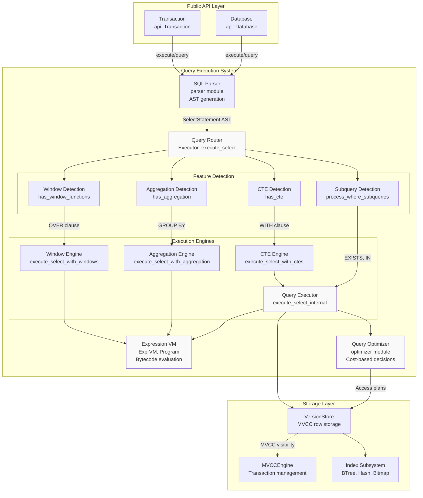
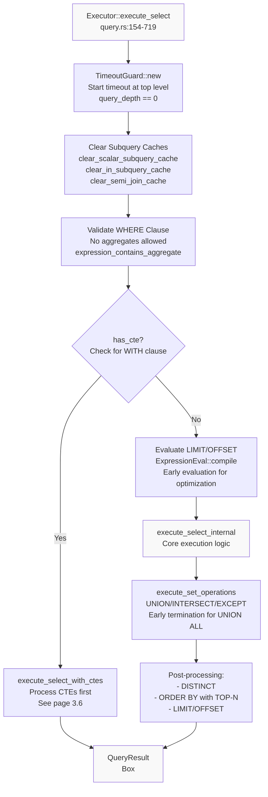
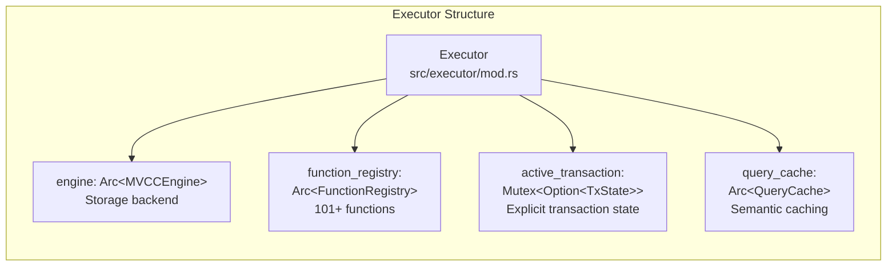
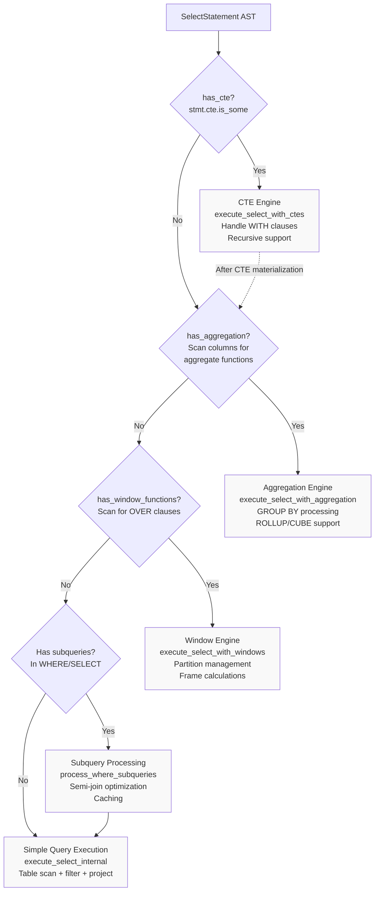
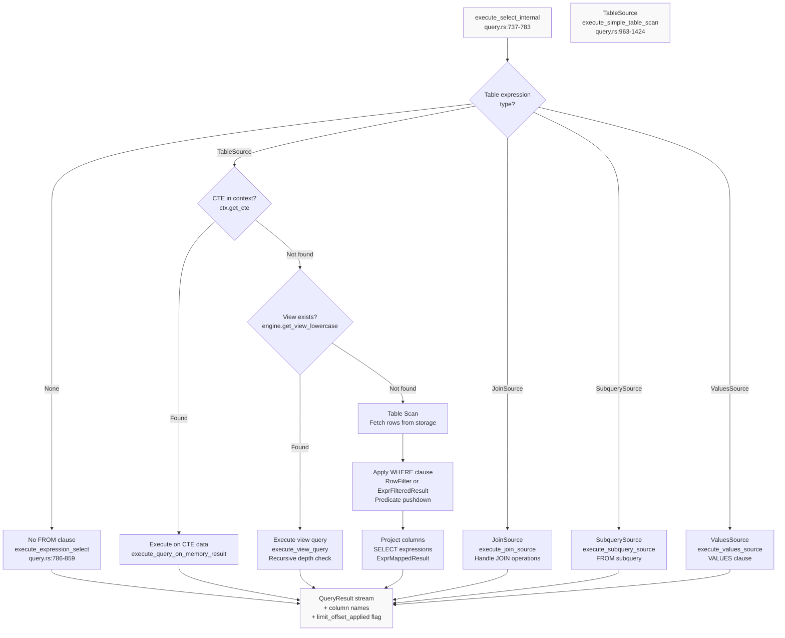
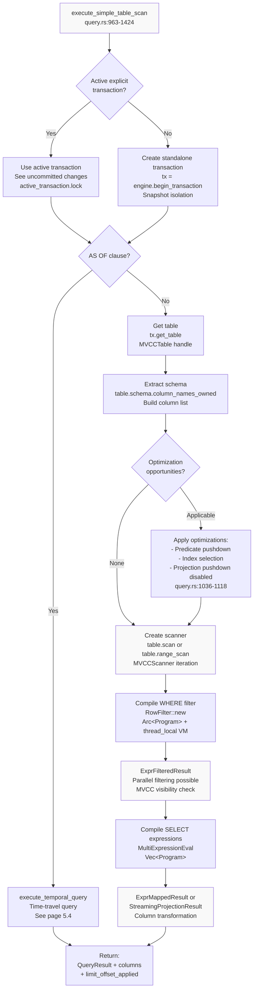
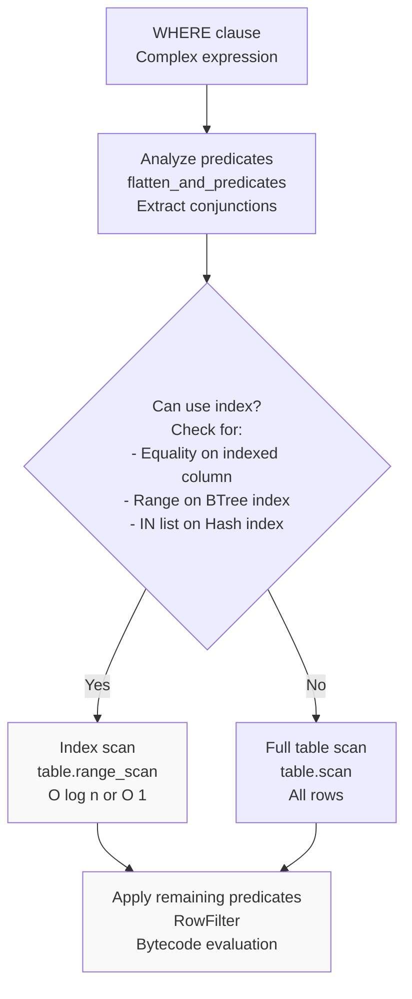

# Page: Query Execution System

# Query Execution System

<details>
<summary>Relevant source files</summary>

The following files were used as context for generating this wiki page:

- [.github/workflows/ci.yml](.github/workflows/ci.yml)
- [Cargo.toml](Cargo.toml)
- [src/executor/query.rs](src/executor/query.rs)
- [src/lib.rs](src/lib.rs)

</details>


## Purpose and Scope

The Query Execution System is the core of OxiBase's query processing pipeline. This document provides an overview of how SQL queries are parsed, analyzed, optimized, and executed. It covers the high-level architecture, execution flow, feature detection, and result processing.

For detailed information on specific subsystems:
- Core SELECT execution, table scans, joins, and optimization strategies: see [Query Execution Pipeline](#3.1)
- Expression compilation and bytecode evaluation: see [Expression Evaluation](#3.2)
- Subquery handling and optimization: see [Subquery Execution](#3.3)
- Aggregation and GROUP BY execution: see [Aggregation and GROUP BY](#3.4)
- Window function processing: see [Window Functions](#3.5)
- Common Table Expression (CTE) handling: see [Common Table Expressions](#3.6)

For storage-level operations and MVCC transaction management, see [Storage Engine](#4) and its subsections.

## Architecture Overview

The query execution system sits between the public API layer and the storage engine, transforming SQL statements into row results through multiple processing stages.

### Layered Architecture



**Sources:** [src/executor/query.rs:1-66](), [src/lib.rs:56-73](), High-level diagrams

## Query Execution Pipeline

The execution pipeline transforms SQL text into row results through five major phases:

| Phase | Component | Input | Output | Purpose |
|-------|-----------|-------|--------|---------|
| **1. Parsing** | `parser` module | SQL text string | `SelectStatement` AST | Convert SQL syntax to structured AST |
| **2. Analysis** | `Executor::execute_select` | `SelectStatement` | Execution plan components | Detect query features (CTEs, aggregation, window functions) |
| **3. Planning** | `QueryPlanner` | AST + Statistics | Logical/physical plan | Generate optimized access strategies |
| **4. Execution** | `QueryExec`, `AggExec`, `WindowExec` | Execution plan | Raw row stream | Fetch and transform data |
| **5. Post-processing** | Result wrappers | Row stream | `QueryResult` | Apply ORDER BY, LIMIT, DISTINCT |

**Sources:** [src/executor/query.rs:154-719](), Diagram 2 (Query Execution Data Flow)

### Query Execution Entry Point



**Sources:** [src/executor/query.rs:154-719]()

## Key Components

### Executor

The `Executor` struct is the main coordinator for query execution. It holds references to the storage engine, function registry, and manages execution context.



**Sources:** [src/lib.rs:142-145](), [src/executor/query.rs:153]()

### ExecutionContext

The `ExecutionContext` carries runtime state through the execution pipeline, including parameters, outer row context for correlated subqueries, timeout settings, and cancellation tokens.

**Key fields:**
- `params`: Query parameters for parameterized statements
- `outer_row`: HashMap for correlated subquery evaluation
- `query_depth`: Recursion depth tracking to prevent stack overflow
- `timeout`: Optional query timeout duration
- `cancel_token`: Shared cancellation flag for query interruption
- `cte_context`: Stack of CTE definitions for nested WITH clauses

**Sources:** [src/executor/query.rs:42-47](), referenced in [src/executor/query.rs:158-179]()

### Feature Detection and Dispatching

The executor detects query features early in the pipeline to route execution through specialized engines:



**Detection methods:**
- **CTE Detection**: `has_cte(&stmt)` - checks for `WITH` clause in statement [src/executor/query.rs:191]()
- **Aggregation Detection**: `has_aggregation(&stmt)` - scans SELECT columns for aggregate function calls (COUNT, SUM, AVG, etc.)
- **Window Function Detection**: `has_window_functions(&stmt)` - scans for OVER clauses in expressions [src/executor/query.rs:1019]()
- **Subquery Detection**: Scans WHERE and SELECT clauses for subquery expressions during processing [src/executor/query.rs:792-794]()

**Sources:** [src/executor/query.rs:154-193](), [src/executor/query.rs:1019]()

## Execution Flow for Simple Queries

For queries without CTEs, aggregations, or window functions, execution follows this path:



**Sources:** [src/executor/query.rs:737-783](), [src/executor/query.rs:963-1424](), [src/executor/query.rs:786-859]()

## Table Scan Execution

The simple table scan is the most common execution path, optimized for both transactional consistency and performance:



**Key optimizations in table scan:**
- **Transaction reuse**: Active explicit transactions are reused to see uncommitted changes [src/executor/query.rs:973-1006]()
- **Predicate pushdown**: WHERE clause analysis to push filters closer to storage [src/executor/query.rs:1036-1118]()
- **Index selection**: Automatic index selection based on predicates and available indexes
- **Parallel filtering**: `RowFilter` uses thread-local VMs for parallel iteration
- **Zero-copy scanning**: Arena-based row storage avoids cloning when possible

**Sources:** [src/executor/query.rs:963-1424]()

## Result Processing Pipeline

After core execution, results pass through a series of transformation wrappers:

```mermaid
flowchart LR
    Raw["Raw execution result<br/>MVCCScanner or<br/>MemoryResult"]
    
    SetOps["Set Operations<br/>execute_set_operations<br/>UNION/INTERSECT/EXCEPT"]
    
    Distinct["DISTINCT<br/>DistinctResult<br/>Hash-based deduplication"]
    
    OrderBy["ORDER BY<br/>OrderedResult or TopNResult<br/>Radix sort for integers"]
    
    Project["Column projection<br/>ProjectedResult<br/>Remove ORDER BY columns"]
    
    Limit["LIMIT/OFFSET<br/>LimitedResult<br/>Skip and take"]
    
    Final["Final QueryResult<br/>Returned to user"]
    
    Raw --> SetOps
    SetOps --> Distinct
    Distinct --> OrderBy
    OrderBy --> Project
    Project --> Limit
    Limit --> Final
    
    style Raw fill:#f9f9f9
    style Final fill:#f9f9f9
```



### Result Wrapper Types

The execution system uses a series of `QueryResult` wrappers to apply transformations:

| Wrapper Type | Purpose | Implementation | Performance |
|--------------|---------|----------------|-------------|
| `ScannerResult` | Wraps storage scanner | Delegates to `MVCCScanner` | Zero overhead |
| `FilteredResult` | WHERE clause filtering | `RowFilter` with bytecode VM | Compiled, fast |
| `ExprMappedResult` | SELECT projection | `MultiExpressionEval` | Compiled expressions |
| `DistinctResult` | DISTINCT deduplication | `FxHashSet` on row hashes | O(1) per row |
| `OrderedResult` | ORDER BY sorting | Radix sort or comparison sort | O(n) or O(n log n) |
| `TopNResult` | ORDER BY + LIMIT | Bounded heap | O(n log k) |
| `LimitedResult` | LIMIT/OFFSET | Iterator skip/take | O(1) |
| `ProjectedResult` | Column truncation | Index-based projection | O(1) per row |

**Sources:** [src/executor/query.rs:267-719](), [src/executor/result.rs]() (referenced)

### TOP-N Optimization

When ORDER BY is combined with LIMIT, the executor uses a bounded heap instead of full sorting:

**Characteristics:**
- **Complexity**: O(n log k) instead of O(n log n), where k = LIMIT
- **Memory**: Only keeps k rows in heap, not full dataset
- **Speedup**: 5-50x faster for large datasets with small limits
- **Implementation**: `TopNResult::new` [src/executor/query.rs:658-674]()

**Example**: `SELECT * FROM large_table ORDER BY score DESC LIMIT 10` on 1M rows:
- Full sort: O(1M log 1M) ≈ 20M comparisons
- TOP-N heap: O(1M log 10) ≈ 3.3M comparisons
- **~6x speedup**

**Sources:** [src/executor/query.rs:658-674]()

## Optimization Techniques

### Predicate Pushdown

The executor analyzes WHERE clauses to push filtering closer to storage, reducing rows that need to be processed:



**Sources:** [src/executor/query.rs:1036-1118](), [src/executor/pushdown.rs]() (referenced)

### Join Filter Pushdown

For JOIN operations, WHERE clause predicates are partitioned and pushed to individual tables:

**Partitioning logic** [src/executor/query.rs:110-151]():
```
partition_where_for_join(where_clause, left_alias, right_alias):
  1. Flatten AND predicates
  2. For each predicate:
     - If references only left table → push to left
     - If references only right table → push to right
     - If references both tables → apply post-join
  3. Return (left_filter, right_filter, cross_table_filter)
```

**Benefits:**
- Reduces rows before join operation
- Enables index usage on individual tables
- Reduces memory for hash join build phase

**Sources:** [src/executor/query.rs:110-151]()

### Radix Sort for ORDER BY

The executor attempts radix sort for ORDER BY on integer columns, achieving O(n) complexity instead of O(n log n):

**Algorithm selection** [src/executor/query.rs:676-704]():
1. Check if all ORDER BY columns have valid indices (no complex expressions)
2. If yes, build `RadixOrderSpec` array
3. `OrderedResult::new_radix` attempts radix sort
4. Falls back to comparison sort if radix sort is not applicable (non-integer types)

**Characteristics:**
- **Best case**: O(n) for integer keys
- **Memory**: In-place sorting
- **Stability**: Stable sort (equal elements maintain order)

**Sources:** [src/executor/query.rs:676-704]()

## Expression Compilation

All expressions (WHERE, SELECT, ORDER BY) are compiled to bytecode before execution:

```mermaid
flowchart LR
    AST["Expression AST<br/>parser::ast::Expression"]
    
    Compile["ExprCompiler<br/>Zero-recursion compilation<br/>Linear instruction sequence"]
    
    Program["Program<br/>Bytecode instructions<br/>Arc-shareable, immutable"]
    
    VM["ExprVM<br/>Stack-based VM<br/>Thread-local for parallel"]
    
    Eval["Evaluation<br/>Per-row execution<br/>Fast bytecode interpretation"]
    
    Result["Value result<br/>Boolean for WHERE<br/>Any type for SELECT"]
    
    AST --> Compile
    Compile --> Program
    Program -->|"Arc clone"| VM
    VM --> Eval
    Eval --> Result
    
    style Program fill:#f9f9f9
    style VM fill:#f9f9f9
```



**Key benefits:**
- **Zero recursion**: Linear instruction sequence eliminates stack overflow risk
- **Thread-safe**: `Arc<Program>` + thread-local VM enables parallel execution
- **Pre-compilation**: Compile once, execute many times (amortized cost)
- **Fast**: Bytecode interpretation faster than AST traversal

For detailed information on expression evaluation, see [Expression Evaluation](#3.2).

**Sources:** [src/executor/query.rs:48](), [src/executor/expression.rs]() (referenced), Diagram 4 (Expression Evaluation System)

## Timeout and Cancellation

The executor supports query timeouts and cancellation through the `TimeoutGuard` mechanism:

**Timeout setup** [src/executor/query.rs:163-176]():
1. `TimeoutGuard::new(ctx)` is created only at top level (`query_depth == 0`)
2. Sets up timeout deadline if `ctx.timeout` is specified
3. Spawns background thread to set cancellation flag on timeout
4. All subqueries and nested operations share the same timeout

**Cancellation checking:**
- `ctx.check_cancelled()` is called at strategic points [src/executor/query.rs:179]()
- Checks if timeout has elapsed or cancellation token is set
- Returns `Error::Timeout` or `Error::Cancelled` if triggered

**Benefits:**
- Prevents runaway queries
- Enables user-initiated cancellation
- Single timeout applies to entire query including subqueries

**Sources:** [src/executor/query.rs:163-176](), [src/executor/query.rs:179]()

## Subquery Caching

The executor maintains thread-local caches for subquery results to avoid redundant execution:

**Cache types:**
- **Scalar subquery cache**: Stores single-value results
- **IN subquery cache**: Stores result sets for IN clauses
- **Semi-join cache**: Stores EXISTS results
- **EXISTS predicate cache**: Caches EXISTS evaluation results
- **EXISTS index/schema caches**: Metadata caches for EXISTS optimization

**Cache clearing** [src/executor/query.rs:165-172]():
```
At top-level query entry (query_depth == 0):
  - clear_scalar_subquery_cache()
  - clear_in_subquery_cache()
  - clear_semi_join_cache()
  - clear_exists_predicate_cache()
  - clear_exists_index_cache()
  - clear_exists_fetcher_cache()
  - clear_exists_schema_cache()
  - clear_exists_pred_key_cache()
```

This ensures caches are fresh for each query while allowing reuse within a single query execution.

For detailed subquery execution strategies, see [Subquery Execution](#3.3).

**Sources:** [src/executor/query.rs:165-172](), [src/executor/context.rs:42-47]() (referenced)

## Related Subsystems

The Query Execution System integrates with and coordinates several other major subsystems:

| Subsystem | Integration Point | Purpose |
|-----------|-------------------|---------|
| [Storage Engine](#4) | `MVCCEngine`, `MVCCTable`, `MVCCScanner` | Provides MVCC-compliant row access with snapshot isolation |
| [Expression Evaluation](#3.2) | `ExprVM`, `Program`, `ExpressionEval` | Compiles and evaluates WHERE/SELECT/ORDER BY expressions |
| [Query Optimizer](#6.1) | `QueryPlanner`, `decide_join_algorithm` | Generates optimized access plans based on statistics |
| [Index System](#4.3) | `BTreeIndex`, `HashIndex`, `BitmapIndex` | Accelerates queries through indexed lookups |
| [Function Registry](#5.2) | `FunctionRegistry` | Provides 101+ built-in functions for expressions |
| [Aggregation Engine](#3.4) | `execute_select_with_aggregation` | Handles GROUP BY, ROLLUP, CUBE |
| [Window Functions](#3.5) | `execute_select_with_windows` | Processes OVER clauses and window frames |
| [CTE Engine](#3.6) | `execute_select_with_ctes` | Executes WITH clauses and recursive CTEs |

**Sources:** [src/executor/query.rs:1-66](), [src/lib.rs:56-73]()