# Page: Query Optimization

# Query Optimization

<details>
<summary>Relevant source files</summary>

The following files were used as context for generating this wiki page:

- [src/executor/query.rs](src/executor/query.rs)
- [src/executor/subquery.rs](src/executor/subquery.rs)
- [src/storage/mvcc/table.rs](src/storage/mvcc/table.rs)
- [src/storage/mvcc/version_store.rs](src/storage/mvcc/version_store.rs)

</details>


## Purpose and Scope

This page documents the query optimization techniques used in Oxibase to efficiently execute SQL queries. It covers index selection, predicate pushdown, LIMIT optimization, subquery transformation, join algorithm selection, and storage-layer optimizations.

For information about the query execution pipeline and operators, see [Query Execution Pipeline](#3.1). For details on the expression evaluation VM, see [Expression Evaluation](#3.2). For index data structures, see [Index System](#4.3).

---

## Optimization Architecture

Oxibase's optimizer operates at multiple layers of the execution stack, transforming logical query plans into efficient physical execution plans. The optimization process occurs in several phases:

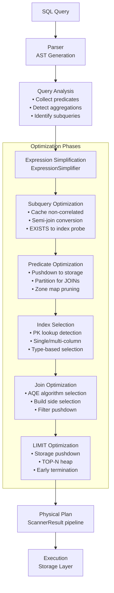
```mermaid
graph TD
    SQL["SQL Query"]
    Parse["Parser<br/>AST Generation"]
    Analyze["Query Analysis<br/>• Collect predicates<br/>• Detect aggregations<br/>• Identify subqueries"]
    
    subgraph "Optimization Phases"
        Simplify["Expression Simplification<br/>ExpressionSimplifier"]
        SubqueryOpt["Subquery Optimization<br/>• Cache non-correlated<br/>• Semi-join conversion<br/>• EXISTS to index probe"]
        PredicateOpt["Predicate Optimization<br/>• Pushdown to storage<br/>• Partition for JOINs<br/>• Zone map pruning"]
        IndexOpt["Index Selection<br/>• PK lookup detection<br/>• Single/multi-column<br/>• Type-based selection"]
        JoinOpt["Join Optimization<br/>• AQE algorithm selection<br/>• Build side selection<br/>• Filter pushdown"]
        LimitOpt["LIMIT Optimization<br/>• Storage pushdown<br/>• TOP-N heap<br/>• Early termination"]
    end
    
    Physical["Physical Plan<br/>ScannerResult pipeline"]
    Execute["Execution<br/>Storage Layer"]
    
    SQL --> Parse
    Parse --> Analyze
    Analyze --> Simplify
    Simplify --> SubqueryOpt
    SubqueryOpt --> PredicateOpt
    PredicateOpt --> IndexOpt
    IndexOpt --> JoinOpt
    JoinOpt --> LimitOpt
    LimitOpt --> Physical
    Physical --> Execute
```

**Sources:** [src/executor/query.rs:155-719](), [src/optimizer/mod.rs]()

---

## Index Selection and Usage

The query executor uses a multi-tiered strategy to select the most efficient access path for table data, prioritizing indexed access over full table scans.

### Primary Key Lookups

The optimizer detects simple equality predicates on primary key columns and performs O(1) direct lookups:


```mermaid
graph LR
    Query["WHERE id = 42"]
    Detect["try_pk_lookup<br/>Extract PK value"]
    Storage["get_visible_version<br/>O(1) HashMap lookup"]
    Result["Single Row"]
    
    Query --> Detect
    Detect -->|"pk_id = 42"| Storage
    Storage --> Result
```

This optimization bypasses full table scans entirely and is used in both SELECT and UPDATE operations.

**Implementation Details:**
- Detection: [src/storage/mvcc/table.rs:168-192]()
- Execution (SELECT): [src/executor/query.rs:1052-1064]()
- Execution (UPDATE): [src/storage/mvcc/table.rs:1256-1286]()

**Sources:** [src/storage/mvcc/table.rs:168-192](), [src/executor/query.rs:1052-1064]()

### Single-Column Index Usage

When primary key lookup is not available, the optimizer searches for applicable single-column indexes:

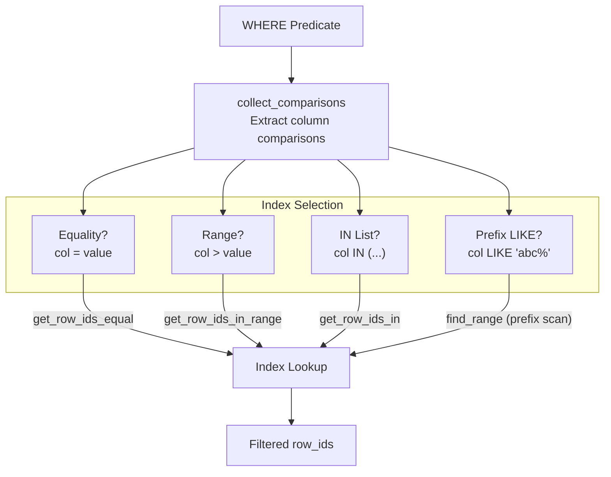
```mermaid
graph TD
    Predicate["WHERE Predicate"]
    Extract["collect_comparisons<br/>Extract column comparisons"]
    
    subgraph "Index Selection"
        CheckEq["Equality?<br/>col = value"]
        CheckRange["Range?<br/>col > value"]
        CheckIn["IN List?<br/>col IN (...)"]
        CheckLike["Prefix LIKE?<br/>col LIKE 'abc%'"]
    end
    
    IndexLookup["Index Lookup"]
    Results["Filtered row_ids"]
    
    Predicate --> Extract
    Extract --> CheckEq
    Extract --> CheckRange
    Extract --> CheckIn
    Extract --> CheckLike
    
    CheckEq -->|"get_row_ids_equal"| IndexLookup
    CheckRange -->|"get_row_ids_in_range"| IndexLookup
    CheckIn -->|"get_row_ids_in"| IndexLookup
    CheckLike -->|"find_range (prefix scan)"| IndexLookup
    
    IndexLookup --> Results
```

**Optimization:** Boolean equality predicates (`col = TRUE`) are skipped because low cardinality (~50% selectivity) makes full scans faster than index lookup + row fetch.

**Sources:** [src/storage/mvcc/table.rs:198-585]()

### Multi-Column Index Support

For queries with predicates on multiple columns, the optimizer attempts to use multi-column indexes following the **leftmost prefix rule**:

**Leftmost Prefix Rule:** An index on `(a, b, c)` can be used for predicates covering:
- `(a)` - first column only
- `(a, b)` - first two columns
- `(a, b, c)` - all three columns

But **cannot** be used for `(b)`, `(c)`, or `(b, c)` alone.

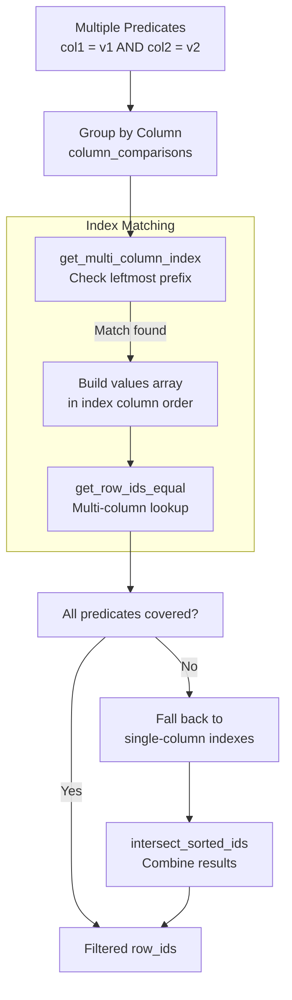
```mermaid
graph TD
    Predicates["Multiple Predicates<br/>col1 = v1 AND col2 = v2"]
    Group["Group by Column<br/>column_comparisons"]
    
    subgraph "Index Matching"
        FindMulti["get_multi_column_index<br/>Check leftmost prefix"]
        BuildValues["Build values array<br/>in index column order"]
        Lookup["get_row_ids_equal<br/>Multi-column lookup"]
    end
    
    CheckCoverage["All predicates covered?"]
    SingleIdx["Fall back to<br/>single-column indexes"]
    Intersect["intersect_sorted_ids<br/>Combine results"]
    
    Predicates --> Group
    Group --> FindMulti
    FindMulti -->|"Match found"| BuildValues
    BuildValues --> Lookup
    Lookup --> CheckCoverage
    
    CheckCoverage -->|"Yes"| Results["Filtered row_ids"]
    CheckCoverage -->|"No"| SingleIdx
    SingleIdx --> Intersect
    Intersect --> Results
```

**Sources:** [src/storage/mvcc/table.rs:337-441](), [src/storage/mvcc/version_store.rs:1445-1492]()

### Type-Based Index Selection

When creating indexes without explicit type specification, Oxibase automatically selects the optimal index type based on column data types:

| Data Type | Index Type | Rationale |
|-----------|-----------|-----------|
| `TEXT`, `JSON` | **Hash** | O(1) equality lookups, avoids O(strlen) comparisons in B-tree nodes |
| `BOOLEAN` | **Bitmap** | Only 2 distinct values, fast bitwise AND/OR/NOT operations |
| `INTEGER`, `FLOAT`, `TIMESTAMP` | **BTree** | Supports range queries, ordered iteration |

```rust
// Automatic index type selection
fn auto_select_index_type(data_types: &[DataType]) -> IndexType {
    match data_types[0] {
        DataType::Text | DataType::Json => IndexType::Hash,
        DataType::Boolean => IndexType::Bitmap,
        DataType::Integer | DataType::Float | DataType::Timestamp => IndexType::BTree,
        _ => IndexType::BTree, // Safe default
    }
}
```

**Sources:** [src/storage/mvcc/table.rs:95-130]()

---

## Predicate Pushdown

Predicate pushdown moves filter operations as close to the data source as possible, reducing the amount of data that needs to be transferred and processed at higher layers.

### Filter Pushdown to Storage

The executor compiles WHERE predicates into `RowFilter` objects and pushes them down to the storage layer:

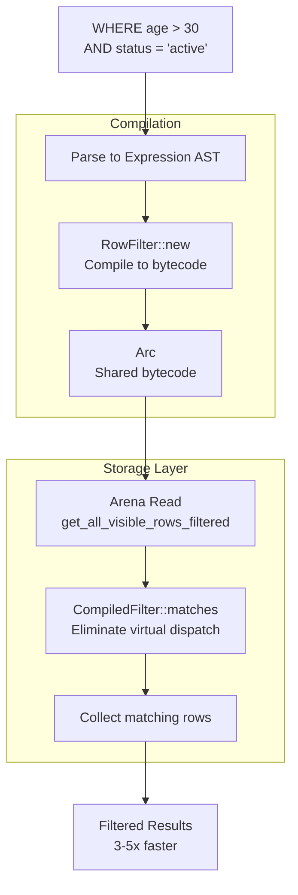
```mermaid
graph TD
    WHERE["WHERE age > 30<br/>AND status = 'active'"]
    
    subgraph "Compilation"
        Parse["Parse to Expression AST"]
        Compile["RowFilter::new<br/>Compile to bytecode"]
        Program["Arc<Program><br/>Shared bytecode"]
    end
    
    subgraph "Storage Layer"
        Arena["Arena Read<br/>get_all_visible_rows_filtered"]
        Filter["CompiledFilter::matches<br/>Eliminate virtual dispatch"]
        Collect["Collect matching rows"]
    end
    
    WHERE --> Parse
    Parse --> Compile
    Compile --> Program
    Program --> Arena
    Arena --> Filter
    Filter --> Collect
    Collect --> Results["Filtered Results<br/>3-5x faster"]
```

**Key Optimization:** The storage layer uses `CompiledFilter` which eliminates virtual dispatch overhead through enum-based specialization, providing 3-5x speedup for filter-heavy queries.

**Sources:** [src/storage/mvcc/version_store.rs:994-1065](), [src/executor/expression.rs]()

### JOIN Filter Partitioning

For JOIN queries with WHERE clauses, the optimizer partitions predicates into three categories:

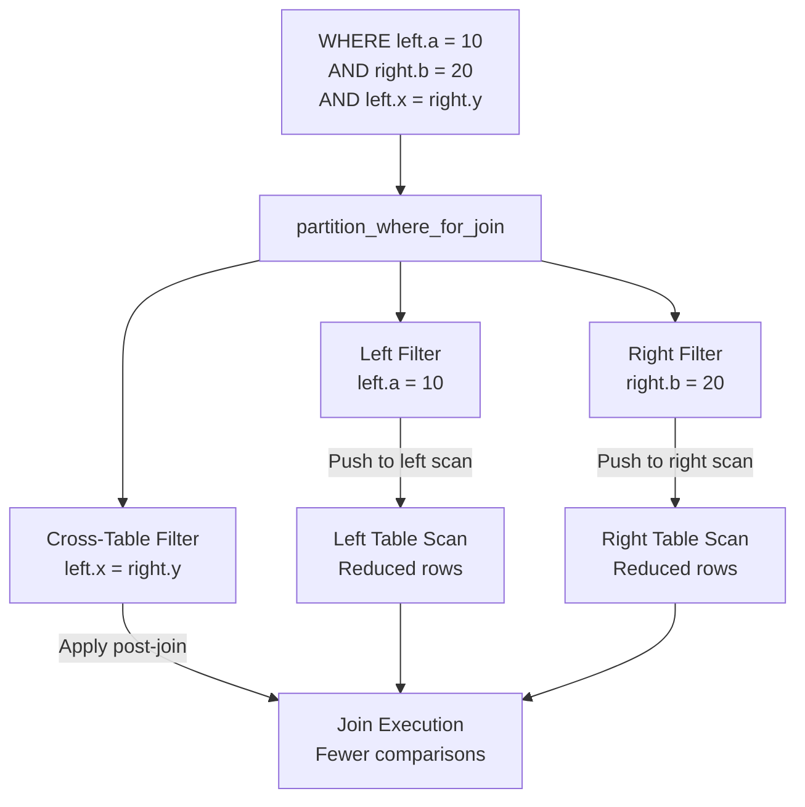
```mermaid
graph TD
    WHERE["WHERE left.a = 10<br/>AND right.b = 20<br/>AND left.x = right.y"]
    
    Partition["partition_where_for_join"]
    
    Left["Left Filter<br/>left.a = 10"]
    Right["Right Filter<br/>right.b = 20"]
    Cross["Cross-Table Filter<br/>left.x = right.y"]
    
    WHERE --> Partition
    Partition --> Left
    Partition --> Right
    Partition --> Cross
    
    Left -->|"Push to left scan"| LeftScan["Left Table Scan<br/>Reduced rows"]
    Right -->|"Push to right scan"| RightScan["Right Table Scan<br/>Reduced rows"]
    Cross -->|"Apply post-join"| JoinExec["Join Execution<br/>Fewer comparisons"]
    
    LeftScan --> JoinExec
    RightScan --> JoinExec
```

This reduces the number of rows that need to be joined, improving performance significantly.

**Sources:** [src/executor/query.rs:110-151]()

### Zone Map Pruning

Zone maps store min/max statistics per segment (group of rows), allowing the optimizer to skip entire segments when predicates fall outside the range:

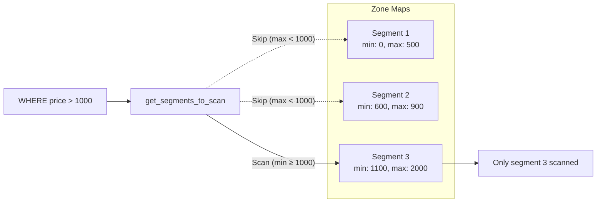
```mermaid
graph LR
    Query["WHERE price > 1000"]
    
    subgraph "Zone Maps"
        Seg1["Segment 1<br/>min: 0, max: 500"]
        Seg2["Segment 2<br/>min: 600, max: 900"]
        Seg3["Segment 3<br/>min: 1100, max: 2000"]
    end
    
    Check["get_segments_to_scan"]
    
    Query --> Check
    Check -.->|"Skip (max < 1000)"| Seg1
    Check -.->|"Skip (max < 1000)"| Seg2
    Check -->|"Scan (min ≥ 1000)"| Seg3
    
    Seg3 --> Results["Only segment 3 scanned"]
```

Zone maps are built by the `ANALYZE` command and marked stale after data modifications.

**Sources:** [src/storage/mvcc/version_store.rs:1500-1556](), [src/storage/mvcc/zonemap.rs]()

---

## LIMIT and TOP-N Optimization

### LIMIT Pushdown

For queries with LIMIT but no ORDER BY, the optimizer enables true early termination by pushing LIMIT directly to the storage layer:

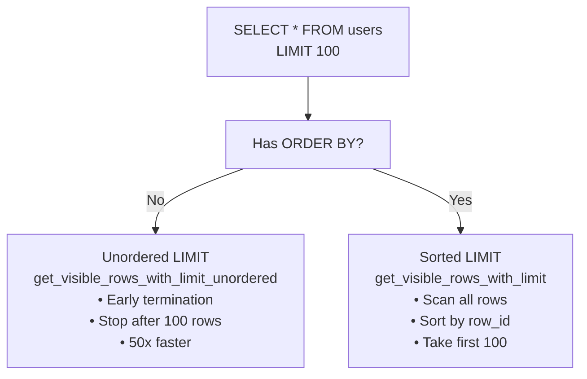
```mermaid
graph TD
    Query["SELECT * FROM users<br/>LIMIT 100"]
    
    Check["Has ORDER BY?"]
    
    Ordered["Sorted LIMIT<br/>get_visible_rows_with_limit<br/>• Scan all rows<br/>• Sort by row_id<br/>• Take first 100"]
    
    Unordered["Unordered LIMIT<br/>get_visible_rows_with_limit_unordered<br/>• Early termination<br/>• Stop after 100 rows<br/>• 50x faster"]
    
    Query --> Check
    Check -->|"No"| Unordered
    Check -->|"Yes"| Ordered
```

**Note:** Without ORDER BY, SQL does not guarantee result order, so returning rows in arbitrary iteration order is semantically correct.

**Sources:** [src/storage/mvcc/version_store.rs:914-983](), [src/executor/query.rs:714-717]()

### TOP-N Heap Optimization

For `ORDER BY ... LIMIT N` queries, the optimizer uses a bounded heap instead of full sorting:

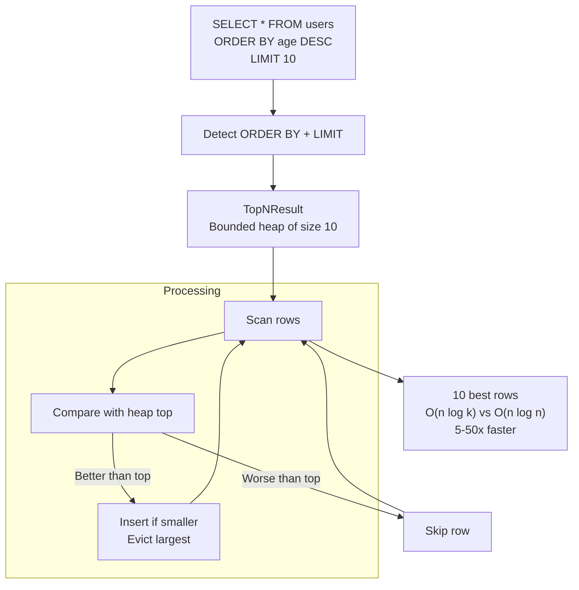
```mermaid
graph TD
    Query["SELECT * FROM users<br/>ORDER BY age DESC<br/>LIMIT 10"]
    
    Detect["Detect ORDER BY + LIMIT"]
    
    TopN["TopNResult<br/>Bounded heap of size 10"]
    
    subgraph "Processing"
        Scan["Scan rows"]
        Compare["Compare with heap top"]
        Insert["Insert if smaller<br/>Evict largest"]
    end
    
    Query --> Detect
    Detect --> TopN
    TopN --> Scan
    Scan --> Compare
    Compare -->|"Better than top"| Insert
    Insert --> Scan
    
    Compare -->|"Worse than top"| Skip["Skip row"]
    Skip --> Scan
    
    Scan --> Results["10 best rows<br/>O(n log k) vs O(n log n)<br/>5-50x faster"]
```

This reduces complexity from O(n log n) for full sort to O(n log k) where k = LIMIT value.

**Sources:** [src/executor/query.rs:659-674](), [src/executor/result.rs TopNResult]()

---

## Subquery Optimization

### Non-Correlated Subquery Caching

Non-correlated subqueries (those without references to outer query columns) are executed once and cached:

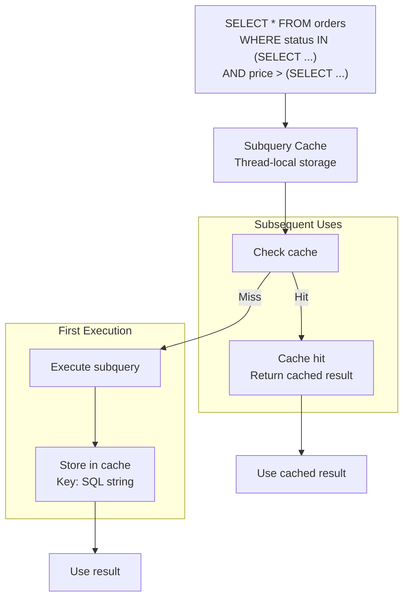
```mermaid
graph TD
    Query["SELECT * FROM orders<br/>WHERE status IN (SELECT ...)<br/>AND price > (SELECT ...)"]
    
    Cache["Subquery Cache<br/>Thread-local storage"]
    
    subgraph "First Execution"
        Exec1["Execute subquery"]
        Store["Store in cache<br/>Key: SQL string"]
    end
    
    subgraph "Subsequent Uses"
        Check["Check cache"]
        Hit["Cache hit<br/>Return cached result"]
    end
    
    Query --> Cache
    Cache --> Check
    Check -->|"Miss"| Exec1
    Exec1 --> Store
    Store --> Results1["Use result"]
    
    Check -->|"Hit"| Hit
    Hit --> Results2["Use cached result"]
```

Cache keys are the SQL string representation of the subquery, ensuring identical subqueries reuse results.

**Sources:** [src/executor/subquery.rs:899-962](), [src/executor/context.rs cache functions]()

### EXISTS Optimization with Index-Nested-Loop

The optimizer transforms simple EXISTS subqueries into direct index probes, avoiding full subquery execution:

**Before Optimization:**
```sql
SELECT * FROM users u
WHERE EXISTS (
    SELECT 1 FROM orders o
    WHERE o.user_id = u.id
    AND o.amount > 500
)
```

**After Optimization:**
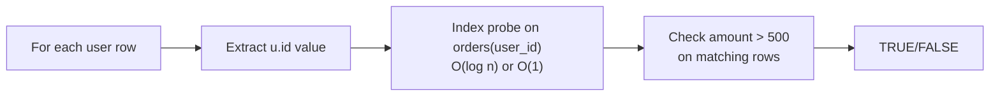
```mermaid
graph LR
    OuterRow["For each user row"]
    ExtractValue["Extract u.id value"]
    IndexProbe["Index probe on orders(user_id)<br/>O(log n) or O(1)"]
    CheckPredicate["Check amount > 500<br/>on matching rows"]
    Result["TRUE/FALSE"]
    
    OuterRow --> ExtractValue
    ExtractValue --> IndexProbe
    IndexProbe --> CheckPredicate
    CheckPredicate --> Result
```

This optimization applies when:
1. Subquery has simple table source (no JOINs)
2. WHERE clause contains `inner.col = outer.col` correlation
3. Inner table has an index on the correlation column

**Multi-Level Caching Strategy:**
- **Index cache:** Reuse index reference across probes (~2-5μs saved per probe)
- **Schema cache:** Avoid repeated `get_table_schema()` calls
- **Predicate cache:** Compile filter once, reuse for all matching rows
- **Fetcher cache:** Reuse row fetcher across EXISTS evaluations

**Sources:** [src/executor/subquery.rs:342-545](), [src/executor/context.rs:400-550]()

### IN Subquery Optimization

IN subqueries are converted to hash sets for O(1) membership testing:

**Before:**
```sql
SELECT * FROM users
WHERE status IN (SELECT status FROM active_statuses)
```

**After Optimization:**
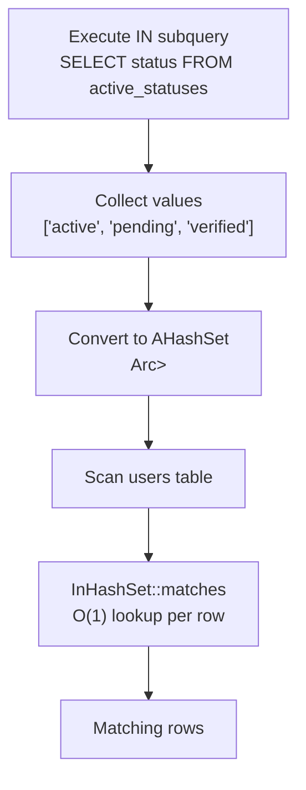
```mermaid
graph TD
    Subquery["Execute IN subquery<br/>SELECT status FROM active_statuses"]
    Collect["Collect values<br/>['active', 'pending', 'verified']"]
    Convert["Convert to AHashSet<br/>Arc<HashSet<Value>>"]
    
    OuterScan["Scan users table"]
    Check["InHashSet::matches<br/>O(1) lookup per row"]
    
    Subquery --> Collect
    Collect --> Convert
    Convert --> OuterScan
    OuterScan --> Check
    Check --> Results["Matching rows"]
```

For multi-column IN (e.g., `(a, b) IN (SELECT x, y FROM t)`), the optimizer converts to `ExpressionList` for tuple matching.

**Sources:** [src/executor/subquery.rs:154-217](), [src/parser/ast.rs InHashSetExpression]()

### Semi-Join Transformation

EXISTS subqueries with simple correlation patterns are transformed into semi-joins:

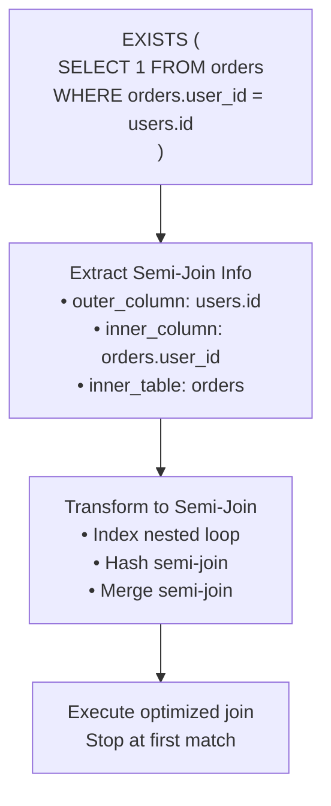
```mermaid
graph TD
    Original["EXISTS (<br/>SELECT 1 FROM orders<br/>WHERE orders.user_id = users.id<br/>)"]
    
    Analyze["Extract Semi-Join Info<br/>• outer_column: users.id<br/>• inner_column: orders.user_id<br/>• inner_table: orders"]
    
    Transform["Transform to Semi-Join<br/>• Index nested loop<br/>• Hash semi-join<br/>• Merge semi-join"]
    
    Execute["Execute optimized join<br/>Stop at first match"]
    
    Original --> Analyze
    Analyze --> Transform
    Transform --> Execute
```

The semi-join avoids executing the full subquery and stops as soon as a match is found.

**Sources:** [src/executor/subquery.rs:42-68 SemiJoinInfo]()

---

## Join Optimization

### Adaptive Query Execution (AQE)

Oxibase uses Adaptive Query Execution to select join algorithms dynamically based on runtime statistics:

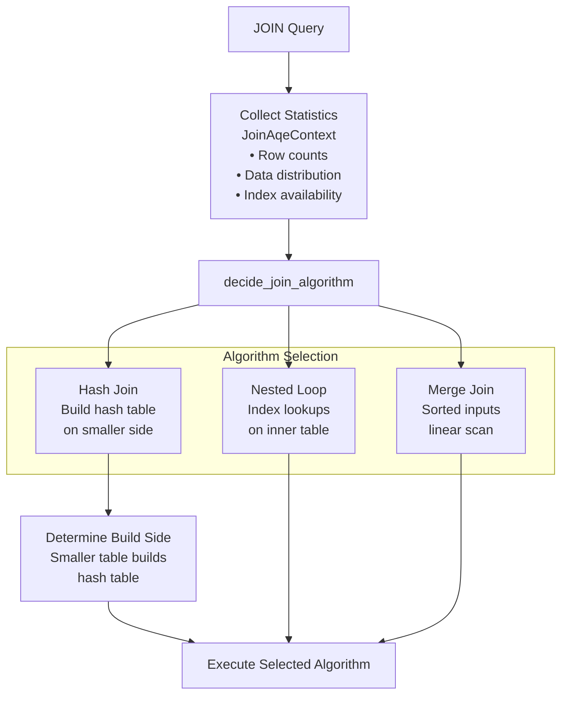
```mermaid
graph TD
    JoinQuery["JOIN Query"]
    
    Collect["Collect Statistics<br/>JoinAqeContext<br/>• Row counts<br/>• Data distribution<br/>• Index availability"]
    
    Decide["decide_join_algorithm"]
    
    subgraph "Algorithm Selection"
        Hash["Hash Join<br/>Build hash table<br/>on smaller side"]
        Nested["Nested Loop<br/>Index lookups<br/>on inner table"]
        Merge["Merge Join<br/>Sorted inputs<br/>linear scan"]
    end
    
    BuildSide["Determine Build Side<br/>Smaller table builds<br/>hash table"]
    
    Execute["Execute Selected Algorithm"]
    
    JoinQuery --> Collect
    Collect --> Decide
    
    Decide --> Hash
    Decide --> Nested
    Decide --> Merge
    
    Hash --> BuildSide
    BuildSide --> Execute
    Nested --> Execute
    Merge --> Execute
```

**Selection Heuristics:**
- **Hash Join:** Default for equality joins with no indexes
- **Index Nested Loop:** When inner table has index on join column
- **Merge Join:** When both inputs are already sorted on join keys

**Sources:** [src/optimizer/aqe.rs decide_join_algorithm](), [src/executor/join.rs]()

### JOIN Filter Pushdown

As shown earlier, the optimizer partitions WHERE predicates and pushes applicable filters to both sides of the JOIN before execution, reducing the number of rows that participate in the join.

**Sources:** [src/executor/query.rs:110-151]()

---

## Expression Optimization

### Compiled Filters

The storage layer compiles filter expressions into optimized bytecode that eliminates virtual dispatch overhead:

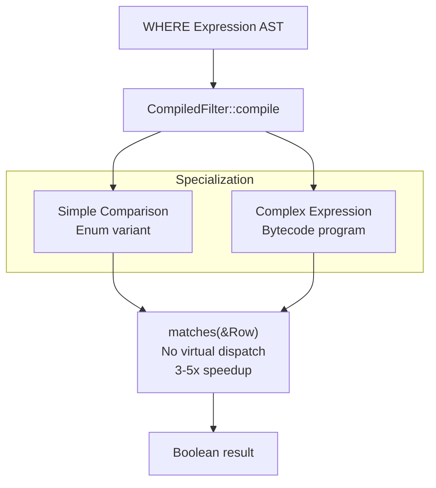
```mermaid
graph TD
    Expression["WHERE Expression AST"]
    
    Compile["CompiledFilter::compile"]
    
    subgraph "Specialization"
        Simple["Simple Comparison<br/>Enum variant"]
        Complex["Complex Expression<br/>Bytecode program"]
    end
    
    Match["matches(&Row)<br/>No virtual dispatch<br/>3-5x speedup"]
    
    Expression --> Compile
    Compile --> Simple
    Compile --> Complex
    
    Simple --> Match
    Complex --> Match
    Match --> Result["Boolean result"]
```

The `CompiledFilter` enum has specialized variants for common patterns:
- Simple comparisons: Direct field access + comparison
- Complex expressions: Bytecode evaluation

**Sources:** [src/storage/expression.rs CompiledFilter](), [src/storage/mvcc/version_store.rs:1009-1011]()

### Expression Simplification

The optimizer simplifies expressions before compilation to enable further optimizations:

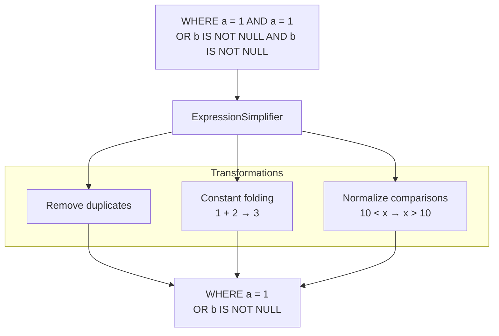
```mermaid
graph TD
    Original["WHERE a = 1 AND a = 1<br/>OR b IS NOT NULL AND b IS NOT NULL"]
    
    Simplify["ExpressionSimplifier"]
    
    subgraph "Transformations"
        Dedup["Remove duplicates"]
        FoldConstants["Constant folding<br/>1 + 2 → 3"]
        Normalize["Normalize comparisons<br/>10 < x → x > 10"]
    end
    
    Simplified["WHERE a = 1<br/>OR b IS NOT NULL"]
    
    Original --> Simplify
    Simplify --> Dedup
    Simplify --> FoldConstants
    Simplify --> Normalize
    
    Dedup --> Simplified
    FoldConstants --> Simplified
    Normalize --> Simplified
```

**Sources:** [src/optimizer/mod.rs ExpressionSimplifier](), [src/executor/query.rs:33]()

---

## Storage Layer Optimization

### Arena-Based Scanning

The storage layer uses contiguous arena memory for row data, enabling zero-copy scanning:

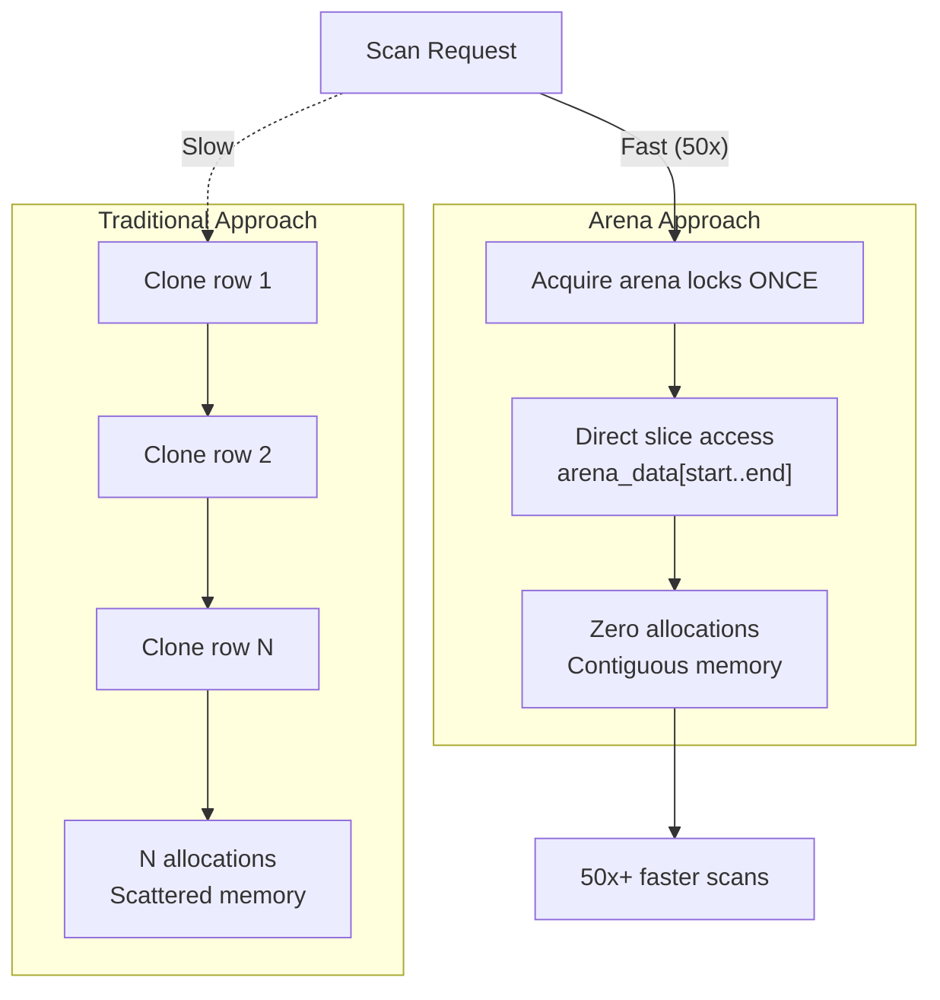
```mermaid
graph TD
    Request["Scan Request"]
    
    subgraph "Traditional Approach"
        Clone1["Clone row 1"]
        Clone2["Clone row 2"]
        CloneN["Clone row N"]
        Alloc["N allocations<br/>Scattered memory"]
    end
    
    subgraph "Arena Approach"
        Lock["Acquire arena locks ONCE"]
        Read["Direct slice access<br/>arena_data[start..end]"]
        ZeroCopy["Zero allocations<br/>Contiguous memory"]
    end
    
    Request -.->|"Slow"| Clone1
    Clone1 --> Clone2
    Clone2 --> CloneN
    CloneN --> Alloc
    
    Request -->|"Fast (50x)"| Lock
    Lock --> Read
    Read --> ZeroCopy
    ZeroCopy --> Results["50x+ faster scans"]
```

**Key Benefits:**
1. **Single lock acquisition** for entire scan vs. O(n) lock acquisitions
2. **No per-row cloning** - return slices directly from arena
3. **Cache-friendly** - contiguous memory access patterns

**Sources:** [src/storage/mvcc/version_store.rs:750-817](), [src/storage/mvcc/arena.rs]()

### Radix Sort for ORDER BY

For `ORDER BY` on integer columns, the optimizer uses radix sort (O(n)) instead of comparison sort (O(n log n)):

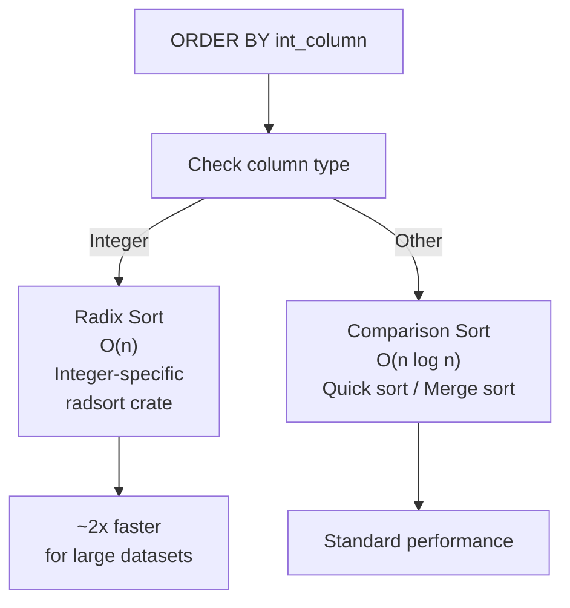
```mermaid
graph TD
    OrderBy["ORDER BY int_column"]
    
    Check["Check column type"]
    
    Comparison["Comparison Sort<br/>O(n log n)<br/>Quick sort / Merge sort"]
    
    Radix["Radix Sort<br/>O(n)<br/>Integer-specific<br/>radsort crate"]
    
    OrderBy --> Check
    Check -->|"Integer"| Radix
    Check -->|"Other"| Comparison
    
    Radix --> Fast["~2x faster<br/>for large datasets"]
    Comparison --> Standard["Standard performance"]
```

The optimizer builds `RadixOrderSpec` only when all ORDER BY columns have valid indices and are integer types.

**Sources:** [src/executor/query.rs:679-703](), [src/executor/result.rs:RadixOrderSpec]()

---

## Complete Optimization Flow

Here's how all optimizations work together for a complex query:

```sql
SELECT u.name, COUNT(o.id) as order_count
FROM users u
JOIN orders o ON u.id = o.user_id
WHERE u.status = 'active'
  AND o.created_at > '2024-01-01'
  AND EXISTS (
      SELECT 1 FROM payments p
      WHERE p.order_id = o.id
      AND p.amount > 100
  )
GROUP BY u.name
ORDER BY order_count DESC
LIMIT 10
```

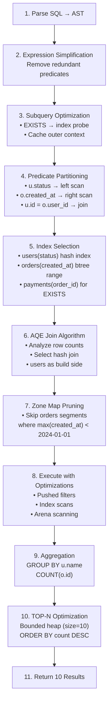
```mermaid
graph TD
    Parse["1. Parse SQL → AST"]
    
    Simplify["2. Expression Simplification<br/>Remove redundant predicates"]
    
    SubqueryOpt["3. Subquery Optimization<br/>• EXISTS → index probe<br/>• Cache outer context"]
    
    PredicatePart["4. Predicate Partitioning<br/>• u.status → left scan<br/>• o.created_at → right scan<br/>• u.id = o.user_id → join"]
    
    IndexSel["5. Index Selection<br/>• users(status) hash index<br/>• orders(created_at) btree range<br/>• payments(order_id) for EXISTS"]
    
    JoinAQE["6. AQE Join Algorithm<br/>• Analyze row counts<br/>• Select hash join<br/>• users as build side"]
    
    ZoneMap["7. Zone Map Pruning<br/>• Skip orders segments<br/>where max(created_at) < 2024-01-01"]
    
    Execute["8. Execute with Optimizations<br/>• Pushed filters<br/>• Index scans<br/>• Arena scanning"]
    
    Aggregate["9. Aggregation<br/>GROUP BY u.name<br/>COUNT(o.id)"]
    
    TopN["10. TOP-N Optimization<br/>Bounded heap (size=10)<br/>ORDER BY count DESC"]
    
    Result["11. Return 10 Results"]
    
    Parse --> Simplify
    Simplify --> SubqueryOpt
    SubqueryOpt --> PredicatePart
    PredicatePart --> IndexSel
    IndexSel --> JoinAQE
    JoinAQE --> ZoneMap
    ZoneMap --> Execute
    Execute --> Aggregate
    Aggregate --> TopN
    TopN --> Result
```

**Optimization Summary for This Query:**

| Optimization | Impact |
|--------------|--------|
| EXISTS to index probe | Avoid full subquery per row (~100x faster) |
| Predicate pushdown | Reduce join input sizes by ~80% |
| Hash index on status | O(1) equality lookup vs O(log n) |
| Zone map pruning | Skip ~30-50% of orders segments |
| AQE join selection | Optimal algorithm for data distribution |
| TOP-N heap | O(n log 10) vs O(n log n) for ORDER BY |

**Sources:** [src/executor/query.rs:155-719](), [src/executor/aggregation.rs](), [src/executor/subquery.rs]()

---

## Key Takeaways

1. **Multi-Layered Optimization:** Oxibase optimizes at parse time, planning time, and execution time through Adaptive Query Execution.

2. **Index-First Strategy:** The optimizer aggressively uses indexes, with type-based selection and multi-column index support.

3. **Pushdown Everything:** Filters, LIMIT, and even subquery evaluations are pushed as close to the storage layer as possible.

4. **Zero-Copy Where Possible:** Arena-based scanning and compiled filters eliminate unnecessary allocations and virtual dispatch.

5. **Adaptive Algorithms:** Join algorithms, sort strategies, and scan methods adapt based on runtime characteristics and data distribution.

The combination of these techniques allows Oxibase to execute complex analytical queries efficiently, often achieving 10-100x speedups over naive execution strategies.