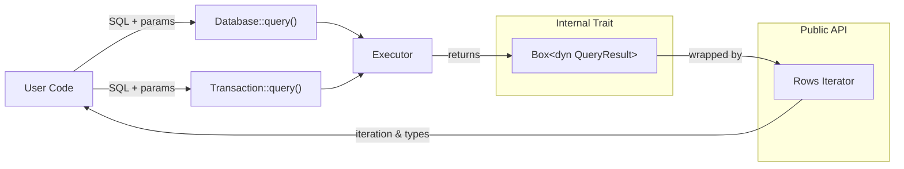
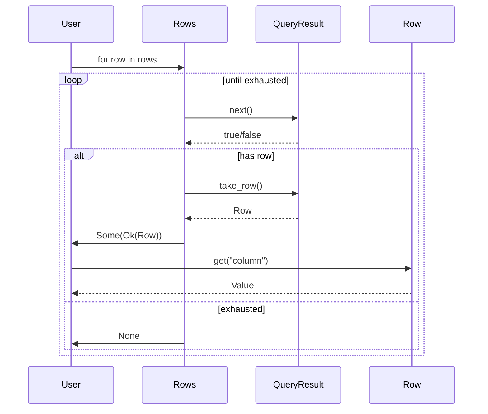
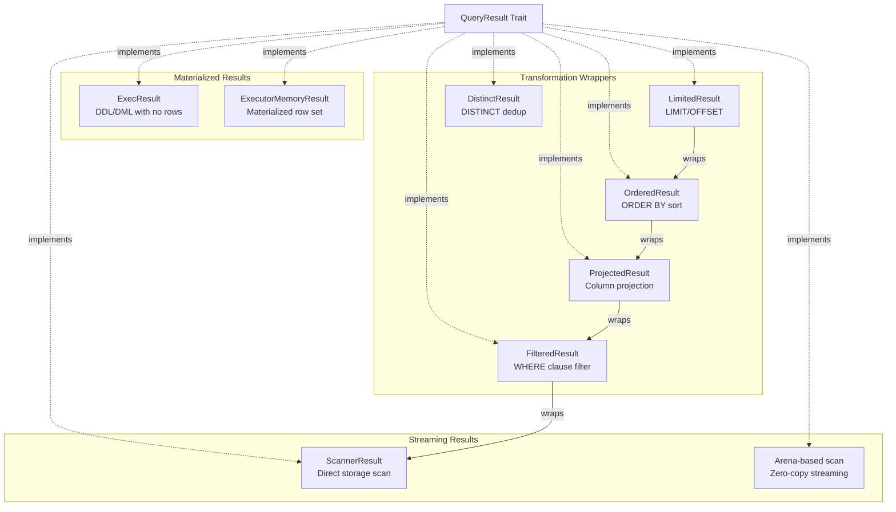

# Page: Query Results

# Query Results

<details>
<summary>Relevant source files</summary>

The following files were used as context for generating this wiki page:

- [src/api/database.rs](src/api/database.rs)
- [src/api/transaction.rs](src/api/transaction.rs)
- [src/executor/ddl.rs](src/executor/ddl.rs)
- [src/executor/expression/evaluator_bridge.rs](src/executor/expression/evaluator_bridge.rs)
- [src/executor/expression/mod.rs](src/executor/expression/mod.rs)
- [src/executor/query.rs](src/executor/query.rs)

</details>


This page documents how to work with query results returned from SQL queries. It covers the `Rows` iterator, type conversion, and the internal `QueryResult` architecture.

For information about executing queries, see [Database API](#2.1) and [Transactions](#2.2). For result streaming and iteration patterns used in query execution, see [Query Execution Pipeline](#3.1).

---

## Architecture Overview

Query results flow through several layers from execution to user consumption:

**Query Result Data Flow**



Sources: [src/api/database.rs:444-458](), [src/api/transaction.rs:123-129](), [src/executor/query.rs:154-159]()

The `QueryResult` trait provides a unified interface for all result types, whether they stream from disk, are materialized in memory, or are computed on-the-fly.

**QueryResult Trait Methods**

| Method | Return Type | Purpose |
|--------|-------------|---------|
| `next()` | `bool` | Advance to next row, returns `false` when exhausted |
| `take_row()` | `Row` | Take ownership of current row (call after `next()`) |
| `columns()` | `&[String]` | Get column names for the result set |
| `rows_affected()` | `i64` | Number of rows affected (for DML statements) |
| `err()` | `Option<&Error>` | Get error if iteration failed |

Sources: [src/storage/traits.rs]() (trait definition implied from usage)

---

## The Rows Iterator

The `Rows` type wraps `Box<dyn QueryResult>` and provides an ergonomic Rust iterator interface with type conversion.

### Basic Iteration

```rust
// Iterate over all rows
for row in db.query("SELECT id, name, age FROM users", ())? {
    let row = row?;  // Handle potential errors
    let id: i64 = row.get("id")?;
    let name: String = row.get("name")?;
    let age: i64 = row.get("age")?;
    println!("{}: {} ({})", id, name, age);
}
```

**Rows Iterator Pattern**



Sources: [src/api/database.rs:444-458](), [src/executor/query.rs:154-159]()

### Column Access

Rows support both indexed and named column access:

```rust
let row = rows.next().unwrap()?;

// Access by index (0-based)
let id: i64 = row.get(0)?;

// Access by name (case-insensitive)
let name: String = row.get("name")?;
let name: String = row.get("NAME")?;  // Same column
```

Sources: [src/api/database.rs:426-443]()

---

## Type Conversion

The `FromValue` trait enables automatic conversion from SQL `Value` types to Rust types.

### Supported Conversions

| Rust Type | SQL Types | Notes |
|-----------|-----------|-------|
| `i64` | INTEGER, FLOAT | Float truncated to integer |
| `i32` | INTEGER, FLOAT | Narrowing conversion |
| `f64` | FLOAT, INTEGER | Integer promoted to float |
| `String` | TEXT, JSON, (all types) | All types convert to string representation |
| `bool` | BOOLEAN, INTEGER | Non-zero integers are `true` |
| `Value` | (any) | Returns value as-is |
| `Option<T>` | NULL, (any) | NULL becomes `None`, else `Some(T)` |

Sources: [src/api/database.rs:888-979]()

### FromValue Trait

```rust
pub trait FromValue: Sized {
    fn from_value(value: &Value) -> Result<Self>;
}
```

**Example: Integer Conversion**

```rust
impl FromValue for i64 {
    fn from_value(value: &Value) -> Result<Self> {
        match value {
            Value::Integer(i) => Ok(*i),
            Value::Float(f) => Ok(*f as i64),
            _ => Err(Error::TypeConversion {
                from: format!("{:?}", value),
                to: "Integer".to_string(),
            }),
        }
    }
}
```

Sources: [src/api/database.rs:894-905]()

### Optional Values

Use `Option<T>` to handle NULL values gracefully:

```rust
for row in db.query("SELECT name, email FROM users", ())? {
    let row = row?;
    let name: String = row.get("name")?;
    let email: Option<String> = row.get("email")?;  // NULL-safe
    
    match email {
        Some(e) => println!("{}: {}", name, e),
        None => println!("{}: (no email)", name),
    }
}
```

Sources: [src/api/database.rs:971-979]()

---

## Query Result Implementations

Oxibase uses multiple `QueryResult` implementations optimized for different scenarios.

### Result Type Hierarchy



Sources: [src/executor/result.rs]() (implementations), [src/executor/query.rs:52-56]()

### ExecResult - DDL/DML Results

Used for statements that don't return rows (CREATE, INSERT, UPDATE, DELETE):

```rust
// Returns ExecResult with rows_affected count
db.execute("DELETE FROM users WHERE age < 18", ())?;

// Internal creation
Box::new(ExecResult::with_rows_affected(deleted_count as i64))
```

Sources: [src/executor/ddl.rs:244](), [src/api/transaction.rs:223]()

### ExecutorMemoryResult - Materialized Results

Holds a complete result set in memory:

```rust
// Materialized for ORDER BY, DISTINCT, or complex queries
let result = ExecutorMemoryResult::new(columns, rows);

// Used after sorting, aggregation, or set operations
```

**When Materialization Occurs:**
- ORDER BY requires sorting (unless storage-level optimization applies)
- DISTINCT requires deduplication
- Set operations (UNION, INTERSECT, EXCEPT)
- Correlated subqueries in ORDER BY expressions

Sources: [src/executor/query.rs:642-645](), [src/api/transaction.rs:357]()

### ScannerResult - Streaming Results

Streams rows directly from storage without materialization:

```rust
// Simple SELECT streams from storage
let result = ScannerResult::new(scanner, columns);

// Rows are fetched on-demand as iterator advances
```

**Advantages:**
- Constant memory usage regardless of result size
- Lower latency to first row
- Efficient for large result sets

Sources: [src/executor/query.rs]() (result type definitions)

### Transformation Wrappers

Multiple wrapper types compose to build query execution pipelines:

```rust
// Pipeline: Scan → Filter → Project → Order → Limit
let mut result: Box<dyn QueryResult> = Box::new(ScannerResult::new(scanner, columns));
result = Box::new(FilteredResult::new(result, where_filter));
result = Box::new(ProjectedResult::new(result, column_count));
result = Box::new(OrderedResult::new(result, comparator));
result = Box::new(LimitedResult::new(result, limit, offset));
```

Sources: [src/executor/query.rs:268-719]()

---

## Convenience Methods

### query_one - Single Value

For queries returning a single value:

```rust
// Count aggregation
let count: i64 = db.query_one("SELECT COUNT(*) FROM users", ())?;

// Scalar subquery
let max_age: i64 = db.query_one("SELECT MAX(age) FROM users", ())?;

// Returns Error::NoRowsReturned if no rows
let name: String = db.query_one(
    "SELECT name FROM users WHERE id = $1",
    (999,)
)?;  // Error if user 999 doesn't exist
```

Sources: [src/api/database.rs:471-477]()

### query_opt - Optional Single Value

Like `query_one` but returns `None` instead of error when no rows:

```rust
// Returns Option<T> instead of T
let name: Option<String> = db.query_opt(
    "SELECT name FROM users WHERE id = $1",
    (999,)
)?;

match name {
    Some(n) => println!("Found: {}", n),
    None => println!("Not found"),
}
```

Sources: [src/api/database.rs:489-494]()

### Collecting Results

Use standard Rust iterator methods:

```rust
// Collect into Vec
let ids: Vec<i64> = db.query("SELECT id FROM users", ())?
    .map(|r| r.and_then(|row| row.get(0)))
    .collect::<Result<Vec<_>, _>>()?;

// Count without materializing
let count = db.query("SELECT * FROM users", ())?
    .filter(|r| r.is_ok())
    .count();

// First N results
let first_ten: Vec<_> = db.query("SELECT * FROM users", ())?
    .take(10)
    .collect::<Result<Vec<_>, _>>()?;
```

Sources: [src/api/database.rs:440-443]()

---

## Struct Mapping with FromRow

The `FromRow` trait enables automatic mapping from rows to structs:

```rust
use oxibase::{FromRow, ResultRow, Result};

struct User {
    id: i64,
    name: String,
    email: Option<String>,
}

impl FromRow for User {
    fn from_row(row: &ResultRow) -> Result<Self> {
        Ok(User {
            id: row.get(0)?,
            name: row.get(1)?,
            email: row.get(2)?,
        })
    }
}

// Use query_as to map results
let users: Vec<User> = db.query_as(
    "SELECT id, name, email FROM users WHERE active = true",
    ()
)?;

for user in users {
    println!("{}: {}", user.id, user.name);
}
```

Sources: [src/api/database.rs:707-710](), [src/api/rows.rs]() (FromRow trait definition)

### Named Parameter Queries

Struct mapping works with named parameters:

```rust
let users: Vec<User> = db.query_as_named(
    "SELECT id, name, email FROM users WHERE age > :min_age",
    named_params!{ min_age: 18 }
)?;
```

Sources: [src/api/database.rs:740-743]()

---

## Result Streaming Patterns

### Memory-Efficient Processing

For large result sets, process rows without materializing:

```rust
// Process 1M rows with constant memory
let mut total = 0i64;
for row in db.query("SELECT amount FROM transactions", ())? {
    let row = row?;
    let amount: i64 = row.get(0)?;
    total += amount;
}
```

### Early Termination

Iterator short-circuits on error or condition:

```rust
// Stop at first error
let result = db.query("SELECT * FROM large_table", ())?
    .take_while(|r| r.is_ok())
    .count();

// Find first match
let first_match = db.query("SELECT * FROM users", ())?
    .find(|r| {
        r.as_ref()
            .ok()
            .and_then(|row| row.get::<String>("name").ok())
            .map(|name| name.starts_with("A"))
            .unwrap_or(false)
    });
```

### Batched Processing

Process results in chunks:

```rust
let mut rows = db.query("SELECT * FROM large_table", ())?;
let mut batch = Vec::new();

for row in rows {
    batch.push(row?);
    
    if batch.len() >= 1000 {
        process_batch(&batch)?;
        batch.clear();
    }
}

// Process remaining
if !batch.is_empty() {
    process_batch(&batch)?;
}
```

Sources: [src/executor/query.rs:154-719]() (streaming architecture)

---

## Internal Result Pipeline

Understanding the internal pipeline helps optimize queries.

### Pipeline Construction

```mermaid
graph LR
    SELECT["SELECT Statement"]
    
    Scan["Table Scan<br/>(ScannerResult)"]
    Where["WHERE Filter<br/>(FilteredResult)"]
    Proj["Projection<br/>(ProjectedResult)"]
    Order["ORDER BY<br/>(OrderedResult)"]
    Distinct["DISTINCT<br/>(DistinctResult)"]
    Limit["LIMIT/OFFSET<br/>(LimitedResult)"]
    
    Rows["Rows Iterator"]
    
    SELECT --> Scan
    Scan --> Where
    Where --> Proj
    Proj --> Distinct
    Distinct --> Order
    Order --> Limit
    Limit --> Rows
    
    style Scan fill:#f9f9f9
    style Where fill:#f9f9f9
    style Proj fill:#f9f9f9
    style Order fill:#f9f9f9
    style Distinct fill:#f9f9f9
    style Limit fill:#f9f9f9
```



Sources: [src/executor/query.rs:268-719]()

### Optimization: TopNResult

For `ORDER BY ... LIMIT`, the executor uses a bounded heap instead of full sort:

```rust
// Instead of: sort(n) + limit(k) = O(n log n)
// Use: TopNResult with k-element heap = O(n log k)
if let Some(limit) = limit {
    result = Box::new(TopNResult::new(
        result,
        comparator,
        limit,
        offset,
    ));
}
```

**Performance Impact:**
- 5-50x faster for `LIMIT` on large datasets
- Memory usage: O(k) instead of O(n)
- Particularly effective when k << n

Sources: [src/executor/query.rs:659-674]()

### Optimization: Radix Sort

For integer ORDER BY columns, radix sort provides O(n) performance:

```rust
// Check if all ORDER BY columns are integers with valid indices
let radix_specs: Vec<RadixOrderSpec> = order_specs
    .iter()
    .filter_map(|(col_idx, ascending, nulls_first)| {
        col_idx.map(|idx| RadixOrderSpec {
            col_idx: idx,
            ascending: *ascending,
            nulls_first: *nulls_first,
        })
    })
    .collect();

if radix_specs.len() == order_specs.len() {
    // All columns eligible - use radix sort
    result = Box::new(OrderedResult::new_radix(
        result,
        &radix_specs,
        fallback_comparator,
    ));
}
```

Sources: [src/executor/query.rs:679-703]()

---

## Error Handling

### Row-Level Errors

Errors can occur during iteration:

```rust
for row_result in db.query("SELECT * FROM users", ())? {
    match row_result {
        Ok(row) => {
            // Process row
            let id: i64 = row.get(0)?;
        }
        Err(e) => {
            eprintln!("Row error: {}", e);
            continue;  // Skip bad row
        }
    }
}
```

### Type Conversion Errors

```rust
let row = rows.next().unwrap()?;

match row.get::<i64>("age") {
    Ok(age) => println!("Age: {}", age),
    Err(Error::TypeConversion { from, to }) => {
        eprintln!("Cannot convert {} to {}", from, to);
    }
    Err(e) => return Err(e),
}
```

### QueryResult Error State

Some result types track errors internally:

```rust
let mut scanner = table.scan(&column_indices, where_expr)?;

while scanner.next() {
    let row = scanner.take_row();
    // Process row
}

// Check for errors after iteration
if let Some(err) = scanner.err() {
    return Err(err.clone());
}
```

Sources: [src/api/transaction.rs:390-398]()

---

## Performance Considerations

### Streaming vs Materialization

| Operation | Streaming | Materialized | Memory | Latency |
|-----------|-----------|--------------|--------|---------|
| Simple SELECT | ✓ | - | O(1) | Low |
| WHERE filter | ✓ | - | O(1) | Low |
| ORDER BY | - | ✓ | O(n) | High |
| DISTINCT | - | ✓ | O(n) | High |
| LIMIT (no ORDER BY) | ✓ | - | O(1) | Low |
| LIMIT + ORDER BY | Hybrid* | - | O(k) | Medium |

\* Uses TopNResult bounded heap

### Column Projection

Remove unused columns early to reduce memory:

```rust
// Bad: Fetches all columns
db.query("SELECT * FROM users", ())?

// Good: Fetches only needed columns
db.query("SELECT id, name FROM users", ())?
```

Sources: [src/executor/query.rs:154-719]()

### Index Usage

Predicate pushdown enables index scans for streaming results:

```rust
// Uses index scan if index exists on age column
db.query("SELECT * FROM users WHERE age > 18", ())?

// Full table scan - cannot stream efficiently
db.query("SELECT * FROM users ORDER BY age", ())?
```

Sources: [src/optimizer/pushdown.rs]() (predicate pushdown), [src/executor/query.rs]()