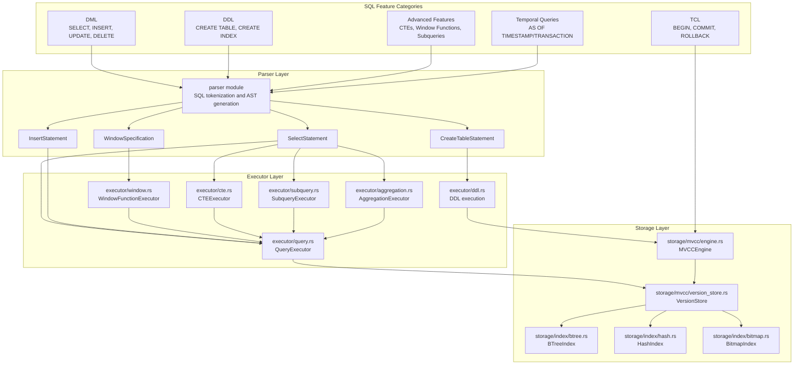
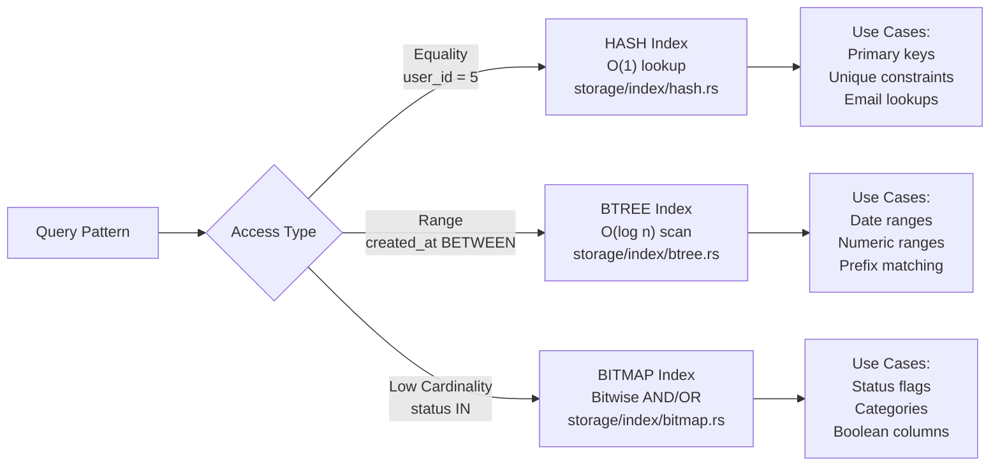
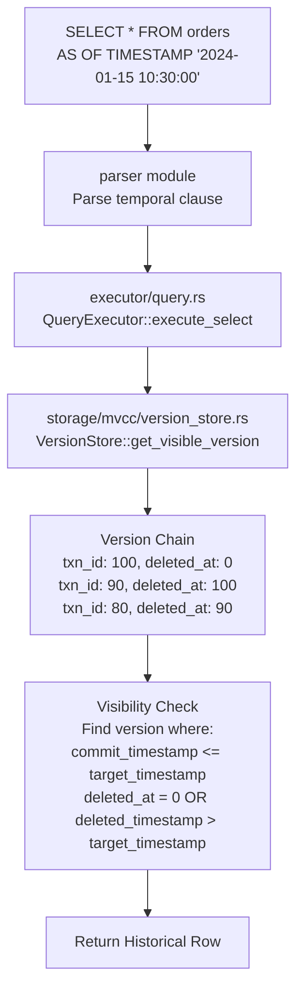
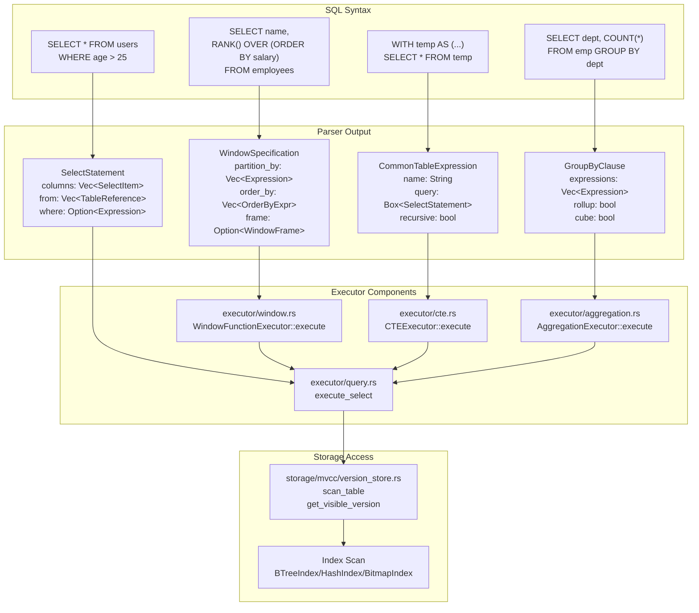

# Page: SQL Feature Reference

# SQL Feature Reference

<details>
<summary>Relevant source files</summary>

The following files were used as context for generating this wiki page:

- [.github/workflows/ci.yml](.github/workflows/ci.yml)
- [.gitignore](.gitignore)
- [Cargo.toml](Cargo.toml)
- [README.md](README.md)
- [../../../../roadmap.md](../../../../roadmap.md)
- [docs/_config.yml](docs/_config.yml)
- [src/lib.rs](src/lib.rs)

</details>


This page provides a comprehensive reference of SQL features supported by Oxibase, including syntax, examples, and behavior. It covers query types, transaction control, index management, and advanced SQL constructs.

For detailed information on specific topics:
- Data type specifications and behavior: see [Data Types](#5.1)
- Function signatures and examples: see [Built-in Functions](#5.2)
- Schema manipulation operations: see [DDL Operations](#5.3)
- Temporal query syntax and semantics: see [Time-Travel Queries](#5.4)

For implementation details of query execution, see [Query Execution System](#3). For storage and transaction internals, see [Storage Engine](#4).

---

## SQL Language Coverage

Oxibase implements a substantial subset of SQL:2016 with extensions for temporal queries and modern analytical features. The implementation is based on a custom SQL parser and executor designed for embedded use.

### Supported SQL Categories

| Category | Status | Notes |
|----------|--------|-------|
| **DML** | Full | SELECT, INSERT, UPDATE, DELETE with complex predicates |
| **DDL** | Partial | CREATE/DROP TABLE, CREATE/DROP INDEX, ALTER TABLE (limited) |
| **DCL** | Not Implemented | No user/role management in embedded mode |
| **TCL** | Full | BEGIN, COMMIT, ROLLBACK with isolation levels |
| **Temporal** | Full | AS OF TIMESTAMP, AS OF TRANSACTION |
| **Window Functions** | Full | All standard window functions with frames |
| **CTEs** | Full | WITH clauses including RECURSIVE |
| **Subqueries** | Full | Scalar, correlated, EXISTS, IN, ANY/ALL |
| **Aggregation** | Full | GROUP BY, ROLLUP, CUBE, GROUPING SETS |

Sources: [README.md:156-346](), [src/lib.rs:15-64]()

---

## SQL Feature to Code Module Mapping



Sources: [README.md:86-100](), [src/lib.rs:66-74]()

---

## Query Types

### SELECT Queries

The `SELECT` statement retrieves data from tables with support for complex expressions, joins, subqueries, and analytical functions.

**Basic Syntax:**
```sql
SELECT [DISTINCT] column_list
FROM table_name
[WHERE condition]
[GROUP BY column_list [HAVING condition]]
[ORDER BY column_list [ASC|DESC]]
[LIMIT n [OFFSET m]]
```

**Examples:**
```sql
-- Simple projection
SELECT id, name FROM users;

-- With filtering
SELECT * FROM orders WHERE amount > 1000;

-- With joins
SELECT u.name, o.amount 
FROM users u 
JOIN orders o ON u.id = o.user_id;

-- With aggregation
SELECT department, COUNT(*), AVG(salary)
FROM employees
GROUP BY department
HAVING AVG(salary) > 50000;

-- With ordering and limits
SELECT * FROM products 
ORDER BY price DESC 
LIMIT 10 OFFSET 20;
```

Sources: [README.md:130-146](), [README.md:222-231]()

### INSERT Statements

Insert single or multiple rows into a table.

**Syntax:**
```sql
INSERT INTO table_name [(column_list)] VALUES (value_list) [, (value_list), ...]
```

**Examples:**
```sql
-- Single row insert
INSERT INTO users (id, name, email) VALUES (1, 'Alice', 'alice@example.com');

-- Multiple row insert
INSERT INTO users VALUES 
    (2, 'Bob', 'bob@example.com'),
    (3, 'Carol', 'carol@example.com');

-- Insert with explicit columns
INSERT INTO orders (customer_id, amount) VALUES (1, 99.99);
```

Sources: [README.md:136-137]()

### UPDATE Statements

Modify existing rows based on a condition.

**Syntax:**
```sql
UPDATE table_name SET column = value [, column = value, ...] WHERE condition
```

**Examples:**
```sql
-- Simple update
UPDATE users SET email = 'newemail@example.com' WHERE id = 1;

-- Update with expression
UPDATE accounts SET balance = balance + 100 WHERE id = 5;

-- Conditional update
UPDATE orders SET status = 'shipped' WHERE status = 'pending' AND shipped_at IS NOT NULL;
```

Sources: [README.md:165-166]()

### DELETE Statements

Remove rows from a table based on a condition.

**Syntax:**
```sql
DELETE FROM table_name WHERE condition
```

**Examples:**
```sql
-- Delete specific rows
DELETE FROM users WHERE last_login < '2023-01-01';

-- Delete all rows (use with caution)
DELETE FROM temp_data;
```

Sources: [README.md:156-173]()

---

## Transaction Control

Oxibase provides full ACID transaction support with two isolation levels.

### Transaction Commands

```sql
-- Begin transaction (default: READ COMMITTED)
BEGIN;
BEGIN TRANSACTION;

-- Begin with explicit isolation level
BEGIN TRANSACTION ISOLATION LEVEL SNAPSHOT;
BEGIN TRANSACTION ISOLATION LEVEL READ COMMITTED;

-- Commit changes
COMMIT;

-- Rollback changes
ROLLBACK;
```

### Isolation Levels

| Level | Behavior | Use Case |
|-------|----------|----------|
| `READ COMMITTED` | Each statement sees committed data at statement start | Default, good for most workloads |
| `SNAPSHOT` | Transaction sees consistent snapshot at transaction start | Analytical queries, reporting |

**Example Transaction:**
```sql
BEGIN;
UPDATE accounts SET balance = balance - 100 WHERE id = 1;
UPDATE accounts SET balance = balance + 100 WHERE id = 2;
COMMIT;
```

**Snapshot Isolation Example:**
```sql
BEGIN TRANSACTION ISOLATION LEVEL SNAPSHOT;
-- This transaction sees consistent data throughout
SELECT SUM(balance) FROM accounts;  -- Total at transaction start
-- Even if other transactions modify accounts, we see the same total
SELECT SUM(balance) FROM accounts;  -- Same result
COMMIT;
```

Sources: [README.md:158-173]()

---

## Index Management

Oxibase supports three index types, each optimized for specific access patterns.

### Index Type Selection



Sources: [README.md:196-216]()

### CREATE INDEX Syntax

```sql
-- Automatic index type selection
CREATE INDEX idx_name ON table_name (column_name);

-- Explicit index type
CREATE INDEX idx_date ON orders(created_at) USING BTREE;
CREATE INDEX idx_email ON users(email) USING HASH;
CREATE INDEX idx_status ON orders(status) USING BITMAP;

-- Multi-column composite index
CREATE INDEX idx_lookup ON events(user_id, event_type, created_at);

-- Unique index (implies HASH if not specified)
CREATE UNIQUE INDEX idx_email ON users(email);
```

### Index Types Detail

**B-Tree Index (`USING BTREE`)**
- Range queries: `WHERE date BETWEEN x AND y`
- Sorting: `ORDER BY column`
- Prefix matching: `WHERE name LIKE 'abc%'`
- Composite indexes support partial matches

**Hash Index (`USING HASH`)**
- Equality: `WHERE id = 5`
- IN lists: `WHERE id IN (1, 2, 3)`
- O(1) average case lookup
- Not suitable for ranges or sorting

**Bitmap Index (`USING BITMAP`)**
- Low cardinality columns (< 1000 distinct values)
- Boolean operations: `WHERE status = 'pending' AND priority = 'high'`
- Compressed storage using Roaring Bitmaps
- Efficient set operations (AND/OR/NOT)

Sources: [README.md:196-216](), [Cargo.toml:78]()

### DROP INDEX

```sql
DROP INDEX idx_name;
```

Sources: [README.md:196-216]()

---

## Query Optimization Commands

Oxibase includes a cost-based optimizer that uses table statistics to choose optimal execution plans.

### ANALYZE

Collects statistics about table data distribution for the optimizer.

```sql
-- Analyze single table
ANALYZE table_name;

-- Analyze all tables
ANALYZE;
```

The optimizer uses these statistics for:
- Index selection
- Join order optimization
- Cardinality estimation
- Adaptive query execution

Sources: [README.md:299-311]()

### EXPLAIN

Shows the query execution plan without executing the query.

```sql
EXPLAIN SELECT * FROM orders WHERE customer_id = 100;
```

**Output includes:**
- Scan strategy (table scan, index scan, direct lookup)
- Join algorithm (nested loop, hash join, merge join)
- Filter pushdown
- Index usage

Sources: [README.md:304-306]()

### EXPLAIN ANALYZE

Executes the query and shows actual execution statistics.

```sql
EXPLAIN ANALYZE 
SELECT * FROM orders o
JOIN customers c ON o.customer_id = c.id
WHERE c.country = 'US';
```

**Output includes:**
- Actual row counts vs estimated
- Execution time per operator
- Memory usage
- Index effectiveness

Sources: [README.md:307-311]()

---

## Time-Travel Queries

Oxibase's MVCC architecture enables querying historical data at any point in time or transaction.

### AS OF TIMESTAMP

Query data as it existed at a specific timestamp.

```sql
-- Point-in-time query
SELECT * FROM orders AS OF TIMESTAMP '2024-01-15 10:30:00';

-- Compare current vs historical
SELECT 
    current.price,
    historical.price AS old_price,
    current.price - historical.price AS price_change
FROM products current
JOIN products AS OF TIMESTAMP '2024-01-01' historical
    ON current.id = historical.id
WHERE current.price != historical.price;
```

Sources: [README.md:175-194]()

### AS OF TRANSACTION

Query data as it existed after a specific transaction committed.

```sql
SELECT * FROM inventory AS OF TRANSACTION 1234;
```

The transaction ID is assigned by the `TransactionRegistry` at commit time.

Sources: [README.md:184]()

### Temporal Query Implementation



Sources: [README.md:175-194](), [src/lib.rs:106-111]()

For detailed temporal query semantics, see [Time-Travel Queries](#5.4).

---

## Advanced SQL Features

### Window Functions

Window functions perform calculations across a set of rows related to the current row.

**General Syntax:**
```sql
function_name(...) OVER (
    [PARTITION BY partition_expression]
    [ORDER BY sort_expression]
    [frame_clause]
)
```

**Frame Clause:**
```sql
{ROWS | RANGE | GROUPS} BETWEEN frame_start AND frame_end
{ROWS | RANGE | GROUPS} frame_start

-- frame_start and frame_end can be:
UNBOUNDED PRECEDING
n PRECEDING
CURRENT ROW
n FOLLOWING
UNBOUNDED FOLLOWING
```

**Example:**
```sql
SELECT
    employee_name,
    department,
    salary,
    -- Ranking functions
    ROW_NUMBER() OVER (PARTITION BY department ORDER BY salary DESC) as row_num,
    RANK() OVER (PARTITION BY department ORDER BY salary DESC) as rank,
    DENSE_RANK() OVER (PARTITION BY department ORDER BY salary DESC) as dense_rank,
    NTILE(4) OVER (ORDER BY salary) as quartile,
    
    -- Offset functions
    LAG(salary, 1) OVER (ORDER BY hire_date) as prev_salary,
    LEAD(salary, 1) OVER (ORDER BY hire_date) as next_salary,
    
    -- Aggregate window functions
    AVG(salary) OVER (PARTITION BY department) as dept_avg,
    SUM(salary) OVER (ORDER BY hire_date 
        ROWS BETWEEN UNBOUNDED PRECEDING AND CURRENT ROW) as running_total,
    
    -- Value functions
    FIRST_VALUE(salary) OVER (PARTITION BY department ORDER BY hire_date) as first_salary,
    LAST_VALUE(salary) OVER (PARTITION BY department ORDER BY hire_date
        ROWS BETWEEN UNBOUNDED PRECEDING AND UNBOUNDED FOLLOWING) as last_salary
FROM employees;
```

**Supported Window Functions:**
- **Ranking:** `ROW_NUMBER`, `RANK`, `DENSE_RANK`, `NTILE`, `PERCENT_RANK`, `CUME_DIST`
- **Offset:** `LAG`, `LEAD`, `FIRST_VALUE`, `LAST_VALUE`, `NTH_VALUE`
- **Aggregate:** All aggregate functions can be used as window functions

Sources: [README.md:218-232](), [README.md:341-342]()

### Common Table Expressions (CTEs)

CTEs define temporary result sets that can be referenced within a query.

**Non-Recursive CTE:**
```sql
WITH high_value_orders AS (
    SELECT customer_id, amount, order_date
    FROM orders 
    WHERE amount > 1000
),
customer_totals AS (
    SELECT customer_id, SUM(amount) as total
    FROM high_value_orders
    GROUP BY customer_id
)
SELECT c.name, ct.total
FROM customer_totals ct
JOIN customers c ON ct.customer_id = c.id
ORDER BY ct.total DESC;
```

**Recursive CTE:**
```sql
-- Organizational hierarchy
WITH RECURSIVE org_chart AS (
    -- Anchor member: top-level employees
    SELECT id, name, manager_id, 1 as level
    FROM employees 
    WHERE manager_id IS NULL

    UNION ALL

    -- Recursive member: employees reporting to previous level
    SELECT e.id, e.name, e.manager_id, oc.level + 1
    FROM employees e
    JOIN org_chart oc ON e.manager_id = oc.id
)
SELECT * FROM org_chart ORDER BY level, name;

-- Number series generation
WITH RECURSIVE series AS (
    SELECT 1 as n
    UNION ALL
    SELECT n + 1 FROM series WHERE n < 100
)
SELECT * FROM series;
```

**CTE Features:**
- Multiple CTEs in single query
- CTEs can reference earlier CTEs
- Recursive CTEs for hierarchical data
- Optimizer may inline simple CTEs

Sources: [README.md:234-257]()

### Subqueries

Subqueries can appear in SELECT, FROM, and WHERE clauses.

**Scalar Subquery:**
```sql
SELECT 
    name,
    salary,
    (SELECT AVG(salary) FROM employees) as avg_salary
FROM employees;
```

**Correlated Subquery:**
```sql
SELECT * FROM employees e
WHERE salary > (
    SELECT AVG(salary) 
    FROM employees 
    WHERE department = e.department
);
```

**EXISTS:**
```sql
SELECT * FROM customers c
WHERE EXISTS (
    SELECT 1 FROM orders o 
    WHERE o.customer_id = c.id 
    AND o.amount > 1000
);
```

**IN with Subquery:**
```sql
SELECT * FROM products
WHERE category_id IN (
    SELECT id FROM categories WHERE active = true
);
```

**ANY/ALL:**
```sql
-- ANY: true if comparison is true for at least one row
SELECT * FROM products 
WHERE price > ANY (SELECT price FROM products WHERE category = 'luxury');

-- ALL: true if comparison is true for all rows
SELECT * FROM products 
WHERE price >= ALL (SELECT price FROM products WHERE category = 'budget');
```

Sources: [README.md:279-294]()

### Advanced Aggregations

**GROUP BY with ROLLUP:**

Generates subtotals at each level of grouping hierarchy.

```sql
SELECT region, product, SUM(sales) as total
FROM sales_data
GROUP BY ROLLUP(region, product);

-- Results include:
-- (region, product) - detail level
-- (region, NULL)    - region subtotals
-- (NULL, NULL)      - grand total
```

**GROUP BY with CUBE:**

Generates all possible combinations of grouping dimensions.

```sql
SELECT region, product, SUM(sales) as total
FROM sales_data
GROUP BY CUBE(region, product);

-- Results include:
-- (region, product) - detail level
-- (region, NULL)    - region subtotals
-- (NULL, product)   - product subtotals
-- (NULL, NULL)      - grand total
```

**GROUPING SETS:**

Explicitly specify which grouping combinations to compute.

```sql
SELECT 
    region, 
    product, 
    SUM(sales) as total,
    GROUPING(region) as is_region_total,
    GROUPING(product) as is_product_total
FROM sales_data
GROUP BY GROUPING SETS (
    (region, product),  -- detail level
    (region),           -- region totals only
    ()                  -- grand total only
);
```

**GROUPING Function:**

Returns 1 if a column is aggregated (NULL is a placeholder), 0 otherwise.

```sql
SELECT 
    CASE WHEN GROUPING(region) = 1 THEN 'All Regions' ELSE region END,
    CASE WHEN GROUPING(product) = 1 THEN 'All Products' ELSE product END,
    SUM(sales)
FROM sales_data
GROUP BY ROLLUP(region, product);
```

Sources: [README.md:259-276]()

---

## Aggregate Functions

All aggregate functions can be used with `GROUP BY` or as window functions.

**Standard Aggregates:**
```sql
SELECT 
    department,
    COUNT(*) as employee_count,
    COUNT(DISTINCT salary) as unique_salaries,
    SUM(salary) as total_salary,
    AVG(salary) as avg_salary,
    MIN(salary) as min_salary,
    MAX(salary) as max_salary,
    STDDEV(salary) as salary_stddev,
    VARIANCE(salary) as salary_variance
FROM employees
GROUP BY department;
```

**Statistical Aggregates:**
```sql
SELECT
    STDDEV_POP(value) as population_stddev,
    STDDEV_SAMP(value) as sample_stddev,
    VAR_POP(value) as population_variance,
    VAR_SAMP(value) as sample_variance
FROM measurements;
```

**String/Array Aggregates:**
```sql
SELECT
    department,
    STRING_AGG(employee_name, ', ') as employee_list,
    ARRAY_AGG(employee_id) as employee_ids
FROM employees
GROUP BY department;
```

**Boolean Aggregates:**
```sql
SELECT
    BOOL_AND(is_active) as all_active,  -- true if all true
    BOOL_OR(is_active) as any_active    -- true if any true
FROM users;
```

**Bitwise Aggregates:**
```sql
SELECT
    BIT_AND(flags) as common_flags,
    BIT_OR(flags) as any_flags,
    BIT_XOR(flags) as xor_flags
FROM records;
```

Sources: [README.md:338-339]()

---

## SQL Syntax to Executor Flow



Sources: [README.md:86-100]()

---

## SQL Standard Compliance

Oxibase implements SQL features based on practical needs rather than strict standard compliance.

**Implemented SQL:2016 Features:**
- Core DML (SELECT, INSERT, UPDATE, DELETE)
- Joins (INNER, LEFT, RIGHT, FULL, CROSS)
- Subqueries (scalar, correlated, EXISTS, IN, ANY, ALL)
- Window functions (full specification)
- CTEs including RECURSIVE
- ROLLUP, CUBE, GROUPING SETS
- CASE expressions
- CAST operations
- Boolean logic (AND, OR, NOT)
- Comparison operators
- Arithmetic operators
- String concatenation

**Extensions Beyond SQL Standard:**
- Time-travel queries (AS OF TIMESTAMP/TRANSACTION)
- Multiple index types (BTREE, HASH, BITMAP)
- MVCC isolation without locking
- Embedded execution (no client/server)

**Not Implemented:**
- Stored procedures (planned, see [Future Vision](#6.3))
- Triggers
- Views (partial support)
- User-defined types
- User-defined functions (UDFs)
- Savepoints
- Multi-database operations
- Replication (planned)

Sources: [README.md:156-346](), [../../../../roadmap.md:1-115]()

---

## Performance Considerations

### Query Optimization Tips

1. **Use Appropriate Index Types:**
   - HASH for equality: `WHERE id = ?`
   - BTREE for ranges: `WHERE date BETWEEN ? AND ?`
   - BITMAP for low cardinality: `WHERE status IN ('pending', 'active')`

2. **Analyze Tables Regularly:**
   ```sql
   ANALYZE table_name;  -- Collect statistics for optimizer
   ```

3. **Use EXPLAIN to Verify Plans:**
   ```sql
   EXPLAIN SELECT ...;  -- Check index usage and join order
   ```

4. **Composite Indexes for Multi-Column Filters:**
   ```sql
   CREATE INDEX idx ON events(user_id, event_type, created_at);
   -- Efficient for: WHERE user_id = ? AND event_type = ?
   ```

5. **Window Functions vs Subqueries:**
   - Window functions are generally more efficient than correlated subqueries
   - Single pass vs multiple scans

6. **CTE vs Subquery:**
   - Simple CTEs may be inlined by optimizer
   - Recursive CTEs avoid multiple query executions

Sources: [README.md:299-311]()

---

## Error Handling

SQL errors in Oxibase are returned as `Result<T, Error>` where `Error` is defined in `core::Error`.

**Common Error Categories:**
- **Syntax Errors:** Invalid SQL syntax
- **Semantic Errors:** Reference to non-existent table/column
- **Type Errors:** Type mismatch in expressions
- **Constraint Violations:** Primary key, unique constraint violations
- **Transaction Errors:** Serialization failures, deadlocks
- **Storage Errors:** I/O errors, corruption

**Example Error Handling:**
```rust
match db.execute("SELECT * FROM nonexistent", ()) {
    Ok(rows) => { /* process rows */ },
    Err(e) => {
        eprintln!("Query failed: {}", e);
        // e.to_string() provides human-readable error message
    }
}
```

Sources: [src/lib.rs:76-79]()