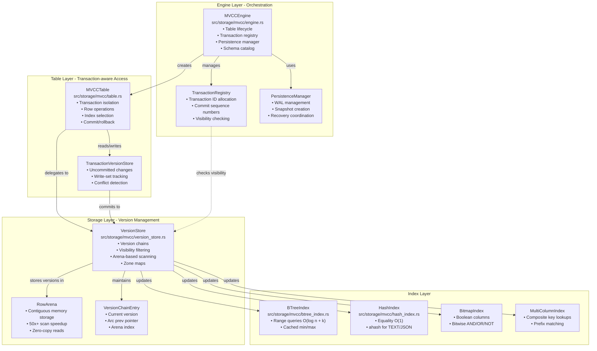
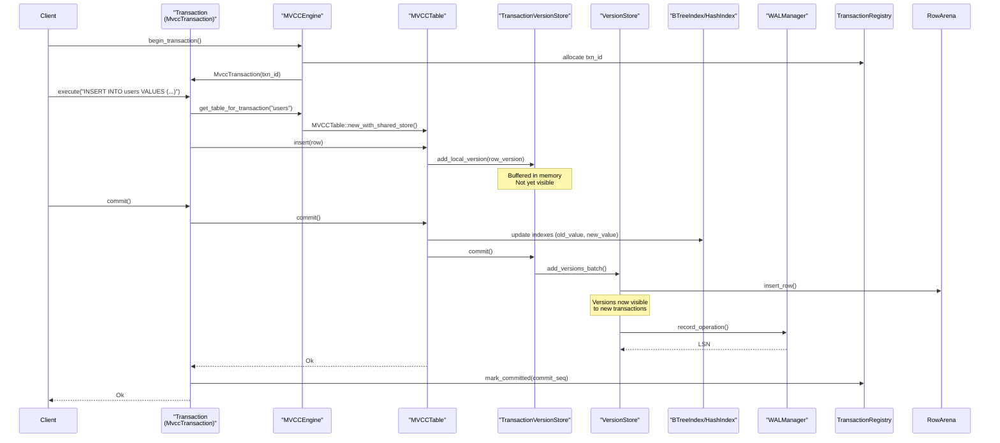
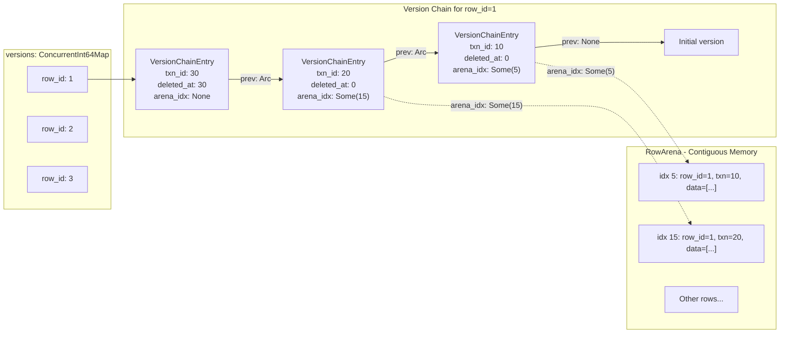
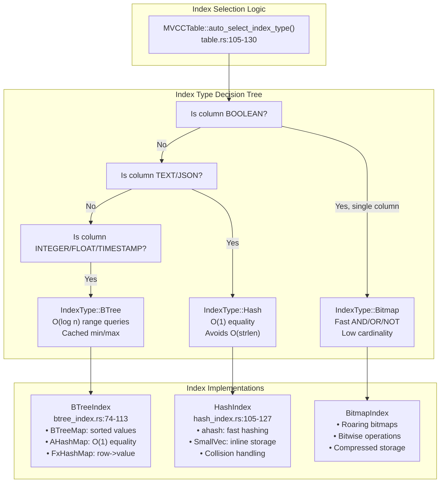

# Page: Storage Engine

# Storage Engine

<details>
<summary>Relevant source files</summary>

The following files were used as context for generating this wiki page:

- [src/storage/mvcc/btree_index.rs](src/storage/mvcc/btree_index.rs)
- [src/storage/mvcc/engine.rs](src/storage/mvcc/engine.rs)
- [src/storage/mvcc/hash_index.rs](src/storage/mvcc/hash_index.rs)
- [src/storage/mvcc/table.rs](src/storage/mvcc/table.rs)
- [src/storage/mvcc/version_store.rs](src/storage/mvcc/version_store.rs)

</details>


The Storage Engine is the foundation of Oxibase's data persistence and transaction management. It implements Multi-Version Concurrency Control (MVCC) for snapshot isolation, manages row versioning and visibility, coordinates multiple index types, and handles Write-Ahead Logging (WAL) for crash recovery.

For information about how SQL queries are executed on top of the storage layer, see [Query Execution System](#3). For details on the expression evaluation that filters rows, see [Expression Evaluation](#3.2). For specifics on MVCC transaction semantics and isolation levels, see [MVCC Architecture](#4.1).

## Architecture Overview

The storage engine is organized into three primary layers: the Engine layer (orchestration), the Table layer (transaction-aware access), and the Storage layer (version management and indexing).



**Sources:** [src/storage/mvcc/engine.rs:254-279](), [src/storage/mvcc/table.rs:36-45](), [src/storage/mvcc/version_store.rs:157-193]()

## Core Components and Responsibilities

The storage engine consists of four main classes that handle different aspects of data storage and retrieval:

| Component | File | Primary Responsibilities |
|-----------|------|--------------------------|
| `MVCCEngine` | [engine.rs:254-279]() | Database lifecycle, table creation/deletion, transaction coordination, schema management, persistence orchestration |
| `MVCCTable` | [table.rs:36-45]() | Per-transaction table view, row insert/update/delete, index lookup optimization, commit/rollback execution |
| `VersionStore` | [version_store.rs:157-193]() | Version chain management, visibility checking, arena-based scanning, row counting, index population |
| `TransactionVersionStore` | [version_store.rs:1354-1414]() | Uncommitted changes buffer, write-set conflict tracking, local version cache |

**Sources:** [src/storage/mvcc/engine.rs:254-316](), [src/storage/mvcc/table.rs:36-78](), [src/storage/mvcc/version_store.rs:157-234]()

## Storage Engine Data Flow

This diagram shows how a typical transaction operation flows through the storage layers, from the public API down to the physical storage structures.



**Sources:** [src/storage/mvcc/engine.rs:1185-1227](), [src/storage/mvcc/table.rs:722-804](), [src/storage/mvcc/version_store.rs:292-367]()

## Version Chain Management

Oxibase implements MVCC by maintaining linked version chains for each row. Each `VersionChainEntry` contains a `RowVersion` and an `Arc` pointer to the previous version, enabling O(1) chain cloning for snapshot isolation.



Key data structures:

- **`versions: ConcurrentInt64Map<VersionChainEntry>`** [version_store.rs:171]() - Maps `row_id` to the head of its version chain
- **`VersionChainEntry`** [version_store.rs:112-119]() - Linked list node with `version: RowVersion`, `prev: Option<Arc<...>>`, and `arena_idx: Option<usize>`
- **`RowArena`** [version_store.rs:187]() - Contiguous memory storage providing 50x+ faster full table scans via zero-copy reads

The use of `Arc` for the `prev` pointer enables cheap snapshot cloning—creating a snapshot of a table is O(1) because the chain is reference-counted rather than deep-copied.

**Sources:** [src/storage/mvcc/version_store.rs:110-119](), [src/storage/mvcc/version_store.rs:169-193](), [src/storage/mvcc/version_store.rs:292-367]()

## Transaction Version Store

The `TransactionVersionStore` buffers uncommitted changes within a transaction, maintaining write-set information for conflict detection during commit.

| Field | Type | Purpose |
|-------|------|---------|
| `local_versions` | `Int64Map<RowVersion>` | Uncommitted inserts/updates/deletes |
| `write_set` | `Int64Map<WriteSetEntry>` | Conflict detection: tracks read version and sequence number |
| `version_store` | `Arc<VersionStore>` | Reference to global committed storage |
| `txn_id` | `i64` | Transaction identifier |

**Commit process** [table.rs:722-804]():
1. Check uniqueness constraints on all indexes
2. Update indexes with (old_value, new_value) pairs
3. Flush `local_versions` to `VersionStore` in batch
4. Mark zone maps as stale (for optimizer statistics)

**Rollback process** [table.rs:806-809]():
1. Discard all entries in `local_versions`
2. Clear `write_set` tracking data

**Sources:** [src/storage/mvcc/version_store.rs:1354-1414](), [src/storage/mvcc/table.rs:722-809]()

## Index Architecture

Oxibase provides three index types, each optimized for different query patterns. The `MVCCTable` automatically selects the optimal index type based on column data types.



**Index selection rules** [table.rs:105-130]():
- **BOOLEAN** → `BitmapIndex` for fast bitwise AND/OR/NOT operations
- **TEXT/JSON** → `HashIndex` to avoid O(strlen) comparisons in B-tree nodes
- **INTEGER/FLOAT/TIMESTAMP** → `BTreeIndex` for range query support
- **Mixed types** → `BTreeIndex` as safe default

**Sources:** [src/storage/mvcc/table.rs:95-130](), [src/storage/mvcc/btree_index.rs:74-113](), [src/storage/mvcc/hash_index.rs:105-127]()

## BTreeIndex Internal Structure

The `BTreeIndex` maintains dual data structures for optimal performance across different query types:

| Data Structure | Type | Purpose | Complexity |
|----------------|------|---------|------------|
| `sorted_values` | `RwLock<BTreeMap<Value, RowIdSet>>` | Range queries, MIN/MAX | O(log n + k) |
| `value_to_rows` | `RwLock<AHashMap<Value, RowIdSet>>` | Equality lookups | O(1) |
| `row_to_value` | `RwLock<FxHashMap<i64, Value>>` | Removal by row_id | O(1) |
| `cached_min` | `RwLock<Option<Value>>` | MIN aggregate | O(1) |
| `cached_max` | `RwLock<Option<Value>>` | MAX aggregate | O(1) |

The dual-index strategy (BTreeMap + HashMap) trades memory (~2x for unique values) for optimal query performance: O(1) equality via hash lookup and O(log n + k) range queries via sorted iteration.

**Sources:** [src/storage/mvcc/btree_index.rs:74-113](), [src/storage/mvcc/btree_index.rs:298-397]()

## HashIndex Characteristics

The `HashIndex` is designed for high-cardinality TEXT columns where equality queries dominate:

**Advantages:**
- O(1) exact match via `ahash` (faster than SipHash)
- Avoids O(strlen) string comparisons in B-tree traversal
- `SmallVec<[i64; 4]>` reduces allocations for unique indexes

**Limitations:**
- Does **NOT** support range queries [hash_index.rs:403-414]()
- Does **NOT** support ORDER BY optimization
- Requires exact match on all indexed columns (no partial key lookups)

**Triple-lock write pattern** [hash_index.rs:236-295]():
```
add() acquires:
  1. hash_to_rows: Write
  2. row_to_hash: Write
  3. hash_to_values: Write
```

This ensures atomicity but serializes concurrent writes. Read operations (`find`) only acquire a single read lock for minimal contention.

**Sources:** [src/storage/mvcc/hash_index.rs:105-127](), [src/storage/mvcc/hash_index.rs:219-296](), [src/storage/mvcc/hash_index.rs:371-401]()

## Row Arena: Zero-Copy Scanning

The `RowArena` stores row data in contiguous memory to eliminate per-row allocation overhead during full table scans:

**Performance characteristics** [version_store.rs:749-817]():
- **50x+ speedup** for full table scans vs. per-row cloning
- Pre-acquire locks once per scan (O(1) instead of O(N))
- Direct slice access via `unsafe` bounds-checked reads
- Cache locality from contiguous layout

**Arena structure:**
```
arena_rows: Vec<RowMetadata>  // [start, end, row_id, txn_id, create_time, deleted_at]
arena_data: Vec<Value>         // Flattened row data
row_arena_index: Int64Map<usize>  // row_id -> arena_idx
```

**Usage pattern** [version_store.rs:756-816]():
1. Acquire `arena_rows` and `arena_data` read guards once
2. Iterate version chains checking visibility
3. For visible versions, read directly from arena via `arena_idx`
4. Release locks after iteration completes
5. Sort results by `row_id` (if needed)

**Sources:** [src/storage/mvcc/version_store.rs:187-192](), [src/storage/mvcc/version_store.rs:749-817](), [src/storage/mvcc/arena.rs]() (referenced but not provided)

## Persistence and Recovery

The storage engine provides crash consistency through Write-Ahead Logging (WAL) and periodic snapshots:

**WAL Manager responsibilities:**
- Sequential writes with CRC32 checksums [engine.rs:494-521]()
- Two-phase recovery: Phase 1 identifies committed transactions, Phase 2 applies their changes
- Compression (optional) for reduced I/O

**Snapshot system:**
- Binary format with magic bytes (`0x50414E53` = "SNAP") [engine.rs:46-147]()
- Atomic 3-phase writes: temp file → sync → rename
- Tracks source LSN for incremental recovery [engine.rs:365-417]()

**Recovery flow** [engine.rs:487-521]():
1. Read snapshot metadata to get checkpoint LSN
2. Load table snapshots (fastest recovery path)
3. Replay WAL entries from checkpoint LSN forward
4. Apply only entries from committed transactions (two-phase)
5. Populate indexes in single pass after replay completes

**Sources:** [src/storage/mvcc/engine.rs:324-360](), [src/storage/mvcc/engine.rs:487-521](), [src/storage/mvcc/engine.rs:54-107]()

## Schema Management

The `MVCCEngine` maintains the schema catalog and handles DDL operations:

**Schema storage:**
- `schemas: Arc<RwLock<FxHashMap<String, Schema>>>` [engine.rs:260]()
- Lowercase table names for case-insensitive lookups
- Schema changes recorded to WAL [engine.rs:1085-1096]()

**ALTER TABLE operations** [engine.rs:845-1077]():
- `AddColumn`: Normalizes existing rows, adds default values [table.rs:137-163]()
- `DropColumn`: Truncates row data [table.rs:157-160]()
- `RenameColumn`: Updates schema, preserves data
- `ModifyColumn`: Type coercion with validation
- `RenameTable`: Updates all references atomically

**Schema normalization** [table.rs:137-163]():
When reading rows, `MVCCTable` normalizes row data to match the current schema, handling columns added/dropped via ALTER TABLE by filling defaults or truncating.

**Sources:** [src/storage/mvcc/engine.rs:254-279](), [src/storage/mvcc/engine.rs:845-1077](), [src/storage/mvcc/table.rs:137-163]()