# Page: Subquery Execution

# Subquery Execution

<details>
<summary>Relevant source files</summary>

The following files were used as context for generating this wiki page:

- [src/executor/query.rs](src/executor/query.rs)
- [src/executor/subquery.rs](src/executor/subquery.rs)

</details>


This document describes how OxiBase executes subqueries within SQL statements. A subquery is a SELECT statement nested within another query, appearing in expressions, WHERE clauses, or FROM clauses. This page covers the execution strategies, optimizations, and transformations applied to subqueries to achieve efficient evaluation.

For information about the overall query execution pipeline, see [Query Execution Pipeline](#3.1). For details on expression evaluation, see [Expression Evaluation](#3.2). For CTE (WITH clause) execution, see [Common Table Expressions](#3.6).

## Subquery Types

OxiBase supports four primary types of subqueries, each with different execution characteristics:

| Subquery Type | Returns | Example | Use Case |
|--------------|---------|---------|----------|
| **EXISTS** | Boolean (true if any rows exist) | `WHERE EXISTS (SELECT 1 FROM orders WHERE user_id = u.id)` | Check for row existence |
| **Scalar** | Single value | `SELECT (SELECT MAX(price) FROM products) AS max_price` | Compute single aggregate or value |
| **IN** | List of values for membership test | `WHERE id IN (SELECT user_id FROM orders)` | Set membership testing |
| **ALL/ANY** | Comparison against all/any values | `WHERE price > ALL (SELECT price FROM competitors)` | Universal/existential quantification |

**Sources:** [src/executor/subquery.rs:15-39]()

### EXISTS Subqueries

EXISTS subqueries return true if the nested query produces at least one row. They are commonly used for filtering based on related data existence.

```sql
SELECT * FROM customers c
WHERE EXISTS (
    SELECT 1 FROM orders o 
    WHERE o.customer_id = c.id AND o.status = 'pending'
)
```

**Key implementation details:**
- Early termination: stops after finding first matching row
- Supports both correlated and non-correlated forms
- Multiple optimization paths (direct execution, index probing, semi-join)

**Sources:** [src/executor/subquery.rs:341-360]()

### Scalar Subqueries

Scalar subqueries return exactly one value (one row, one column). They can appear anywhere an expression is valid.

```sql
SELECT 
    name,
    price,
    (SELECT AVG(price) FROM products) AS avg_price
FROM products
```

**Key implementation details:**
- Returns NULL if subquery produces no rows
- Throws error if subquery produces multiple rows
- Cached when non-correlated to avoid re-execution

**Sources:** [src/executor/subquery.rs:896-962]()

### IN Subqueries

IN subqueries return a list of values for membership testing. The left operand is checked against the subquery result set.

```sql
SELECT * FROM products
WHERE category_id IN (
    SELECT id FROM categories WHERE active = true
)
```

**Key implementation details:**
- Transformed to `InHashSet` expression using `Arc<AHashSet<Value>>` for O(1) lookups
- Supports multi-column IN: `(a, b) IN (SELECT x, y FROM t)`
- Cached when non-correlated

**Sources:** [src/executor/subquery.rs:154-217](), [src/executor/subquery.rs:964-1034]()

### ALL/ANY Subqueries

ALL and ANY subqueries perform comparisons against all or any values in the result set.

```sql
-- ANY: true if condition holds for at least one value
SELECT * FROM products WHERE price < ANY (SELECT price FROM premium_products)

-- ALL: true if condition holds for all values
SELECT * FROM employees WHERE salary > ALL (SELECT salary FROM interns)
```

**Optimization:** OxiBase converts these to simpler comparisons using MIN/MAX:
- `x > ALL (values)` → `x > MAX(values)`
- `x < ANY (values)` → `x < MAX(values)`
- `x = ANY (values)` → `x IN (values)`
- `x <> ALL (values)` → `x NOT IN (values)`

**Sources:** [src/executor/subquery.rs:738-894]()

## Correlated vs Non-Correlated Subqueries

### Non-Correlated Subqueries

Non-correlated subqueries do not reference columns from outer queries. They can be executed once and their results cached.

```sql
-- Non-correlated: independent of outer query
SELECT * FROM products
WHERE price > (SELECT AVG(price) FROM products)
```

**Execution strategy:**
1. Execute subquery once before outer query
2. Cache result using SQL string as key
3. Reuse cached result for subsequent references

**Sources:** [src/executor/subquery.rs:905-918](), [src/executor/subquery.rs:972-986]()

### Correlated Subqueries

Correlated subqueries reference columns from outer queries, requiring per-row evaluation.

```sql
-- Correlated: references outer query column c.id
SELECT * FROM customers c
WHERE EXISTS (
    SELECT 1 FROM orders o 
    WHERE o.customer_id = c.id
)
```

**Detection logic:**
- Qualified identifiers (e.g., `c.id`) are checked against subquery's FROM clause
- If qualifier is NOT in subquery tables, it's an outer reference
- Simple identifiers are assumed to be inner scope (SQL precedence rules)

**Sources:** [src/executor/subquery.rs:1497-1517](), [src/executor/subquery.rs:1563-1631]()

## Execution Context and Outer Rows

For correlated subqueries, the executor maintains an outer row context that provides column values from the parent query.

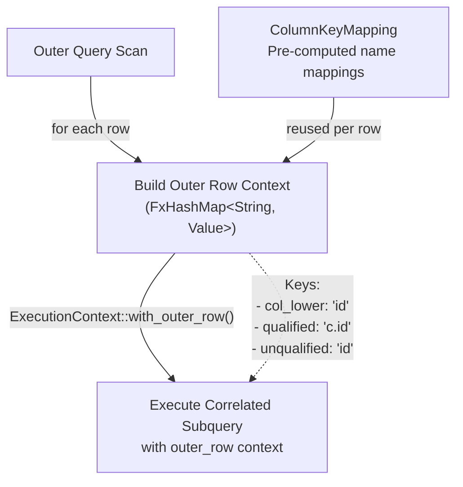

**Key optimization:** `ColumnKeyMapping` pre-computes all string transformations (lowercase, qualified names) outside the row loop to avoid repeated allocations.

**Sources:** [src/executor/query.rs:67-103](), [src/executor/query.rs:1603-1711]()

## Execution Strategies

OxiBase uses multiple execution strategies for subqueries, selecting the optimal approach based on query characteristics.

### Strategy 1: Direct Execution

The default path for subqueries without special optimizations.

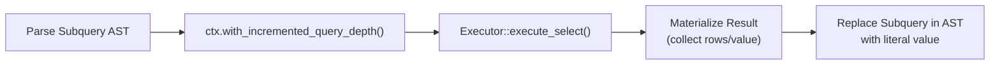

**Depth tracking:** The `query_depth` counter prevents creating multiple `TimeoutGuard` instances for nested queries, ensuring the timeout applies to the entire query tree.

**Sources:** [src/executor/subquery.rs:920-922](), [src/executor/subquery.rs:988-990]()

### Strategy 2: Index-Nested-Loop for EXISTS

For correlated EXISTS with indexed correlation columns, OxiBase probes the index directly instead of executing a full query.

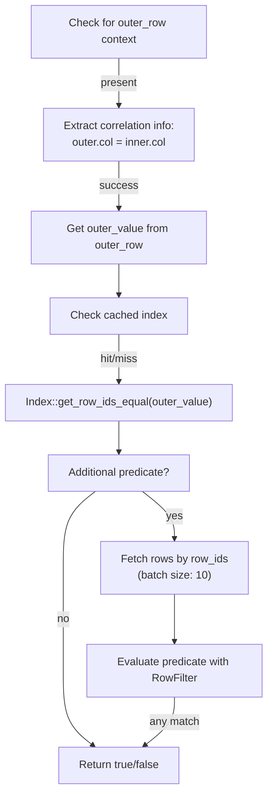

**Performance:** O(log n) or O(1) index lookup vs O(n) table scan. For queries with LIMIT, this enables early termination after finding enough matching outer rows.

**Sources:** [src/executor/subquery.rs:370-545]()

**Caching layers:**
1. **Index cache** (`exists_index`): Avoids repeated `get_all_indexes()` calls
2. **Schema cache** (`exists_schema`): Avoids repeated `get_table_schema()` calls
3. **Predicate cache** (`exists_predicate`): Compiled `RowFilter` reused across probes
4. **Predicate key cache** (`exists_pred_key`): Maps subquery pointer to predicate cache key
5. **Row fetcher cache** (`exists_fetcher`): Closure for fetching rows by ID

**Sources:** [src/executor/subquery.rs:407-529]()

### Strategy 3: Semi-Join Optimization for EXISTS

For correlated EXISTS that can be decorrelated, OxiBase transforms the subquery into a hash set lookup.

**Transformation example:**
```sql
-- BEFORE: O(outer_rows × inner_rows)
SELECT * FROM customers c
WHERE EXISTS (
    SELECT 1 FROM orders o 
    WHERE o.customer_id = c.id 
    AND o.status = 'pending'
)

-- AFTER: O(inner_rows) + O(outer_rows)
-- Step 1: Execute once
SELECT DISTINCT customer_id FROM orders WHERE status = 'pending'
-- Step 2: Transform to
WHERE c.id IN (hash_set_of_customer_ids)
```

#### Semi-Join Decision Tree

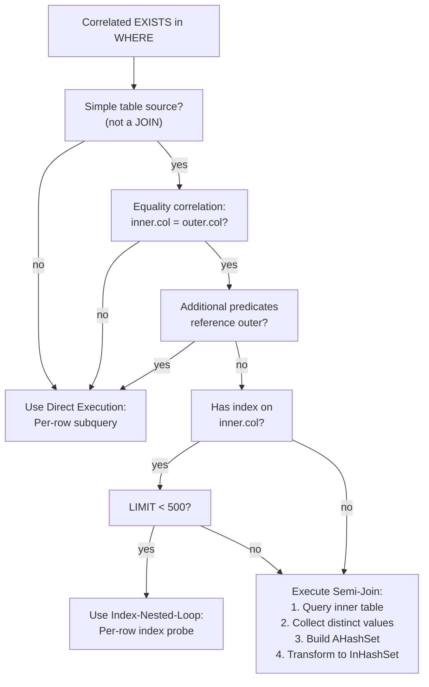

**Sources:** [src/executor/subquery.rs:1751-1801](), [src/executor/subquery.rs:2024-2070]()

#### Semi-Join Extraction

The `SemiJoinInfo` structure captures the correlation pattern:

```rust
pub struct SemiJoinInfo {
    pub outer_column: String,        // e.g., "id"
    pub outer_table: Option<String>, // e.g., Some("c")
    pub inner_column: String,        // e.g., "customer_id"
    pub inner_table: String,         // e.g., "orders"
    pub inner_alias: Option<String>, // e.g., Some("o")
    pub non_correlated_where: Option<Expression>, // e.g., "status = 'pending'"
    pub is_negated: bool,            // true for NOT EXISTS
}
```

**Sources:** [src/executor/subquery.rs:45-68]()

#### Semi-Join Execution

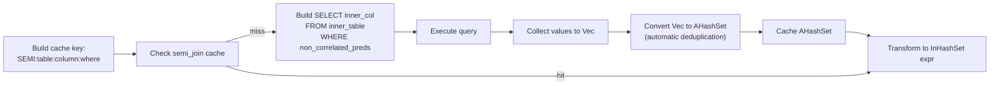

**Key implementation note:** The query uses `distinct: false` because collecting into `AHashSet` provides deduplication. Using DISTINCT in the query is slower in OxiBase due to additional hashing overhead.

**Sources:** [src/executor/subquery.rs:2082-2169]()

## Caching Architecture

OxiBase employs aggressive caching to avoid redundant subquery execution. All caches are scoped to a single top-level query execution and cleared at the start of each new query.

### Cache Types and Keys

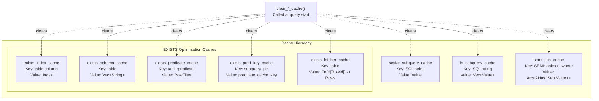

**Cache clearing:** All caches are cleared at the start of each top-level query (`query_depth == 0`) to prevent stale results between queries.

**Sources:** [src/executor/query.rs:165-172](), [src/executor/context.rs:31-46]()

### Cache Key Design

| Cache | Key Strategy | Rationale |
|-------|-------------|-----------|
| Scalar/IN subquery | SQL string (`stmt.to_string()`) | Unique identifier for query structure |
| Semi-join | `SEMI:table:column:where` | Captures correlation + predicates |
| EXISTS index | `table:column` | Index lookup is table+column specific |
| EXISTS schema | `table` | Schema is table-specific |
| EXISTS predicate | `table:predicate` | Compiled filter for table+predicate combo |
| EXISTS predicate key | Subquery pointer (`{:p}`) | Stable within execution, cheap lookup |

**Sources:** [src/executor/subquery.rs:910-918](), [src/executor/subquery.rs:2086-2095](), [src/executor/subquery.rs:469-498]()

## Expression Transformations

The executor transforms subquery expressions into more efficient forms during execution.

### Transformation: IN Subquery → InHashSet

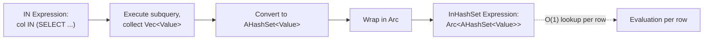

**Benefits:**
- O(1) membership testing vs O(n) for list comparison
- `Arc` enables cheap cloning for parallel execution
- `AHashSet` (ahash) provides faster hashing than standard HashSet

**Sources:** [src/executor/subquery.rs:194-207](), [src/executor/subquery.rs:1413-1424]()

### Transformation: ALL/ANY → MIN/MAX Comparison

```sql
-- x > ALL (SELECT price FROM products)
-- Transformed to:
-- x > (SELECT MAX(price) FROM products)

-- x < ANY (SELECT price FROM products)  
-- Transformed to:
-- x < (SELECT MAX(price) FROM products)
```

**Fallback:** For operators without MIN/MAX optimization (e.g., `= ALL`), expands to compound AND/OR expressions.

**Sources:** [src/executor/subquery.rs:803-857]()

### Transformation: EXISTS → Boolean Literal

Non-correlated EXISTS subqueries are executed once and replaced with true/false literals.

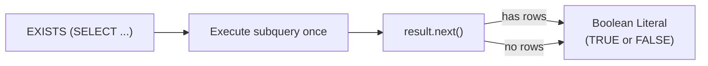

**Sources:** [src/executor/subquery.rs:94-103]()

## Processing Flow

### WHERE Clause Subquery Processing

The `process_where_subqueries()` function walks the expression tree, executing subqueries and replacing them with literal values.

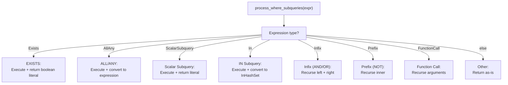

**Sources:** [src/executor/subquery.rs:88-339]()

### SELECT Clause Subquery Processing

Subqueries in SELECT expressions are processed using `try_process_select_subqueries()`, which combines detection and processing in a single pass to avoid redundant tree walks.

**Optimization:** Returns `None` if no subqueries found, avoiding unnecessary allocations. Only creates a new vector if at least one subquery is processed.

**Sources:** [src/executor/subquery.rs:1062-1088]()

### Correlated Subquery Processing

For correlated subqueries, the outer row context is built per row and passed to the subquery executor.

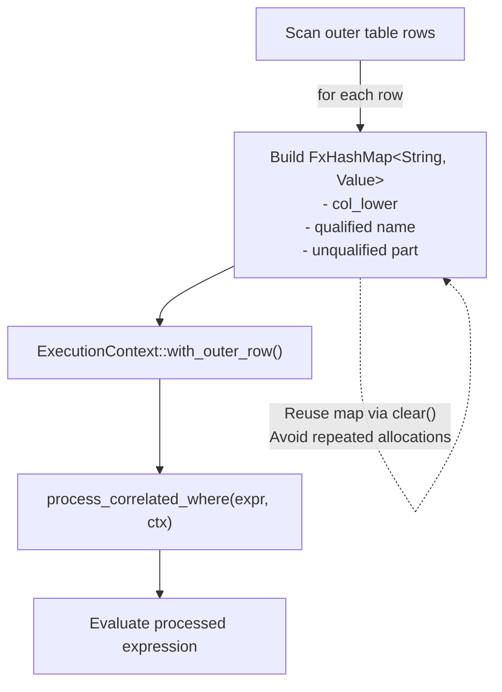

**Key optimization:** The outer row map is cleared and reused per row instead of creating a new HashMap, avoiding repeated allocations in hot loops.

**Sources:** [src/executor/query.rs:1680-1789](), [src/executor/subquery.rs:1633-1737]()

## Code Entity Reference

### Key Functions in `src/executor/subquery.rs`

| Function | Line Range | Purpose |
|----------|-----------|---------|
| `process_where_subqueries()` | 88-339 | Process and execute subqueries in WHERE clause |
| `execute_exists_subquery()` | 342-360 | Execute EXISTS subquery with optimization dispatch |
| `try_execute_exists_with_index_probe()` | 370-545 | Index-nested-loop optimization for EXISTS |
| `extract_index_nested_loop_info()` | 547-571 | Extract correlation info for index probing |
| `execute_scalar_subquery()` | 899-962 | Execute scalar subquery with caching |
| `execute_in_subquery()` | 967-1011 | Execute IN subquery with caching |
| `execute_in_subquery_rows()` | 1014-1034 | Execute multi-column IN subquery |
| `has_subqueries()` | 1037-1059 | Check if expression contains subqueries |
| `try_process_select_subqueries()` | 1068-1088 | Single-pass subquery processing for SELECT |
| `has_correlated_subqueries()` | 1295-1329 | Check if expression has correlated subqueries |
| `is_subquery_correlated()` | 1498-1517 | Determine if subquery references outer columns |
| `process_correlated_expression()` | 1338-1495 | Process expression with correlated subqueries |
| `process_correlated_where()` | 1636-1737 | Process WHERE with correlated subqueries |
| `try_extract_semi_join_info()` | 1751-1801 | Extract semi-join optimization info |
| `extract_equality_correlation()` | 1810-1852 | Find equality correlation in WHERE |
| `should_use_index_nested_loop()` | 2028-2070 | Decide between index vs semi-join strategy |
| `execute_semi_join_optimization()` | 2082-2169 | Execute semi-join transformation |
| `transform_exists_to_in_list()` | 2174-2220 | Transform EXISTS to InHashSet expression |
| `try_optimize_exists_to_semi_join()` | 2231-2358 | Attempt semi-join optimization |

**Sources:** [src/executor/subquery.rs:1-2369]()

### Key Data Structures

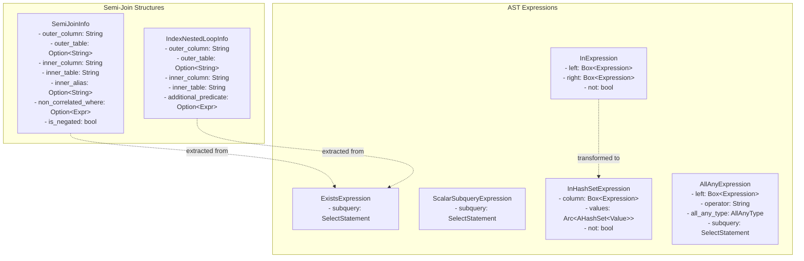

**Sources:** [src/executor/subquery.rs:45-82](), [src/parser/ast.rs]()

### Integration with Query Executor

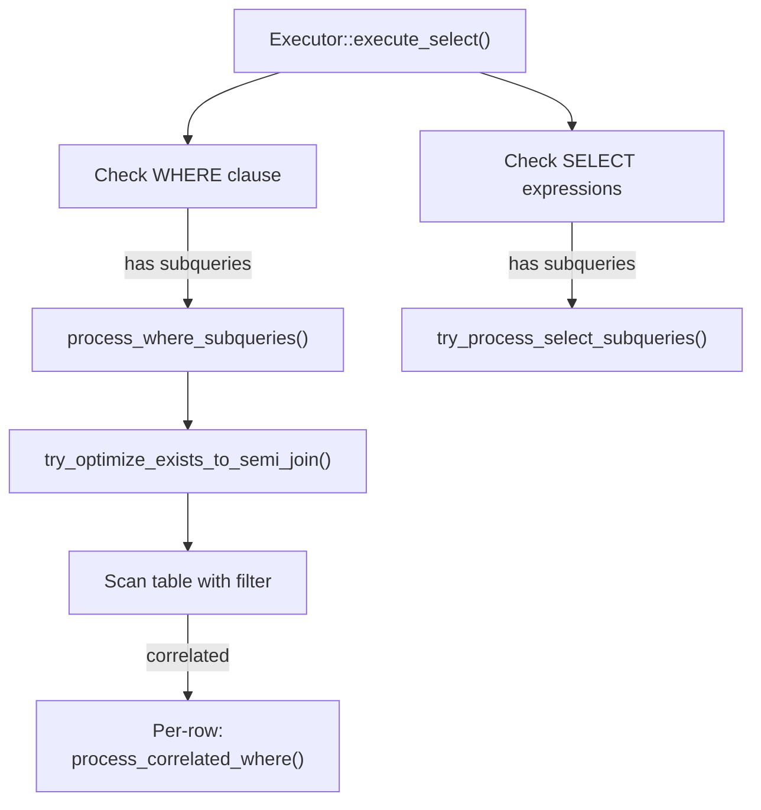

**Sources:** [src/executor/query.rs:792-818](), [src/executor/query.rs:1479-1519]()

## Performance Characteristics

### Complexity Analysis

| Strategy | Time Complexity | Space Complexity | Best For |
|----------|----------------|------------------|----------|
| Direct execution | O(outer × inner) | O(result_size) | Small datasets, complex subqueries |
| Index-nested-loop | O(outer × log(inner)) or O(outer) | O(1) | LIMIT queries with indexed correlation |
| Semi-join | O(inner + outer) | O(distinct_inner_values) | Large datasets, simple correlation |
| Cached non-correlated | O(inner) amortized | O(result_size) | Repeated identical subqueries |

**Sources:** [src/executor/subquery.rs:2028-2070](), [src/executor/subquery.rs:370-545]()

### Optimization Thresholds

- **Index-nested-loop threshold:** LIMIT < 500
- **EXISTS index probe batch size:** 10 rows
- **Semi-join cache scope:** Per top-level query

**Sources:** [src/executor/subquery.rs:2041](), [src/executor/subquery.rs:531]()

### Cache Memory Considerations

All caches are cleared between queries to prevent:
1. Stale results from previous queries
2. Unbounded memory growth
3. Cross-query data leakage in MVCC isolation

**Sources:** [src/executor/query.rs:165-172]()

## Common Patterns and Examples

### Pattern 1: Semi-Join Eligible EXISTS

```sql
-- Optimized to semi-join
SELECT * FROM customers c
WHERE EXISTS (
    SELECT 1 FROM orders o
    WHERE o.customer_id = c.id
    AND o.status = 'shipped'
)
```

**Requirements:**
- Simple equality correlation (`o.customer_id = c.id`)
- Additional predicates reference only inner table
- Single inner table (no joins in subquery)

**Sources:** [src/executor/subquery.rs:1751-1801]()

### Pattern 2: Index-Nested-Loop Eligible EXISTS

```sql
-- Uses index probe for small result sets
SELECT * FROM customers c
WHERE EXISTS (
    SELECT 1 FROM orders o
    WHERE o.customer_id = c.id
)
LIMIT 100
```

**Requirements:**
- Small LIMIT (< 500)
- Index on correlation column (`customer_id`)
- Early termination beneficial

**Sources:** [src/executor/subquery.rs:2028-2070]()

### Pattern 3: Cached Non-Correlated Scalar

```sql
-- Computed once, cached for all rows
SELECT 
    name,
    price,
    price - (SELECT AVG(price) FROM products) AS price_diff
FROM products
```

**Sources:** [src/executor/subquery.rs:905-918]()