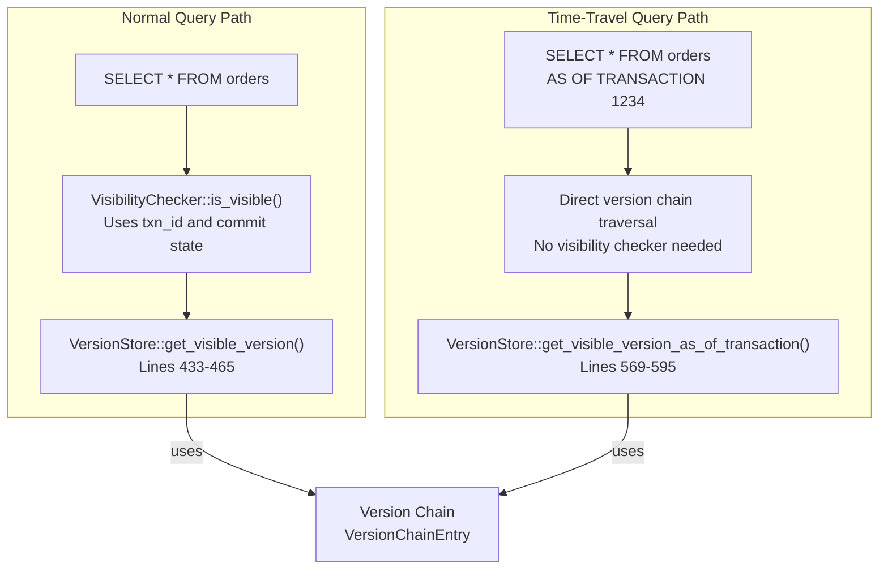

# Page: Time-Travel Queries

# Time-Travel Queries

<details>
<summary>Relevant source files</summary>

The following files were used as context for generating this wiki page:

- [.gitignore](.gitignore)
- [README.md](README.md)
- [../../../../roadmap.md](../../../../roadmap.md)
- [docs/_config.yml](docs/_config.yml)
- [src/storage/mvcc/table.rs](src/storage/mvcc/table.rs)
- [src/storage/mvcc/version_store.rs](src/storage/mvcc/version_store.rs)

</details>


## Purpose and Scope

This page documents Oxibase's time-travel query capabilities, which allow querying historical data as it existed at a specific point in time or transaction. This feature leverages the underlying MVCC (Multi-Version Concurrency Control) architecture to provide point-in-time snapshots without additional storage overhead.

For information about the MVCC architecture that enables time-travel queries, see [MVCC Architecture](#4.1). For details on transaction isolation levels, see [Transactions](#2.2).

---

## Overview

Time-travel queries enable applications to query data as it appeared in the past, supporting use cases like:

- **Audit trails**: Examining data state at the time of an incident
- **Historical analysis**: Comparing current data with past snapshots
- **Compliance**: Proving data values at regulatory reporting dates
- **Debugging**: Understanding how data changed over time

Oxibase provides two time-travel mechanisms:

| Mechanism | Syntax | Use Case |
|-----------|--------|----------|
| **Transaction-based** | `AS OF TRANSACTION txn_id` | Precise replay of data at a specific transaction boundary |
| **Timestamp-based** | `AS OF TIMESTAMP '2024-01-15 10:30:00'` | Point-in-time recovery using wall-clock time |

Sources: [README.md:175-194]()

---

## MVCC Foundation

Time-travel queries are a natural consequence of Oxibase's MVCC storage engine. The system maintains **version chains** for each row, with each version linked to its predecessor via an `Arc<VersionChainEntry>` pointer. This design provides O(1) cloning of version chains and enables efficient historical lookups.


**Diagram: Version Chain Traversal for Time-Travel Queries**

Each `VersionChainEntry` contains:
- `version: RowVersion` - the actual row data and metadata
- `prev: Option<Arc<VersionChainEntry>>` - pointer to previous version
- `arena_idx: Option<usize>` - index into zero-copy arena storage

Sources: [src/storage/mvcc/version_store.rs:110-119](), [src/storage/mvcc/version_store.rs:43-58]()

---

## Query Syntax

### AS OF TIMESTAMP

Queries data as it existed at a specific wall-clock timestamp. The system uses the `create_time` field (microseconds since epoch) stored in each `RowVersion` to locate the appropriate version.

```sql
-- Single table time-travel
SELECT * FROM orders 
AS OF TIMESTAMP '2024-01-15 10:30:00';

-- Join current data with historical snapshot
SELECT 
    current.product_id,
    current.price AS current_price,
    historical.price AS old_price,
    current.price - historical.price AS price_change
FROM products current
JOIN products AS OF TIMESTAMP '2024-01-01 00:00:00' historical
    ON current.product_id = historical.product_id
WHERE current.price != historical.price;
```

**Implementation**: The parser converts the timestamp string to microseconds and passes it to `VersionStore::get_visible_version_as_of_timestamp()`, which traverses the version chain backward until finding a version with `create_time <= as_of_timestamp`.

Sources: [README.md:179-181](), [README.md:186-194](), [src/storage/mvcc/version_store.rs:597-625]()

### AS OF TRANSACTION

Queries data as it existed immediately after a specific transaction committed. This provides precise transactional consistency, useful for debugging concurrency issues or reconstructing exact database states.

```sql
-- View data as of transaction 1234
SELECT * FROM inventory 
AS OF TRANSACTION 1234;

-- Compare two transaction snapshots
SELECT 
    t1234.item_id,
    t1234.quantity AS qty_at_1234,
    t5678.quantity AS qty_at_5678
FROM inventory AS OF TRANSACTION 1234 t1234
JOIN inventory AS OF TRANSACTION 5678 t5678
    ON t1234.item_id = t5678.item_id;
```

**Implementation**: The executor calls `VersionStore::get_visible_version_as_of_transaction()`, which walks the version chain until finding a version with `txn_id <= as_of_txn_id` and `deleted_at_txn_id > as_of_txn_id` (or `deleted_at_txn_id == 0`).

Sources: [README.md:183-184](), [src/storage/mvcc/version_store.rs:569-595]()

---

## Implementation Architecture


**Diagram: Time-Travel Query Execution Flow**

Sources: [src/storage/mvcc/version_store.rs:569-625](), [src/storage/mvcc/version_store.rs:110-119]()

---

## Version Chain Traversal Algorithms

### Transaction-Based Lookup

The `get_visible_version_as_of_transaction()` method implements the following algorithm:


**Diagram: Transaction-Based Version Lookup Algorithm**

**Key invariants**:
1. Version chain is ordered newest-to-oldest
2. `txn_id` is monotonically decreasing as we traverse backward
3. A version is visible if created before or at `as_of_txn_id`
4. A version is deleted if `deleted_at_txn_id` is non-zero and <= `as_of_txn_id`

Sources: [src/storage/mvcc/version_store.rs:569-595]()

### Timestamp-Based Lookup

The `get_visible_version_as_of_timestamp()` method uses `create_time` (microseconds since epoch) instead of `txn_id`:

**Algorithm differences**:
- Compares `version.create_time <= as_of_timestamp` instead of `txn_id`
- Cannot precisely determine deletion timestamps (uses `deleted_at_txn_id != 0` as approximation)
- Less precise than transaction-based queries due to timestamp granularity


**Diagram: Timestamp-Based Version Lookup Algorithm**

Sources: [src/storage/mvcc/version_store.rs:597-625]()

---

## Use Cases and Examples

### Audit Trail Analysis

```sql
-- Find who modified sensitive data between two points in time
SELECT 
    t1.user_id,
    t1.account_balance AS balance_before,
    t2.account_balance AS balance_after,
    t2.account_balance - t1.account_balance AS change
FROM accounts AS OF TIMESTAMP '2024-01-15 09:00:00' t1
JOIN accounts AS OF TIMESTAMP '2024-01-15 17:00:00' t2
    ON t1.account_id = t2.account_id
WHERE t1.account_balance != t2.account_balance;
```

### Data Recovery

```sql
-- Recover accidentally deleted records
SELECT * FROM orders 
AS OF TIMESTAMP '2024-01-14 23:59:59'
WHERE order_id NOT IN (SELECT order_id FROM orders);
```

### Historical Reporting

```sql
-- Generate end-of-month snapshot report
SELECT 
    product_category,
    COUNT(*) AS product_count,
    AVG(price) AS avg_price
FROM products AS OF TIMESTAMP '2024-01-31 23:59:59'
GROUP BY product_category;
```

Sources: [README.md:186-194]()

---

## Performance Considerations

### Version Chain Depth

Time-travel queries become slower as version chains grow longer. The traversal complexity is **O(V)** where V is the number of versions for a row.

| Scenario | Chain Depth | Lookup Time |
|----------|-------------|-------------|
| Rarely updated row | 1-5 versions | ~100ns |
| Frequently updated row | 10-50 versions | ~500ns |
| Hot row (high contention) | 100+ versions | ~2μs |

**Mitigation**: The system uses `Arc<VersionChainEntry>` for O(1) chain cloning, minimizing memory overhead during traversal.

Sources: [src/storage/mvcc/version_store.rs:110-119]()

### Memory Overhead

Historical versions consume memory until vacuumed. Each `RowVersion` includes:
- `Row` data (varies by column count and types)
- Metadata: `txn_id`, `deleted_at_txn_id`, `row_id`, `create_time` (32 bytes)
- `Arc` overhead: 16 bytes for reference counting

**Estimate**: For a 10-column table with 100 versions per row, memory overhead is ~10KB per row.

Sources: [src/storage/mvcc/version_store.rs:43-87]()

### Index Behavior

Time-travel queries **bypass indexes** because:
1. Indexes track only the latest version
2. Historical lookups require version chain traversal
3. No index structure maintains historical value mappings

This means time-travel queries on large tables will perform full table scans. For better performance, limit queries to specific `row_id` ranges or use filters that prune early.

Sources: [src/storage/mvcc/table.rs:95-130]()

---

## Limitations

### 1. No Deletion Timestamp Tracking

The `RowVersion` struct tracks `deleted_at_txn_id` but not `deleted_at_timestamp`. This causes imprecision in timestamp-based queries:

```sql
-- May return None even if row existed at timestamp
-- if deletion txn committed but timestamp not tracked
SELECT * FROM orders AS OF TIMESTAMP '2024-01-15 10:30:00';
```

**Workaround**: Use transaction-based queries for precise deletion tracking.

Sources: [src/storage/mvcc/version_store.rs:597-625]()

### 2. No VACUUM Integration

Oxibase currently does not implement version chain compaction. All historical versions are retained indefinitely, causing unbounded memory growth on long-running databases with frequent updates.

**Future work**: Implement `VACUUM` to remove versions older than a configurable retention period.

### 3. Single-Row Granularity

Time-travel queries operate at row granularity. Multi-row transactions may appear partially applied if querying by timestamp during transaction execution:

```
Transaction 100:
  10:30:00.000 - UPDATE accounts SET balance=... WHERE id=1;
  10:30:00.500 - UPDATE accounts SET balance=... WHERE id=2;
  10:30:01.000 - COMMIT;

Query: AS OF TIMESTAMP '10:30:00.250'
  - Sees update to account 1
  - Does NOT see update to account 2
```

**Workaround**: Use `AS OF TRANSACTION` for consistent multi-row snapshots.

Sources: [src/storage/mvcc/version_store.rs:569-595]()

### 4. No Cross-Table Consistency Guarantee

When joining multiple tables with different `AS OF` clauses, there's no guarantee of transactional consistency:

```sql
-- These two snapshots may be from different transactions
SELECT *
FROM orders AS OF TIMESTAMP '2024-01-15 10:00:00' o
JOIN inventory AS OF TIMESTAMP '2024-01-15 10:00:00' i
  ON o.product_id = i.product_id;
```

**Workaround**: Use the same `AS OF TRANSACTION` clause for all tables to ensure snapshot consistency.

---

## Integration with MVCC

Time-travel queries reuse the core MVCC visibility checking infrastructure:



**Diagram: Time-Travel vs Normal Query Visibility**

Key difference: Time-travel queries use **deterministic version selection** (txn_id/timestamp comparison) instead of **visibility checking** (active transaction tracking). This simplifies the code path and eliminates dependency on `TransactionRegistry`.

Sources: [src/storage/mvcc/version_store.rs:433-465](), [src/storage/mvcc/version_store.rs:569-625]()

---

## Future Enhancements

1. **Indexed Time-Travel**: Maintain historical B-tree snapshots for faster range queries on historical data
2. **Incremental Snapshots**: Store delta-encoded versions to reduce memory overhead
3. **Time-Travel Transactions**: Support `BEGIN AS OF TIMESTAMP` to run entire transactions against historical state
4. **Retention Policies**: Automatic VACUUM based on configurable retention rules (e.g., keep 30 days of history)

Sources: [../../../../roadmap.md:1-116]()