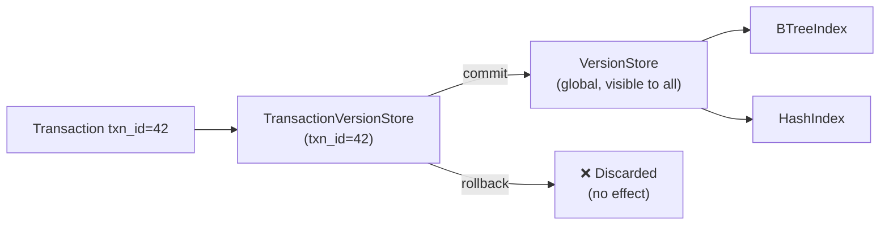
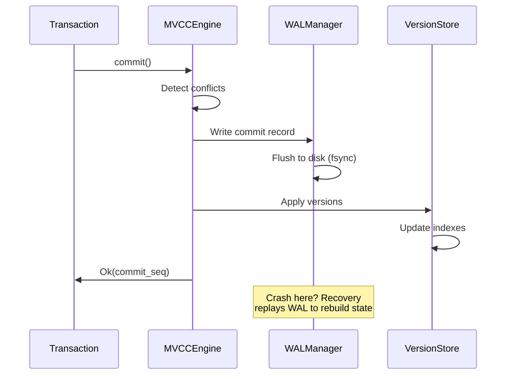
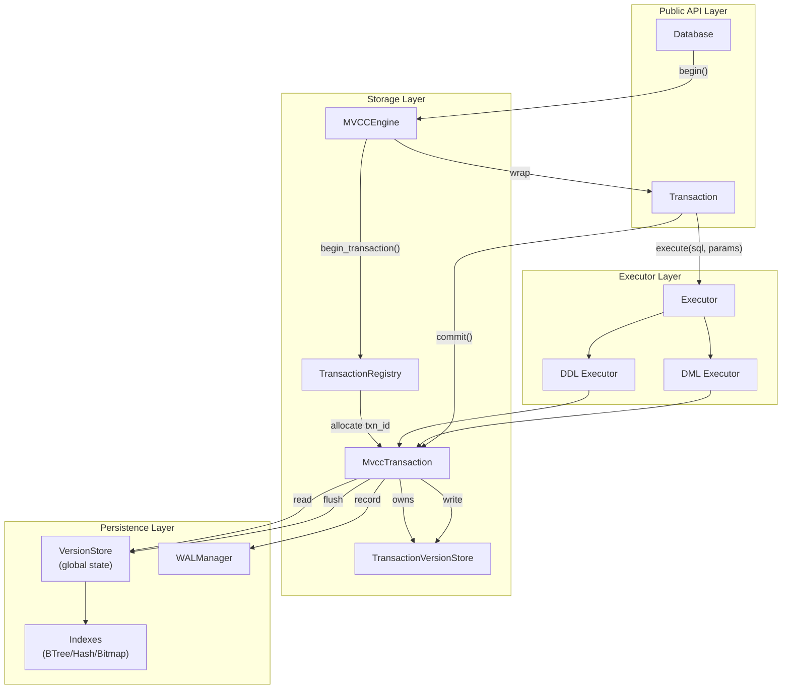
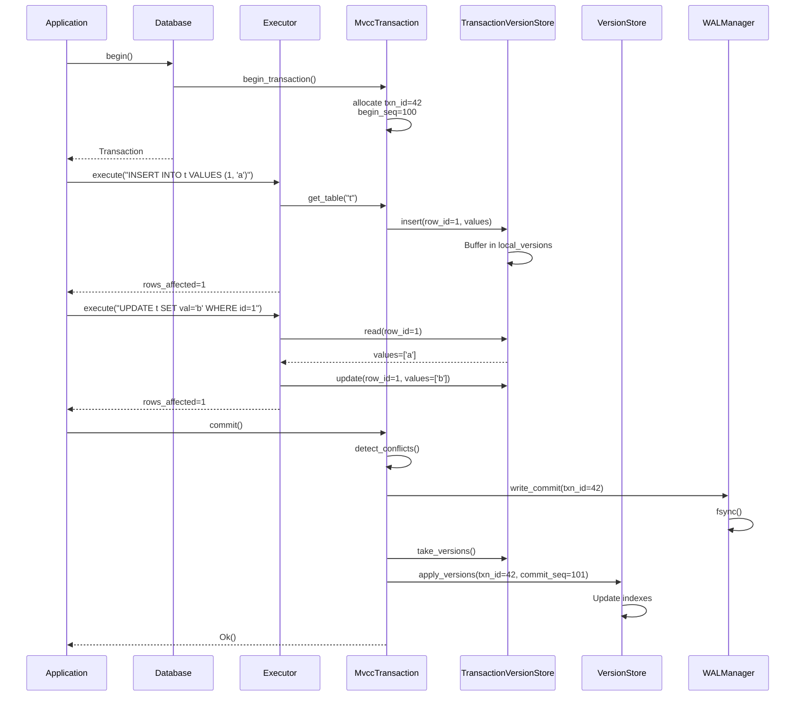
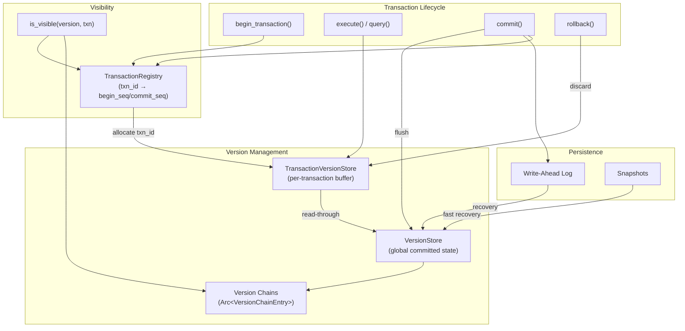

# Page: Transactions

# Transactions

<details>
<summary>Relevant source files</summary>

The following files were used as context for generating this wiki page:

- [src/api/database.rs](src/api/database.rs)
- [src/api/transaction.rs](src/api/transaction.rs)
- [src/executor/ddl.rs](src/executor/ddl.rs)
- [src/executor/expression/evaluator_bridge.rs](src/executor/expression/evaluator_bridge.rs)
- [src/executor/expression/mod.rs](src/executor/expression/mod.rs)
- [src/storage/mvcc/btree_index.rs](src/storage/mvcc/btree_index.rs)
- [src/storage/mvcc/engine.rs](src/storage/mvcc/engine.rs)
- [src/storage/mvcc/hash_index.rs](src/storage/mvcc/hash_index.rs)

</details>


## Purpose and Scope

This document describes Oxibase's transaction API for executing multiple database operations as atomic units of work with ACID guarantees. Transactions ensure data consistency by allowing operations to be committed together or rolled back entirely if errors occur.

For information about the underlying MVCC storage implementation that enables transactions, see [MVCC Architecture](#4.1). For basic query execution without transactions, see [Database API](#2.1).

---

## Creating Transactions

Transactions are created from a `Database` instance using the `begin()` method. The returned `Transaction` object provides an API similar to `Database` but with all operations scoped to the transaction.

```rust
// Create a transaction with default isolation level (ReadCommitted)
let mut tx = db.begin()?;

// Create a transaction with specific isolation level
let mut tx = db.begin_with_isolation(IsolationLevel::Serializable)?;
```

Each transaction receives a unique transaction ID (`txn_id`) used internally for MVCC visibility checking.

**Sources:** [src/api/database.rs:679-698](), [src/api/transaction.rs:58-65]()

---

## Transaction API Methods

The `Transaction` struct provides methods for executing SQL statements within the transaction scope. All methods require a mutable reference (`&mut self`) to ensure exclusive access during execution.

### Core Methods

| Method | Purpose | Return Type |
|--------|---------|-------------|
| `execute<P>(&mut self, sql: &str, params: P)` | Execute DML statements (INSERT, UPDATE, DELETE) | `Result<i64>` (rows affected) |
| `query<P>(&mut self, sql: &str, params: P)` | Execute SELECT queries | `Result<Rows>` |
| `query_one<T, P>(&mut self, sql: &str, params: P)` | Get single value from query | `Result<T>` |
| `query_opt<T, P>(&mut self, sql: &str, params: P)` | Get optional single value | `Result<Option<T>>` |
| `commit(&mut self)` | Commit all changes permanently | `Result<()>` |
| `rollback(&mut self)` | Discard all changes | `Result<()>` |
| `id(&self)` | Get transaction ID | `i64` |

**Example: Basic Transaction Usage**

```rust
let mut tx = db.begin()?;

// Insert data
tx.execute("INSERT INTO users VALUES ($1, $2)", (1, "Alice"))?;
tx.execute("INSERT INTO orders VALUES ($1, $2, $3)", (101, 1, 250))?;

// Query within transaction (sees uncommitted changes)
let count: i64 = tx.query_one("SELECT COUNT(*) FROM orders WHERE user_id = $1", (1,))?;

// Commit to make changes permanent
tx.commit()?;
```

**Sources:** [src/api/transaction.rs:87-166]()

---

## Transaction Lifecycle

### State Diagram

```mermaid
stateDiagram-v2
    [*] --> Active: Database::begin()
    
    Active --> Committed: commit()
    Active --> RolledBack: rollback()
    Active --> RolledBack: Drop (auto-rollback)
    Active --> Error: execute() fails
    
    Error --> RolledBack: rollback()
    Error --> RolledBack: Drop (auto-rollback)
    
    Committed --> [*]
    RolledBack --> [*]
    
    note right of Active
        Can execute queries
        All changes buffered
    end note
    
    note right of Committed
        Changes permanent
        Written to WAL
    end note
    
    note right of RolledBack
        Changes discarded
        No WAL entry
    end note
```

**Sources:** [src/api/transaction.rs:51-65](), [src/api/transaction.rs:606-613]()

### Commit

The `commit()` method finalizes all changes made within the transaction:

1. **Conflict Detection**: Checks for write-write conflicts with other transactions
2. **Validation**: Ensures all constraints remain satisfied
3. **WAL Recording**: Writes commit record to Write-Ahead Log for durability
4. **Version Finalization**: Makes all inserted/updated versions visible to other transactions
5. **Sequence Assignment**: Assigns commit sequence number for visibility ordering

```rust
let mut tx = db.begin()?;
tx.execute("UPDATE accounts SET balance = balance - $1 WHERE id = $2", (100, 1))?;
tx.execute("UPDATE accounts SET balance = balance + $1 WHERE id = $2", (100, 2))?;

// Both updates become visible atomically
tx.commit()?;
```

If `commit()` returns an error, the transaction remains active and can be retried or rolled back.

**Sources:** [src/api/transaction.rs:574-583](), [src/storage/mvcc/engine.rs:610-615]()

### Rollback

The `rollback()` method discards all uncommitted changes:

1. **Discard Buffered Writes**: Removes all entries from `TransactionVersionStore`
2. **WAL Recording**: Writes rollback record (optional, for diagnostics)
3. **State Cleanup**: Marks transaction as rolled back

```rust
let mut tx = db.begin()?;
tx.execute("DELETE FROM important_data WHERE category = $1", ("test",))?;

// Oops, wrong category!
tx.rollback()?;
// Data is safe, delete never happened
```

**Sources:** [src/api/transaction.rs:588-603]()

### Auto-Rollback

Transactions automatically rollback when dropped without explicit commit. This ensures data consistency even if code panics or returns early:

```rust
{
    let mut tx = db.begin()?;
    tx.execute("INSERT INTO logs VALUES ($1)", ("started",))?;
    
    if some_condition {
        return Err(error); // Transaction auto-rolls back here
    }
    
    tx.commit()?;
} // If commit wasn't called, auto-rollback happens here
```

**Sources:** [src/api/transaction.rs:606-613]()

---

## ACID Guarantees

### Atomicity

All operations within a transaction succeed or fail together. Partial completion is impossible.

**Implementation:** Changes are buffered in `TransactionVersionStore` per transaction. On commit, all changes are atomically applied to the global `VersionStore`. On rollback, the buffer is discarded.



**Sources:** [src/storage/mvcc/engine.rs:39](), [src/storage/mvcc/transaction.rs:1-100]()

### Consistency

All database constraints (PRIMARY KEY, UNIQUE, CHECK, foreign keys) are enforced at commit time.

**Implementation:** 
- Unique constraint violations detected via index lookups before insert
- CHECK constraints evaluated for each row
- Schema validation ensures type safety

```rust
// Unique constraint violation detected at commit
let mut tx = db.begin()?;
tx.execute("INSERT INTO users (id, email) VALUES ($1, $2)", (1, "alice@example.com"))?;
tx.execute("INSERT INTO users (id, email) VALUES ($2, $2)", (2, "alice@example.com"))?;
// Error: unique constraint violation on email
tx.commit()?; // Returns Err(Error::UniqueConstraint)
```

**Sources:** [src/storage/mvcc/btree_index.rs:443-457](), [src/storage/mvcc/hash_index.rs:166-203]()

### Isolation

Oxibase provides snapshot isolation using Multi-Version Concurrency Control (MVCC). Each transaction sees a consistent snapshot of the database from its start time.

**Supported Isolation Levels:**

| Level | Description | Implementation |
|-------|-------------|----------------|
| `ReadUncommitted` | See uncommitted changes (not recommended) | Disabled visibility checks |
| `ReadCommitted` | Default; see only committed data | Check commit_seq < begin_seq |
| `RepeatableRead` | Same reads return same results | Snapshot at transaction start |
| `Serializable` | Full isolation with conflict detection | Write-set tracking for conflicts |

**Visibility Rule:**
A row version is visible to a transaction if:
1. `version.txn_id` is in the committed set
2. `version.commit_seq < transaction.begin_seq`
3. `version.deleted_at == 0` OR `version.deleted_at >= transaction.begin_seq`

**Sources:** [src/storage/mvcc/registry.rs:1-200](), [src/storage/mvcc/version_store.rs:500-600]()

### Durability

Committed transactions survive crashes via Write-Ahead Logging (WAL).

**Commit Process:**



**Recovery guarantees:**
- All committed transactions are replayed from WAL
- Uncommitted transactions are discarded (not in WAL)
- Two-phase WAL replay ensures consistency

**Sources:** [src/storage/mvcc/engine.rs:487-521](), [src/storage/mvcc/wal_manager.rs:1-500]()

---

## Transaction Execution Flow

### Component Relationships



**Sources:** [src/api/transaction.rs:51-65](), [src/storage/mvcc/transaction.rs:1-100](), [src/storage/mvcc/engine.rs:251-316]()

### Execution Sequence



**Sources:** [src/api/transaction.rs:169-191](), [src/storage/mvcc/transaction.rs:200-350]()

---

## Usage Patterns

### Pattern 1: Bank Transfer (Atomicity)

```rust
// Transfer money between accounts - either both succeed or both fail
let mut tx = db.begin()?;

// Debit from sender
let sender_balance: i64 = tx.query_one(
    "SELECT balance FROM accounts WHERE id = $1",
    (sender_id,)
)?;

if sender_balance < amount {
    tx.rollback()?;
    return Err(Error::InsufficientFunds);
}

tx.execute(
    "UPDATE accounts SET balance = balance - $1 WHERE id = $2",
    (amount, sender_id)
)?;

// Credit to receiver
tx.execute(
    "UPDATE accounts SET balance = balance + $1 WHERE id = $2",
    (amount, receiver_id)
)?;

tx.commit()?; // Both updates visible atomically
```

### Pattern 2: Conditional Insert (Consistency)

```rust
// Insert user only if email doesn't exist
let mut tx = db.begin()?;

let exists: Option<i64> = tx.query_opt(
    "SELECT id FROM users WHERE email = $1",
    (email,)
)?;

if exists.is_some() {
    tx.rollback()?;
    return Err(Error::EmailAlreadyExists);
}

tx.execute(
    "INSERT INTO users (id, email, name) VALUES ($1, $2, $3)",
    (user_id, email, name)
)?;

tx.commit()?;
```

### Pattern 3: Bulk Operations with Checkpoints

```rust
// Process records in batches with periodic commits
for batch in records.chunks(1000) {
    let mut tx = db.begin()?;
    
    for record in batch {
        tx.execute(
            "INSERT INTO processed VALUES ($1, $2, $3)",
            (record.id, record.data, record.timestamp)
        )?;
    }
    
    // Commit after each batch to avoid long-running transactions
    tx.commit()?;
}
```

**Sources:** [src/api/transaction.rs:615-695]()

---

## Limitations and Warnings

### DDL Operations in Transactions

DDL statements (CREATE TABLE, DROP TABLE, ALTER TABLE, CREATE INDEX, DROP INDEX) within transactions have **limited rollback support**:

**CREATE TABLE / CREATE INDEX:**
- ✅ Rollback supported: Schema changes are reversed
- ✅ Data preserved: Any inserted data is rolled back

**DROP TABLE:**
- ⚠️ **WARNING**: Data cannot be recovered on rollback
- ❌ Table schema is recreated, but data is permanently lost
- Use `DELETE FROM table` instead for recoverable deletion

```rust
let mut tx = db.begin()?;
tx.execute("DROP TABLE users", ())?; // ⚠️ Data will be lost!
tx.rollback()?; // Schema recreated, but data is gone
```

**ALTER TABLE:**
- ✅ ADD COLUMN: Rollback supported
- ✅ DROP COLUMN: Rollback removes column from schema
- ⚠️ Dropped column data cannot be recovered

**Sources:** [src/executor/ddl.rs:328-362](), [src/storage/mvcc/engine.rs:1200-1300]()

### Transaction Size and Duration

**Best Practices:**
- Keep transactions **short** (< 1 second) to minimize lock contention
- Limit transaction size (< 10,000 rows) to avoid memory pressure
- Commit frequently for bulk operations

**Why it matters:**
- Long transactions hold MVCC versions in memory
- Other transactions must check against more committed transactions
- WAL entries accumulate until commit

### Concurrent Transaction Limits

Oxibase supports concurrent transactions, but performance degrades with:
- High write contention on same rows
- Many concurrent transactions (> 100 active)
- Large read-write transaction overlap

**Conflict Detection:**
```rust
// Two transactions updating same row
let mut tx1 = db.begin()?;
let mut tx2 = db.begin()?;

tx1.execute("UPDATE inventory SET qty = qty - 1 WHERE id = 1", ())?;
tx2.execute("UPDATE inventory SET qty = qty - 1 WHERE id = 1", ())?;

tx1.commit()?; // ✅ Succeeds
tx2.commit()?; // ❌ Error: WriteConflict (txn_id=2 conflicts with txn_id=1)
```

**Sources:** [src/storage/mvcc/transaction.rs:400-500]()

---

## Transaction State Checks

The `Transaction` struct enforces state validity with runtime checks:

| State Check | Method | Error Returned |
|-------------|--------|----------------|
| Already committed | Any operation | `Error::TransactionEnded` |
| Already rolled back | Any operation | `Error::TransactionEnded` |
| Not started | Any operation | `Error::TransactionNotStarted` |
| Double commit | `commit()` | `Error::TransactionEnded` |
| Commit after rollback | `commit()` | `Error::TransactionCommitted` |

**Implementation:**
```rust
fn check_active(&self) -> Result<()> {
    if self.committed {
        return Err(Error::TransactionEnded);
    }
    if self.rolled_back {
        return Err(Error::TransactionEnded);
    }
    if self.tx.is_none() {
        return Err(Error::TransactionNotStarted);
    }
    Ok(())
}
```

**Sources:** [src/api/transaction.rs:68-79]()

---

## Implementation Overview

### Key Components

| Component | Location | Purpose |
|-----------|----------|---------|
| `Transaction` | `src/api/transaction.rs` | User-facing transaction API |
| `MvccTransaction` | `src/storage/mvcc/transaction.rs` | MVCC transaction implementation |
| `TransactionRegistry` | `src/storage/mvcc/registry.rs` | Manages transaction IDs and visibility |
| `TransactionVersionStore` | `src/storage/mvcc/version_store.rs` | Per-transaction buffered writes |
| `VersionStore` | `src/storage/mvcc/version_store.rs` | Global committed versions |
| `WALManager` | `src/storage/mvcc/wal_manager.rs` | Write-Ahead Log for durability |

**Architecture:**


For detailed information about MVCC implementation, version chains, and visibility checking, see [MVCC Architecture](#4.1).

**Sources:** [src/storage/mvcc/engine.rs:251-316](), [src/storage/mvcc/transaction.rs:1-100]()