# Page: Version Store and Tables

# Version Store and Tables

<details>
<summary>Relevant source files</summary>

The following files were used as context for generating this wiki page:

- [src/storage/mvcc/btree_index.rs](src/storage/mvcc/btree_index.rs)
- [src/storage/mvcc/engine.rs](src/storage/mvcc/engine.rs)
- [src/storage/mvcc/hash_index.rs](src/storage/mvcc/hash_index.rs)
- [src/storage/mvcc/table.rs](src/storage/mvcc/table.rs)
- [src/storage/mvcc/version_store.rs](src/storage/mvcc/version_store.rs)

</details>


## Purpose and Scope

This page documents the core row storage and versioning mechanisms in OxiBase's MVCC storage engine. It covers how row versions are stored, chained, and accessed for multi-version concurrency control.

For transaction lifecycle management and visibility rules, see [MVCC Architecture](#4.1). For index structures that accelerate lookups, see [Index System](#4.3). For durability and crash recovery, see [Persistence and Recovery](#4.4).

---

## Core Components Overview

The version storage system consists of four primary types:

| Component | Purpose | Location |
|-----------|---------|----------|
| `RowVersion` | Immutable snapshot of a row at a specific transaction | [src/storage/mvcc/version_store.rs:43-87]() |
| `VersionChainEntry` | Linked list node with Arc-based prev pointer | [src/storage/mvcc/version_store.rs:110-119]() |
| `VersionStore` | Global committed versions per table | [src/storage/mvcc/version_store.rs:169-193]() |
| `TransactionVersionStore` | Transaction-local uncommitted changes | [src/storage/mvcc/transaction.rs]() |
| `MVCCTable` | Transaction-aware table API | [src/storage/mvcc/table.rs:36-45]() |

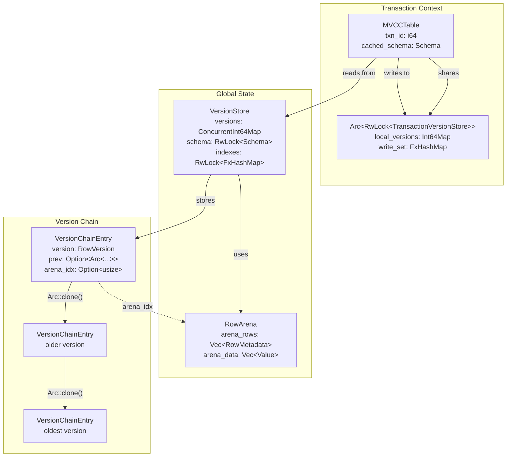

**Sources:** [src/storage/mvcc/version_store.rs:43-193](), [src/storage/mvcc/table.rs:36-93]()

---

## RowVersion Structure

Each row version is immutable once created and tracks its creation and deletion transactions:

```rust
pub struct RowVersion {
    pub txn_id: i64,              // Transaction that created this version
    pub deleted_at_txn_id: i64,   // 0 if not deleted
    pub data: Row,                // Complete row data
    pub row_id: i64,              // Row identifier
    pub create_time: i64,         // Timestamp (fast monotonic)
}
```

**Key Design Choices:**

1. **Complete row data storage** - Each version contains the full `Row`, not just deltas. This simplifies visibility checks at the cost of memory for updates.

2. **Separate create/delete txn_ids** - A version can be created by txn X and deleted by txn Y. The same `RowVersion` struct handles both states.

3. **Fast timestamp** - Uses `get_fast_timestamp()` (monotonic clock, ~15ns) instead of wall clock for ordering, avoiding syscall overhead.

**Sources:** [src/storage/mvcc/version_store.rs:43-87]()

---

## Version Chains with Arc Pointers

Version chains are implemented as linked lists using `Arc<VersionChainEntry>` for O(1) cloning:

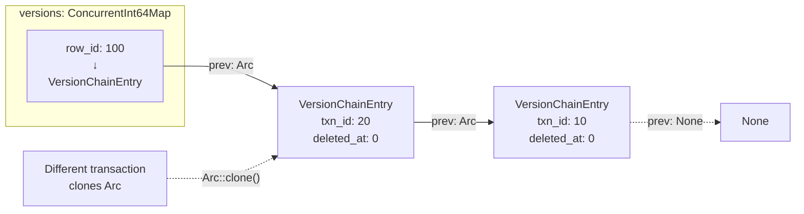

**Why Arc instead of Box?**

| Approach | Clone Cost | Memory | Snapshot Isolation |
|----------|-----------|--------|-------------------|
| `Box<VersionChainEntry>` | Deep copy O(n) | Low | Must copy entire chain |
| `Arc<VersionChainEntry>` | Increment refcount O(1) | +8 bytes per version | Share chain across snapshots |

Each `Arc::clone()` increments a reference count, enabling multiple transactions to share the same historical chain without copying. This is critical for snapshot isolation where multiple concurrent transactions see the same historical view.

**Sources:** [src/storage/mvcc/version_store.rs:110-119](), [src/storage/mvcc/version_store.rs:291-367]()

---

## VersionStore: Global Committed State

The `VersionStore` tracks the latest committed version chain for each row in a table:

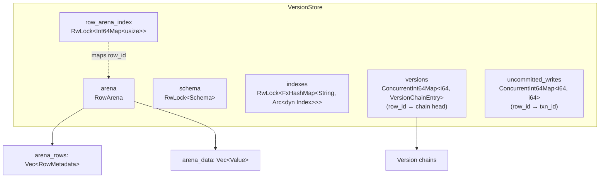

**Key Data Structures:**

1. **`versions: ConcurrentInt64Map<i64, VersionChainEntry>`** - Sharded hash map (DashMap) for concurrent lookups. Maps `row_id` to the head of the version chain.

2. **`arena: RowArena`** - Contiguous storage for zero-copy scans. Each committed version gets an arena slot.

3. **`row_arena_index: RwLock<Int64Map<usize>>`** - Maps `row_id` to its arena index for O(1) lookup during scans.

4. **`uncommitted_writes: ConcurrentInt64Map<i64, i64>`** - Tracks which transaction has an uncommitted write to each row. Used for write-write conflict detection.

**Why ConcurrentInt64Map instead of RwLock<BTreeMap>?**

The version store uses `ConcurrentInt64Map` (DashMap with i64 keys) for row version chains because:
- Point lookups dominate (most queries filter by PK or index)
- Sharded locking reduces write contention during commits
- Iteration (full scans) happens at a higher level using the arena

**Sources:** [src/storage/mvcc/version_store.rs:169-234]()

---

## Arena-Based Storage for Zero-Copy Scans

The `RowArena` stores row data contiguously in two parallel vectors:

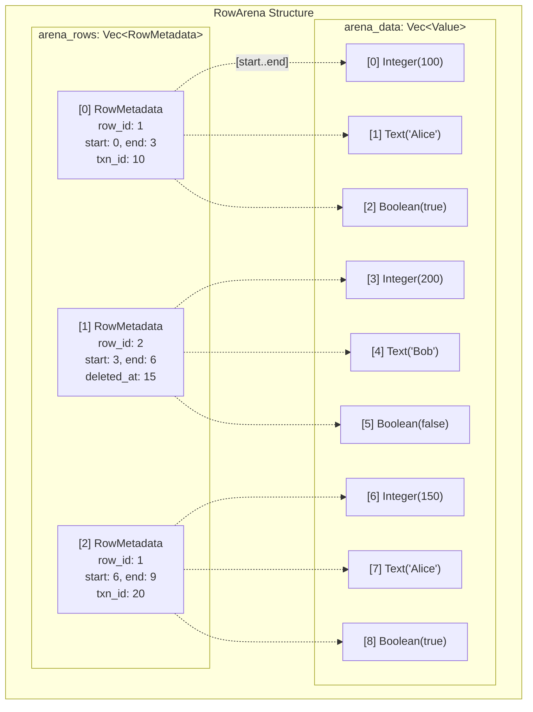

**Performance Benefits:**

| Operation | Without Arena | With Arena |
|-----------|--------------|------------|
| Full table scan (10K rows) | Clone each row: ~500μs | Slice + ref: ~10μs |
| Memory access pattern | Random (chase pointers) | Sequential (cache-friendly) |
| Lock acquisitions | O(N) per-row locks | O(1) arena lock |

The arena provides **50x+ speedup** for full table scans by:
1. Pre-acquiring arena locks once (not per-row)
2. Reading via `unsafe { arena_data_slice.get_unchecked(start..end) }` after bounds check
3. Sequential memory access for CPU cache optimization

**Trade-off:** Arena requires rebuilding when the version chain is updated. The system lazily rebuilds by setting `arena_idx: None` during batch commits.

**Sources:** [src/storage/mvcc/arena.rs](), [src/storage/mvcc/version_store.rs:755-817]()

---

## TransactionVersionStore: Uncommitted Changes

Each transaction maintains a `TransactionVersionStore` for local, uncommitted modifications:

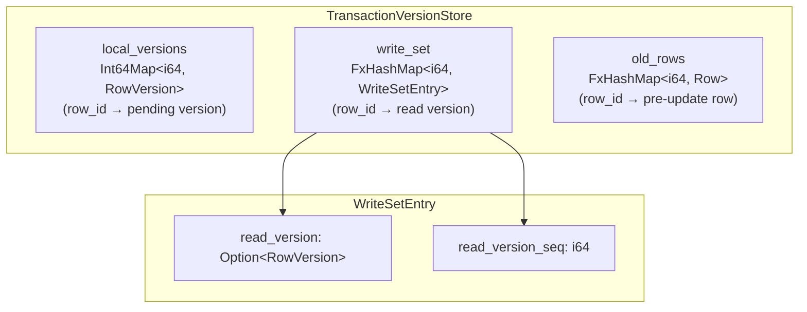

**Purpose of Each Field:**

1. **`local_versions`** - Stores the new version that will be committed. This includes:
   - Inserts: new rows not yet in global store
   - Updates: modified rows
   - Deletes: rows with `deleted_at_txn_id` set

2. **`write_set`** - Tracks the version read before writing. Used for optimistic concurrency control (conflict detection at commit time).

3. **`old_rows`** - Caches the row data before update for index maintenance during commit.

**Conflict Detection Flow:**

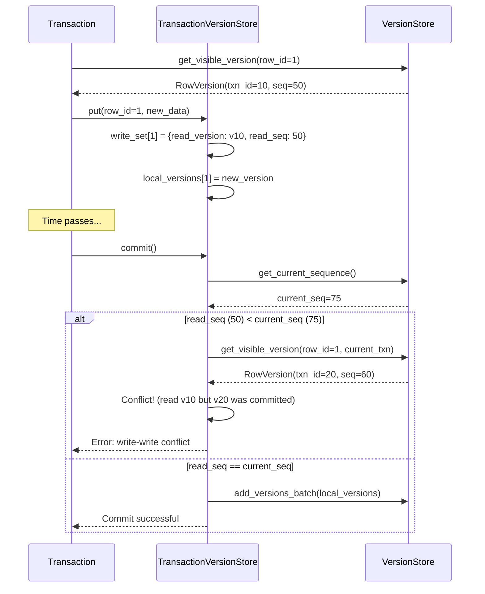

**Sources:** [src/storage/mvcc/transaction.rs:30-150]()

---

## MVCCTable: Transaction-Aware Table API

`MVCCTable` is the primary interface for SQL operations within a transaction:

```rust
pub struct MVCCTable {
    txn_id: i64,
    version_store: Arc<VersionStore>,
    txn_versions: Arc<RwLock<TransactionVersionStore>>,
    cached_schema: Schema,  // Avoids clone on every operation
}
```

**Key Methods:**

| Method | Purpose | Optimization |
|--------|---------|--------------|
| `insert()` | Add new row | PK auto-generation, unique constraint checks |
| `update()` | Modify rows | Batch get_visible_versions_for_update |
| `delete()` | Mark rows deleted | Sets `deleted_at_txn_id` |
| `scan()` | Query with filter | Index lookup → PK lookup → arena scan |
| `commit()` | Flush to VersionStore | Batch index updates, zone map invalidation |
| `rollback()` | Discard changes | O(1) - just drop TransactionVersionStore |

**Sources:** [src/storage/mvcc/table.rs:47-809]()

---

## Read Path: Query Execution

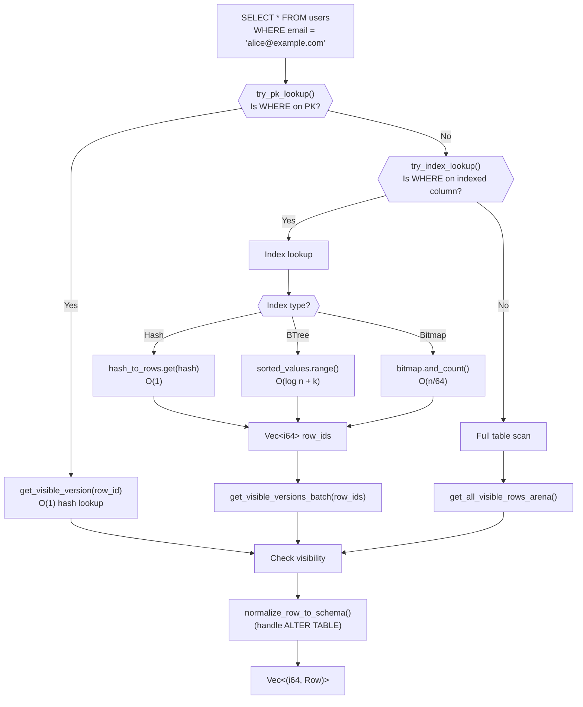

**Optimization: Index Selection Priority**

[src/storage/mvcc/table.rs:165-551]() implements a tiered lookup strategy:

1. **Primary Key Direct Lookup** - `try_pk_lookup()` detects `WHERE id = 123` and uses `get_visible_version(123)` for O(1) access.

2. **Multi-Column Index** - `get_multi_column_index()` finds indexes covering multiple WHERE clauses (e.g., `WHERE name = 'Alice' AND age = 30`).

3. **Single-Column Index** - Falls back to individual column indexes and intersects row_id sets.

4. **Full Scan with Arena** - `get_all_visible_rows_arena()` uses contiguous memory for cache-efficient iteration.

**Sources:** [src/storage/mvcc/table.rs:165-551](), [src/storage/mvcc/version_store.rs:755-817]()

---

## Write Path: Insert, Update, Delete

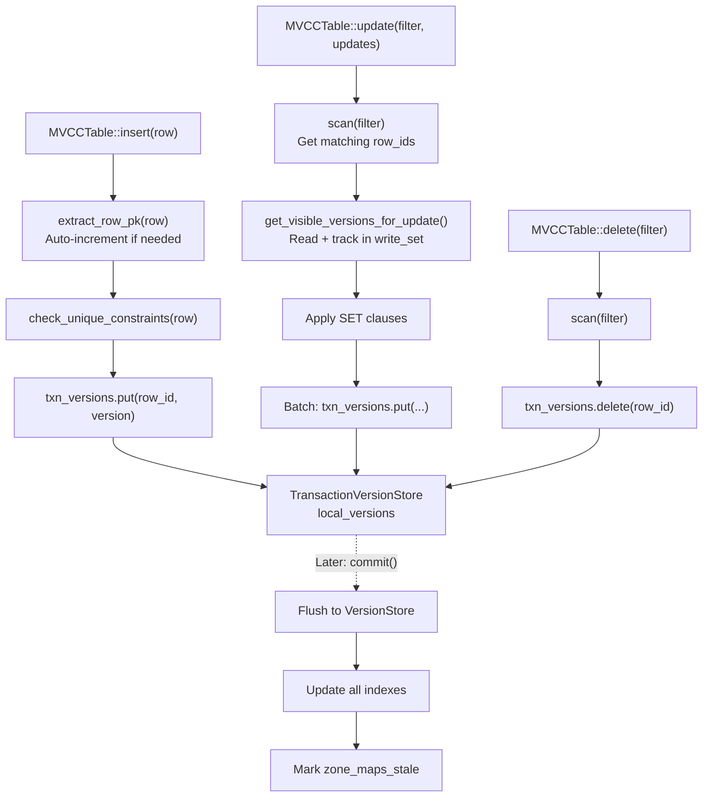

**Conflict Detection During Commit:**

When `commit()` is called, the system checks for write-write conflicts:

1. For each row in `write_set`, compare `read_version_seq` with current global sequence.
2. If another transaction committed a newer version, abort with `Error::WriteConflict`.
3. Otherwise, call `version_store.add_versions_batch()` to atomically publish changes.

**Index Maintenance:**

[src/storage/mvcc/table.rs:722-804]() updates indexes during commit:

```rust
// For each modified row:
if is_deleted {
    index.remove(old_values, row_id)
} else {
    match old_values {
        None => index.add(new_values, row_id),           // INSERT
        Some(old) if old != new => {
            index.remove(old, row_id);                    // UPDATE
            index.add(new_values, row_id);
        }
        _ => { /* unchanged */ }
    }
}
```

**Sources:** [src/storage/mvcc/table.rs:1026-1365](), [src/storage/mvcc/table.rs:722-804]()

---

## Row Normalization for Schema Evolution

OxiBase supports `ALTER TABLE ADD COLUMN` and `DROP COLUMN`. To handle rows written before schema changes, `normalize_row_to_schema()` adapts historical rows:

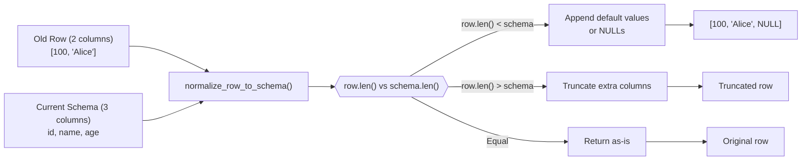

**Implementation:**

[src/storage/mvcc/table.rs:142-163]() performs normalization during reads:

```rust
fn normalize_row_to_schema(&self, mut row: Row, schema: &Schema) -> Row {
    let schema_cols = schema.columns.len();
    let row_cols = row.len();

    if row_cols < schema_cols {
        // Add new columns with default values
        for i in row_cols..schema_cols {
            let col = &schema.columns[i];
            if let Some(ref default_val) = col.default_value {
                row.push(default_val.clone());
            } else {
                row.push(Value::null(col.data_type));
            }
        }
    } else if row_cols > schema_cols {
        // Dropped columns - truncate
        row.truncate(schema_cols);
    }

    row
}
```

**Sources:** [src/storage/mvcc/table.rs:142-163](), [src/storage/mvcc/table.rs:846-903]()

---

## Index Lookup Optimizations

`MVCCTable::try_index_lookup()` implements several query pattern optimizations:

### 1. OR Expression with Hybrid Index Optimization

```sql
SELECT * FROM users WHERE email = 'alice@example.com' OR age = 30
```

If `email` is indexed but `age` is not:
- Uses index for `email = 'alice@example.com'` to get candidate row_ids
- Falls back to full scan for the OR clause
- Returns `None` (no pure index optimization possible)

If both are indexed:
- Uses both indexes and unions the row_id sets: `union_sorted_ids(email_ids, age_ids)`

**Sources:** [src/storage/mvcc/table.rs:222-272]()

### 2. IN List Expression

```sql
SELECT * FROM users WHERE status IN ('active', 'pending', 'approved')
```

Instead of 3 separate equality lookups, uses `index.get_row_ids_in(values)` for batch fetch.

**Sources:** [src/storage/mvcc/table.rs:276-291]()

### 3. LIKE Prefix Pattern

```sql
SELECT * FROM users WHERE name LIKE 'John%'
```

Converts to range scan: `['John', 'John\uffff')` using BTree index's `find_range()`.

**Sources:** [src/storage/mvcc/table.rs:295-320]()

### 4. Multi-Column Index Matching

```sql
SELECT * FROM orders WHERE customer_id = 123 AND status = 'shipped'
```

Uses `get_multi_column_index(&["customer_id", "status"])` for single index lookup instead of intersecting two single-column indexes.

**Sources:** [src/storage/mvcc/table.rs:337-442]()

---

## Write-Write Conflict Detection

OxiBase uses **optimistic concurrency control** with conflict detection at commit time:

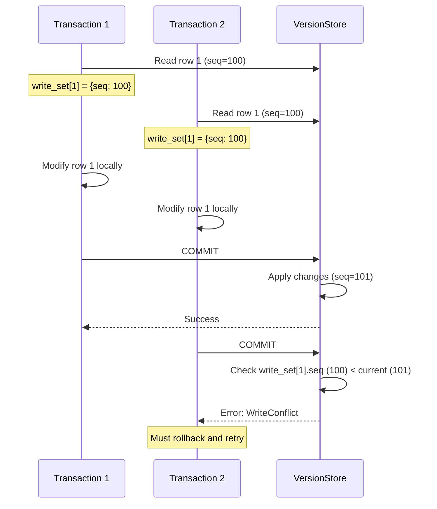

**Implementation Details:**

[src/storage/mvcc/transaction.rs]() implements the conflict check:

```rust
pub fn commit(&self) -> Result<()> {
    // Get current global sequence
    let current_seq = self.registry.get_current_sequence();
    
    // Check each write for conflicts
    for (row_id, write_entry) in &self.write_set {
        if write_entry.read_version_seq < current_seq {
            // Another transaction committed a newer version
            let latest_version = self.version_store.get_visible_version(
                *row_id, 
                self.txn_id
            );
            
            if latest_version.is_some() {
                // Row was modified by another transaction
                return Err(Error::WriteConflict);
            }
        }
    }
    
    // No conflicts - apply changes
    self.version_store.add_versions_batch(self.local_versions);
    Ok(())
}
```

**Sources:** [src/storage/mvcc/transaction.rs:200-350]()

---

## Memory Management and Cleanup

### Garbage Collection of Old Versions

The system does **not** currently implement automatic garbage collection. Version chains grow unbounded, which can cause memory exhaustion for workloads with many updates.

Future enhancement: [ROADMAP.md]() mentions implementing a vacuum process to prune versions no longer visible to any active transaction.

### Arena Lazy Rebuild

When batch commits occur, `arena_idx` is set to `None` to avoid expensive per-row arena updates:

```rust
pub fn add_versions_batch(&self, batch: Vec<(i64, RowVersion)>) {
    for (row_id, version) in batch {
        let entry = VersionChainEntry {
            version,
            prev: /* chain to previous */,
            arena_idx: None,  // Skip arena - rebuild on next scan
        };
        self.versions.insert(row_id, entry);
    }
}
```

The next full table scan will rebuild the arena using `get_all_visible_rows_arena()`.

**Sources:** [src/storage/mvcc/version_store.rs:369-421]()

---

## Integration with Transaction Registry

`VersionStore` uses the `VisibilityChecker` trait to determine which versions are visible to a transaction:

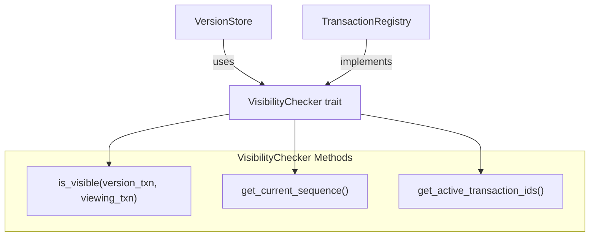

For details on visibility rules and isolation levels, see [MVCC Architecture](#4.1).

**Sources:** [src/storage/mvcc/version_store.rs:132-155](), [src/storage/mvcc/engine.rs:1-50]()