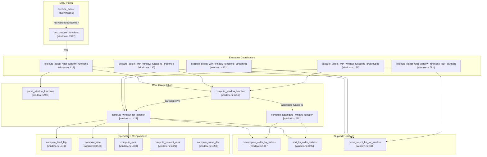
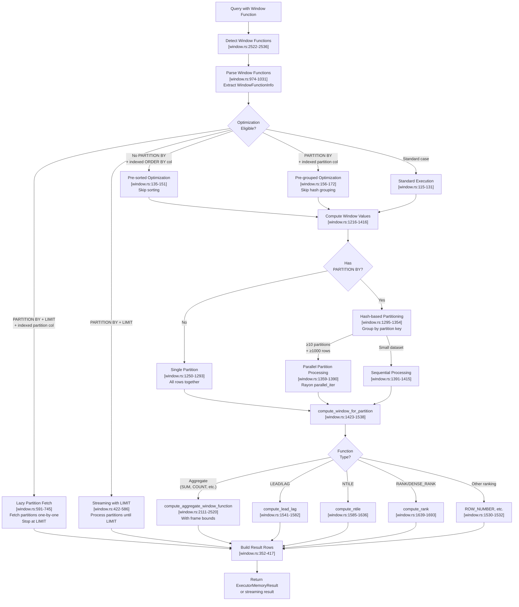

# Page: Window Functions

# Window Functions

<details>
<summary>Relevant source files</summary>

The following files were used as context for generating this wiki page:

- [src/executor/query.rs](src/executor/query.rs)
- [src/executor/window.rs](src/executor/window.rs)

</details>


This document describes the window function execution system in OxiBase. Window functions perform calculations across sets of table rows that are related to the current row, without collapsing rows like aggregate functions with GROUP BY.

For aggregate functions with GROUP BY, see [Aggregation and GROUP BY](#3.4). For the overall query execution pipeline, see [Query Execution Pipeline](#3.1).

## Purpose and Scope

The window function system provides SQL window function support (OVER clause) with the following capabilities:

- **Ranking functions**: `ROW_NUMBER()`, `RANK()`, `DENSE_RANK()`, `NTILE(n)`, `PERCENT_RANK()`, `CUME_DIST()`
- **Offset functions**: `LEAD()`, `LAG()`, `FIRST_VALUE()`, `LAST_VALUE()`, `NTH_VALUE()`
- **Aggregate window functions**: `SUM()`, `COUNT()`, `AVG()`, `MIN()`, `MAX()` used with OVER clause
- **Window specifications**: `PARTITION BY`, `ORDER BY`, `ROWS`/`RANGE` frame clauses
- **Performance optimizations**: Index-based pre-sorting, pre-grouped partitions, LIMIT pushdown, parallel partition processing

Sources: [src/executor/window.rs:1-2813]()

## Supported Window Functions

### Ranking Functions

| Function | Description | Example |
|----------|-------------|---------|
| `ROW_NUMBER()` | Sequential numbering within partition | `ROW_NUMBER() OVER (ORDER BY salary)` |
| `RANK()` | Ranking with gaps for ties | `RANK() OVER (ORDER BY score)` |
| `DENSE_RANK()` | Ranking without gaps | `DENSE_RANK() OVER (ORDER BY score)` |
| `NTILE(n)` | Divide rows into n buckets | `NTILE(4) OVER (ORDER BY salary)` |
| `PERCENT_RANK()` | (rank - 1) / (total - 1) | `PERCENT_RANK() OVER (ORDER BY score)` |
| `CUME_DIST()` | Cumulative distribution | `CUME_DIST() OVER (ORDER BY score)` |

### Offset Functions

| Function | Description | Example |
|----------|-------------|---------|
| `LEAD(col, offset, default)` | Access next row's value | `LEAD(price, 1, 0) OVER (ORDER BY date)` |
| `LAG(col, offset, default)` | Access previous row's value | `LAG(price, 1, 0) OVER (ORDER BY date)` |
| `FIRST_VALUE(col)` | First value in window frame | `FIRST_VALUE(price) OVER (ORDER BY date)` |
| `LAST_VALUE(col)` | Last value in window frame | `LAST_VALUE(price) OVER (ORDER BY date)` |
| `NTH_VALUE(col, n)` | Nth value in window frame | `NTH_VALUE(price, 3) OVER (ORDER BY date)` |

### Aggregate Window Functions

Standard aggregate functions (`SUM`, `COUNT`, `AVG`, `MIN`, `MAX`) can be used with `OVER` clauses to compute running aggregates:

```sql
SELECT name, salary, 
       SUM(salary) OVER (PARTITION BY dept ORDER BY hire_date) AS running_total
FROM employees;
```

Sources: [src/executor/window.rs:15-30](), [src/executor/window.rs:1496-1532]()

## Window Clauses

### PARTITION BY

Divides rows into partitions (groups) before computing the window function. Each partition is processed independently.

```sql
SELECT dept, name, ROW_NUMBER() OVER (PARTITION BY dept ORDER BY salary) 
FROM employees;
```

### ORDER BY

Defines the logical ordering of rows within each partition. Required for offset functions and affects frame bounds for aggregate window functions.

```sql
SELECT name, RANK() OVER (ORDER BY salary DESC) FROM employees;
```

### Window Frames

Window frames define the subset of rows within a partition for aggregate window functions. Syntax:

```sql
ROWS BETWEEN frame_start AND frame_end
RANGE BETWEEN frame_start AND frame_end
```

Frame bounds:
- `UNBOUNDED PRECEDING`: Start of partition
- `n PRECEDING`: n rows/values before current row
- `CURRENT ROW`: Current row
- `n FOLLOWING`: n rows/values after current row
- `UNBOUNDED FOLLOWING`: End of partition

Default frame:
- Without `ORDER BY`: Entire partition
- With `ORDER BY`: `RANGE BETWEEN UNBOUNDED PRECEDING AND CURRENT ROW`

Sources: [src/executor/window.rs:1750-1815](), [src/executor/window.rs:2258-2462]()

## Architecture Overview



Sources: [src/executor/window.rs:115-745](), [src/executor/window.rs:974-2643]()

## Execution Pipeline

### Window Function Execution Flow



Sources: [src/executor/window.rs:115-745](), [src/executor/window.rs:1216-2520]()

## Key Data Structures

### WindowFunctionInfo

Parsed metadata about a window function call in the SELECT list.

```rust
struct WindowFunctionInfo {
    name: String,                      // "ROW_NUMBER", "RANK", etc.
    arguments: Vec<Expression>,         // Function arguments (e.g., column for LAG)
    partition_by: Vec<String>,          // PARTITION BY column names
    order_by: Vec<OrderByExpression>,   // ORDER BY specifications
    frame: Option<WindowFrame>,         // Frame specification (ROWS/RANGE)
    column_name: String,                // Result column name
    column_index: usize,                // Index in SELECT list
    is_distinct: bool,                  // For COUNT(DISTINCT col)
}
```

Sources: [src/executor/window.rs:52-72]()

### SelectItemSource

Tracks how each SELECT item should be computed after window functions are evaluated.

```rust
enum SelectItemSource {
    BaseColumn(usize),                           // Direct column reference
    WindowFunction(String),                       // Window function result (lowercase key)
    Expression(Expression),                       // Expression to evaluate
    ExpressionWithWindow(Expression, String),     // Expression containing window function
}
```

Sources: [src/executor/window.rs:80-90]()

### Optimization State Structures

**WindowPreSortedState**: Indicates rows are pre-sorted by an indexed column.

```rust
struct WindowPreSortedState {
    column: String,      // Column name (lowercase)
    ascending: bool,     // Sort direction
}
```

**WindowPreGroupedState**: Pre-grouped partitions from index-based fetching.

```rust
struct WindowPreGroupedState {
    column: String,                                    // Partition column (lowercase)
    partition_map: FxHashMap<PartitionKey, Vec<usize>>, // Pre-built partition map
}
```

**PartitionKey**: Stack-allocated for common cases (≤4 columns).

```rust
type PartitionKey = SmallVec<[Value; 4]>;
```

Sources: [src/executor/window.rs:92-111](), [src/executor/window.rs:39-40]()

## Optimization Strategies

### 1. Index-Based Pre-Sorting

When `ORDER BY` references an indexed column and there's no `PARTITION BY`, rows are fetched in sorted order from the index, skipping the O(n log n) sort.

**Detection Logic**:
```
query.rs:1920-1943 - extract_window_order_info
query.rs:1930-1932 - Check if ORDER BY column has index
query.rs:1929-1932 - Fetch rows using collect_rows_ordered_by_index
```

**Execution Path**:
- [src/executor/query.rs:1836-1952]() - Window optimization detection
- [src/executor/window.rs:2061-2089]() - `check_rows_presorted`
- [src/executor/window.rs:1434]() - `skip_sorting` parameter

Sources: [src/executor/query.rs:1836-1952](), [src/executor/window.rs:2061-2089]()

### 2. Index-Based Pre-Grouping

When `PARTITION BY` references an indexed column, rows are fetched grouped by partition value, eliminating O(n) hash-based grouping.

**Detection Logic**:
```
query.rs:1841-1918 - extract_window_partition_info
query.rs:1880-1903 - collect_rows_grouped_by_partition
```

**Execution Path**:
- [src/executor/query.rs:1880-1912]() - Fetch pre-grouped partitions
- [src/executor/window.rs:1316-1319]() - Use `pre_grouped.partition_map` directly

Sources: [src/executor/query.rs:1841-1918](), [src/executor/window.rs:1312-1354]()

### 3. LIMIT Pushdown with Streaming

For queries with `PARTITION BY` + `LIMIT`, partitions are processed one at a time and execution stops when LIMIT is reached. This is similar to SQLite's optimization.

**Entry Conditions**:
- Has `PARTITION BY` clause
- Has `LIMIT` clause
- No pre-grouped optimization available

**Execution Path**:
- [src/executor/window.rs:198-220]() - Detect streaming eligibility
- [src/executor/window.rs:422-586]() - `execute_select_with_window_functions_streaming`
- [src/executor/window.rs:502-525]() - Early exit when `result_rows.len() >= limit`

Sources: [src/executor/window.rs:198-220](), [src/executor/window.rs:422-586]()

### 4. Lazy Partition Fetching

When `PARTITION BY` references an indexed column AND there's a `LIMIT` without `ORDER BY` at the query level, partitions are fetched lazily one at a time from the index until LIMIT is satisfied.

**Entry Conditions**:
- Has indexed `PARTITION BY` column
- Has `LIMIT` without top-level `ORDER BY`
- Function: [src/executor/query.rs:1851-1872]()

**Key Benefits**:
- Avoids fetching all rows from table
- Avoids building complete partition map
- Can terminate after fetching first few partitions

**Execution Path**:
- [src/executor/query.rs:1851-1872]() - Detection and invocation
- [src/executor/window.rs:591-745]() - `execute_select_with_window_functions_lazy_partition`
- [src/executor/window.rs:631-649]() - `get_partition_values` (lazy iterator)
- [src/executor/window.rs:640-650]() - Early exit at LIMIT

Sources: [src/executor/query.rs:1851-1872](), [src/executor/window.rs:591-745]()

### 5. Parallel Partition Processing

For queries with many partitions (≥10) and large datasets (≥1000 rows), partitions are processed concurrently using Rayon.

**Entry Conditions**:
```rust
let use_parallel = partition_count >= 10 && rows.len() >= 1000;
```

**Execution Path**:
- [src/executor/window.rs:1359]() - Parallel threshold check
- [src/executor/window.rs:1362-1390]() - Parallel execution with `rayon::par_iter()`
- [src/executor/window.rs:1368-1379]() - Concurrent partition processing

Sources: [src/executor/window.rs:1356-1415]()

### 6. Precomputed ORDER BY Values

ORDER BY expressions are evaluated once for all rows, then reused for every partition. This avoids O(n × p) redundant evaluations where p is the number of partitions.

**Implementation**:
- [src/executor/window.rs:1299-1309]() - Precompute once before partitioning
- [src/executor/window.rs:1967-2059]() - `precompute_order_by_values` function
- [src/executor/window.rs:1438-1442]() - Pass precomputed values to partition function

**Benefits**:
- Reduces time complexity from O(n × p) to O(n)
- Critical for complex ORDER BY expressions (e.g., `ORDER BY COALESCE(SUM(val), 0)`)

Sources: [src/executor/window.rs:1299-1309](), [src/executor/window.rs:1967-2059]()

## Frame Computation

### ROWS vs RANGE Frames

**ROWS frames**: Physical offset based on row positions
- `ROWS BETWEEN 1 PRECEDING AND 1 FOLLOWING`: 1 row before/after current

**RANGE frames**: Logical offset based on ORDER BY values
- `RANGE BETWEEN 1 PRECEDING AND CURRENT ROW`: All rows with ORDER BY value ≥ (current - 1)

### Peer Group Optimization

For RANGE frames, rows with identical ORDER BY values are "peers". Instead of checking every row for peer status (O(n²)), peer group boundaries are precomputed in O(n) after sorting.

**Implementation**:
- [src/executor/window.rs:2216-2250]() - Precompute peer groups
- [src/executor/window.rs:2294]() - O(1) lookup: `peer_groups[i].0` (start)
- [src/executor/window.rs:2375]() - O(1) lookup: `peer_groups[i].1` (end)

**Example**:
```
Rows sorted by score: [100, 100, 95, 95, 95, 90]
Peer groups:          [(0,2), (0,2), (2,5), (2,5), (2,5), (5,6)]
```

Sources: [src/executor/window.rs:2216-2250](), [src/executor/window.rs:2283-2456]()

## Performance Considerations

### Memory Management

- **SmallVec for partition keys**: [src/executor/window.rs:39-40]() - Avoids heap allocation for ≤4 partition columns
- **FxHashMap**: [src/executor/window.rs:1321]() - Faster than default HashMap for trusted keys
- **Pre-allocated result vectors**: [src/executor/window.rs:1491]() - `Vec::with_capacity`

### Expression Evaluation

- **MultiExpressionEval**: [src/executor/window.rs:324-350]() - Batch compilation of multiple expressions
- **Reusable evaluators**: [src/executor/window.rs:332-350]() - Set row, evaluate, reuse for next row
- **Pre-compiled filters**: [src/executor/window.rs:1986-2023]() - Compile once, reuse for all rows

### Sorting Optimization

- **Skip sorting when pre-sorted**: [src/executor/window.rs:2061-2089]()
- **Sort indices, not rows**: [src/executor/window.rs:1444]() - Avoids moving large row data
- **Precomputed ORDER BY values**: [src/executor/window.rs:1967-2059]() - Avoid re-evaluating expressions

Sources: [src/executor/window.rs:39-40](), [src/executor/window.rs:324-350](), [src/executor/window.rs:1967-2059]()