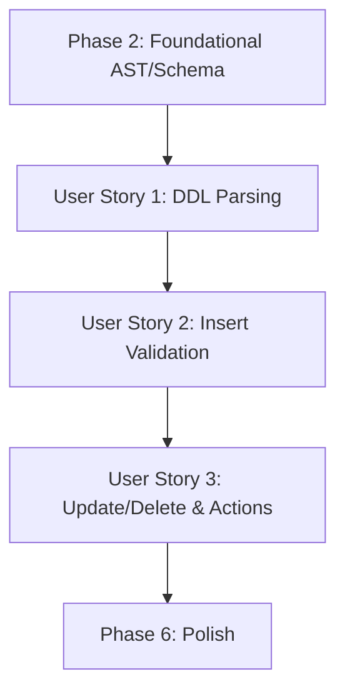

# Implementation Tasks: Foreign Key Constraints

**Feature**: Foreign Key Constraints
**Document Version**: 1.0
**Spec Reference**: [specs/001-foreign-key/spec.md](spec.md)
**Plan Reference**: [specs/001-foreign-key/plan.md](plan.md)

## Implementation Strategy

This feature will be implemented incrementally, ensuring each user story is fully testable and delivers a specific piece of the feature.

1. **Phase 1 & 2**: Setup and foundational extensions (AST and Schema core types).
2. **Phase 3 (US1)**: Implement DDL operations. This allows tables with foreign keys to be defined and parsed, resulting in correctly populated schemas.
3. **Phase 4 (US2)**: Implement DML validation for Inserts. This ensures referential integrity when adding new records.
4. **Phase 5 (US3)**: Implement DML validation for Updates/Deletes and referential actions (CASCADE, SET NULL).
5. **Phase 6**: Polish and edge-case handling.

## Task Dependencies

## Phase 1: Setup
*(Project initialization and shared scaffolding)*

- [x] T001 Define testing plan (e.g., unit tests for parser, integration tests for execution) in `specs/001-foreign-key/testing-plan.md`.

## Phase 2: Foundational
*(Blocking prerequisites that multiple stories depend on)*

- [x] T002 Update core `Error` type to include `ReferentialIntegrityViolation` in `src/core/error.rs`
- [x] T003 Update `ReferentialAction` enum (Restrict, Cascade, SetNull, NoAction) in `src/parser/ast.rs`
- [x] T004 Update `TableConstraint` to include `ForeignKey` in `src/parser/ast.rs`
- [x] T005 Add `ForeignKeyMetadata` struct in `src/core/schema.rs`
- [x] T006 Update `TableSchema` struct to include `foreign_keys` and `referenced_by` vectors in `src/core/schema.rs`

## Phase 3: Defining a Foreign Key Constraint (User Story 1)

**Story Goal**: As a database user, I want to define a foreign key constraint when creating a table or altering an existing table so that I can establish a relationship between columns in two tables.
**Priority**: P1
**Independent Test**: Can be tested by parsing `CREATE TABLE` and `ALTER TABLE ADD CONSTRAINT` statements with `FOREIGN KEY` definitions and verifying the resulting AST and logical schema.

- [x] T007 [P] [US1] Write unit tests for parsing `FOREIGN KEY` constraints in `CREATE TABLE` in `src/parser/parser.rs`
- [x] T008 [P] [US1] Write unit tests for parsing `FOREIGN KEY` constraints in `ALTER TABLE` in `src/parser/parser.rs`
- [x] T009 [US1] Implement `CREATE TABLE` parser logic for `FOREIGN KEY` clauses in `src/parser/parser.rs`
- [x] T010 [US1] Implement `ALTER TABLE ADD CONSTRAINT` parser logic for `FOREIGN KEY` clauses in `src/parser/parser.rs`
- [x] T011 [US1] Update `CREATE TABLE` execution logic to validate and populate `ForeignKeyMetadata` and update referenced table's `referenced_by` list in `src/executor/ddl.rs`
- [x] T012 [US1] Update `ALTER TABLE` execution logic to validate existing data against new constraint before adding it in `src/executor/ddl.rs`
- [x] T013 [P] [US1] Add integration test for successful `CREATE TABLE` and `ALTER TABLE` with foreign keys in `tests/integration/ddl.rs`

## Phase 4: Enforcing Referential Integrity on Insert (User Story 2)

**Story Goal**: As a database user, I want the database to prevent me from inserting rows into a table if the foreign key value does not exist in the referenced table.
**Priority**: P1
**Independent Test**: Can be tested by inserting valid and invalid rows into a table with an established foreign key constraint and verifying success or failure.

- [x] T014 [US2] Implement FK validation lookup logic in `src/storage/table.rs` (checking referenced table)
- [x] T015 [US2] Update `insert` execution logic to invoke validation lookup before writing the row in `src/storage/table.rs` (or `src/executor/dml.rs` if appropriate based on architecture)
- [x] T016 [US2] Update `update` execution logic (on the referencing table) to invoke validation lookup before modifying the FK column in `src/storage/table.rs` (or `src/executor/dml.rs`)
- [x] T017 [P] [US2] Add integration test for successful insert with valid FK in `tests/integration/fk_insert.rs`
- [x] T018 [P] [US2] Add integration test for failed insert with invalid FK in `tests/integration/fk_insert.rs`
- [x] T019 [P] [US2] Add integration test for successful insert with NULL FK in `tests/integration/fk_insert.rs`

## Phase 5: Enforcing Referential Integrity on Delete/Update (User Story 3)

**Story Goal**: As a database user, I want the database to prevent me from deleting or updating rows in the referenced table if those rows are currently referenced by a foreign key in another table.
**Priority**: P2
**Independent Test**: Can be tested by attempting to delete or update referenced rows and verifying that the operation is blocked when appropriate.

- [x] T020 [US3] Implement referential action execution logic (Restrict, Cascade, SetNull) in `src/storage/table.rs` (or `src/executor/dml.rs`)
- [x] T021 [US3] Update `delete` execution logic to check `referenced_by` tables and execute configured referential actions before deleting in `src/storage/table.rs` (or `src/executor/dml.rs`)
- [x] T022 [US3] Update `update` execution logic (on the referenced table's PK) to check `referenced_by` tables and execute configured referential actions in `src/storage/table.rs` (or `src/executor/dml.rs`)
- [x] T023 [P] [US3] Add integration test for blocked delete (RESTRICT) in `tests/integration/fk_actions.rs`
- [x] T024 [P] [US3] Add integration test for cascading delete (CASCADE) in `tests/integration/fk_actions.rs`
- [x] T025 [P] [US3] Add integration test for set null on delete (SET NULL) in `tests/integration/fk_actions.rs`

## Phase 6: Polish

- [x] T026 Add tests for self-referencing foreign keys (table referencing itself) in `tests/integration/fk_edge_cases.rs`
- [x] T027 Add validation to prevent cyclic dependency loops that cannot be satisfied without deferred constraints in `src/executor/ddl.rs`
- [x] T028 Review memory allocations in the validation hot-paths to ensure zero-copy principles are maintained in `src/storage/table.rs`.
- [x] T029 Run `make lint`, `cargo nextest run`, and `make license` to ensure all tests pass, formatting is correct, and Apache-2.0 headers are present.
- [x] T030 Add benchmark to verify INSERT performance regression is < 15% in `benches/fk_insert.rs`.