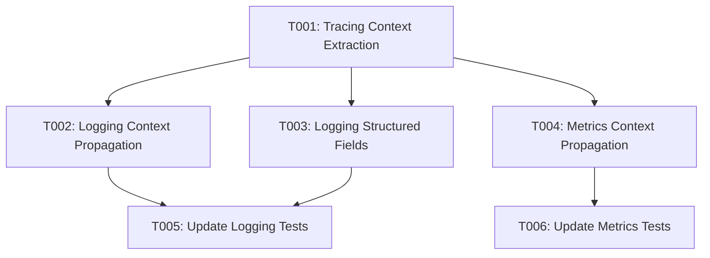

# Implementation Tasks: Telemetry Correlation

**Feature**: Telemetry Correlation
**Spec**: [spec.md](spec.md) | **Plan**: [plan.md](plan.md)
**Dependencies**: `tracing`, `tracing-subscriber`, `serde_json`, `chrono`, `crossbeam_channel`

## Execution Strategy

- **Phase 1 (Setup)**: Not applicable, as this is an enhancement to existing modules.
- **Phase 2 (Foundational)**: Update `tracing.rs` to generate and store `trace_id` and `span_id` in the span extensions. This is a prerequisite for both logs and metrics correlation.
- **Phase 3 (Scenario 1 & 3)**: Update `logging.rs` to extract trace context, capture all structured fields as JSON, and persist them. 
- **Phase 4 (Scenario 2)**: Update `metrics.rs` to extract trace context and append them to the metrics attributes payload.
- **Phase 5 (Polish)**: Update integration tests.

## Dependencies & Task Graph

## Task Checklist

### Phase 2: Foundational (Tracing Extension Updates)
> **Goal**: Ensure `trace_id` and `span_id` are generated at span creation and available throughout the span's lifecycle.

- [x] T001 Update `SystemTraceLayer::on_new_span` in `src/common/tracing.rs` to generate and store `trace_id` and `span_id` inside the span extensions tuple. Adjust `on_record` and `on_close` to use the updated tuple signature.

### Phase 3: Correlating Logs & Capturing Fields
> **Goal**: [US1] Correlating Logs with a Trace & [US3] Missing Fields Fallback
> **Test Criteria**: Logs emitted within a span contain `trace_id`, `span_id`, and `json_fields` populated with all extra attributes.

- [x] T002 [US1] Update `InternalLogLayer` in `src/common/logging.rs` to require `LookupSpan` and extract `trace_id` and `span_id` from the active span context in `on_event`.
- [x] T003 [US3] Rewrite `LogVisitor` in `src/common/logging.rs` to capture all fields into a `serde_json::Map`, explicitly handle `message`, add `json_fields` to `LogEntry`, and update `insert_log_batch` to insert the serialized JSON.

### Phase 4: Correlating Metrics
> **Goal**: [US2] Correlating Metrics with a Trace
> **Test Criteria**: Metrics emitted within a span include `trace_id` and `span_id` in their JSON `attributes`.

- [x] T004 [US2] Update `SystemMetricsLayer` in `src/common/metrics.rs` to require `LookupSpan`, extract `trace_id` and `span_id` from the active span context, and insert them into the `attributes` map before generating the `MetricEvent`.

### Phase 5: Polish & Integration Tests
> **Goal**: Ensure changes work correctly and do not break existing telemetry flows.

- [x] T005 [P] Update `tests/tracing_ingestion.rs` (or create `logging_ingestion.rs`) to assert that logs emitted within a span correctly store the trace context and JSON fields.
- [x] T006 [P] Update `tests/metrics_ingestion_test.rs` to assert that metrics emitted within a span correctly append the trace context to their attributes.